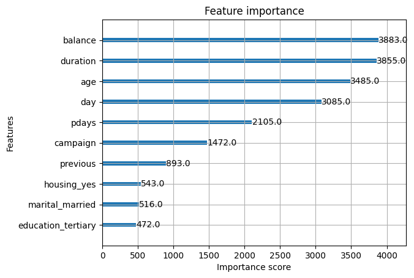
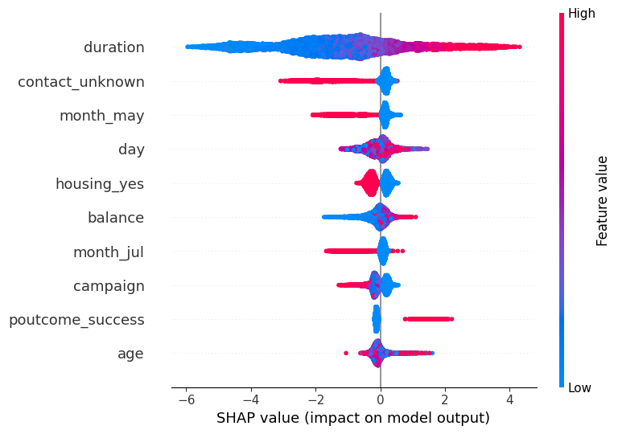

# Bank Customer Deposit Analysis

## Lets make predictions on whether customers will subscribe to a term deposit


```python
#import libraries
import pandas as pd
import xgboost as xgb
import numpy as np

#importing dataset
data = pd.read_csv("/Users/bayowaonabajo/Downloads/XGBoost for Business in Python and R/bank-full.csv", sep = ";")
data.dtypes

```


    age           int64
    job          object
    marital      object
    education    object
    default      object
    balance       int64
    housing      object
    loan         object
    contact      object
    day           int64
    month        object
    duration      int64
    campaign      int64
    pdays         int64
    previous      int64
    poutcome     object
    y            object
    dtype: object


### Explore customer demographics, financials , and previous interactions.This gives us a breakdown of customer details in bits.


```python
data.head(10)
```


<div>
<style scoped>
    .dataframe tbody tr th:only-of-type {
        vertical-align: middle;
    }

    .dataframe tbody tr th {
        vertical-align: top;
    }

    .dataframe thead th {
        text-align: right;
    }
</style>
<table border="1" class="dataframe">
  <thead>
    <tr style="text-align: right;">
      <th></th>
      <th>age</th>
      <th>job</th>
      <th>marital</th>
      <th>education</th>
      <th>default</th>
      <th>balance</th>
      <th>housing</th>
      <th>loan</th>
      <th>contact</th>
      <th>day</th>
      <th>month</th>
      <th>duration</th>
      <th>campaign</th>
      <th>pdays</th>
      <th>previous</th>
      <th>poutcome</th>
      <th>y</th>
    </tr>
  </thead>
  <tbody>
    <tr>
      <th>0</th>
      <td>58</td>
      <td>management</td>
      <td>married</td>
      <td>tertiary</td>
      <td>no</td>
      <td>2143</td>
      <td>yes</td>
      <td>no</td>
      <td>unknown</td>
      <td>5</td>
      <td>may</td>
      <td>261</td>
      <td>1</td>
      <td>-1</td>
      <td>0</td>
      <td>unknown</td>
      <td>no</td>
    </tr>
    <tr>
      <th>1</th>
      <td>44</td>
      <td>technician</td>
      <td>single</td>
      <td>secondary</td>
      <td>no</td>
      <td>29</td>
      <td>yes</td>
      <td>no</td>
      <td>unknown</td>
      <td>5</td>
      <td>may</td>
      <td>151</td>
      <td>1</td>
      <td>-1</td>
      <td>0</td>
      <td>unknown</td>
      <td>no</td>
    </tr>
    <tr>
      <th>2</th>
      <td>33</td>
      <td>entrepreneur</td>
      <td>married</td>
      <td>secondary</td>
      <td>no</td>
      <td>2</td>
      <td>yes</td>
      <td>yes</td>
      <td>unknown</td>
      <td>5</td>
      <td>may</td>
      <td>76</td>
      <td>1</td>
      <td>-1</td>
      <td>0</td>
      <td>unknown</td>
      <td>no</td>
    </tr>
    <tr>
      <th>3</th>
      <td>47</td>
      <td>blue-collar</td>
      <td>married</td>
      <td>unknown</td>
      <td>no</td>
      <td>1506</td>
      <td>yes</td>
      <td>no</td>
      <td>unknown</td>
      <td>5</td>
      <td>may</td>
      <td>92</td>
      <td>1</td>
      <td>-1</td>
      <td>0</td>
      <td>unknown</td>
      <td>no</td>
    </tr>
    <tr>
      <th>4</th>
      <td>33</td>
      <td>unknown</td>
      <td>single</td>
      <td>unknown</td>
      <td>no</td>
      <td>1</td>
      <td>no</td>
      <td>no</td>
      <td>unknown</td>
      <td>5</td>
      <td>may</td>
      <td>198</td>
      <td>1</td>
      <td>-1</td>
      <td>0</td>
      <td>unknown</td>
      <td>no</td>
    </tr>
    <tr>
      <th>5</th>
      <td>35</td>
      <td>management</td>
      <td>married</td>
      <td>tertiary</td>
      <td>no</td>
      <td>231</td>
      <td>yes</td>
      <td>no</td>
      <td>unknown</td>
      <td>5</td>
      <td>may</td>
      <td>139</td>
      <td>1</td>
      <td>-1</td>
      <td>0</td>
      <td>unknown</td>
      <td>no</td>
    </tr>
    <tr>
      <th>6</th>
      <td>28</td>
      <td>management</td>
      <td>single</td>
      <td>tertiary</td>
      <td>no</td>
      <td>447</td>
      <td>yes</td>
      <td>yes</td>
      <td>unknown</td>
      <td>5</td>
      <td>may</td>
      <td>217</td>
      <td>1</td>
      <td>-1</td>
      <td>0</td>
      <td>unknown</td>
      <td>no</td>
    </tr>
    <tr>
      <th>7</th>
      <td>42</td>
      <td>entrepreneur</td>
      <td>divorced</td>
      <td>tertiary</td>
      <td>yes</td>
      <td>2</td>
      <td>yes</td>
      <td>no</td>
      <td>unknown</td>
      <td>5</td>
      <td>may</td>
      <td>380</td>
      <td>1</td>
      <td>-1</td>
      <td>0</td>
      <td>unknown</td>
      <td>no</td>
    </tr>
    <tr>
      <th>8</th>
      <td>58</td>
      <td>retired</td>
      <td>married</td>
      <td>primary</td>
      <td>no</td>
      <td>121</td>
      <td>yes</td>
      <td>no</td>
      <td>unknown</td>
      <td>5</td>
      <td>may</td>
      <td>50</td>
      <td>1</td>
      <td>-1</td>
      <td>0</td>
      <td>unknown</td>
      <td>no</td>
    </tr>
    <tr>
      <th>9</th>
      <td>43</td>
      <td>technician</td>
      <td>single</td>
      <td>secondary</td>
      <td>no</td>
      <td>593</td>
      <td>yes</td>
      <td>no</td>
      <td>unknown</td>
      <td>5</td>
      <td>may</td>
      <td>55</td>
      <td>1</td>
      <td>-1</td>
      <td>0</td>
      <td>unknown</td>
      <td>no</td>
    </tr>
  </tbody>
</table>
</div>


```python
#isolate the x and y variables
y = data.iloc[:, -1].values
X = data._get_numeric_data()
    
#split dataset into training and test set
from sklearn.model_selection import train_test_split
X_train, X_test, y_train, y_test = train_test_split(X, y,
                                                    test_size =0.3,
                                                    random_state=1502)
```


```python
#transform y factor variables
y_train = np.where(y_train == "yes", 1, 0)
y_test = np.where(y_test == "yes", 1, 0)
np.mean(y_train)
np.mean(y_test)
```


    0.11862282512533176


```python
#create xgboost matrices
Train = xgb.DMatrix(X_train, label = y_train)
Test = xgb.DMatrix(X_test, label = y_test)

#set parameters
parameters1 = {'learning_rate': 0.3,
               'max_depth': 2,
               'colsample_bytree': 1,
               'subsample': 1,
               'min_child_weight': 1,
               'gamma': 0, 
               'random_state': 1502,
               'eval_metric': "auc",
               'objective': "binary:logistic"}
```

### Live Appliaction is for Evaluation of model performance for classification


```python
#run XGBoost
model1 = xgb.train(params = parameters1,
                   dtrain = Train,
                   num_boost_round = 200,
                   evals = [(Test, "Yes")],
                   verbose_eval = 50)

#PRedictions
predictions1 = model1.predict(Test)
predictions1 = np.where(predictions1 > 0.5, 1, 0)

#Confusion MAtrix
from sklearn.metrics import confusion_matrix
from sklearn.metrics import classification_report
confusion_matrix1 = confusion_matrix(y_test, predictions1)
print(confusion_matrix1)
report1 = classification_report(y_test, predictions1)
print(report1)
```

    [0]	Yes-auc:0.75611
    [50]	Yes-auc:0.88005
    [100]	Yes-auc:0.88341
    [150]	Yes-auc:0.88495
    [199]	Yes-auc:0.88529
    [[11571   384]
     [ 1049   560]]
                  precision    recall  f1-score   support
    
               0       0.92      0.97      0.94     11955
               1       0.59      0.35      0.44      1609
    
        accuracy                           0.89     13564
       macro avg       0.76      0.66      0.69     13564
    weighted avg       0.88      0.89      0.88     13564
    


Model has high false negatives (1049) meaning many potential customers misclassified and model is good at identification non-buyers (97%) but poor at identifying buyers. 

Live application:
Not great for customer base deployment! My bank might need to adjust this model threshold to better identify potential customers.


```python
#isolate categorical variables
data_categorical = data.select_dtypes(exclude = "number")

#tranform categorical variables into dummy variables
data_categorical = pd.get_dummies(data = data_categorical,
                                     drop_first = True)

#joining numerical and categorical datasets
final_dataset = pd.concat([X, data_categorical], axis = 1)

#getting names of columns
feature_columns = list(final_dataset.columns.values)
feature_columns = feature_columns[:-1]
```

One-hot encoding converts categorical variables to binary features


```python
#isolate the x and y variables part 2
y = final_dataset.iloc[:, -1].values
X = final_dataset.iloc[:, :-1].values
    
#split dataset into training and test set
X_train, X_test, y_train, y_test = train_test_split(X, y,
                                                    test_size =0.3,
                                                    random_state=1502)

```


```python

#create xgboost matrices part 2
Train = xgb.DMatrix(X_train, label = y_train, feature_names = feature_columns)
Test = xgb.DMatrix(X_test, label = y_test, feature_names = feature_columns)

#set the parameters part 2
parameters2 = {'learning_rate': 0.3,
               'max_depth': 2,
               'colsample_bytree': 1,
               'subsample': 1,
               'min_child_weight': 1,
               'gamma': 0, 
               'random_state': 1502,
               'eval_metric': "auc",
               'objective': "binary:logistic"}
```


```python
#run XGBoost
model2 = xgb.train(params = parameters2,
                   dtrain = Train,
                   num_boost_round = 200,
                   evals = [(Test, "Yes")],
                   verbose_eval = 50)

#Predictions part 2
predictions2 = model2.predict(Test)
predictions2 = np.where(predictions2 > 0.5, 1, 0)

#Confusion MAtrix
confusion_matrix2 = confusion_matrix(y_test, predictions2)
print(confusion_matrix2)
report2 = classification_report(y_test, predictions2)
print(report2)
```

    [0]	Yes-auc:0.74917
    [50]	Yes-auc:0.92031
    [100]	Yes-auc:0.92599
    [150]	Yes-auc:0.92786
    [199]	Yes-auc:0.92892
    [[11548   407]
     [  870   739]]
                  precision    recall  f1-score   support
    
           False       0.93      0.97      0.95     11955
            True       0.64      0.46      0.54      1609
    
        accuracy                           0.91     13564
       macro avg       0.79      0.71      0.74     13564
    weighted avg       0.90      0.91      0.90     13564
    


Model performance improvement is visible here.

Live application:

Demographic information to predict customer behavior and utilize for better targetting of specific high probability customers.


```python
#checking how many cores 
import multiprocessing
multiprocessing.cpu_count()

#setting the cross validation parameters
from sklearn.model_selection import KFold, GridSearchCV
tune_control = KFold(n_splits = 5,
                     shuffle = True,
                     random_state = 1502)
```


```python
from xgboost.callback import EarlyStopping 
#set the parameters part 2
tune_grid = {'learning_rate': [0.05, 0.3],
               'max_depth': range(2, 9, 2),
               'colsample_bytree': [0.5, 1],
               'subsample': [1],
               'min_child_weight': [1],
               'gamma': [0], 
               'random_state': [1502],
               'n_estimators': range(200, 2000, 200),
               'booster': ["gbtree"]}                                                

#State action for classification problem and early stopping params
from xgboost import XGBClassifier
early_stop = EarlyStopping(rounds=100, metric_name='auc', save_best=True)

classifier = XGBClassifier(objective = "binary:logistic",
                          callbacks=[early_stop],  
                          eval_metric="auc",
                            )
```

Five fold cross validation to cross-check each combination
Early stopping to prevent overfitting by stopping if the AUC doesn't improve
Test for different tree depths, learning rates, and numbers of trees

Live application:
Optimized deployment which could possibly lead to significant revenue


```python
#Cross Validation Assembly
from sklearn.model_selection import GridSearchCV
grid_search = GridSearchCV(estimator = classifier,
                           param_grid = tune_grid,
                            scoring = "roc_auc",
                            n_jobs = 6,
                            cv = tune_control,
                            verbose = 3,
                          error_score= 'raise')

#Setting evaluation parameters
fit_params = {
    "eval_set": [(X_test, y_test)],
    "verbose": False
}

#Hyperparameter tuning and cross validation
tune_model = grid_search.fit(X = X_train,
                             y = y_train,
                             **fit_params)
grid_search.best_params_, grid_search.best_score_
```

    Fitting 5 folds for each of 144 candidates, totalling 720 fits
    [CV 2/5] END booster=gbtree, colsample_bytree=0.5, gamma=0, learning_rate=0.05, max_depth=2, min_child_weight=1, n_estimators=200, random_state=1502, subsample=1;, score=0.905 total time=   0.7s
    [CV 4/5] END booster=gbtree, colsample_bytree=0.5, gamma=0, learning_rate=0.05, max_depth=2, min_child_weight=1, n_estimators=200, random_state=1502, subsample=1;, score=0.921 total time=   0.7s
    [CV 5/5] END booster=gbtree, colsample_bytree=0.5, gamma=0, learning_rate=0.05, max_depth=2, min_child_weight=1, n_estimators=200, random_state=1502, subsample=1;, score=0.913 total time=   0.7s
    [CV 3/5] END booster=gbtree, colsample_bytree=0.5, gamma=0, learning_rate=0.05, max_depth=2, min_child_weight=1, n_estimators=200, random_state=1502, subsample=1;, score=0.910 total time=   0.7s
    [CV 1/5] END booster=gbtree, colsample_bytree=0.5, gamma=0, learning_rate=0.05, max_depth=2, min_child_weight=1, n_estimators=200, random_state=1502, subsample=1;, score=0.927 total time=   0.8s
    [CV 1/5] END booster=gbtree, colsample_bytree=0.5, gamma=0, learning_rate=0.05, max_depth=2, min_child_weight=1, n_estimators=400, random_state=1502, subsample=1;, score=0.935 total time=   1.4s
    [CV 2/5] END booster=gbtree, colsample_bytree=0.5, gamma=0, learning_rate=0.05, max_depth=2, min_child_weight=1, n_estimators=400, random_state=1502, subsample=1;, score=0.915 total time=   1.3s
    [CV 3/5] END booster=gbtree, colsample_bytree=0.5, gamma=0, learning_rate=0.05, max_depth=2, min_child_weight=1, n_estimators=400, random_state=1502, subsample=1;, score=0.921 total time=   1.4s
    [CV 4/5] END booster=gbtree, colsample_bytree=0.5, gamma=0, learning_rate=0.05, max_depth=2, min_child_weight=1, n_estimators=400, random_state=1502, subsample=1;, score=0.930 total time=   1.4s
    [CV 5/5] END booster=gbtree, colsample_bytree=0.5, gamma=0, learning_rate=0.05, max_depth=2, min_child_weight=1, n_estimators=400, random_state=1502, subsample=1;, score=0.922 total time=   1.5s
    [CV 1/5] END booster=gbtree, colsample_bytree=0.5, gamma=0, learning_rate=0.05, max_depth=2, min_child_weight=1, n_estimators=600, random_state=1502, subsample=1;, score=0.937 total time=   2.1s
    [CV 2/5] END booster=gbtree, colsample_bytree=0.5, gamma=0, learning_rate=0.05, max_depth=2, min_child_weight=1, n_estimators=600, random_state=1502, subsample=1;, score=0.920 total time=   2.0s
    [CV 3/5] END booster=gbtree, colsample_bytree=0.5, gamma=0, learning_rate=0.05, max_depth=2, min_child_weight=1, n_estimators=600, random_state=1502, subsample=1;, score=0.925 total time=   2.1s
    [CV 4/5] END booster=gbtree, colsample_bytree=0.5, gamma=0, learning_rate=0.05, max_depth=2, min_child_weight=1, n_estimators=600, random_state=1502, subsample=1;, score=0.934 total time=   2.1s
    [CV 5/5] END booster=gbtree, colsample_bytree=0.5, gamma=0, learning_rate=0.05, max_depth=2, min_child_weight=1, n_estimators=600, random_state=1502, subsample=1;, score=0.927 total time=   2.1s
    [CV 1/5] END booster=gbtree, colsample_bytree=0.5, gamma=0, learning_rate=0.05, max_depth=2, min_child_weight=1, n_estimators=800, random_state=1502, subsample=1;, score=0.938 total time=   2.7s
    [CV 2/5] END booster=gbtree, colsample_bytree=0.5, gamma=0, learning_rate=0.05, max_depth=2, min_child_weight=1, n_estimators=800, random_state=1502, subsample=1;, score=0.921 total time=   2.8s
    [CV 3/5] END booster=gbtree, colsample_bytree=0.5, gamma=0, learning_rate=0.05, max_depth=2, min_child_weight=1, n_estimators=800, random_state=1502, subsample=1;, score=0.927 total time=   2.7s
    [CV 4/5] END booster=gbtree, colsample_bytree=0.5, gamma=0, learning_rate=0.05, max_depth=2, min_child_weight=1, n_estimators=800, random_state=1502, subsample=1;, score=0.936 total time=   2.7s
    [CV 5/5] END booster=gbtree, colsample_bytree=0.5, gamma=0, learning_rate=0.05, max_depth=2, min_child_weight=1, n_estimators=800, random_state=1502, subsample=1;, score=0.929 total time=   2.8s
    [CV 1/5] END booster=gbtree, colsample_bytree=0.5, gamma=0, learning_rate=0.05, max_depth=2, min_child_weight=1, n_estimators=1000, random_state=1502, subsample=1;, score=0.939 total time=   3.5s
    [CV 2/5] END booster=gbtree, colsample_bytree=0.5, gamma=0, learning_rate=0.05, max_depth=2, min_child_weight=1, n_estimators=1000, random_state=1502, subsample=1;, score=0.922 total time=   3.5s
    [CV 3/5] END booster=gbtree, colsample_bytree=0.5, gamma=0, learning_rate=0.05, max_depth=2, min_child_weight=1, n_estimators=1000, random_state=1502, subsample=1;, score=0.928 total time=   3.4s
    [CV 4/5] END booster=gbtree, colsample_bytree=0.5, gamma=0, learning_rate=0.05, max_depth=2, min_child_weight=1, n_estimators=1000, random_state=1502, subsample=1;, score=0.937 total time=   3.4s
    [CV 5/5] END booster=gbtree, colsample_bytree=0.5, gamma=0, learning_rate=0.05, max_depth=2, min_child_weight=1, n_estimators=1000, random_state=1502, subsample=1;, score=0.930 total time=   3.5s
    [CV 1/5] END booster=gbtree, colsample_bytree=0.5, gamma=0, learning_rate=0.05, max_depth=2, min_child_weight=1, n_estimators=1200, random_state=1502, subsample=1;, score=0.939 total time=   4.2s
    [CV 2/5] END booster=gbtree, colsample_bytree=0.5, gamma=0, learning_rate=0.05, max_depth=2, min_child_weight=1, n_estimators=1200, random_state=1502, subsample=1;, score=0.922 total time=   4.1s
    [CV 3/5] END booster=gbtree, colsample_bytree=0.5, gamma=0, learning_rate=0.05, max_depth=2, min_child_weight=1, n_estimators=1200, random_state=1502, subsample=1;, score=0.928 total time=   4.2s
    [CV 4/5] END booster=gbtree, colsample_bytree=0.5, gamma=0, learning_rate=0.05, max_depth=2, min_child_weight=1, n_estimators=1200, random_state=1502, subsample=1;, score=0.937 total time=   4.2s
    [CV 5/5] END booster=gbtree, colsample_bytree=0.5, gamma=0, learning_rate=0.05, max_depth=2, min_child_weight=1, n_estimators=1200, random_state=1502, subsample=1;, score=0.930 total time=   4.1s
    [CV 1/5] END booster=gbtree, colsample_bytree=0.5, gamma=0, learning_rate=0.05, max_depth=2, min_child_weight=1, n_estimators=1400, random_state=1502, subsample=1;, score=0.939 total time=   4.3s
    [CV 2/5] END booster=gbtree, colsample_bytree=0.5, gamma=0, learning_rate=0.05, max_depth=2, min_child_weight=1, n_estimators=1400, random_state=1502, subsample=1;, score=0.922 total time=   4.7s
    [CV 3/5] END booster=gbtree, colsample_bytree=0.5, gamma=0, learning_rate=0.05, max_depth=2, min_child_weight=1, n_estimators=1400, random_state=1502, subsample=1;, score=0.929 total time=   4.8s
    [CV 4/5] END booster=gbtree, colsample_bytree=0.5, gamma=0, learning_rate=0.05, max_depth=2, min_child_weight=1, n_estimators=1400, random_state=1502, subsample=1;, score=0.937 total time=   4.8s
    [CV 1/5] END booster=gbtree, colsample_bytree=0.5, gamma=0, learning_rate=0.05, max_depth=2, min_child_weight=1, n_estimators=1600, random_state=1502, subsample=1;, score=0.939 total time=   4.3s
    [CV 5/5] END booster=gbtree, colsample_bytree=0.5, gamma=0, learning_rate=0.05, max_depth=2, min_child_weight=1, n_estimators=1400, random_state=1502, subsample=1;, score=0.930 total time=   4.7s
    [CV 2/5] END booster=gbtree, colsample_bytree=0.5, gamma=0, learning_rate=0.05, max_depth=2, min_child_weight=1, n_estimators=1600, random_state=1502, subsample=1;, score=0.922 total time=   4.9s
    [CV 3/5] END booster=gbtree, colsample_bytree=0.5, gamma=0, learning_rate=0.05, max_depth=2, min_child_weight=1, n_estimators=1600, random_state=1502, subsample=1;, score=0.929 total time=   5.6s
    [CV 1/5] END booster=gbtree, colsample_bytree=0.5, gamma=0, learning_rate=0.05, max_depth=2, min_child_weight=1, n_estimators=1800, random_state=1502, subsample=1;, score=0.939 total time=   4.4s
    [CV 4/5] END booster=gbtree, colsample_bytree=0.5, gamma=0, learning_rate=0.05, max_depth=2, min_child_weight=1, n_estimators=1600, random_state=1502, subsample=1;, score=0.937 total time=   5.7s
    [CV 5/5] END booster=gbtree, colsample_bytree=0.5, gamma=0, learning_rate=0.05, max_depth=2, min_child_weight=1, n_estimators=1600, random_state=1502, subsample=1;, score=0.930 total time=   5.4s
    [CV 2/5] END booster=gbtree, colsample_bytree=0.5, gamma=0, learning_rate=0.05, max_depth=2, min_child_weight=1, n_estimators=1800, random_state=1502, subsample=1;, score=0.922 total time=   5.1s
    [CV 1/5] END booster=gbtree, colsample_bytree=0.5, gamma=0, learning_rate=0.05, max_depth=4, min_child_weight=1, n_estimators=200, random_state=1502, subsample=1;, score=0.938 total time=   0.9s
    [CV 2/5] END booster=gbtree, colsample_bytree=0.5, gamma=0, learning_rate=0.05, max_depth=4, min_child_weight=1, n_estimators=200, random_state=1502, subsample=1;, score=0.921 total time=   0.9s
    [CV 3/5] END booster=gbtree, colsample_bytree=0.5, gamma=0, learning_rate=0.05, max_depth=4, min_child_weight=1, n_estimators=200, random_state=1502, subsample=1;, score=0.926 total time=   0.9s
    [CV 4/5] END booster=gbtree, colsample_bytree=0.5, gamma=0, learning_rate=0.05, max_depth=4, min_child_weight=1, n_estimators=200, random_state=1502, subsample=1;, score=0.935 total time=   0.9s
    [CV 5/5] END booster=gbtree, colsample_bytree=0.5, gamma=0, learning_rate=0.05, max_depth=4, min_child_weight=1, n_estimators=200, random_state=1502, subsample=1;, score=0.930 total time=   0.9s
    [CV 3/5] END booster=gbtree, colsample_bytree=0.5, gamma=0, learning_rate=0.05, max_depth=2, min_child_weight=1, n_estimators=1800, random_state=1502, subsample=1;, score=0.929 total time=   6.3s
    [CV 1/5] END booster=gbtree, colsample_bytree=0.5, gamma=0, learning_rate=0.05, max_depth=4, min_child_weight=1, n_estimators=400, random_state=1502, subsample=1;, score=0.940 total time=   1.7s
    [CV 2/5] END booster=gbtree, colsample_bytree=0.5, gamma=0, learning_rate=0.05, max_depth=4, min_child_weight=1, n_estimators=400, random_state=1502, subsample=1;, score=0.923 total time=   1.7s
    [CV 3/5] END booster=gbtree, colsample_bytree=0.5, gamma=0, learning_rate=0.05, max_depth=4, min_child_weight=1, n_estimators=400, random_state=1502, subsample=1;, score=0.930 total time=   1.8s
    [CV 4/5] END booster=gbtree, colsample_bytree=0.5, gamma=0, learning_rate=0.05, max_depth=2, min_child_weight=1, n_estimators=1800, random_state=1502, subsample=1;, score=0.937 total time=   5.6s
    [CV 4/5] END booster=gbtree, colsample_bytree=0.5, gamma=0, learning_rate=0.05, max_depth=4, min_child_weight=1, n_estimators=400, random_state=1502, subsample=1;, score=0.940 total time=   1.7s
    [CV 5/5] END booster=gbtree, colsample_bytree=0.5, gamma=0, learning_rate=0.05, max_depth=2, min_child_weight=1, n_estimators=1800, random_state=1502, subsample=1;, score=0.930 total time=   5.4s
    [CV 5/5] END booster=gbtree, colsample_bytree=0.5, gamma=0, learning_rate=0.05, max_depth=4, min_child_weight=1, n_estimators=400, random_state=1502, subsample=1;, score=0.934 total time=   1.7s
    [CV 2/5] END booster=gbtree, colsample_bytree=0.5, gamma=0, learning_rate=0.05, max_depth=4, min_child_weight=1, n_estimators=600, random_state=1502, subsample=1;, score=0.923 total time=   1.9s
    [CV 1/5] END booster=gbtree, colsample_bytree=0.5, gamma=0, learning_rate=0.05, max_depth=4, min_child_weight=1, n_estimators=600, random_state=1502, subsample=1;, score=0.940 total time=   2.5s
    [CV 3/5] END booster=gbtree, colsample_bytree=0.5, gamma=0, learning_rate=0.05, max_depth=4, min_child_weight=1, n_estimators=600, random_state=1502, subsample=1;, score=0.931 total time=   2.5s
    [CV 4/5] END booster=gbtree, colsample_bytree=0.5, gamma=0, learning_rate=0.05, max_depth=4, min_child_weight=1, n_estimators=600, random_state=1502, subsample=1;, score=0.940 total time=   2.4s
    [CV 5/5] END booster=gbtree, colsample_bytree=0.5, gamma=0, learning_rate=0.05, max_depth=4, min_child_weight=1, n_estimators=600, random_state=1502, subsample=1;, score=0.935 total time=   2.4s
    [CV 2/5] END booster=gbtree, colsample_bytree=0.5, gamma=0, learning_rate=0.05, max_depth=4, min_child_weight=1, n_estimators=800, random_state=1502, subsample=1;, score=0.923 total time=   1.8s
    [CV 1/5] END booster=gbtree, colsample_bytree=0.5, gamma=0, learning_rate=0.05, max_depth=4, min_child_weight=1, n_estimators=800, random_state=1502, subsample=1;, score=0.940 total time=   3.3s
    [CV 3/5] END booster=gbtree, colsample_bytree=0.5, gamma=0, learning_rate=0.05, max_depth=4, min_child_weight=1, n_estimators=800, random_state=1502, subsample=1;, score=0.931 total time=   3.4s
    [CV 2/5] END booster=gbtree, colsample_bytree=0.5, gamma=0, learning_rate=0.05, max_depth=4, min_child_weight=1, n_estimators=1000, random_state=1502, subsample=1;, score=0.923 total time=   1.7s
    [CV 4/5] END booster=gbtree, colsample_bytree=0.5, gamma=0, learning_rate=0.05, max_depth=4, min_child_weight=1, n_estimators=800, random_state=1502, subsample=1;, score=0.941 total time=   3.1s
    [CV 5/5] END booster=gbtree, colsample_bytree=0.5, gamma=0, learning_rate=0.05, max_depth=4, min_child_weight=1, n_estimators=800, random_state=1502, subsample=1;, score=0.935 total time=   3.3s
    [CV 1/5] END booster=gbtree, colsample_bytree=0.5, gamma=0, learning_rate=0.05, max_depth=4, min_child_weight=1, n_estimators=1000, random_state=1502, subsample=1;, score=0.940 total time=   3.3s
    [CV 3/5] END booster=gbtree, colsample_bytree=0.5, gamma=0, learning_rate=0.05, max_depth=4, min_child_weight=1, n_estimators=1000, random_state=1502, subsample=1;, score=0.931 total time=   3.7s
    [CV 2/5] END booster=gbtree, colsample_bytree=0.5, gamma=0, learning_rate=0.05, max_depth=4, min_child_weight=1, n_estimators=1200, random_state=1502, subsample=1;, score=0.923 total time=   1.9s
    [CV 4/5] END booster=gbtree, colsample_bytree=0.5, gamma=0, learning_rate=0.05, max_depth=4, min_child_weight=1, n_estimators=1000, random_state=1502, subsample=1;, score=0.941 total time=   3.3s
    [CV 5/5] END booster=gbtree, colsample_bytree=0.5, gamma=0, learning_rate=0.05, max_depth=4, min_child_weight=1, n_estimators=1000, random_state=1502, subsample=1;, score=0.935 total time=   3.4s
    [CV 1/5] END booster=gbtree, colsample_bytree=0.5, gamma=0, learning_rate=0.05, max_depth=4, min_child_weight=1, n_estimators=1200, random_state=1502, subsample=1;, score=0.940 total time=   3.4s
    [CV 2/5] END booster=gbtree, colsample_bytree=0.5, gamma=0, learning_rate=0.05, max_depth=4, min_child_weight=1, n_estimators=1400, random_state=1502, subsample=1;, score=0.923 total time=   1.8s
    [CV 3/5] END booster=gbtree, colsample_bytree=0.5, gamma=0, learning_rate=0.05, max_depth=4, min_child_weight=1, n_estimators=1200, random_state=1502, subsample=1;, score=0.931 total time=   4.0s
    [CV 4/5] END booster=gbtree, colsample_bytree=0.5, gamma=0, learning_rate=0.05, max_depth=4, min_child_weight=1, n_estimators=1200, random_state=1502, subsample=1;, score=0.941 total time=   3.4s
    [CV 5/5] END booster=gbtree, colsample_bytree=0.5, gamma=0, learning_rate=0.05, max_depth=4, min_child_weight=1, n_estimators=1200, random_state=1502, subsample=1;, score=0.935 total time=   3.5s
    [CV 1/5] END booster=gbtree, colsample_bytree=0.5, gamma=0, learning_rate=0.05, max_depth=4, min_child_weight=1, n_estimators=1400, random_state=1502, subsample=1;, score=0.940 total time=   3.5s
    [CV 3/5] END booster=gbtree, colsample_bytree=0.5, gamma=0, learning_rate=0.05, max_depth=4, min_child_weight=1, n_estimators=1400, random_state=1502, subsample=1;, score=0.931 total time=   3.7s
    [CV 2/5] END booster=gbtree, colsample_bytree=0.5, gamma=0, learning_rate=0.05, max_depth=4, min_child_weight=1, n_estimators=1600, random_state=1502, subsample=1;, score=0.923 total time=   1.8s
    [CV 4/5] END booster=gbtree, colsample_bytree=0.5, gamma=0, learning_rate=0.05, max_depth=4, min_child_weight=1, n_estimators=1400, random_state=1502, subsample=1;, score=0.941 total time=   3.2s
    [CV 5/5] END booster=gbtree, colsample_bytree=0.5, gamma=0, learning_rate=0.05, max_depth=4, min_child_weight=1, n_estimators=1400, random_state=1502, subsample=1;, score=0.935 total time=   3.3s
    [CV 1/5] END booster=gbtree, colsample_bytree=0.5, gamma=0, learning_rate=0.05, max_depth=4, min_child_weight=1, n_estimators=1600, random_state=1502, subsample=1;, score=0.940 total time=   3.3s
    [CV 3/5] END booster=gbtree, colsample_bytree=0.5, gamma=0, learning_rate=0.05, max_depth=4, min_child_weight=1, n_estimators=1600, random_state=1502, subsample=1;, score=0.931 total time=   3.9s
    [CV 2/5] END booster=gbtree, colsample_bytree=0.5, gamma=0, learning_rate=0.05, max_depth=4, min_child_weight=1, n_estimators=1800, random_state=1502, subsample=1;, score=0.923 total time=   1.8s
    [CV 4/5] END booster=gbtree, colsample_bytree=0.5, gamma=0, learning_rate=0.05, max_depth=4, min_child_weight=1, n_estimators=1600, random_state=1502, subsample=1;, score=0.941 total time=   3.3s
    [CV 5/5] END booster=gbtree, colsample_bytree=0.5, gamma=0, learning_rate=0.05, max_depth=4, min_child_weight=1, n_estimators=1600, random_state=1502, subsample=1;, score=0.935 total time=   3.4s
    [CV 1/5] END booster=gbtree, colsample_bytree=0.5, gamma=0, learning_rate=0.05, max_depth=4, min_child_weight=1, n_estimators=1800, random_state=1502, subsample=1;, score=0.940 total time=   3.4s
    [CV 1/5] END booster=gbtree, colsample_bytree=0.5, gamma=0, learning_rate=0.05, max_depth=6, min_child_weight=1, n_estimators=200, random_state=1502, subsample=1;, score=0.940 total time=   1.1s
    [CV 2/5] END booster=gbtree, colsample_bytree=0.5, gamma=0, learning_rate=0.05, max_depth=6, min_child_weight=1, n_estimators=200, random_state=1502, subsample=1;, score=0.924 total time=   1.1s
    [CV 3/5] END booster=gbtree, colsample_bytree=0.5, gamma=0, learning_rate=0.05, max_depth=6, min_child_weight=1, n_estimators=200, random_state=1502, subsample=1;, score=0.932 total time=   1.1s
    [CV 3/5] END booster=gbtree, colsample_bytree=0.5, gamma=0, learning_rate=0.05, max_depth=4, min_child_weight=1, n_estimators=1800, random_state=1502, subsample=1;, score=0.931 total time=   3.8s
    [CV 4/5] END booster=gbtree, colsample_bytree=0.5, gamma=0, learning_rate=0.05, max_depth=6, min_child_weight=1, n_estimators=200, random_state=1502, subsample=1;, score=0.940 total time=   1.1s
    [CV 4/5] END booster=gbtree, colsample_bytree=0.5, gamma=0, learning_rate=0.05, max_depth=4, min_child_weight=1, n_estimators=1800, random_state=1502, subsample=1;, score=0.941 total time=   3.3s
    [CV 5/5] END booster=gbtree, colsample_bytree=0.5, gamma=0, learning_rate=0.05, max_depth=4, min_child_weight=1, n_estimators=1800, random_state=1502, subsample=1;, score=0.935 total time=   3.3s
    [CV 5/5] END booster=gbtree, colsample_bytree=0.5, gamma=0, learning_rate=0.05, max_depth=6, min_child_weight=1, n_estimators=200, random_state=1502, subsample=1;, score=0.933 total time=   1.1s
    [CV 1/5] END booster=gbtree, colsample_bytree=0.5, gamma=0, learning_rate=0.05, max_depth=6, min_child_weight=1, n_estimators=400, random_state=1502, subsample=1;, score=0.940 total time=   1.8s
    [CV 2/5] END booster=gbtree, colsample_bytree=0.5, gamma=0, learning_rate=0.05, max_depth=6, min_child_weight=1, n_estimators=400, random_state=1502, subsample=1;, score=0.923 total time=   1.9s
    [CV 3/5] END booster=gbtree, colsample_bytree=0.5, gamma=0, learning_rate=0.05, max_depth=6, min_child_weight=1, n_estimators=400, random_state=1502, subsample=1;, score=0.932 total time=   2.0s
    [CV 5/5] END booster=gbtree, colsample_bytree=0.5, gamma=0, learning_rate=0.05, max_depth=6, min_child_weight=1, n_estimators=400, random_state=1502, subsample=1;, score=0.935 total time=   1.8s
    [CV 1/5] END booster=gbtree, colsample_bytree=0.5, gamma=0, learning_rate=0.05, max_depth=6, min_child_weight=1, n_estimators=600, random_state=1502, subsample=1;, score=0.940 total time=   1.8s
    [CV 4/5] END booster=gbtree, colsample_bytree=0.5, gamma=0, learning_rate=0.05, max_depth=6, min_child_weight=1, n_estimators=400, random_state=1502, subsample=1;, score=0.941 total time=   2.1s
    [CV 2/5] END booster=gbtree, colsample_bytree=0.5, gamma=0, learning_rate=0.05, max_depth=6, min_child_weight=1, n_estimators=600, random_state=1502, subsample=1;, score=0.923 total time=   2.2s
    [CV 3/5] END booster=gbtree, colsample_bytree=0.5, gamma=0, learning_rate=0.05, max_depth=6, min_child_weight=1, n_estimators=600, random_state=1502, subsample=1;, score=0.932 total time=   2.1s
    [CV 5/5] END booster=gbtree, colsample_bytree=0.5, gamma=0, learning_rate=0.05, max_depth=6, min_child_weight=1, n_estimators=600, random_state=1502, subsample=1;, score=0.935 total time=   1.9s
    [CV 1/5] END booster=gbtree, colsample_bytree=0.5, gamma=0, learning_rate=0.05, max_depth=6, min_child_weight=1, n_estimators=800, random_state=1502, subsample=1;, score=0.940 total time=   2.0s
    [CV 2/5] END booster=gbtree, colsample_bytree=0.5, gamma=0, learning_rate=0.05, max_depth=6, min_child_weight=1, n_estimators=800, random_state=1502, subsample=1;, score=0.923 total time=   2.1s
    [CV 4/5] END booster=gbtree, colsample_bytree=0.5, gamma=0, learning_rate=0.05, max_depth=6, min_child_weight=1, n_estimators=600, random_state=1502, subsample=1;, score=0.941 total time=   2.7s
    [CV 3/5] END booster=gbtree, colsample_bytree=0.5, gamma=0, learning_rate=0.05, max_depth=6, min_child_weight=1, n_estimators=800, random_state=1502, subsample=1;, score=0.932 total time=   2.1s
    [CV 5/5] END booster=gbtree, colsample_bytree=0.5, gamma=0, learning_rate=0.05, max_depth=6, min_child_weight=1, n_estimators=800, random_state=1502, subsample=1;, score=0.935 total time=   2.0s
    [CV 1/5] END booster=gbtree, colsample_bytree=0.5, gamma=0, learning_rate=0.05, max_depth=6, min_child_weight=1, n_estimators=1000, random_state=1502, subsample=1;, score=0.940 total time=   1.9s
    [CV 4/5] END booster=gbtree, colsample_bytree=0.5, gamma=0, learning_rate=0.05, max_depth=6, min_child_weight=1, n_estimators=800, random_state=1502, subsample=1;, score=0.941 total time=   2.6s
    [CV 2/5] END booster=gbtree, colsample_bytree=0.5, gamma=0, learning_rate=0.05, max_depth=6, min_child_weight=1, n_estimators=1000, random_state=1502, subsample=1;, score=0.923 total time=   2.2s
    [CV 3/5] END booster=gbtree, colsample_bytree=0.5, gamma=0, learning_rate=0.05, max_depth=6, min_child_weight=1, n_estimators=1000, random_state=1502, subsample=1;, score=0.932 total time=   2.2s
    [CV 5/5] END booster=gbtree, colsample_bytree=0.5, gamma=0, learning_rate=0.05, max_depth=6, min_child_weight=1, n_estimators=1000, random_state=1502, subsample=1;, score=0.935 total time=   1.9s
    [CV 1/5] END booster=gbtree, colsample_bytree=0.5, gamma=0, learning_rate=0.05, max_depth=6, min_child_weight=1, n_estimators=1200, random_state=1502, subsample=1;, score=0.940 total time=   1.9s
    [CV 4/5] END booster=gbtree, colsample_bytree=0.5, gamma=0, learning_rate=0.05, max_depth=6, min_child_weight=1, n_estimators=1000, random_state=1502, subsample=1;, score=0.941 total time=   2.7s
    [CV 2/5] END booster=gbtree, colsample_bytree=0.5, gamma=0, learning_rate=0.05, max_depth=6, min_child_weight=1, n_estimators=1200, random_state=1502, subsample=1;, score=0.923 total time=   2.1s
    [CV 3/5] END booster=gbtree, colsample_bytree=0.5, gamma=0, learning_rate=0.05, max_depth=6, min_child_weight=1, n_estimators=1200, random_state=1502, subsample=1;, score=0.932 total time=   2.0s
    [CV 4/5] END booster=gbtree, colsample_bytree=0.5, gamma=0, learning_rate=0.05, max_depth=6, min_child_weight=1, n_estimators=1200, random_state=1502, subsample=1;, score=0.941 total time=   2.7s
    [CV 5/5] END booster=gbtree, colsample_bytree=0.5, gamma=0, learning_rate=0.05, max_depth=6, min_child_weight=1, n_estimators=1200, random_state=1502, subsample=1;, score=0.935 total time=   1.9s
    [CV 1/5] END booster=gbtree, colsample_bytree=0.5, gamma=0, learning_rate=0.05, max_depth=6, min_child_weight=1, n_estimators=1400, random_state=1502, subsample=1;, score=0.940 total time=   1.9s
    [CV 2/5] END booster=gbtree, colsample_bytree=0.5, gamma=0, learning_rate=0.05, max_depth=6, min_child_weight=1, n_estimators=1400, random_state=1502, subsample=1;, score=0.923 total time=   2.1s
    [CV 3/5] END booster=gbtree, colsample_bytree=0.5, gamma=0, learning_rate=0.05, max_depth=6, min_child_weight=1, n_estimators=1400, random_state=1502, subsample=1;, score=0.932 total time=   2.1s
    [CV 5/5] END booster=gbtree, colsample_bytree=0.5, gamma=0, learning_rate=0.05, max_depth=6, min_child_weight=1, n_estimators=1400, random_state=1502, subsample=1;, score=0.935 total time=   1.9s
    [CV 4/5] END booster=gbtree, colsample_bytree=0.5, gamma=0, learning_rate=0.05, max_depth=6, min_child_weight=1, n_estimators=1400, random_state=1502, subsample=1;, score=0.941 total time=   2.6s
    [CV 1/5] END booster=gbtree, colsample_bytree=0.5, gamma=0, learning_rate=0.05, max_depth=6, min_child_weight=1, n_estimators=1600, random_state=1502, subsample=1;, score=0.940 total time=   1.9s
    [CV 2/5] END booster=gbtree, colsample_bytree=0.5, gamma=0, learning_rate=0.05, max_depth=6, min_child_weight=1, n_estimators=1600, random_state=1502, subsample=1;, score=0.923 total time=   2.2s
    [CV 3/5] END booster=gbtree, colsample_bytree=0.5, gamma=0, learning_rate=0.05, max_depth=6, min_child_weight=1, n_estimators=1600, random_state=1502, subsample=1;, score=0.932 total time=   2.1s
    [CV 4/5] END booster=gbtree, colsample_bytree=0.5, gamma=0, learning_rate=0.05, max_depth=6, min_child_weight=1, n_estimators=1600, random_state=1502, subsample=1;, score=0.941 total time=   2.5s
    [CV 5/5] END booster=gbtree, colsample_bytree=0.5, gamma=0, learning_rate=0.05, max_depth=6, min_child_weight=1, n_estimators=1600, random_state=1502, subsample=1;, score=0.935 total time=   1.9s
    [CV 1/5] END booster=gbtree, colsample_bytree=0.5, gamma=0, learning_rate=0.05, max_depth=6, min_child_weight=1, n_estimators=1800, random_state=1502, subsample=1;, score=0.940 total time=   1.9s
    [CV 2/5] END booster=gbtree, colsample_bytree=0.5, gamma=0, learning_rate=0.05, max_depth=6, min_child_weight=1, n_estimators=1800, random_state=1502, subsample=1;, score=0.923 total time=   2.0s
    [CV 3/5] END booster=gbtree, colsample_bytree=0.5, gamma=0, learning_rate=0.05, max_depth=6, min_child_weight=1, n_estimators=1800, random_state=1502, subsample=1;, score=0.932 total time=   2.0s
    [CV 1/5] END booster=gbtree, colsample_bytree=0.5, gamma=0, learning_rate=0.05, max_depth=8, min_child_weight=1, n_estimators=200, random_state=1502, subsample=1;, score=0.940 total time=   1.4s
    [CV 2/5] END booster=gbtree, colsample_bytree=0.5, gamma=0, learning_rate=0.05, max_depth=8, min_child_weight=1, n_estimators=200, random_state=1502, subsample=1;, score=0.925 total time=   1.3s
    [CV 5/5] END booster=gbtree, colsample_bytree=0.5, gamma=0, learning_rate=0.05, max_depth=6, min_child_weight=1, n_estimators=1800, random_state=1502, subsample=1;, score=0.935 total time=   1.9s
    [CV 4/5] END booster=gbtree, colsample_bytree=0.5, gamma=0, learning_rate=0.05, max_depth=6, min_child_weight=1, n_estimators=1800, random_state=1502, subsample=1;, score=0.941 total time=   2.7s
    [CV 3/5] END booster=gbtree, colsample_bytree=0.5, gamma=0, learning_rate=0.05, max_depth=8, min_child_weight=1, n_estimators=200, random_state=1502, subsample=1;, score=0.932 total time=   1.4s
    [CV 4/5] END booster=gbtree, colsample_bytree=0.5, gamma=0, learning_rate=0.05, max_depth=8, min_child_weight=1, n_estimators=200, random_state=1502, subsample=1;, score=0.941 total time=   1.5s
    [CV 5/5] END booster=gbtree, colsample_bytree=0.5, gamma=0, learning_rate=0.05, max_depth=8, min_child_weight=1, n_estimators=200, random_state=1502, subsample=1;, score=0.934 total time=   1.6s
    [CV 1/5] END booster=gbtree, colsample_bytree=0.5, gamma=0, learning_rate=0.05, max_depth=8, min_child_weight=1, n_estimators=400, random_state=1502, subsample=1;, score=0.940 total time=   2.2s
    [CV 2/5] END booster=gbtree, colsample_bytree=0.5, gamma=0, learning_rate=0.05, max_depth=8, min_child_weight=1, n_estimators=400, random_state=1502, subsample=1;, score=0.925 total time=   2.2s
    [CV 3/5] END booster=gbtree, colsample_bytree=0.5, gamma=0, learning_rate=0.05, max_depth=8, min_child_weight=1, n_estimators=400, random_state=1502, subsample=1;, score=0.932 total time=   2.0s
    [CV 4/5] END booster=gbtree, colsample_bytree=0.5, gamma=0, learning_rate=0.05, max_depth=8, min_child_weight=1, n_estimators=400, random_state=1502, subsample=1;, score=0.940 total time=   2.2s
    [CV 5/5] END booster=gbtree, colsample_bytree=0.5, gamma=0, learning_rate=0.05, max_depth=8, min_child_weight=1, n_estimators=400, random_state=1502, subsample=1;, score=0.934 total time=   2.0s
    [CV 1/5] END booster=gbtree, colsample_bytree=0.5, gamma=0, learning_rate=0.05, max_depth=8, min_child_weight=1, n_estimators=600, random_state=1502, subsample=1;, score=0.940 total time=   2.0s
    [CV 2/5] END booster=gbtree, colsample_bytree=0.5, gamma=0, learning_rate=0.05, max_depth=8, min_child_weight=1, n_estimators=600, random_state=1502, subsample=1;, score=0.925 total time=   1.8s
    [CV 3/5] END booster=gbtree, colsample_bytree=0.5, gamma=0, learning_rate=0.05, max_depth=8, min_child_weight=1, n_estimators=600, random_state=1502, subsample=1;, score=0.932 total time=   1.8s
    [CV 4/5] END booster=gbtree, colsample_bytree=0.5, gamma=0, learning_rate=0.05, max_depth=8, min_child_weight=1, n_estimators=600, random_state=1502, subsample=1;, score=0.940 total time=   1.9s
    [CV 5/5] END booster=gbtree, colsample_bytree=0.5, gamma=0, learning_rate=0.05, max_depth=8, min_child_weight=1, n_estimators=600, random_state=1502, subsample=1;, score=0.934 total time=   1.9s
    [CV 1/5] END booster=gbtree, colsample_bytree=0.5, gamma=0, learning_rate=0.05, max_depth=8, min_child_weight=1, n_estimators=800, random_state=1502, subsample=1;, score=0.940 total time=   1.9s
    [CV 2/5] END booster=gbtree, colsample_bytree=0.5, gamma=0, learning_rate=0.05, max_depth=8, min_child_weight=1, n_estimators=800, random_state=1502, subsample=1;, score=0.925 total time=   1.8s
    [CV 3/5] END booster=gbtree, colsample_bytree=0.5, gamma=0, learning_rate=0.05, max_depth=8, min_child_weight=1, n_estimators=800, random_state=1502, subsample=1;, score=0.932 total time=   1.8s
    [CV 4/5] END booster=gbtree, colsample_bytree=0.5, gamma=0, learning_rate=0.05, max_depth=8, min_child_weight=1, n_estimators=800, random_state=1502, subsample=1;, score=0.940 total time=   1.9s
    [CV 5/5] END booster=gbtree, colsample_bytree=0.5, gamma=0, learning_rate=0.05, max_depth=8, min_child_weight=1, n_estimators=800, random_state=1502, subsample=1;, score=0.934 total time=   1.9s
    [CV 1/5] END booster=gbtree, colsample_bytree=0.5, gamma=0, learning_rate=0.05, max_depth=8, min_child_weight=1, n_estimators=1000, random_state=1502, subsample=1;, score=0.940 total time=   1.9s
    [CV 2/5] END booster=gbtree, colsample_bytree=0.5, gamma=0, learning_rate=0.05, max_depth=8, min_child_weight=1, n_estimators=1000, random_state=1502, subsample=1;, score=0.925 total time=   1.9s
    [CV 3/5] END booster=gbtree, colsample_bytree=0.5, gamma=0, learning_rate=0.05, max_depth=8, min_child_weight=1, n_estimators=1000, random_state=1502, subsample=1;, score=0.932 total time=   2.0s
    [CV 4/5] END booster=gbtree, colsample_bytree=0.5, gamma=0, learning_rate=0.05, max_depth=8, min_child_weight=1, n_estimators=1000, random_state=1502, subsample=1;, score=0.940 total time=   2.1s
    [CV 5/5] END booster=gbtree, colsample_bytree=0.5, gamma=0, learning_rate=0.05, max_depth=8, min_child_weight=1, n_estimators=1000, random_state=1502, subsample=1;, score=0.934 total time=   1.9s
    [CV 1/5] END booster=gbtree, colsample_bytree=0.5, gamma=0, learning_rate=0.05, max_depth=8, min_child_weight=1, n_estimators=1200, random_state=1502, subsample=1;, score=0.940 total time=   2.0s
    [CV 2/5] END booster=gbtree, colsample_bytree=0.5, gamma=0, learning_rate=0.05, max_depth=8, min_child_weight=1, n_estimators=1200, random_state=1502, subsample=1;, score=0.925 total time=   1.9s
    [CV 3/5] END booster=gbtree, colsample_bytree=0.5, gamma=0, learning_rate=0.05, max_depth=8, min_child_weight=1, n_estimators=1200, random_state=1502, subsample=1;, score=0.932 total time=   1.8s
    [CV 4/5] END booster=gbtree, colsample_bytree=0.5, gamma=0, learning_rate=0.05, max_depth=8, min_child_weight=1, n_estimators=1200, random_state=1502, subsample=1;, score=0.940 total time=   2.0s
    [CV 5/5] END booster=gbtree, colsample_bytree=0.5, gamma=0, learning_rate=0.05, max_depth=8, min_child_weight=1, n_estimators=1200, random_state=1502, subsample=1;, score=0.934 total time=   1.9s
    [CV 1/5] END booster=gbtree, colsample_bytree=0.5, gamma=0, learning_rate=0.05, max_depth=8, min_child_weight=1, n_estimators=1400, random_state=1502, subsample=1;, score=0.940 total time=   1.8s
    [CV 2/5] END booster=gbtree, colsample_bytree=0.5, gamma=0, learning_rate=0.05, max_depth=8, min_child_weight=1, n_estimators=1400, random_state=1502, subsample=1;, score=0.925 total time=   1.8s
    [CV 3/5] END booster=gbtree, colsample_bytree=0.5, gamma=0, learning_rate=0.05, max_depth=8, min_child_weight=1, n_estimators=1400, random_state=1502, subsample=1;, score=0.932 total time=   1.8s
    [CV 4/5] END booster=gbtree, colsample_bytree=0.5, gamma=0, learning_rate=0.05, max_depth=8, min_child_weight=1, n_estimators=1400, random_state=1502, subsample=1;, score=0.940 total time=   2.0s
    [CV 5/5] END booster=gbtree, colsample_bytree=0.5, gamma=0, learning_rate=0.05, max_depth=8, min_child_weight=1, n_estimators=1400, random_state=1502, subsample=1;, score=0.934 total time=   1.8s
    [CV 2/5] END booster=gbtree, colsample_bytree=0.5, gamma=0, learning_rate=0.05, max_depth=8, min_child_weight=1, n_estimators=1600, random_state=1502, subsample=1;, score=0.925 total time=   1.8s
    [CV 1/5] END booster=gbtree, colsample_bytree=0.5, gamma=0, learning_rate=0.05, max_depth=8, min_child_weight=1, n_estimators=1600, random_state=1502, subsample=1;, score=0.940 total time=   1.9s
    [CV 3/5] END booster=gbtree, colsample_bytree=0.5, gamma=0, learning_rate=0.05, max_depth=8, min_child_weight=1, n_estimators=1600, random_state=1502, subsample=1;, score=0.932 total time=   1.9s
    [CV 4/5] END booster=gbtree, colsample_bytree=0.5, gamma=0, learning_rate=0.05, max_depth=8, min_child_weight=1, n_estimators=1600, random_state=1502, subsample=1;, score=0.940 total time=   1.9s
    [CV 5/5] END booster=gbtree, colsample_bytree=0.5, gamma=0, learning_rate=0.05, max_depth=8, min_child_weight=1, n_estimators=1600, random_state=1502, subsample=1;, score=0.934 total time=   1.8s
    [CV 1/5] END booster=gbtree, colsample_bytree=0.5, gamma=0, learning_rate=0.05, max_depth=8, min_child_weight=1, n_estimators=1800, random_state=1502, subsample=1;, score=0.940 total time=   1.9s
    [CV 1/5] END booster=gbtree, colsample_bytree=0.5, gamma=0, learning_rate=0.3, max_depth=2, min_child_weight=1, n_estimators=200, random_state=1502, subsample=1;, score=0.937 total time=   0.9s
    [CV 3/5] END booster=gbtree, colsample_bytree=0.5, gamma=0, learning_rate=0.05, max_depth=8, min_child_weight=1, n_estimators=1800, random_state=1502, subsample=1;, score=0.932 total time=   1.8s
    [CV 2/5] END booster=gbtree, colsample_bytree=0.5, gamma=0, learning_rate=0.05, max_depth=8, min_child_weight=1, n_estimators=1800, random_state=1502, subsample=1;, score=0.925 total time=   1.8s
    [CV 2/5] END booster=gbtree, colsample_bytree=0.5, gamma=0, learning_rate=0.3, max_depth=2, min_child_weight=1, n_estimators=200, random_state=1502, subsample=1;, score=0.923 total time=   0.8s
    [CV 4/5] END booster=gbtree, colsample_bytree=0.5, gamma=0, learning_rate=0.05, max_depth=8, min_child_weight=1, n_estimators=1800, random_state=1502, subsample=1;, score=0.940 total time=   1.9s
    [CV 5/5] END booster=gbtree, colsample_bytree=0.5, gamma=0, learning_rate=0.05, max_depth=8, min_child_weight=1, n_estimators=1800, random_state=1502, subsample=1;, score=0.934 total time=   1.8s
    [CV 3/5] END booster=gbtree, colsample_bytree=0.5, gamma=0, learning_rate=0.3, max_depth=2, min_child_weight=1, n_estimators=200, random_state=1502, subsample=1;, score=0.928 total time=   0.8s
    [CV 4/5] END booster=gbtree, colsample_bytree=0.5, gamma=0, learning_rate=0.3, max_depth=2, min_child_weight=1, n_estimators=200, random_state=1502, subsample=1;, score=0.937 total time=   0.8s
    [CV 5/5] END booster=gbtree, colsample_bytree=0.5, gamma=0, learning_rate=0.3, max_depth=2, min_child_weight=1, n_estimators=200, random_state=1502, subsample=1;, score=0.930 total time=   0.8s
    [CV 1/5] END booster=gbtree, colsample_bytree=0.5, gamma=0, learning_rate=0.3, max_depth=2, min_child_weight=1, n_estimators=400, random_state=1502, subsample=1;, score=0.937 total time=   1.4s
    [CV 2/5] END booster=gbtree, colsample_bytree=0.5, gamma=0, learning_rate=0.3, max_depth=2, min_child_weight=1, n_estimators=400, random_state=1502, subsample=1;, score=0.922 total time=   1.6s
    [CV 4/5] END booster=gbtree, colsample_bytree=0.5, gamma=0, learning_rate=0.3, max_depth=2, min_child_weight=1, n_estimators=400, random_state=1502, subsample=1;, score=0.938 total time=   1.5s
    [CV 3/5] END booster=gbtree, colsample_bytree=0.5, gamma=0, learning_rate=0.3, max_depth=2, min_child_weight=1, n_estimators=400, random_state=1502, subsample=1;, score=0.928 total time=   1.6s
    [CV 1/5] END booster=gbtree, colsample_bytree=0.5, gamma=0, learning_rate=0.3, max_depth=2, min_child_weight=1, n_estimators=600, random_state=1502, subsample=1;, score=0.937 total time=   1.4s
    [CV 5/5] END booster=gbtree, colsample_bytree=0.5, gamma=0, learning_rate=0.3, max_depth=2, min_child_weight=1, n_estimators=400, random_state=1502, subsample=1;, score=0.930 total time=   1.6s
    [CV 4/5] END booster=gbtree, colsample_bytree=0.5, gamma=0, learning_rate=0.3, max_depth=2, min_child_weight=1, n_estimators=600, random_state=1502, subsample=1;, score=0.938 total time=   1.4s
    [CV 2/5] END booster=gbtree, colsample_bytree=0.5, gamma=0, learning_rate=0.3, max_depth=2, min_child_weight=1, n_estimators=600, random_state=1502, subsample=1;, score=0.922 total time=   1.7s
    [CV 3/5] END booster=gbtree, colsample_bytree=0.5, gamma=0, learning_rate=0.3, max_depth=2, min_child_weight=1, n_estimators=600, random_state=1502, subsample=1;, score=0.928 total time=   1.6s
    [CV 1/5] END booster=gbtree, colsample_bytree=0.5, gamma=0, learning_rate=0.3, max_depth=2, min_child_weight=1, n_estimators=800, random_state=1502, subsample=1;, score=0.937 total time=   1.4s
    [CV 5/5] END booster=gbtree, colsample_bytree=0.5, gamma=0, learning_rate=0.3, max_depth=2, min_child_weight=1, n_estimators=600, random_state=1502, subsample=1;, score=0.930 total time=   1.7s
    [CV 2/5] END booster=gbtree, colsample_bytree=0.5, gamma=0, learning_rate=0.3, max_depth=2, min_child_weight=1, n_estimators=800, random_state=1502, subsample=1;, score=0.922 total time=   1.8s
    [CV 4/5] END booster=gbtree, colsample_bytree=0.5, gamma=0, learning_rate=0.3, max_depth=2, min_child_weight=1, n_estimators=800, random_state=1502, subsample=1;, score=0.938 total time=   1.5s
    [CV 3/5] END booster=gbtree, colsample_bytree=0.5, gamma=0, learning_rate=0.3, max_depth=2, min_child_weight=1, n_estimators=800, random_state=1502, subsample=1;, score=0.928 total time=   1.6s
    [CV 1/5] END booster=gbtree, colsample_bytree=0.5, gamma=0, learning_rate=0.3, max_depth=2, min_child_weight=1, n_estimators=1000, random_state=1502, subsample=1;, score=0.937 total time=   1.3s
    [CV 5/5] END booster=gbtree, colsample_bytree=0.5, gamma=0, learning_rate=0.3, max_depth=2, min_child_weight=1, n_estimators=800, random_state=1502, subsample=1;, score=0.930 total time=   1.7s
    [CV 2/5] END booster=gbtree, colsample_bytree=0.5, gamma=0, learning_rate=0.3, max_depth=2, min_child_weight=1, n_estimators=1000, random_state=1502, subsample=1;, score=0.922 total time=   1.9s
    [CV 3/5] END booster=gbtree, colsample_bytree=0.5, gamma=0, learning_rate=0.3, max_depth=2, min_child_weight=1, n_estimators=1000, random_state=1502, subsample=1;, score=0.928 total time=   1.7s
    [CV 4/5] END booster=gbtree, colsample_bytree=0.5, gamma=0, learning_rate=0.3, max_depth=2, min_child_weight=1, n_estimators=1000, random_state=1502, subsample=1;, score=0.938 total time=   1.4s
    [CV 1/5] END booster=gbtree, colsample_bytree=0.5, gamma=0, learning_rate=0.3, max_depth=2, min_child_weight=1, n_estimators=1200, random_state=1502, subsample=1;, score=0.937 total time=   1.4s
    [CV 5/5] END booster=gbtree, colsample_bytree=0.5, gamma=0, learning_rate=0.3, max_depth=2, min_child_weight=1, n_estimators=1000, random_state=1502, subsample=1;, score=0.930 total time=   1.6s
    [CV 2/5] END booster=gbtree, colsample_bytree=0.5, gamma=0, learning_rate=0.3, max_depth=2, min_child_weight=1, n_estimators=1200, random_state=1502, subsample=1;, score=0.922 total time=   1.9s
    [CV 3/5] END booster=gbtree, colsample_bytree=0.5, gamma=0, learning_rate=0.3, max_depth=2, min_child_weight=1, n_estimators=1200, random_state=1502, subsample=1;, score=0.928 total time=   1.6s
    [CV 4/5] END booster=gbtree, colsample_bytree=0.5, gamma=0, learning_rate=0.3, max_depth=2, min_child_weight=1, n_estimators=1200, random_state=1502, subsample=1;, score=0.938 total time=   1.4s
    [CV 1/5] END booster=gbtree, colsample_bytree=0.5, gamma=0, learning_rate=0.3, max_depth=2, min_child_weight=1, n_estimators=1400, random_state=1502, subsample=1;, score=0.937 total time=   1.4s
    [CV 5/5] END booster=gbtree, colsample_bytree=0.5, gamma=0, learning_rate=0.3, max_depth=2, min_child_weight=1, n_estimators=1200, random_state=1502, subsample=1;, score=0.930 total time=   1.7s
    [CV 2/5] END booster=gbtree, colsample_bytree=0.5, gamma=0, learning_rate=0.3, max_depth=2, min_child_weight=1, n_estimators=1400, random_state=1502, subsample=1;, score=0.922 total time=   1.8s
    [CV 4/5] END booster=gbtree, colsample_bytree=0.5, gamma=0, learning_rate=0.3, max_depth=2, min_child_weight=1, n_estimators=1400, random_state=1502, subsample=1;, score=0.938 total time=   1.5s
    [CV 3/5] END booster=gbtree, colsample_bytree=0.5, gamma=0, learning_rate=0.3, max_depth=2, min_child_weight=1, n_estimators=1400, random_state=1502, subsample=1;, score=0.928 total time=   1.7s
    [CV 5/5] END booster=gbtree, colsample_bytree=0.5, gamma=0, learning_rate=0.3, max_depth=2, min_child_weight=1, n_estimators=1400, random_state=1502, subsample=1;, score=0.930 total time=   1.7s
    [CV 1/5] END booster=gbtree, colsample_bytree=0.5, gamma=0, learning_rate=0.3, max_depth=2, min_child_weight=1, n_estimators=1600, random_state=1502, subsample=1;, score=0.937 total time=   1.5s
    [CV 2/5] END booster=gbtree, colsample_bytree=0.5, gamma=0, learning_rate=0.3, max_depth=2, min_child_weight=1, n_estimators=1600, random_state=1502, subsample=1;, score=0.922 total time=   1.9s
    [CV 3/5] END booster=gbtree, colsample_bytree=0.5, gamma=0, learning_rate=0.3, max_depth=2, min_child_weight=1, n_estimators=1600, random_state=1502, subsample=1;, score=0.928 total time=   1.7s
    [CV 4/5] END booster=gbtree, colsample_bytree=0.5, gamma=0, learning_rate=0.3, max_depth=2, min_child_weight=1, n_estimators=1600, random_state=1502, subsample=1;, score=0.938 total time=   1.5s
    [CV 1/5] END booster=gbtree, colsample_bytree=0.5, gamma=0, learning_rate=0.3, max_depth=2, min_child_weight=1, n_estimators=1800, random_state=1502, subsample=1;, score=0.937 total time=   1.5s
    [CV 5/5] END booster=gbtree, colsample_bytree=0.5, gamma=0, learning_rate=0.3, max_depth=2, min_child_weight=1, n_estimators=1600, random_state=1502, subsample=1;, score=0.930 total time=   1.7s
    [CV 2/5] END booster=gbtree, colsample_bytree=0.5, gamma=0, learning_rate=0.3, max_depth=2, min_child_weight=1, n_estimators=1800, random_state=1502, subsample=1;, score=0.922 total time=   1.8s
    [CV 2/5] END booster=gbtree, colsample_bytree=0.5, gamma=0, learning_rate=0.3, max_depth=4, min_child_weight=1, n_estimators=200, random_state=1502, subsample=1;, score=0.923 total time=   0.8s
    [CV 1/5] END booster=gbtree, colsample_bytree=0.5, gamma=0, learning_rate=0.3, max_depth=4, min_child_weight=1, n_estimators=200, random_state=1502, subsample=1;, score=0.938 total time=   0.9s
    [CV 3/5] END booster=gbtree, colsample_bytree=0.5, gamma=0, learning_rate=0.3, max_depth=2, min_child_weight=1, n_estimators=1800, random_state=1502, subsample=1;, score=0.928 total time=   1.6s
    [CV 4/5] END booster=gbtree, colsample_bytree=0.5, gamma=0, learning_rate=0.3, max_depth=2, min_child_weight=1, n_estimators=1800, random_state=1502, subsample=1;, score=0.938 total time=   1.5s
    [CV 5/5] END booster=gbtree, colsample_bytree=0.5, gamma=0, learning_rate=0.3, max_depth=2, min_child_weight=1, n_estimators=1800, random_state=1502, subsample=1;, score=0.930 total time=   1.6s
    [CV 3/5] END booster=gbtree, colsample_bytree=0.5, gamma=0, learning_rate=0.3, max_depth=4, min_child_weight=1, n_estimators=200, random_state=1502, subsample=1;, score=0.930 total time=   1.1s
    [CV 4/5] END booster=gbtree, colsample_bytree=0.5, gamma=0, learning_rate=0.3, max_depth=4, min_child_weight=1, n_estimators=200, random_state=1502, subsample=1;, score=0.938 total time=   1.1s
    [CV 2/5] END booster=gbtree, colsample_bytree=0.5, gamma=0, learning_rate=0.3, max_depth=4, min_child_weight=1, n_estimators=400, random_state=1502, subsample=1;, score=0.923 total time=   0.9s
    [CV 5/5] END booster=gbtree, colsample_bytree=0.5, gamma=0, learning_rate=0.3, max_depth=4, min_child_weight=1, n_estimators=200, random_state=1502, subsample=1;, score=0.932 total time=   1.1s
    [CV 1/5] END booster=gbtree, colsample_bytree=0.5, gamma=0, learning_rate=0.3, max_depth=4, min_child_weight=1, n_estimators=400, random_state=1502, subsample=1;, score=0.938 total time=   1.2s
    [CV 3/5] END booster=gbtree, colsample_bytree=0.5, gamma=0, learning_rate=0.3, max_depth=4, min_child_weight=1, n_estimators=400, random_state=1502, subsample=1;, score=0.930 total time=   1.6s
    [CV 2/5] END booster=gbtree, colsample_bytree=0.5, gamma=0, learning_rate=0.3, max_depth=4, min_child_weight=1, n_estimators=600, random_state=1502, subsample=1;, score=0.923 total time=   0.9s
    [CV 4/5] END booster=gbtree, colsample_bytree=0.5, gamma=0, learning_rate=0.3, max_depth=4, min_child_weight=1, n_estimators=400, random_state=1502, subsample=1;, score=0.938 total time=   1.4s
    [CV 1/5] END booster=gbtree, colsample_bytree=0.5, gamma=0, learning_rate=0.3, max_depth=4, min_child_weight=1, n_estimators=600, random_state=1502, subsample=1;, score=0.938 total time=   1.1s
    [CV 5/5] END booster=gbtree, colsample_bytree=0.5, gamma=0, learning_rate=0.3, max_depth=4, min_child_weight=1, n_estimators=400, random_state=1502, subsample=1;, score=0.932 total time=   1.1s
    [CV 3/5] END booster=gbtree, colsample_bytree=0.5, gamma=0, learning_rate=0.3, max_depth=4, min_child_weight=1, n_estimators=600, random_state=1502, subsample=1;, score=0.930 total time=   1.4s
    [CV 2/5] END booster=gbtree, colsample_bytree=0.5, gamma=0, learning_rate=0.3, max_depth=4, min_child_weight=1, n_estimators=800, random_state=1502, subsample=1;, score=0.923 total time=   0.8s
    [CV 5/5] END booster=gbtree, colsample_bytree=0.5, gamma=0, learning_rate=0.3, max_depth=4, min_child_weight=1, n_estimators=600, random_state=1502, subsample=1;, score=0.932 total time=   1.0s
    [CV 1/5] END booster=gbtree, colsample_bytree=0.5, gamma=0, learning_rate=0.3, max_depth=4, min_child_weight=1, n_estimators=800, random_state=1502, subsample=1;, score=0.938 total time=   1.0s
    [CV 4/5] END booster=gbtree, colsample_bytree=0.5, gamma=0, learning_rate=0.3, max_depth=4, min_child_weight=1, n_estimators=600, random_state=1502, subsample=1;, score=0.938 total time=   1.2s
    [CV 3/5] END booster=gbtree, colsample_bytree=0.5, gamma=0, learning_rate=0.3, max_depth=4, min_child_weight=1, n_estimators=800, random_state=1502, subsample=1;, score=0.930 total time=   1.4s
    [CV 5/5] END booster=gbtree, colsample_bytree=0.5, gamma=0, learning_rate=0.3, max_depth=4, min_child_weight=1, n_estimators=800, random_state=1502, subsample=1;, score=0.932 total time=   1.0s
    [CV 1/5] END booster=gbtree, colsample_bytree=0.5, gamma=0, learning_rate=0.3, max_depth=4, min_child_weight=1, n_estimators=1000, random_state=1502, subsample=1;, score=0.938 total time=   1.0s
    [CV 2/5] END booster=gbtree, colsample_bytree=0.5, gamma=0, learning_rate=0.3, max_depth=4, min_child_weight=1, n_estimators=1000, random_state=1502, subsample=1;, score=0.923 total time=   0.8s
    [CV 4/5] END booster=gbtree, colsample_bytree=0.5, gamma=0, learning_rate=0.3, max_depth=4, min_child_weight=1, n_estimators=800, random_state=1502, subsample=1;, score=0.938 total time=   1.2s
    [CV 3/5] END booster=gbtree, colsample_bytree=0.5, gamma=0, learning_rate=0.3, max_depth=4, min_child_weight=1, n_estimators=1000, random_state=1502, subsample=1;, score=0.930 total time=   1.4s
    [CV 4/5] END booster=gbtree, colsample_bytree=0.5, gamma=0, learning_rate=0.3, max_depth=4, min_child_weight=1, n_estimators=1000, random_state=1502, subsample=1;, score=0.938 total time=   1.2s
    [CV 2/5] END booster=gbtree, colsample_bytree=0.5, gamma=0, learning_rate=0.3, max_depth=4, min_child_weight=1, n_estimators=1200, random_state=1502, subsample=1;, score=0.923 total time=   0.7s
    [CV 1/5] END booster=gbtree, colsample_bytree=0.5, gamma=0, learning_rate=0.3, max_depth=4, min_child_weight=1, n_estimators=1200, random_state=1502, subsample=1;, score=0.938 total time=   1.0s
    [CV 5/5] END booster=gbtree, colsample_bytree=0.5, gamma=0, learning_rate=0.3, max_depth=4, min_child_weight=1, n_estimators=1000, random_state=1502, subsample=1;, score=0.932 total time=   1.0s
    [CV 3/5] END booster=gbtree, colsample_bytree=0.5, gamma=0, learning_rate=0.3, max_depth=4, min_child_weight=1, n_estimators=1200, random_state=1502, subsample=1;, score=0.930 total time=   1.4s
    [CV 5/5] END booster=gbtree, colsample_bytree=0.5, gamma=0, learning_rate=0.3, max_depth=4, min_child_weight=1, n_estimators=1200, random_state=1502, subsample=1;, score=0.932 total time=   1.0s
    [CV 2/5] END booster=gbtree, colsample_bytree=0.5, gamma=0, learning_rate=0.3, max_depth=4, min_child_weight=1, n_estimators=1400, random_state=1502, subsample=1;, score=0.923 total time=   0.8s
    [CV 1/5] END booster=gbtree, colsample_bytree=0.5, gamma=0, learning_rate=0.3, max_depth=4, min_child_weight=1, n_estimators=1400, random_state=1502, subsample=1;, score=0.938 total time=   1.0s
    [CV 4/5] END booster=gbtree, colsample_bytree=0.5, gamma=0, learning_rate=0.3, max_depth=4, min_child_weight=1, n_estimators=1200, random_state=1502, subsample=1;, score=0.938 total time=   1.3s
    [CV 3/5] END booster=gbtree, colsample_bytree=0.5, gamma=0, learning_rate=0.3, max_depth=4, min_child_weight=1, n_estimators=1400, random_state=1502, subsample=1;, score=0.930 total time=   1.3s
    [CV 2/5] END booster=gbtree, colsample_bytree=0.5, gamma=0, learning_rate=0.3, max_depth=4, min_child_weight=1, n_estimators=1600, random_state=1502, subsample=1;, score=0.923 total time=   0.8s
    [CV 4/5] END booster=gbtree, colsample_bytree=0.5, gamma=0, learning_rate=0.3, max_depth=4, min_child_weight=1, n_estimators=1400, random_state=1502, subsample=1;, score=0.938 total time=   1.2s
    [CV 5/5] END booster=gbtree, colsample_bytree=0.5, gamma=0, learning_rate=0.3, max_depth=4, min_child_weight=1, n_estimators=1400, random_state=1502, subsample=1;, score=0.932 total time=   1.0s
    [CV 1/5] END booster=gbtree, colsample_bytree=0.5, gamma=0, learning_rate=0.3, max_depth=4, min_child_weight=1, n_estimators=1600, random_state=1502, subsample=1;, score=0.938 total time=   1.0s
    [CV 3/5] END booster=gbtree, colsample_bytree=0.5, gamma=0, learning_rate=0.3, max_depth=4, min_child_weight=1, n_estimators=1600, random_state=1502, subsample=1;, score=0.930 total time=   1.3s
    [CV 2/5] END booster=gbtree, colsample_bytree=0.5, gamma=0, learning_rate=0.3, max_depth=4, min_child_weight=1, n_estimators=1800, random_state=1502, subsample=1;, score=0.923 total time=   0.8s
    [CV 4/5] END booster=gbtree, colsample_bytree=0.5, gamma=0, learning_rate=0.3, max_depth=4, min_child_weight=1, n_estimators=1600, random_state=1502, subsample=1;, score=0.938 total time=   1.3s
    [CV 5/5] END booster=gbtree, colsample_bytree=0.5, gamma=0, learning_rate=0.3, max_depth=4, min_child_weight=1, n_estimators=1600, random_state=1502, subsample=1;, score=0.932 total time=   1.0s
    [CV 1/5] END booster=gbtree, colsample_bytree=0.5, gamma=0, learning_rate=0.3, max_depth=4, min_child_weight=1, n_estimators=1800, random_state=1502, subsample=1;, score=0.938 total time=   1.0s
    [CV 3/5] END booster=gbtree, colsample_bytree=0.5, gamma=0, learning_rate=0.3, max_depth=4, min_child_weight=1, n_estimators=1800, random_state=1502, subsample=1;, score=0.930 total time=   1.3s
    [CV 1/5] END booster=gbtree, colsample_bytree=0.5, gamma=0, learning_rate=0.3, max_depth=6, min_child_weight=1, n_estimators=200, random_state=1502, subsample=1;, score=0.938 total time=   0.8s
    [CV 4/5] END booster=gbtree, colsample_bytree=0.5, gamma=0, learning_rate=0.3, max_depth=4, min_child_weight=1, n_estimators=1800, random_state=1502, subsample=1;, score=0.938 total time=   1.2s
    [CV 3/5] END booster=gbtree, colsample_bytree=0.5, gamma=0, learning_rate=0.3, max_depth=6, min_child_weight=1, n_estimators=200, random_state=1502, subsample=1;, score=0.928 total time=   0.8s
    [CV 2/5] END booster=gbtree, colsample_bytree=0.5, gamma=0, learning_rate=0.3, max_depth=6, min_child_weight=1, n_estimators=200, random_state=1502, subsample=1;, score=0.922 total time=   0.9s
    [CV 5/5] END booster=gbtree, colsample_bytree=0.5, gamma=0, learning_rate=0.3, max_depth=4, min_child_weight=1, n_estimators=1800, random_state=1502, subsample=1;, score=0.932 total time=   1.0s
    [CV 4/5] END booster=gbtree, colsample_bytree=0.5, gamma=0, learning_rate=0.3, max_depth=6, min_child_weight=1, n_estimators=200, random_state=1502, subsample=1;, score=0.940 total time=   0.9s
    [CV 1/5] END booster=gbtree, colsample_bytree=0.5, gamma=0, learning_rate=0.3, max_depth=6, min_child_weight=1, n_estimators=400, random_state=1502, subsample=1;, score=0.938 total time=   0.8s
    [CV 5/5] END booster=gbtree, colsample_bytree=0.5, gamma=0, learning_rate=0.3, max_depth=6, min_child_weight=1, n_estimators=200, random_state=1502, subsample=1;, score=0.932 total time=   0.8s
    [CV 3/5] END booster=gbtree, colsample_bytree=0.5, gamma=0, learning_rate=0.3, max_depth=6, min_child_weight=1, n_estimators=400, random_state=1502, subsample=1;, score=0.928 total time=   0.8s
    [CV 2/5] END booster=gbtree, colsample_bytree=0.5, gamma=0, learning_rate=0.3, max_depth=6, min_child_weight=1, n_estimators=400, random_state=1502, subsample=1;, score=0.922 total time=   0.9s
    [CV 4/5] END booster=gbtree, colsample_bytree=0.5, gamma=0, learning_rate=0.3, max_depth=6, min_child_weight=1, n_estimators=400, random_state=1502, subsample=1;, score=0.940 total time=   0.8s
    [CV 5/5] END booster=gbtree, colsample_bytree=0.5, gamma=0, learning_rate=0.3, max_depth=6, min_child_weight=1, n_estimators=400, random_state=1502, subsample=1;, score=0.932 total time=   0.8s
    [CV 1/5] END booster=gbtree, colsample_bytree=0.5, gamma=0, learning_rate=0.3, max_depth=6, min_child_weight=1, n_estimators=600, random_state=1502, subsample=1;, score=0.938 total time=   0.8s
    [CV 3/5] END booster=gbtree, colsample_bytree=0.5, gamma=0, learning_rate=0.3, max_depth=6, min_child_weight=1, n_estimators=600, random_state=1502, subsample=1;, score=0.928 total time=   0.8s
    [CV 2/5] END booster=gbtree, colsample_bytree=0.5, gamma=0, learning_rate=0.3, max_depth=6, min_child_weight=1, n_estimators=600, random_state=1502, subsample=1;, score=0.922 total time=   0.9s
    [CV 4/5] END booster=gbtree, colsample_bytree=0.5, gamma=0, learning_rate=0.3, max_depth=6, min_child_weight=1, n_estimators=600, random_state=1502, subsample=1;, score=0.940 total time=   0.8s
    [CV 5/5] END booster=gbtree, colsample_bytree=0.5, gamma=0, learning_rate=0.3, max_depth=6, min_child_weight=1, n_estimators=600, random_state=1502, subsample=1;, score=0.932 total time=   0.8s
    [CV 1/5] END booster=gbtree, colsample_bytree=0.5, gamma=0, learning_rate=0.3, max_depth=6, min_child_weight=1, n_estimators=800, random_state=1502, subsample=1;, score=0.938 total time=   0.8s
    [CV 3/5] END booster=gbtree, colsample_bytree=0.5, gamma=0, learning_rate=0.3, max_depth=6, min_child_weight=1, n_estimators=800, random_state=1502, subsample=1;, score=0.928 total time=   0.8s
    [CV 2/5] END booster=gbtree, colsample_bytree=0.5, gamma=0, learning_rate=0.3, max_depth=6, min_child_weight=1, n_estimators=800, random_state=1502, subsample=1;, score=0.922 total time=   0.9s
    [CV 4/5] END booster=gbtree, colsample_bytree=0.5, gamma=0, learning_rate=0.3, max_depth=6, min_child_weight=1, n_estimators=800, random_state=1502, subsample=1;, score=0.940 total time=   0.9s
    [CV 5/5] END booster=gbtree, colsample_bytree=0.5, gamma=0, learning_rate=0.3, max_depth=6, min_child_weight=1, n_estimators=800, random_state=1502, subsample=1;, score=0.932 total time=   0.9s
    [CV 1/5] END booster=gbtree, colsample_bytree=0.5, gamma=0, learning_rate=0.3, max_depth=6, min_child_weight=1, n_estimators=1000, random_state=1502, subsample=1;, score=0.938 total time=   0.8s
    [CV 2/5] END booster=gbtree, colsample_bytree=0.5, gamma=0, learning_rate=0.3, max_depth=6, min_child_weight=1, n_estimators=1000, random_state=1502, subsample=1;, score=0.922 total time=   0.8s
    [CV 3/5] END booster=gbtree, colsample_bytree=0.5, gamma=0, learning_rate=0.3, max_depth=6, min_child_weight=1, n_estimators=1000, random_state=1502, subsample=1;, score=0.928 total time=   0.8s
    [CV 4/5] END booster=gbtree, colsample_bytree=0.5, gamma=0, learning_rate=0.3, max_depth=6, min_child_weight=1, n_estimators=1000, random_state=1502, subsample=1;, score=0.940 total time=   0.9s
    [CV 5/5] END booster=gbtree, colsample_bytree=0.5, gamma=0, learning_rate=0.3, max_depth=6, min_child_weight=1, n_estimators=1000, random_state=1502, subsample=1;, score=0.932 total time=   0.8s
    [CV 1/5] END booster=gbtree, colsample_bytree=0.5, gamma=0, learning_rate=0.3, max_depth=6, min_child_weight=1, n_estimators=1200, random_state=1502, subsample=1;, score=0.938 total time=   0.8s
    [CV 2/5] END booster=gbtree, colsample_bytree=0.5, gamma=0, learning_rate=0.3, max_depth=6, min_child_weight=1, n_estimators=1200, random_state=1502, subsample=1;, score=0.922 total time=   0.9s
    [CV 3/5] END booster=gbtree, colsample_bytree=0.5, gamma=0, learning_rate=0.3, max_depth=6, min_child_weight=1, n_estimators=1200, random_state=1502, subsample=1;, score=0.928 total time=   0.8s
    [CV 4/5] END booster=gbtree, colsample_bytree=0.5, gamma=0, learning_rate=0.3, max_depth=6, min_child_weight=1, n_estimators=1200, random_state=1502, subsample=1;, score=0.940 total time=   0.9s
    [CV 1/5] END booster=gbtree, colsample_bytree=0.5, gamma=0, learning_rate=0.3, max_depth=6, min_child_weight=1, n_estimators=1400, random_state=1502, subsample=1;, score=0.938 total time=   0.8s
    [CV 5/5] END booster=gbtree, colsample_bytree=0.5, gamma=0, learning_rate=0.3, max_depth=6, min_child_weight=1, n_estimators=1200, random_state=1502, subsample=1;, score=0.932 total time=   0.8s
    [CV 3/5] END booster=gbtree, colsample_bytree=0.5, gamma=0, learning_rate=0.3, max_depth=6, min_child_weight=1, n_estimators=1400, random_state=1502, subsample=1;, score=0.928 total time=   0.8s
    [CV 2/5] END booster=gbtree, colsample_bytree=0.5, gamma=0, learning_rate=0.3, max_depth=6, min_child_weight=1, n_estimators=1400, random_state=1502, subsample=1;, score=0.922 total time=   0.9s
    [CV 4/5] END booster=gbtree, colsample_bytree=0.5, gamma=0, learning_rate=0.3, max_depth=6, min_child_weight=1, n_estimators=1400, random_state=1502, subsample=1;, score=0.940 total time=   1.0s
    [CV 5/5] END booster=gbtree, colsample_bytree=0.5, gamma=0, learning_rate=0.3, max_depth=6, min_child_weight=1, n_estimators=1400, random_state=1502, subsample=1;, score=0.932 total time=   0.9s
    [CV 1/5] END booster=gbtree, colsample_bytree=0.5, gamma=0, learning_rate=0.3, max_depth=6, min_child_weight=1, n_estimators=1600, random_state=1502, subsample=1;, score=0.938 total time=   0.8s
    [CV 3/5] END booster=gbtree, colsample_bytree=0.5, gamma=0, learning_rate=0.3, max_depth=6, min_child_weight=1, n_estimators=1600, random_state=1502, subsample=1;, score=0.928 total time=   0.8s
    [CV 2/5] END booster=gbtree, colsample_bytree=0.5, gamma=0, learning_rate=0.3, max_depth=6, min_child_weight=1, n_estimators=1600, random_state=1502, subsample=1;, score=0.922 total time=   0.9s
    [CV 4/5] END booster=gbtree, colsample_bytree=0.5, gamma=0, learning_rate=0.3, max_depth=6, min_child_weight=1, n_estimators=1600, random_state=1502, subsample=1;, score=0.940 total time=   0.9s
    [CV 5/5] END booster=gbtree, colsample_bytree=0.5, gamma=0, learning_rate=0.3, max_depth=6, min_child_weight=1, n_estimators=1600, random_state=1502, subsample=1;, score=0.932 total time=   0.8s
    [CV 1/5] END booster=gbtree, colsample_bytree=0.5, gamma=0, learning_rate=0.3, max_depth=6, min_child_weight=1, n_estimators=1800, random_state=1502, subsample=1;, score=0.938 total time=   0.8s
    [CV 3/5] END booster=gbtree, colsample_bytree=0.5, gamma=0, learning_rate=0.3, max_depth=6, min_child_weight=1, n_estimators=1800, random_state=1502, subsample=1;, score=0.928 total time=   0.8s
    [CV 2/5] END booster=gbtree, colsample_bytree=0.5, gamma=0, learning_rate=0.3, max_depth=6, min_child_weight=1, n_estimators=1800, random_state=1502, subsample=1;, score=0.922 total time=   0.9s
    [CV 4/5] END booster=gbtree, colsample_bytree=0.5, gamma=0, learning_rate=0.3, max_depth=6, min_child_weight=1, n_estimators=1800, random_state=1502, subsample=1;, score=0.940 total time=   0.8s
    [CV 5/5] END booster=gbtree, colsample_bytree=0.5, gamma=0, learning_rate=0.3, max_depth=6, min_child_weight=1, n_estimators=1800, random_state=1502, subsample=1;, score=0.932 total time=   0.8s
    [CV 1/5] END booster=gbtree, colsample_bytree=0.5, gamma=0, learning_rate=0.3, max_depth=8, min_child_weight=1, n_estimators=200, random_state=1502, subsample=1;, score=0.936 total time=   0.8s
    [CV 2/5] END booster=gbtree, colsample_bytree=0.5, gamma=0, learning_rate=0.3, max_depth=8, min_child_weight=1, n_estimators=200, random_state=1502, subsample=1;, score=0.920 total time=   0.8s
    [CV 3/5] END booster=gbtree, colsample_bytree=0.5, gamma=0, learning_rate=0.3, max_depth=8, min_child_weight=1, n_estimators=200, random_state=1502, subsample=1;, score=0.926 total time=   0.9s
    [CV 4/5] END booster=gbtree, colsample_bytree=0.5, gamma=0, learning_rate=0.3, max_depth=8, min_child_weight=1, n_estimators=200, random_state=1502, subsample=1;, score=0.939 total time=   0.8s
    [CV 1/5] END booster=gbtree, colsample_bytree=0.5, gamma=0, learning_rate=0.3, max_depth=8, min_child_weight=1, n_estimators=400, random_state=1502, subsample=1;, score=0.936 total time=   0.8s
    [CV 5/5] END booster=gbtree, colsample_bytree=0.5, gamma=0, learning_rate=0.3, max_depth=8, min_child_weight=1, n_estimators=200, random_state=1502, subsample=1;, score=0.931 total time=   0.9s
    [CV 2/5] END booster=gbtree, colsample_bytree=0.5, gamma=0, learning_rate=0.3, max_depth=8, min_child_weight=1, n_estimators=400, random_state=1502, subsample=1;, score=0.920 total time=   0.9s
    [CV 3/5] END booster=gbtree, colsample_bytree=0.5, gamma=0, learning_rate=0.3, max_depth=8, min_child_weight=1, n_estimators=400, random_state=1502, subsample=1;, score=0.926 total time=   0.9s
    [CV 4/5] END booster=gbtree, colsample_bytree=0.5, gamma=0, learning_rate=0.3, max_depth=8, min_child_weight=1, n_estimators=400, random_state=1502, subsample=1;, score=0.939 total time=   0.9s
    [CV 1/5] END booster=gbtree, colsample_bytree=0.5, gamma=0, learning_rate=0.3, max_depth=8, min_child_weight=1, n_estimators=600, random_state=1502, subsample=1;, score=0.936 total time=   0.8s
    [CV 5/5] END booster=gbtree, colsample_bytree=0.5, gamma=0, learning_rate=0.3, max_depth=8, min_child_weight=1, n_estimators=400, random_state=1502, subsample=1;, score=0.931 total time=   0.9s
    [CV 2/5] END booster=gbtree, colsample_bytree=0.5, gamma=0, learning_rate=0.3, max_depth=8, min_child_weight=1, n_estimators=600, random_state=1502, subsample=1;, score=0.920 total time=   0.9s
    [CV 3/5] END booster=gbtree, colsample_bytree=0.5, gamma=0, learning_rate=0.3, max_depth=8, min_child_weight=1, n_estimators=600, random_state=1502, subsample=1;, score=0.926 total time=   0.9s
    [CV 4/5] END booster=gbtree, colsample_bytree=0.5, gamma=0, learning_rate=0.3, max_depth=8, min_child_weight=1, n_estimators=600, random_state=1502, subsample=1;, score=0.939 total time=   0.9s
    [CV 5/5] END booster=gbtree, colsample_bytree=0.5, gamma=0, learning_rate=0.3, max_depth=8, min_child_weight=1, n_estimators=600, random_state=1502, subsample=1;, score=0.931 total time=   0.8s
    [CV 1/5] END booster=gbtree, colsample_bytree=0.5, gamma=0, learning_rate=0.3, max_depth=8, min_child_weight=1, n_estimators=800, random_state=1502, subsample=1;, score=0.936 total time=   0.8s
    [CV 2/5] END booster=gbtree, colsample_bytree=0.5, gamma=0, learning_rate=0.3, max_depth=8, min_child_weight=1, n_estimators=800, random_state=1502, subsample=1;, score=0.920 total time=   0.8s
    [CV 3/5] END booster=gbtree, colsample_bytree=0.5, gamma=0, learning_rate=0.3, max_depth=8, min_child_weight=1, n_estimators=800, random_state=1502, subsample=1;, score=0.926 total time=   0.9s
    [CV 4/5] END booster=gbtree, colsample_bytree=0.5, gamma=0, learning_rate=0.3, max_depth=8, min_child_weight=1, n_estimators=800, random_state=1502, subsample=1;, score=0.939 total time=   0.9s
    [CV 1/5] END booster=gbtree, colsample_bytree=0.5, gamma=0, learning_rate=0.3, max_depth=8, min_child_weight=1, n_estimators=1000, random_state=1502, subsample=1;, score=0.936 total time=   0.8s
    [CV 5/5] END booster=gbtree, colsample_bytree=0.5, gamma=0, learning_rate=0.3, max_depth=8, min_child_weight=1, n_estimators=800, random_state=1502, subsample=1;, score=0.931 total time=   0.9s
    [CV 2/5] END booster=gbtree, colsample_bytree=0.5, gamma=0, learning_rate=0.3, max_depth=8, min_child_weight=1, n_estimators=1000, random_state=1502, subsample=1;, score=0.920 total time=   0.8s
    [CV 3/5] END booster=gbtree, colsample_bytree=0.5, gamma=0, learning_rate=0.3, max_depth=8, min_child_weight=1, n_estimators=1000, random_state=1502, subsample=1;, score=0.926 total time=   0.9s
    [CV 4/5] END booster=gbtree, colsample_bytree=0.5, gamma=0, learning_rate=0.3, max_depth=8, min_child_weight=1, n_estimators=1000, random_state=1502, subsample=1;, score=0.939 total time=   0.9s
    [CV 5/5] END booster=gbtree, colsample_bytree=0.5, gamma=0, learning_rate=0.3, max_depth=8, min_child_weight=1, n_estimators=1000, random_state=1502, subsample=1;, score=0.931 total time=   0.9s
    [CV 1/5] END booster=gbtree, colsample_bytree=0.5, gamma=0, learning_rate=0.3, max_depth=8, min_child_weight=1, n_estimators=1200, random_state=1502, subsample=1;, score=0.936 total time=   0.8s
    [CV 2/5] END booster=gbtree, colsample_bytree=0.5, gamma=0, learning_rate=0.3, max_depth=8, min_child_weight=1, n_estimators=1200, random_state=1502, subsample=1;, score=0.920 total time=   0.8s
    [CV 3/5] END booster=gbtree, colsample_bytree=0.5, gamma=0, learning_rate=0.3, max_depth=8, min_child_weight=1, n_estimators=1200, random_state=1502, subsample=1;, score=0.926 total time=   0.9s
    [CV 4/5] END booster=gbtree, colsample_bytree=0.5, gamma=0, learning_rate=0.3, max_depth=8, min_child_weight=1, n_estimators=1200, random_state=1502, subsample=1;, score=0.939 total time=   0.9s
    [CV 5/5] END booster=gbtree, colsample_bytree=0.5, gamma=0, learning_rate=0.3, max_depth=8, min_child_weight=1, n_estimators=1200, random_state=1502, subsample=1;, score=0.931 total time=   0.9s
    [CV 1/5] END booster=gbtree, colsample_bytree=0.5, gamma=0, learning_rate=0.3, max_depth=8, min_child_weight=1, n_estimators=1400, random_state=1502, subsample=1;, score=0.936 total time=   0.8s
    [CV 2/5] END booster=gbtree, colsample_bytree=0.5, gamma=0, learning_rate=0.3, max_depth=8, min_child_weight=1, n_estimators=1400, random_state=1502, subsample=1;, score=0.920 total time=   0.8s
    [CV 3/5] END booster=gbtree, colsample_bytree=0.5, gamma=0, learning_rate=0.3, max_depth=8, min_child_weight=1, n_estimators=1400, random_state=1502, subsample=1;, score=0.926 total time=   0.9s
    [CV 1/5] END booster=gbtree, colsample_bytree=0.5, gamma=0, learning_rate=0.3, max_depth=8, min_child_weight=1, n_estimators=1600, random_state=1502, subsample=1;, score=0.936 total time=   0.8s
    [CV 4/5] END booster=gbtree, colsample_bytree=0.5, gamma=0, learning_rate=0.3, max_depth=8, min_child_weight=1, n_estimators=1400, random_state=1502, subsample=1;, score=0.939 total time=   0.9s
    [CV 5/5] END booster=gbtree, colsample_bytree=0.5, gamma=0, learning_rate=0.3, max_depth=8, min_child_weight=1, n_estimators=1400, random_state=1502, subsample=1;, score=0.931 total time=   0.9s
    [CV 2/5] END booster=gbtree, colsample_bytree=0.5, gamma=0, learning_rate=0.3, max_depth=8, min_child_weight=1, n_estimators=1600, random_state=1502, subsample=1;, score=0.920 total time=   0.8s
    [CV 3/5] END booster=gbtree, colsample_bytree=0.5, gamma=0, learning_rate=0.3, max_depth=8, min_child_weight=1, n_estimators=1600, random_state=1502, subsample=1;, score=0.926 total time=   0.9s
    [CV 4/5] END booster=gbtree, colsample_bytree=0.5, gamma=0, learning_rate=0.3, max_depth=8, min_child_weight=1, n_estimators=1600, random_state=1502, subsample=1;, score=0.939 total time=   0.9s
    [CV 1/5] END booster=gbtree, colsample_bytree=0.5, gamma=0, learning_rate=0.3, max_depth=8, min_child_weight=1, n_estimators=1800, random_state=1502, subsample=1;, score=0.936 total time=   0.9s
    [CV 2/5] END booster=gbtree, colsample_bytree=0.5, gamma=0, learning_rate=0.3, max_depth=8, min_child_weight=1, n_estimators=1800, random_state=1502, subsample=1;, score=0.920 total time=   0.8s
    [CV 5/5] END booster=gbtree, colsample_bytree=0.5, gamma=0, learning_rate=0.3, max_depth=8, min_child_weight=1, n_estimators=1600, random_state=1502, subsample=1;, score=0.931 total time=   0.9s
    [CV 3/5] END booster=gbtree, colsample_bytree=0.5, gamma=0, learning_rate=0.3, max_depth=8, min_child_weight=1, n_estimators=1800, random_state=1502, subsample=1;, score=0.926 total time=   0.9s
    [CV 4/5] END booster=gbtree, colsample_bytree=0.5, gamma=0, learning_rate=0.3, max_depth=8, min_child_weight=1, n_estimators=1800, random_state=1502, subsample=1;, score=0.939 total time=   0.8s
    [CV 5/5] END booster=gbtree, colsample_bytree=0.5, gamma=0, learning_rate=0.3, max_depth=8, min_child_weight=1, n_estimators=1800, random_state=1502, subsample=1;, score=0.931 total time=   0.9s
    [CV 1/5] END booster=gbtree, colsample_bytree=1, gamma=0, learning_rate=0.05, max_depth=2, min_child_weight=1, n_estimators=200, random_state=1502, subsample=1;, score=0.928 total time=   0.9s
    [CV 2/5] END booster=gbtree, colsample_bytree=1, gamma=0, learning_rate=0.05, max_depth=2, min_child_weight=1, n_estimators=200, random_state=1502, subsample=1;, score=0.906 total time=   0.9s
    [CV 3/5] END booster=gbtree, colsample_bytree=1, gamma=0, learning_rate=0.05, max_depth=2, min_child_weight=1, n_estimators=200, random_state=1502, subsample=1;, score=0.910 total time=   0.9s
    [CV 4/5] END booster=gbtree, colsample_bytree=1, gamma=0, learning_rate=0.05, max_depth=2, min_child_weight=1, n_estimators=200, random_state=1502, subsample=1;, score=0.920 total time=   0.9s
    [CV 5/5] END booster=gbtree, colsample_bytree=1, gamma=0, learning_rate=0.05, max_depth=2, min_child_weight=1, n_estimators=200, random_state=1502, subsample=1;, score=0.915 total time=   0.9s
    [CV 1/5] END booster=gbtree, colsample_bytree=1, gamma=0, learning_rate=0.05, max_depth=2, min_child_weight=1, n_estimators=400, random_state=1502, subsample=1;, score=0.936 total time=   1.6s
    [CV 3/5] END booster=gbtree, colsample_bytree=1, gamma=0, learning_rate=0.05, max_depth=2, min_child_weight=1, n_estimators=400, random_state=1502, subsample=1;, score=0.920 total time=   1.6s
    [CV 2/5] END booster=gbtree, colsample_bytree=1, gamma=0, learning_rate=0.05, max_depth=2, min_child_weight=1, n_estimators=400, random_state=1502, subsample=1;, score=0.915 total time=   1.6s
    [CV 4/5] END booster=gbtree, colsample_bytree=1, gamma=0, learning_rate=0.05, max_depth=2, min_child_weight=1, n_estimators=400, random_state=1502, subsample=1;, score=0.930 total time=   1.6s
    [CV 5/5] END booster=gbtree, colsample_bytree=1, gamma=0, learning_rate=0.05, max_depth=2, min_child_weight=1, n_estimators=400, random_state=1502, subsample=1;, score=0.926 total time=   1.7s
    [CV 1/5] END booster=gbtree, colsample_bytree=1, gamma=0, learning_rate=0.05, max_depth=2, min_child_weight=1, n_estimators=600, random_state=1502, subsample=1;, score=0.937 total time=   2.3s
    [CV 2/5] END booster=gbtree, colsample_bytree=1, gamma=0, learning_rate=0.05, max_depth=2, min_child_weight=1, n_estimators=600, random_state=1502, subsample=1;, score=0.917 total time=   2.3s
    [CV 3/5] END booster=gbtree, colsample_bytree=1, gamma=0, learning_rate=0.05, max_depth=2, min_child_weight=1, n_estimators=600, random_state=1502, subsample=1;, score=0.924 total time=   2.3s
    [CV 4/5] END booster=gbtree, colsample_bytree=1, gamma=0, learning_rate=0.05, max_depth=2, min_child_weight=1, n_estimators=600, random_state=1502, subsample=1;, score=0.933 total time=   2.3s
    [CV 5/5] END booster=gbtree, colsample_bytree=1, gamma=0, learning_rate=0.05, max_depth=2, min_child_weight=1, n_estimators=600, random_state=1502, subsample=1;, score=0.929 total time=   2.4s
    [CV 1/5] END booster=gbtree, colsample_bytree=1, gamma=0, learning_rate=0.05, max_depth=2, min_child_weight=1, n_estimators=800, random_state=1502, subsample=1;, score=0.939 total time=   3.2s
    [CV 2/5] END booster=gbtree, colsample_bytree=1, gamma=0, learning_rate=0.05, max_depth=2, min_child_weight=1, n_estimators=800, random_state=1502, subsample=1;, score=0.920 total time=   3.1s
    [CV 3/5] END booster=gbtree, colsample_bytree=1, gamma=0, learning_rate=0.05, max_depth=2, min_child_weight=1, n_estimators=800, random_state=1502, subsample=1;, score=0.926 total time=   3.2s
    [CV 4/5] END booster=gbtree, colsample_bytree=1, gamma=0, learning_rate=0.05, max_depth=2, min_child_weight=1, n_estimators=800, random_state=1502, subsample=1;, score=0.935 total time=   3.1s
    [CV 5/5] END booster=gbtree, colsample_bytree=1, gamma=0, learning_rate=0.05, max_depth=2, min_child_weight=1, n_estimators=800, random_state=1502, subsample=1;, score=0.931 total time=   3.3s
    [CV 1/5] END booster=gbtree, colsample_bytree=1, gamma=0, learning_rate=0.05, max_depth=2, min_child_weight=1, n_estimators=1000, random_state=1502, subsample=1;, score=0.939 total time=   3.9s
    [CV 2/5] END booster=gbtree, colsample_bytree=1, gamma=0, learning_rate=0.05, max_depth=2, min_child_weight=1, n_estimators=1000, random_state=1502, subsample=1;, score=0.922 total time=   4.0s
    [CV 3/5] END booster=gbtree, colsample_bytree=1, gamma=0, learning_rate=0.05, max_depth=2, min_child_weight=1, n_estimators=1000, random_state=1502, subsample=1;, score=0.927 total time=   4.0s
    [CV 4/5] END booster=gbtree, colsample_bytree=1, gamma=0, learning_rate=0.05, max_depth=2, min_child_weight=1, n_estimators=1000, random_state=1502, subsample=1;, score=0.936 total time=   3.8s
    [CV 5/5] END booster=gbtree, colsample_bytree=1, gamma=0, learning_rate=0.05, max_depth=2, min_child_weight=1, n_estimators=1000, random_state=1502, subsample=1;, score=0.931 total time=   3.8s
    [CV 1/5] END booster=gbtree, colsample_bytree=1, gamma=0, learning_rate=0.05, max_depth=2, min_child_weight=1, n_estimators=1200, random_state=1502, subsample=1;, score=0.939 total time=   4.5s
    [CV 2/5] END booster=gbtree, colsample_bytree=1, gamma=0, learning_rate=0.05, max_depth=2, min_child_weight=1, n_estimators=1200, random_state=1502, subsample=1;, score=0.922 total time=   4.6s
    [CV 3/5] END booster=gbtree, colsample_bytree=1, gamma=0, learning_rate=0.05, max_depth=2, min_child_weight=1, n_estimators=1200, random_state=1502, subsample=1;, score=0.927 total time=   4.6s
    [CV 4/5] END booster=gbtree, colsample_bytree=1, gamma=0, learning_rate=0.05, max_depth=2, min_child_weight=1, n_estimators=1200, random_state=1502, subsample=1;, score=0.936 total time=   4.5s
    [CV 5/5] END booster=gbtree, colsample_bytree=1, gamma=0, learning_rate=0.05, max_depth=2, min_child_weight=1, n_estimators=1200, random_state=1502, subsample=1;, score=0.931 total time=   4.6s
    [CV 1/5] END booster=gbtree, colsample_bytree=1, gamma=0, learning_rate=0.05, max_depth=2, min_child_weight=1, n_estimators=1400, random_state=1502, subsample=1;, score=0.939 total time=   4.8s
    [CV 2/5] END booster=gbtree, colsample_bytree=1, gamma=0, learning_rate=0.05, max_depth=2, min_child_weight=1, n_estimators=1400, random_state=1502, subsample=1;, score=0.922 total time=   4.8s
    [CV 3/5] END booster=gbtree, colsample_bytree=1, gamma=0, learning_rate=0.05, max_depth=2, min_child_weight=1, n_estimators=1400, random_state=1502, subsample=1;, score=0.928 total time=   5.3s
    [CV 4/5] END booster=gbtree, colsample_bytree=1, gamma=0, learning_rate=0.05, max_depth=2, min_child_weight=1, n_estimators=1400, random_state=1502, subsample=1;, score=0.936 total time=   5.4s
    [CV 5/5] END booster=gbtree, colsample_bytree=1, gamma=0, learning_rate=0.05, max_depth=2, min_child_weight=1, n_estimators=1400, random_state=1502, subsample=1;, score=0.931 total time=   5.3s
    [CV 1/5] END booster=gbtree, colsample_bytree=1, gamma=0, learning_rate=0.05, max_depth=2, min_child_weight=1, n_estimators=1600, random_state=1502, subsample=1;, score=0.939 total time=   4.9s
    [CV 2/5] END booster=gbtree, colsample_bytree=1, gamma=0, learning_rate=0.05, max_depth=2, min_child_weight=1, n_estimators=1600, random_state=1502, subsample=1;, score=0.922 total time=   4.8s
    [CV 3/5] END booster=gbtree, colsample_bytree=1, gamma=0, learning_rate=0.05, max_depth=2, min_child_weight=1, n_estimators=1600, random_state=1502, subsample=1;, score=0.928 total time=   6.2s
    [CV 4/5] END booster=gbtree, colsample_bytree=1, gamma=0, learning_rate=0.05, max_depth=2, min_child_weight=1, n_estimators=1600, random_state=1502, subsample=1;, score=0.936 total time=   5.5s
    [CV 1/5] END booster=gbtree, colsample_bytree=1, gamma=0, learning_rate=0.05, max_depth=2, min_child_weight=1, n_estimators=1800, random_state=1502, subsample=1;, score=0.939 total time=   5.0s
    [CV 5/5] END booster=gbtree, colsample_bytree=1, gamma=0, learning_rate=0.05, max_depth=2, min_child_weight=1, n_estimators=1600, random_state=1502, subsample=1;, score=0.931 total time=   5.9s
    [CV 2/5] END booster=gbtree, colsample_bytree=1, gamma=0, learning_rate=0.05, max_depth=2, min_child_weight=1, n_estimators=1800, random_state=1502, subsample=1;, score=0.922 total time=   5.0s
    [CV 1/5] END booster=gbtree, colsample_bytree=1, gamma=0, learning_rate=0.05, max_depth=4, min_child_weight=1, n_estimators=200, random_state=1502, subsample=1;, score=0.939 total time=   1.1s
    [CV 2/5] END booster=gbtree, colsample_bytree=1, gamma=0, learning_rate=0.05, max_depth=4, min_child_weight=1, n_estimators=200, random_state=1502, subsample=1;, score=0.918 total time=   1.0s
    [CV 3/5] END booster=gbtree, colsample_bytree=1, gamma=0, learning_rate=0.05, max_depth=4, min_child_weight=1, n_estimators=200, random_state=1502, subsample=1;, score=0.928 total time=   1.1s
    [CV 4/5] END booster=gbtree, colsample_bytree=1, gamma=0, learning_rate=0.05, max_depth=4, min_child_weight=1, n_estimators=200, random_state=1502, subsample=1;, score=0.935 total time=   1.0s
    [CV 5/5] END booster=gbtree, colsample_bytree=1, gamma=0, learning_rate=0.05, max_depth=4, min_child_weight=1, n_estimators=200, random_state=1502, subsample=1;, score=0.931 total time=   1.0s
    [CV 3/5] END booster=gbtree, colsample_bytree=1, gamma=0, learning_rate=0.05, max_depth=2, min_child_weight=1, n_estimators=1800, random_state=1502, subsample=1;, score=0.928 total time=   7.2s
    [CV 4/5] END booster=gbtree, colsample_bytree=1, gamma=0, learning_rate=0.05, max_depth=2, min_child_weight=1, n_estimators=1800, random_state=1502, subsample=1;, score=0.936 total time=   5.6s
    [CV 1/5] END booster=gbtree, colsample_bytree=1, gamma=0, learning_rate=0.05, max_depth=4, min_child_weight=1, n_estimators=400, random_state=1502, subsample=1;, score=0.941 total time=   1.9s
    [CV 2/5] END booster=gbtree, colsample_bytree=1, gamma=0, learning_rate=0.05, max_depth=4, min_child_weight=1, n_estimators=400, random_state=1502, subsample=1;, score=0.921 total time=   2.0s
    [CV 3/5] END booster=gbtree, colsample_bytree=1, gamma=0, learning_rate=0.05, max_depth=4, min_child_weight=1, n_estimators=400, random_state=1502, subsample=1;, score=0.931 total time=   1.9s
    [CV 5/5] END booster=gbtree, colsample_bytree=1, gamma=0, learning_rate=0.05, max_depth=2, min_child_weight=1, n_estimators=1800, random_state=1502, subsample=1;, score=0.931 total time=   6.1s
    [CV 4/5] END booster=gbtree, colsample_bytree=1, gamma=0, learning_rate=0.05, max_depth=4, min_child_weight=1, n_estimators=400, random_state=1502, subsample=1;, score=0.938 total time=   1.9s
    [CV 5/5] END booster=gbtree, colsample_bytree=1, gamma=0, learning_rate=0.05, max_depth=4, min_child_weight=1, n_estimators=400, random_state=1502, subsample=1;, score=0.934 total time=   1.9s
    [CV 1/5] END booster=gbtree, colsample_bytree=1, gamma=0, learning_rate=0.05, max_depth=4, min_child_weight=1, n_estimators=600, random_state=1502, subsample=1;, score=0.941 total time=   2.8s
    [CV 2/5] END booster=gbtree, colsample_bytree=1, gamma=0, learning_rate=0.05, max_depth=4, min_child_weight=1, n_estimators=600, random_state=1502, subsample=1;, score=0.921 total time=   2.4s
    [CV 3/5] END booster=gbtree, colsample_bytree=1, gamma=0, learning_rate=0.05, max_depth=4, min_child_weight=1, n_estimators=600, random_state=1502, subsample=1;, score=0.931 total time=   2.7s
    [CV 4/5] END booster=gbtree, colsample_bytree=1, gamma=0, learning_rate=0.05, max_depth=4, min_child_weight=1, n_estimators=600, random_state=1502, subsample=1;, score=0.938 total time=   2.7s
    [CV 5/5] END booster=gbtree, colsample_bytree=1, gamma=0, learning_rate=0.05, max_depth=4, min_child_weight=1, n_estimators=600, random_state=1502, subsample=1;, score=0.935 total time=   2.7s
    [CV 1/5] END booster=gbtree, colsample_bytree=1, gamma=0, learning_rate=0.05, max_depth=4, min_child_weight=1, n_estimators=800, random_state=1502, subsample=1;, score=0.941 total time=   3.0s
    [CV 2/5] END booster=gbtree, colsample_bytree=1, gamma=0, learning_rate=0.05, max_depth=4, min_child_weight=1, n_estimators=800, random_state=1502, subsample=1;, score=0.921 total time=   2.3s
    [CV 3/5] END booster=gbtree, colsample_bytree=1, gamma=0, learning_rate=0.05, max_depth=4, min_child_weight=1, n_estimators=800, random_state=1502, subsample=1;, score=0.931 total time=   3.2s
    [CV 4/5] END booster=gbtree, colsample_bytree=1, gamma=0, learning_rate=0.05, max_depth=4, min_child_weight=1, n_estimators=800, random_state=1502, subsample=1;, score=0.939 total time=   3.5s
    [CV 5/5] END booster=gbtree, colsample_bytree=1, gamma=0, learning_rate=0.05, max_depth=4, min_child_weight=1, n_estimators=800, random_state=1502, subsample=1;, score=0.935 total time=   3.1s
    [CV 1/5] END booster=gbtree, colsample_bytree=1, gamma=0, learning_rate=0.05, max_depth=4, min_child_weight=1, n_estimators=1000, random_state=1502, subsample=1;, score=0.941 total time=   3.0s
    [CV 2/5] END booster=gbtree, colsample_bytree=1, gamma=0, learning_rate=0.05, max_depth=4, min_child_weight=1, n_estimators=1000, random_state=1502, subsample=1;, score=0.921 total time=   2.3s
    [CV 3/5] END booster=gbtree, colsample_bytree=1, gamma=0, learning_rate=0.05, max_depth=4, min_child_weight=1, n_estimators=1000, random_state=1502, subsample=1;, score=0.931 total time=   3.3s
    [CV 2/5] END booster=gbtree, colsample_bytree=1, gamma=0, learning_rate=0.05, max_depth=4, min_child_weight=1, n_estimators=1200, random_state=1502, subsample=1;, score=0.921 total time=   2.3s
    [CV 5/5] END booster=gbtree, colsample_bytree=1, gamma=0, learning_rate=0.05, max_depth=4, min_child_weight=1, n_estimators=1000, random_state=1502, subsample=1;, score=0.935 total time=   3.1s
    [CV 1/5] END booster=gbtree, colsample_bytree=1, gamma=0, learning_rate=0.05, max_depth=4, min_child_weight=1, n_estimators=1200, random_state=1502, subsample=1;, score=0.941 total time=   3.0s
    [CV 4/5] END booster=gbtree, colsample_bytree=1, gamma=0, learning_rate=0.05, max_depth=4, min_child_weight=1, n_estimators=1000, random_state=1502, subsample=1;, score=0.939 total time=   3.9s
    [CV 3/5] END booster=gbtree, colsample_bytree=1, gamma=0, learning_rate=0.05, max_depth=4, min_child_weight=1, n_estimators=1200, random_state=1502, subsample=1;, score=0.931 total time=   3.3s
    [CV 4/5] END booster=gbtree, colsample_bytree=1, gamma=0, learning_rate=0.05, max_depth=4, min_child_weight=1, n_estimators=1200, random_state=1502, subsample=1;, score=0.939 total time=   3.9s
    [CV 2/5] END booster=gbtree, colsample_bytree=1, gamma=0, learning_rate=0.05, max_depth=4, min_child_weight=1, n_estimators=1400, random_state=1502, subsample=1;, score=0.921 total time=   2.3s
    [CV 5/5] END booster=gbtree, colsample_bytree=1, gamma=0, learning_rate=0.05, max_depth=4, min_child_weight=1, n_estimators=1200, random_state=1502, subsample=1;, score=0.935 total time=   3.2s
    [CV 1/5] END booster=gbtree, colsample_bytree=1, gamma=0, learning_rate=0.05, max_depth=4, min_child_weight=1, n_estimators=1400, random_state=1502, subsample=1;, score=0.941 total time=   3.0s
    [CV 3/5] END booster=gbtree, colsample_bytree=1, gamma=0, learning_rate=0.05, max_depth=4, min_child_weight=1, n_estimators=1400, random_state=1502, subsample=1;, score=0.931 total time=   3.3s
    [CV 4/5] END booster=gbtree, colsample_bytree=1, gamma=0, learning_rate=0.05, max_depth=4, min_child_weight=1, n_estimators=1400, random_state=1502, subsample=1;, score=0.939 total time=   3.8s
    [CV 2/5] END booster=gbtree, colsample_bytree=1, gamma=0, learning_rate=0.05, max_depth=4, min_child_weight=1, n_estimators=1600, random_state=1502, subsample=1;, score=0.921 total time=   2.2s
    [CV 1/5] END booster=gbtree, colsample_bytree=1, gamma=0, learning_rate=0.05, max_depth=4, min_child_weight=1, n_estimators=1600, random_state=1502, subsample=1;, score=0.941 total time=   3.0s
    [CV 5/5] END booster=gbtree, colsample_bytree=1, gamma=0, learning_rate=0.05, max_depth=4, min_child_weight=1, n_estimators=1400, random_state=1502, subsample=1;, score=0.935 total time=   3.1s
    [CV 3/5] END booster=gbtree, colsample_bytree=1, gamma=0, learning_rate=0.05, max_depth=4, min_child_weight=1, n_estimators=1600, random_state=1502, subsample=1;, score=0.931 total time=   3.2s
    [CV 4/5] END booster=gbtree, colsample_bytree=1, gamma=0, learning_rate=0.05, max_depth=4, min_child_weight=1, n_estimators=1600, random_state=1502, subsample=1;, score=0.939 total time=   3.8s
    [CV 5/5] END booster=gbtree, colsample_bytree=1, gamma=0, learning_rate=0.05, max_depth=4, min_child_weight=1, n_estimators=1600, random_state=1502, subsample=1;, score=0.935 total time=   3.0s
    [CV 2/5] END booster=gbtree, colsample_bytree=1, gamma=0, learning_rate=0.05, max_depth=4, min_child_weight=1, n_estimators=1800, random_state=1502, subsample=1;, score=0.921 total time=   2.3s
    [CV 1/5] END booster=gbtree, colsample_bytree=1, gamma=0, learning_rate=0.05, max_depth=4, min_child_weight=1, n_estimators=1800, random_state=1502, subsample=1;, score=0.941 total time=   2.9s
    [CV 3/5] END booster=gbtree, colsample_bytree=1, gamma=0, learning_rate=0.05, max_depth=4, min_child_weight=1, n_estimators=1800, random_state=1502, subsample=1;, score=0.931 total time=   3.2s
    [CV 1/5] END booster=gbtree, colsample_bytree=1, gamma=0, learning_rate=0.05, max_depth=6, min_child_weight=1, n_estimators=200, random_state=1502, subsample=1;, score=0.940 total time=   1.2s
    [CV 2/5] END booster=gbtree, colsample_bytree=1, gamma=0, learning_rate=0.05, max_depth=6, min_child_weight=1, n_estimators=200, random_state=1502, subsample=1;, score=0.921 total time=   1.2s
    [CV 3/5] END booster=gbtree, colsample_bytree=1, gamma=0, learning_rate=0.05, max_depth=6, min_child_weight=1, n_estimators=200, random_state=1502, subsample=1;, score=0.930 total time=   1.3s
    [CV 5/5] END booster=gbtree, colsample_bytree=1, gamma=0, learning_rate=0.05, max_depth=6, min_child_weight=1, n_estimators=200, random_state=1502, subsample=1;, score=0.935 total time=   1.1s
    [CV 4/5] END booster=gbtree, colsample_bytree=1, gamma=0, learning_rate=0.05, max_depth=6, min_child_weight=1, n_estimators=200, random_state=1502, subsample=1;, score=0.939 total time=   1.2s
    [CV 4/5] END booster=gbtree, colsample_bytree=1, gamma=0, learning_rate=0.05, max_depth=4, min_child_weight=1, n_estimators=1800, random_state=1502, subsample=1;, score=0.939 total time=   3.8s
    [CV 5/5] END booster=gbtree, colsample_bytree=1, gamma=0, learning_rate=0.05, max_depth=4, min_child_weight=1, n_estimators=1800, random_state=1502, subsample=1;, score=0.935 total time=   3.0s
    [CV 1/5] END booster=gbtree, colsample_bytree=1, gamma=0, learning_rate=0.05, max_depth=6, min_child_weight=1, n_estimators=400, random_state=1502, subsample=1;, score=0.940 total time=   1.7s
    [CV 2/5] END booster=gbtree, colsample_bytree=1, gamma=0, learning_rate=0.05, max_depth=6, min_child_weight=1, n_estimators=400, random_state=1502, subsample=1;, score=0.922 total time=   2.0s
    [CV 3/5] END booster=gbtree, colsample_bytree=1, gamma=0, learning_rate=0.05, max_depth=6, min_child_weight=1, n_estimators=400, random_state=1502, subsample=1;, score=0.931 total time=   1.8s
    [CV 1/5] END booster=gbtree, colsample_bytree=1, gamma=0, learning_rate=0.05, max_depth=6, min_child_weight=1, n_estimators=600, random_state=1502, subsample=1;, score=0.940 total time=   1.7s
    [CV 5/5] END booster=gbtree, colsample_bytree=1, gamma=0, learning_rate=0.05, max_depth=6, min_child_weight=1, n_estimators=400, random_state=1502, subsample=1;, score=0.935 total time=   1.9s
    [CV 4/5] END booster=gbtree, colsample_bytree=1, gamma=0, learning_rate=0.05, max_depth=6, min_child_weight=1, n_estimators=400, random_state=1502, subsample=1;, score=0.939 total time=   2.1s
    [CV 2/5] END booster=gbtree, colsample_bytree=1, gamma=0, learning_rate=0.05, max_depth=6, min_child_weight=1, n_estimators=600, random_state=1502, subsample=1;, score=0.922 total time=   1.9s
    [CV 3/5] END booster=gbtree, colsample_bytree=1, gamma=0, learning_rate=0.05, max_depth=6, min_child_weight=1, n_estimators=600, random_state=1502, subsample=1;, score=0.931 total time=   1.9s
    [CV 1/5] END booster=gbtree, colsample_bytree=1, gamma=0, learning_rate=0.05, max_depth=6, min_child_weight=1, n_estimators=800, random_state=1502, subsample=1;, score=0.940 total time=   1.7s
    [CV 5/5] END booster=gbtree, colsample_bytree=1, gamma=0, learning_rate=0.05, max_depth=6, min_child_weight=1, n_estimators=600, random_state=1502, subsample=1;, score=0.935 total time=   1.9s
    [CV 4/5] END booster=gbtree, colsample_bytree=1, gamma=0, learning_rate=0.05, max_depth=6, min_child_weight=1, n_estimators=600, random_state=1502, subsample=1;, score=0.939 total time=   2.1s
    [CV 2/5] END booster=gbtree, colsample_bytree=1, gamma=0, learning_rate=0.05, max_depth=6, min_child_weight=1, n_estimators=800, random_state=1502, subsample=1;, score=0.922 total time=   1.9s
    [CV 3/5] END booster=gbtree, colsample_bytree=1, gamma=0, learning_rate=0.05, max_depth=6, min_child_weight=1, n_estimators=800, random_state=1502, subsample=1;, score=0.931 total time=   1.8s
    [CV 4/5] END booster=gbtree, colsample_bytree=1, gamma=0, learning_rate=0.05, max_depth=6, min_child_weight=1, n_estimators=800, random_state=1502, subsample=1;, score=0.939 total time=   2.0s
    [CV 5/5] END booster=gbtree, colsample_bytree=1, gamma=0, learning_rate=0.05, max_depth=6, min_child_weight=1, n_estimators=800, random_state=1502, subsample=1;, score=0.935 total time=   1.8s
    [CV 1/5] END booster=gbtree, colsample_bytree=1, gamma=0, learning_rate=0.05, max_depth=6, min_child_weight=1, n_estimators=1000, random_state=1502, subsample=1;, score=0.940 total time=   1.7s
    [CV 2/5] END booster=gbtree, colsample_bytree=1, gamma=0, learning_rate=0.05, max_depth=6, min_child_weight=1, n_estimators=1000, random_state=1502, subsample=1;, score=0.922 total time=   1.9s
    [CV 3/5] END booster=gbtree, colsample_bytree=1, gamma=0, learning_rate=0.05, max_depth=6, min_child_weight=1, n_estimators=1000, random_state=1502, subsample=1;, score=0.931 total time=   1.9s
    [CV 4/5] END booster=gbtree, colsample_bytree=1, gamma=0, learning_rate=0.05, max_depth=6, min_child_weight=1, n_estimators=1000, random_state=1502, subsample=1;, score=0.939 total time=   2.2s
    [CV 5/5] END booster=gbtree, colsample_bytree=1, gamma=0, learning_rate=0.05, max_depth=6, min_child_weight=1, n_estimators=1000, random_state=1502, subsample=1;, score=0.935 total time=   1.9s
    [CV 1/5] END booster=gbtree, colsample_bytree=1, gamma=0, learning_rate=0.05, max_depth=6, min_child_weight=1, n_estimators=1200, random_state=1502, subsample=1;, score=0.940 total time=   1.8s
    [CV 2/5] END booster=gbtree, colsample_bytree=1, gamma=0, learning_rate=0.05, max_depth=6, min_child_weight=1, n_estimators=1200, random_state=1502, subsample=1;, score=0.922 total time=   2.0s
    [CV 3/5] END booster=gbtree, colsample_bytree=1, gamma=0, learning_rate=0.05, max_depth=6, min_child_weight=1, n_estimators=1200, random_state=1502, subsample=1;, score=0.931 total time=   1.8s
    [CV 4/5] END booster=gbtree, colsample_bytree=1, gamma=0, learning_rate=0.05, max_depth=6, min_child_weight=1, n_estimators=1200, random_state=1502, subsample=1;, score=0.939 total time=   2.1s
    [CV 5/5] END booster=gbtree, colsample_bytree=1, gamma=0, learning_rate=0.05, max_depth=6, min_child_weight=1, n_estimators=1200, random_state=1502, subsample=1;, score=0.935 total time=   1.9s
    [CV 1/5] END booster=gbtree, colsample_bytree=1, gamma=0, learning_rate=0.05, max_depth=6, min_child_weight=1, n_estimators=1400, random_state=1502, subsample=1;, score=0.940 total time=   1.7s
    [CV 2/5] END booster=gbtree, colsample_bytree=1, gamma=0, learning_rate=0.05, max_depth=6, min_child_weight=1, n_estimators=1400, random_state=1502, subsample=1;, score=0.922 total time=   1.9s
    [CV 3/5] END booster=gbtree, colsample_bytree=1, gamma=0, learning_rate=0.05, max_depth=6, min_child_weight=1, n_estimators=1400, random_state=1502, subsample=1;, score=0.931 total time=   1.8s
    [CV 4/5] END booster=gbtree, colsample_bytree=1, gamma=0, learning_rate=0.05, max_depth=6, min_child_weight=1, n_estimators=1400, random_state=1502, subsample=1;, score=0.939 total time=   2.1s
    [CV 5/5] END booster=gbtree, colsample_bytree=1, gamma=0, learning_rate=0.05, max_depth=6, min_child_weight=1, n_estimators=1400, random_state=1502, subsample=1;, score=0.935 total time=   1.9s
    [CV 1/5] END booster=gbtree, colsample_bytree=1, gamma=0, learning_rate=0.05, max_depth=6, min_child_weight=1, n_estimators=1600, random_state=1502, subsample=1;, score=0.940 total time=   1.7s
    [CV 2/5] END booster=gbtree, colsample_bytree=1, gamma=0, learning_rate=0.05, max_depth=6, min_child_weight=1, n_estimators=1600, random_state=1502, subsample=1;, score=0.922 total time=   1.9s
    [CV 3/5] END booster=gbtree, colsample_bytree=1, gamma=0, learning_rate=0.05, max_depth=6, min_child_weight=1, n_estimators=1600, random_state=1502, subsample=1;, score=0.931 total time=   1.8s
    [CV 4/5] END booster=gbtree, colsample_bytree=1, gamma=0, learning_rate=0.05, max_depth=6, min_child_weight=1, n_estimators=1600, random_state=1502, subsample=1;, score=0.939 total time=   2.1s
    [CV 1/5] END booster=gbtree, colsample_bytree=1, gamma=0, learning_rate=0.05, max_depth=6, min_child_weight=1, n_estimators=1800, random_state=1502, subsample=1;, score=0.940 total time=   1.7s
    [CV 5/5] END booster=gbtree, colsample_bytree=1, gamma=0, learning_rate=0.05, max_depth=6, min_child_weight=1, n_estimators=1600, random_state=1502, subsample=1;, score=0.935 total time=   1.9s
    [CV 2/5] END booster=gbtree, colsample_bytree=1, gamma=0, learning_rate=0.05, max_depth=6, min_child_weight=1, n_estimators=1800, random_state=1502, subsample=1;, score=0.922 total time=   1.9s
    [CV 3/5] END booster=gbtree, colsample_bytree=1, gamma=0, learning_rate=0.05, max_depth=6, min_child_weight=1, n_estimators=1800, random_state=1502, subsample=1;, score=0.931 total time=   1.8s
    [CV 1/5] END booster=gbtree, colsample_bytree=1, gamma=0, learning_rate=0.05, max_depth=8, min_child_weight=1, n_estimators=200, random_state=1502, subsample=1;, score=0.940 total time=   1.4s
    [CV 2/5] END booster=gbtree, colsample_bytree=1, gamma=0, learning_rate=0.05, max_depth=8, min_child_weight=1, n_estimators=200, random_state=1502, subsample=1;, score=0.921 total time=   1.3s
    [CV 4/5] END booster=gbtree, colsample_bytree=1, gamma=0, learning_rate=0.05, max_depth=6, min_child_weight=1, n_estimators=1800, random_state=1502, subsample=1;, score=0.939 total time=   2.1s
    [CV 5/5] END booster=gbtree, colsample_bytree=1, gamma=0, learning_rate=0.05, max_depth=6, min_child_weight=1, n_estimators=1800, random_state=1502, subsample=1;, score=0.935 total time=   1.9s
    [CV 4/5] END booster=gbtree, colsample_bytree=1, gamma=0, learning_rate=0.05, max_depth=8, min_child_weight=1, n_estimators=200, random_state=1502, subsample=1;, score=0.939 total time=   1.3s
    [CV 3/5] END booster=gbtree, colsample_bytree=1, gamma=0, learning_rate=0.05, max_depth=8, min_child_weight=1, n_estimators=200, random_state=1502, subsample=1;, score=0.931 total time=   1.4s
    [CV 5/5] END booster=gbtree, colsample_bytree=1, gamma=0, learning_rate=0.05, max_depth=8, min_child_weight=1, n_estimators=200, random_state=1502, subsample=1;, score=0.934 total time=   1.4s
    [CV 1/5] END booster=gbtree, colsample_bytree=1, gamma=0, learning_rate=0.05, max_depth=8, min_child_weight=1, n_estimators=400, random_state=1502, subsample=1;, score=0.940 total time=   1.7s
    [CV 3/5] END booster=gbtree, colsample_bytree=1, gamma=0, learning_rate=0.05, max_depth=8, min_child_weight=1, n_estimators=400, random_state=1502, subsample=1;, score=0.931 total time=   1.6s
    [CV 5/5] END booster=gbtree, colsample_bytree=1, gamma=0, learning_rate=0.05, max_depth=8, min_child_weight=1, n_estimators=400, random_state=1502, subsample=1;, score=0.934 total time=   1.6s
    [CV 2/5] END booster=gbtree, colsample_bytree=1, gamma=0, learning_rate=0.05, max_depth=8, min_child_weight=1, n_estimators=400, random_state=1502, subsample=1;, score=0.920 total time=   2.4s
    [CV 4/5] END booster=gbtree, colsample_bytree=1, gamma=0, learning_rate=0.05, max_depth=8, min_child_weight=1, n_estimators=400, random_state=1502, subsample=1;, score=0.939 total time=   2.2s
    [CV 1/5] END booster=gbtree, colsample_bytree=1, gamma=0, learning_rate=0.05, max_depth=8, min_child_weight=1, n_estimators=600, random_state=1502, subsample=1;, score=0.940 total time=   1.7s
    [CV 3/5] END booster=gbtree, colsample_bytree=1, gamma=0, learning_rate=0.05, max_depth=8, min_child_weight=1, n_estimators=600, random_state=1502, subsample=1;, score=0.931 total time=   1.8s
    [CV 2/5] END booster=gbtree, colsample_bytree=1, gamma=0, learning_rate=0.05, max_depth=8, min_child_weight=1, n_estimators=600, random_state=1502, subsample=1;, score=0.920 total time=   2.6s
    [CV 5/5] END booster=gbtree, colsample_bytree=1, gamma=0, learning_rate=0.05, max_depth=8, min_child_weight=1, n_estimators=600, random_state=1502, subsample=1;, score=0.934 total time=   1.7s
    [CV 4/5] END booster=gbtree, colsample_bytree=1, gamma=0, learning_rate=0.05, max_depth=8, min_child_weight=1, n_estimators=600, random_state=1502, subsample=1;, score=0.939 total time=   2.2s
    [CV 1/5] END booster=gbtree, colsample_bytree=1, gamma=0, learning_rate=0.05, max_depth=8, min_child_weight=1, n_estimators=800, random_state=1502, subsample=1;, score=0.940 total time=   1.9s
    [CV 3/5] END booster=gbtree, colsample_bytree=1, gamma=0, learning_rate=0.05, max_depth=8, min_child_weight=1, n_estimators=800, random_state=1502, subsample=1;, score=0.931 total time=   1.7s
    [CV 2/5] END booster=gbtree, colsample_bytree=1, gamma=0, learning_rate=0.05, max_depth=8, min_child_weight=1, n_estimators=800, random_state=1502, subsample=1;, score=0.920 total time=   2.5s
    [CV 5/5] END booster=gbtree, colsample_bytree=1, gamma=0, learning_rate=0.05, max_depth=8, min_child_weight=1, n_estimators=800, random_state=1502, subsample=1;, score=0.934 total time=   1.6s
    [CV 1/5] END booster=gbtree, colsample_bytree=1, gamma=0, learning_rate=0.05, max_depth=8, min_child_weight=1, n_estimators=1000, random_state=1502, subsample=1;, score=0.940 total time=   1.8s
    [CV 4/5] END booster=gbtree, colsample_bytree=1, gamma=0, learning_rate=0.05, max_depth=8, min_child_weight=1, n_estimators=800, random_state=1502, subsample=1;, score=0.939 total time=   2.2s
    [CV 3/5] END booster=gbtree, colsample_bytree=1, gamma=0, learning_rate=0.05, max_depth=8, min_child_weight=1, n_estimators=1000, random_state=1502, subsample=1;, score=0.931 total time=   1.6s
    [CV 2/5] END booster=gbtree, colsample_bytree=1, gamma=0, learning_rate=0.05, max_depth=8, min_child_weight=1, n_estimators=1000, random_state=1502, subsample=1;, score=0.920 total time=   2.5s
    [CV 5/5] END booster=gbtree, colsample_bytree=1, gamma=0, learning_rate=0.05, max_depth=8, min_child_weight=1, n_estimators=1000, random_state=1502, subsample=1;, score=0.934 total time=   1.6s
    [CV 4/5] END booster=gbtree, colsample_bytree=1, gamma=0, learning_rate=0.05, max_depth=8, min_child_weight=1, n_estimators=1000, random_state=1502, subsample=1;, score=0.939 total time=   2.2s
    [CV 1/5] END booster=gbtree, colsample_bytree=1, gamma=0, learning_rate=0.05, max_depth=8, min_child_weight=1, n_estimators=1200, random_state=1502, subsample=1;, score=0.940 total time=   1.7s
    [CV 3/5] END booster=gbtree, colsample_bytree=1, gamma=0, learning_rate=0.05, max_depth=8, min_child_weight=1, n_estimators=1200, random_state=1502, subsample=1;, score=0.931 total time=   1.7s
    [CV 2/5] END booster=gbtree, colsample_bytree=1, gamma=0, learning_rate=0.05, max_depth=8, min_child_weight=1, n_estimators=1200, random_state=1502, subsample=1;, score=0.920 total time=   2.5s
    [CV 5/5] END booster=gbtree, colsample_bytree=1, gamma=0, learning_rate=0.05, max_depth=8, min_child_weight=1, n_estimators=1200, random_state=1502, subsample=1;, score=0.934 total time=   1.7s
    [CV 4/5] END booster=gbtree, colsample_bytree=1, gamma=0, learning_rate=0.05, max_depth=8, min_child_weight=1, n_estimators=1200, random_state=1502, subsample=1;, score=0.939 total time=   2.2s
    [CV 1/5] END booster=gbtree, colsample_bytree=1, gamma=0, learning_rate=0.05, max_depth=8, min_child_weight=1, n_estimators=1400, random_state=1502, subsample=1;, score=0.940 total time=   1.8s
    [CV 3/5] END booster=gbtree, colsample_bytree=1, gamma=0, learning_rate=0.05, max_depth=8, min_child_weight=1, n_estimators=1400, random_state=1502, subsample=1;, score=0.931 total time=   1.9s
    [CV 2/5] END booster=gbtree, colsample_bytree=1, gamma=0, learning_rate=0.05, max_depth=8, min_child_weight=1, n_estimators=1400, random_state=1502, subsample=1;, score=0.920 total time=   2.7s
    [CV 5/5] END booster=gbtree, colsample_bytree=1, gamma=0, learning_rate=0.05, max_depth=8, min_child_weight=1, n_estimators=1400, random_state=1502, subsample=1;, score=0.934 total time=   1.8s
    [CV 4/5] END booster=gbtree, colsample_bytree=1, gamma=0, learning_rate=0.05, max_depth=8, min_child_weight=1, n_estimators=1400, random_state=1502, subsample=1;, score=0.939 total time=   2.4s
    [CV 1/5] END booster=gbtree, colsample_bytree=1, gamma=0, learning_rate=0.05, max_depth=8, min_child_weight=1, n_estimators=1600, random_state=1502, subsample=1;, score=0.940 total time=   2.0s
    [CV 2/5] END booster=gbtree, colsample_bytree=1, gamma=0, learning_rate=0.05, max_depth=8, min_child_weight=1, n_estimators=1600, random_state=1502, subsample=1;, score=0.920 total time=   2.7s
    [CV 3/5] END booster=gbtree, colsample_bytree=1, gamma=0, learning_rate=0.05, max_depth=8, min_child_weight=1, n_estimators=1600, random_state=1502, subsample=1;, score=0.931 total time=   1.8s
    [CV 5/5] END booster=gbtree, colsample_bytree=1, gamma=0, learning_rate=0.05, max_depth=8, min_child_weight=1, n_estimators=1600, random_state=1502, subsample=1;, score=0.934 total time=   1.7s
    [CV 4/5] END booster=gbtree, colsample_bytree=1, gamma=0, learning_rate=0.05, max_depth=8, min_child_weight=1, n_estimators=1600, random_state=1502, subsample=1;, score=0.939 total time=   2.3s
    [CV 1/5] END booster=gbtree, colsample_bytree=1, gamma=0, learning_rate=0.05, max_depth=8, min_child_weight=1, n_estimators=1800, random_state=1502, subsample=1;, score=0.940 total time=   1.7s
    [CV 2/5] END booster=gbtree, colsample_bytree=1, gamma=0, learning_rate=0.05, max_depth=8, min_child_weight=1, n_estimators=1800, random_state=1502, subsample=1;, score=0.920 total time=   2.4s
    [CV 1/5] END booster=gbtree, colsample_bytree=1, gamma=0, learning_rate=0.3, max_depth=2, min_child_weight=1, n_estimators=200, random_state=1502, subsample=1;, score=0.938 total time=   0.9s
    [CV 3/5] END booster=gbtree, colsample_bytree=1, gamma=0, learning_rate=0.05, max_depth=8, min_child_weight=1, n_estimators=1800, random_state=1502, subsample=1;, score=0.931 total time=   1.7s
    [CV 2/5] END booster=gbtree, colsample_bytree=1, gamma=0, learning_rate=0.3, max_depth=2, min_child_weight=1, n_estimators=200, random_state=1502, subsample=1;, score=0.922 total time=   0.9s
    [CV 5/5] END booster=gbtree, colsample_bytree=1, gamma=0, learning_rate=0.05, max_depth=8, min_child_weight=1, n_estimators=1800, random_state=1502, subsample=1;, score=0.934 total time=   1.6s
    [CV 3/5] END booster=gbtree, colsample_bytree=1, gamma=0, learning_rate=0.3, max_depth=2, min_child_weight=1, n_estimators=200, random_state=1502, subsample=1;, score=0.927 total time=   0.9s
    [CV 4/5] END booster=gbtree, colsample_bytree=1, gamma=0, learning_rate=0.05, max_depth=8, min_child_weight=1, n_estimators=1800, random_state=1502, subsample=1;, score=0.939 total time=   2.2s
    [CV 4/5] END booster=gbtree, colsample_bytree=1, gamma=0, learning_rate=0.3, max_depth=2, min_child_weight=1, n_estimators=200, random_state=1502, subsample=1;, score=0.934 total time=   0.9s
    [CV 5/5] END booster=gbtree, colsample_bytree=1, gamma=0, learning_rate=0.3, max_depth=2, min_child_weight=1, n_estimators=200, random_state=1502, subsample=1;, score=0.930 total time=   0.9s
    [CV 1/5] END booster=gbtree, colsample_bytree=1, gamma=0, learning_rate=0.3, max_depth=2, min_child_weight=1, n_estimators=400, random_state=1502, subsample=1;, score=0.938 total time=   1.7s
    [CV 2/5] END booster=gbtree, colsample_bytree=1, gamma=0, learning_rate=0.3, max_depth=2, min_child_weight=1, n_estimators=400, random_state=1502, subsample=1;, score=0.921 total time=   1.6s
    [CV 4/5] END booster=gbtree, colsample_bytree=1, gamma=0, learning_rate=0.3, max_depth=2, min_child_weight=1, n_estimators=400, random_state=1502, subsample=1;, score=0.935 total time=   1.4s
    [CV 3/5] END booster=gbtree, colsample_bytree=1, gamma=0, learning_rate=0.3, max_depth=2, min_child_weight=1, n_estimators=400, random_state=1502, subsample=1;, score=0.927 total time=   1.7s
    [CV 5/5] END booster=gbtree, colsample_bytree=1, gamma=0, learning_rate=0.3, max_depth=2, min_child_weight=1, n_estimators=400, random_state=1502, subsample=1;, score=0.929 total time=   1.6s
    [CV 1/5] END booster=gbtree, colsample_bytree=1, gamma=0, learning_rate=0.3, max_depth=2, min_child_weight=1, n_estimators=600, random_state=1502, subsample=1;, score=0.938 total time=   1.6s
    [CV 2/5] END booster=gbtree, colsample_bytree=1, gamma=0, learning_rate=0.3, max_depth=2, min_child_weight=1, n_estimators=600, random_state=1502, subsample=1;, score=0.921 total time=   1.6s
    [CV 4/5] END booster=gbtree, colsample_bytree=1, gamma=0, learning_rate=0.3, max_depth=2, min_child_weight=1, n_estimators=600, random_state=1502, subsample=1;, score=0.935 total time=   1.4s
    [CV 2/5] END booster=gbtree, colsample_bytree=1, gamma=0, learning_rate=0.3, max_depth=2, min_child_weight=1, n_estimators=800, random_state=1502, subsample=1;, score=0.921 total time=   1.5s
    [CV 1/5] END booster=gbtree, colsample_bytree=1, gamma=0, learning_rate=0.3, max_depth=2, min_child_weight=1, n_estimators=800, random_state=1502, subsample=1;, score=0.938 total time=   1.6s
    [CV 5/5] END booster=gbtree, colsample_bytree=1, gamma=0, learning_rate=0.3, max_depth=2, min_child_weight=1, n_estimators=600, random_state=1502, subsample=1;, score=0.929 total time=   1.7s
    [CV 3/5] END booster=gbtree, colsample_bytree=1, gamma=0, learning_rate=0.3, max_depth=2, min_child_weight=1, n_estimators=600, random_state=1502, subsample=1;, score=0.927 total time=   2.4s
    [CV 4/5] END booster=gbtree, colsample_bytree=1, gamma=0, learning_rate=0.3, max_depth=2, min_child_weight=1, n_estimators=800, random_state=1502, subsample=1;, score=0.935 total time=   1.4s
    [CV 2/5] END booster=gbtree, colsample_bytree=1, gamma=0, learning_rate=0.3, max_depth=2, min_child_weight=1, n_estimators=1000, random_state=1502, subsample=1;, score=0.921 total time=   1.5s
    [CV 3/5] END booster=gbtree, colsample_bytree=1, gamma=0, learning_rate=0.3, max_depth=2, min_child_weight=1, n_estimators=800, random_state=1502, subsample=1;, score=0.927 total time=   2.4s
    [CV 1/5] END booster=gbtree, colsample_bytree=1, gamma=0, learning_rate=0.3, max_depth=2, min_child_weight=1, n_estimators=1000, random_state=1502, subsample=1;, score=0.938 total time=   1.6s
    [CV 5/5] END booster=gbtree, colsample_bytree=1, gamma=0, learning_rate=0.3, max_depth=2, min_child_weight=1, n_estimators=800, random_state=1502, subsample=1;, score=0.929 total time=   1.7s
    [CV 4/5] END booster=gbtree, colsample_bytree=1, gamma=0, learning_rate=0.3, max_depth=2, min_child_weight=1, n_estimators=1000, random_state=1502, subsample=1;, score=0.935 total time=   1.4s
    [CV 3/5] END booster=gbtree, colsample_bytree=1, gamma=0, learning_rate=0.3, max_depth=2, min_child_weight=1, n_estimators=1000, random_state=1502, subsample=1;, score=0.927 total time=   2.5s
    [CV 2/5] END booster=gbtree, colsample_bytree=1, gamma=0, learning_rate=0.3, max_depth=2, min_child_weight=1, n_estimators=1200, random_state=1502, subsample=1;, score=0.921 total time=   1.5s
    [CV 1/5] END booster=gbtree, colsample_bytree=1, gamma=0, learning_rate=0.3, max_depth=2, min_child_weight=1, n_estimators=1200, random_state=1502, subsample=1;, score=0.938 total time=   1.6s
    [CV 5/5] END booster=gbtree, colsample_bytree=1, gamma=0, learning_rate=0.3, max_depth=2, min_child_weight=1, n_estimators=1000, random_state=1502, subsample=1;, score=0.929 total time=   1.8s
    [CV 4/5] END booster=gbtree, colsample_bytree=1, gamma=0, learning_rate=0.3, max_depth=2, min_child_weight=1, n_estimators=1200, random_state=1502, subsample=1;, score=0.935 total time=   1.3s
    [CV 3/5] END booster=gbtree, colsample_bytree=1, gamma=0, learning_rate=0.3, max_depth=2, min_child_weight=1, n_estimators=1200, random_state=1502, subsample=1;, score=0.927 total time=   2.5s
    [CV 5/5] END booster=gbtree, colsample_bytree=1, gamma=0, learning_rate=0.3, max_depth=2, min_child_weight=1, n_estimators=1200, random_state=1502, subsample=1;, score=0.929 total time=   1.7s
    [CV 2/5] END booster=gbtree, colsample_bytree=1, gamma=0, learning_rate=0.3, max_depth=2, min_child_weight=1, n_estimators=1400, random_state=1502, subsample=1;, score=0.921 total time=   1.6s
    [CV 1/5] END booster=gbtree, colsample_bytree=1, gamma=0, learning_rate=0.3, max_depth=2, min_child_weight=1, n_estimators=1400, random_state=1502, subsample=1;, score=0.938 total time=   1.7s
    [CV 4/5] END booster=gbtree, colsample_bytree=1, gamma=0, learning_rate=0.3, max_depth=2, min_child_weight=1, n_estimators=1400, random_state=1502, subsample=1;, score=0.935 total time=   1.3s
    [CV 1/5] END booster=gbtree, colsample_bytree=1, gamma=0, learning_rate=0.3, max_depth=2, min_child_weight=1, n_estimators=1600, random_state=1502, subsample=1;, score=0.938 total time=   1.5s
    [CV 3/5] END booster=gbtree, colsample_bytree=1, gamma=0, learning_rate=0.3, max_depth=2, min_child_weight=1, n_estimators=1400, random_state=1502, subsample=1;, score=0.927 total time=   2.5s
    [CV 5/5] END booster=gbtree, colsample_bytree=1, gamma=0, learning_rate=0.3, max_depth=2, min_child_weight=1, n_estimators=1400, random_state=1502, subsample=1;, score=0.929 total time=   1.7s
    [CV 4/5] END booster=gbtree, colsample_bytree=1, gamma=0, learning_rate=0.3, max_depth=2, min_child_weight=1, n_estimators=1600, random_state=1502, subsample=1;, score=0.935 total time=   1.4s
    [CV 2/5] END booster=gbtree, colsample_bytree=1, gamma=0, learning_rate=0.3, max_depth=2, min_child_weight=1, n_estimators=1600, random_state=1502, subsample=1;, score=0.921 total time=   1.6s
    [CV 3/5] END booster=gbtree, colsample_bytree=1, gamma=0, learning_rate=0.3, max_depth=2, min_child_weight=1, n_estimators=1600, random_state=1502, subsample=1;, score=0.927 total time=   2.5s
    [CV 1/5] END booster=gbtree, colsample_bytree=1, gamma=0, learning_rate=0.3, max_depth=2, min_child_weight=1, n_estimators=1800, random_state=1502, subsample=1;, score=0.938 total time=   1.7s
    [CV 2/5] END booster=gbtree, colsample_bytree=1, gamma=0, learning_rate=0.3, max_depth=2, min_child_weight=1, n_estimators=1800, random_state=1502, subsample=1;, score=0.921 total time=   1.6s
    [CV 5/5] END booster=gbtree, colsample_bytree=1, gamma=0, learning_rate=0.3, max_depth=2, min_child_weight=1, n_estimators=1600, random_state=1502, subsample=1;, score=0.929 total time=   1.8s
    [CV 4/5] END booster=gbtree, colsample_bytree=1, gamma=0, learning_rate=0.3, max_depth=2, min_child_weight=1, n_estimators=1800, random_state=1502, subsample=1;, score=0.935 total time=   1.4s
    [CV 1/5] END booster=gbtree, colsample_bytree=1, gamma=0, learning_rate=0.3, max_depth=4, min_child_weight=1, n_estimators=200, random_state=1502, subsample=1;, score=0.938 total time=   0.8s
    [CV 2/5] END booster=gbtree, colsample_bytree=1, gamma=0, learning_rate=0.3, max_depth=4, min_child_weight=1, n_estimators=200, random_state=1502, subsample=1;, score=0.920 total time=   0.9s
    [CV 3/5] END booster=gbtree, colsample_bytree=1, gamma=0, learning_rate=0.3, max_depth=4, min_child_weight=1, n_estimators=200, random_state=1502, subsample=1;, score=0.929 total time=   1.0s
    [CV 4/5] END booster=gbtree, colsample_bytree=1, gamma=0, learning_rate=0.3, max_depth=4, min_child_weight=1, n_estimators=200, random_state=1502, subsample=1;, score=0.938 total time=   1.0s
    [CV 3/5] END booster=gbtree, colsample_bytree=1, gamma=0, learning_rate=0.3, max_depth=2, min_child_weight=1, n_estimators=1800, random_state=1502, subsample=1;, score=0.927 total time=   2.5s
    [CV 5/5] END booster=gbtree, colsample_bytree=1, gamma=0, learning_rate=0.3, max_depth=2, min_child_weight=1, n_estimators=1800, random_state=1502, subsample=1;, score=0.929 total time=   1.7s
    [CV 1/5] END booster=gbtree, colsample_bytree=1, gamma=0, learning_rate=0.3, max_depth=4, min_child_weight=1, n_estimators=400, random_state=1502, subsample=1;, score=0.938 total time=   0.8s
    [CV 5/5] END booster=gbtree, colsample_bytree=1, gamma=0, learning_rate=0.3, max_depth=4, min_child_weight=1, n_estimators=200, random_state=1502, subsample=1;, score=0.933 total time=   1.0s
    [CV 2/5] END booster=gbtree, colsample_bytree=1, gamma=0, learning_rate=0.3, max_depth=4, min_child_weight=1, n_estimators=400, random_state=1502, subsample=1;, score=0.920 total time=   0.9s
    [CV 4/5] END booster=gbtree, colsample_bytree=1, gamma=0, learning_rate=0.3, max_depth=4, min_child_weight=1, n_estimators=400, random_state=1502, subsample=1;, score=0.938 total time=   1.0s
    [CV 3/5] END booster=gbtree, colsample_bytree=1, gamma=0, learning_rate=0.3, max_depth=4, min_child_weight=1, n_estimators=400, random_state=1502, subsample=1;, score=0.929 total time=   1.1s
    [CV 5/5] END booster=gbtree, colsample_bytree=1, gamma=0, learning_rate=0.3, max_depth=4, min_child_weight=1, n_estimators=400, random_state=1502, subsample=1;, score=0.933 total time=   1.1s
    [CV 1/5] END booster=gbtree, colsample_bytree=1, gamma=0, learning_rate=0.3, max_depth=4, min_child_weight=1, n_estimators=600, random_state=1502, subsample=1;, score=0.938 total time=   0.8s
    [CV 2/5] END booster=gbtree, colsample_bytree=1, gamma=0, learning_rate=0.3, max_depth=4, min_child_weight=1, n_estimators=600, random_state=1502, subsample=1;, score=0.920 total time=   0.9s
    [CV 3/5] END booster=gbtree, colsample_bytree=1, gamma=0, learning_rate=0.3, max_depth=4, min_child_weight=1, n_estimators=600, random_state=1502, subsample=1;, score=0.929 total time=   1.0s
    [CV 4/5] END booster=gbtree, colsample_bytree=1, gamma=0, learning_rate=0.3, max_depth=4, min_child_weight=1, n_estimators=600, random_state=1502, subsample=1;, score=0.938 total time=   1.0s
    [CV 5/5] END booster=gbtree, colsample_bytree=1, gamma=0, learning_rate=0.3, max_depth=4, min_child_weight=1, n_estimators=600, random_state=1502, subsample=1;, score=0.933 total time=   1.1s
    [CV 1/5] END booster=gbtree, colsample_bytree=1, gamma=0, learning_rate=0.3, max_depth=4, min_child_weight=1, n_estimators=800, random_state=1502, subsample=1;, score=0.938 total time=   0.8s
    [CV 2/5] END booster=gbtree, colsample_bytree=1, gamma=0, learning_rate=0.3, max_depth=4, min_child_weight=1, n_estimators=800, random_state=1502, subsample=1;, score=0.920 total time=   0.9s
    [CV 3/5] END booster=gbtree, colsample_bytree=1, gamma=0, learning_rate=0.3, max_depth=4, min_child_weight=1, n_estimators=800, random_state=1502, subsample=1;, score=0.929 total time=   1.0s
    [CV 4/5] END booster=gbtree, colsample_bytree=1, gamma=0, learning_rate=0.3, max_depth=4, min_child_weight=1, n_estimators=800, random_state=1502, subsample=1;, score=0.938 total time=   1.0s
    [CV 1/5] END booster=gbtree, colsample_bytree=1, gamma=0, learning_rate=0.3, max_depth=4, min_child_weight=1, n_estimators=1000, random_state=1502, subsample=1;, score=0.938 total time=   0.8s
    [CV 5/5] END booster=gbtree, colsample_bytree=1, gamma=0, learning_rate=0.3, max_depth=4, min_child_weight=1, n_estimators=800, random_state=1502, subsample=1;, score=0.933 total time=   1.0s
    [CV 2/5] END booster=gbtree, colsample_bytree=1, gamma=0, learning_rate=0.3, max_depth=4, min_child_weight=1, n_estimators=1000, random_state=1502, subsample=1;, score=0.920 total time=   0.9s
    [CV 3/5] END booster=gbtree, colsample_bytree=1, gamma=0, learning_rate=0.3, max_depth=4, min_child_weight=1, n_estimators=1000, random_state=1502, subsample=1;, score=0.929 total time=   1.1s
    [CV 4/5] END booster=gbtree, colsample_bytree=1, gamma=0, learning_rate=0.3, max_depth=4, min_child_weight=1, n_estimators=1000, random_state=1502, subsample=1;, score=0.938 total time=   1.0s
    [CV 5/5] END booster=gbtree, colsample_bytree=1, gamma=0, learning_rate=0.3, max_depth=4, min_child_weight=1, n_estimators=1000, random_state=1502, subsample=1;, score=0.933 total time=   1.0s
    [CV 1/5] END booster=gbtree, colsample_bytree=1, gamma=0, learning_rate=0.3, max_depth=4, min_child_weight=1, n_estimators=1200, random_state=1502, subsample=1;, score=0.938 total time=   0.8s
    [CV 2/5] END booster=gbtree, colsample_bytree=1, gamma=0, learning_rate=0.3, max_depth=4, min_child_weight=1, n_estimators=1200, random_state=1502, subsample=1;, score=0.920 total time=   0.9s
    [CV 3/5] END booster=gbtree, colsample_bytree=1, gamma=0, learning_rate=0.3, max_depth=4, min_child_weight=1, n_estimators=1200, random_state=1502, subsample=1;, score=0.929 total time=   1.1s
    [CV 4/5] END booster=gbtree, colsample_bytree=1, gamma=0, learning_rate=0.3, max_depth=4, min_child_weight=1, n_estimators=1200, random_state=1502, subsample=1;, score=0.938 total time=   1.0s
    [CV 1/5] END booster=gbtree, colsample_bytree=1, gamma=0, learning_rate=0.3, max_depth=4, min_child_weight=1, n_estimators=1400, random_state=1502, subsample=1;, score=0.938 total time=   0.8s
    [CV 5/5] END booster=gbtree, colsample_bytree=1, gamma=0, learning_rate=0.3, max_depth=4, min_child_weight=1, n_estimators=1200, random_state=1502, subsample=1;, score=0.933 total time=   1.0s
    [CV 2/5] END booster=gbtree, colsample_bytree=1, gamma=0, learning_rate=0.3, max_depth=4, min_child_weight=1, n_estimators=1400, random_state=1502, subsample=1;, score=0.920 total time=   0.9s
    [CV 3/5] END booster=gbtree, colsample_bytree=1, gamma=0, learning_rate=0.3, max_depth=4, min_child_weight=1, n_estimators=1400, random_state=1502, subsample=1;, score=0.929 total time=   1.1s
    [CV 4/5] END booster=gbtree, colsample_bytree=1, gamma=0, learning_rate=0.3, max_depth=4, min_child_weight=1, n_estimators=1400, random_state=1502, subsample=1;, score=0.938 total time=   1.0s
    [CV 5/5] END booster=gbtree, colsample_bytree=1, gamma=0, learning_rate=0.3, max_depth=4, min_child_weight=1, n_estimators=1400, random_state=1502, subsample=1;, score=0.933 total time=   1.1s
    [CV 1/5] END booster=gbtree, colsample_bytree=1, gamma=0, learning_rate=0.3, max_depth=4, min_child_weight=1, n_estimators=1600, random_state=1502, subsample=1;, score=0.938 total time=   0.9s
    [CV 2/5] END booster=gbtree, colsample_bytree=1, gamma=0, learning_rate=0.3, max_depth=4, min_child_weight=1, n_estimators=1600, random_state=1502, subsample=1;, score=0.920 total time=   0.9s
    [CV 3/5] END booster=gbtree, colsample_bytree=1, gamma=0, learning_rate=0.3, max_depth=4, min_child_weight=1, n_estimators=1600, random_state=1502, subsample=1;, score=0.929 total time=   1.1s
    [CV 4/5] END booster=gbtree, colsample_bytree=1, gamma=0, learning_rate=0.3, max_depth=4, min_child_weight=1, n_estimators=1600, random_state=1502, subsample=1;, score=0.938 total time=   1.0s
    [CV 1/5] END booster=gbtree, colsample_bytree=1, gamma=0, learning_rate=0.3, max_depth=4, min_child_weight=1, n_estimators=1800, random_state=1502, subsample=1;, score=0.938 total time=   0.8s
    [CV 5/5] END booster=gbtree, colsample_bytree=1, gamma=0, learning_rate=0.3, max_depth=4, min_child_weight=1, n_estimators=1600, random_state=1502, subsample=1;, score=0.933 total time=   1.1s
    [CV 2/5] END booster=gbtree, colsample_bytree=1, gamma=0, learning_rate=0.3, max_depth=4, min_child_weight=1, n_estimators=1800, random_state=1502, subsample=1;, score=0.920 total time=   0.9s
    [CV 3/5] END booster=gbtree, colsample_bytree=1, gamma=0, learning_rate=0.3, max_depth=4, min_child_weight=1, n_estimators=1800, random_state=1502, subsample=1;, score=0.929 total time=   1.1s
    [CV 4/5] END booster=gbtree, colsample_bytree=1, gamma=0, learning_rate=0.3, max_depth=4, min_child_weight=1, n_estimators=1800, random_state=1502, subsample=1;, score=0.938 total time=   1.0s
    [CV 5/5] END booster=gbtree, colsample_bytree=1, gamma=0, learning_rate=0.3, max_depth=4, min_child_weight=1, n_estimators=1800, random_state=1502, subsample=1;, score=0.933 total time=   1.0s
    [CV 1/5] END booster=gbtree, colsample_bytree=1, gamma=0, learning_rate=0.3, max_depth=6, min_child_weight=1, n_estimators=200, random_state=1502, subsample=1;, score=0.939 total time=   0.9s
    [CV 2/5] END booster=gbtree, colsample_bytree=1, gamma=0, learning_rate=0.3, max_depth=6, min_child_weight=1, n_estimators=200, random_state=1502, subsample=1;, score=0.921 total time=   0.8s
    [CV 3/5] END booster=gbtree, colsample_bytree=1, gamma=0, learning_rate=0.3, max_depth=6, min_child_weight=1, n_estimators=200, random_state=1502, subsample=1;, score=0.930 total time=   0.9s
    [CV 4/5] END booster=gbtree, colsample_bytree=1, gamma=0, learning_rate=0.3, max_depth=6, min_child_weight=1, n_estimators=200, random_state=1502, subsample=1;, score=0.936 total time=   1.0s
    [CV 5/5] END booster=gbtree, colsample_bytree=1, gamma=0, learning_rate=0.3, max_depth=6, min_child_weight=1, n_estimators=200, random_state=1502, subsample=1;, score=0.931 total time=   0.9s
    [CV 1/5] END booster=gbtree, colsample_bytree=1, gamma=0, learning_rate=0.3, max_depth=6, min_child_weight=1, n_estimators=400, random_state=1502, subsample=1;, score=0.939 total time=   0.9s
    [CV 2/5] END booster=gbtree, colsample_bytree=1, gamma=0, learning_rate=0.3, max_depth=6, min_child_weight=1, n_estimators=400, random_state=1502, subsample=1;, score=0.921 total time=   0.9s
    [CV 3/5] END booster=gbtree, colsample_bytree=1, gamma=0, learning_rate=0.3, max_depth=6, min_child_weight=1, n_estimators=400, random_state=1502, subsample=1;, score=0.930 total time=   0.9s
    [CV 4/5] END booster=gbtree, colsample_bytree=1, gamma=0, learning_rate=0.3, max_depth=6, min_child_weight=1, n_estimators=400, random_state=1502, subsample=1;, score=0.936 total time=   0.9s
    [CV 5/5] END booster=gbtree, colsample_bytree=1, gamma=0, learning_rate=0.3, max_depth=6, min_child_weight=1, n_estimators=400, random_state=1502, subsample=1;, score=0.931 total time=   0.8s
    [CV 1/5] END booster=gbtree, colsample_bytree=1, gamma=0, learning_rate=0.3, max_depth=6, min_child_weight=1, n_estimators=600, random_state=1502, subsample=1;, score=0.939 total time=   0.9s
    [CV 3/5] END booster=gbtree, colsample_bytree=1, gamma=0, learning_rate=0.3, max_depth=6, min_child_weight=1, n_estimators=600, random_state=1502, subsample=1;, score=0.930 total time=   0.9s
    [CV 2/5] END booster=gbtree, colsample_bytree=1, gamma=0, learning_rate=0.3, max_depth=6, min_child_weight=1, n_estimators=600, random_state=1502, subsample=1;, score=0.921 total time=   0.9s
    [CV 4/5] END booster=gbtree, colsample_bytree=1, gamma=0, learning_rate=0.3, max_depth=6, min_child_weight=1, n_estimators=600, random_state=1502, subsample=1;, score=0.936 total time=   0.9s
    [CV 5/5] END booster=gbtree, colsample_bytree=1, gamma=0, learning_rate=0.3, max_depth=6, min_child_weight=1, n_estimators=600, random_state=1502, subsample=1;, score=0.931 total time=   0.8s
    [CV 1/5] END booster=gbtree, colsample_bytree=1, gamma=0, learning_rate=0.3, max_depth=6, min_child_weight=1, n_estimators=800, random_state=1502, subsample=1;, score=0.939 total time=   0.9s
    [CV 2/5] END booster=gbtree, colsample_bytree=1, gamma=0, learning_rate=0.3, max_depth=6, min_child_weight=1, n_estimators=800, random_state=1502, subsample=1;, score=0.921 total time=   0.9s
    [CV 3/5] END booster=gbtree, colsample_bytree=1, gamma=0, learning_rate=0.3, max_depth=6, min_child_weight=1, n_estimators=800, random_state=1502, subsample=1;, score=0.930 total time=   0.9s
    [CV 4/5] END booster=gbtree, colsample_bytree=1, gamma=0, learning_rate=0.3, max_depth=6, min_child_weight=1, n_estimators=800, random_state=1502, subsample=1;, score=0.936 total time=   0.9s
    [CV 5/5] END booster=gbtree, colsample_bytree=1, gamma=0, learning_rate=0.3, max_depth=6, min_child_weight=1, n_estimators=800, random_state=1502, subsample=1;, score=0.931 total time=   0.9s
    [CV 1/5] END booster=gbtree, colsample_bytree=1, gamma=0, learning_rate=0.3, max_depth=6, min_child_weight=1, n_estimators=1000, random_state=1502, subsample=1;, score=0.939 total time=   0.9s
    [CV 2/5] END booster=gbtree, colsample_bytree=1, gamma=0, learning_rate=0.3, max_depth=6, min_child_weight=1, n_estimators=1000, random_state=1502, subsample=1;, score=0.921 total time=   0.9s
    [CV 3/5] END booster=gbtree, colsample_bytree=1, gamma=0, learning_rate=0.3, max_depth=6, min_child_weight=1, n_estimators=1000, random_state=1502, subsample=1;, score=0.930 total time=   0.8s
    [CV 5/5] END booster=gbtree, colsample_bytree=1, gamma=0, learning_rate=0.3, max_depth=6, min_child_weight=1, n_estimators=1000, random_state=1502, subsample=1;, score=0.931 total time=   0.8s
    [CV 4/5] END booster=gbtree, colsample_bytree=1, gamma=0, learning_rate=0.3, max_depth=6, min_child_weight=1, n_estimators=1000, random_state=1502, subsample=1;, score=0.936 total time=   0.9s
    [CV 1/5] END booster=gbtree, colsample_bytree=1, gamma=0, learning_rate=0.3, max_depth=6, min_child_weight=1, n_estimators=1200, random_state=1502, subsample=1;, score=0.939 total time=   0.9s
    [CV 2/5] END booster=gbtree, colsample_bytree=1, gamma=0, learning_rate=0.3, max_depth=6, min_child_weight=1, n_estimators=1200, random_state=1502, subsample=1;, score=0.921 total time=   0.9s
    [CV 3/5] END booster=gbtree, colsample_bytree=1, gamma=0, learning_rate=0.3, max_depth=6, min_child_weight=1, n_estimators=1200, random_state=1502, subsample=1;, score=0.930 total time=   0.9s
    [CV 4/5] END booster=gbtree, colsample_bytree=1, gamma=0, learning_rate=0.3, max_depth=6, min_child_weight=1, n_estimators=1200, random_state=1502, subsample=1;, score=0.936 total time=   0.9s
    [CV 5/5] END booster=gbtree, colsample_bytree=1, gamma=0, learning_rate=0.3, max_depth=6, min_child_weight=1, n_estimators=1200, random_state=1502, subsample=1;, score=0.931 total time=   0.9s
    [CV 2/5] END booster=gbtree, colsample_bytree=1, gamma=0, learning_rate=0.3, max_depth=6, min_child_weight=1, n_estimators=1400, random_state=1502, subsample=1;, score=0.921 total time=   0.8s
    [CV 3/5] END booster=gbtree, colsample_bytree=1, gamma=0, learning_rate=0.3, max_depth=6, min_child_weight=1, n_estimators=1400, random_state=1502, subsample=1;, score=0.930 total time=   0.8s
    [CV 1/5] END booster=gbtree, colsample_bytree=1, gamma=0, learning_rate=0.3, max_depth=6, min_child_weight=1, n_estimators=1400, random_state=1502, subsample=1;, score=0.939 total time=   0.9s
    [CV 4/5] END booster=gbtree, colsample_bytree=1, gamma=0, learning_rate=0.3, max_depth=6, min_child_weight=1, n_estimators=1400, random_state=1502, subsample=1;, score=0.936 total time=   1.0s
    [CV 5/5] END booster=gbtree, colsample_bytree=1, gamma=0, learning_rate=0.3, max_depth=6, min_child_weight=1, n_estimators=1400, random_state=1502, subsample=1;, score=0.931 total time=   0.9s
    [CV 1/5] END booster=gbtree, colsample_bytree=1, gamma=0, learning_rate=0.3, max_depth=6, min_child_weight=1, n_estimators=1600, random_state=1502, subsample=1;, score=0.939 total time=   0.9s
    [CV 2/5] END booster=gbtree, colsample_bytree=1, gamma=0, learning_rate=0.3, max_depth=6, min_child_weight=1, n_estimators=1600, random_state=1502, subsample=1;, score=0.921 total time=   0.9s
    [CV 3/5] END booster=gbtree, colsample_bytree=1, gamma=0, learning_rate=0.3, max_depth=6, min_child_weight=1, n_estimators=1600, random_state=1502, subsample=1;, score=0.930 total time=   0.8s
    [CV 4/5] END booster=gbtree, colsample_bytree=1, gamma=0, learning_rate=0.3, max_depth=6, min_child_weight=1, n_estimators=1600, random_state=1502, subsample=1;, score=0.936 total time=   1.0s
    [CV 5/5] END booster=gbtree, colsample_bytree=1, gamma=0, learning_rate=0.3, max_depth=6, min_child_weight=1, n_estimators=1600, random_state=1502, subsample=1;, score=0.931 total time=   1.0s
    [CV 1/5] END booster=gbtree, colsample_bytree=1, gamma=0, learning_rate=0.3, max_depth=6, min_child_weight=1, n_estimators=1800, random_state=1502, subsample=1;, score=0.939 total time=   1.0s
    [CV 3/5] END booster=gbtree, colsample_bytree=1, gamma=0, learning_rate=0.3, max_depth=6, min_child_weight=1, n_estimators=1800, random_state=1502, subsample=1;, score=0.930 total time=   0.9s
    [CV 2/5] END booster=gbtree, colsample_bytree=1, gamma=0, learning_rate=0.3, max_depth=6, min_child_weight=1, n_estimators=1800, random_state=1502, subsample=1;, score=0.921 total time=   0.9s
    [CV 5/5] END booster=gbtree, colsample_bytree=1, gamma=0, learning_rate=0.3, max_depth=6, min_child_weight=1, n_estimators=1800, random_state=1502, subsample=1;, score=0.931 total time=   0.9s
    [CV 4/5] END booster=gbtree, colsample_bytree=1, gamma=0, learning_rate=0.3, max_depth=6, min_child_weight=1, n_estimators=1800, random_state=1502, subsample=1;, score=0.936 total time=   1.0s
    [CV 1/5] END booster=gbtree, colsample_bytree=1, gamma=0, learning_rate=0.3, max_depth=8, min_child_weight=1, n_estimators=200, random_state=1502, subsample=1;, score=0.937 total time=   0.9s
    [CV 2/5] END booster=gbtree, colsample_bytree=1, gamma=0, learning_rate=0.3, max_depth=8, min_child_weight=1, n_estimators=200, random_state=1502, subsample=1;, score=0.919 total time=   0.9s
    [CV 3/5] END booster=gbtree, colsample_bytree=1, gamma=0, learning_rate=0.3, max_depth=8, min_child_weight=1, n_estimators=200, random_state=1502, subsample=1;, score=0.928 total time=   0.8s
    [CV 4/5] END booster=gbtree, colsample_bytree=1, gamma=0, learning_rate=0.3, max_depth=8, min_child_weight=1, n_estimators=200, random_state=1502, subsample=1;, score=0.936 total time=   0.8s
    [CV 5/5] END booster=gbtree, colsample_bytree=1, gamma=0, learning_rate=0.3, max_depth=8, min_child_weight=1, n_estimators=200, random_state=1502, subsample=1;, score=0.933 total time=   0.9s
    [CV 1/5] END booster=gbtree, colsample_bytree=1, gamma=0, learning_rate=0.3, max_depth=8, min_child_weight=1, n_estimators=400, random_state=1502, subsample=1;, score=0.937 total time=   0.9s
    [CV 2/5] END booster=gbtree, colsample_bytree=1, gamma=0, learning_rate=0.3, max_depth=8, min_child_weight=1, n_estimators=400, random_state=1502, subsample=1;, score=0.919 total time=   0.9s
    [CV 3/5] END booster=gbtree, colsample_bytree=1, gamma=0, learning_rate=0.3, max_depth=8, min_child_weight=1, n_estimators=400, random_state=1502, subsample=1;, score=0.928 total time=   0.9s
    [CV 4/5] END booster=gbtree, colsample_bytree=1, gamma=0, learning_rate=0.3, max_depth=8, min_child_weight=1, n_estimators=400, random_state=1502, subsample=1;, score=0.936 total time=   0.9s
    [CV 5/5] END booster=gbtree, colsample_bytree=1, gamma=0, learning_rate=0.3, max_depth=8, min_child_weight=1, n_estimators=400, random_state=1502, subsample=1;, score=0.933 total time=   0.9s
    [CV 1/5] END booster=gbtree, colsample_bytree=1, gamma=0, learning_rate=0.3, max_depth=8, min_child_weight=1, n_estimators=600, random_state=1502, subsample=1;, score=0.937 total time=   0.9s
    [CV 2/5] END booster=gbtree, colsample_bytree=1, gamma=0, learning_rate=0.3, max_depth=8, min_child_weight=1, n_estimators=600, random_state=1502, subsample=1;, score=0.919 total time=   0.9s
    [CV 3/5] END booster=gbtree, colsample_bytree=1, gamma=0, learning_rate=0.3, max_depth=8, min_child_weight=1, n_estimators=600, random_state=1502, subsample=1;, score=0.928 total time=   0.9s
    [CV 4/5] END booster=gbtree, colsample_bytree=1, gamma=0, learning_rate=0.3, max_depth=8, min_child_weight=1, n_estimators=600, random_state=1502, subsample=1;, score=0.936 total time=   0.9s
    [CV 5/5] END booster=gbtree, colsample_bytree=1, gamma=0, learning_rate=0.3, max_depth=8, min_child_weight=1, n_estimators=600, random_state=1502, subsample=1;, score=0.933 total time=   0.9s
    [CV 1/5] END booster=gbtree, colsample_bytree=1, gamma=0, learning_rate=0.3, max_depth=8, min_child_weight=1, n_estimators=800, random_state=1502, subsample=1;, score=0.937 total time=   0.9s
    [CV 2/5] END booster=gbtree, colsample_bytree=1, gamma=0, learning_rate=0.3, max_depth=8, min_child_weight=1, n_estimators=800, random_state=1502, subsample=1;, score=0.919 total time=   0.9s
    [CV 3/5] END booster=gbtree, colsample_bytree=1, gamma=0, learning_rate=0.3, max_depth=8, min_child_weight=1, n_estimators=800, random_state=1502, subsample=1;, score=0.928 total time=   0.9s
    [CV 4/5] END booster=gbtree, colsample_bytree=1, gamma=0, learning_rate=0.3, max_depth=8, min_child_weight=1, n_estimators=800, random_state=1502, subsample=1;, score=0.936 total time=   0.9s
    [CV 5/5] END booster=gbtree, colsample_bytree=1, gamma=0, learning_rate=0.3, max_depth=8, min_child_weight=1, n_estimators=800, random_state=1502, subsample=1;, score=0.933 total time=   0.9s
    [CV 1/5] END booster=gbtree, colsample_bytree=1, gamma=0, learning_rate=0.3, max_depth=8, min_child_weight=1, n_estimators=1000, random_state=1502, subsample=1;, score=0.937 total time=   0.9s
    [CV 2/5] END booster=gbtree, colsample_bytree=1, gamma=0, learning_rate=0.3, max_depth=8, min_child_weight=1, n_estimators=1000, random_state=1502, subsample=1;, score=0.919 total time=   0.9s
    [CV 4/5] END booster=gbtree, colsample_bytree=1, gamma=0, learning_rate=0.3, max_depth=8, min_child_weight=1, n_estimators=1000, random_state=1502, subsample=1;, score=0.936 total time=   0.8s
    [CV 3/5] END booster=gbtree, colsample_bytree=1, gamma=0, learning_rate=0.3, max_depth=8, min_child_weight=1, n_estimators=1000, random_state=1502, subsample=1;, score=0.928 total time=   0.9s
    [CV 5/5] END booster=gbtree, colsample_bytree=1, gamma=0, learning_rate=0.3, max_depth=8, min_child_weight=1, n_estimators=1000, random_state=1502, subsample=1;, score=0.933 total time=   0.9s
    [CV 1/5] END booster=gbtree, colsample_bytree=1, gamma=0, learning_rate=0.3, max_depth=8, min_child_weight=1, n_estimators=1200, random_state=1502, subsample=1;, score=0.937 total time=   0.9s
    [CV 2/5] END booster=gbtree, colsample_bytree=1, gamma=0, learning_rate=0.3, max_depth=8, min_child_weight=1, n_estimators=1200, random_state=1502, subsample=1;, score=0.919 total time=   0.9s
    [CV 3/5] END booster=gbtree, colsample_bytree=1, gamma=0, learning_rate=0.3, max_depth=8, min_child_weight=1, n_estimators=1200, random_state=1502, subsample=1;, score=0.928 total time=   0.9s
    [CV 4/5] END booster=gbtree, colsample_bytree=1, gamma=0, learning_rate=0.3, max_depth=8, min_child_weight=1, n_estimators=1200, random_state=1502, subsample=1;, score=0.936 total time=   0.9s
    [CV 5/5] END booster=gbtree, colsample_bytree=1, gamma=0, learning_rate=0.3, max_depth=8, min_child_weight=1, n_estimators=1200, random_state=1502, subsample=1;, score=0.933 total time=   0.9s
    [CV 1/5] END booster=gbtree, colsample_bytree=1, gamma=0, learning_rate=0.3, max_depth=8, min_child_weight=1, n_estimators=1400, random_state=1502, subsample=1;, score=0.937 total time=   0.9s
    [CV 2/5] END booster=gbtree, colsample_bytree=1, gamma=0, learning_rate=0.3, max_depth=8, min_child_weight=1, n_estimators=1400, random_state=1502, subsample=1;, score=0.919 total time=   0.9s
    [CV 3/5] END booster=gbtree, colsample_bytree=1, gamma=0, learning_rate=0.3, max_depth=8, min_child_weight=1, n_estimators=1400, random_state=1502, subsample=1;, score=0.928 total time=   0.9s
    [CV 4/5] END booster=gbtree, colsample_bytree=1, gamma=0, learning_rate=0.3, max_depth=8, min_child_weight=1, n_estimators=1400, random_state=1502, subsample=1;, score=0.936 total time=   0.9s
    [CV 5/5] END booster=gbtree, colsample_bytree=1, gamma=0, learning_rate=0.3, max_depth=8, min_child_weight=1, n_estimators=1400, random_state=1502, subsample=1;, score=0.933 total time=   0.9s
    [CV 1/5] END booster=gbtree, colsample_bytree=1, gamma=0, learning_rate=0.3, max_depth=8, min_child_weight=1, n_estimators=1600, random_state=1502, subsample=1;, score=0.937 total time=   0.9s
    [CV 2/5] END booster=gbtree, colsample_bytree=1, gamma=0, learning_rate=0.3, max_depth=8, min_child_weight=1, n_estimators=1600, random_state=1502, subsample=1;, score=0.919 total time=   0.9s
    [CV 3/5] END booster=gbtree, colsample_bytree=1, gamma=0, learning_rate=0.3, max_depth=8, min_child_weight=1, n_estimators=1600, random_state=1502, subsample=1;, score=0.928 total time=   0.9s
    [CV 4/5] END booster=gbtree, colsample_bytree=1, gamma=0, learning_rate=0.3, max_depth=8, min_child_weight=1, n_estimators=1600, random_state=1502, subsample=1;, score=0.936 total time=   0.8s
    [CV 5/5] END booster=gbtree, colsample_bytree=1, gamma=0, learning_rate=0.3, max_depth=8, min_child_weight=1, n_estimators=1600, random_state=1502, subsample=1;, score=0.933 total time=   0.9s
    [CV 1/5] END booster=gbtree, colsample_bytree=1, gamma=0, learning_rate=0.3, max_depth=8, min_child_weight=1, n_estimators=1800, random_state=1502, subsample=1;, score=0.937 total time=   0.9s
    [CV 2/5] END booster=gbtree, colsample_bytree=1, gamma=0, learning_rate=0.3, max_depth=8, min_child_weight=1, n_estimators=1800, random_state=1502, subsample=1;, score=0.919 total time=   0.9s
    [CV 3/5] END booster=gbtree, colsample_bytree=1, gamma=0, learning_rate=0.3, max_depth=8, min_child_weight=1, n_estimators=1800, random_state=1502, subsample=1;, score=0.928 total time=   0.8s
    [CV 4/5] END booster=gbtree, colsample_bytree=1, gamma=0, learning_rate=0.3, max_depth=8, min_child_weight=1, n_estimators=1800, random_state=1502, subsample=1;, score=0.936 total time=   0.8s
    [CV 5/5] END booster=gbtree, colsample_bytree=1, gamma=0, learning_rate=0.3, max_depth=8, min_child_weight=1, n_estimators=1800, random_state=1502, subsample=1;, score=0.933 total time=   0.8s


    ({'booster': 'gbtree',
      'colsample_bytree': 0.5,
      'gamma': 0,
      'learning_rate': 0.05,
      'max_depth': 8,
      'min_child_weight': 1,
      'n_estimators': 200,
      'random_state': 1502,
      'subsample': 1},
     0.9344950872929424)


```python
                                            
#cross validation parameters
from sklearn.model_selection import KFold
tune_control = KFold(n_splits = 5,
                     shuffle = True,
                     random_state = 1502).split(X = X_train,
                                                y = y_train)
                                                
#parameter tuning part 2
tune_grid2 = {'learning_rate': [0.05],
               'max_depth': [6],
               'colsample_bytree': [0.5],
               'subsample': [0.9, 1],
               'min_child_weight': range(1,5,1),
               'gamma': [0, 0.1], 
               'random_state': [1502],
               'n_estimators': range(200, 2000, 200),
               'booster': ["gbtree"]}                                                

```


```python
#Cross Validation Assembly
from sklearn.model_selection import GridSearchCV
grid_search2 = GridSearchCV(estimator = classifier,
                           param_grid = tune_grid2,
                            scoring = "roc_auc",
                            n_jobs = 6,
                            cv = tune_control,
                            verbose = 5)

#Hyperparameter tuning and cross validation
tune_model2 = grid_search2.fit(X = X_train,
                             y = y_train,
                             **fit_params)
grid_search2.best_params_, grid_search2.best_score_
```

    Fitting 5 folds for each of 144 candidates, totalling 720 fits
    [CV 1/5] END booster=gbtree, colsample_bytree=0.5, gamma=0, learning_rate=0.05, max_depth=6, min_child_weight=1, n_estimators=200, random_state=1502, subsample=1;, score=0.940 total time=   1.0s
    [CV 2/5] END booster=gbtree, colsample_bytree=0.5, gamma=0, learning_rate=0.05, max_depth=6, min_child_weight=1, n_estimators=200, random_state=1502, subsample=0.9;, score=0.924 total time=   1.0s
    [CV 5/5] END booster=gbtree, colsample_bytree=0.5, gamma=0, learning_rate=0.05, max_depth=6, min_child_weight=1, n_estimators=200, random_state=1502, subsample=0.9;, score=0.934 total time=   1.0s
    [CV 3/5] END booster=gbtree, colsample_bytree=0.5, gamma=0, learning_rate=0.05, max_depth=6, min_child_weight=1, n_estimators=200, random_state=1502, subsample=0.9;, score=0.931 total time=   1.0s
    [CV 1/5] END booster=gbtree, colsample_bytree=0.5, gamma=0, learning_rate=0.05, max_depth=6, min_child_weight=1, n_estimators=200, random_state=1502, subsample=0.9;, score=0.940 total time=   1.0s
    [CV 4/5] END booster=gbtree, colsample_bytree=0.5, gamma=0, learning_rate=0.05, max_depth=6, min_child_weight=1, n_estimators=200, random_state=1502, subsample=0.9;, score=0.941 total time=   1.0s
    [CV 3/5] END booster=gbtree, colsample_bytree=0.5, gamma=0, learning_rate=0.05, max_depth=6, min_child_weight=1, n_estimators=200, random_state=1502, subsample=1;, score=0.932 total time=   1.0s
    [CV 2/5] END booster=gbtree, colsample_bytree=0.5, gamma=0, learning_rate=0.05, max_depth=6, min_child_weight=1, n_estimators=200, random_state=1502, subsample=1;, score=0.924 total time=   1.0s
    [CV 4/5] END booster=gbtree, colsample_bytree=0.5, gamma=0, learning_rate=0.05, max_depth=6, min_child_weight=1, n_estimators=200, random_state=1502, subsample=1;, score=0.940 total time=   1.0s
    [CV 5/5] END booster=gbtree, colsample_bytree=0.5, gamma=0, learning_rate=0.05, max_depth=6, min_child_weight=1, n_estimators=200, random_state=1502, subsample=1;, score=0.933 total time=   1.0s
    [CV 1/5] END booster=gbtree, colsample_bytree=0.5, gamma=0, learning_rate=0.05, max_depth=6, min_child_weight=1, n_estimators=400, random_state=1502, subsample=0.9;, score=0.940 total time=   1.5s
    [CV 2/5] END booster=gbtree, colsample_bytree=0.5, gamma=0, learning_rate=0.05, max_depth=6, min_child_weight=1, n_estimators=400, random_state=1502, subsample=0.9;, score=0.924 total time=   1.7s
    [CV 1/5] END booster=gbtree, colsample_bytree=0.5, gamma=0, learning_rate=0.05, max_depth=6, min_child_weight=1, n_estimators=400, random_state=1502, subsample=1;, score=0.940 total time=   1.6s
    [CV 4/5] END booster=gbtree, colsample_bytree=0.5, gamma=0, learning_rate=0.05, max_depth=6, min_child_weight=1, n_estimators=400, random_state=1502, subsample=0.9;, score=0.942 total time=   1.8s
    [CV 3/5] END booster=gbtree, colsample_bytree=0.5, gamma=0, learning_rate=0.05, max_depth=6, min_child_weight=1, n_estimators=400, random_state=1502, subsample=0.9;, score=0.931 total time=   1.9s
    [CV 5/5] END booster=gbtree, colsample_bytree=0.5, gamma=0, learning_rate=0.05, max_depth=6, min_child_weight=1, n_estimators=400, random_state=1502, subsample=0.9;, score=0.935 total time=   1.9s
    [CV 2/5] END booster=gbtree, colsample_bytree=0.5, gamma=0, learning_rate=0.05, max_depth=6, min_child_weight=1, n_estimators=400, random_state=1502, subsample=1;, score=0.923 total time=   1.9s
    [CV 3/5] END booster=gbtree, colsample_bytree=0.5, gamma=0, learning_rate=0.05, max_depth=6, min_child_weight=1, n_estimators=400, random_state=1502, subsample=1;, score=0.932 total time=   1.8s
    [CV 1/5] END booster=gbtree, colsample_bytree=0.5, gamma=0, learning_rate=0.05, max_depth=6, min_child_weight=1, n_estimators=600, random_state=1502, subsample=0.9;, score=0.940 total time=   1.5s
    [CV 5/5] END booster=gbtree, colsample_bytree=0.5, gamma=0, learning_rate=0.05, max_depth=6, min_child_weight=1, n_estimators=400, random_state=1502, subsample=1;, score=0.935 total time=   1.6s
    [CV 4/5] END booster=gbtree, colsample_bytree=0.5, gamma=0, learning_rate=0.05, max_depth=6, min_child_weight=1, n_estimators=400, random_state=1502, subsample=1;, score=0.941 total time=   1.9s
    [CV 2/5] END booster=gbtree, colsample_bytree=0.5, gamma=0, learning_rate=0.05, max_depth=6, min_child_weight=1, n_estimators=600, random_state=1502, subsample=0.9;, score=0.924 total time=   1.7s
    [CV 3/5] END booster=gbtree, colsample_bytree=0.5, gamma=0, learning_rate=0.05, max_depth=6, min_child_weight=1, n_estimators=600, random_state=1502, subsample=0.9;, score=0.931 total time=   1.9s
    [CV 1/5] END booster=gbtree, colsample_bytree=0.5, gamma=0, learning_rate=0.05, max_depth=6, min_child_weight=1, n_estimators=600, random_state=1502, subsample=1;, score=0.940 total time=   1.7s
    [CV 4/5] END booster=gbtree, colsample_bytree=0.5, gamma=0, learning_rate=0.05, max_depth=6, min_child_weight=1, n_estimators=600, random_state=1502, subsample=0.9;, score=0.942 total time=   2.7s
    [CV 3/5] END booster=gbtree, colsample_bytree=0.5, gamma=0, learning_rate=0.05, max_depth=6, min_child_weight=1, n_estimators=600, random_state=1502, subsample=1;, score=0.932 total time=   1.8s
    [CV 2/5] END booster=gbtree, colsample_bytree=0.5, gamma=0, learning_rate=0.05, max_depth=6, min_child_weight=1, n_estimators=600, random_state=1502, subsample=1;, score=0.923 total time=   2.0s
    [CV 5/5] END booster=gbtree, colsample_bytree=0.5, gamma=0, learning_rate=0.05, max_depth=6, min_child_weight=1, n_estimators=600, random_state=1502, subsample=0.9;, score=0.935 total time=   2.4s
    [CV 4/5] END booster=gbtree, colsample_bytree=0.5, gamma=0, learning_rate=0.05, max_depth=6, min_child_weight=1, n_estimators=600, random_state=1502, subsample=1;, score=0.941 total time=   2.3s
    [CV 5/5] END booster=gbtree, colsample_bytree=0.5, gamma=0, learning_rate=0.05, max_depth=6, min_child_weight=1, n_estimators=600, random_state=1502, subsample=1;, score=0.935 total time=   1.7s
    [CV 1/5] END booster=gbtree, colsample_bytree=0.5, gamma=0, learning_rate=0.05, max_depth=6, min_child_weight=1, n_estimators=800, random_state=1502, subsample=0.9;, score=0.940 total time=   1.5s
    [CV 2/5] END booster=gbtree, colsample_bytree=0.5, gamma=0, learning_rate=0.05, max_depth=6, min_child_weight=1, n_estimators=800, random_state=1502, subsample=0.9;, score=0.924 total time=   1.7s
    [CV 3/5] END booster=gbtree, colsample_bytree=0.5, gamma=0, learning_rate=0.05, max_depth=6, min_child_weight=1, n_estimators=800, random_state=1502, subsample=0.9;, score=0.931 total time=   2.0s
    [CV 4/5] END booster=gbtree, colsample_bytree=0.5, gamma=0, learning_rate=0.05, max_depth=6, min_child_weight=1, n_estimators=800, random_state=1502, subsample=0.9;, score=0.942 total time=   2.7s
    [CV 1/5] END booster=gbtree, colsample_bytree=0.5, gamma=0, learning_rate=0.05, max_depth=6, min_child_weight=1, n_estimators=800, random_state=1502, subsample=1;, score=0.940 total time=   1.6s
    [CV 2/5] END booster=gbtree, colsample_bytree=0.5, gamma=0, learning_rate=0.05, max_depth=6, min_child_weight=1, n_estimators=800, random_state=1502, subsample=1;, score=0.923 total time=   1.9s
    [CV 5/5] END booster=gbtree, colsample_bytree=0.5, gamma=0, learning_rate=0.05, max_depth=6, min_child_weight=1, n_estimators=800, random_state=1502, subsample=0.9;, score=0.935 total time=   2.3s
    [CV 3/5] END booster=gbtree, colsample_bytree=0.5, gamma=0, learning_rate=0.05, max_depth=6, min_child_weight=1, n_estimators=800, random_state=1502, subsample=1;, score=0.932 total time=   1.9s
    [CV 1/5] END booster=gbtree, colsample_bytree=0.5, gamma=0, learning_rate=0.05, max_depth=6, min_child_weight=1, n_estimators=1000, random_state=1502, subsample=0.9;, score=0.940 total time=   1.5s
    [CV 4/5] END booster=gbtree, colsample_bytree=0.5, gamma=0, learning_rate=0.05, max_depth=6, min_child_weight=1, n_estimators=800, random_state=1502, subsample=1;, score=0.941 total time=   2.4s
    [CV 5/5] END booster=gbtree, colsample_bytree=0.5, gamma=0, learning_rate=0.05, max_depth=6, min_child_weight=1, n_estimators=800, random_state=1502, subsample=1;, score=0.935 total time=   1.7s
    [CV 2/5] END booster=gbtree, colsample_bytree=0.5, gamma=0, learning_rate=0.05, max_depth=6, min_child_weight=1, n_estimators=1000, random_state=1502, subsample=0.9;, score=0.924 total time=   1.8s
    [CV 3/5] END booster=gbtree, colsample_bytree=0.5, gamma=0, learning_rate=0.05, max_depth=6, min_child_weight=1, n_estimators=1000, random_state=1502, subsample=0.9;, score=0.931 total time=   1.9s
    [CV 1/5] END booster=gbtree, colsample_bytree=0.5, gamma=0, learning_rate=0.05, max_depth=6, min_child_weight=1, n_estimators=1000, random_state=1502, subsample=1;, score=0.940 total time=   1.6s
    [CV 4/5] END booster=gbtree, colsample_bytree=0.5, gamma=0, learning_rate=0.05, max_depth=6, min_child_weight=1, n_estimators=1000, random_state=1502, subsample=0.9;, score=0.942 total time=   2.6s
    [CV 2/5] END booster=gbtree, colsample_bytree=0.5, gamma=0, learning_rate=0.05, max_depth=6, min_child_weight=1, n_estimators=1000, random_state=1502, subsample=1;, score=0.923 total time=   2.0s
    [CV 5/5] END booster=gbtree, colsample_bytree=0.5, gamma=0, learning_rate=0.05, max_depth=6, min_child_weight=1, n_estimators=1000, random_state=1502, subsample=0.9;, score=0.935 total time=   2.4s
    [CV 3/5] END booster=gbtree, colsample_bytree=0.5, gamma=0, learning_rate=0.05, max_depth=6, min_child_weight=1, n_estimators=1000, random_state=1502, subsample=1;, score=0.932 total time=   1.8s
    [CV 4/5] END booster=gbtree, colsample_bytree=0.5, gamma=0, learning_rate=0.05, max_depth=6, min_child_weight=1, n_estimators=1000, random_state=1502, subsample=1;, score=0.941 total time=   2.3s
    [CV 1/5] END booster=gbtree, colsample_bytree=0.5, gamma=0, learning_rate=0.05, max_depth=6, min_child_weight=1, n_estimators=1200, random_state=1502, subsample=0.9;, score=0.940 total time=   1.5s
    [CV 5/5] END booster=gbtree, colsample_bytree=0.5, gamma=0, learning_rate=0.05, max_depth=6, min_child_weight=1, n_estimators=1000, random_state=1502, subsample=1;, score=0.935 total time=   1.7s
    [CV 2/5] END booster=gbtree, colsample_bytree=0.5, gamma=0, learning_rate=0.05, max_depth=6, min_child_weight=1, n_estimators=1200, random_state=1502, subsample=0.9;, score=0.924 total time=   1.7s
    [CV 3/5] END booster=gbtree, colsample_bytree=0.5, gamma=0, learning_rate=0.05, max_depth=6, min_child_weight=1, n_estimators=1200, random_state=1502, subsample=0.9;, score=0.931 total time=   2.0s
    [CV 1/5] END booster=gbtree, colsample_bytree=0.5, gamma=0, learning_rate=0.05, max_depth=6, min_child_weight=1, n_estimators=1200, random_state=1502, subsample=1;, score=0.940 total time=   1.7s
    [CV 4/5] END booster=gbtree, colsample_bytree=0.5, gamma=0, learning_rate=0.05, max_depth=6, min_child_weight=1, n_estimators=1200, random_state=1502, subsample=0.9;, score=0.942 total time=   2.7s
    [CV 2/5] END booster=gbtree, colsample_bytree=0.5, gamma=0, learning_rate=0.05, max_depth=6, min_child_weight=1, n_estimators=1200, random_state=1502, subsample=1;, score=0.923 total time=   1.9s
    [CV 5/5] END booster=gbtree, colsample_bytree=0.5, gamma=0, learning_rate=0.05, max_depth=6, min_child_weight=1, n_estimators=1200, random_state=1502, subsample=0.9;, score=0.935 total time=   2.4s
    [CV 3/5] END booster=gbtree, colsample_bytree=0.5, gamma=0, learning_rate=0.05, max_depth=6, min_child_weight=1, n_estimators=1200, random_state=1502, subsample=1;, score=0.932 total time=   2.0s
    [CV 1/5] END booster=gbtree, colsample_bytree=0.5, gamma=0, learning_rate=0.05, max_depth=6, min_child_weight=1, n_estimators=1400, random_state=1502, subsample=0.9;, score=0.940 total time=   1.5s
    [CV 5/5] END booster=gbtree, colsample_bytree=0.5, gamma=0, learning_rate=0.05, max_depth=6, min_child_weight=1, n_estimators=1200, random_state=1502, subsample=1;, score=0.935 total time=   1.8s
    [CV 4/5] END booster=gbtree, colsample_bytree=0.5, gamma=0, learning_rate=0.05, max_depth=6, min_child_weight=1, n_estimators=1200, random_state=1502, subsample=1;, score=0.941 total time=   2.5s
    [CV 2/5] END booster=gbtree, colsample_bytree=0.5, gamma=0, learning_rate=0.05, max_depth=6, min_child_weight=1, n_estimators=1400, random_state=1502, subsample=0.9;, score=0.924 total time=   1.8s
    [CV 3/5] END booster=gbtree, colsample_bytree=0.5, gamma=0, learning_rate=0.05, max_depth=6, min_child_weight=1, n_estimators=1400, random_state=1502, subsample=0.9;, score=0.931 total time=   2.1s
    [CV 1/5] END booster=gbtree, colsample_bytree=0.5, gamma=0, learning_rate=0.05, max_depth=6, min_child_weight=1, n_estimators=1400, random_state=1502, subsample=1;, score=0.940 total time=   1.8s
    [CV 4/5] END booster=gbtree, colsample_bytree=0.5, gamma=0, learning_rate=0.05, max_depth=6, min_child_weight=1, n_estimators=1400, random_state=1502, subsample=0.9;, score=0.942 total time=   2.8s
    [CV 2/5] END booster=gbtree, colsample_bytree=0.5, gamma=0, learning_rate=0.05, max_depth=6, min_child_weight=1, n_estimators=1400, random_state=1502, subsample=1;, score=0.923 total time=   2.1s
    [CV 5/5] END booster=gbtree, colsample_bytree=0.5, gamma=0, learning_rate=0.05, max_depth=6, min_child_weight=1, n_estimators=1400, random_state=1502, subsample=0.9;, score=0.935 total time=   2.6s
    [CV 3/5] END booster=gbtree, colsample_bytree=0.5, gamma=0, learning_rate=0.05, max_depth=6, min_child_weight=1, n_estimators=1400, random_state=1502, subsample=1;, score=0.932 total time=   2.0s
    [CV 1/5] END booster=gbtree, colsample_bytree=0.5, gamma=0, learning_rate=0.05, max_depth=6, min_child_weight=1, n_estimators=1600, random_state=1502, subsample=0.9;, score=0.940 total time=   1.7s
    [CV 4/5] END booster=gbtree, colsample_bytree=0.5, gamma=0, learning_rate=0.05, max_depth=6, min_child_weight=1, n_estimators=1400, random_state=1502, subsample=1;, score=0.941 total time=   2.6s
    [CV 5/5] END booster=gbtree, colsample_bytree=0.5, gamma=0, learning_rate=0.05, max_depth=6, min_child_weight=1, n_estimators=1400, random_state=1502, subsample=1;, score=0.935 total time=   1.9s
    [CV 2/5] END booster=gbtree, colsample_bytree=0.5, gamma=0, learning_rate=0.05, max_depth=6, min_child_weight=1, n_estimators=1600, random_state=1502, subsample=0.9;, score=0.924 total time=   1.8s
    [CV 3/5] END booster=gbtree, colsample_bytree=0.5, gamma=0, learning_rate=0.05, max_depth=6, min_child_weight=1, n_estimators=1600, random_state=1502, subsample=0.9;, score=0.931 total time=   2.1s
    [CV 4/5] END booster=gbtree, colsample_bytree=0.5, gamma=0, learning_rate=0.05, max_depth=6, min_child_weight=1, n_estimators=1600, random_state=1502, subsample=0.9;, score=0.942 total time=   2.9s
    [CV 1/5] END booster=gbtree, colsample_bytree=0.5, gamma=0, learning_rate=0.05, max_depth=6, min_child_weight=1, n_estimators=1600, random_state=1502, subsample=1;, score=0.940 total time=   1.8s
    [CV 2/5] END booster=gbtree, colsample_bytree=0.5, gamma=0, learning_rate=0.05, max_depth=6, min_child_weight=1, n_estimators=1600, random_state=1502, subsample=1;, score=0.923 total time=   2.0s
    [CV 5/5] END booster=gbtree, colsample_bytree=0.5, gamma=0, learning_rate=0.05, max_depth=6, min_child_weight=1, n_estimators=1600, random_state=1502, subsample=0.9;, score=0.935 total time=   2.5s
    [CV 3/5] END booster=gbtree, colsample_bytree=0.5, gamma=0, learning_rate=0.05, max_depth=6, min_child_weight=1, n_estimators=1600, random_state=1502, subsample=1;, score=0.932 total time=   2.0s
    [CV 1/5] END booster=gbtree, colsample_bytree=0.5, gamma=0, learning_rate=0.05, max_depth=6, min_child_weight=1, n_estimators=1800, random_state=1502, subsample=0.9;, score=0.940 total time=   1.6s
    [CV 5/5] END booster=gbtree, colsample_bytree=0.5, gamma=0, learning_rate=0.05, max_depth=6, min_child_weight=1, n_estimators=1600, random_state=1502, subsample=1;, score=0.935 total time=   1.7s
    [CV 4/5] END booster=gbtree, colsample_bytree=0.5, gamma=0, learning_rate=0.05, max_depth=6, min_child_weight=1, n_estimators=1600, random_state=1502, subsample=1;, score=0.941 total time=   2.6s
    [CV 2/5] END booster=gbtree, colsample_bytree=0.5, gamma=0, learning_rate=0.05, max_depth=6, min_child_weight=1, n_estimators=1800, random_state=1502, subsample=0.9;, score=0.924 total time=   1.8s
    [CV 3/5] END booster=gbtree, colsample_bytree=0.5, gamma=0, learning_rate=0.05, max_depth=6, min_child_weight=1, n_estimators=1800, random_state=1502, subsample=0.9;, score=0.931 total time=   2.0s
    [CV 1/5] END booster=gbtree, colsample_bytree=0.5, gamma=0, learning_rate=0.05, max_depth=6, min_child_weight=1, n_estimators=1800, random_state=1502, subsample=1;, score=0.940 total time=   1.8s
    [CV 4/5] END booster=gbtree, colsample_bytree=0.5, gamma=0, learning_rate=0.05, max_depth=6, min_child_weight=1, n_estimators=1800, random_state=1502, subsample=0.9;, score=0.942 total time=   2.7s
    [CV 2/5] END booster=gbtree, colsample_bytree=0.5, gamma=0, learning_rate=0.05, max_depth=6, min_child_weight=1, n_estimators=1800, random_state=1502, subsample=1;, score=0.923 total time=   2.0s
    [CV 5/5] END booster=gbtree, colsample_bytree=0.5, gamma=0, learning_rate=0.05, max_depth=6, min_child_weight=1, n_estimators=1800, random_state=1502, subsample=0.9;, score=0.935 total time=   2.5s
    [CV 3/5] END booster=gbtree, colsample_bytree=0.5, gamma=0, learning_rate=0.05, max_depth=6, min_child_weight=1, n_estimators=1800, random_state=1502, subsample=1;, score=0.932 total time=   2.0s
    [CV 1/5] END booster=gbtree, colsample_bytree=0.5, gamma=0, learning_rate=0.05, max_depth=6, min_child_weight=2, n_estimators=200, random_state=1502, subsample=0.9;, score=0.940 total time=   1.1s
    [CV 2/5] END booster=gbtree, colsample_bytree=0.5, gamma=0, learning_rate=0.05, max_depth=6, min_child_weight=2, n_estimators=200, random_state=1502, subsample=0.9;, score=0.924 total time=   1.1s
    [CV 4/5] END booster=gbtree, colsample_bytree=0.5, gamma=0, learning_rate=0.05, max_depth=6, min_child_weight=1, n_estimators=1800, random_state=1502, subsample=1;, score=0.941 total time=   2.5s
    [CV 5/5] END booster=gbtree, colsample_bytree=0.5, gamma=0, learning_rate=0.05, max_depth=6, min_child_weight=1, n_estimators=1800, random_state=1502, subsample=1;, score=0.935 total time=   1.8s
    [CV 3/5] END booster=gbtree, colsample_bytree=0.5, gamma=0, learning_rate=0.05, max_depth=6, min_child_weight=2, n_estimators=200, random_state=1502, subsample=0.9;, score=0.930 total time=   1.1s
    [CV 4/5] END booster=gbtree, colsample_bytree=0.5, gamma=0, learning_rate=0.05, max_depth=6, min_child_weight=2, n_estimators=200, random_state=1502, subsample=0.9;, score=0.941 total time=   1.2s
    [CV 5/5] END booster=gbtree, colsample_bytree=0.5, gamma=0, learning_rate=0.05, max_depth=6, min_child_weight=2, n_estimators=200, random_state=1502, subsample=0.9;, score=0.934 total time=   1.2s
    [CV 1/5] END booster=gbtree, colsample_bytree=0.5, gamma=0, learning_rate=0.05, max_depth=6, min_child_weight=2, n_estimators=200, random_state=1502, subsample=1;, score=0.941 total time=   1.2s
    [CV 2/5] END booster=gbtree, colsample_bytree=0.5, gamma=0, learning_rate=0.05, max_depth=6, min_child_weight=2, n_estimators=200, random_state=1502, subsample=1;, score=0.924 total time=   1.1s
    [CV 3/5] END booster=gbtree, colsample_bytree=0.5, gamma=0, learning_rate=0.05, max_depth=6, min_child_weight=2, n_estimators=200, random_state=1502, subsample=1;, score=0.932 total time=   1.2s
    [CV 4/5] END booster=gbtree, colsample_bytree=0.5, gamma=0, learning_rate=0.05, max_depth=6, min_child_weight=2, n_estimators=200, random_state=1502, subsample=1;, score=0.940 total time=   1.2s
    [CV 5/5] END booster=gbtree, colsample_bytree=0.5, gamma=0, learning_rate=0.05, max_depth=6, min_child_weight=2, n_estimators=200, random_state=1502, subsample=1;, score=0.934 total time=   1.2s
    [CV 1/5] END booster=gbtree, colsample_bytree=0.5, gamma=0, learning_rate=0.05, max_depth=6, min_child_weight=2, n_estimators=400, random_state=1502, subsample=0.9;, score=0.940 total time=   1.6s
    [CV 2/5] END booster=gbtree, colsample_bytree=0.5, gamma=0, learning_rate=0.05, max_depth=6, min_child_weight=2, n_estimators=400, random_state=1502, subsample=0.9;, score=0.924 total time=   1.8s
    [CV 1/5] END booster=gbtree, colsample_bytree=0.5, gamma=0, learning_rate=0.05, max_depth=6, min_child_weight=2, n_estimators=400, random_state=1502, subsample=1;, score=0.941 total time=   1.7s
    [CV 3/5] END booster=gbtree, colsample_bytree=0.5, gamma=0, learning_rate=0.05, max_depth=6, min_child_weight=2, n_estimators=400, random_state=1502, subsample=0.9;, score=0.931 total time=   2.0s
    [CV 4/5] END booster=gbtree, colsample_bytree=0.5, gamma=0, learning_rate=0.05, max_depth=6, min_child_weight=2, n_estimators=400, random_state=1502, subsample=0.9;, score=0.942 total time=   2.1s
    [CV 5/5] END booster=gbtree, colsample_bytree=0.5, gamma=0, learning_rate=0.05, max_depth=6, min_child_weight=2, n_estimators=400, random_state=1502, subsample=0.9;, score=0.934 total time=   2.1s
    [CV 2/5] END booster=gbtree, colsample_bytree=0.5, gamma=0, learning_rate=0.05, max_depth=6, min_child_weight=2, n_estimators=400, random_state=1502, subsample=1;, score=0.924 total time=   1.8s
    [CV 3/5] END booster=gbtree, colsample_bytree=0.5, gamma=0, learning_rate=0.05, max_depth=6, min_child_weight=2, n_estimators=400, random_state=1502, subsample=1;, score=0.932 total time=   2.0s
    [CV 1/5] END booster=gbtree, colsample_bytree=0.5, gamma=0, learning_rate=0.05, max_depth=6, min_child_weight=2, n_estimators=600, random_state=1502, subsample=0.9;, score=0.940 total time=   1.6s
    [CV 4/5] END booster=gbtree, colsample_bytree=0.5, gamma=0, learning_rate=0.05, max_depth=6, min_child_weight=2, n_estimators=400, random_state=1502, subsample=1;, score=0.940 total time=   2.0s
    [CV 2/5] END booster=gbtree, colsample_bytree=0.5, gamma=0, learning_rate=0.05, max_depth=6, min_child_weight=2, n_estimators=600, random_state=1502, subsample=0.9;, score=0.924 total time=   1.8s
    [CV 5/5] END booster=gbtree, colsample_bytree=0.5, gamma=0, learning_rate=0.05, max_depth=6, min_child_weight=2, n_estimators=400, random_state=1502, subsample=1;, score=0.934 total time=   2.1s
    [CV 3/5] END booster=gbtree, colsample_bytree=0.5, gamma=0, learning_rate=0.05, max_depth=6, min_child_weight=2, n_estimators=600, random_state=1502, subsample=0.9;, score=0.931 total time=   2.6s
    [CV 1/5] END booster=gbtree, colsample_bytree=0.5, gamma=0, learning_rate=0.05, max_depth=6, min_child_weight=2, n_estimators=600, random_state=1502, subsample=1;, score=0.941 total time=   1.7s
    [CV 2/5] END booster=gbtree, colsample_bytree=0.5, gamma=0, learning_rate=0.05, max_depth=6, min_child_weight=2, n_estimators=600, random_state=1502, subsample=1;, score=0.924 total time=   1.8s
    [CV 4/5] END booster=gbtree, colsample_bytree=0.5, gamma=0, learning_rate=0.05, max_depth=6, min_child_weight=2, n_estimators=600, random_state=1502, subsample=0.9;, score=0.942 total time=   2.4s
    [CV 5/5] END booster=gbtree, colsample_bytree=0.5, gamma=0, learning_rate=0.05, max_depth=6, min_child_weight=2, n_estimators=600, random_state=1502, subsample=0.9;, score=0.934 total time=   2.3s
    [CV 3/5] END booster=gbtree, colsample_bytree=0.5, gamma=0, learning_rate=0.05, max_depth=6, min_child_weight=2, n_estimators=600, random_state=1502, subsample=1;, score=0.932 total time=   2.3s
    [CV 1/5] END booster=gbtree, colsample_bytree=0.5, gamma=0, learning_rate=0.05, max_depth=6, min_child_weight=2, n_estimators=800, random_state=1502, subsample=0.9;, score=0.940 total time=   1.7s
    [CV 2/5] END booster=gbtree, colsample_bytree=0.5, gamma=0, learning_rate=0.05, max_depth=6, min_child_weight=2, n_estimators=800, random_state=1502, subsample=0.9;, score=0.924 total time=   2.0s
    [CV 4/5] END booster=gbtree, colsample_bytree=0.5, gamma=0, learning_rate=0.05, max_depth=6, min_child_weight=2, n_estimators=600, random_state=1502, subsample=1;, score=0.940 total time=   2.5s
    [CV 5/5] END booster=gbtree, colsample_bytree=0.5, gamma=0, learning_rate=0.05, max_depth=6, min_child_weight=2, n_estimators=600, random_state=1502, subsample=1;, score=0.934 total time=   2.5s
    [CV 3/5] END booster=gbtree, colsample_bytree=0.5, gamma=0, learning_rate=0.05, max_depth=6, min_child_weight=2, n_estimators=800, random_state=1502, subsample=0.9;, score=0.931 total time=   2.4s
    [CV 4/5] END booster=gbtree, colsample_bytree=0.5, gamma=0, learning_rate=0.05, max_depth=6, min_child_weight=2, n_estimators=800, random_state=1502, subsample=0.9;, score=0.942 total time=   2.6s
    [CV 1/5] END booster=gbtree, colsample_bytree=0.5, gamma=0, learning_rate=0.05, max_depth=6, min_child_weight=2, n_estimators=800, random_state=1502, subsample=1;, score=0.941 total time=   1.7s
    [CV 2/5] END booster=gbtree, colsample_bytree=0.5, gamma=0, learning_rate=0.05, max_depth=6, min_child_weight=2, n_estimators=800, random_state=1502, subsample=1;, score=0.924 total time=   1.8s
    [CV 5/5] END booster=gbtree, colsample_bytree=0.5, gamma=0, learning_rate=0.05, max_depth=6, min_child_weight=2, n_estimators=800, random_state=1502, subsample=0.9;, score=0.934 total time=   2.3s
    [CV 3/5] END booster=gbtree, colsample_bytree=0.5, gamma=0, learning_rate=0.05, max_depth=6, min_child_weight=2, n_estimators=800, random_state=1502, subsample=1;, score=0.932 total time=   2.2s
    [CV 4/5] END booster=gbtree, colsample_bytree=0.5, gamma=0, learning_rate=0.05, max_depth=6, min_child_weight=2, n_estimators=800, random_state=1502, subsample=1;, score=0.940 total time=   2.5s
    [CV 1/5] END booster=gbtree, colsample_bytree=0.5, gamma=0, learning_rate=0.05, max_depth=6, min_child_weight=2, n_estimators=1000, random_state=1502, subsample=0.9;, score=0.940 total time=   1.6s
    [CV 5/5] END booster=gbtree, colsample_bytree=0.5, gamma=0, learning_rate=0.05, max_depth=6, min_child_weight=2, n_estimators=800, random_state=1502, subsample=1;, score=0.934 total time=   2.5s
    [CV 2/5] END booster=gbtree, colsample_bytree=0.5, gamma=0, learning_rate=0.05, max_depth=6, min_child_weight=2, n_estimators=1000, random_state=1502, subsample=0.9;, score=0.924 total time=   1.8s
    [CV 3/5] END booster=gbtree, colsample_bytree=0.5, gamma=0, learning_rate=0.05, max_depth=6, min_child_weight=2, n_estimators=1000, random_state=1502, subsample=0.9;, score=0.931 total time=   2.4s
    [CV 4/5] END booster=gbtree, colsample_bytree=0.5, gamma=0, learning_rate=0.05, max_depth=6, min_child_weight=2, n_estimators=1000, random_state=1502, subsample=0.9;, score=0.942 total time=   2.4s
    [CV 1/5] END booster=gbtree, colsample_bytree=0.5, gamma=0, learning_rate=0.05, max_depth=6, min_child_weight=2, n_estimators=1000, random_state=1502, subsample=1;, score=0.941 total time=   1.7s
    [CV 5/5] END booster=gbtree, colsample_bytree=0.5, gamma=0, learning_rate=0.05, max_depth=6, min_child_weight=2, n_estimators=1000, random_state=1502, subsample=0.9;, score=0.934 total time=   2.3s
    [CV 2/5] END booster=gbtree, colsample_bytree=0.5, gamma=0, learning_rate=0.05, max_depth=6, min_child_weight=2, n_estimators=1000, random_state=1502, subsample=1;, score=0.924 total time=   1.8s
    [CV 3/5] END booster=gbtree, colsample_bytree=0.5, gamma=0, learning_rate=0.05, max_depth=6, min_child_weight=2, n_estimators=1000, random_state=1502, subsample=1;, score=0.932 total time=   2.2s
    [CV 1/5] END booster=gbtree, colsample_bytree=0.5, gamma=0, learning_rate=0.05, max_depth=6, min_child_weight=2, n_estimators=1200, random_state=1502, subsample=0.9;, score=0.940 total time=   1.6s
    [CV 4/5] END booster=gbtree, colsample_bytree=0.5, gamma=0, learning_rate=0.05, max_depth=6, min_child_weight=2, n_estimators=1000, random_state=1502, subsample=1;, score=0.940 total time=   2.4s
    [CV 2/5] END booster=gbtree, colsample_bytree=0.5, gamma=0, learning_rate=0.05, max_depth=6, min_child_weight=2, n_estimators=1200, random_state=1502, subsample=0.9;, score=0.924 total time=   1.8s
    [CV 5/5] END booster=gbtree, colsample_bytree=0.5, gamma=0, learning_rate=0.05, max_depth=6, min_child_weight=2, n_estimators=1000, random_state=1502, subsample=1;, score=0.934 total time=   2.5s
    [CV 3/5] END booster=gbtree, colsample_bytree=0.5, gamma=0, learning_rate=0.05, max_depth=6, min_child_weight=2, n_estimators=1200, random_state=1502, subsample=0.9;, score=0.931 total time=   2.5s
    [CV 4/5] END booster=gbtree, colsample_bytree=0.5, gamma=0, learning_rate=0.05, max_depth=6, min_child_weight=2, n_estimators=1200, random_state=1502, subsample=0.9;, score=0.942 total time=   2.4s
    [CV 1/5] END booster=gbtree, colsample_bytree=0.5, gamma=0, learning_rate=0.05, max_depth=6, min_child_weight=2, n_estimators=1200, random_state=1502, subsample=1;, score=0.941 total time=   1.7s
    [CV 5/5] END booster=gbtree, colsample_bytree=0.5, gamma=0, learning_rate=0.05, max_depth=6, min_child_weight=2, n_estimators=1200, random_state=1502, subsample=0.9;, score=0.934 total time=   2.2s
    [CV 2/5] END booster=gbtree, colsample_bytree=0.5, gamma=0, learning_rate=0.05, max_depth=6, min_child_weight=2, n_estimators=1200, random_state=1502, subsample=1;, score=0.924 total time=   1.8s
    [CV 3/5] END booster=gbtree, colsample_bytree=0.5, gamma=0, learning_rate=0.05, max_depth=6, min_child_weight=2, n_estimators=1200, random_state=1502, subsample=1;, score=0.932 total time=   2.3s
    [CV 1/5] END booster=gbtree, colsample_bytree=0.5, gamma=0, learning_rate=0.05, max_depth=6, min_child_weight=2, n_estimators=1400, random_state=1502, subsample=0.9;, score=0.940 total time=   1.6s
    [CV 4/5] END booster=gbtree, colsample_bytree=0.5, gamma=0, learning_rate=0.05, max_depth=6, min_child_weight=2, n_estimators=1200, random_state=1502, subsample=1;, score=0.940 total time=   2.5s
    [CV 2/5] END booster=gbtree, colsample_bytree=0.5, gamma=0, learning_rate=0.05, max_depth=6, min_child_weight=2, n_estimators=1400, random_state=1502, subsample=0.9;, score=0.924 total time=   1.8s
    [CV 5/5] END booster=gbtree, colsample_bytree=0.5, gamma=0, learning_rate=0.05, max_depth=6, min_child_weight=2, n_estimators=1200, random_state=1502, subsample=1;, score=0.934 total time=   2.5s
    [CV 3/5] END booster=gbtree, colsample_bytree=0.5, gamma=0, learning_rate=0.05, max_depth=6, min_child_weight=2, n_estimators=1400, random_state=1502, subsample=0.9;, score=0.931 total time=   2.5s
    [CV 4/5] END booster=gbtree, colsample_bytree=0.5, gamma=0, learning_rate=0.05, max_depth=6, min_child_weight=2, n_estimators=1400, random_state=1502, subsample=0.9;, score=0.942 total time=   2.4s
    [CV 1/5] END booster=gbtree, colsample_bytree=0.5, gamma=0, learning_rate=0.05, max_depth=6, min_child_weight=2, n_estimators=1400, random_state=1502, subsample=1;, score=0.941 total time=   1.7s
    [CV 5/5] END booster=gbtree, colsample_bytree=0.5, gamma=0, learning_rate=0.05, max_depth=6, min_child_weight=2, n_estimators=1400, random_state=1502, subsample=0.9;, score=0.934 total time=   2.3s
    [CV 2/5] END booster=gbtree, colsample_bytree=0.5, gamma=0, learning_rate=0.05, max_depth=6, min_child_weight=2, n_estimators=1400, random_state=1502, subsample=1;, score=0.924 total time=   1.8s
    [CV 3/5] END booster=gbtree, colsample_bytree=0.5, gamma=0, learning_rate=0.05, max_depth=6, min_child_weight=2, n_estimators=1400, random_state=1502, subsample=1;, score=0.932 total time=   2.2s
    [CV 1/5] END booster=gbtree, colsample_bytree=0.5, gamma=0, learning_rate=0.05, max_depth=6, min_child_weight=2, n_estimators=1600, random_state=1502, subsample=0.9;, score=0.940 total time=   1.6s
    [CV 4/5] END booster=gbtree, colsample_bytree=0.5, gamma=0, learning_rate=0.05, max_depth=6, min_child_weight=2, n_estimators=1400, random_state=1502, subsample=1;, score=0.940 total time=   2.5s
    [CV 2/5] END booster=gbtree, colsample_bytree=0.5, gamma=0, learning_rate=0.05, max_depth=6, min_child_weight=2, n_estimators=1600, random_state=1502, subsample=0.9;, score=0.924 total time=   1.9s
    [CV 5/5] END booster=gbtree, colsample_bytree=0.5, gamma=0, learning_rate=0.05, max_depth=6, min_child_weight=2, n_estimators=1400, random_state=1502, subsample=1;, score=0.934 total time=   2.5s
    [CV 3/5] END booster=gbtree, colsample_bytree=0.5, gamma=0, learning_rate=0.05, max_depth=6, min_child_weight=2, n_estimators=1600, random_state=1502, subsample=0.9;, score=0.931 total time=   2.5s
    [CV 4/5] END booster=gbtree, colsample_bytree=0.5, gamma=0, learning_rate=0.05, max_depth=6, min_child_weight=2, n_estimators=1600, random_state=1502, subsample=0.9;, score=0.942 total time=   2.5s
    [CV 1/5] END booster=gbtree, colsample_bytree=0.5, gamma=0, learning_rate=0.05, max_depth=6, min_child_weight=2, n_estimators=1600, random_state=1502, subsample=1;, score=0.941 total time=   1.8s
    [CV 5/5] END booster=gbtree, colsample_bytree=0.5, gamma=0, learning_rate=0.05, max_depth=6, min_child_weight=2, n_estimators=1600, random_state=1502, subsample=0.9;, score=0.934 total time=   2.4s
    [CV 2/5] END booster=gbtree, colsample_bytree=0.5, gamma=0, learning_rate=0.05, max_depth=6, min_child_weight=2, n_estimators=1600, random_state=1502, subsample=1;, score=0.924 total time=   1.9s
    [CV 3/5] END booster=gbtree, colsample_bytree=0.5, gamma=0, learning_rate=0.05, max_depth=6, min_child_weight=2, n_estimators=1600, random_state=1502, subsample=1;, score=0.932 total time=   2.3s
    [CV 1/5] END booster=gbtree, colsample_bytree=0.5, gamma=0, learning_rate=0.05, max_depth=6, min_child_weight=2, n_estimators=1800, random_state=1502, subsample=0.9;, score=0.940 total time=   1.8s
    [CV 4/5] END booster=gbtree, colsample_bytree=0.5, gamma=0, learning_rate=0.05, max_depth=6, min_child_weight=2, n_estimators=1600, random_state=1502, subsample=1;, score=0.940 total time=   2.6s
    [CV 5/5] END booster=gbtree, colsample_bytree=0.5, gamma=0, learning_rate=0.05, max_depth=6, min_child_weight=2, n_estimators=1600, random_state=1502, subsample=1;, score=0.934 total time=   2.6s
    [CV 2/5] END booster=gbtree, colsample_bytree=0.5, gamma=0, learning_rate=0.05, max_depth=6, min_child_weight=2, n_estimators=1800, random_state=1502, subsample=0.9;, score=0.924 total time=   2.0s
    [CV 3/5] END booster=gbtree, colsample_bytree=0.5, gamma=0, learning_rate=0.05, max_depth=6, min_child_weight=2, n_estimators=1800, random_state=1502, subsample=0.9;, score=0.931 total time=   2.7s
    [CV 4/5] END booster=gbtree, colsample_bytree=0.5, gamma=0, learning_rate=0.05, max_depth=6, min_child_weight=2, n_estimators=1800, random_state=1502, subsample=0.9;, score=0.942 total time=   2.5s
    [CV 1/5] END booster=gbtree, colsample_bytree=0.5, gamma=0, learning_rate=0.05, max_depth=6, min_child_weight=2, n_estimators=1800, random_state=1502, subsample=1;, score=0.941 total time=   1.8s
    [CV 5/5] END booster=gbtree, colsample_bytree=0.5, gamma=0, learning_rate=0.05, max_depth=6, min_child_weight=2, n_estimators=1800, random_state=1502, subsample=0.9;, score=0.934 total time=   2.4s
    [CV 2/5] END booster=gbtree, colsample_bytree=0.5, gamma=0, learning_rate=0.05, max_depth=6, min_child_weight=2, n_estimators=1800, random_state=1502, subsample=1;, score=0.924 total time=   1.9s
    [CV 3/5] END booster=gbtree, colsample_bytree=0.5, gamma=0, learning_rate=0.05, max_depth=6, min_child_weight=2, n_estimators=1800, random_state=1502, subsample=1;, score=0.932 total time=   2.3s
    [CV 1/5] END booster=gbtree, colsample_bytree=0.5, gamma=0, learning_rate=0.05, max_depth=6, min_child_weight=3, n_estimators=200, random_state=1502, subsample=0.9;, score=0.940 total time=   1.2s
    [CV 2/5] END booster=gbtree, colsample_bytree=0.5, gamma=0, learning_rate=0.05, max_depth=6, min_child_weight=3, n_estimators=200, random_state=1502, subsample=0.9;, score=0.924 total time=   1.2s
    [CV 3/5] END booster=gbtree, colsample_bytree=0.5, gamma=0, learning_rate=0.05, max_depth=6, min_child_weight=3, n_estimators=200, random_state=1502, subsample=0.9;, score=0.931 total time=   1.2s
    [CV 4/5] END booster=gbtree, colsample_bytree=0.5, gamma=0, learning_rate=0.05, max_depth=6, min_child_weight=2, n_estimators=1800, random_state=1502, subsample=1;, score=0.940 total time=   2.5s
    [CV 4/5] END booster=gbtree, colsample_bytree=0.5, gamma=0, learning_rate=0.05, max_depth=6, min_child_weight=3, n_estimators=200, random_state=1502, subsample=0.9;, score=0.941 total time=   1.2s
    [CV 5/5] END booster=gbtree, colsample_bytree=0.5, gamma=0, learning_rate=0.05, max_depth=6, min_child_weight=3, n_estimators=200, random_state=1502, subsample=0.9;, score=0.934 total time=   1.1s
    [CV 5/5] END booster=gbtree, colsample_bytree=0.5, gamma=0, learning_rate=0.05, max_depth=6, min_child_weight=2, n_estimators=1800, random_state=1502, subsample=1;, score=0.934 total time=   2.5s
    [CV 1/5] END booster=gbtree, colsample_bytree=0.5, gamma=0, learning_rate=0.05, max_depth=6, min_child_weight=3, n_estimators=200, random_state=1502, subsample=1;, score=0.941 total time=   1.2s
    [CV 2/5] END booster=gbtree, colsample_bytree=0.5, gamma=0, learning_rate=0.05, max_depth=6, min_child_weight=3, n_estimators=200, random_state=1502, subsample=1;, score=0.924 total time=   1.1s
    [CV 3/5] END booster=gbtree, colsample_bytree=0.5, gamma=0, learning_rate=0.05, max_depth=6, min_child_weight=3, n_estimators=200, random_state=1502, subsample=1;, score=0.930 total time=   1.1s
    [CV 4/5] END booster=gbtree, colsample_bytree=0.5, gamma=0, learning_rate=0.05, max_depth=6, min_child_weight=3, n_estimators=200, random_state=1502, subsample=1;, score=0.940 total time=   1.1s
    [CV 5/5] END booster=gbtree, colsample_bytree=0.5, gamma=0, learning_rate=0.05, max_depth=6, min_child_weight=3, n_estimators=200, random_state=1502, subsample=1;, score=0.934 total time=   1.1s
    [CV 1/5] END booster=gbtree, colsample_bytree=0.5, gamma=0, learning_rate=0.05, max_depth=6, min_child_weight=3, n_estimators=400, random_state=1502, subsample=0.9;, score=0.941 total time=   1.8s
    [CV 2/5] END booster=gbtree, colsample_bytree=0.5, gamma=0, learning_rate=0.05, max_depth=6, min_child_weight=3, n_estimators=400, random_state=1502, subsample=0.9;, score=0.924 total time=   2.0s
    [CV 3/5] END booster=gbtree, colsample_bytree=0.5, gamma=0, learning_rate=0.05, max_depth=6, min_child_weight=3, n_estimators=400, random_state=1502, subsample=0.9;, score=0.932 total time=   2.1s
    [CV 4/5] END booster=gbtree, colsample_bytree=0.5, gamma=0, learning_rate=0.05, max_depth=6, min_child_weight=3, n_estimators=400, random_state=1502, subsample=0.9;, score=0.941 total time=   2.1s
    [CV 1/5] END booster=gbtree, colsample_bytree=0.5, gamma=0, learning_rate=0.05, max_depth=6, min_child_weight=3, n_estimators=400, random_state=1502, subsample=1;, score=0.941 total time=   1.7s
    [CV 5/5] END booster=gbtree, colsample_bytree=0.5, gamma=0, learning_rate=0.05, max_depth=6, min_child_weight=3, n_estimators=400, random_state=1502, subsample=0.9;, score=0.934 total time=   2.1s
    [CV 2/5] END booster=gbtree, colsample_bytree=0.5, gamma=0, learning_rate=0.05, max_depth=6, min_child_weight=3, n_estimators=400, random_state=1502, subsample=1;, score=0.924 total time=   1.8s
    [CV 3/5] END booster=gbtree, colsample_bytree=0.5, gamma=0, learning_rate=0.05, max_depth=6, min_child_weight=3, n_estimators=400, random_state=1502, subsample=1;, score=0.931 total time=   1.8s
    [CV 5/5] END booster=gbtree, colsample_bytree=0.5, gamma=0, learning_rate=0.05, max_depth=6, min_child_weight=3, n_estimators=400, random_state=1502, subsample=1;, score=0.934 total time=   1.9s
    [CV 4/5] END booster=gbtree, colsample_bytree=0.5, gamma=0, learning_rate=0.05, max_depth=6, min_child_weight=3, n_estimators=400, random_state=1502, subsample=1;, score=0.940 total time=   2.0s
    [CV 1/5] END booster=gbtree, colsample_bytree=0.5, gamma=0, learning_rate=0.05, max_depth=6, min_child_weight=3, n_estimators=600, random_state=1502, subsample=0.9;, score=0.941 total time=   1.8s
    [CV 2/5] END booster=gbtree, colsample_bytree=0.5, gamma=0, learning_rate=0.05, max_depth=6, min_child_weight=3, n_estimators=600, random_state=1502, subsample=0.9;, score=0.924 total time=   2.0s
    [CV 3/5] END booster=gbtree, colsample_bytree=0.5, gamma=0, learning_rate=0.05, max_depth=6, min_child_weight=3, n_estimators=600, random_state=1502, subsample=0.9;, score=0.932 total time=   2.5s
    [CV 1/5] END booster=gbtree, colsample_bytree=0.5, gamma=0, learning_rate=0.05, max_depth=6, min_child_weight=3, n_estimators=600, random_state=1502, subsample=1;, score=0.941 total time=   1.7s
    [CV 2/5] END booster=gbtree, colsample_bytree=0.5, gamma=0, learning_rate=0.05, max_depth=6, min_child_weight=3, n_estimators=600, random_state=1502, subsample=1;, score=0.924 total time=   1.8s
    [CV 5/5] END booster=gbtree, colsample_bytree=0.5, gamma=0, learning_rate=0.05, max_depth=6, min_child_weight=3, n_estimators=600, random_state=1502, subsample=0.9;, score=0.934 total time=   2.0s
    [CV 4/5] END booster=gbtree, colsample_bytree=0.5, gamma=0, learning_rate=0.05, max_depth=6, min_child_weight=3, n_estimators=600, random_state=1502, subsample=0.9;, score=0.941 total time=   2.5s
    [CV 3/5] END booster=gbtree, colsample_bytree=0.5, gamma=0, learning_rate=0.05, max_depth=6, min_child_weight=3, n_estimators=600, random_state=1502, subsample=1;, score=0.931 total time=   2.0s
    [CV 5/5] END booster=gbtree, colsample_bytree=0.5, gamma=0, learning_rate=0.05, max_depth=6, min_child_weight=3, n_estimators=600, random_state=1502, subsample=1;, score=0.934 total time=   1.9s
    [CV 1/5] END booster=gbtree, colsample_bytree=0.5, gamma=0, learning_rate=0.05, max_depth=6, min_child_weight=3, n_estimators=800, random_state=1502, subsample=0.9;, score=0.941 total time=   1.8s
    [CV 4/5] END booster=gbtree, colsample_bytree=0.5, gamma=0, learning_rate=0.05, max_depth=6, min_child_weight=3, n_estimators=600, random_state=1502, subsample=1;, score=0.940 total time=   2.3s
    [CV 2/5] END booster=gbtree, colsample_bytree=0.5, gamma=0, learning_rate=0.05, max_depth=6, min_child_weight=3, n_estimators=800, random_state=1502, subsample=0.9;, score=0.924 total time=   2.1s
    [CV 3/5] END booster=gbtree, colsample_bytree=0.5, gamma=0, learning_rate=0.05, max_depth=6, min_child_weight=3, n_estimators=800, random_state=1502, subsample=0.9;, score=0.932 total time=   2.5s
    [CV 4/5] END booster=gbtree, colsample_bytree=0.5, gamma=0, learning_rate=0.05, max_depth=6, min_child_weight=3, n_estimators=800, random_state=1502, subsample=0.9;, score=0.941 total time=   2.8s
    [CV 1/5] END booster=gbtree, colsample_bytree=0.5, gamma=0, learning_rate=0.05, max_depth=6, min_child_weight=3, n_estimators=800, random_state=1502, subsample=1;, score=0.941 total time=   1.8s
    [CV 5/5] END booster=gbtree, colsample_bytree=0.5, gamma=0, learning_rate=0.05, max_depth=6, min_child_weight=3, n_estimators=800, random_state=1502, subsample=0.9;, score=0.934 total time=   2.1s
    [CV 2/5] END booster=gbtree, colsample_bytree=0.5, gamma=0, learning_rate=0.05, max_depth=6, min_child_weight=3, n_estimators=800, random_state=1502, subsample=1;, score=0.924 total time=   1.8s
    [CV 3/5] END booster=gbtree, colsample_bytree=0.5, gamma=0, learning_rate=0.05, max_depth=6, min_child_weight=3, n_estimators=800, random_state=1502, subsample=1;, score=0.931 total time=   1.9s
    [CV 4/5] END booster=gbtree, colsample_bytree=0.5, gamma=0, learning_rate=0.05, max_depth=6, min_child_weight=3, n_estimators=800, random_state=1502, subsample=1;, score=0.940 total time=   2.3s
    [CV 5/5] END booster=gbtree, colsample_bytree=0.5, gamma=0, learning_rate=0.05, max_depth=6, min_child_weight=3, n_estimators=800, random_state=1502, subsample=1;, score=0.934 total time=   1.9s
    [CV 1/5] END booster=gbtree, colsample_bytree=0.5, gamma=0, learning_rate=0.05, max_depth=6, min_child_weight=3, n_estimators=1000, random_state=1502, subsample=0.9;, score=0.941 total time=   1.8s
    [CV 2/5] END booster=gbtree, colsample_bytree=0.5, gamma=0, learning_rate=0.05, max_depth=6, min_child_weight=3, n_estimators=1000, random_state=1502, subsample=0.9;, score=0.924 total time=   2.1s
    [CV 3/5] END booster=gbtree, colsample_bytree=0.5, gamma=0, learning_rate=0.05, max_depth=6, min_child_weight=3, n_estimators=1000, random_state=1502, subsample=0.9;, score=0.932 total time=   2.5s
    [CV 4/5] END booster=gbtree, colsample_bytree=0.5, gamma=0, learning_rate=0.05, max_depth=6, min_child_weight=3, n_estimators=1000, random_state=1502, subsample=0.9;, score=0.941 total time=   2.6s
    [CV 1/5] END booster=gbtree, colsample_bytree=0.5, gamma=0, learning_rate=0.05, max_depth=6, min_child_weight=3, n_estimators=1000, random_state=1502, subsample=1;, score=0.941 total time=   1.7s
    [CV 5/5] END booster=gbtree, colsample_bytree=0.5, gamma=0, learning_rate=0.05, max_depth=6, min_child_weight=3, n_estimators=1000, random_state=1502, subsample=0.9;, score=0.934 total time=   2.1s
    [CV 2/5] END booster=gbtree, colsample_bytree=0.5, gamma=0, learning_rate=0.05, max_depth=6, min_child_weight=3, n_estimators=1000, random_state=1502, subsample=1;, score=0.924 total time=   1.8s
    [CV 3/5] END booster=gbtree, colsample_bytree=0.5, gamma=0, learning_rate=0.05, max_depth=6, min_child_weight=3, n_estimators=1000, random_state=1502, subsample=1;, score=0.931 total time=   1.9s
    [CV 5/5] END booster=gbtree, colsample_bytree=0.5, gamma=0, learning_rate=0.05, max_depth=6, min_child_weight=3, n_estimators=1000, random_state=1502, subsample=1;, score=0.934 total time=   1.8s
    [CV 4/5] END booster=gbtree, colsample_bytree=0.5, gamma=0, learning_rate=0.05, max_depth=6, min_child_weight=3, n_estimators=1000, random_state=1502, subsample=1;, score=0.940 total time=   2.2s
    [CV 1/5] END booster=gbtree, colsample_bytree=0.5, gamma=0, learning_rate=0.05, max_depth=6, min_child_weight=3, n_estimators=1200, random_state=1502, subsample=0.9;, score=0.941 total time=   1.9s
    [CV 2/5] END booster=gbtree, colsample_bytree=0.5, gamma=0, learning_rate=0.05, max_depth=6, min_child_weight=3, n_estimators=1200, random_state=1502, subsample=0.9;, score=0.924 total time=   2.0s
    [CV 3/5] END booster=gbtree, colsample_bytree=0.5, gamma=0, learning_rate=0.05, max_depth=6, min_child_weight=3, n_estimators=1200, random_state=1502, subsample=0.9;, score=0.932 total time=   2.5s
    [CV 1/5] END booster=gbtree, colsample_bytree=0.5, gamma=0, learning_rate=0.05, max_depth=6, min_child_weight=3, n_estimators=1200, random_state=1502, subsample=1;, score=0.941 total time=   1.7s
    [CV 4/5] END booster=gbtree, colsample_bytree=0.5, gamma=0, learning_rate=0.05, max_depth=6, min_child_weight=3, n_estimators=1200, random_state=1502, subsample=0.9;, score=0.941 total time=   2.6s
    [CV 2/5] END booster=gbtree, colsample_bytree=0.5, gamma=0, learning_rate=0.05, max_depth=6, min_child_weight=3, n_estimators=1200, random_state=1502, subsample=1;, score=0.924 total time=   1.8s
    [CV 5/5] END booster=gbtree, colsample_bytree=0.5, gamma=0, learning_rate=0.05, max_depth=6, min_child_weight=3, n_estimators=1200, random_state=1502, subsample=0.9;, score=0.934 total time=   2.0s
    [CV 3/5] END booster=gbtree, colsample_bytree=0.5, gamma=0, learning_rate=0.05, max_depth=6, min_child_weight=3, n_estimators=1200, random_state=1502, subsample=1;, score=0.931 total time=   2.0s
    [CV 4/5] END booster=gbtree, colsample_bytree=0.5, gamma=0, learning_rate=0.05, max_depth=6, min_child_weight=3, n_estimators=1200, random_state=1502, subsample=1;, score=0.940 total time=   2.2s
    [CV 5/5] END booster=gbtree, colsample_bytree=0.5, gamma=0, learning_rate=0.05, max_depth=6, min_child_weight=3, n_estimators=1200, random_state=1502, subsample=1;, score=0.934 total time=   1.9s
    [CV 1/5] END booster=gbtree, colsample_bytree=0.5, gamma=0, learning_rate=0.05, max_depth=6, min_child_weight=3, n_estimators=1400, random_state=1502, subsample=0.9;, score=0.941 total time=   1.8s
    [CV 2/5] END booster=gbtree, colsample_bytree=0.5, gamma=0, learning_rate=0.05, max_depth=6, min_child_weight=3, n_estimators=1400, random_state=1502, subsample=0.9;, score=0.924 total time=   2.1s
    [CV 3/5] END booster=gbtree, colsample_bytree=0.5, gamma=0, learning_rate=0.05, max_depth=6, min_child_weight=3, n_estimators=1400, random_state=1502, subsample=0.9;, score=0.932 total time=   2.6s
    [CV 4/5] END booster=gbtree, colsample_bytree=0.5, gamma=0, learning_rate=0.05, max_depth=6, min_child_weight=3, n_estimators=1400, random_state=1502, subsample=0.9;, score=0.941 total time=   2.6s
    [CV 1/5] END booster=gbtree, colsample_bytree=0.5, gamma=0, learning_rate=0.05, max_depth=6, min_child_weight=3, n_estimators=1400, random_state=1502, subsample=1;, score=0.941 total time=   1.7s
    [CV 5/5] END booster=gbtree, colsample_bytree=0.5, gamma=0, learning_rate=0.05, max_depth=6, min_child_weight=3, n_estimators=1400, random_state=1502, subsample=0.9;, score=0.934 total time=   2.1s
    [CV 2/5] END booster=gbtree, colsample_bytree=0.5, gamma=0, learning_rate=0.05, max_depth=6, min_child_weight=3, n_estimators=1400, random_state=1502, subsample=1;, score=0.924 total time=   1.8s
    [CV 3/5] END booster=gbtree, colsample_bytree=0.5, gamma=0, learning_rate=0.05, max_depth=6, min_child_weight=3, n_estimators=1400, random_state=1502, subsample=1;, score=0.931 total time=   1.9s
    [CV 4/5] END booster=gbtree, colsample_bytree=0.5, gamma=0, learning_rate=0.05, max_depth=6, min_child_weight=3, n_estimators=1400, random_state=1502, subsample=1;, score=0.940 total time=   2.3s
    [CV 5/5] END booster=gbtree, colsample_bytree=0.5, gamma=0, learning_rate=0.05, max_depth=6, min_child_weight=3, n_estimators=1400, random_state=1502, subsample=1;, score=0.934 total time=   1.9s
    [CV 1/5] END booster=gbtree, colsample_bytree=0.5, gamma=0, learning_rate=0.05, max_depth=6, min_child_weight=3, n_estimators=1600, random_state=1502, subsample=0.9;, score=0.941 total time=   1.8s
    [CV 2/5] END booster=gbtree, colsample_bytree=0.5, gamma=0, learning_rate=0.05, max_depth=6, min_child_weight=3, n_estimators=1600, random_state=1502, subsample=0.9;, score=0.924 total time=   2.1s
    [CV 3/5] END booster=gbtree, colsample_bytree=0.5, gamma=0, learning_rate=0.05, max_depth=6, min_child_weight=3, n_estimators=1600, random_state=1502, subsample=0.9;, score=0.932 total time=   2.5s
    [CV 4/5] END booster=gbtree, colsample_bytree=0.5, gamma=0, learning_rate=0.05, max_depth=6, min_child_weight=3, n_estimators=1600, random_state=1502, subsample=0.9;, score=0.941 total time=   2.6s
    [CV 1/5] END booster=gbtree, colsample_bytree=0.5, gamma=0, learning_rate=0.05, max_depth=6, min_child_weight=3, n_estimators=1600, random_state=1502, subsample=1;, score=0.941 total time=   1.7s
    [CV 5/5] END booster=gbtree, colsample_bytree=0.5, gamma=0, learning_rate=0.05, max_depth=6, min_child_weight=3, n_estimators=1600, random_state=1502, subsample=0.9;, score=0.934 total time=   2.1s
    [CV 2/5] END booster=gbtree, colsample_bytree=0.5, gamma=0, learning_rate=0.05, max_depth=6, min_child_weight=3, n_estimators=1600, random_state=1502, subsample=1;, score=0.924 total time=   1.9s
    [CV 3/5] END booster=gbtree, colsample_bytree=0.5, gamma=0, learning_rate=0.05, max_depth=6, min_child_weight=3, n_estimators=1600, random_state=1502, subsample=1;, score=0.931 total time=   2.1s
    [CV 4/5] END booster=gbtree, colsample_bytree=0.5, gamma=0, learning_rate=0.05, max_depth=6, min_child_weight=3, n_estimators=1600, random_state=1502, subsample=1;, score=0.940 total time=   2.4s
    [CV 5/5] END booster=gbtree, colsample_bytree=0.5, gamma=0, learning_rate=0.05, max_depth=6, min_child_weight=3, n_estimators=1600, random_state=1502, subsample=1;, score=0.934 total time=   2.0s
    [CV 1/5] END booster=gbtree, colsample_bytree=0.5, gamma=0, learning_rate=0.05, max_depth=6, min_child_weight=3, n_estimators=1800, random_state=1502, subsample=0.9;, score=0.941 total time=   1.9s
    [CV 2/5] END booster=gbtree, colsample_bytree=0.5, gamma=0, learning_rate=0.05, max_depth=6, min_child_weight=3, n_estimators=1800, random_state=1502, subsample=0.9;, score=0.924 total time=   2.1s
    [CV 3/5] END booster=gbtree, colsample_bytree=0.5, gamma=0, learning_rate=0.05, max_depth=6, min_child_weight=3, n_estimators=1800, random_state=1502, subsample=0.9;, score=0.932 total time=   2.6s
    [CV 4/5] END booster=gbtree, colsample_bytree=0.5, gamma=0, learning_rate=0.05, max_depth=6, min_child_weight=3, n_estimators=1800, random_state=1502, subsample=0.9;, score=0.941 total time=   2.6s
    [CV 1/5] END booster=gbtree, colsample_bytree=0.5, gamma=0, learning_rate=0.05, max_depth=6, min_child_weight=3, n_estimators=1800, random_state=1502, subsample=1;, score=0.941 total time=   1.8s
    [CV 2/5] END booster=gbtree, colsample_bytree=0.5, gamma=0, learning_rate=0.05, max_depth=6, min_child_weight=3, n_estimators=1800, random_state=1502, subsample=1;, score=0.924 total time=   1.8s
    [CV 5/5] END booster=gbtree, colsample_bytree=0.5, gamma=0, learning_rate=0.05, max_depth=6, min_child_weight=3, n_estimators=1800, random_state=1502, subsample=0.9;, score=0.934 total time=   2.2s
    [CV 3/5] END booster=gbtree, colsample_bytree=0.5, gamma=0, learning_rate=0.05, max_depth=6, min_child_weight=3, n_estimators=1800, random_state=1502, subsample=1;, score=0.931 total time=   2.0s
    [CV 1/5] END booster=gbtree, colsample_bytree=0.5, gamma=0, learning_rate=0.05, max_depth=6, min_child_weight=4, n_estimators=200, random_state=1502, subsample=0.9;, score=0.940 total time=   1.2s
    [CV 2/5] END booster=gbtree, colsample_bytree=0.5, gamma=0, learning_rate=0.05, max_depth=6, min_child_weight=4, n_estimators=200, random_state=1502, subsample=0.9;, score=0.924 total time=   1.2s
    [CV 3/5] END booster=gbtree, colsample_bytree=0.5, gamma=0, learning_rate=0.05, max_depth=6, min_child_weight=4, n_estimators=200, random_state=1502, subsample=0.9;, score=0.931 total time=   1.2s
    [CV 4/5] END booster=gbtree, colsample_bytree=0.5, gamma=0, learning_rate=0.05, max_depth=6, min_child_weight=3, n_estimators=1800, random_state=1502, subsample=1;, score=0.940 total time=   2.3s
    [CV 5/5] END booster=gbtree, colsample_bytree=0.5, gamma=0, learning_rate=0.05, max_depth=6, min_child_weight=3, n_estimators=1800, random_state=1502, subsample=1;, score=0.934 total time=   1.9s
    [CV 4/5] END booster=gbtree, colsample_bytree=0.5, gamma=0, learning_rate=0.05, max_depth=6, min_child_weight=4, n_estimators=200, random_state=1502, subsample=0.9;, score=0.940 total time=   1.1s
    [CV 5/5] END booster=gbtree, colsample_bytree=0.5, gamma=0, learning_rate=0.05, max_depth=6, min_child_weight=4, n_estimators=200, random_state=1502, subsample=0.9;, score=0.934 total time=   1.2s
    [CV 1/5] END booster=gbtree, colsample_bytree=0.5, gamma=0, learning_rate=0.05, max_depth=6, min_child_weight=4, n_estimators=200, random_state=1502, subsample=1;, score=0.940 total time=   1.1s
    [CV 2/5] END booster=gbtree, colsample_bytree=0.5, gamma=0, learning_rate=0.05, max_depth=6, min_child_weight=4, n_estimators=200, random_state=1502, subsample=1;, score=0.924 total time=   1.2s
    [CV 3/5] END booster=gbtree, colsample_bytree=0.5, gamma=0, learning_rate=0.05, max_depth=6, min_child_weight=4, n_estimators=200, random_state=1502, subsample=1;, score=0.931 total time=   1.1s
    [CV 4/5] END booster=gbtree, colsample_bytree=0.5, gamma=0, learning_rate=0.05, max_depth=6, min_child_weight=4, n_estimators=200, random_state=1502, subsample=1;, score=0.939 total time=   1.2s
    [CV 5/5] END booster=gbtree, colsample_bytree=0.5, gamma=0, learning_rate=0.05, max_depth=6, min_child_weight=4, n_estimators=200, random_state=1502, subsample=1;, score=0.934 total time=   1.2s
    [CV 1/5] END booster=gbtree, colsample_bytree=0.5, gamma=0, learning_rate=0.05, max_depth=6, min_child_weight=4, n_estimators=400, random_state=1502, subsample=0.9;, score=0.940 total time=   2.2s
    [CV 2/5] END booster=gbtree, colsample_bytree=0.5, gamma=0, learning_rate=0.05, max_depth=6, min_child_weight=4, n_estimators=400, random_state=1502, subsample=0.9;, score=0.924 total time=   2.0s
    [CV 3/5] END booster=gbtree, colsample_bytree=0.5, gamma=0, learning_rate=0.05, max_depth=6, min_child_weight=4, n_estimators=400, random_state=1502, subsample=0.9;, score=0.931 total time=   2.1s
    [CV 4/5] END booster=gbtree, colsample_bytree=0.5, gamma=0, learning_rate=0.05, max_depth=6, min_child_weight=4, n_estimators=400, random_state=1502, subsample=0.9;, score=0.941 total time=   2.1s
    [CV 5/5] END booster=gbtree, colsample_bytree=0.5, gamma=0, learning_rate=0.05, max_depth=6, min_child_weight=4, n_estimators=400, random_state=1502, subsample=0.9;, score=0.935 total time=   2.0s
    [CV 1/5] END booster=gbtree, colsample_bytree=0.5, gamma=0, learning_rate=0.05, max_depth=6, min_child_weight=4, n_estimators=400, random_state=1502, subsample=1;, score=0.940 total time=   2.0s
    [CV 2/5] END booster=gbtree, colsample_bytree=0.5, gamma=0, learning_rate=0.05, max_depth=6, min_child_weight=4, n_estimators=400, random_state=1502, subsample=1;, score=0.924 total time=   2.0s
    [CV 3/5] END booster=gbtree, colsample_bytree=0.5, gamma=0, learning_rate=0.05, max_depth=6, min_child_weight=4, n_estimators=400, random_state=1502, subsample=1;, score=0.931 total time=   2.2s
    [CV 5/5] END booster=gbtree, colsample_bytree=0.5, gamma=0, learning_rate=0.05, max_depth=6, min_child_weight=4, n_estimators=400, random_state=1502, subsample=1;, score=0.935 total time=   1.9s
    [CV 4/5] END booster=gbtree, colsample_bytree=0.5, gamma=0, learning_rate=0.05, max_depth=6, min_child_weight=4, n_estimators=400, random_state=1502, subsample=1;, score=0.940 total time=   2.2s
    [CV 1/5] END booster=gbtree, colsample_bytree=0.5, gamma=0, learning_rate=0.05, max_depth=6, min_child_weight=4, n_estimators=600, random_state=1502, subsample=0.9;, score=0.940 total time=   2.1s
    [CV 2/5] END booster=gbtree, colsample_bytree=0.5, gamma=0, learning_rate=0.05, max_depth=6, min_child_weight=4, n_estimators=600, random_state=1502, subsample=0.9;, score=0.924 total time=   2.0s
    [CV 3/5] END booster=gbtree, colsample_bytree=0.5, gamma=0, learning_rate=0.05, max_depth=6, min_child_weight=4, n_estimators=600, random_state=1502, subsample=0.9;, score=0.931 total time=   2.1s
    [CV 5/5] END booster=gbtree, colsample_bytree=0.5, gamma=0, learning_rate=0.05, max_depth=6, min_child_weight=4, n_estimators=600, random_state=1502, subsample=0.9;, score=0.935 total time=   2.0s
    [CV 1/5] END booster=gbtree, colsample_bytree=0.5, gamma=0, learning_rate=0.05, max_depth=6, min_child_weight=4, n_estimators=600, random_state=1502, subsample=1;, score=0.940 total time=   2.0s
    [CV 2/5] END booster=gbtree, colsample_bytree=0.5, gamma=0, learning_rate=0.05, max_depth=6, min_child_weight=4, n_estimators=600, random_state=1502, subsample=1;, score=0.924 total time=   2.0s
    [CV 4/5] END booster=gbtree, colsample_bytree=0.5, gamma=0, learning_rate=0.05, max_depth=6, min_child_weight=4, n_estimators=600, random_state=1502, subsample=0.9;, score=0.941 total time=   2.3s
    [CV 3/5] END booster=gbtree, colsample_bytree=0.5, gamma=0, learning_rate=0.05, max_depth=6, min_child_weight=4, n_estimators=600, random_state=1502, subsample=1;, score=0.931 total time=   2.7s
    [CV 5/5] END booster=gbtree, colsample_bytree=0.5, gamma=0, learning_rate=0.05, max_depth=6, min_child_weight=4, n_estimators=600, random_state=1502, subsample=1;, score=0.935 total time=   1.8s
    [CV 4/5] END booster=gbtree, colsample_bytree=0.5, gamma=0, learning_rate=0.05, max_depth=6, min_child_weight=4, n_estimators=600, random_state=1502, subsample=1;, score=0.940 total time=   2.4s
    [CV 2/5] END booster=gbtree, colsample_bytree=0.5, gamma=0, learning_rate=0.05, max_depth=6, min_child_weight=4, n_estimators=800, random_state=1502, subsample=0.9;, score=0.924 total time=   2.0s
    [CV 1/5] END booster=gbtree, colsample_bytree=0.5, gamma=0, learning_rate=0.05, max_depth=6, min_child_weight=4, n_estimators=800, random_state=1502, subsample=0.9;, score=0.940 total time=   2.2s
    [CV 3/5] END booster=gbtree, colsample_bytree=0.5, gamma=0, learning_rate=0.05, max_depth=6, min_child_weight=4, n_estimators=800, random_state=1502, subsample=0.9;, score=0.931 total time=   2.1s
    [CV 4/5] END booster=gbtree, colsample_bytree=0.5, gamma=0, learning_rate=0.05, max_depth=6, min_child_weight=4, n_estimators=800, random_state=1502, subsample=0.9;, score=0.941 total time=   2.3s
    [CV 5/5] END booster=gbtree, colsample_bytree=0.5, gamma=0, learning_rate=0.05, max_depth=6, min_child_weight=4, n_estimators=800, random_state=1502, subsample=0.9;, score=0.935 total time=   2.1s
    [CV 1/5] END booster=gbtree, colsample_bytree=0.5, gamma=0, learning_rate=0.05, max_depth=6, min_child_weight=4, n_estimators=800, random_state=1502, subsample=1;, score=0.940 total time=   2.1s
    [CV 2/5] END booster=gbtree, colsample_bytree=0.5, gamma=0, learning_rate=0.05, max_depth=6, min_child_weight=4, n_estimators=800, random_state=1502, subsample=1;, score=0.924 total time=   2.0s
    [CV 4/5] END booster=gbtree, colsample_bytree=0.5, gamma=0, learning_rate=0.05, max_depth=6, min_child_weight=4, n_estimators=800, random_state=1502, subsample=1;, score=0.940 total time=   2.4s
    [CV 3/5] END booster=gbtree, colsample_bytree=0.5, gamma=0, learning_rate=0.05, max_depth=6, min_child_weight=4, n_estimators=800, random_state=1502, subsample=1;, score=0.931 total time=   2.8s
    [CV 5/5] END booster=gbtree, colsample_bytree=0.5, gamma=0, learning_rate=0.05, max_depth=6, min_child_weight=4, n_estimators=800, random_state=1502, subsample=1;, score=0.935 total time=   2.0s
    [CV 1/5] END booster=gbtree, colsample_bytree=0.5, gamma=0, learning_rate=0.05, max_depth=6, min_child_weight=4, n_estimators=1000, random_state=1502, subsample=0.9;, score=0.940 total time=   2.4s
    [CV 2/5] END booster=gbtree, colsample_bytree=0.5, gamma=0, learning_rate=0.05, max_depth=6, min_child_weight=4, n_estimators=1000, random_state=1502, subsample=0.9;, score=0.924 total time=   2.1s
    [CV 3/5] END booster=gbtree, colsample_bytree=0.5, gamma=0, learning_rate=0.05, max_depth=6, min_child_weight=4, n_estimators=1000, random_state=1502, subsample=0.9;, score=0.931 total time=   2.3s
    [CV 4/5] END booster=gbtree, colsample_bytree=0.5, gamma=0, learning_rate=0.05, max_depth=6, min_child_weight=4, n_estimators=1000, random_state=1502, subsample=0.9;, score=0.941 total time=   2.6s
    [CV 5/5] END booster=gbtree, colsample_bytree=0.5, gamma=0, learning_rate=0.05, max_depth=6, min_child_weight=4, n_estimators=1000, random_state=1502, subsample=0.9;, score=0.935 total time=   2.3s
    [CV 1/5] END booster=gbtree, colsample_bytree=0.5, gamma=0, learning_rate=0.05, max_depth=6, min_child_weight=4, n_estimators=1000, random_state=1502, subsample=1;, score=0.940 total time=   2.3s
    [CV 2/5] END booster=gbtree, colsample_bytree=0.5, gamma=0, learning_rate=0.05, max_depth=6, min_child_weight=4, n_estimators=1000, random_state=1502, subsample=1;, score=0.924 total time=   2.0s
    [CV 4/5] END booster=gbtree, colsample_bytree=0.5, gamma=0, learning_rate=0.05, max_depth=6, min_child_weight=4, n_estimators=1000, random_state=1502, subsample=1;, score=0.940 total time=   2.4s
    [CV 3/5] END booster=gbtree, colsample_bytree=0.5, gamma=0, learning_rate=0.05, max_depth=6, min_child_weight=4, n_estimators=1000, random_state=1502, subsample=1;, score=0.931 total time=   2.6s
    [CV 5/5] END booster=gbtree, colsample_bytree=0.5, gamma=0, learning_rate=0.05, max_depth=6, min_child_weight=4, n_estimators=1000, random_state=1502, subsample=1;, score=0.935 total time=   1.9s
    [CV 1/5] END booster=gbtree, colsample_bytree=0.5, gamma=0, learning_rate=0.05, max_depth=6, min_child_weight=4, n_estimators=1200, random_state=1502, subsample=0.9;, score=0.940 total time=   2.2s
    [CV 2/5] END booster=gbtree, colsample_bytree=0.5, gamma=0, learning_rate=0.05, max_depth=6, min_child_weight=4, n_estimators=1200, random_state=1502, subsample=0.9;, score=0.924 total time=   2.0s
    [CV 3/5] END booster=gbtree, colsample_bytree=0.5, gamma=0, learning_rate=0.05, max_depth=6, min_child_weight=4, n_estimators=1200, random_state=1502, subsample=0.9;, score=0.931 total time=   2.1s
    [CV 5/5] END booster=gbtree, colsample_bytree=0.5, gamma=0, learning_rate=0.05, max_depth=6, min_child_weight=4, n_estimators=1200, random_state=1502, subsample=0.9;, score=0.935 total time=   1.9s
    [CV 1/5] END booster=gbtree, colsample_bytree=0.5, gamma=0, learning_rate=0.05, max_depth=6, min_child_weight=4, n_estimators=1200, random_state=1502, subsample=1;, score=0.940 total time=   2.0s
    [CV 4/5] END booster=gbtree, colsample_bytree=0.5, gamma=0, learning_rate=0.05, max_depth=6, min_child_weight=4, n_estimators=1200, random_state=1502, subsample=0.9;, score=0.941 total time=   2.4s
    [CV 2/5] END booster=gbtree, colsample_bytree=0.5, gamma=0, learning_rate=0.05, max_depth=6, min_child_weight=4, n_estimators=1200, random_state=1502, subsample=1;, score=0.924 total time=   1.9s
    [CV 3/5] END booster=gbtree, colsample_bytree=0.5, gamma=0, learning_rate=0.05, max_depth=6, min_child_weight=4, n_estimators=1200, random_state=1502, subsample=1;, score=0.931 total time=   2.7s
    [CV 4/5] END booster=gbtree, colsample_bytree=0.5, gamma=0, learning_rate=0.05, max_depth=6, min_child_weight=4, n_estimators=1200, random_state=1502, subsample=1;, score=0.940 total time=   2.4s
    [CV 5/5] END booster=gbtree, colsample_bytree=0.5, gamma=0, learning_rate=0.05, max_depth=6, min_child_weight=4, n_estimators=1200, random_state=1502, subsample=1;, score=0.935 total time=   1.9s
    [CV 2/5] END booster=gbtree, colsample_bytree=0.5, gamma=0, learning_rate=0.05, max_depth=6, min_child_weight=4, n_estimators=1400, random_state=1502, subsample=0.9;, score=0.924 total time=   1.9s
    [CV 1/5] END booster=gbtree, colsample_bytree=0.5, gamma=0, learning_rate=0.05, max_depth=6, min_child_weight=4, n_estimators=1400, random_state=1502, subsample=0.9;, score=0.940 total time=   2.2s
    [CV 3/5] END booster=gbtree, colsample_bytree=0.5, gamma=0, learning_rate=0.05, max_depth=6, min_child_weight=4, n_estimators=1400, random_state=1502, subsample=0.9;, score=0.931 total time=   2.1s
    [CV 5/5] END booster=gbtree, colsample_bytree=0.5, gamma=0, learning_rate=0.05, max_depth=6, min_child_weight=4, n_estimators=1400, random_state=1502, subsample=0.9;, score=0.935 total time=   1.9s
    [CV 4/5] END booster=gbtree, colsample_bytree=0.5, gamma=0, learning_rate=0.05, max_depth=6, min_child_weight=4, n_estimators=1400, random_state=1502, subsample=0.9;, score=0.941 total time=   2.4s
    [CV 1/5] END booster=gbtree, colsample_bytree=0.5, gamma=0, learning_rate=0.05, max_depth=6, min_child_weight=4, n_estimators=1400, random_state=1502, subsample=1;, score=0.940 total time=   2.0s
    [CV 2/5] END booster=gbtree, colsample_bytree=0.5, gamma=0, learning_rate=0.05, max_depth=6, min_child_weight=4, n_estimators=1400, random_state=1502, subsample=1;, score=0.924 total time=   1.9s
    [CV 4/5] END booster=gbtree, colsample_bytree=0.5, gamma=0, learning_rate=0.05, max_depth=6, min_child_weight=4, n_estimators=1400, random_state=1502, subsample=1;, score=0.940 total time=   2.3s
    [CV 3/5] END booster=gbtree, colsample_bytree=0.5, gamma=0, learning_rate=0.05, max_depth=6, min_child_weight=4, n_estimators=1400, random_state=1502, subsample=1;, score=0.931 total time=   2.7s
    [CV 5/5] END booster=gbtree, colsample_bytree=0.5, gamma=0, learning_rate=0.05, max_depth=6, min_child_weight=4, n_estimators=1400, random_state=1502, subsample=1;, score=0.935 total time=   1.8s
    [CV 2/5] END booster=gbtree, colsample_bytree=0.5, gamma=0, learning_rate=0.05, max_depth=6, min_child_weight=4, n_estimators=1600, random_state=1502, subsample=0.9;, score=0.924 total time=   2.0s
    [CV 1/5] END booster=gbtree, colsample_bytree=0.5, gamma=0, learning_rate=0.05, max_depth=6, min_child_weight=4, n_estimators=1600, random_state=1502, subsample=0.9;, score=0.940 total time=   2.2s
    [CV 3/5] END booster=gbtree, colsample_bytree=0.5, gamma=0, learning_rate=0.05, max_depth=6, min_child_weight=4, n_estimators=1600, random_state=1502, subsample=0.9;, score=0.931 total time=   2.1s
    [CV 5/5] END booster=gbtree, colsample_bytree=0.5, gamma=0, learning_rate=0.05, max_depth=6, min_child_weight=4, n_estimators=1600, random_state=1502, subsample=0.9;, score=0.935 total time=   2.0s
    [CV 4/5] END booster=gbtree, colsample_bytree=0.5, gamma=0, learning_rate=0.05, max_depth=6, min_child_weight=4, n_estimators=1600, random_state=1502, subsample=0.9;, score=0.941 total time=   2.3s
    [CV 1/5] END booster=gbtree, colsample_bytree=0.5, gamma=0, learning_rate=0.05, max_depth=6, min_child_weight=4, n_estimators=1600, random_state=1502, subsample=1;, score=0.940 total time=   2.0s
    [CV 2/5] END booster=gbtree, colsample_bytree=0.5, gamma=0, learning_rate=0.05, max_depth=6, min_child_weight=4, n_estimators=1600, random_state=1502, subsample=1;, score=0.924 total time=   1.9s
    [CV 4/5] END booster=gbtree, colsample_bytree=0.5, gamma=0, learning_rate=0.05, max_depth=6, min_child_weight=4, n_estimators=1600, random_state=1502, subsample=1;, score=0.940 total time=   2.3s
    [CV 3/5] END booster=gbtree, colsample_bytree=0.5, gamma=0, learning_rate=0.05, max_depth=6, min_child_weight=4, n_estimators=1600, random_state=1502, subsample=1;, score=0.931 total time=   2.8s
    [CV 5/5] END booster=gbtree, colsample_bytree=0.5, gamma=0, learning_rate=0.05, max_depth=6, min_child_weight=4, n_estimators=1600, random_state=1502, subsample=1;, score=0.935 total time=   2.0s
    [CV 1/5] END booster=gbtree, colsample_bytree=0.5, gamma=0, learning_rate=0.05, max_depth=6, min_child_weight=4, n_estimators=1800, random_state=1502, subsample=0.9;, score=0.940 total time=   2.2s
    [CV 2/5] END booster=gbtree, colsample_bytree=0.5, gamma=0, learning_rate=0.05, max_depth=6, min_child_weight=4, n_estimators=1800, random_state=1502, subsample=0.9;, score=0.924 total time=   2.1s
    [CV 3/5] END booster=gbtree, colsample_bytree=0.5, gamma=0, learning_rate=0.05, max_depth=6, min_child_weight=4, n_estimators=1800, random_state=1502, subsample=0.9;, score=0.931 total time=   2.2s
    [CV 5/5] END booster=gbtree, colsample_bytree=0.5, gamma=0, learning_rate=0.05, max_depth=6, min_child_weight=4, n_estimators=1800, random_state=1502, subsample=0.9;, score=0.935 total time=   2.0s
    [CV 4/5] END booster=gbtree, colsample_bytree=0.5, gamma=0, learning_rate=0.05, max_depth=6, min_child_weight=4, n_estimators=1800, random_state=1502, subsample=0.9;, score=0.941 total time=   2.3s
    [CV 1/5] END booster=gbtree, colsample_bytree=0.5, gamma=0, learning_rate=0.05, max_depth=6, min_child_weight=4, n_estimators=1800, random_state=1502, subsample=1;, score=0.940 total time=   2.0s
    [CV 2/5] END booster=gbtree, colsample_bytree=0.5, gamma=0, learning_rate=0.05, max_depth=6, min_child_weight=4, n_estimators=1800, random_state=1502, subsample=1;, score=0.924 total time=   1.9s
    [CV 1/5] END booster=gbtree, colsample_bytree=0.5, gamma=0.1, learning_rate=0.05, max_depth=6, min_child_weight=1, n_estimators=200, random_state=1502, subsample=0.9;, score=0.940 total time=   1.1s
    [CV 4/5] END booster=gbtree, colsample_bytree=0.5, gamma=0, learning_rate=0.05, max_depth=6, min_child_weight=4, n_estimators=1800, random_state=1502, subsample=1;, score=0.940 total time=   2.3s
    [CV 2/5] END booster=gbtree, colsample_bytree=0.5, gamma=0.1, learning_rate=0.05, max_depth=6, min_child_weight=1, n_estimators=200, random_state=1502, subsample=0.9;, score=0.924 total time=   1.2s
    [CV 3/5] END booster=gbtree, colsample_bytree=0.5, gamma=0, learning_rate=0.05, max_depth=6, min_child_weight=4, n_estimators=1800, random_state=1502, subsample=1;, score=0.931 total time=   2.6s
    [CV 3/5] END booster=gbtree, colsample_bytree=0.5, gamma=0.1, learning_rate=0.05, max_depth=6, min_child_weight=1, n_estimators=200, random_state=1502, subsample=0.9;, score=0.930 total time=   1.2s
    [CV 5/5] END booster=gbtree, colsample_bytree=0.5, gamma=0, learning_rate=0.05, max_depth=6, min_child_weight=4, n_estimators=1800, random_state=1502, subsample=1;, score=0.935 total time=   1.9s
    [CV 4/5] END booster=gbtree, colsample_bytree=0.5, gamma=0.1, learning_rate=0.05, max_depth=6, min_child_weight=1, n_estimators=200, random_state=1502, subsample=0.9;, score=0.941 total time=   1.2s
    [CV 1/5] END booster=gbtree, colsample_bytree=0.5, gamma=0.1, learning_rate=0.05, max_depth=6, min_child_weight=1, n_estimators=200, random_state=1502, subsample=1;, score=0.941 total time=   1.2s
    [CV 2/5] END booster=gbtree, colsample_bytree=0.5, gamma=0.1, learning_rate=0.05, max_depth=6, min_child_weight=1, n_estimators=200, random_state=1502, subsample=1;, score=0.924 total time=   1.1s
    [CV 5/5] END booster=gbtree, colsample_bytree=0.5, gamma=0.1, learning_rate=0.05, max_depth=6, min_child_weight=1, n_estimators=200, random_state=1502, subsample=0.9;, score=0.934 total time=   1.2s
    [CV 3/5] END booster=gbtree, colsample_bytree=0.5, gamma=0.1, learning_rate=0.05, max_depth=6, min_child_weight=1, n_estimators=200, random_state=1502, subsample=1;, score=0.932 total time=   1.2s
    [CV 4/5] END booster=gbtree, colsample_bytree=0.5, gamma=0.1, learning_rate=0.05, max_depth=6, min_child_weight=1, n_estimators=200, random_state=1502, subsample=1;, score=0.940 total time=   1.1s
    [CV 5/5] END booster=gbtree, colsample_bytree=0.5, gamma=0.1, learning_rate=0.05, max_depth=6, min_child_weight=1, n_estimators=200, random_state=1502, subsample=1;, score=0.935 total time=   1.1s
    [CV 1/5] END booster=gbtree, colsample_bytree=0.5, gamma=0.1, learning_rate=0.05, max_depth=6, min_child_weight=1, n_estimators=400, random_state=1502, subsample=0.9;, score=0.940 total time=   1.9s
    [CV 2/5] END booster=gbtree, colsample_bytree=0.5, gamma=0.1, learning_rate=0.05, max_depth=6, min_child_weight=1, n_estimators=400, random_state=1502, subsample=0.9;, score=0.924 total time=   2.0s
    [CV 3/5] END booster=gbtree, colsample_bytree=0.5, gamma=0.1, learning_rate=0.05, max_depth=6, min_child_weight=1, n_estimators=400, random_state=1502, subsample=0.9;, score=0.931 total time=   2.1s
    [CV 4/5] END booster=gbtree, colsample_bytree=0.5, gamma=0.1, learning_rate=0.05, max_depth=6, min_child_weight=1, n_estimators=400, random_state=1502, subsample=0.9;, score=0.942 total time=   1.9s
    [CV 5/5] END booster=gbtree, colsample_bytree=0.5, gamma=0.1, learning_rate=0.05, max_depth=6, min_child_weight=1, n_estimators=400, random_state=1502, subsample=0.9;, score=0.935 total time=   2.2s
    [CV 1/5] END booster=gbtree, colsample_bytree=0.5, gamma=0.1, learning_rate=0.05, max_depth=6, min_child_weight=1, n_estimators=400, random_state=1502, subsample=1;, score=0.941 total time=   1.8s
    [CV 2/5] END booster=gbtree, colsample_bytree=0.5, gamma=0.1, learning_rate=0.05, max_depth=6, min_child_weight=1, n_estimators=400, random_state=1502, subsample=1;, score=0.924 total time=   1.8s
    [CV 4/5] END booster=gbtree, colsample_bytree=0.5, gamma=0.1, learning_rate=0.05, max_depth=6, min_child_weight=1, n_estimators=400, random_state=1502, subsample=1;, score=0.941 total time=   1.8s
    [CV 5/5] END booster=gbtree, colsample_bytree=0.5, gamma=0.1, learning_rate=0.05, max_depth=6, min_child_weight=1, n_estimators=400, random_state=1502, subsample=1;, score=0.935 total time=   1.9s
    [CV 3/5] END booster=gbtree, colsample_bytree=0.5, gamma=0.1, learning_rate=0.05, max_depth=6, min_child_weight=1, n_estimators=400, random_state=1502, subsample=1;, score=0.932 total time=   2.1s
    [CV 1/5] END booster=gbtree, colsample_bytree=0.5, gamma=0.1, learning_rate=0.05, max_depth=6, min_child_weight=1, n_estimators=600, random_state=1502, subsample=0.9;, score=0.940 total time=   1.9s
    [CV 2/5] END booster=gbtree, colsample_bytree=0.5, gamma=0.1, learning_rate=0.05, max_depth=6, min_child_weight=1, n_estimators=600, random_state=1502, subsample=0.9;, score=0.924 total time=   2.0s
    [CV 3/5] END booster=gbtree, colsample_bytree=0.5, gamma=0.1, learning_rate=0.05, max_depth=6, min_child_weight=1, n_estimators=600, random_state=1502, subsample=0.9;, score=0.931 total time=   2.1s
    [CV 4/5] END booster=gbtree, colsample_bytree=0.5, gamma=0.1, learning_rate=0.05, max_depth=6, min_child_weight=1, n_estimators=600, random_state=1502, subsample=0.9;, score=0.942 total time=   1.9s
    [CV 1/5] END booster=gbtree, colsample_bytree=0.5, gamma=0.1, learning_rate=0.05, max_depth=6, min_child_weight=1, n_estimators=600, random_state=1502, subsample=1;, score=0.941 total time=   1.8s
    [CV 2/5] END booster=gbtree, colsample_bytree=0.5, gamma=0.1, learning_rate=0.05, max_depth=6, min_child_weight=1, n_estimators=600, random_state=1502, subsample=1;, score=0.924 total time=   1.9s
    [CV 5/5] END booster=gbtree, colsample_bytree=0.5, gamma=0.1, learning_rate=0.05, max_depth=6, min_child_weight=1, n_estimators=600, random_state=1502, subsample=0.9;, score=0.935 total time=   2.7s
    [CV 3/5] END booster=gbtree, colsample_bytree=0.5, gamma=0.1, learning_rate=0.05, max_depth=6, min_child_weight=1, n_estimators=600, random_state=1502, subsample=1;, score=0.932 total time=   2.1s
    [CV 4/5] END booster=gbtree, colsample_bytree=0.5, gamma=0.1, learning_rate=0.05, max_depth=6, min_child_weight=1, n_estimators=600, random_state=1502, subsample=1;, score=0.941 total time=   1.9s
    [CV 5/5] END booster=gbtree, colsample_bytree=0.5, gamma=0.1, learning_rate=0.05, max_depth=6, min_child_weight=1, n_estimators=600, random_state=1502, subsample=1;, score=0.935 total time=   1.9s
    [CV 1/5] END booster=gbtree, colsample_bytree=0.5, gamma=0.1, learning_rate=0.05, max_depth=6, min_child_weight=1, n_estimators=800, random_state=1502, subsample=0.9;, score=0.940 total time=   1.9s
    [CV 2/5] END booster=gbtree, colsample_bytree=0.5, gamma=0.1, learning_rate=0.05, max_depth=6, min_child_weight=1, n_estimators=800, random_state=1502, subsample=0.9;, score=0.924 total time=   2.0s
    [CV 3/5] END booster=gbtree, colsample_bytree=0.5, gamma=0.1, learning_rate=0.05, max_depth=6, min_child_weight=1, n_estimators=800, random_state=1502, subsample=0.9;, score=0.931 total time=   2.1s
    [CV 4/5] END booster=gbtree, colsample_bytree=0.5, gamma=0.1, learning_rate=0.05, max_depth=6, min_child_weight=1, n_estimators=800, random_state=1502, subsample=0.9;, score=0.942 total time=   2.0s
    [CV 1/5] END booster=gbtree, colsample_bytree=0.5, gamma=0.1, learning_rate=0.05, max_depth=6, min_child_weight=1, n_estimators=800, random_state=1502, subsample=1;, score=0.941 total time=   1.7s
    [CV 2/5] END booster=gbtree, colsample_bytree=0.5, gamma=0.1, learning_rate=0.05, max_depth=6, min_child_weight=1, n_estimators=800, random_state=1502, subsample=1;, score=0.924 total time=   1.9s
    [CV 5/5] END booster=gbtree, colsample_bytree=0.5, gamma=0.1, learning_rate=0.05, max_depth=6, min_child_weight=1, n_estimators=800, random_state=1502, subsample=0.9;, score=0.935 total time=   2.6s
    [CV 3/5] END booster=gbtree, colsample_bytree=0.5, gamma=0.1, learning_rate=0.05, max_depth=6, min_child_weight=1, n_estimators=800, random_state=1502, subsample=1;, score=0.932 total time=   2.2s
    [CV 4/5] END booster=gbtree, colsample_bytree=0.5, gamma=0.1, learning_rate=0.05, max_depth=6, min_child_weight=1, n_estimators=800, random_state=1502, subsample=1;, score=0.941 total time=   1.9s
    [CV 5/5] END booster=gbtree, colsample_bytree=0.5, gamma=0.1, learning_rate=0.05, max_depth=6, min_child_weight=1, n_estimators=800, random_state=1502, subsample=1;, score=0.935 total time=   1.9s
    [CV 1/5] END booster=gbtree, colsample_bytree=0.5, gamma=0.1, learning_rate=0.05, max_depth=6, min_child_weight=1, n_estimators=1000, random_state=1502, subsample=0.9;, score=0.940 total time=   2.0s
    [CV 2/5] END booster=gbtree, colsample_bytree=0.5, gamma=0.1, learning_rate=0.05, max_depth=6, min_child_weight=1, n_estimators=1000, random_state=1502, subsample=0.9;, score=0.924 total time=   2.0s
    [CV 4/5] END booster=gbtree, colsample_bytree=0.5, gamma=0.1, learning_rate=0.05, max_depth=6, min_child_weight=1, n_estimators=1000, random_state=1502, subsample=0.9;, score=0.942 total time=   1.9s
    [CV 3/5] END booster=gbtree, colsample_bytree=0.5, gamma=0.1, learning_rate=0.05, max_depth=6, min_child_weight=1, n_estimators=1000, random_state=1502, subsample=0.9;, score=0.931 total time=   2.2s
    [CV 1/5] END booster=gbtree, colsample_bytree=0.5, gamma=0.1, learning_rate=0.05, max_depth=6, min_child_weight=1, n_estimators=1000, random_state=1502, subsample=1;, score=0.941 total time=   1.8s
    [CV 2/5] END booster=gbtree, colsample_bytree=0.5, gamma=0.1, learning_rate=0.05, max_depth=6, min_child_weight=1, n_estimators=1000, random_state=1502, subsample=1;, score=0.924 total time=   1.9s
    [CV 5/5] END booster=gbtree, colsample_bytree=0.5, gamma=0.1, learning_rate=0.05, max_depth=6, min_child_weight=1, n_estimators=1000, random_state=1502, subsample=0.9;, score=0.935 total time=   2.7s
    [CV 3/5] END booster=gbtree, colsample_bytree=0.5, gamma=0.1, learning_rate=0.05, max_depth=6, min_child_weight=1, n_estimators=1000, random_state=1502, subsample=1;, score=0.932 total time=   2.1s
    [CV 4/5] END booster=gbtree, colsample_bytree=0.5, gamma=0.1, learning_rate=0.05, max_depth=6, min_child_weight=1, n_estimators=1000, random_state=1502, subsample=1;, score=0.941 total time=   1.9s
    [CV 5/5] END booster=gbtree, colsample_bytree=0.5, gamma=0.1, learning_rate=0.05, max_depth=6, min_child_weight=1, n_estimators=1000, random_state=1502, subsample=1;, score=0.935 total time=   1.9s
    [CV 1/5] END booster=gbtree, colsample_bytree=0.5, gamma=0.1, learning_rate=0.05, max_depth=6, min_child_weight=1, n_estimators=1200, random_state=1502, subsample=0.9;, score=0.940 total time=   1.9s
    [CV 2/5] END booster=gbtree, colsample_bytree=0.5, gamma=0.1, learning_rate=0.05, max_depth=6, min_child_weight=1, n_estimators=1200, random_state=1502, subsample=0.9;, score=0.924 total time=   2.0s
    [CV 3/5] END booster=gbtree, colsample_bytree=0.5, gamma=0.1, learning_rate=0.05, max_depth=6, min_child_weight=1, n_estimators=1200, random_state=1502, subsample=0.9;, score=0.931 total time=   2.1s
    [CV 4/5] END booster=gbtree, colsample_bytree=0.5, gamma=0.1, learning_rate=0.05, max_depth=6, min_child_weight=1, n_estimators=1200, random_state=1502, subsample=0.9;, score=0.942 total time=   1.9s
    [CV 1/5] END booster=gbtree, colsample_bytree=0.5, gamma=0.1, learning_rate=0.05, max_depth=6, min_child_weight=1, n_estimators=1200, random_state=1502, subsample=1;, score=0.941 total time=   1.8s
    [CV 2/5] END booster=gbtree, colsample_bytree=0.5, gamma=0.1, learning_rate=0.05, max_depth=6, min_child_weight=1, n_estimators=1200, random_state=1502, subsample=1;, score=0.924 total time=   1.9s
    [CV 5/5] END booster=gbtree, colsample_bytree=0.5, gamma=0.1, learning_rate=0.05, max_depth=6, min_child_weight=1, n_estimators=1200, random_state=1502, subsample=0.9;, score=0.935 total time=   2.6s
    [CV 4/5] END booster=gbtree, colsample_bytree=0.5, gamma=0.1, learning_rate=0.05, max_depth=6, min_child_weight=1, n_estimators=1200, random_state=1502, subsample=1;, score=0.941 total time=   1.9s
    [CV 3/5] END booster=gbtree, colsample_bytree=0.5, gamma=0.1, learning_rate=0.05, max_depth=6, min_child_weight=1, n_estimators=1200, random_state=1502, subsample=1;, score=0.932 total time=   2.1s
    [CV 5/5] END booster=gbtree, colsample_bytree=0.5, gamma=0.1, learning_rate=0.05, max_depth=6, min_child_weight=1, n_estimators=1200, random_state=1502, subsample=1;, score=0.935 total time=   1.8s
    [CV 1/5] END booster=gbtree, colsample_bytree=0.5, gamma=0.1, learning_rate=0.05, max_depth=6, min_child_weight=1, n_estimators=1400, random_state=1502, subsample=0.9;, score=0.940 total time=   2.0s
    [CV 2/5] END booster=gbtree, colsample_bytree=0.5, gamma=0.1, learning_rate=0.05, max_depth=6, min_child_weight=1, n_estimators=1400, random_state=1502, subsample=0.9;, score=0.924 total time=   2.0s
    [CV 3/5] END booster=gbtree, colsample_bytree=0.5, gamma=0.1, learning_rate=0.05, max_depth=6, min_child_weight=1, n_estimators=1400, random_state=1502, subsample=0.9;, score=0.931 total time=   2.2s
    [CV 4/5] END booster=gbtree, colsample_bytree=0.5, gamma=0.1, learning_rate=0.05, max_depth=6, min_child_weight=1, n_estimators=1400, random_state=1502, subsample=0.9;, score=0.942 total time=   1.9s
    [CV 1/5] END booster=gbtree, colsample_bytree=0.5, gamma=0.1, learning_rate=0.05, max_depth=6, min_child_weight=1, n_estimators=1400, random_state=1502, subsample=1;, score=0.941 total time=   1.8s
    [CV 2/5] END booster=gbtree, colsample_bytree=0.5, gamma=0.1, learning_rate=0.05, max_depth=6, min_child_weight=1, n_estimators=1400, random_state=1502, subsample=1;, score=0.924 total time=   1.9s
    [CV 5/5] END booster=gbtree, colsample_bytree=0.5, gamma=0.1, learning_rate=0.05, max_depth=6, min_child_weight=1, n_estimators=1400, random_state=1502, subsample=0.9;, score=0.935 total time=   2.8s
    [CV 3/5] END booster=gbtree, colsample_bytree=0.5, gamma=0.1, learning_rate=0.05, max_depth=6, min_child_weight=1, n_estimators=1400, random_state=1502, subsample=1;, score=0.932 total time=   2.1s
    [CV 4/5] END booster=gbtree, colsample_bytree=0.5, gamma=0.1, learning_rate=0.05, max_depth=6, min_child_weight=1, n_estimators=1400, random_state=1502, subsample=1;, score=0.941 total time=   1.9s
    [CV 5/5] END booster=gbtree, colsample_bytree=0.5, gamma=0.1, learning_rate=0.05, max_depth=6, min_child_weight=1, n_estimators=1400, random_state=1502, subsample=1;, score=0.935 total time=   1.9s
    [CV 1/5] END booster=gbtree, colsample_bytree=0.5, gamma=0.1, learning_rate=0.05, max_depth=6, min_child_weight=1, n_estimators=1600, random_state=1502, subsample=0.9;, score=0.940 total time=   2.1s
    [CV 2/5] END booster=gbtree, colsample_bytree=0.5, gamma=0.1, learning_rate=0.05, max_depth=6, min_child_weight=1, n_estimators=1600, random_state=1502, subsample=0.9;, score=0.924 total time=   2.0s
    [CV 3/5] END booster=gbtree, colsample_bytree=0.5, gamma=0.1, learning_rate=0.05, max_depth=6, min_child_weight=1, n_estimators=1600, random_state=1502, subsample=0.9;, score=0.931 total time=   2.1s
    [CV 4/5] END booster=gbtree, colsample_bytree=0.5, gamma=0.1, learning_rate=0.05, max_depth=6, min_child_weight=1, n_estimators=1600, random_state=1502, subsample=0.9;, score=0.942 total time=   2.0s
    [CV 1/5] END booster=gbtree, colsample_bytree=0.5, gamma=0.1, learning_rate=0.05, max_depth=6, min_child_weight=1, n_estimators=1600, random_state=1502, subsample=1;, score=0.941 total time=   1.8s
    [CV 2/5] END booster=gbtree, colsample_bytree=0.5, gamma=0.1, learning_rate=0.05, max_depth=6, min_child_weight=1, n_estimators=1600, random_state=1502, subsample=1;, score=0.924 total time=   1.9s
    [CV 5/5] END booster=gbtree, colsample_bytree=0.5, gamma=0.1, learning_rate=0.05, max_depth=6, min_child_weight=1, n_estimators=1600, random_state=1502, subsample=0.9;, score=0.935 total time=   2.6s
    [CV 3/5] END booster=gbtree, colsample_bytree=0.5, gamma=0.1, learning_rate=0.05, max_depth=6, min_child_weight=1, n_estimators=1600, random_state=1502, subsample=1;, score=0.932 total time=   2.1s
    [CV 4/5] END booster=gbtree, colsample_bytree=0.5, gamma=0.1, learning_rate=0.05, max_depth=6, min_child_weight=1, n_estimators=1600, random_state=1502, subsample=1;, score=0.941 total time=   1.8s
    [CV 5/5] END booster=gbtree, colsample_bytree=0.5, gamma=0.1, learning_rate=0.05, max_depth=6, min_child_weight=1, n_estimators=1600, random_state=1502, subsample=1;, score=0.935 total time=   1.9s
    [CV 1/5] END booster=gbtree, colsample_bytree=0.5, gamma=0.1, learning_rate=0.05, max_depth=6, min_child_weight=1, n_estimators=1800, random_state=1502, subsample=0.9;, score=0.940 total time=   1.9s
    [CV 2/5] END booster=gbtree, colsample_bytree=0.5, gamma=0.1, learning_rate=0.05, max_depth=6, min_child_weight=1, n_estimators=1800, random_state=1502, subsample=0.9;, score=0.924 total time=   2.0s
    [CV 3/5] END booster=gbtree, colsample_bytree=0.5, gamma=0.1, learning_rate=0.05, max_depth=6, min_child_weight=1, n_estimators=1800, random_state=1502, subsample=0.9;, score=0.931 total time=   2.1s
    [CV 4/5] END booster=gbtree, colsample_bytree=0.5, gamma=0.1, learning_rate=0.05, max_depth=6, min_child_weight=1, n_estimators=1800, random_state=1502, subsample=0.9;, score=0.942 total time=   1.9s
    [CV 1/5] END booster=gbtree, colsample_bytree=0.5, gamma=0.1, learning_rate=0.05, max_depth=6, min_child_weight=1, n_estimators=1800, random_state=1502, subsample=1;, score=0.941 total time=   1.8s
    [CV 2/5] END booster=gbtree, colsample_bytree=0.5, gamma=0.1, learning_rate=0.05, max_depth=6, min_child_weight=1, n_estimators=1800, random_state=1502, subsample=1;, score=0.924 total time=   1.9s
    [CV 5/5] END booster=gbtree, colsample_bytree=0.5, gamma=0.1, learning_rate=0.05, max_depth=6, min_child_weight=1, n_estimators=1800, random_state=1502, subsample=0.9;, score=0.935 total time=   2.8s
    [CV 4/5] END booster=gbtree, colsample_bytree=0.5, gamma=0.1, learning_rate=0.05, max_depth=6, min_child_weight=1, n_estimators=1800, random_state=1502, subsample=1;, score=0.941 total time=   2.0s
    [CV 3/5] END booster=gbtree, colsample_bytree=0.5, gamma=0.1, learning_rate=0.05, max_depth=6, min_child_weight=1, n_estimators=1800, random_state=1502, subsample=1;, score=0.932 total time=   2.2s
    [CV 1/5] END booster=gbtree, colsample_bytree=0.5, gamma=0.1, learning_rate=0.05, max_depth=6, min_child_weight=2, n_estimators=200, random_state=1502, subsample=0.9;, score=0.940 total time=   1.2s
    [CV 2/5] END booster=gbtree, colsample_bytree=0.5, gamma=0.1, learning_rate=0.05, max_depth=6, min_child_weight=2, n_estimators=200, random_state=1502, subsample=0.9;, score=0.924 total time=   1.2s
    [CV 5/5] END booster=gbtree, colsample_bytree=0.5, gamma=0.1, learning_rate=0.05, max_depth=6, min_child_weight=1, n_estimators=1800, random_state=1502, subsample=1;, score=0.935 total time=   1.9s
    [CV 3/5] END booster=gbtree, colsample_bytree=0.5, gamma=0.1, learning_rate=0.05, max_depth=6, min_child_weight=2, n_estimators=200, random_state=1502, subsample=0.9;, score=0.930 total time=   1.2s
    [CV 4/5] END booster=gbtree, colsample_bytree=0.5, gamma=0.1, learning_rate=0.05, max_depth=6, min_child_weight=2, n_estimators=200, random_state=1502, subsample=0.9;, score=0.941 total time=   1.2s
    [CV 5/5] END booster=gbtree, colsample_bytree=0.5, gamma=0.1, learning_rate=0.05, max_depth=6, min_child_weight=2, n_estimators=200, random_state=1502, subsample=0.9;, score=0.934 total time=   1.1s
    [CV 1/5] END booster=gbtree, colsample_bytree=0.5, gamma=0.1, learning_rate=0.05, max_depth=6, min_child_weight=2, n_estimators=200, random_state=1502, subsample=1;, score=0.941 total time=   1.2s
    [CV 2/5] END booster=gbtree, colsample_bytree=0.5, gamma=0.1, learning_rate=0.05, max_depth=6, min_child_weight=2, n_estimators=200, random_state=1502, subsample=1;, score=0.924 total time=   1.1s
    [CV 3/5] END booster=gbtree, colsample_bytree=0.5, gamma=0.1, learning_rate=0.05, max_depth=6, min_child_weight=2, n_estimators=200, random_state=1502, subsample=1;, score=0.931 total time=   1.1s
    [CV 4/5] END booster=gbtree, colsample_bytree=0.5, gamma=0.1, learning_rate=0.05, max_depth=6, min_child_weight=2, n_estimators=200, random_state=1502, subsample=1;, score=0.940 total time=   1.2s
    [CV 5/5] END booster=gbtree, colsample_bytree=0.5, gamma=0.1, learning_rate=0.05, max_depth=6, min_child_weight=2, n_estimators=200, random_state=1502, subsample=1;, score=0.934 total time=   1.1s
    [CV 1/5] END booster=gbtree, colsample_bytree=0.5, gamma=0.1, learning_rate=0.05, max_depth=6, min_child_weight=2, n_estimators=400, random_state=1502, subsample=0.9;, score=0.941 total time=   1.9s
    [CV 2/5] END booster=gbtree, colsample_bytree=0.5, gamma=0.1, learning_rate=0.05, max_depth=6, min_child_weight=2, n_estimators=400, random_state=1502, subsample=0.9;, score=0.924 total time=   1.9s
    [CV 3/5] END booster=gbtree, colsample_bytree=0.5, gamma=0.1, learning_rate=0.05, max_depth=6, min_child_weight=2, n_estimators=400, random_state=1502, subsample=0.9;, score=0.931 total time=   2.2s
    [CV 4/5] END booster=gbtree, colsample_bytree=0.5, gamma=0.1, learning_rate=0.05, max_depth=6, min_child_weight=2, n_estimators=400, random_state=1502, subsample=0.9;, score=0.942 total time=   2.1s
    [CV 5/5] END booster=gbtree, colsample_bytree=0.5, gamma=0.1, learning_rate=0.05, max_depth=6, min_child_weight=2, n_estimators=400, random_state=1502, subsample=0.9;, score=0.934 total time=   2.2s
    [CV 1/5] END booster=gbtree, colsample_bytree=0.5, gamma=0.1, learning_rate=0.05, max_depth=6, min_child_weight=2, n_estimators=400, random_state=1502, subsample=1;, score=0.941 total time=   1.9s
    [CV 2/5] END booster=gbtree, colsample_bytree=0.5, gamma=0.1, learning_rate=0.05, max_depth=6, min_child_weight=2, n_estimators=400, random_state=1502, subsample=1;, score=0.924 total time=   1.8s
    [CV 3/5] END booster=gbtree, colsample_bytree=0.5, gamma=0.1, learning_rate=0.05, max_depth=6, min_child_weight=2, n_estimators=400, random_state=1502, subsample=1;, score=0.932 total time=   1.9s
    [CV 5/5] END booster=gbtree, colsample_bytree=0.5, gamma=0.1, learning_rate=0.05, max_depth=6, min_child_weight=2, n_estimators=400, random_state=1502, subsample=1;, score=0.935 total time=   1.9s
    [CV 1/5] END booster=gbtree, colsample_bytree=0.5, gamma=0.1, learning_rate=0.05, max_depth=6, min_child_weight=2, n_estimators=600, random_state=1502, subsample=0.9;, score=0.941 total time=   1.9s
    [CV 4/5] END booster=gbtree, colsample_bytree=0.5, gamma=0.1, learning_rate=0.05, max_depth=6, min_child_weight=2, n_estimators=400, random_state=1502, subsample=1;, score=0.941 total time=   2.2s
    [CV 2/5] END booster=gbtree, colsample_bytree=0.5, gamma=0.1, learning_rate=0.05, max_depth=6, min_child_weight=2, n_estimators=600, random_state=1502, subsample=0.9;, score=0.924 total time=   1.9s
    [CV 3/5] END booster=gbtree, colsample_bytree=0.5, gamma=0.1, learning_rate=0.05, max_depth=6, min_child_weight=2, n_estimators=600, random_state=1502, subsample=0.9;, score=0.931 total time=   2.5s
    [CV 4/5] END booster=gbtree, colsample_bytree=0.5, gamma=0.1, learning_rate=0.05, max_depth=6, min_child_weight=2, n_estimators=600, random_state=1502, subsample=0.9;, score=0.942 total time=   2.6s
    [CV 1/5] END booster=gbtree, colsample_bytree=0.5, gamma=0.1, learning_rate=0.05, max_depth=6, min_child_weight=2, n_estimators=600, random_state=1502, subsample=1;, score=0.941 total time=   1.9s
    [CV 2/5] END booster=gbtree, colsample_bytree=0.5, gamma=0.1, learning_rate=0.05, max_depth=6, min_child_weight=2, n_estimators=600, random_state=1502, subsample=1;, score=0.924 total time=   1.8s
    [CV 3/5] END booster=gbtree, colsample_bytree=0.5, gamma=0.1, learning_rate=0.05, max_depth=6, min_child_weight=2, n_estimators=600, random_state=1502, subsample=1;, score=0.932 total time=   1.8s
    [CV 5/5] END booster=gbtree, colsample_bytree=0.5, gamma=0.1, learning_rate=0.05, max_depth=6, min_child_weight=2, n_estimators=600, random_state=1502, subsample=0.9;, score=0.935 total time=   2.7s
    [CV 5/5] END booster=gbtree, colsample_bytree=0.5, gamma=0.1, learning_rate=0.05, max_depth=6, min_child_weight=2, n_estimators=600, random_state=1502, subsample=1;, score=0.935 total time=   1.8s
    [CV 1/5] END booster=gbtree, colsample_bytree=0.5, gamma=0.1, learning_rate=0.05, max_depth=6, min_child_weight=2, n_estimators=800, random_state=1502, subsample=0.9;, score=0.941 total time=   1.9s
    [CV 4/5] END booster=gbtree, colsample_bytree=0.5, gamma=0.1, learning_rate=0.05, max_depth=6, min_child_weight=2, n_estimators=600, random_state=1502, subsample=1;, score=0.941 total time=   2.2s
    [CV 2/5] END booster=gbtree, colsample_bytree=0.5, gamma=0.1, learning_rate=0.05, max_depth=6, min_child_weight=2, n_estimators=800, random_state=1502, subsample=0.9;, score=0.924 total time=   2.0s
    [CV 3/5] END booster=gbtree, colsample_bytree=0.5, gamma=0.1, learning_rate=0.05, max_depth=6, min_child_weight=2, n_estimators=800, random_state=1502, subsample=0.9;, score=0.931 total time=   2.6s
    [CV 4/5] END booster=gbtree, colsample_bytree=0.5, gamma=0.1, learning_rate=0.05, max_depth=6, min_child_weight=2, n_estimators=800, random_state=1502, subsample=0.9;, score=0.942 total time=   2.5s
    [CV 1/5] END booster=gbtree, colsample_bytree=0.5, gamma=0.1, learning_rate=0.05, max_depth=6, min_child_weight=2, n_estimators=800, random_state=1502, subsample=1;, score=0.941 total time=   1.8s
    [CV 2/5] END booster=gbtree, colsample_bytree=0.5, gamma=0.1, learning_rate=0.05, max_depth=6, min_child_weight=2, n_estimators=800, random_state=1502, subsample=1;, score=0.924 total time=   1.9s
    [CV 3/5] END booster=gbtree, colsample_bytree=0.5, gamma=0.1, learning_rate=0.05, max_depth=6, min_child_weight=2, n_estimators=800, random_state=1502, subsample=1;, score=0.932 total time=   1.9s
    [CV 5/5] END booster=gbtree, colsample_bytree=0.5, gamma=0.1, learning_rate=0.05, max_depth=6, min_child_weight=2, n_estimators=800, random_state=1502, subsample=0.9;, score=0.935 total time=   2.7s
    [CV 5/5] END booster=gbtree, colsample_bytree=0.5, gamma=0.1, learning_rate=0.05, max_depth=6, min_child_weight=2, n_estimators=800, random_state=1502, subsample=1;, score=0.935 total time=   1.9s
    [CV 4/5] END booster=gbtree, colsample_bytree=0.5, gamma=0.1, learning_rate=0.05, max_depth=6, min_child_weight=2, n_estimators=800, random_state=1502, subsample=1;, score=0.941 total time=   2.4s
    [CV 1/5] END booster=gbtree, colsample_bytree=0.5, gamma=0.1, learning_rate=0.05, max_depth=6, min_child_weight=2, n_estimators=1000, random_state=1502, subsample=0.9;, score=0.941 total time=   1.9s
    [CV 2/5] END booster=gbtree, colsample_bytree=0.5, gamma=0.1, learning_rate=0.05, max_depth=6, min_child_weight=2, n_estimators=1000, random_state=1502, subsample=0.9;, score=0.924 total time=   2.0s
    [CV 3/5] END booster=gbtree, colsample_bytree=0.5, gamma=0.1, learning_rate=0.05, max_depth=6, min_child_weight=2, n_estimators=1000, random_state=1502, subsample=0.9;, score=0.931 total time=   2.6s
    [CV 4/5] END booster=gbtree, colsample_bytree=0.5, gamma=0.1, learning_rate=0.05, max_depth=6, min_child_weight=2, n_estimators=1000, random_state=1502, subsample=0.9;, score=0.942 total time=   2.6s
    [CV 1/5] END booster=gbtree, colsample_bytree=0.5, gamma=0.1, learning_rate=0.05, max_depth=6, min_child_weight=2, n_estimators=1000, random_state=1502, subsample=1;, score=0.941 total time=   1.9s
    [CV 2/5] END booster=gbtree, colsample_bytree=0.5, gamma=0.1, learning_rate=0.05, max_depth=6, min_child_weight=2, n_estimators=1000, random_state=1502, subsample=1;, score=0.924 total time=   1.9s
    [CV 3/5] END booster=gbtree, colsample_bytree=0.5, gamma=0.1, learning_rate=0.05, max_depth=6, min_child_weight=2, n_estimators=1000, random_state=1502, subsample=1;, score=0.932 total time=   2.0s
    [CV 5/5] END booster=gbtree, colsample_bytree=0.5, gamma=0.1, learning_rate=0.05, max_depth=6, min_child_weight=2, n_estimators=1000, random_state=1502, subsample=0.9;, score=0.935 total time=   2.8s
    [CV 5/5] END booster=gbtree, colsample_bytree=0.5, gamma=0.1, learning_rate=0.05, max_depth=6, min_child_weight=2, n_estimators=1000, random_state=1502, subsample=1;, score=0.935 total time=   1.8s
    [CV 4/5] END booster=gbtree, colsample_bytree=0.5, gamma=0.1, learning_rate=0.05, max_depth=6, min_child_weight=2, n_estimators=1000, random_state=1502, subsample=1;, score=0.941 total time=   2.3s
    [CV 1/5] END booster=gbtree, colsample_bytree=0.5, gamma=0.1, learning_rate=0.05, max_depth=6, min_child_weight=2, n_estimators=1200, random_state=1502, subsample=0.9;, score=0.941 total time=   1.9s
    [CV 2/5] END booster=gbtree, colsample_bytree=0.5, gamma=0.1, learning_rate=0.05, max_depth=6, min_child_weight=2, n_estimators=1200, random_state=1502, subsample=0.9;, score=0.924 total time=   2.0s
    [CV 4/5] END booster=gbtree, colsample_bytree=0.5, gamma=0.1, learning_rate=0.05, max_depth=6, min_child_weight=2, n_estimators=1200, random_state=1502, subsample=0.9;, score=0.942 total time=   2.5s
    [CV 3/5] END booster=gbtree, colsample_bytree=0.5, gamma=0.1, learning_rate=0.05, max_depth=6, min_child_weight=2, n_estimators=1200, random_state=1502, subsample=0.9;, score=0.931 total time=   2.6s
    [CV 1/5] END booster=gbtree, colsample_bytree=0.5, gamma=0.1, learning_rate=0.05, max_depth=6, min_child_weight=2, n_estimators=1200, random_state=1502, subsample=1;, score=0.941 total time=   1.8s
    [CV 2/5] END booster=gbtree, colsample_bytree=0.5, gamma=0.1, learning_rate=0.05, max_depth=6, min_child_weight=2, n_estimators=1200, random_state=1502, subsample=1;, score=0.924 total time=   1.9s
    [CV 3/5] END booster=gbtree, colsample_bytree=0.5, gamma=0.1, learning_rate=0.05, max_depth=6, min_child_weight=2, n_estimators=1200, random_state=1502, subsample=1;, score=0.932 total time=   1.9s
    [CV 5/5] END booster=gbtree, colsample_bytree=0.5, gamma=0.1, learning_rate=0.05, max_depth=6, min_child_weight=2, n_estimators=1200, random_state=1502, subsample=0.9;, score=0.935 total time=   2.7s
    [CV 5/5] END booster=gbtree, colsample_bytree=0.5, gamma=0.1, learning_rate=0.05, max_depth=6, min_child_weight=2, n_estimators=1200, random_state=1502, subsample=1;, score=0.935 total time=   1.8s
    [CV 4/5] END booster=gbtree, colsample_bytree=0.5, gamma=0.1, learning_rate=0.05, max_depth=6, min_child_weight=2, n_estimators=1200, random_state=1502, subsample=1;, score=0.941 total time=   2.3s
    [CV 1/5] END booster=gbtree, colsample_bytree=0.5, gamma=0.1, learning_rate=0.05, max_depth=6, min_child_weight=2, n_estimators=1400, random_state=1502, subsample=0.9;, score=0.941 total time=   1.9s
    [CV 2/5] END booster=gbtree, colsample_bytree=0.5, gamma=0.1, learning_rate=0.05, max_depth=6, min_child_weight=2, n_estimators=1400, random_state=1502, subsample=0.9;, score=0.924 total time=   2.0s
    [CV 4/5] END booster=gbtree, colsample_bytree=0.5, gamma=0.1, learning_rate=0.05, max_depth=6, min_child_weight=2, n_estimators=1400, random_state=1502, subsample=0.9;, score=0.942 total time=   2.5s
    [CV 3/5] END booster=gbtree, colsample_bytree=0.5, gamma=0.1, learning_rate=0.05, max_depth=6, min_child_weight=2, n_estimators=1400, random_state=1502, subsample=0.9;, score=0.931 total time=   2.6s
    [CV 1/5] END booster=gbtree, colsample_bytree=0.5, gamma=0.1, learning_rate=0.05, max_depth=6, min_child_weight=2, n_estimators=1400, random_state=1502, subsample=1;, score=0.941 total time=   1.8s
    [CV 2/5] END booster=gbtree, colsample_bytree=0.5, gamma=0.1, learning_rate=0.05, max_depth=6, min_child_weight=2, n_estimators=1400, random_state=1502, subsample=1;, score=0.924 total time=   1.9s
    [CV 3/5] END booster=gbtree, colsample_bytree=0.5, gamma=0.1, learning_rate=0.05, max_depth=6, min_child_weight=2, n_estimators=1400, random_state=1502, subsample=1;, score=0.932 total time=   1.9s
    [CV 5/5] END booster=gbtree, colsample_bytree=0.5, gamma=0.1, learning_rate=0.05, max_depth=6, min_child_weight=2, n_estimators=1400, random_state=1502, subsample=0.9;, score=0.935 total time=   2.7s
    [CV 5/5] END booster=gbtree, colsample_bytree=0.5, gamma=0.1, learning_rate=0.05, max_depth=6, min_child_weight=2, n_estimators=1400, random_state=1502, subsample=1;, score=0.935 total time=   1.9s
    [CV 4/5] END booster=gbtree, colsample_bytree=0.5, gamma=0.1, learning_rate=0.05, max_depth=6, min_child_weight=2, n_estimators=1400, random_state=1502, subsample=1;, score=0.941 total time=   2.3s
    [CV 1/5] END booster=gbtree, colsample_bytree=0.5, gamma=0.1, learning_rate=0.05, max_depth=6, min_child_weight=2, n_estimators=1600, random_state=1502, subsample=0.9;, score=0.941 total time=   1.9s
    [CV 2/5] END booster=gbtree, colsample_bytree=0.5, gamma=0.1, learning_rate=0.05, max_depth=6, min_child_weight=2, n_estimators=1600, random_state=1502, subsample=0.9;, score=0.924 total time=   1.9s
    [CV 3/5] END booster=gbtree, colsample_bytree=0.5, gamma=0.1, learning_rate=0.05, max_depth=6, min_child_weight=2, n_estimators=1600, random_state=1502, subsample=0.9;, score=0.931 total time=   2.6s
    [CV 4/5] END booster=gbtree, colsample_bytree=0.5, gamma=0.1, learning_rate=0.05, max_depth=6, min_child_weight=2, n_estimators=1600, random_state=1502, subsample=0.9;, score=0.942 total time=   2.5s
    [CV 1/5] END booster=gbtree, colsample_bytree=0.5, gamma=0.1, learning_rate=0.05, max_depth=6, min_child_weight=2, n_estimators=1600, random_state=1502, subsample=1;, score=0.941 total time=   1.8s
    [CV 2/5] END booster=gbtree, colsample_bytree=0.5, gamma=0.1, learning_rate=0.05, max_depth=6, min_child_weight=2, n_estimators=1600, random_state=1502, subsample=1;, score=0.924 total time=   1.9s
    [CV 3/5] END booster=gbtree, colsample_bytree=0.5, gamma=0.1, learning_rate=0.05, max_depth=6, min_child_weight=2, n_estimators=1600, random_state=1502, subsample=1;, score=0.932 total time=   1.8s
    [CV 5/5] END booster=gbtree, colsample_bytree=0.5, gamma=0.1, learning_rate=0.05, max_depth=6, min_child_weight=2, n_estimators=1600, random_state=1502, subsample=0.9;, score=0.935 total time=   2.8s
    [CV 5/5] END booster=gbtree, colsample_bytree=0.5, gamma=0.1, learning_rate=0.05, max_depth=6, min_child_weight=2, n_estimators=1600, random_state=1502, subsample=1;, score=0.935 total time=   1.8s
    [CV 4/5] END booster=gbtree, colsample_bytree=0.5, gamma=0.1, learning_rate=0.05, max_depth=6, min_child_weight=2, n_estimators=1600, random_state=1502, subsample=1;, score=0.941 total time=   2.2s
    [CV 1/5] END booster=gbtree, colsample_bytree=0.5, gamma=0.1, learning_rate=0.05, max_depth=6, min_child_weight=2, n_estimators=1800, random_state=1502, subsample=0.9;, score=0.941 total time=   1.9s
    [CV 2/5] END booster=gbtree, colsample_bytree=0.5, gamma=0.1, learning_rate=0.05, max_depth=6, min_child_weight=2, n_estimators=1800, random_state=1502, subsample=0.9;, score=0.924 total time=   2.0s
    [CV 3/5] END booster=gbtree, colsample_bytree=0.5, gamma=0.1, learning_rate=0.05, max_depth=6, min_child_weight=2, n_estimators=1800, random_state=1502, subsample=0.9;, score=0.931 total time=   2.6s
    [CV 4/5] END booster=gbtree, colsample_bytree=0.5, gamma=0.1, learning_rate=0.05, max_depth=6, min_child_weight=2, n_estimators=1800, random_state=1502, subsample=0.9;, score=0.942 total time=   2.5s
    [CV 1/5] END booster=gbtree, colsample_bytree=0.5, gamma=0.1, learning_rate=0.05, max_depth=6, min_child_weight=2, n_estimators=1800, random_state=1502, subsample=1;, score=0.941 total time=   1.9s
    [CV 5/5] END booster=gbtree, colsample_bytree=0.5, gamma=0.1, learning_rate=0.05, max_depth=6, min_child_weight=2, n_estimators=1800, random_state=1502, subsample=0.9;, score=0.935 total time=   2.8s
    [CV 2/5] END booster=gbtree, colsample_bytree=0.5, gamma=0.1, learning_rate=0.05, max_depth=6, min_child_weight=2, n_estimators=1800, random_state=1502, subsample=1;, score=0.924 total time=   1.8s
    [CV 3/5] END booster=gbtree, colsample_bytree=0.5, gamma=0.1, learning_rate=0.05, max_depth=6, min_child_weight=2, n_estimators=1800, random_state=1502, subsample=1;, score=0.932 total time=   1.9s
    [CV 1/5] END booster=gbtree, colsample_bytree=0.5, gamma=0.1, learning_rate=0.05, max_depth=6, min_child_weight=3, n_estimators=200, random_state=1502, subsample=0.9;, score=0.940 total time=   1.2s
    [CV 5/5] END booster=gbtree, colsample_bytree=0.5, gamma=0.1, learning_rate=0.05, max_depth=6, min_child_weight=2, n_estimators=1800, random_state=1502, subsample=1;, score=0.935 total time=   1.9s
    [CV 2/5] END booster=gbtree, colsample_bytree=0.5, gamma=0.1, learning_rate=0.05, max_depth=6, min_child_weight=3, n_estimators=200, random_state=1502, subsample=0.9;, score=0.924 total time=   1.3s
    [CV 3/5] END booster=gbtree, colsample_bytree=0.5, gamma=0.1, learning_rate=0.05, max_depth=6, min_child_weight=3, n_estimators=200, random_state=1502, subsample=0.9;, score=0.931 total time=   1.3s
    [CV 4/5] END booster=gbtree, colsample_bytree=0.5, gamma=0.1, learning_rate=0.05, max_depth=6, min_child_weight=2, n_estimators=1800, random_state=1502, subsample=1;, score=0.941 total time=   2.4s
    [CV 4/5] END booster=gbtree, colsample_bytree=0.5, gamma=0.1, learning_rate=0.05, max_depth=6, min_child_weight=3, n_estimators=200, random_state=1502, subsample=0.9;, score=0.940 total time=   1.2s
    [CV 5/5] END booster=gbtree, colsample_bytree=0.5, gamma=0.1, learning_rate=0.05, max_depth=6, min_child_weight=3, n_estimators=200, random_state=1502, subsample=0.9;, score=0.934 total time=   1.2s
    [CV 1/5] END booster=gbtree, colsample_bytree=0.5, gamma=0.1, learning_rate=0.05, max_depth=6, min_child_weight=3, n_estimators=200, random_state=1502, subsample=1;, score=0.941 total time=   1.1s
    [CV 3/5] END booster=gbtree, colsample_bytree=0.5, gamma=0.1, learning_rate=0.05, max_depth=6, min_child_weight=3, n_estimators=200, random_state=1502, subsample=1;, score=0.931 total time=   1.1s
    [CV 2/5] END booster=gbtree, colsample_bytree=0.5, gamma=0.1, learning_rate=0.05, max_depth=6, min_child_weight=3, n_estimators=200, random_state=1502, subsample=1;, score=0.925 total time=   1.2s
    [CV 4/5] END booster=gbtree, colsample_bytree=0.5, gamma=0.1, learning_rate=0.05, max_depth=6, min_child_weight=3, n_estimators=200, random_state=1502, subsample=1;, score=0.940 total time=   1.2s
    [CV 5/5] END booster=gbtree, colsample_bytree=0.5, gamma=0.1, learning_rate=0.05, max_depth=6, min_child_weight=3, n_estimators=200, random_state=1502, subsample=1;, score=0.934 total time=   1.2s
    [CV 1/5] END booster=gbtree, colsample_bytree=0.5, gamma=0.1, learning_rate=0.05, max_depth=6, min_child_weight=3, n_estimators=400, random_state=1502, subsample=0.9;, score=0.941 total time=   1.7s
    [CV 3/5] END booster=gbtree, colsample_bytree=0.5, gamma=0.1, learning_rate=0.05, max_depth=6, min_child_weight=3, n_estimators=400, random_state=1502, subsample=0.9;, score=0.931 total time=   1.9s
    [CV 2/5] END booster=gbtree, colsample_bytree=0.5, gamma=0.1, learning_rate=0.05, max_depth=6, min_child_weight=3, n_estimators=400, random_state=1502, subsample=0.9;, score=0.924 total time=   2.0s
    [CV 1/5] END booster=gbtree, colsample_bytree=0.5, gamma=0.1, learning_rate=0.05, max_depth=6, min_child_weight=3, n_estimators=400, random_state=1502, subsample=1;, score=0.941 total time=   1.9s
    [CV 4/5] END booster=gbtree, colsample_bytree=0.5, gamma=0.1, learning_rate=0.05, max_depth=6, min_child_weight=3, n_estimators=400, random_state=1502, subsample=0.9;, score=0.941 total time=   2.1s
    [CV 5/5] END booster=gbtree, colsample_bytree=0.5, gamma=0.1, learning_rate=0.05, max_depth=6, min_child_weight=3, n_estimators=400, random_state=1502, subsample=0.9;, score=0.934 total time=   2.2s
    [CV 2/5] END booster=gbtree, colsample_bytree=0.5, gamma=0.1, learning_rate=0.05, max_depth=6, min_child_weight=3, n_estimators=400, random_state=1502, subsample=1;, score=0.925 total time=   2.0s
    [CV 3/5] END booster=gbtree, colsample_bytree=0.5, gamma=0.1, learning_rate=0.05, max_depth=6, min_child_weight=3, n_estimators=400, random_state=1502, subsample=1;, score=0.931 total time=   1.9s
    [CV 5/5] END booster=gbtree, colsample_bytree=0.5, gamma=0.1, learning_rate=0.05, max_depth=6, min_child_weight=3, n_estimators=400, random_state=1502, subsample=1;, score=0.935 total time=   1.9s
    [CV 4/5] END booster=gbtree, colsample_bytree=0.5, gamma=0.1, learning_rate=0.05, max_depth=6, min_child_weight=3, n_estimators=400, random_state=1502, subsample=1;, score=0.941 total time=   2.1s
    [CV 1/5] END booster=gbtree, colsample_bytree=0.5, gamma=0.1, learning_rate=0.05, max_depth=6, min_child_weight=3, n_estimators=600, random_state=1502, subsample=0.9;, score=0.941 total time=   1.9s
    [CV 2/5] END booster=gbtree, colsample_bytree=0.5, gamma=0.1, learning_rate=0.05, max_depth=6, min_child_weight=3, n_estimators=600, random_state=1502, subsample=0.9;, score=0.924 total time=   2.0s
    [CV 3/5] END booster=gbtree, colsample_bytree=0.5, gamma=0.1, learning_rate=0.05, max_depth=6, min_child_weight=3, n_estimators=600, random_state=1502, subsample=0.9;, score=0.931 total time=   1.9s
    [CV 1/5] END booster=gbtree, colsample_bytree=0.5, gamma=0.1, learning_rate=0.05, max_depth=6, min_child_weight=3, n_estimators=600, random_state=1502, subsample=1;, score=0.941 total time=   1.9s
    [CV 5/5] END booster=gbtree, colsample_bytree=0.5, gamma=0.1, learning_rate=0.05, max_depth=6, min_child_weight=3, n_estimators=600, random_state=1502, subsample=0.9;, score=0.934 total time=   2.2s
    [CV 2/5] END booster=gbtree, colsample_bytree=0.5, gamma=0.1, learning_rate=0.05, max_depth=6, min_child_weight=3, n_estimators=600, random_state=1502, subsample=1;, score=0.925 total time=   2.0s
    [CV 4/5] END booster=gbtree, colsample_bytree=0.5, gamma=0.1, learning_rate=0.05, max_depth=6, min_child_weight=3, n_estimators=600, random_state=1502, subsample=0.9;, score=0.941 total time=   2.4s
    [CV 3/5] END booster=gbtree, colsample_bytree=0.5, gamma=0.1, learning_rate=0.05, max_depth=6, min_child_weight=3, n_estimators=600, random_state=1502, subsample=1;, score=0.931 total time=   1.9s
    [CV 5/5] END booster=gbtree, colsample_bytree=0.5, gamma=0.1, learning_rate=0.05, max_depth=6, min_child_weight=3, n_estimators=600, random_state=1502, subsample=1;, score=0.935 total time=   2.0s
    [CV 1/5] END booster=gbtree, colsample_bytree=0.5, gamma=0.1, learning_rate=0.05, max_depth=6, min_child_weight=3, n_estimators=800, random_state=1502, subsample=0.9;, score=0.941 total time=   1.8s
    [CV 4/5] END booster=gbtree, colsample_bytree=0.5, gamma=0.1, learning_rate=0.05, max_depth=6, min_child_weight=3, n_estimators=600, random_state=1502, subsample=1;, score=0.941 total time=   2.7s
    [CV 2/5] END booster=gbtree, colsample_bytree=0.5, gamma=0.1, learning_rate=0.05, max_depth=6, min_child_weight=3, n_estimators=800, random_state=1502, subsample=0.9;, score=0.924 total time=   2.0s
    [CV 3/5] END booster=gbtree, colsample_bytree=0.5, gamma=0.1, learning_rate=0.05, max_depth=6, min_child_weight=3, n_estimators=800, random_state=1502, subsample=0.9;, score=0.931 total time=   1.9s
    [CV 4/5] END booster=gbtree, colsample_bytree=0.5, gamma=0.1, learning_rate=0.05, max_depth=6, min_child_weight=3, n_estimators=800, random_state=1502, subsample=0.9;, score=0.941 total time=   2.4s
    [CV 1/5] END booster=gbtree, colsample_bytree=0.5, gamma=0.1, learning_rate=0.05, max_depth=6, min_child_weight=3, n_estimators=800, random_state=1502, subsample=1;, score=0.941 total time=   1.8s
    [CV 3/5] END booster=gbtree, colsample_bytree=0.5, gamma=0.1, learning_rate=0.05, max_depth=6, min_child_weight=3, n_estimators=800, random_state=1502, subsample=1;, score=0.931 total time=   1.9s
    [CV 2/5] END booster=gbtree, colsample_bytree=0.5, gamma=0.1, learning_rate=0.05, max_depth=6, min_child_weight=3, n_estimators=800, random_state=1502, subsample=1;, score=0.925 total time=   2.1s
    [CV 5/5] END booster=gbtree, colsample_bytree=0.5, gamma=0.1, learning_rate=0.05, max_depth=6, min_child_weight=3, n_estimators=800, random_state=1502, subsample=0.9;, score=0.934 total time=   2.2s
    [CV 5/5] END booster=gbtree, colsample_bytree=0.5, gamma=0.1, learning_rate=0.05, max_depth=6, min_child_weight=3, n_estimators=800, random_state=1502, subsample=1;, score=0.935 total time=   1.9s
    [CV 4/5] END booster=gbtree, colsample_bytree=0.5, gamma=0.1, learning_rate=0.05, max_depth=6, min_child_weight=3, n_estimators=800, random_state=1502, subsample=1;, score=0.941 total time=   2.7s
    [CV 1/5] END booster=gbtree, colsample_bytree=0.5, gamma=0.1, learning_rate=0.05, max_depth=6, min_child_weight=3, n_estimators=1000, random_state=1502, subsample=0.9;, score=0.941 total time=   1.8s
    [CV 2/5] END booster=gbtree, colsample_bytree=0.5, gamma=0.1, learning_rate=0.05, max_depth=6, min_child_weight=3, n_estimators=1000, random_state=1502, subsample=0.9;, score=0.924 total time=   2.0s
    [CV 3/5] END booster=gbtree, colsample_bytree=0.5, gamma=0.1, learning_rate=0.05, max_depth=6, min_child_weight=3, n_estimators=1000, random_state=1502, subsample=0.9;, score=0.931 total time=   2.0s
    [CV 4/5] END booster=gbtree, colsample_bytree=0.5, gamma=0.1, learning_rate=0.05, max_depth=6, min_child_weight=3, n_estimators=1000, random_state=1502, subsample=0.9;, score=0.941 total time=   2.4s
    [CV 1/5] END booster=gbtree, colsample_bytree=0.5, gamma=0.1, learning_rate=0.05, max_depth=6, min_child_weight=3, n_estimators=1000, random_state=1502, subsample=1;, score=0.941 total time=   1.9s
    [CV 5/5] END booster=gbtree, colsample_bytree=0.5, gamma=0.1, learning_rate=0.05, max_depth=6, min_child_weight=3, n_estimators=1000, random_state=1502, subsample=0.9;, score=0.934 total time=   2.2s
    [CV 2/5] END booster=gbtree, colsample_bytree=0.5, gamma=0.1, learning_rate=0.05, max_depth=6, min_child_weight=3, n_estimators=1000, random_state=1502, subsample=1;, score=0.925 total time=   2.1s
    [CV 3/5] END booster=gbtree, colsample_bytree=0.5, gamma=0.1, learning_rate=0.05, max_depth=6, min_child_weight=3, n_estimators=1000, random_state=1502, subsample=1;, score=0.931 total time=   1.9s
    [CV 5/5] END booster=gbtree, colsample_bytree=0.5, gamma=0.1, learning_rate=0.05, max_depth=6, min_child_weight=3, n_estimators=1000, random_state=1502, subsample=1;, score=0.935 total time=   2.1s
    [CV 1/5] END booster=gbtree, colsample_bytree=0.5, gamma=0.1, learning_rate=0.05, max_depth=6, min_child_weight=3, n_estimators=1200, random_state=1502, subsample=0.9;, score=0.941 total time=   2.0s
    [CV 4/5] END booster=gbtree, colsample_bytree=0.5, gamma=0.1, learning_rate=0.05, max_depth=6, min_child_weight=3, n_estimators=1000, random_state=1502, subsample=1;, score=0.941 total time=   2.7s
    [CV 2/5] END booster=gbtree, colsample_bytree=0.5, gamma=0.1, learning_rate=0.05, max_depth=6, min_child_weight=3, n_estimators=1200, random_state=1502, subsample=0.9;, score=0.924 total time=   2.1s
    [CV 3/5] END booster=gbtree, colsample_bytree=0.5, gamma=0.1, learning_rate=0.05, max_depth=6, min_child_weight=3, n_estimators=1200, random_state=1502, subsample=0.9;, score=0.931 total time=   2.1s
    [CV 4/5] END booster=gbtree, colsample_bytree=0.5, gamma=0.1, learning_rate=0.05, max_depth=6, min_child_weight=3, n_estimators=1200, random_state=1502, subsample=0.9;, score=0.941 total time=   2.3s
    [CV 1/5] END booster=gbtree, colsample_bytree=0.5, gamma=0.1, learning_rate=0.05, max_depth=6, min_child_weight=3, n_estimators=1200, random_state=1502, subsample=1;, score=0.941 total time=   1.9s
    [CV 5/5] END booster=gbtree, colsample_bytree=0.5, gamma=0.1, learning_rate=0.05, max_depth=6, min_child_weight=3, n_estimators=1200, random_state=1502, subsample=0.9;, score=0.934 total time=   2.2s
    [CV 2/5] END booster=gbtree, colsample_bytree=0.5, gamma=0.1, learning_rate=0.05, max_depth=6, min_child_weight=3, n_estimators=1200, random_state=1502, subsample=1;, score=0.925 total time=   2.1s
    [CV 3/5] END booster=gbtree, colsample_bytree=0.5, gamma=0.1, learning_rate=0.05, max_depth=6, min_child_weight=3, n_estimators=1200, random_state=1502, subsample=1;, score=0.931 total time=   2.0s
    [CV 5/5] END booster=gbtree, colsample_bytree=0.5, gamma=0.1, learning_rate=0.05, max_depth=6, min_child_weight=3, n_estimators=1200, random_state=1502, subsample=1;, score=0.935 total time=   1.9s
    [CV 1/5] END booster=gbtree, colsample_bytree=0.5, gamma=0.1, learning_rate=0.05, max_depth=6, min_child_weight=3, n_estimators=1400, random_state=1502, subsample=0.9;, score=0.941 total time=   1.8s
    [CV 4/5] END booster=gbtree, colsample_bytree=0.5, gamma=0.1, learning_rate=0.05, max_depth=6, min_child_weight=3, n_estimators=1200, random_state=1502, subsample=1;, score=0.941 total time=   2.7s
    [CV 2/5] END booster=gbtree, colsample_bytree=0.5, gamma=0.1, learning_rate=0.05, max_depth=6, min_child_weight=3, n_estimators=1400, random_state=1502, subsample=0.9;, score=0.924 total time=   2.0s
    [CV 3/5] END booster=gbtree, colsample_bytree=0.5, gamma=0.1, learning_rate=0.05, max_depth=6, min_child_weight=3, n_estimators=1400, random_state=1502, subsample=0.9;, score=0.931 total time=   2.0s
    [CV 4/5] END booster=gbtree, colsample_bytree=0.5, gamma=0.1, learning_rate=0.05, max_depth=6, min_child_weight=3, n_estimators=1400, random_state=1502, subsample=0.9;, score=0.941 total time=   2.5s
    [CV 1/5] END booster=gbtree, colsample_bytree=0.5, gamma=0.1, learning_rate=0.05, max_depth=6, min_child_weight=3, n_estimators=1400, random_state=1502, subsample=1;, score=0.941 total time=   1.8s
    [CV 5/5] END booster=gbtree, colsample_bytree=0.5, gamma=0.1, learning_rate=0.05, max_depth=6, min_child_weight=3, n_estimators=1400, random_state=1502, subsample=0.9;, score=0.934 total time=   2.2s
    [CV 2/5] END booster=gbtree, colsample_bytree=0.5, gamma=0.1, learning_rate=0.05, max_depth=6, min_child_weight=3, n_estimators=1400, random_state=1502, subsample=1;, score=0.925 total time=   2.0s
    [CV 3/5] END booster=gbtree, colsample_bytree=0.5, gamma=0.1, learning_rate=0.05, max_depth=6, min_child_weight=3, n_estimators=1400, random_state=1502, subsample=1;, score=0.931 total time=   1.9s
    [CV 5/5] END booster=gbtree, colsample_bytree=0.5, gamma=0.1, learning_rate=0.05, max_depth=6, min_child_weight=3, n_estimators=1400, random_state=1502, subsample=1;, score=0.935 total time=   1.9s
    [CV 4/5] END booster=gbtree, colsample_bytree=0.5, gamma=0.1, learning_rate=0.05, max_depth=6, min_child_weight=3, n_estimators=1400, random_state=1502, subsample=1;, score=0.941 total time=   2.7s
    [CV 1/5] END booster=gbtree, colsample_bytree=0.5, gamma=0.1, learning_rate=0.05, max_depth=6, min_child_weight=3, n_estimators=1600, random_state=1502, subsample=0.9;, score=0.941 total time=   1.8s
    [CV 2/5] END booster=gbtree, colsample_bytree=0.5, gamma=0.1, learning_rate=0.05, max_depth=6, min_child_weight=3, n_estimators=1600, random_state=1502, subsample=0.9;, score=0.924 total time=   2.0s
    [CV 3/5] END booster=gbtree, colsample_bytree=0.5, gamma=0.1, learning_rate=0.05, max_depth=6, min_child_weight=3, n_estimators=1600, random_state=1502, subsample=0.9;, score=0.931 total time=   2.0s
    [CV 4/5] END booster=gbtree, colsample_bytree=0.5, gamma=0.1, learning_rate=0.05, max_depth=6, min_child_weight=3, n_estimators=1600, random_state=1502, subsample=0.9;, score=0.941 total time=   2.4s
    [CV 1/5] END booster=gbtree, colsample_bytree=0.5, gamma=0.1, learning_rate=0.05, max_depth=6, min_child_weight=3, n_estimators=1600, random_state=1502, subsample=1;, score=0.941 total time=   1.9s
    [CV 5/5] END booster=gbtree, colsample_bytree=0.5, gamma=0.1, learning_rate=0.05, max_depth=6, min_child_weight=3, n_estimators=1600, random_state=1502, subsample=0.9;, score=0.934 total time=   2.2s
    [CV 2/5] END booster=gbtree, colsample_bytree=0.5, gamma=0.1, learning_rate=0.05, max_depth=6, min_child_weight=3, n_estimators=1600, random_state=1502, subsample=1;, score=0.925 total time=   2.0s
    [CV 3/5] END booster=gbtree, colsample_bytree=0.5, gamma=0.1, learning_rate=0.05, max_depth=6, min_child_weight=3, n_estimators=1600, random_state=1502, subsample=1;, score=0.931 total time=   1.9s
    [CV 5/5] END booster=gbtree, colsample_bytree=0.5, gamma=0.1, learning_rate=0.05, max_depth=6, min_child_weight=3, n_estimators=1600, random_state=1502, subsample=1;, score=0.935 total time=   1.9s
    [CV 4/5] END booster=gbtree, colsample_bytree=0.5, gamma=0.1, learning_rate=0.05, max_depth=6, min_child_weight=3, n_estimators=1600, random_state=1502, subsample=1;, score=0.941 total time=   2.6s
    [CV 1/5] END booster=gbtree, colsample_bytree=0.5, gamma=0.1, learning_rate=0.05, max_depth=6, min_child_weight=3, n_estimators=1800, random_state=1502, subsample=0.9;, score=0.941 total time=   1.8s
    [CV 2/5] END booster=gbtree, colsample_bytree=0.5, gamma=0.1, learning_rate=0.05, max_depth=6, min_child_weight=3, n_estimators=1800, random_state=1502, subsample=0.9;, score=0.924 total time=   2.1s
    [CV 3/5] END booster=gbtree, colsample_bytree=0.5, gamma=0.1, learning_rate=0.05, max_depth=6, min_child_weight=3, n_estimators=1800, random_state=1502, subsample=0.9;, score=0.931 total time=   2.0s
    [CV 4/5] END booster=gbtree, colsample_bytree=0.5, gamma=0.1, learning_rate=0.05, max_depth=6, min_child_weight=3, n_estimators=1800, random_state=1502, subsample=0.9;, score=0.941 total time=   2.4s
    [CV 1/5] END booster=gbtree, colsample_bytree=0.5, gamma=0.1, learning_rate=0.05, max_depth=6, min_child_weight=3, n_estimators=1800, random_state=1502, subsample=1;, score=0.941 total time=   1.9s
    [CV 5/5] END booster=gbtree, colsample_bytree=0.5, gamma=0.1, learning_rate=0.05, max_depth=6, min_child_weight=3, n_estimators=1800, random_state=1502, subsample=0.9;, score=0.934 total time=   2.1s
    [CV 2/5] END booster=gbtree, colsample_bytree=0.5, gamma=0.1, learning_rate=0.05, max_depth=6, min_child_weight=3, n_estimators=1800, random_state=1502, subsample=1;, score=0.925 total time=   2.1s
    [CV 3/5] END booster=gbtree, colsample_bytree=0.5, gamma=0.1, learning_rate=0.05, max_depth=6, min_child_weight=3, n_estimators=1800, random_state=1502, subsample=1;, score=0.931 total time=   1.9s
    [CV 1/5] END booster=gbtree, colsample_bytree=0.5, gamma=0.1, learning_rate=0.05, max_depth=6, min_child_weight=4, n_estimators=200, random_state=1502, subsample=0.9;, score=0.940 total time=   1.2s
    [CV 2/5] END booster=gbtree, colsample_bytree=0.5, gamma=0.1, learning_rate=0.05, max_depth=6, min_child_weight=4, n_estimators=200, random_state=1502, subsample=0.9;, score=0.924 total time=   1.2s
    [CV 3/5] END booster=gbtree, colsample_bytree=0.5, gamma=0.1, learning_rate=0.05, max_depth=6, min_child_weight=4, n_estimators=200, random_state=1502, subsample=0.9;, score=0.931 total time=   1.2s
    [CV 4/5] END booster=gbtree, colsample_bytree=0.5, gamma=0.1, learning_rate=0.05, max_depth=6, min_child_weight=4, n_estimators=200, random_state=1502, subsample=0.9;, score=0.940 total time=   1.3s
    [CV 5/5] END booster=gbtree, colsample_bytree=0.5, gamma=0.1, learning_rate=0.05, max_depth=6, min_child_weight=3, n_estimators=1800, random_state=1502, subsample=1;, score=0.935 total time=   2.0s
    [CV 4/5] END booster=gbtree, colsample_bytree=0.5, gamma=0.1, learning_rate=0.05, max_depth=6, min_child_weight=3, n_estimators=1800, random_state=1502, subsample=1;, score=0.941 total time=   2.8s
    [CV 5/5] END booster=gbtree, colsample_bytree=0.5, gamma=0.1, learning_rate=0.05, max_depth=6, min_child_weight=4, n_estimators=200, random_state=1502, subsample=0.9;, score=0.934 total time=   1.3s
    [CV 1/5] END booster=gbtree, colsample_bytree=0.5, gamma=0.1, learning_rate=0.05, max_depth=6, min_child_weight=4, n_estimators=200, random_state=1502, subsample=1;, score=0.941 total time=   1.3s
    [CV 2/5] END booster=gbtree, colsample_bytree=0.5, gamma=0.1, learning_rate=0.05, max_depth=6, min_child_weight=4, n_estimators=200, random_state=1502, subsample=1;, score=0.924 total time=   1.3s
    [CV 3/5] END booster=gbtree, colsample_bytree=0.5, gamma=0.1, learning_rate=0.05, max_depth=6, min_child_weight=4, n_estimators=200, random_state=1502, subsample=1;, score=0.931 total time=   1.3s
    [CV 4/5] END booster=gbtree, colsample_bytree=0.5, gamma=0.1, learning_rate=0.05, max_depth=6, min_child_weight=4, n_estimators=200, random_state=1502, subsample=1;, score=0.940 total time=   1.3s
    [CV 5/5] END booster=gbtree, colsample_bytree=0.5, gamma=0.1, learning_rate=0.05, max_depth=6, min_child_weight=4, n_estimators=200, random_state=1502, subsample=1;, score=0.934 total time=   1.3s
    [CV 2/5] END booster=gbtree, colsample_bytree=0.5, gamma=0.1, learning_rate=0.05, max_depth=6, min_child_weight=4, n_estimators=400, random_state=1502, subsample=0.9;, score=0.924 total time=   2.1s
    [CV 1/5] END booster=gbtree, colsample_bytree=0.5, gamma=0.1, learning_rate=0.05, max_depth=6, min_child_weight=4, n_estimators=400, random_state=1502, subsample=0.9;, score=0.940 total time=   2.3s
    [CV 3/5] END booster=gbtree, colsample_bytree=0.5, gamma=0.1, learning_rate=0.05, max_depth=6, min_child_weight=4, n_estimators=400, random_state=1502, subsample=0.9;, score=0.932 total time=   2.2s
    [CV 1/5] END booster=gbtree, colsample_bytree=0.5, gamma=0.1, learning_rate=0.05, max_depth=6, min_child_weight=4, n_estimators=400, random_state=1502, subsample=1;, score=0.941 total time=   2.0s
    [CV 4/5] END booster=gbtree, colsample_bytree=0.5, gamma=0.1, learning_rate=0.05, max_depth=6, min_child_weight=4, n_estimators=400, random_state=1502, subsample=0.9;, score=0.941 total time=   2.2s
    [CV 5/5] END booster=gbtree, colsample_bytree=0.5, gamma=0.1, learning_rate=0.05, max_depth=6, min_child_weight=4, n_estimators=400, random_state=1502, subsample=0.9;, score=0.935 total time=   2.2s
    [CV 2/5] END booster=gbtree, colsample_bytree=0.5, gamma=0.1, learning_rate=0.05, max_depth=6, min_child_weight=4, n_estimators=400, random_state=1502, subsample=1;, score=0.924 total time=   2.0s
    [CV 3/5] END booster=gbtree, colsample_bytree=0.5, gamma=0.1, learning_rate=0.05, max_depth=6, min_child_weight=4, n_estimators=400, random_state=1502, subsample=1;, score=0.931 total time=   2.2s
    [CV 4/5] END booster=gbtree, colsample_bytree=0.5, gamma=0.1, learning_rate=0.05, max_depth=6, min_child_weight=4, n_estimators=400, random_state=1502, subsample=1;, score=0.941 total time=   2.1s
    [CV 5/5] END booster=gbtree, colsample_bytree=0.5, gamma=0.1, learning_rate=0.05, max_depth=6, min_child_weight=4, n_estimators=400, random_state=1502, subsample=1;, score=0.934 total time=   2.2s
    [CV 2/5] END booster=gbtree, colsample_bytree=0.5, gamma=0.1, learning_rate=0.05, max_depth=6, min_child_weight=4, n_estimators=600, random_state=1502, subsample=0.9;, score=0.924 total time=   2.1s
    [CV 1/5] END booster=gbtree, colsample_bytree=0.5, gamma=0.1, learning_rate=0.05, max_depth=6, min_child_weight=4, n_estimators=600, random_state=1502, subsample=0.9;, score=0.940 total time=   2.3s
    [CV 3/5] END booster=gbtree, colsample_bytree=0.5, gamma=0.1, learning_rate=0.05, max_depth=6, min_child_weight=4, n_estimators=600, random_state=1502, subsample=0.9;, score=0.932 total time=   2.2s
    [CV 1/5] END booster=gbtree, colsample_bytree=0.5, gamma=0.1, learning_rate=0.05, max_depth=6, min_child_weight=4, n_estimators=600, random_state=1502, subsample=1;, score=0.941 total time=   1.9s
    [CV 2/5] END booster=gbtree, colsample_bytree=0.5, gamma=0.1, learning_rate=0.05, max_depth=6, min_child_weight=4, n_estimators=600, random_state=1502, subsample=1;, score=0.924 total time=   2.0s
    [CV 4/5] END booster=gbtree, colsample_bytree=0.5, gamma=0.1, learning_rate=0.05, max_depth=6, min_child_weight=4, n_estimators=600, random_state=1502, subsample=0.9;, score=0.941 total time=   2.5s
    [CV 5/5] END booster=gbtree, colsample_bytree=0.5, gamma=0.1, learning_rate=0.05, max_depth=6, min_child_weight=4, n_estimators=600, random_state=1502, subsample=0.9;, score=0.935 total time=   2.8s
    [CV 3/5] END booster=gbtree, colsample_bytree=0.5, gamma=0.1, learning_rate=0.05, max_depth=6, min_child_weight=4, n_estimators=600, random_state=1502, subsample=1;, score=0.931 total time=   2.5s
    [CV 1/5] END booster=gbtree, colsample_bytree=0.5, gamma=0.1, learning_rate=0.05, max_depth=6, min_child_weight=4, n_estimators=800, random_state=1502, subsample=0.9;, score=0.940 total time=   2.2s
    [CV 2/5] END booster=gbtree, colsample_bytree=0.5, gamma=0.1, learning_rate=0.05, max_depth=6, min_child_weight=4, n_estimators=800, random_state=1502, subsample=0.9;, score=0.924 total time=   2.1s
    [CV 4/5] END booster=gbtree, colsample_bytree=0.5, gamma=0.1, learning_rate=0.05, max_depth=6, min_child_weight=4, n_estimators=600, random_state=1502, subsample=1;, score=0.940 total time=   2.8s
    [CV 5/5] END booster=gbtree, colsample_bytree=0.5, gamma=0.1, learning_rate=0.05, max_depth=6, min_child_weight=4, n_estimators=600, random_state=1502, subsample=1;, score=0.934 total time=   2.6s
    [CV 3/5] END booster=gbtree, colsample_bytree=0.5, gamma=0.1, learning_rate=0.05, max_depth=6, min_child_weight=4, n_estimators=800, random_state=1502, subsample=0.9;, score=0.932 total time=   2.3s
    [CV 4/5] END booster=gbtree, colsample_bytree=0.5, gamma=0.1, learning_rate=0.05, max_depth=6, min_child_weight=4, n_estimators=800, random_state=1502, subsample=0.9;, score=0.941 total time=   2.6s
    [CV 1/5] END booster=gbtree, colsample_bytree=0.5, gamma=0.1, learning_rate=0.05, max_depth=6, min_child_weight=4, n_estimators=800, random_state=1502, subsample=1;, score=0.941 total time=   2.2s
    [CV 2/5] END booster=gbtree, colsample_bytree=0.5, gamma=0.1, learning_rate=0.05, max_depth=6, min_child_weight=4, n_estimators=800, random_state=1502, subsample=1;, score=0.924 total time=   2.3s
    [CV 3/5] END booster=gbtree, colsample_bytree=0.5, gamma=0.1, learning_rate=0.05, max_depth=6, min_child_weight=4, n_estimators=800, random_state=1502, subsample=1;, score=0.931 total time=   2.8s
    [CV 5/5] END booster=gbtree, colsample_bytree=0.5, gamma=0.1, learning_rate=0.05, max_depth=6, min_child_weight=4, n_estimators=800, random_state=1502, subsample=0.9;, score=0.935 total time=   3.1s
    [CV 4/5] END booster=gbtree, colsample_bytree=0.5, gamma=0.1, learning_rate=0.05, max_depth=6, min_child_weight=4, n_estimators=800, random_state=1502, subsample=1;, score=0.940 total time=   3.1s
    [CV 5/5] END booster=gbtree, colsample_bytree=0.5, gamma=0.1, learning_rate=0.05, max_depth=6, min_child_weight=4, n_estimators=800, random_state=1502, subsample=1;, score=0.934 total time=   2.7s
    [CV 2/5] END booster=gbtree, colsample_bytree=0.5, gamma=0.1, learning_rate=0.05, max_depth=6, min_child_weight=4, n_estimators=1000, random_state=1502, subsample=0.9;, score=0.924 total time=   2.1s
    [CV 1/5] END booster=gbtree, colsample_bytree=0.5, gamma=0.1, learning_rate=0.05, max_depth=6, min_child_weight=4, n_estimators=1000, random_state=1502, subsample=0.9;, score=0.940 total time=   2.4s
    [CV 3/5] END booster=gbtree, colsample_bytree=0.5, gamma=0.1, learning_rate=0.05, max_depth=6, min_child_weight=4, n_estimators=1000, random_state=1502, subsample=0.9;, score=0.932 total time=   2.3s
    [CV 4/5] END booster=gbtree, colsample_bytree=0.5, gamma=0.1, learning_rate=0.05, max_depth=6, min_child_weight=4, n_estimators=1000, random_state=1502, subsample=0.9;, score=0.941 total time=   2.5s
    [CV 1/5] END booster=gbtree, colsample_bytree=0.5, gamma=0.1, learning_rate=0.05, max_depth=6, min_child_weight=4, n_estimators=1000, random_state=1502, subsample=1;, score=0.941 total time=   1.9s
    [CV 5/5] END booster=gbtree, colsample_bytree=0.5, gamma=0.1, learning_rate=0.05, max_depth=6, min_child_weight=4, n_estimators=1000, random_state=1502, subsample=0.9;, score=0.935 total time=   2.9s
    [CV 2/5] END booster=gbtree, colsample_bytree=0.5, gamma=0.1, learning_rate=0.05, max_depth=6, min_child_weight=4, n_estimators=1000, random_state=1502, subsample=1;, score=0.924 total time=   2.1s
    [CV 3/5] END booster=gbtree, colsample_bytree=0.5, gamma=0.1, learning_rate=0.05, max_depth=6, min_child_weight=4, n_estimators=1000, random_state=1502, subsample=1;, score=0.931 total time=   2.7s
    [CV 1/5] END booster=gbtree, colsample_bytree=0.5, gamma=0.1, learning_rate=0.05, max_depth=6, min_child_weight=4, n_estimators=1200, random_state=1502, subsample=0.9;, score=0.940 total time=   2.4s
    [CV 4/5] END booster=gbtree, colsample_bytree=0.5, gamma=0.1, learning_rate=0.05, max_depth=6, min_child_weight=4, n_estimators=1000, random_state=1502, subsample=1;, score=0.940 total time=   2.9s
    [CV 5/5] END booster=gbtree, colsample_bytree=0.5, gamma=0.1, learning_rate=0.05, max_depth=6, min_child_weight=4, n_estimators=1000, random_state=1502, subsample=1;, score=0.934 total time=   2.7s
    [CV 2/5] END booster=gbtree, colsample_bytree=0.5, gamma=0.1, learning_rate=0.05, max_depth=6, min_child_weight=4, n_estimators=1200, random_state=1502, subsample=0.9;, score=0.924 total time=   2.0s
    [CV 3/5] END booster=gbtree, colsample_bytree=0.5, gamma=0.1, learning_rate=0.05, max_depth=6, min_child_weight=4, n_estimators=1200, random_state=1502, subsample=0.9;, score=0.932 total time=   2.2s
    [CV 4/5] END booster=gbtree, colsample_bytree=0.5, gamma=0.1, learning_rate=0.05, max_depth=6, min_child_weight=4, n_estimators=1200, random_state=1502, subsample=0.9;, score=0.941 total time=   2.5s
    [CV 1/5] END booster=gbtree, colsample_bytree=0.5, gamma=0.1, learning_rate=0.05, max_depth=6, min_child_weight=4, n_estimators=1200, random_state=1502, subsample=1;, score=0.941 total time=   1.8s
    [CV 2/5] END booster=gbtree, colsample_bytree=0.5, gamma=0.1, learning_rate=0.05, max_depth=6, min_child_weight=4, n_estimators=1200, random_state=1502, subsample=1;, score=0.924 total time=   1.9s
    [CV 5/5] END booster=gbtree, colsample_bytree=0.5, gamma=0.1, learning_rate=0.05, max_depth=6, min_child_weight=4, n_estimators=1200, random_state=1502, subsample=0.9;, score=0.935 total time=   2.7s
    [CV 3/5] END booster=gbtree, colsample_bytree=0.5, gamma=0.1, learning_rate=0.05, max_depth=6, min_child_weight=4, n_estimators=1200, random_state=1502, subsample=1;, score=0.931 total time=   2.4s
    [CV 4/5] END booster=gbtree, colsample_bytree=0.5, gamma=0.1, learning_rate=0.05, max_depth=6, min_child_weight=4, n_estimators=1200, random_state=1502, subsample=1;, score=0.940 total time=   2.7s
    [CV 2/5] END booster=gbtree, colsample_bytree=0.5, gamma=0.1, learning_rate=0.05, max_depth=6, min_child_weight=4, n_estimators=1400, random_state=1502, subsample=0.9;, score=0.924 total time=   2.0s
    [CV 1/5] END booster=gbtree, colsample_bytree=0.5, gamma=0.1, learning_rate=0.05, max_depth=6, min_child_weight=4, n_estimators=1400, random_state=1502, subsample=0.9;, score=0.940 total time=   2.2s
    [CV 5/5] END booster=gbtree, colsample_bytree=0.5, gamma=0.1, learning_rate=0.05, max_depth=6, min_child_weight=4, n_estimators=1200, random_state=1502, subsample=1;, score=0.934 total time=   2.5s
    [CV 3/5] END booster=gbtree, colsample_bytree=0.5, gamma=0.1, learning_rate=0.05, max_depth=6, min_child_weight=4, n_estimators=1400, random_state=1502, subsample=0.9;, score=0.932 total time=   2.3s
    [CV 4/5] END booster=gbtree, colsample_bytree=0.5, gamma=0.1, learning_rate=0.05, max_depth=6, min_child_weight=4, n_estimators=1400, random_state=1502, subsample=0.9;, score=0.941 total time=   2.4s
    [CV 1/5] END booster=gbtree, colsample_bytree=0.5, gamma=0.1, learning_rate=0.05, max_depth=6, min_child_weight=4, n_estimators=1400, random_state=1502, subsample=1;, score=0.941 total time=   1.8s
    [CV 2/5] END booster=gbtree, colsample_bytree=0.5, gamma=0.1, learning_rate=0.05, max_depth=6, min_child_weight=4, n_estimators=1400, random_state=1502, subsample=1;, score=0.924 total time=   1.9s
    [CV 5/5] END booster=gbtree, colsample_bytree=0.5, gamma=0.1, learning_rate=0.05, max_depth=6, min_child_weight=4, n_estimators=1400, random_state=1502, subsample=0.9;, score=0.935 total time=   2.6s
    [CV 3/5] END booster=gbtree, colsample_bytree=0.5, gamma=0.1, learning_rate=0.05, max_depth=6, min_child_weight=4, n_estimators=1400, random_state=1502, subsample=1;, score=0.931 total time=   2.4s
    [CV 4/5] END booster=gbtree, colsample_bytree=0.5, gamma=0.1, learning_rate=0.05, max_depth=6, min_child_weight=4, n_estimators=1400, random_state=1502, subsample=1;, score=0.940 total time=   2.6s
    [CV 5/5] END booster=gbtree, colsample_bytree=0.5, gamma=0.1, learning_rate=0.05, max_depth=6, min_child_weight=4, n_estimators=1400, random_state=1502, subsample=1;, score=0.934 total time=   2.6s
    [CV 1/5] END booster=gbtree, colsample_bytree=0.5, gamma=0.1, learning_rate=0.05, max_depth=6, min_child_weight=4, n_estimators=1600, random_state=1502, subsample=0.9;, score=0.940 total time=   2.1s
    [CV 2/5] END booster=gbtree, colsample_bytree=0.5, gamma=0.1, learning_rate=0.05, max_depth=6, min_child_weight=4, n_estimators=1600, random_state=1502, subsample=0.9;, score=0.924 total time=   2.0s
    [CV 3/5] END booster=gbtree, colsample_bytree=0.5, gamma=0.1, learning_rate=0.05, max_depth=6, min_child_weight=4, n_estimators=1600, random_state=1502, subsample=0.9;, score=0.932 total time=   2.2s
    [CV 4/5] END booster=gbtree, colsample_bytree=0.5, gamma=0.1, learning_rate=0.05, max_depth=6, min_child_weight=4, n_estimators=1600, random_state=1502, subsample=0.9;, score=0.941 total time=   2.4s
    [CV 1/5] END booster=gbtree, colsample_bytree=0.5, gamma=0.1, learning_rate=0.05, max_depth=6, min_child_weight=4, n_estimators=1600, random_state=1502, subsample=1;, score=0.941 total time=   1.8s
    [CV 2/5] END booster=gbtree, colsample_bytree=0.5, gamma=0.1, learning_rate=0.05, max_depth=6, min_child_weight=4, n_estimators=1600, random_state=1502, subsample=1;, score=0.924 total time=   1.9s
    [CV 5/5] END booster=gbtree, colsample_bytree=0.5, gamma=0.1, learning_rate=0.05, max_depth=6, min_child_weight=4, n_estimators=1600, random_state=1502, subsample=0.9;, score=0.935 total time=   2.7s
    [CV 3/5] END booster=gbtree, colsample_bytree=0.5, gamma=0.1, learning_rate=0.05, max_depth=6, min_child_weight=4, n_estimators=1600, random_state=1502, subsample=1;, score=0.931 total time=   2.5s
    [CV 4/5] END booster=gbtree, colsample_bytree=0.5, gamma=0.1, learning_rate=0.05, max_depth=6, min_child_weight=4, n_estimators=1600, random_state=1502, subsample=1;, score=0.940 total time=   2.6s
    [CV 5/5] END booster=gbtree, colsample_bytree=0.5, gamma=0.1, learning_rate=0.05, max_depth=6, min_child_weight=4, n_estimators=1600, random_state=1502, subsample=1;, score=0.934 total time=   2.5s
    [CV 2/5] END booster=gbtree, colsample_bytree=0.5, gamma=0.1, learning_rate=0.05, max_depth=6, min_child_weight=4, n_estimators=1800, random_state=1502, subsample=0.9;, score=0.924 total time=   2.1s
    [CV 1/5] END booster=gbtree, colsample_bytree=0.5, gamma=0.1, learning_rate=0.05, max_depth=6, min_child_weight=4, n_estimators=1800, random_state=1502, subsample=0.9;, score=0.940 total time=   2.3s
    [CV 3/5] END booster=gbtree, colsample_bytree=0.5, gamma=0.1, learning_rate=0.05, max_depth=6, min_child_weight=4, n_estimators=1800, random_state=1502, subsample=0.9;, score=0.932 total time=   2.1s
    [CV 4/5] END booster=gbtree, colsample_bytree=0.5, gamma=0.1, learning_rate=0.05, max_depth=6, min_child_weight=4, n_estimators=1800, random_state=1502, subsample=0.9;, score=0.941 total time=   2.4s
    [CV 1/5] END booster=gbtree, colsample_bytree=0.5, gamma=0.1, learning_rate=0.05, max_depth=6, min_child_weight=4, n_estimators=1800, random_state=1502, subsample=1;, score=0.941 total time=   1.9s
    [CV 5/5] END booster=gbtree, colsample_bytree=0.5, gamma=0.1, learning_rate=0.05, max_depth=6, min_child_weight=4, n_estimators=1800, random_state=1502, subsample=0.9;, score=0.935 total time=   2.7s
    [CV 2/5] END booster=gbtree, colsample_bytree=0.5, gamma=0.1, learning_rate=0.05, max_depth=6, min_child_weight=4, n_estimators=1800, random_state=1502, subsample=1;, score=0.924 total time=   1.9s
    [CV 3/5] END booster=gbtree, colsample_bytree=0.5, gamma=0.1, learning_rate=0.05, max_depth=6, min_child_weight=4, n_estimators=1800, random_state=1502, subsample=1;, score=0.931 total time=   2.3s
    [CV 4/5] END booster=gbtree, colsample_bytree=0.5, gamma=0.1, learning_rate=0.05, max_depth=6, min_child_weight=4, n_estimators=1800, random_state=1502, subsample=1;, score=0.940 total time=   2.4s
    [CV 5/5] END booster=gbtree, colsample_bytree=0.5, gamma=0.1, learning_rate=0.05, max_depth=6, min_child_weight=4, n_estimators=1800, random_state=1502, subsample=1;, score=0.934 total time=   2.1s


    ({'booster': 'gbtree',
      'colsample_bytree': 0.5,
      'gamma': 0.1,
      'learning_rate': 0.05,
      'max_depth': 6,
      'min_child_weight': 2,
      'n_estimators': 400,
      'random_state': 1502,
      'subsample': 1},
     0.9346258551505032)


```python
#set the parameters part 3
parameters3 = {'learning_rate': 0.05,
               'max_depth': 6,
               'colsample_bytree': 0.5,
               'subsample': 1,
               'min_child_weight': 2,
               'gamma': 0, 
               'random_state': 1502,
               'eval_metric': "auc",
               'objective': "binary:logistic"}
```


```python
#run XGBoost part 3
model3 = xgb.train(params = parameters3,
                   dtrain = Train,
                   num_boost_round = 800,
                   evals = [(Test, "Yes")],
                   verbose_eval = 50)

#Predictions part 3
predictions3 = model3.predict(Test)
predictions3 = np.where(predictions3 > 0.05, 1, 0)
```

    [0]	Yes-auc:0.68556
    [50]	Yes-auc:0.92385
    [100]	Yes-auc:0.92870
    [150]	Yes-auc:0.93235
    [200]	Yes-auc:0.93331
    [250]	Yes-auc:0.93378
    [300]	Yes-auc:0.93368
    [350]	Yes-auc:0.93379
    [400]	Yes-auc:0.93384
    [450]	Yes-auc:0.93382
    [500]	Yes-auc:0.93387
    [550]	Yes-auc:0.93380
    [600]	Yes-auc:0.93370
    [650]	Yes-auc:0.93372
    [700]	Yes-auc:0.93365
    [750]	Yes-auc:0.93345
    [799]	Yes-auc:0.93329


```python
#Confusion Matrix
confusion_matrix3 = confusion_matrix(y_test, predictions3)
print(confusion_matrix3)
report3 = classification_report(y_test, predictions3)
print(report3)

Predictions  = 9041
Predictions_no = 7651 + 599
predictions_yes= 502 + 291
```

    [[9269 2686]
     [  84 1525]]
                  precision    recall  f1-score   support
    
           False       0.99      0.78      0.87     11955
            True       0.36      0.95      0.52      1609
    
        accuracy                           0.80     13564
       macro avg       0.68      0.86      0.70     13564
    weighted avg       0.92      0.80      0.83     13564
    


Live application : AUC of 0.94 is good for the model and  a lower learning rate is always better in performance. 


Conclusive findings:
Precisive marketing : This model can improve customer targeting and with optimization should to maximize Return on investment and identifies customers most likely to subscribe to term deposits.
Resource management: Focus Bank customer center efforts on high-probability customers.
Risk management: Avoidance of customers unlikely to subscribe to term deposits.


```python
#plot importances
xgb.plot_importance(model3, max_num_features = 10)
```


    <Axes: title={'center': 'Feature importance'}, xlabel='Importance score', ylabel='Features'>


    

    


```python

#Preparing SHAP
#pip install shap
#conda install -c conda-forge shap
import shap
explainer = shap.TreeExplainer(model3)
shap_values = explainer.shap_values(X_test)

#shap plotting
shap.summary_plot(shap_values,
                  X_test,
                  feature_names = feature_columns,
                  max_display = 10)

```


    

    


```python

```
