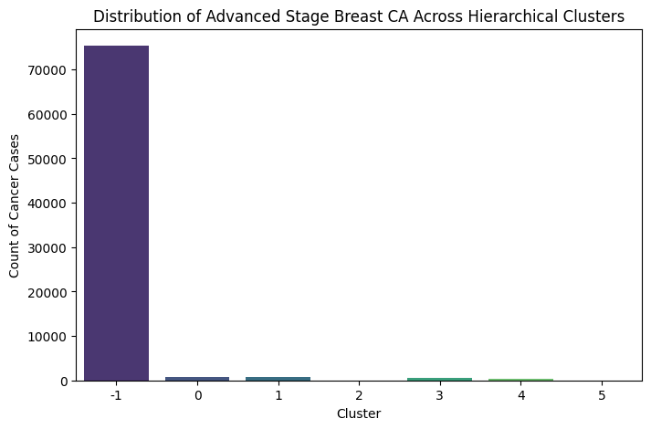

# Problem Statement
Breast Cancer is a significant global health burden, with high morbidity and mortality rates arising from its development and progression to Advanced Breast Cancer. Despite advances in treatment and early detection, understanding the complex interplay of factors associated with advanced breast cancer progression remains a challenge. To address this gap, this research aims to systematically investigate and identify the various factors contributing to progression of advanced breast cancer.


Research topic:
Exploring the impact of age,race and imaging biomarkers on advanced breast cancer risk.

### Objectives:

*   To comprehensively review existing literature on known factors associated with advanced breast cancer.
*   To analyze and evaluate the independent and combined effects of imaging biomarkers, social factors; age, race and others on advanced breast cancer development.
*   To develop predictive models to quantify individualized risk profiles for advanced breast cancer.
*   To provide actionable insights for preventive strategies, early detection, and personalized interventions to mitigate advanced breast cancer risk.

#### Data Definition

###### Attribute Information for review and analysis:

* age_group_5_years : Age of participants grouped by 5 year range(1 = Age 18-29, 2 = Age 30-34, 3 = Age 35-39, 4 = Age 40-44, 5 = Age 45-49, 6 = Age 50-54, 7 = Age 55-59, 8 = Age 60-64, 9 = Age 65-69, 10 = Age 70-74, 11 = Age 75-79, 12 = Age 80-84, 13 = Age >85)

* race_eth : Racial classification (1 = Non-Hispanic white, 2 = Non-Hispanic black, 3 = Asian/Pacific Islander, 4 = Native American, 5 = Hispanic, 6 = Other/mixed, 9 = Unknown)

* BIRADS_breast_density: Breast imaging result grouping (1 = Almost entirely fat, 2 = Scattered fibroglandular densities, 3 = Heterogeneously dense, 4 = Extremely dense, 9 = Unknown or different measurement system)

* first_degree_hx: History of breast cancer in a first degree relative (0 = No, 1 = Yes, 9 = Unknown)

* breast_cancer_history : Prior breast cancer diagnosis (0 = No, 1 = Yes, 9 = Unknown)

* age_menarche: Age at menarche (0 = Age >14, 1 = Age 12-13, 2 = Age <12, 9 = Unknown)

* current_hrt: Patient use of hormone replacement therapy (0 = No, 1 = Yes, 9 = Unknown)

* menopaus: Menopausal status (1 = Pre- or peri-menopausal, 2 = Post-menopausal, 3 = Surgical menopause, 9 = Unknown)

* agegrp : Age at mammogram(40-49,50-59,60-69,70-74)

* density_c: Breast imaging category (a = almost entirely fatty, b = scattered fibroglandular densities, c = heterogeneously dense, d = extremely dense)

* examyear_cat: Year of mammogram (2005-2008, 2009-2010, 2011-2012, 2013-2014, 2015-2017)

* riskBCSC_v2_5y_cat: BCSC 5-year risk score category (0 to <1.00, 1.00 to 1.66, 1.67 to 2.49, 2.50 to 3.99, ≥4.00, unknown)

* resfnl_c3: Final result positive (breast imaging final assesment score of 3,4,or 5) and Final result negative (breats imaging assessment score of 1, or 2)

* cancscrfu1yr_c: Breast cancer (Ductal Carcinoma In-situ or invasive) diagnosed during 1-year followup, truncated at next screening exam (0: No, 1: Yes)

* stage_advanced: Advanced breast cancer at diagnosis (0: No, 1: Yes)


* The risk factor dataset includes information from 6,788,436 mammograms in the Breast Cancer Surveillance Consortium (BCSC) between 2005 and 2017. The dataset includes characteristics shown to be associated with breast cancer risk including age, ethnicity, family history of breast cancer, age at menarche, age at first birth, breast density, use of hormone replacement therapy, menopausal status, body mass index, history of biopsy, and history of breast cancer. These data can be used to describe and explore social characteristics relationship with breast mass.
* This dataset includes information from a sample of Breast Cancer Surveillance Consortium (BCSC) mammograms performed between 2005 and 2017. Data are from 40 to 74 year old women undergoing a screening mammogram within thirty months after a prior mammogram screening.This dataset can be used to describe and explore imaging related features.


**Original Source:**
### BREAST CANCER SURVEILLANCE CONSORTIUM
https://www.bcsc-research.org/index.php/datasets

# Process
There are seven major steps in the data science process.

1. Problem Framing
2. Data Collection
3. Data Cleaning
4. Data Exploration
5. Modeling
6. Evaluation
7. Deployment

## Data Collection:

Data collection begins with identifying a reliable and accurate data source and using tools to download the dataset for examination. Next, the necessary libraries are imported which contain pre-written code which perform specific tasks. Python has several libraries which are powerful tools from data analysis and visualization.

Once the dataset are loaded and the libraries imported, the dataset can be read and the dataframe created. Now the data is checked and the data cleaning process begins.

### Import libraries


```python
# Import the libraries
import numpy as np                  # Scientific Computing
import pandas as pd                 # Data Analysis
import matplotlib.pyplot as plt     # Plotting
import seaborn as sns               # Statistical Data Visualization
from sklearn.impute import SimpleImputer
from sklearn.model_selection import train_test_split, cross_val_score, GridSearchCV
from sklearn.preprocessing import StandardScaler, OneHotEncoder, LabelEncoder
from sklearn.linear_model import LogisticRegression
from sklearn.linear_model import LinearRegression
from sklearn import metrics
from sklearn.pipeline import Pipeline
from sklearn.metrics import mean_squared_error, accuracy_score, classification_report
from sklearn.metrics import roc_auc_score, confusion_matrix, ConfusionMatrixDisplay
import category_encoders as ce
import statsmodels.api as sm

# from sklearn.metrics import precision_recall_curve, plot_precision_recall_curve, plot_roc_curve

# Let's make sure pandas returns all the rows and columns for the dataframe
#pd.set_option('display.max_rows', None)
pd.set_option('display.max_columns', None)

# Force pandas to display full numbers instead of scientific notation
# pd.options.display.float_format = '{:.0f}'.format

# Library to suppress warnings
import warnings
warnings.filterwarnings('ignore')
```

### Read the dataset


```python
#load dataset
df_bcsc_rf = pd.read_csv("/Users/bayowaonabajo/Downloads/bcsc_risk_factors_summarized1_092020.csv")
df_bcsc_rf.head()
df_bcsc_rf.info()

```

    <class 'pandas.core.frame.DataFrame'>
    RangeIndex: 509410 entries, 0 to 509409
    Data columns (total 13 columns):
     #   Column                 Non-Null Count   Dtype
    ---  ------                 --------------   -----
     0   year                   509410 non-null  int64
     1   age_group_5_years      509410 non-null  int64
     2   race_eth               509410 non-null  int64
     3   first_degree_hx        509410 non-null  int64
     4   age_menarche           509410 non-null  int64
     5   age_first_birth        509410 non-null  int64
     6   BIRADS_breast_density  509410 non-null  int64
     7   current_hrt            509410 non-null  int64
     8   menopaus               509410 non-null  int64
     9   bmi_group              509410 non-null  int64
     10  biophx                 509410 non-null  int64
     11  breast_cancer_history  509410 non-null  int64
     12  count                  509410 non-null  int64
    dtypes: int64(13)
    memory usage: 50.5 MB


```python
df_bcsc_rf.drop(columns=['year', 'bmi_group', 'biophx', 'count'], inplace=True, errors='ignore')
df_bcsc_rf.head()
```


<div>
<style scoped>
    .dataframe tbody tr th:only-of-type {
        vertical-align: middle;
    }

    .dataframe tbody tr th {
        vertical-align: top;
    }

    .dataframe thead th {
        text-align: right;
    }
</style>
<table border="1" class="dataframe">
  <thead>
    <tr style="text-align: right;">
      <th></th>
      <th>age_group_5_years</th>
      <th>race_eth</th>
      <th>first_degree_hx</th>
      <th>age_menarche</th>
      <th>age_first_birth</th>
      <th>BIRADS_breast_density</th>
      <th>current_hrt</th>
      <th>menopaus</th>
      <th>breast_cancer_history</th>
    </tr>
  </thead>
  <tbody>
    <tr>
      <th>0</th>
      <td>7</td>
      <td>1</td>
      <td>0</td>
      <td>9</td>
      <td>3</td>
      <td>1</td>
      <td>1</td>
      <td>2</td>
      <td>0</td>
    </tr>
    <tr>
      <th>1</th>
      <td>7</td>
      <td>1</td>
      <td>0</td>
      <td>9</td>
      <td>3</td>
      <td>1</td>
      <td>1</td>
      <td>2</td>
      <td>0</td>
    </tr>
    <tr>
      <th>2</th>
      <td>7</td>
      <td>1</td>
      <td>0</td>
      <td>9</td>
      <td>3</td>
      <td>1</td>
      <td>1</td>
      <td>2</td>
      <td>0</td>
    </tr>
    <tr>
      <th>3</th>
      <td>7</td>
      <td>1</td>
      <td>0</td>
      <td>9</td>
      <td>3</td>
      <td>1</td>
      <td>1</td>
      <td>2</td>
      <td>0</td>
    </tr>
    <tr>
      <th>4</th>
      <td>7</td>
      <td>1</td>
      <td>0</td>
      <td>9</td>
      <td>3</td>
      <td>1</td>
      <td>1</td>
      <td>2</td>
      <td>1</td>
    </tr>
  </tbody>
</table>
</div>


```python
# Rename age-related columns
df_bcsc_rf.rename(columns={'age_group_5_years': 'age'}, inplace=True)
df_bcsc_rf.head()
```


<div>
<style scoped>
    .dataframe tbody tr th:only-of-type {
        vertical-align: middle;
    }

    .dataframe tbody tr th {
        vertical-align: top;
    }

    .dataframe thead th {
        text-align: right;
    }
</style>
<table border="1" class="dataframe">
  <thead>
    <tr style="text-align: right;">
      <th></th>
      <th>age</th>
      <th>race_eth</th>
      <th>first_degree_hx</th>
      <th>age_menarche</th>
      <th>age_first_birth</th>
      <th>BIRADS_breast_density</th>
      <th>current_hrt</th>
      <th>menopaus</th>
      <th>breast_cancer_history</th>
    </tr>
  </thead>
  <tbody>
    <tr>
      <th>0</th>
      <td>7</td>
      <td>1</td>
      <td>0</td>
      <td>9</td>
      <td>3</td>
      <td>1</td>
      <td>1</td>
      <td>2</td>
      <td>0</td>
    </tr>
    <tr>
      <th>1</th>
      <td>7</td>
      <td>1</td>
      <td>0</td>
      <td>9</td>
      <td>3</td>
      <td>1</td>
      <td>1</td>
      <td>2</td>
      <td>0</td>
    </tr>
    <tr>
      <th>2</th>
      <td>7</td>
      <td>1</td>
      <td>0</td>
      <td>9</td>
      <td>3</td>
      <td>1</td>
      <td>1</td>
      <td>2</td>
      <td>0</td>
    </tr>
    <tr>
      <th>3</th>
      <td>7</td>
      <td>1</td>
      <td>0</td>
      <td>9</td>
      <td>3</td>
      <td>1</td>
      <td>1</td>
      <td>2</td>
      <td>0</td>
    </tr>
    <tr>
      <th>4</th>
      <td>7</td>
      <td>1</td>
      <td>0</td>
      <td>9</td>
      <td>3</td>
      <td>1</td>
      <td>1</td>
      <td>2</td>
      <td>1</td>
    </tr>
  </tbody>
</table>
</div>


```python
df_bcsc_screening_perf = pd.read_csv("/Users/bayowaonabajo/Downloads/BCSC_Mammography_Screening_Performance_Dataset.csv")
df_bcsc_screening_perf.head()
```


<div>
<style scoped>
    .dataframe tbody tr th:only-of-type {
        vertical-align: middle;
    }

    .dataframe tbody tr th {
        vertical-align: top;
    }

    .dataframe thead th {
        text-align: right;
    }
</style>
<table border="1" class="dataframe">
  <thead>
    <tr style="text-align: right;">
      <th></th>
      <th>agegrp</th>
      <th>density_c</th>
      <th>examyear_cat</th>
      <th>riskBCSC_v2_5y_cat</th>
      <th>resinit_c</th>
      <th>resfnl_c</th>
      <th>resfnl_c3</th>
      <th>cancscrfu1yr_c</th>
      <th>dcisscrfu1yr_c</th>
      <th>invscrfu1yr_c</th>
      <th>stage_advanced</th>
      <th>count</th>
    </tr>
  </thead>
  <tbody>
    <tr>
      <th>0</th>
      <td>40-49</td>
      <td>unknown</td>
      <td>2005-2008</td>
      <td>unknown</td>
      <td>0: Negative</td>
      <td>0: Negative</td>
      <td>0: Negative</td>
      <td>0: No</td>
      <td>0: No</td>
      <td>0: No</td>
      <td>0: No</td>
      <td>19320</td>
    </tr>
    <tr>
      <th>1</th>
      <td>40-49</td>
      <td>unknown</td>
      <td>2009-2010</td>
      <td>unknown</td>
      <td>0: Negative</td>
      <td>0: Negative</td>
      <td>0: Negative</td>
      <td>0: No</td>
      <td>0: No</td>
      <td>0: No</td>
      <td>0: No</td>
      <td>10035</td>
    </tr>
    <tr>
      <th>2</th>
      <td>40-49</td>
      <td>unknown</td>
      <td>2011-2012</td>
      <td>unknown</td>
      <td>0: Negative</td>
      <td>0: Negative</td>
      <td>0: Negative</td>
      <td>0: No</td>
      <td>0: No</td>
      <td>0: No</td>
      <td>0: No</td>
      <td>12778</td>
    </tr>
    <tr>
      <th>3</th>
      <td>40-49</td>
      <td>unknown</td>
      <td>2013-2014</td>
      <td>unknown</td>
      <td>0: Negative</td>
      <td>0: Negative</td>
      <td>0: Negative</td>
      <td>0: No</td>
      <td>0: No</td>
      <td>0: No</td>
      <td>0: No</td>
      <td>5708</td>
    </tr>
    <tr>
      <th>4</th>
      <td>40-49</td>
      <td>unknown</td>
      <td>2015-2017</td>
      <td>unknown</td>
      <td>0: Negative</td>
      <td>0: Negative</td>
      <td>0: Negative</td>
      <td>0: No</td>
      <td>0: No</td>
      <td>0: No</td>
      <td>0: No</td>
      <td>663</td>
    </tr>
  </tbody>
</table>
</div>


```python
# Convert 'density_c' to numeric values
df_bcsc_screening_perf['density_c'] = df_bcsc_screening_perf['density_c'].replace({'a': 1, 'b': 2, 'c': 3, 'd': 4})

df_bcsc_screening_perf.tail()
df_bcsc_screening_perf.info()
```

    <class 'pandas.core.frame.DataFrame'>
    RangeIndex: 3071 entries, 0 to 3070
    Data columns (total 12 columns):
     #   Column              Non-Null Count  Dtype 
    ---  ------              --------------  ----- 
     0   agegrp              3071 non-null   object
     1   density_c           3071 non-null   object
     2   examyear_cat        3071 non-null   object
     3   riskBCSC_v2_5y_cat  3071 non-null   object
     4   resinit_c           3071 non-null   object
     5   resfnl_c            3071 non-null   object
     6   resfnl_c3           3071 non-null   object
     7   cancscrfu1yr_c      3071 non-null   object
     8   dcisscrfu1yr_c      3071 non-null   object
     9   invscrfu1yr_c       3071 non-null   object
     10  stage_advanced      3071 non-null   object
     11  count               3071 non-null   int64 
    dtypes: int64(1), object(11)
    memory usage: 288.0+ KB


```python
df_bcsc_screening_perf.drop(columns=['examyear_cat', 'resinit_c', 'resfnl_c', 'dcisscrfu1yr_c', 'invscrfu1yr_c', 'count', ], inplace=True, errors='ignore')
df_bcsc_screening_perf.head()
```


<div>
<style scoped>
    .dataframe tbody tr th:only-of-type {
        vertical-align: middle;
    }

    .dataframe tbody tr th {
        vertical-align: top;
    }

    .dataframe thead th {
        text-align: right;
    }
</style>
<table border="1" class="dataframe">
  <thead>
    <tr style="text-align: right;">
      <th></th>
      <th>agegrp</th>
      <th>density_c</th>
      <th>riskBCSC_v2_5y_cat</th>
      <th>resfnl_c3</th>
      <th>cancscrfu1yr_c</th>
      <th>stage_advanced</th>
    </tr>
  </thead>
  <tbody>
    <tr>
      <th>0</th>
      <td>40-49</td>
      <td>unknown</td>
      <td>unknown</td>
      <td>0: Negative</td>
      <td>0: No</td>
      <td>0: No</td>
    </tr>
    <tr>
      <th>1</th>
      <td>40-49</td>
      <td>unknown</td>
      <td>unknown</td>
      <td>0: Negative</td>
      <td>0: No</td>
      <td>0: No</td>
    </tr>
    <tr>
      <th>2</th>
      <td>40-49</td>
      <td>unknown</td>
      <td>unknown</td>
      <td>0: Negative</td>
      <td>0: No</td>
      <td>0: No</td>
    </tr>
    <tr>
      <th>3</th>
      <td>40-49</td>
      <td>unknown</td>
      <td>unknown</td>
      <td>0: Negative</td>
      <td>0: No</td>
      <td>0: No</td>
    </tr>
    <tr>
      <th>4</th>
      <td>40-49</td>
      <td>unknown</td>
      <td>unknown</td>
      <td>0: Negative</td>
      <td>0: No</td>
      <td>0: No</td>
    </tr>
  </tbody>
</table>
</div>


```python
# Function to assign random specific ages within defined groups
def categorize_agegrp(age_category):
    if age_category == "40-49":
        return np.random.choice([4,5])  
    elif age_category == "50-59":
        return np.random.choice([6,7])  
    elif age_category == "60-69":
        return np.random.choice([8,9])    
    elif age_category == "70-74":
        return 10  
    else:
        return np.nan  # Handle unknown or missing values
df_bcsc_screening_perf ['age'] = df_bcsc_screening_perf['agegrp'].apply(categorize_agegrp)

df_bcsc_screening_perf.head()
```


<div>
<style scoped>
    .dataframe tbody tr th:only-of-type {
        vertical-align: middle;
    }

    .dataframe tbody tr th {
        vertical-align: top;
    }

    .dataframe thead th {
        text-align: right;
    }
</style>
<table border="1" class="dataframe">
  <thead>
    <tr style="text-align: right;">
      <th></th>
      <th>agegrp</th>
      <th>density_c</th>
      <th>riskBCSC_v2_5y_cat</th>
      <th>resfnl_c3</th>
      <th>cancscrfu1yr_c</th>
      <th>stage_advanced</th>
      <th>age</th>
    </tr>
  </thead>
  <tbody>
    <tr>
      <th>0</th>
      <td>40-49</td>
      <td>unknown</td>
      <td>unknown</td>
      <td>0: Negative</td>
      <td>0: No</td>
      <td>0: No</td>
      <td>4</td>
    </tr>
    <tr>
      <th>1</th>
      <td>40-49</td>
      <td>unknown</td>
      <td>unknown</td>
      <td>0: Negative</td>
      <td>0: No</td>
      <td>0: No</td>
      <td>5</td>
    </tr>
    <tr>
      <th>2</th>
      <td>40-49</td>
      <td>unknown</td>
      <td>unknown</td>
      <td>0: Negative</td>
      <td>0: No</td>
      <td>0: No</td>
      <td>5</td>
    </tr>
    <tr>
      <th>3</th>
      <td>40-49</td>
      <td>unknown</td>
      <td>unknown</td>
      <td>0: Negative</td>
      <td>0: No</td>
      <td>0: No</td>
      <td>4</td>
    </tr>
    <tr>
      <th>4</th>
      <td>40-49</td>
      <td>unknown</td>
      <td>unknown</td>
      <td>0: Negative</td>
      <td>0: No</td>
      <td>0: No</td>
      <td>4</td>
    </tr>
  </tbody>
</table>
</div>


```python
df_bcsc_screening_perf_clean = df_bcsc_screening_perf.drop(columns=['agegrp' ], errors='ignore')
df_bcsc_screening_perf_clean.tail()
```


<div>
<style scoped>
    .dataframe tbody tr th:only-of-type {
        vertical-align: middle;
    }

    .dataframe tbody tr th {
        vertical-align: top;
    }

    .dataframe thead th {
        text-align: right;
    }
</style>
<table border="1" class="dataframe">
  <thead>
    <tr style="text-align: right;">
      <th></th>
      <th>density_c</th>
      <th>riskBCSC_v2_5y_cat</th>
      <th>resfnl_c3</th>
      <th>cancscrfu1yr_c</th>
      <th>stage_advanced</th>
      <th>age</th>
    </tr>
  </thead>
  <tbody>
    <tr>
      <th>3066</th>
      <td>4</td>
      <td>2.50 to 3.99</td>
      <td>1: Positive</td>
      <td>1: Yes</td>
      <td>0: No</td>
      <td>10</td>
    </tr>
    <tr>
      <th>3067</th>
      <td>4</td>
      <td>2.50 to 3.99</td>
      <td>1: Positive</td>
      <td>1: Yes</td>
      <td>0: No</td>
      <td>10</td>
    </tr>
    <tr>
      <th>3068</th>
      <td>4</td>
      <td>2.50 to 3.99</td>
      <td>1: Positive</td>
      <td>1: Yes</td>
      <td>0: No</td>
      <td>10</td>
    </tr>
    <tr>
      <th>3069</th>
      <td>4</td>
      <td>&gt;=4.00</td>
      <td>1: Positive</td>
      <td>1: Yes</td>
      <td>0: No</td>
      <td>10</td>
    </tr>
    <tr>
      <th>3070</th>
      <td>4</td>
      <td>&gt;=4.00</td>
      <td>1: Positive</td>
      <td>1: Yes</td>
      <td>0: No</td>
      <td>10</td>
    </tr>
  </tbody>
</table>
</div>


```python
# Convert binary variables to 0/1
binary_vars = [ 'resfnl_c3', 'cancscrfu1yr_c', 'stage_advanced']
for var in binary_vars:
    df_bcsc_screening_perf_clean[var] = df_bcsc_screening_perf_clean[var].apply(lambda x: 1 if "Positive" in str(x) or "Yes" in str(x) else 0)

df_bcsc_screening_perf_clean.head()
```


<div>
<style scoped>
    .dataframe tbody tr th:only-of-type {
        vertical-align: middle;
    }

    .dataframe tbody tr th {
        vertical-align: top;
    }

    .dataframe thead th {
        text-align: right;
    }
</style>
<table border="1" class="dataframe">
  <thead>
    <tr style="text-align: right;">
      <th></th>
      <th>density_c</th>
      <th>riskBCSC_v2_5y_cat</th>
      <th>resfnl_c3</th>
      <th>cancscrfu1yr_c</th>
      <th>stage_advanced</th>
      <th>age</th>
    </tr>
  </thead>
  <tbody>
    <tr>
      <th>0</th>
      <td>unknown</td>
      <td>unknown</td>
      <td>0</td>
      <td>0</td>
      <td>0</td>
      <td>4</td>
    </tr>
    <tr>
      <th>1</th>
      <td>unknown</td>
      <td>unknown</td>
      <td>0</td>
      <td>0</td>
      <td>0</td>
      <td>5</td>
    </tr>
    <tr>
      <th>2</th>
      <td>unknown</td>
      <td>unknown</td>
      <td>0</td>
      <td>0</td>
      <td>0</td>
      <td>5</td>
    </tr>
    <tr>
      <th>3</th>
      <td>unknown</td>
      <td>unknown</td>
      <td>0</td>
      <td>0</td>
      <td>0</td>
      <td>4</td>
    </tr>
    <tr>
      <th>4</th>
      <td>unknown</td>
      <td>unknown</td>
      <td>0</td>
      <td>0</td>
      <td>0</td>
      <td>4</td>
    </tr>
  </tbody>
</table>
</div>


```python
# Remove exact duplicates 
df_bcsc_rf_cleaned = df_bcsc_rf.drop_duplicates()
df_bcsc_screening_perf_clean_cleaned = df_bcsc_screening_perf_clean.drop_duplicates()
```


```python
# Perform the join on cleaned data
df_merged_bcsc_rf_screening = pd.merge(df_bcsc_rf_cleaned, df_bcsc_screening_perf_clean_cleaned, on='age', how='inner')
print("Shape of merged DataFrame:", df_merged_bcsc_rf_screening.shape)

df_merged_bcsc_rf_screening.head()
```

    Shape of merged DataFrame: (5250671, 14)


<div>
<style scoped>
    .dataframe tbody tr th:only-of-type {
        vertical-align: middle;
    }

    .dataframe tbody tr th {
        vertical-align: top;
    }

    .dataframe thead th {
        text-align: right;
    }
</style>
<table border="1" class="dataframe">
  <thead>
    <tr style="text-align: right;">
      <th></th>
      <th>age</th>
      <th>race_eth</th>
      <th>first_degree_hx</th>
      <th>age_menarche</th>
      <th>age_first_birth</th>
      <th>BIRADS_breast_density</th>
      <th>current_hrt</th>
      <th>menopaus</th>
      <th>breast_cancer_history</th>
      <th>density_c</th>
      <th>riskBCSC_v2_5y_cat</th>
      <th>resfnl_c3</th>
      <th>cancscrfu1yr_c</th>
      <th>stage_advanced</th>
    </tr>
  </thead>
  <tbody>
    <tr>
      <th>0</th>
      <td>7</td>
      <td>1</td>
      <td>0</td>
      <td>9</td>
      <td>3</td>
      <td>1</td>
      <td>1</td>
      <td>2</td>
      <td>0</td>
      <td>unknown</td>
      <td>unknown</td>
      <td>0</td>
      <td>0</td>
      <td>0</td>
    </tr>
    <tr>
      <th>1</th>
      <td>7</td>
      <td>1</td>
      <td>0</td>
      <td>9</td>
      <td>3</td>
      <td>1</td>
      <td>1</td>
      <td>2</td>
      <td>0</td>
      <td>unknown</td>
      <td>unknown</td>
      <td>0</td>
      <td>1</td>
      <td>0</td>
    </tr>
    <tr>
      <th>2</th>
      <td>7</td>
      <td>1</td>
      <td>0</td>
      <td>9</td>
      <td>3</td>
      <td>1</td>
      <td>1</td>
      <td>2</td>
      <td>0</td>
      <td>unknown</td>
      <td>unknown</td>
      <td>0</td>
      <td>1</td>
      <td>1</td>
    </tr>
    <tr>
      <th>3</th>
      <td>7</td>
      <td>1</td>
      <td>0</td>
      <td>9</td>
      <td>3</td>
      <td>1</td>
      <td>1</td>
      <td>2</td>
      <td>0</td>
      <td>unknown</td>
      <td>unknown</td>
      <td>1</td>
      <td>0</td>
      <td>0</td>
    </tr>
    <tr>
      <th>4</th>
      <td>7</td>
      <td>1</td>
      <td>0</td>
      <td>9</td>
      <td>3</td>
      <td>1</td>
      <td>1</td>
      <td>2</td>
      <td>0</td>
      <td>unknown</td>
      <td>unknown</td>
      <td>1</td>
      <td>1</td>
      <td>0</td>
    </tr>
  </tbody>
</table>
</div>


```python
data= df_merged_bcsc_rf_screening
df = pd.DataFrame(data)

# Find rows with "unknown" in any column
unknown_rows = df[df.isin(['unknown']).any(axis=1)]
#unknown_rows

# Drop rows with "unknown" in any column
df_merged_bcsc_rf_screening_cleaned = df[~df.isin(['unknown']).any(axis=1)]
df_merged_bcsc_rf_screening_cleaned.head()
```


<div>
<style scoped>
    .dataframe tbody tr th:only-of-type {
        vertical-align: middle;
    }

    .dataframe tbody tr th {
        vertical-align: top;
    }

    .dataframe thead th {
        text-align: right;
    }
</style>
<table border="1" class="dataframe">
  <thead>
    <tr style="text-align: right;">
      <th></th>
      <th>age</th>
      <th>race_eth</th>
      <th>first_degree_hx</th>
      <th>age_menarche</th>
      <th>age_first_birth</th>
      <th>BIRADS_breast_density</th>
      <th>current_hrt</th>
      <th>menopaus</th>
      <th>breast_cancer_history</th>
      <th>density_c</th>
      <th>riskBCSC_v2_5y_cat</th>
      <th>resfnl_c3</th>
      <th>cancscrfu1yr_c</th>
      <th>stage_advanced</th>
    </tr>
  </thead>
  <tbody>
    <tr>
      <th>6</th>
      <td>7</td>
      <td>1</td>
      <td>0</td>
      <td>9</td>
      <td>3</td>
      <td>1</td>
      <td>1</td>
      <td>2</td>
      <td>0</td>
      <td>1</td>
      <td>0.00 to &lt; 1.00</td>
      <td>0</td>
      <td>0</td>
      <td>0</td>
    </tr>
    <tr>
      <th>7</th>
      <td>7</td>
      <td>1</td>
      <td>0</td>
      <td>9</td>
      <td>3</td>
      <td>1</td>
      <td>1</td>
      <td>2</td>
      <td>0</td>
      <td>1</td>
      <td>1.00 to 1.66</td>
      <td>0</td>
      <td>0</td>
      <td>0</td>
    </tr>
    <tr>
      <th>8</th>
      <td>7</td>
      <td>1</td>
      <td>0</td>
      <td>9</td>
      <td>3</td>
      <td>1</td>
      <td>1</td>
      <td>2</td>
      <td>0</td>
      <td>1</td>
      <td>1.67 to 2.49</td>
      <td>0</td>
      <td>0</td>
      <td>0</td>
    </tr>
    <tr>
      <th>9</th>
      <td>7</td>
      <td>1</td>
      <td>0</td>
      <td>9</td>
      <td>3</td>
      <td>1</td>
      <td>1</td>
      <td>2</td>
      <td>0</td>
      <td>1</td>
      <td>2.50 to 3.99</td>
      <td>0</td>
      <td>0</td>
      <td>0</td>
    </tr>
    <tr>
      <th>10</th>
      <td>7</td>
      <td>1</td>
      <td>0</td>
      <td>9</td>
      <td>3</td>
      <td>1</td>
      <td>1</td>
      <td>2</td>
      <td>0</td>
      <td>1</td>
      <td>0.00 to &lt; 1.00</td>
      <td>0</td>
      <td>1</td>
      <td>0</td>
    </tr>
  </tbody>
</table>
</div>


```python
df_merged_bcsc_rf_screening_cleaned.drop(columns=[ 'BIRADS_breast_density'], inplace=True, errors='ignore')
df_merged_bcsc_rf_screening_cleaned.head()
```


<div>
<style scoped>
    .dataframe tbody tr th:only-of-type {
        vertical-align: middle;
    }

    .dataframe tbody tr th {
        vertical-align: top;
    }

    .dataframe thead th {
        text-align: right;
    }
</style>
<table border="1" class="dataframe">
  <thead>
    <tr style="text-align: right;">
      <th></th>
      <th>age</th>
      <th>race_eth</th>
      <th>first_degree_hx</th>
      <th>age_menarche</th>
      <th>age_first_birth</th>
      <th>current_hrt</th>
      <th>menopaus</th>
      <th>breast_cancer_history</th>
      <th>density_c</th>
      <th>riskBCSC_v2_5y_cat</th>
      <th>resfnl_c3</th>
      <th>cancscrfu1yr_c</th>
      <th>stage_advanced</th>
    </tr>
  </thead>
  <tbody>
    <tr>
      <th>6</th>
      <td>7</td>
      <td>1</td>
      <td>0</td>
      <td>9</td>
      <td>3</td>
      <td>1</td>
      <td>2</td>
      <td>0</td>
      <td>1</td>
      <td>0.00 to &lt; 1.00</td>
      <td>0</td>
      <td>0</td>
      <td>0</td>
    </tr>
    <tr>
      <th>7</th>
      <td>7</td>
      <td>1</td>
      <td>0</td>
      <td>9</td>
      <td>3</td>
      <td>1</td>
      <td>2</td>
      <td>0</td>
      <td>1</td>
      <td>1.00 to 1.66</td>
      <td>0</td>
      <td>0</td>
      <td>0</td>
    </tr>
    <tr>
      <th>8</th>
      <td>7</td>
      <td>1</td>
      <td>0</td>
      <td>9</td>
      <td>3</td>
      <td>1</td>
      <td>2</td>
      <td>0</td>
      <td>1</td>
      <td>1.67 to 2.49</td>
      <td>0</td>
      <td>0</td>
      <td>0</td>
    </tr>
    <tr>
      <th>9</th>
      <td>7</td>
      <td>1</td>
      <td>0</td>
      <td>9</td>
      <td>3</td>
      <td>1</td>
      <td>2</td>
      <td>0</td>
      <td>1</td>
      <td>2.50 to 3.99</td>
      <td>0</td>
      <td>0</td>
      <td>0</td>
    </tr>
    <tr>
      <th>10</th>
      <td>7</td>
      <td>1</td>
      <td>0</td>
      <td>9</td>
      <td>3</td>
      <td>1</td>
      <td>2</td>
      <td>0</td>
      <td>1</td>
      <td>0.00 to &lt; 1.00</td>
      <td>0</td>
      <td>1</td>
      <td>0</td>
    </tr>
  </tbody>
</table>
</div>


```python
# Create mapping dictionary
risk_mapping = {
    '0.00 to < 1.00': 0,
    '1.00 to 1.66': 1,
    '1.67 to 2.49': 2,
    '2.50 to 3.99': 3,
    '>=4.00': 4
}

```


```python
# Apply the mapping
df_merged_bcsc_rf_screening_cleaned['riskBCSC_v2_5y_cat_numeric'] = df_merged_bcsc_rf_screening_cleaned['riskBCSC_v2_5y_cat'].map(risk_mapping)

df_merged_bcsc_rf_screening_cleaned.head()
```


<div>
<style scoped>
    .dataframe tbody tr th:only-of-type {
        vertical-align: middle;
    }

    .dataframe tbody tr th {
        vertical-align: top;
    }

    .dataframe thead th {
        text-align: right;
    }
</style>
<table border="1" class="dataframe">
  <thead>
    <tr style="text-align: right;">
      <th></th>
      <th>age</th>
      <th>race_eth</th>
      <th>first_degree_hx</th>
      <th>age_menarche</th>
      <th>age_first_birth</th>
      <th>current_hrt</th>
      <th>menopaus</th>
      <th>breast_cancer_history</th>
      <th>density_c</th>
      <th>riskBCSC_v2_5y_cat</th>
      <th>resfnl_c3</th>
      <th>cancscrfu1yr_c</th>
      <th>stage_advanced</th>
      <th>riskBCSC_v2_5y_cat_numeric</th>
    </tr>
  </thead>
  <tbody>
    <tr>
      <th>6</th>
      <td>7</td>
      <td>1</td>
      <td>0</td>
      <td>9</td>
      <td>3</td>
      <td>1</td>
      <td>2</td>
      <td>0</td>
      <td>1</td>
      <td>0.00 to &lt; 1.00</td>
      <td>0</td>
      <td>0</td>
      <td>0</td>
      <td>0</td>
    </tr>
    <tr>
      <th>7</th>
      <td>7</td>
      <td>1</td>
      <td>0</td>
      <td>9</td>
      <td>3</td>
      <td>1</td>
      <td>2</td>
      <td>0</td>
      <td>1</td>
      <td>1.00 to 1.66</td>
      <td>0</td>
      <td>0</td>
      <td>0</td>
      <td>1</td>
    </tr>
    <tr>
      <th>8</th>
      <td>7</td>
      <td>1</td>
      <td>0</td>
      <td>9</td>
      <td>3</td>
      <td>1</td>
      <td>2</td>
      <td>0</td>
      <td>1</td>
      <td>1.67 to 2.49</td>
      <td>0</td>
      <td>0</td>
      <td>0</td>
      <td>2</td>
    </tr>
    <tr>
      <th>9</th>
      <td>7</td>
      <td>1</td>
      <td>0</td>
      <td>9</td>
      <td>3</td>
      <td>1</td>
      <td>2</td>
      <td>0</td>
      <td>1</td>
      <td>2.50 to 3.99</td>
      <td>0</td>
      <td>0</td>
      <td>0</td>
      <td>3</td>
    </tr>
    <tr>
      <th>10</th>
      <td>7</td>
      <td>1</td>
      <td>0</td>
      <td>9</td>
      <td>3</td>
      <td>1</td>
      <td>2</td>
      <td>0</td>
      <td>1</td>
      <td>0.00 to &lt; 1.00</td>
      <td>0</td>
      <td>1</td>
      <td>0</td>
      <td>0</td>
    </tr>
  </tbody>
</table>
</div>


```python
df_merged_bcsc_rf_screening_cleaned.drop(columns=[ 'riskBCSC_v2_5y_cat'], inplace=True, errors='ignore')
df_merged_bcsc_rf_screening_cleaned.head()
```


<div>
<style scoped>
    .dataframe tbody tr th:only-of-type {
        vertical-align: middle;
    }

    .dataframe tbody tr th {
        vertical-align: top;
    }

    .dataframe thead th {
        text-align: right;
    }
</style>
<table border="1" class="dataframe">
  <thead>
    <tr style="text-align: right;">
      <th></th>
      <th>age</th>
      <th>race_eth</th>
      <th>first_degree_hx</th>
      <th>age_menarche</th>
      <th>age_first_birth</th>
      <th>current_hrt</th>
      <th>menopaus</th>
      <th>breast_cancer_history</th>
      <th>density_c</th>
      <th>resfnl_c3</th>
      <th>cancscrfu1yr_c</th>
      <th>stage_advanced</th>
      <th>riskBCSC_v2_5y_cat_numeric</th>
    </tr>
  </thead>
  <tbody>
    <tr>
      <th>6</th>
      <td>7</td>
      <td>1</td>
      <td>0</td>
      <td>9</td>
      <td>3</td>
      <td>1</td>
      <td>2</td>
      <td>0</td>
      <td>1</td>
      <td>0</td>
      <td>0</td>
      <td>0</td>
      <td>0</td>
    </tr>
    <tr>
      <th>7</th>
      <td>7</td>
      <td>1</td>
      <td>0</td>
      <td>9</td>
      <td>3</td>
      <td>1</td>
      <td>2</td>
      <td>0</td>
      <td>1</td>
      <td>0</td>
      <td>0</td>
      <td>0</td>
      <td>1</td>
    </tr>
    <tr>
      <th>8</th>
      <td>7</td>
      <td>1</td>
      <td>0</td>
      <td>9</td>
      <td>3</td>
      <td>1</td>
      <td>2</td>
      <td>0</td>
      <td>1</td>
      <td>0</td>
      <td>0</td>
      <td>0</td>
      <td>2</td>
    </tr>
    <tr>
      <th>9</th>
      <td>7</td>
      <td>1</td>
      <td>0</td>
      <td>9</td>
      <td>3</td>
      <td>1</td>
      <td>2</td>
      <td>0</td>
      <td>1</td>
      <td>0</td>
      <td>0</td>
      <td>0</td>
      <td>3</td>
    </tr>
    <tr>
      <th>10</th>
      <td>7</td>
      <td>1</td>
      <td>0</td>
      <td>9</td>
      <td>3</td>
      <td>1</td>
      <td>2</td>
      <td>0</td>
      <td>1</td>
      <td>0</td>
      <td>1</td>
      <td>0</td>
      <td>0</td>
    </tr>
  </tbody>
</table>
</div>


#### Understand the Dataset


```python
# Display the top five rows of the dataframe
df_merged_bcsc_rf_screening_cleaned.head()
```


<div>
<style scoped>
    .dataframe tbody tr th:only-of-type {
        vertical-align: middle;
    }

    .dataframe tbody tr th {
        vertical-align: top;
    }

    .dataframe thead th {
        text-align: right;
    }
</style>
<table border="1" class="dataframe">
  <thead>
    <tr style="text-align: right;">
      <th></th>
      <th>age</th>
      <th>race_eth</th>
      <th>first_degree_hx</th>
      <th>age_menarche</th>
      <th>age_first_birth</th>
      <th>current_hrt</th>
      <th>menopaus</th>
      <th>breast_cancer_history</th>
      <th>density_c</th>
      <th>resfnl_c3</th>
      <th>cancscrfu1yr_c</th>
      <th>stage_advanced</th>
      <th>riskBCSC_v2_5y_cat_numeric</th>
    </tr>
  </thead>
  <tbody>
    <tr>
      <th>6</th>
      <td>7</td>
      <td>1</td>
      <td>0</td>
      <td>9</td>
      <td>3</td>
      <td>1</td>
      <td>2</td>
      <td>0</td>
      <td>1</td>
      <td>0</td>
      <td>0</td>
      <td>0</td>
      <td>0</td>
    </tr>
    <tr>
      <th>7</th>
      <td>7</td>
      <td>1</td>
      <td>0</td>
      <td>9</td>
      <td>3</td>
      <td>1</td>
      <td>2</td>
      <td>0</td>
      <td>1</td>
      <td>0</td>
      <td>0</td>
      <td>0</td>
      <td>1</td>
    </tr>
    <tr>
      <th>8</th>
      <td>7</td>
      <td>1</td>
      <td>0</td>
      <td>9</td>
      <td>3</td>
      <td>1</td>
      <td>2</td>
      <td>0</td>
      <td>1</td>
      <td>0</td>
      <td>0</td>
      <td>0</td>
      <td>2</td>
    </tr>
    <tr>
      <th>9</th>
      <td>7</td>
      <td>1</td>
      <td>0</td>
      <td>9</td>
      <td>3</td>
      <td>1</td>
      <td>2</td>
      <td>0</td>
      <td>1</td>
      <td>0</td>
      <td>0</td>
      <td>0</td>
      <td>3</td>
    </tr>
    <tr>
      <th>10</th>
      <td>7</td>
      <td>1</td>
      <td>0</td>
      <td>9</td>
      <td>3</td>
      <td>1</td>
      <td>2</td>
      <td>0</td>
      <td>1</td>
      <td>0</td>
      <td>1</td>
      <td>0</td>
      <td>0</td>
    </tr>
  </tbody>
</table>
</div>


```python
# Display the dimensions of the data. This is the number of rows and columns in the data
df_merged_bcsc_rf_screening_cleaned.shape
```


    (4921950, 13)


* Regarding shape of the dataframe :
  - There are 4921928 rows in the dataframe.
  - There are 13 columns in the dataframe.
  - The total number of datapoints expected in the dataset is 4921928 x 13 (rows x columns).

#### Data Types


```python
# Let's check the basic information about the dataset
# This command will show information like missing values, data types of the columns etc:-
df_merged_bcsc_rf_screening_cleaned.info(verbose = True, show_counts = True)
```

    <class 'pandas.core.frame.DataFrame'>
    Index: 4921950 entries, 6 to 5250670
    Data columns (total 13 columns):
     #   Column                      Non-Null Count    Dtype 
    ---  ------                      --------------    ----- 
     0   age                         4921950 non-null  int64 
     1   race_eth                    4921950 non-null  int64 
     2   first_degree_hx             4921950 non-null  int64 
     3   age_menarche                4921950 non-null  int64 
     4   age_first_birth             4921950 non-null  int64 
     5   current_hrt                 4921950 non-null  int64 
     6   menopaus                    4921950 non-null  int64 
     7   breast_cancer_history       4921950 non-null  int64 
     8   density_c                   4921950 non-null  object
     9   resfnl_c3                   4921950 non-null  int64 
     10  cancscrfu1yr_c              4921950 non-null  int64 
     11  stage_advanced              4921950 non-null  int64 
     12  riskBCSC_v2_5y_cat_numeric  4921950 non-null  int64 
    dtypes: int64(12), object(1)
    memory usage: 525.7+ MB


#### Observations of the Data Set
The are no non-null values.

## Data Cleaning:


## Data Exploration and Visualization

## Exploratory Data Analysis and Preparation

1. There are 4921928 rows and 13 columns in the dataframe.
2. There are two data types in the dataset - object and int64. The int64 values displays as a float. So, there is a need to convert the values to int64 to display correctly on the dataframe.
3. Quick overview of the basic statistical properties of the data in a dataframe including the relative minimum and maximum for the range.
4. Check for missing values that may cause noise in machine learning models and visualizations.
5. Examine the correlation between data variables for future feature engineering.
6. Utilization of boxplots if needed.

### Missing Values


```python
# Determine the number of missing values
# Syntax: DataFrame.isnull().sum()
df_merged_bcsc_rf_screening_cleaned.isnull().sum()
```


    age                           0
    race_eth                      0
    first_degree_hx               0
    age_menarche                  0
    age_first_birth               0
    current_hrt                   0
    menopaus                      0
    breast_cancer_history         0
    density_c                     0
    resfnl_c3                     0
    cancscrfu1yr_c                0
    stage_advanced                0
    riskBCSC_v2_5y_cat_numeric    0
    dtype: int64


```python
#Calculate the percentage of missing values in each column of the dataset
missing_values_perc = df_merged_bcsc_rf_screening_cleaned.isnull().sum() / df_merged_bcsc_rf_screening_cleaned.shape[0] * 100
print(missing_values_perc)
```

    age                           0.0
    race_eth                      0.0
    first_degree_hx               0.0
    age_menarche                  0.0
    age_first_birth               0.0
    current_hrt                   0.0
    menopaus                      0.0
    breast_cancer_history         0.0
    density_c                     0.0
    resfnl_c3                     0.0
    cancscrfu1yr_c                0.0
    stage_advanced                0.0
    riskBCSC_v2_5y_cat_numeric    0.0
    dtype: float64


```python
#Columns that have missing values exceeding 10% in the dataset
missing_values_column = missing_values_perc[missing_values_perc > 10].keys()
print(missing_values_column)
```

    Index([], dtype='object')


```python
#Find all the columns with the missing values
for column in df_merged_bcsc_rf_screening_cleaned.columns:
  print(f'{column}: {df_merged_bcsc_rf_screening_cleaned[column].isnull().sum()}')
```

    age: 0
    race_eth: 0
    first_degree_hx: 0
    age_menarche: 0
    age_first_birth: 0
    current_hrt: 0
    menopaus: 0
    breast_cancer_history: 0
    density_c: 0
    resfnl_c3: 0
    cancscrfu1yr_c: 0
    stage_advanced: 0
    riskBCSC_v2_5y_cat_numeric: 0


### Observations
- Just showing missing value checks.


```python
# Take a copy of the original dataframe before manipulation
df_merged_bcsc_rf_screening_cleaned_df1 = df_merged_bcsc_rf_screening_cleaned
```

#### Get more details on few observations

**Get the count of male and female participants.**


```python
# Count occurrences of each unique value in the column
race_counts = df_merged_bcsc_rf_screening_cleaned['race_eth'].value_counts()
age_counts = df_merged_bcsc_rf_screening_cleaned['age'].value_counts()
#race_counts
age_counts
```


    age
    7     1152800
    6     1018961
    5      654974
    8      610154
    9      575575
    10     503190
    4      406296
    Name: count, dtype: int64


**Count of participants who have and have no confirmed cancer**


```python
# Count occurrences of each unique value in the column
cancer_counts = df_merged_bcsc_rf_screening_cleaned['stage_advanced'].value_counts()

# Access the counts for participants who have 'not-confirmed' and 'confirmed' Cancer
not_confirmed_count = cancer_counts.get(0, 0)
confirmed_count = cancer_counts.get(1, 0)

print("Count of participants who have not-confirmed Cancer in the dataset:", not_confirmed_count)
print("Count of participants who have confirmed Cancer in the dataset:", confirmed_count)
```

    Count of participants who have not-confirmed Cancer in the dataset: 3637291
    Count of participants who have confirmed Cancer in the dataset: 1284659


**Proportion of negative cases to positive cases**


```python
#Proportion of negative cases to positive cases

df_merged_bcsc_rf_screening_cleaned["stage_advanced"].value_counts(normalize=True)
```


    stage_advanced
    0    0.738994
    1    0.261006
    Name: proportion, dtype: float64


As we can see here, there is a huge difference between the number of positive and negative advanced breast cancer cases, which is not good for machine learning algorithms. The proportion of negative cases to positive cases is extremely high. Therefore, there is a need to downsample the dataset for negative cases.

**Percentage of participants for each race group in the dataset**


```python
# Count occurrences of each unique value in the 'race7' column
race_counts = df_merged_bcsc_rf_screening_cleaned['race_eth'].value_counts()

# Get the total count of all values in the column
total_race_counts = race_counts.sum()
print("Total count in the column:", total_race_counts)

# Access the counts of participants in each race or ethnic background
white_count = race_counts.get(1, 0)
black_count = race_counts.get(2, 0)
asian_pacific_count = race_counts.get(3, 0)
native_american_count = race_counts.get(4, 0)
hispanic_count = race_counts.get(5, 0)
other_mixed_count = race_counts.get(6, 0)
unknown_count = race_counts.get(9, 0)

print("Count of White participants:", white_count)
print("Count of Black participants:", black_count)
print("Count of Asian pacific participants:", asian_pacific_count)
print("Count of Native american participants:", native_american_count)
print("Count of Hispanic participants:", hispanic_count)
print("Count of Other/Mixed participants:", other_mixed_count)
print("Count of Persons indentified as Unknown in ethnic background:", unknown_count)

# Calculate the percentage and round the value to two digits
white_percentage = round((white_count / total_race_counts) * 100,2)
print("Percentage of White:", white_percentage)
black_percentage = round((black_count / total_race_counts) * 100,2)
print("Percentage of Black:", black_percentage)
Asian_pacific_percentage = round((asian_pacific_count / total_race_counts) * 100,2)
print("Percentage of Asian_pacific:", Asian_pacific_percentage)
Native_american_percentage = round((native_american_count / total_race_counts) * 100,2)
print("Percentage of Native_american:", Native_american_percentage)
Hispanic_count_percentage = round((hispanic_count / total_race_counts) * 100,2)
print("Percentage of Hispanic:", Hispanic_count_percentage)
Other_mixed_count_percentage = round((other_mixed_count / total_race_counts) * 100,2)
print("Percentage of Other_mixed_count:", Other_mixed_count_percentage)
Unknown_count_percentage = round((unknown_count / total_race_counts) * 100,2)
print("Percentage of unknown ethnic background:", Unknown_count_percentage)
```

    Total count in the column: 4921950
    Count of White participants: 1457973
    Count of Black participants: 893521
    Count of Asian pacific participants: 752458
    Count of Native american participants: 185063
    Count of Hispanic participants: 762140
    Count of Other/Mixed participants: 440432
    Count of Persons indentified as Unknown in ethnic background: 430363
    Percentage of White: 29.62
    Percentage of Black: 18.15
    Percentage of Asian_pacific: 15.29
    Percentage of Native_american: 3.76
    Percentage of Hispanic: 15.48
    Percentage of Other_mixed_count: 8.95
    Percentage of unknown ethnic background: 8.74


**Count of participants for each race group in the dataset**


```python
import matplotlib.pyplot as plt

# Define the race categories
races = ['White', 'Black', 'Hispanic', 'Asian/Pacific', 'Native American', 'Other/Mixed', 'Unknown']

# Define the counts and percentages
counts = [white_count, black_count, hispanic_count, asian_pacific_count, native_american_count, other_mixed_count, unknown_count]
percentages = [white_percentage, black_percentage, Hispanic_count_percentage, Asian_pacific_percentage, Native_american_percentage, Other_mixed_count_percentage, Unknown_count_percentage]

# Plot the count by race
plt.figure(figsize=(10, 6))
bars = plt.bar(races, counts, color='lightblue')

# Annotate each bar with its count value
for bar in bars:
    yval = bar.get_height()
    plt.text(bar.get_x() + bar.get_width()/2, yval, int(yval), va='bottom')

plt.xlabel('Race or Ethnic Background')
plt.ylabel('Count')
plt.title('Count of Participants by Race or Ethnic Background')
plt.xticks(rotation=45)
plt.show()
```


    

    


**Percentage of participants with confirmed cancer by race**


```python
confirmed_count = cancer_counts.get(1, 0)

white_with_cancer = df_merged_bcsc_rf_screening_cleaned[(df_merged_bcsc_rf_screening_cleaned['race_eth'] == 1) & (df_merged_bcsc_rf_screening_cleaned['stage_advanced'] == 1)]
count_white_with_cancer = len(white_with_cancer)
print("Number of White Non-Hispanic with confirmed cancer:", count_white_with_cancer)
black_with_cancer = df_merged_bcsc_rf_screening_cleaned[(df_merged_bcsc_rf_screening_cleaned['race_eth'] == 2) & (df_merged_bcsc_rf_screening_cleaned['stage_advanced'] == 1)]
count_black_with_cancer = len(black_with_cancer)
print("Number of Black Non-Hispanic with confirmed cancer:", count_black_with_cancer)
hispanic_with_cancer = df_merged_bcsc_rf_screening_cleaned[(df_merged_bcsc_rf_screening_cleaned['race_eth'] == 5) & (df_merged_bcsc_rf_screening_cleaned['stage_advanced'] == 1)]
count_hispanic_with_cancer = len(hispanic_with_cancer)
print("Number of Hispanic with confirmed cancer:", count_hispanic_with_cancer)
asian_pacific_count_with_cancer = df_merged_bcsc_rf_screening_cleaned[(df_merged_bcsc_rf_screening_cleaned['race_eth'] == 3) & (df_merged_bcsc_rf_screening_cleaned['stage_advanced'] == 1)]
count_asian_with_cancer = len(asian_pacific_count_with_cancer)
print("Number of Asian/Pacific with confirmed cancer:", count_asian_with_cancer)
native_american_with_cancer = df_merged_bcsc_rf_screening_cleaned[(df_merged_bcsc_rf_screening_cleaned['race_eth'] == 4) & (df_merged_bcsc_rf_screening_cleaned['stage_advanced'] == 1)]
count_native_american_with_cancer = len(native_american_with_cancer)
print("Number of Nativeamerican with confirmed cancer:", count_native_american_with_cancer)
other_mixed_with_cancer = df_merged_bcsc_rf_screening_cleaned[(df_merged_bcsc_rf_screening_cleaned['race_eth'] == 6) & (df_merged_bcsc_rf_screening_cleaned['stage_advanced'] == 1)]
count_other_mixed_with_cancer = len(other_mixed_with_cancer)
print("Number of Other/Mixed with confirmed cancer:", other_mixed_with_cancer)
unknown_ethnicity_with_cancer = df_merged_bcsc_rf_screening_cleaned[(df_merged_bcsc_rf_screening_cleaned['race_eth'] == 9) & (df_merged_bcsc_rf_screening_cleaned['stage_advanced'] == 1)]
count_unknown_ethnicity_with_cancer = len(unknown_ethnicity_with_cancer)
print("Number of unknown_ethnicity with confirmed cancer:", count_unknown_ethnicity_with_cancer)

# Calculate the percentage and round the value to two digits
white_with_cancer_percentage = round((count_white_with_cancer / confirmed_count) * 100,2)
print("Percentage of white with cancer:", white_with_cancer_percentage)
black_with_cancer_percentage = round((count_black_with_cancer / confirmed_count) * 100,2)
print("Percentage of black with cancer:", black_with_cancer_percentage)
hispanic_with_cancer_percentage = round((count_hispanic_with_cancer / confirmed_count) * 100,2)
print("Percentage of hispanic with cancer:", hispanic_with_cancer_percentage)
asian_pacific_count_with_cancer_percentage = round((count_asian_with_cancer / confirmed_count) * 100,2)
print("Percentage of asian/pacific with cancer:", asian_pacific_count_with_cancer_percentage)
native_american_with_cancer_percentage = round((count_native_american_with_cancer / confirmed_count) * 100,2)
print("Percentage of nativeamerican with cancer:", native_american_with_cancer_percentage)
other_mixed_with_cancer_percentage = round((count_other_mixed_with_cancer / confirmed_count) * 100,2)
print("Percentage of other_mixed ethnicity with cancer:", other_mixed_with_cancer_percentage)
unknown_ethnicity_with_cancer_percentage = round((count_unknown_ethnicity_with_cancer / confirmed_count) * 100,2)
print("Percentage of unknown_ethnicity with cancer:", unknown_ethnicity_with_cancer_percentage)
```

    Number of White Non-Hispanic with confirmed cancer: 380639
    Number of Black Non-Hispanic with confirmed cancer: 232862
    Number of Hispanic with confirmed cancer: 198268
    Number of Asian/Pacific with confirmed cancer: 197213
    Number of Nativeamerican with confirmed cancer: 48368
    Number of Other/Mixed with confirmed cancer:          age  race_eth  first_degree_hx  age_menarche  age_first_birth  \
    532522     7         6                0             0                0   
    532528     7         6                0             0                0   
    532538     7         6                0             0                0   
    532539     7         6                0             0                0   
    532540     7         6                0             0                0   
    ...      ...       ...              ...           ...              ...   
    5247874   10         6                9             9                9   
    5247875   10         6                9             9                9   
    5247876   10         6                9             9                9   
    5247884   10         6                9             9                9   
    5247885   10         6                9             9                9   
    
             current_hrt  menopaus  breast_cancer_history density_c  resfnl_c3  \
    532522             0         2                      0         1          0   
    532528             0         2                      0         1          1   
    532538             0         2                      0         2          0   
    532539             0         2                      0         2          0   
    532540             0         2                      0         2          0   
    ...              ...       ...                    ...       ...        ...   
    5247874            9         2                      0         4          0   
    5247875            9         2                      0         4          0   
    5247876            9         2                      0         4          0   
    5247884            9         2                      0         4          1   
    5247885            9         2                      0         4          1   
    
             cancscrfu1yr_c  stage_advanced  riskBCSC_v2_5y_cat_numeric  
    532522                1               1                           0  
    532528                1               1                           1  
    532538                1               1                           0  
    532539                1               1                           1  
    532540                1               1                           2  
    ...                 ...             ...                         ...  
    5247874               1               1                           1  
    5247875               1               1                           3  
    5247876               1               1                           4  
    5247884               1               1                           2  
    5247885               1               1                           4  
    
    [115284 rows x 13 columns]
    Number of unknown_ethnicity with confirmed cancer: 112025
    Percentage of white with cancer: 29.63
    Percentage of black with cancer: 18.13
    Percentage of hispanic with cancer: 15.43
    Percentage of asian/pacific with cancer: 15.35
    Percentage of nativeamerican with cancer: 3.77
    Percentage of other_mixed ethnicity with cancer: 8.97
    Percentage of unknown_ethnicity with cancer: 8.72


Here we can see the percentage of participants with confirmed cancer. Based on the dataset, we can see that more data has collected and recorded for white  than any other race.


```python
#Visualizing the missing values using a heatmap. It provides a quick glance of the missing values in the dataset.
#It generates a boolean dataframe where the lighter color represents missing values and darker color represents non-missing values.

#plt.figure(figsize = (15,15))
#sns.heatmap(df_merged_bcsc_rf_screening_cleaned.isnull())
#plt.title("Correlation Heatmap")
#plt.show()
```


```python
df_merged_bcsc_rf_screening_cleaned.shape
```


    (4921950, 13)


```python
df_merged_bcsc_rf_screening_cleaned.tail()
```


<div>
<style scoped>
    .dataframe tbody tr th:only-of-type {
        vertical-align: middle;
    }

    .dataframe tbody tr th {
        vertical-align: top;
    }

    .dataframe thead th {
        text-align: right;
    }
</style>
<table border="1" class="dataframe">
  <thead>
    <tr style="text-align: right;">
      <th></th>
      <th>age</th>
      <th>race_eth</th>
      <th>first_degree_hx</th>
      <th>age_menarche</th>
      <th>age_first_birth</th>
      <th>current_hrt</th>
      <th>menopaus</th>
      <th>breast_cancer_history</th>
      <th>density_c</th>
      <th>resfnl_c3</th>
      <th>cancscrfu1yr_c</th>
      <th>stage_advanced</th>
      <th>riskBCSC_v2_5y_cat_numeric</th>
    </tr>
  </thead>
  <tbody>
    <tr>
      <th>5250666</th>
      <td>10</td>
      <td>9</td>
      <td>9</td>
      <td>9</td>
      <td>9</td>
      <td>9</td>
      <td>2</td>
      <td>0</td>
      <td>4</td>
      <td>1</td>
      <td>1</td>
      <td>0</td>
      <td>3</td>
    </tr>
    <tr>
      <th>5250667</th>
      <td>10</td>
      <td>9</td>
      <td>9</td>
      <td>9</td>
      <td>9</td>
      <td>9</td>
      <td>2</td>
      <td>0</td>
      <td>4</td>
      <td>1</td>
      <td>1</td>
      <td>0</td>
      <td>4</td>
    </tr>
    <tr>
      <th>5250668</th>
      <td>10</td>
      <td>9</td>
      <td>9</td>
      <td>9</td>
      <td>9</td>
      <td>9</td>
      <td>2</td>
      <td>0</td>
      <td>4</td>
      <td>1</td>
      <td>1</td>
      <td>1</td>
      <td>2</td>
    </tr>
    <tr>
      <th>5250669</th>
      <td>10</td>
      <td>9</td>
      <td>9</td>
      <td>9</td>
      <td>9</td>
      <td>9</td>
      <td>2</td>
      <td>0</td>
      <td>4</td>
      <td>1</td>
      <td>1</td>
      <td>1</td>
      <td>4</td>
    </tr>
    <tr>
      <th>5250670</th>
      <td>10</td>
      <td>9</td>
      <td>9</td>
      <td>9</td>
      <td>9</td>
      <td>9</td>
      <td>2</td>
      <td>0</td>
      <td>4</td>
      <td>1</td>
      <td>1</td>
      <td>0</td>
      <td>1</td>
    </tr>
  </tbody>
</table>
</div>


Positive Selection Criteria

Negative Selection Criteria


```python
# Count occurrences of each unique value in the column
history_counts = df_merged_bcsc_rf_screening_cleaned['breast_cancer_history'].value_counts()

# Access the counts for participants who have 'not-confirmed' and 'confirmed' history
not_confirmed_count = history_counts.get(0, 0)
confirmed_count = history_counts.get(1, 0)

print("Count of participants who have not-confirmed history in the dataset:", not_confirmed_count)
print("Count of participants who have confirmed history in the dataset:", confirmed_count)
```

    Count of participants who have not-confirmed history in the dataset: 2416377
    Count of participants who have confirmed history in the dataset: 1070623


```python
# Selecting only features I am interested in
df_merged_bcsc_rf_screening_cleaned1 = df_merged_bcsc_rf_screening_cleaned[['age','race_eth','density_c','resfnl_c3','cancscrfu1yr_c',
                     'stage_advanced','riskBCSC_v2_5y_cat_numeric'
                     ]]
```


```python
# Check the dataframe size after dropping columns
df_merged_bcsc_rf_screening_cleaned1.shape
```


    (4921950, 7)


```python
df_merged_bcsc_rf_screening_cleaned1.isna().sum()
```


    age                           0
    race_eth                      0
    density_c                     0
    resfnl_c3                     0
    cancscrfu1yr_c                0
    stage_advanced                0
    riskBCSC_v2_5y_cat_numeric    0
    dtype: int64


```python
df_merged_bcsc_rf_screening_cleaned1.info()
```

    <class 'pandas.core.frame.DataFrame'>
    Index: 4921950 entries, 6 to 5250670
    Data columns (total 7 columns):
     #   Column                      Dtype 
    ---  ------                      ----- 
     0   age                         int64 
     1   race_eth                    int64 
     2   density_c                   object
     3   resfnl_c3                   int64 
     4   cancscrfu1yr_c              int64 
     5   stage_advanced              int64 
     6   riskBCSC_v2_5y_cat_numeric  int64 
    dtypes: int64(6), object(1)
    memory usage: 300.4+ MB


**Proportion of negative cases to positive cases**


```python
#Proportion of negative cases to positive cases

df_merged_bcsc_rf_screening_cleaned1["stage_advanced"].value_counts(normalize=True)
```


    stage_advanced
    0    0.738994
    1    0.261006
    Name: proportion, dtype: float64


```python
# Check columns of the dataframe
df_merged_bcsc_rf_screening_cleaned1.columns
```


    Index(['age', 'race_eth', 'density_c', 'resfnl_c3', 'cancscrfu1yr_c',
           'stage_advanced', 'riskBCSC_v2_5y_cat_numeric'],
          dtype='object')


```python
#df_encoded = pd.get_dummies(df_merged_bcsc_rf_screening_cleaned1, columns=['density_c'], prefix='density_c')

# Now plot the heatmap with the one-hot encoded columns
# only numerical columns 
#numerical_df_encoded = df_encoded.select_dtypes(include=np.number)

#plt.figure(figsize=(30, 20))
#sns.heatmap(numerical_df_encoded, annot=True, cmap='viridis', fmt=".1f", annot_kws={"size": 8})
#plt.title('Correlation Heatmap (density_c One-Hot Encoded - Numerical Only)')
#plt.show()
```


```python
sample_size = 300000
if len(df_merged_bcsc_rf_screening_cleaned1) > sample_size:
    df = df_merged_bcsc_rf_screening_cleaned1.sample(n=sample_size, random_state=42) 
else:
    df = df_merged_bcsc_rf_screening_cleaned1.copy() 

df.head()
```


<div>
<style scoped>
    .dataframe tbody tr th:only-of-type {
        vertical-align: middle;
    }

    .dataframe tbody tr th {
        vertical-align: top;
    }

    .dataframe thead th {
        text-align: right;
    }
</style>
<table border="1" class="dataframe">
  <thead>
    <tr style="text-align: right;">
      <th></th>
      <th>age</th>
      <th>race_eth</th>
      <th>density_c</th>
      <th>resfnl_c3</th>
      <th>cancscrfu1yr_c</th>
      <th>stage_advanced</th>
      <th>riskBCSC_v2_5y_cat_numeric</th>
    </tr>
  </thead>
  <tbody>
    <tr>
      <th>2738685</th>
      <td>6</td>
      <td>1</td>
      <td>3</td>
      <td>0</td>
      <td>1</td>
      <td>1</td>
      <td>1</td>
    </tr>
    <tr>
      <th>312617</th>
      <td>7</td>
      <td>3</td>
      <td>3</td>
      <td>1</td>
      <td>1</td>
      <td>0</td>
      <td>3</td>
    </tr>
    <tr>
      <th>773696</th>
      <td>8</td>
      <td>1</td>
      <td>3</td>
      <td>1</td>
      <td>1</td>
      <td>0</td>
      <td>1</td>
    </tr>
    <tr>
      <th>2281238</th>
      <td>5</td>
      <td>2</td>
      <td>4</td>
      <td>0</td>
      <td>1</td>
      <td>0</td>
      <td>1</td>
    </tr>
    <tr>
      <th>1116690</th>
      <td>9</td>
      <td>1</td>
      <td>3</td>
      <td>1</td>
      <td>0</td>
      <td>0</td>
      <td>1</td>
    </tr>
  </tbody>
</table>
</div>


```python
#  DataFrame and 'cancer' is the target variable
target_variable = df['stage_advanced'].copy()
predictors = df.drop(columns=['stage_advanced'])
```


```python
# Reset the index of predictors dataframe
predictors.reset_index(drop=True, inplace=True)
```


```python
# Target needs to be extracted and aligned post-preprocessing
target_variable = target_variable.reset_index(drop=True)
```


```python
# Make sure the length of target_variable and predictors are the same
# This is crucial for alignment. If they are not the same, further investigation is needed on how predictors was constructed.

assert len(predictors) == len(target_variable)
```

### Feature Selection - Chi-Square Test


```python
# Chi-Square Test
 
from scipy.stats import chi2_contingency
import pandas as pd

# target_variable is already correctly defined and contains the target data

# Initialize an empty list to store the results
chi_square_results = []

for column in predictors.columns:  #  DataFrame with encoded predictors
    # Create a contingency table
    crosstab = pd.crosstab(predictors[column], target_variable)

    # Perform the chi-square test
    chi2, p, dof, ex = chi2_contingency(crosstab, correction=False)  # Use correction=False for Yates' correction in large samples

    # Append the results to the list as a dictionary
    chi_square_results.append({"Variable": column, "Chi-square Statistic": chi2, "P-value": p})

# Create a DataFrame from the list of dictionaries
chi_results = pd.DataFrame(chi_square_results)

pd.set_option('display.max_rows', 100)  # or another number large enough to display your full results

# Display the resulting DataFrame
#print(chi_results)

# Optionally, we can sort by P-value to see the most significant variables first
chi_results_sorted = chi_results.sort_values(by="P-value")
print(chi_results_sorted)
```

                         Variable  Chi-square Statistic        P-value
    2                   density_c           1865.496121   0.000000e+00
    4              cancscrfu1yr_c          71962.009289   0.000000e+00
    5  riskBCSC_v2_5y_cat_numeric           2290.409267   0.000000e+00
    0                         age            605.347201  1.638001e-127
    3                   resfnl_c3             82.628860   9.900098e-20
    1                    race_eth              7.113516   3.104768e-01


```python
# Check the column names to ensure 'cancer' is not listed
print(predictors.columns)
```

    Index(['age', 'race_eth', 'density_c', 'resfnl_c3', 'cancscrfu1yr_c',
           'riskBCSC_v2_5y_cat_numeric'],
          dtype='object')


```python
# Convert 'density_c' to integer type
predictors['density_c'] = pd.to_numeric(predictors['density_c'], errors='raise')

```


```python
# see which columns are being processed
for column in predictors.columns:
    print(f"Processing column: {column}")
```

    Processing column: age
    Processing column: race_eth
    Processing column: density_c
    Processing column: resfnl_c3
    Processing column: cancscrfu1yr_c
    Processing column: riskBCSC_v2_5y_cat_numeric


```python
# unique_values = predictors[''].unique()

# # Print unique values
# print(unique_values)
```

###Feature Selection - Stat Model


```python
import statsmodels.api as sm
from sklearn.metrics import accuracy_score
import numpy as np                  # Scientific Computingimport pandas as pd  


# The target variable 'cancer' is in 'target_variable' and the predictors are in 'df'
X = predictors  # Predictors
y = target_variable  # Target variable

# Add a constant to the predictors to include an intercept in the model
X = sm.add_constant(X)  # X is already your predictors dataframe df

# Initialize the logistic regression model
logit_model = sm.Logit(y, X)

# Fit the model
result = logit_model.fit(method='bfgs',maxiter=100)


# Print the summary of the model
print(result.summary())

# Predicting the probabilities of the positive class
y_pred_prob = result.predict(X)

# Converting probabilities to class labels based on a 0.5 threshold
y_pred = [1 if prob > 0.5 else 0 for prob in y_pred_prob]

# Calculate and print the accuracy
accuracy = accuracy_score(y, y_pred)
print(f'Accuracy: {accuracy}')
```

    Optimization terminated successfully.
             Current function value: 0.406436
             Iterations: 48
             Function evaluations: 50
             Gradient evaluations: 50
                               Logit Regression Results                           
    ==============================================================================
    Dep. Variable:         stage_advanced   No. Observations:               300000
    Model:                          Logit   Df Residuals:                   299993
    Method:                           MLE   Df Model:                            6
    Date:                Sat, 03 May 2025   Pseudo R-squ.:                  0.2917
    Time:                        16:24:50   Log-Likelihood:            -1.2193e+05
    converged:                       True   LL-Null:                   -1.7214e+05
    Covariance Type:            nonrobust   LLR p-value:                     0.000
    ==============================================================================================
                                     coef    std err          z      P>|z|      [0.025      0.975]
    ----------------------------------------------------------------------------------------------
    const                        -17.6316     16.700     -1.056      0.291     -50.363      15.100
    age                            0.0408      0.003     13.719      0.000       0.035       0.047
    race_eth                       0.0029      0.002      1.459      0.145      -0.001       0.007
    density_c                      0.0950      0.005     18.139      0.000       0.085       0.105
    resfnl_c3                     -0.1668      0.010    -17.414      0.000      -0.186      -0.148
    cancscrfu1yr_c                17.0645     16.700      1.022      0.307     -15.667      49.796
    riskBCSC_v2_5y_cat_numeric    -0.0842      0.004    -20.214      0.000      -0.092      -0.076
    ==============================================================================================
    
    Possibly complete quasi-separation: A fraction 0.40 of observations can be
    perfectly predicted. This might indicate that there is complete
    quasi-separation. In this case some parameters will not be identified.
    Accuracy: 0.7365733333333333


```python

```


```python

```


```python

```

# VIF


```python
from statsmodels.stats.outliers_influence import variance_inflation_factor

print("Original Data Types:\n", predictors.dtypes)

# Encode categorical variables 
categorical_cols = ['density_c', 'riskBCSC_v2_5y_cat_numeric']  
predictors_encoded = pd.get_dummies(
    predictors, 
    columns=categorical_cols, 
    drop_first=True, 
    dummy_na=False  
)

# Convert all columns to numeric 
predictors_encoded = predictors_encoded.apply(pd.to_numeric, errors='coerce')

# Handle NaN/Infinity during conversion
predictors_encoded.replace([np.inf, -np.inf], np.nan, inplace=True)
predictors_encoded = predictors_encoded.fillna(0)  # Or use .dropna() if appropriate


# Check for remaining columns
print("\nEncoded Columns:\n", predictors_encoded.columns.tolist())

# Drop columns causing infinite VIF 
columns_to_drop = [col for col in predictors_encoded.columns if 'unknown' in col]
predictors_encoded = predictors_encoded.drop(columns=columns_to_drop)

# Calculate VIF
vif_data = pd.DataFrame()
vif_data["Variable"] = predictors_encoded.columns
vif_data["VIF"] = [variance_inflation_factor(predictors_encoded.values.astype(float), i) 
                   for i in range(predictors_encoded.shape[1])]

print("\nVariance Inflation Factors (VIF):")
print(vif_data)
```

    Original Data Types:
     age                           int64
    race_eth                      int64
    density_c                     int64
    resfnl_c3                     int64
    cancscrfu1yr_c                int64
    riskBCSC_v2_5y_cat_numeric    int64
    dtype: object
    
    Encoded Columns:
     ['age', 'race_eth', 'resfnl_c3', 'cancscrfu1yr_c', 'density_c_2', 'density_c_3', 'density_c_4', 'riskBCSC_v2_5y_cat_numeric_1', 'riskBCSC_v2_5y_cat_numeric_2', 'riskBCSC_v2_5y_cat_numeric_3', 'riskBCSC_v2_5y_cat_numeric_4']
    
    Variance Inflation Factors (VIF):
                            Variable       VIF
    0                            age  8.443726
    1                       race_eth  2.729492
    2                      resfnl_c3  1.947156
    3                 cancscrfu1yr_c  2.508043
    4                    density_c_2  2.356885
    5                    density_c_3  2.598887
    6                    density_c_4  2.503032
    7   riskBCSC_v2_5y_cat_numeric_1  2.431029
    8   riskBCSC_v2_5y_cat_numeric_2  2.453615
    9   riskBCSC_v2_5y_cat_numeric_3  2.340544
    10  riskBCSC_v2_5y_cat_numeric_4  2.102132


## Visualization Tasks


```python

```


```python

```

You can explore the data visually to gain insights into the dataset

**Univariate Analysis:**


```python
# Plot a histogram of the 'race' target variable
plt.figure(figsize=(8, 6))
sns.histplot(predictors['race_eth'], bins=30)
plt.xlabel('Race')
plt.ylabel('Frequency')
plt.title('Distribution of Race for the Participants')
plt.show()
```


    

    


# comments


```python
# Bar Plot for Categorical Variables (e.g., age)

plt.figure(figsize=(10, 6))
sns.countplot(data=predictors, x='density_c')
plt.title("Distribution of Breast Imaging Density")
plt.xlabel("Participant Imaging Density")
plt.ylabel("Count")
plt.xticks(rotation=45)
plt.show()
```


    

    


```python
# Box Plot for Numeric Variables (e.g., age)
plt.figure(figsize=(10, 6))
sns.boxplot(data=predictors, y='age')
plt.title("Box Plot of Participant Age")
plt.ylabel("Participant Age")
plt.show()
```


    

    


**Bivariate Analysis:**


```python
# Scatter Plot for Relationship: Participant's Age vs.  Density
plt.figure(figsize=(8, 6))
sns.scatterplot(data=predictors, x='age', y='density_c')
plt.title("Participant's Age vs. Breast Imaging Density")
plt.xlabel("Participants' Age")
plt.ylabel("Breast Imaging Density")
plt.show()
```


    

    


```python
predictors
```


<div>
<style scoped>
    .dataframe tbody tr th:only-of-type {
        vertical-align: middle;
    }

    .dataframe tbody tr th {
        vertical-align: top;
    }

    .dataframe thead th {
        text-align: right;
    }
</style>
<table border="1" class="dataframe">
  <thead>
    <tr style="text-align: right;">
      <th></th>
      <th>age</th>
      <th>race_eth</th>
      <th>density_c</th>
      <th>resfnl_c3</th>
      <th>cancscrfu1yr_c</th>
      <th>riskBCSC_v2_5y_cat_numeric</th>
    </tr>
  </thead>
  <tbody>
    <tr>
      <th>0</th>
      <td>7</td>
      <td>2</td>
      <td>4</td>
      <td>1</td>
      <td>1</td>
      <td>2</td>
    </tr>
    <tr>
      <th>1</th>
      <td>8</td>
      <td>3</td>
      <td>1</td>
      <td>0</td>
      <td>1</td>
      <td>2</td>
    </tr>
    <tr>
      <th>2</th>
      <td>6</td>
      <td>3</td>
      <td>1</td>
      <td>1</td>
      <td>0</td>
      <td>1</td>
    </tr>
    <tr>
      <th>3</th>
      <td>10</td>
      <td>5</td>
      <td>1</td>
      <td>0</td>
      <td>0</td>
      <td>4</td>
    </tr>
    <tr>
      <th>4</th>
      <td>7</td>
      <td>2</td>
      <td>2</td>
      <td>0</td>
      <td>1</td>
      <td>0</td>
    </tr>
    <tr>
      <th>...</th>
      <td>...</td>
      <td>...</td>
      <td>...</td>
      <td>...</td>
      <td>...</td>
      <td>...</td>
    </tr>
    <tr>
      <th>299995</th>
      <td>8</td>
      <td>2</td>
      <td>4</td>
      <td>0</td>
      <td>0</td>
      <td>2</td>
    </tr>
    <tr>
      <th>299996</th>
      <td>5</td>
      <td>4</td>
      <td>2</td>
      <td>0</td>
      <td>1</td>
      <td>1</td>
    </tr>
    <tr>
      <th>299997</th>
      <td>8</td>
      <td>3</td>
      <td>2</td>
      <td>0</td>
      <td>1</td>
      <td>3</td>
    </tr>
    <tr>
      <th>299998</th>
      <td>9</td>
      <td>1</td>
      <td>2</td>
      <td>0</td>
      <td>1</td>
      <td>2</td>
    </tr>
    <tr>
      <th>299999</th>
      <td>4</td>
      <td>3</td>
      <td>3</td>
      <td>1</td>
      <td>0</td>
      <td>4</td>
    </tr>
  </tbody>
</table>
<p>300000 rows × 6 columns</p>
</div>


```python
# Correlation Heatmap (for numeric variables)
numeric_columns = ['age','race_eth','density_c','resfnl_c3', 'cancscrfu1yr_c', 'riskBCSC_v2_5y_cat_numeric']

#Correlation
encoded_dfCorr = predictors[numeric_columns].corr()

plt.figure(figsize=(5, 4))
sns.heatmap(encoded_dfCorr, annot=True, cmap='viridis', linewidths=0.5, annot_kws={"size": 8})
plt.title("Correlation Heatmap (Numeric Variables)")
plt.show()
```


    

    


#### Statistical Visualizations using Seaborn:

#####Pairplot#####


```python
# Pairplot visualizes given data to find the relationship between them where the variables can be continuous or categorical.
# Plot pairwise relationships in a data-set.

selected_vars = ['stage_advanced','race_eth', 'age', 'density_c', 'riskBCSC_v2_5y_cat_numeric']

# Creating a copy of the DataFrame for plotting
df_plot = df[selected_vars].copy()


# Plot using the modified copy
sns.pairplot(df_plot, hue="stage_advanced", palette="dark")
plt.show()
```


    

    


#####Count Plot#####


```python
# Count Plot (e.g., age)
plt.figure(figsize=(12, 8))
sns.countplot(data=predictors, y='age', order=predictors['age'].value_counts().index)
plt.title("Count of Participants by Age")
plt.xlabel("Count")
plt.ylabel("Age")
plt.show()
```


    

    


#####Box Plot#####


```python
# Generating box plots to see the range, IQR, and spread of the data (two rows of seven boxplots):

import seaborn as sns
import matplotlib_inline

# race, age etc.

# Let's designate the figure
fig, axs = plt.subplots(nrows=1, ncols=6, figsize=(15,8))
index = 0
axs = axs.flatten()

for k,v in predictors.items():
  if index >= len(axs):  # Prevent IndexError by breaking the loop if index exceeds the subplot array size
        break
  sns.boxplot(y=k, data=predictors, ax=axs[index])
  index +=1

plt.tight_layout(pad=0.4)
plt.show()
```


    

    


# Supervised Machine Learning

**The ratio of negative cases to positive cases being very high can cause bias in machine learning models. Therefore, here we are downsampling the negative cases to 1:1 ratio with positive cases.**


```python
df.columns
```


    Index(['age', 'race_eth', 'density_c', 'resfnl_c3', 'cancscrfu1yr_c',
           'stage_advanced', 'riskBCSC_v2_5y_cat_numeric'],
          dtype='object')


```python
df.shape
```


    (300000, 7)


```python
Noncancer_count, Cancer_count = df['stage_advanced'].value_counts()
print(f'CA count: {Cancer_count}\nNonCA count: {Noncancer_count}')
```

    CA count: 78218
    NonCA count: 221782


```python
# Downsampling negative cases

NonCA_dataframe = df[df['stage_advanced'] == 0].sample(Cancer_count, random_state=50)
CA_dataframe = df[df['stage_advanced'] == 1]
final_df = pd.concat([NonCA_dataframe, CA_dataframe], axis=0)
```


```python
Noncancer_count2, Cancer_count2 = final_df['stage_advanced'].value_counts()
print(f'CA count: {Cancer_count2}\nNonCA count: {Noncancer_count2}')
```

    CA count: 78218
    NonCA count: 78218


```python
final_df.shape
```


    (156436, 7)


```python
final_df.columns
```


    Index(['age', 'race_eth', 'density_c', 'resfnl_c3', 'cancscrfu1yr_c',
           'stage_advanced', 'riskBCSC_v2_5y_cat_numeric'],
          dtype='object')


```python
# Check for any null values
final_df.isnull().sum().sum()

# Ensure all data types are numeric
#final_df.dtypes.unique()
```


    0


```python
final_df.shape
```


    (156436, 7)


```python
#final_df.to_csv('final_df.csv', index = False)
```


```python
final_df.reset_index(drop=True, inplace=True)
```

#Machine Learning Algorithmns

## Logistic Regression

### Train | Test Split and Scaling
Split the data into features and target variable


```python
from sklearn.linear_model import LogisticRegression
from sklearn.metrics import accuracy_score, confusion_matrix, classification_report
from sklearn.preprocessing import StandardScaler
import pandas as pd
import numpy as np
```


```python
X1 = final_df.drop('stage_advanced', axis=1)
# Separating 'cancer' records to a Pandas Series, y
y1 = final_df['stage_advanced']
```


```python
from sklearn.model_selection import train_test_split

# Splitting the DataFrame, X1 and the Series, y1 to a train set and a test set in a 70/30 ratio.
X1_train, X1_test, y1_train, y1_test = train_test_split(X1, y1, train_size=0.7, random_state=50)
print("Training data size:", X1_train.shape[0])
```

    Training data size: 105179


```python
#  Standardize the data
from sklearn.preprocessing import StandardScaler

# Initialize the StandardScaler
scaler_lr = StandardScaler()
```


```python
# Fit and transform the training data
scaled_X1_train = scaler_lr.fit_transform(X1_train)

# Transform the test data using the same scaler fitted on the training data
scaled_X1_test = scaler_lr.transform(X1_test)
```

### Modeling

#####First Evaluation Matrix - Logistic


```python
# Create and train the logistic regression model
model_lr = LogisticRegression()
model_lr.fit(scaled_X1_train, y1_train)
```


<style>#sk-container-id-1 {
  /* Definition of color scheme common for light and dark mode */
  --sklearn-color-text: #000;
  --sklearn-color-text-muted: #666;
  --sklearn-color-line: gray;
  /* Definition of color scheme for unfitted estimators */
  --sklearn-color-unfitted-level-0: #fff5e6;
  --sklearn-color-unfitted-level-1: #f6e4d2;
  --sklearn-color-unfitted-level-2: #ffe0b3;
  --sklearn-color-unfitted-level-3: chocolate;
  /* Definition of color scheme for fitted estimators */
  --sklearn-color-fitted-level-0: #f0f8ff;
  --sklearn-color-fitted-level-1: #d4ebff;
  --sklearn-color-fitted-level-2: #b3dbfd;
  --sklearn-color-fitted-level-3: cornflowerblue;

  /* Specific color for light theme */
  --sklearn-color-text-on-default-background: var(--sg-text-color, var(--theme-code-foreground, var(--jp-content-font-color1, black)));
  --sklearn-color-background: var(--sg-background-color, var(--theme-background, var(--jp-layout-color0, white)));
  --sklearn-color-border-box: var(--sg-text-color, var(--theme-code-foreground, var(--jp-content-font-color1, black)));
  --sklearn-color-icon: #696969;

  @media (prefers-color-scheme: dark) {
    /* Redefinition of color scheme for dark theme */
    --sklearn-color-text-on-default-background: var(--sg-text-color, var(--theme-code-foreground, var(--jp-content-font-color1, white)));
    --sklearn-color-background: var(--sg-background-color, var(--theme-background, var(--jp-layout-color0, #111)));
    --sklearn-color-border-box: var(--sg-text-color, var(--theme-code-foreground, var(--jp-content-font-color1, white)));
    --sklearn-color-icon: #878787;
  }
}

#sk-container-id-1 {
  color: var(--sklearn-color-text);
}

#sk-container-id-1 pre {
  padding: 0;
}

#sk-container-id-1 input.sk-hidden--visually {
  border: 0;
  clip: rect(1px 1px 1px 1px);
  clip: rect(1px, 1px, 1px, 1px);
  height: 1px;
  margin: -1px;
  overflow: hidden;
  padding: 0;
  position: absolute;
  width: 1px;
}

#sk-container-id-1 div.sk-dashed-wrapped {
  border: 1px dashed var(--sklearn-color-line);
  margin: 0 0.4em 0.5em 0.4em;
  box-sizing: border-box;
  padding-bottom: 0.4em;
  background-color: var(--sklearn-color-background);
}

#sk-container-id-1 div.sk-container {
  /* jupyter's `normalize.less` sets `[hidden] { display: none; }`
     but bootstrap.min.css set `[hidden] { display: none !important; }`
     so we also need the `!important` here to be able to override the
     default hidden behavior on the sphinx rendered scikit-learn.org.
     See: https://github.com/scikit-learn/scikit-learn/issues/21755 */
  display: inline-block !important;
  position: relative;
}

#sk-container-id-1 div.sk-text-repr-fallback {
  display: none;
}

div.sk-parallel-item,
div.sk-serial,
div.sk-item {
  /* draw centered vertical line to link estimators */
  background-image: linear-gradient(var(--sklearn-color-text-on-default-background), var(--sklearn-color-text-on-default-background));
  background-size: 2px 100%;
  background-repeat: no-repeat;
  background-position: center center;
}

/* Parallel-specific style estimator block */

#sk-container-id-1 div.sk-parallel-item::after {
  content: "";
  width: 100%;
  border-bottom: 2px solid var(--sklearn-color-text-on-default-background);
  flex-grow: 1;
}

#sk-container-id-1 div.sk-parallel {
  display: flex;
  align-items: stretch;
  justify-content: center;
  background-color: var(--sklearn-color-background);
  position: relative;
}

#sk-container-id-1 div.sk-parallel-item {
  display: flex;
  flex-direction: column;
}

#sk-container-id-1 div.sk-parallel-item:first-child::after {
  align-self: flex-end;
  width: 50%;
}

#sk-container-id-1 div.sk-parallel-item:last-child::after {
  align-self: flex-start;
  width: 50%;
}

#sk-container-id-1 div.sk-parallel-item:only-child::after {
  width: 0;
}

/* Serial-specific style estimator block */

#sk-container-id-1 div.sk-serial {
  display: flex;
  flex-direction: column;
  align-items: center;
  background-color: var(--sklearn-color-background);
  padding-right: 1em;
  padding-left: 1em;
}


/* Toggleable style: style used for estimator/Pipeline/ColumnTransformer box that is
clickable and can be expanded/collapsed.
- Pipeline and ColumnTransformer use this feature and define the default style
- Estimators will overwrite some part of the style using the `sk-estimator` class
*/

/* Pipeline and ColumnTransformer style (default) */

#sk-container-id-1 div.sk-toggleable {
  /* Default theme specific background. It is overwritten whether we have a
  specific estimator or a Pipeline/ColumnTransformer */
  background-color: var(--sklearn-color-background);
}

/* Toggleable label */
#sk-container-id-1 label.sk-toggleable__label {
  cursor: pointer;
  display: flex;
  width: 100%;
  margin-bottom: 0;
  padding: 0.5em;
  box-sizing: border-box;
  text-align: center;
  align-items: start;
  justify-content: space-between;
  gap: 0.5em;
}

#sk-container-id-1 label.sk-toggleable__label .caption {
  font-size: 0.6rem;
  font-weight: lighter;
  color: var(--sklearn-color-text-muted);
}

#sk-container-id-1 label.sk-toggleable__label-arrow:before {
  /* Arrow on the left of the label */
  content: "▸";
  float: left;
  margin-right: 0.25em;
  color: var(--sklearn-color-icon);
}

#sk-container-id-1 label.sk-toggleable__label-arrow:hover:before {
  color: var(--sklearn-color-text);
}

/* Toggleable content - dropdown */

#sk-container-id-1 div.sk-toggleable__content {
  max-height: 0;
  max-width: 0;
  overflow: hidden;
  text-align: left;
  /* unfitted */
  background-color: var(--sklearn-color-unfitted-level-0);
}

#sk-container-id-1 div.sk-toggleable__content.fitted {
  /* fitted */
  background-color: var(--sklearn-color-fitted-level-0);
}

#sk-container-id-1 div.sk-toggleable__content pre {
  margin: 0.2em;
  border-radius: 0.25em;
  color: var(--sklearn-color-text);
  /* unfitted */
  background-color: var(--sklearn-color-unfitted-level-0);
}

#sk-container-id-1 div.sk-toggleable__content.fitted pre {
  /* unfitted */
  background-color: var(--sklearn-color-fitted-level-0);
}

#sk-container-id-1 input.sk-toggleable__control:checked~div.sk-toggleable__content {
  /* Expand drop-down */
  max-height: 200px;
  max-width: 100%;
  overflow: auto;
}

#sk-container-id-1 input.sk-toggleable__control:checked~label.sk-toggleable__label-arrow:before {
  content: "▾";
}

/* Pipeline/ColumnTransformer-specific style */

#sk-container-id-1 div.sk-label input.sk-toggleable__control:checked~label.sk-toggleable__label {
  color: var(--sklearn-color-text);
  background-color: var(--sklearn-color-unfitted-level-2);
}

#sk-container-id-1 div.sk-label.fitted input.sk-toggleable__control:checked~label.sk-toggleable__label {
  background-color: var(--sklearn-color-fitted-level-2);
}

/* Estimator-specific style */

/* Colorize estimator box */
#sk-container-id-1 div.sk-estimator input.sk-toggleable__control:checked~label.sk-toggleable__label {
  /* unfitted */
  background-color: var(--sklearn-color-unfitted-level-2);
}

#sk-container-id-1 div.sk-estimator.fitted input.sk-toggleable__control:checked~label.sk-toggleable__label {
  /* fitted */
  background-color: var(--sklearn-color-fitted-level-2);
}

#sk-container-id-1 div.sk-label label.sk-toggleable__label,
#sk-container-id-1 div.sk-label label {
  /* The background is the default theme color */
  color: var(--sklearn-color-text-on-default-background);
}

/* On hover, darken the color of the background */
#sk-container-id-1 div.sk-label:hover label.sk-toggleable__label {
  color: var(--sklearn-color-text);
  background-color: var(--sklearn-color-unfitted-level-2);
}

/* Label box, darken color on hover, fitted */
#sk-container-id-1 div.sk-label.fitted:hover label.sk-toggleable__label.fitted {
  color: var(--sklearn-color-text);
  background-color: var(--sklearn-color-fitted-level-2);
}

/* Estimator label */

#sk-container-id-1 div.sk-label label {
  font-family: monospace;
  font-weight: bold;
  display: inline-block;
  line-height: 1.2em;
}

#sk-container-id-1 div.sk-label-container {
  text-align: center;
}

/* Estimator-specific */
#sk-container-id-1 div.sk-estimator {
  font-family: monospace;
  border: 1px dotted var(--sklearn-color-border-box);
  border-radius: 0.25em;
  box-sizing: border-box;
  margin-bottom: 0.5em;
  /* unfitted */
  background-color: var(--sklearn-color-unfitted-level-0);
}

#sk-container-id-1 div.sk-estimator.fitted {
  /* fitted */
  background-color: var(--sklearn-color-fitted-level-0);
}

/* on hover */
#sk-container-id-1 div.sk-estimator:hover {
  /* unfitted */
  background-color: var(--sklearn-color-unfitted-level-2);
}

#sk-container-id-1 div.sk-estimator.fitted:hover {
  /* fitted */
  background-color: var(--sklearn-color-fitted-level-2);
}

/* Specification for estimator info (e.g. "i" and "?") */

/* Common style for "i" and "?" */

.sk-estimator-doc-link,
a:link.sk-estimator-doc-link,
a:visited.sk-estimator-doc-link {
  float: right;
  font-size: smaller;
  line-height: 1em;
  font-family: monospace;
  background-color: var(--sklearn-color-background);
  border-radius: 1em;
  height: 1em;
  width: 1em;
  text-decoration: none !important;
  margin-left: 0.5em;
  text-align: center;
  /* unfitted */
  border: var(--sklearn-color-unfitted-level-1) 1pt solid;
  color: var(--sklearn-color-unfitted-level-1);
}

.sk-estimator-doc-link.fitted,
a:link.sk-estimator-doc-link.fitted,
a:visited.sk-estimator-doc-link.fitted {
  /* fitted */
  border: var(--sklearn-color-fitted-level-1) 1pt solid;
  color: var(--sklearn-color-fitted-level-1);
}

/* On hover */
div.sk-estimator:hover .sk-estimator-doc-link:hover,
.sk-estimator-doc-link:hover,
div.sk-label-container:hover .sk-estimator-doc-link:hover,
.sk-estimator-doc-link:hover {
  /* unfitted */
  background-color: var(--sklearn-color-unfitted-level-3);
  color: var(--sklearn-color-background);
  text-decoration: none;
}

div.sk-estimator.fitted:hover .sk-estimator-doc-link.fitted:hover,
.sk-estimator-doc-link.fitted:hover,
div.sk-label-container:hover .sk-estimator-doc-link.fitted:hover,
.sk-estimator-doc-link.fitted:hover {
  /* fitted */
  background-color: var(--sklearn-color-fitted-level-3);
  color: var(--sklearn-color-background);
  text-decoration: none;
}

/* Span, style for the box shown on hovering the info icon */
.sk-estimator-doc-link span {
  display: none;
  z-index: 9999;
  position: relative;
  font-weight: normal;
  right: .2ex;
  padding: .5ex;
  margin: .5ex;
  width: min-content;
  min-width: 20ex;
  max-width: 50ex;
  color: var(--sklearn-color-text);
  box-shadow: 2pt 2pt 4pt #999;
  /* unfitted */
  background: var(--sklearn-color-unfitted-level-0);
  border: .5pt solid var(--sklearn-color-unfitted-level-3);
}

.sk-estimator-doc-link.fitted span {
  /* fitted */
  background: var(--sklearn-color-fitted-level-0);
  border: var(--sklearn-color-fitted-level-3);
}

.sk-estimator-doc-link:hover span {
  display: block;
}

/* "?"-specific style due to the `<a>` HTML tag */

#sk-container-id-1 a.estimator_doc_link {
  float: right;
  font-size: 1rem;
  line-height: 1em;
  font-family: monospace;
  background-color: var(--sklearn-color-background);
  border-radius: 1rem;
  height: 1rem;
  width: 1rem;
  text-decoration: none;
  /* unfitted */
  color: var(--sklearn-color-unfitted-level-1);
  border: var(--sklearn-color-unfitted-level-1) 1pt solid;
}

#sk-container-id-1 a.estimator_doc_link.fitted {
  /* fitted */
  border: var(--sklearn-color-fitted-level-1) 1pt solid;
  color: var(--sklearn-color-fitted-level-1);
}

/* On hover */
#sk-container-id-1 a.estimator_doc_link:hover {
  /* unfitted */
  background-color: var(--sklearn-color-unfitted-level-3);
  color: var(--sklearn-color-background);
  text-decoration: none;
}

#sk-container-id-1 a.estimator_doc_link.fitted:hover {
  /* fitted */
  background-color: var(--sklearn-color-fitted-level-3);
}
</style><div id="sk-container-id-1" class="sk-top-container"><div class="sk-text-repr-fallback"><pre>LogisticRegression()</pre><b>In a Jupyter environment, please rerun this cell to show the HTML representation or trust the notebook. <br />On GitHub, the HTML representation is unable to render, please try loading this page with nbviewer.org.</b></div><div class="sk-container" hidden><div class="sk-item"><div class="sk-estimator fitted sk-toggleable"><input class="sk-toggleable__control sk-hidden--visually" id="sk-estimator-id-1" type="checkbox" checked><label for="sk-estimator-id-1" class="sk-toggleable__label fitted sk-toggleable__label-arrow"><div><div>LogisticRegression</div></div><div><a class="sk-estimator-doc-link fitted" rel="noreferrer" target="_blank" href="https://scikit-learn.org/1.6/modules/generated/sklearn.linear_model.LogisticRegression.html">?<span>Documentation for LogisticRegression</span></a><span class="sk-estimator-doc-link fitted">i<span>Fitted</span></span></div></label><div class="sk-toggleable__content fitted"><pre>LogisticRegression()</pre></div> </div></div></div></div>


**Coefficient Interpretation**


```python
model_lr.coef_
#This means:
#Based on the ratios with each of the predictors,
#the age indicator is a stronger predictor than any other precidtors as it has the highest positive value of 0.41.
```


    array([[ 8.10466838e-02, -2.70684781e-03,  1.27930476e-01,
            -6.39150920e-02,  4.46870127e+00, -1.41064346e-01]])


#### Modeling


```python
# Make predictions on the scaled test data
y1_pred = model_lr.predict(scaled_X1_test)
```


```python
accuracy_score(y1_test,y1_pred)

# Calculate accuracy
accuracy_lr = accuracy_score(y1_test, y1_pred)
print("Accuracy:", accuracy_lr)
```

    Accuracy: 0.770037935088848


#####First Confusion Matrix - Logistic


```python
# Print confusion matrix
print("Confusion Matrix for Logistic Regression:\n\n", confusion_matrix(y1_test, y1_pred))

# Print Confusion Matric plot
disp = ConfusionMatrixDisplay(confusion_matrix(y1_test, y1_pred))
disp.plot()
plt.title("Confusion Matrix for Logistic Regression:")
plt.show()
```

    Confusion Matrix for Logistic Regression:
    
     [[12095 10366]
     [    0 22616]]


    

    


#####First Classification Report - Logistic


```python
#print("Classification Report:\n\n", classification_report(y1_test,y1_pred))
target_names = ['No CA', 'CA']
print("Classification Report for Logistic Regression:\n", classification_report(y1_test, y1_pred, target_names=target_names))
```

    Classification Report for Logistic Regression:
                   precision    recall  f1-score   support
    
           No CA       1.00      0.54      0.70     22461
              CA       0.69      1.00      0.81     22616
    
        accuracy                           0.77     45077
       macro avg       0.84      0.77      0.76     45077
    weighted avg       0.84      0.77      0.76     45077
    


```python

```

### MCC


```python
from sklearn.linear_model import LogisticRegression
from sklearn.metrics import matthews_corrcoef

model_lr = LogisticRegression()
model_lr.fit(X1_train, y1_train)
y_pred_lr = model_lr.predict(X1_test)
mcc_lr = matthews_corrcoef(y1_test, y_pred_lr)
print("MCC (Logistic Regression):", mcc_lr)

```

    MCC (Logistic Regression): 0.6076560084001995


```python
X1_train.iloc[0]
```


    age                           9
    race_eth                      2
    density_c                     3
    resfnl_c3                     0
    cancscrfu1yr_c                1
    riskBCSC_v2_5y_cat_numeric    4
    Name: 118452, dtype: object


```python
y1_train.iloc[0]
```


    1


```python
# Predicts the probability that an instance belongs to one class or the other.
# 87% probability of 0 class
# 13% probability of 1 class
model_lr.predict_proba(X1_train.iloc[0].values.reshape(1, -1))
```


    array([[0.3253296, 0.6746704]])


```python
# Predicts the class label for the first data point in the training set
model_lr.predict(X1_train.iloc[0].values.reshape(1, -1))
```


    array([1])


#### Evaluating Curves and AUC

#####First Precision-Recall Curve - Logistic


```python
from sklearn.datasets import make_classification
from sklearn.model_selection import train_test_split
from sklearn.linear_model import LogisticRegression
from sklearn.metrics import precision_recall_curve, average_precision_score
import matplotlib.pyplot as plt

# Get predicted probabilities
y1_pred_proba1 = model_lr.predict_proba(scaled_X1_test)[:, 1]

# Calculate precision-recall curve
precision_lr1, recall_lr1, thresholds_lr1 = precision_recall_curve(y1_test, y1_pred_proba1)

# Calculate average precision
ap_lr1 = average_precision_score(y1_test, y1_pred_proba1)

# Plot precision-recall curve
plt.plot(recall_lr1, precision_lr1, lw=1, label="data 1, AP=" + str(ap_lr1))
plt.legend(loc=4)
plt.xlabel('Recall')
plt.ylabel('Precision')
#plt.title('Precision-Recall Curve (AP={:.2f})'.format(ap))
plt.title('Precision-Recall Curve for Logistic Regression before Grid Search')
plt.grid(True)
plt.show()
```


    

    


#####First ROC Curve - Logistic


```python
from sklearn.datasets import make_classification
from sklearn.model_selection import train_test_split
from sklearn.linear_model import LogisticRegression
from sklearn.metrics import roc_curve, auc
import matplotlib.pyplot as plt

# Get predicted probabilities
y1_prob_lr1 = model_lr.predict_proba(scaled_X1_test)[:, 1]

# Calculate ROC curve
fpr_lr1, tpr_lr1, thresholds_lr1 = roc_curve(y1_test, y1_prob_lr1)

# Calculate AUC (Area Under the Curve)
roc_auc_lr = auc(fpr_lr1, tpr_lr1)

# Plot ROC curve
plt.plot(fpr_lr1, tpr_lr1, color='blue', lw=1, label='Logistic Regression ROC curve (AUC = %0.2f)' % roc_auc_lr)
plt.plot([0, 1], [0, 1], color='red', lw=1, linestyle='--', label='Random Guessing')
plt.xlabel('False Positive Rate')
plt.ylabel('True Positive Rate')
plt.title('ROC Curve for Logistic Regression before Grid Search')
plt.legend(loc='lower right')
plt.grid(True)
plt.show()
```


    

    


### GridSearch for Best Hyper-Parameters


```python
from sklearn.linear_model import LogisticRegression
from sklearn.model_selection import GridSearchCV
from sklearn.linear_model import ElasticNetCV
```


```python
# Logistic Regression model with Elastic Net regularization
lr_model_enet = LogisticRegression(penalty='elasticnet', solver='saga', max_iter=5000, random_state=50)
```


```python
# GRIDSEARCHCV

# Parameters for GridSearchCV
param_grid_lr = {
    'l1_ratio': [0.1, 0.5, 0.7, 0.9, 1],  # Mix of L1 and L2
    'C': [0.1, 0.5, 1, 5, 10]  # Inverse of regularization strength
}

# Using GridSearchCV to find the best parameters for Logistic Regression with Elastic Net
best_model_lr = GridSearchCV(estimator=lr_model_enet, param_grid=param_grid_lr, scoring='roc_auc', cv=5)
best_model_lr.fit(scaled_X1_train, y1_train)

# Best parameters and model
best_params_lr = best_model_lr.best_params_
best_model_lr = best_model_lr.best_estimator_

print("Best parameters found:", best_params_lr)
```

    Best parameters found: {'C': 0.1, 'l1_ratio': 1}


###Model Performance Evaluation


```python
# Predictions
y1_pred2 = best_model_lr.predict(scaled_X1_test)
# For Elastic Net, which is typically used for regression, you might need to convert the output to binary (0 or 1) for classification purposes
y1_pred2_class = [1 if prob > 0.5 else 0 for prob in y1_pred2]
```


```python
# Evaluate the model to find the accuracy of our Logistic Regression model. In this case, the model can successfully predict the response label 64.43% of the time.
accuracy_lr1 = accuracy_score(y1_test, y1_pred2, normalize=True, sample_weight=None)
print("Accuracy:", accuracy_lr1)
```

    Accuracy: 0.770037935088848


```python
# Score based on the updated model
best_model_lr.score(scaled_X1_test, y1_test)
```


    0.770037935088848


####Second Confusion Matrix - Logistic


```python
# Determine the True-Positive, True-Negative, False-Positive, False-Negative
# cm_lr2 = confusion_matrix(y1_test, y1_pred2_class)
# cm_lr2

print("Confusion Matrix for Logistic Regression after Grid Search:\n\n", confusion_matrix(y1_test, y1_pred2_class))

# Confusion Matric plot
disp = ConfusionMatrixDisplay(confusion_matrix(y1_test, y1_pred2_class))
disp.plot()
plt.title("Confusion Matrix for Logistic Regression after Grid Search:")
plt.show()
```

    Confusion Matrix for Logistic Regression after Grid Search:
    
     [[12095 10366]
     [    0 22616]]


    

    


#### Comments


####Log odds and odds ratio


```python
# Logit (or log odds) of how the predictor affects the response variable
# log(P/1-P) = B0 + B1X1 + B2X2 + .... + BnXn

log_odds = np.round(best_model_lr.coef_[0], 2)
```


```python
pd.DataFrame({'log odds': log_odds }, index=X1.columns )
```


<div>
<style scoped>
    .dataframe tbody tr th:only-of-type {
        vertical-align: middle;
    }

    .dataframe tbody tr th {
        vertical-align: top;
    }

    .dataframe thead th {
        text-align: right;
    }
</style>
<table border="1" class="dataframe">
  <thead>
    <tr style="text-align: right;">
      <th></th>
      <th>log odds</th>
    </tr>
  </thead>
  <tbody>
    <tr>
      <th>age</th>
      <td>0.08</td>
    </tr>
    <tr>
      <th>race_eth</th>
      <td>-0.00</td>
    </tr>
    <tr>
      <th>density_c</th>
      <td>0.13</td>
    </tr>
    <tr>
      <th>resfnl_c3</th>
      <td>-0.06</td>
    </tr>
    <tr>
      <th>cancscrfu1yr_c</th>
      <td>4.22</td>
    </tr>
    <tr>
      <th>riskBCSC_v2_5y_cat_numeric</th>
      <td>-0.14</td>
    </tr>
  </tbody>
</table>
</div>


```python
# Converting the log odd to odds ratio
odds = np.round(np.exp(log_odds), 2)
```


```python
pd.DataFrame({'odds': odds }, index=X1.columns )
# Based on the Odds ratio
```


<div>
<style scoped>
    .dataframe tbody tr th:only-of-type {
        vertical-align: middle;
    }

    .dataframe tbody tr th {
        vertical-align: top;
    }

    .dataframe thead th {
        text-align: right;
    }
</style>
<table border="1" class="dataframe">
  <thead>
    <tr style="text-align: right;">
      <th></th>
      <th>odds</th>
    </tr>
  </thead>
  <tbody>
    <tr>
      <th>age</th>
      <td>1.08</td>
    </tr>
    <tr>
      <th>race_eth</th>
      <td>1.00</td>
    </tr>
    <tr>
      <th>density_c</th>
      <td>1.14</td>
    </tr>
    <tr>
      <th>resfnl_c3</th>
      <td>0.94</td>
    </tr>
    <tr>
      <th>cancscrfu1yr_c</th>
      <td>68.03</td>
    </tr>
    <tr>
      <th>riskBCSC_v2_5y_cat_numeric</th>
      <td>0.87</td>
    </tr>
  </tbody>
</table>
</div>


####Second Classification Report - Logistic


```python
# Second Evaluation Matrix
# print("Second Evaluation Matrix-Logistic:")
target_names = ['No CA', 'CA']
print("Classification Report for Logistic Regression after Grid Search:\n\n", classification_report(y1_test, y1_pred2_class, target_names=target_names))
```

    Classification Report for Logistic Regression after Grid Search:
    
                   precision    recall  f1-score   support
    
           No CA       1.00      0.54      0.70     22461
              CA       0.69      1.00      0.81     22616
    
        accuracy                           0.77     45077
       macro avg       0.84      0.77      0.76     45077
    weighted avg       0.84      0.77      0.76     45077
    


### MCC AFTER GRIDSEARCH


```python
from sklearn.model_selection import GridSearchCV
from sklearn.metrics import matthews_corrcoef


enet_model = LogisticRegression(penalty='elasticnet', solver='saga', max_iter=1000)
param_grid = {
    'C': [0.1, 1, 10],
    'l1_ratio': [0.1, 0.5, 0.9]
}

grid = GridSearchCV(enet_model, param_grid, cv=5)
grid.fit(scaled_X1_train, y1_train)

y_pred_enet = grid.predict(scaled_X1_test)
mcc_enet = matthews_corrcoef(y1_test, y_pred_enet)
print("MCC (ElasticNet Logistic Regression):", mcc_enet)
```

    MCC (ElasticNet Logistic Regression): 0.6076560084001995


#### Evaluating Curves and AUC


---
---
*Precision = True-Positive / (True-Positive + False-Positive)*<br>
Precision is ratio of True-Positive cases that were correctly identified with respect to cases that were correctly and incorrectly identified as positive CA cases. Incorrectly identified as positive CA cases are actually non-CA cases.<br>
*Recall = True-Positive / (True-Positive + False-Negative)*2<br>
Recall is ratio of True-Positive cases that were correctly identified with
respect to cases that were correctly identified as positive CA cases and incorrectly identified as non-CA cases. Incorrectly identified as non-CA cases are actually positive CA cases.<br>\
*F1-score = 2 x Precision x Recall / (Precision + Recall)*


---
---


#####Second Precision-Recall Curve - Logistic


```python
from sklearn.datasets import make_classification
from sklearn.model_selection import train_test_split
from sklearn.linear_model import LogisticRegression
from sklearn.metrics import precision_recall_curve, average_precision_score
import matplotlib.pyplot as plt

# Get predicted probabilities
y1_pred_proba2 = best_model_lr.predict_proba(scaled_X1_test)[:, 1]

# Calculate precision-recall curve
precision_lr2, recall_lr2, _ = precision_recall_curve(y1_test, y1_pred_proba2)

# Calculate average precision
ap_lr2 = average_precision_score(y1_test, y1_pred_proba2)

# Plot precision-recall curve
plt.plot(recall_lr2, precision_lr2, lw=1, label="data 1, AP=" + str(ap_lr2))
plt.legend(loc=4)
plt.xlabel('Recall')
plt.ylabel('Precision')
#plt.title('Precision-Recall Curve (AP={:.2f})'.format(ap))
plt.title('Precision-Recall Curve for Logistic Regression after Grid Search')
#plt.grid(True)
plt.show()
```


    

    


#####Second ROC Curve - Logistic


```python
from sklearn.datasets import make_classification
from sklearn.model_selection import train_test_split
from sklearn.linear_model import LogisticRegression
from sklearn.metrics import roc_curve, auc
import matplotlib.pyplot as plt

# Get predicted probabilities
y1_prob_lr2 = best_model_lr.predict_proba(scaled_X1_test)[:, 1]

# Calculate ROC curve
fpr_lr_best, tpr_lr_best, thresholds_lr_best = roc_curve(y1_test, y1_prob_lr2)

# Calculate AUC (Area Under the Curve)
roc_auc_lr_best = auc(fpr_lr_best, tpr_lr_best)

# Plot ROC curve
plt.plot(fpr_lr_best, tpr_lr_best, color='blue', lw=1, label='Logistic Regression ROC curve (AUC = %0.2f)' % roc_auc_lr_best)
plt.plot([0, 1], [0, 1], color='red', lw=1, linestyle='--', label='Random Guessing')
plt.xlabel('False Positive Rate')
plt.ylabel('True Positive Rate')
plt.title('ROC Curve for Logistic Regression after Grid Search')
plt.legend(loc='lower right')
#plt.grid(True)
plt.show()
```


    

    


###Sorted Coefficients and Visualization


```python
# Compute the intercept B0
best_model_lr.intercept_
```


    array([-1.80958153])


```python
import pandas as pd

# Get the names of the predictors
predictor_names = X1_train.columns

# Get the coefficients of the predictors from the model
coefficients_lr = best_model_lr.coef_[0]

# Create a DataFrame to display the coefficients along with the predictor names
coefficients_lr_df = pd.DataFrame({'Predictor': predictor_names, 'Coefficient': coefficients_lr})

# Display the DataFrame
print(coefficients_lr_df)
```

                        Predictor  Coefficient
    0                         age     0.079648
    1                    race_eth    -0.001952
    2                   density_c     0.126871
    3                   resfnl_c3    -0.063416
    4              cancscrfu1yr_c     4.224762
    5  riskBCSC_v2_5y_cat_numeric    -0.139906


```python
# Compute the coefficients of all predictors
best_model_lr.coef_
```


    array([[ 7.96481569e-02, -1.95224683e-03,  1.26870938e-01,
            -6.34155549e-02,  4.22476241e+00, -1.39906235e-01]])


####Feature Importance Plot


```python
import matplotlib.pyplot as plt

# Create the feature importance plot
coefficients = best_model_lr.coef_[0]
feature_importance = pd.DataFrame({'Feature': X1.columns, 'Importance': np.abs(coefficients)})
feature_importance = feature_importance.sort_values('Importance', ascending=True)

# Create the horizontal bar plot
plt.figure(figsize=(10, 6))
plt.barh(feature_importance['Feature'], feature_importance['Importance'])

# Customize the plot
plt.xlabel('Importance')
plt.ylabel('Feature')
plt.title('Feature Importance for Logistic Regression Model')
plt.tight_layout()  # Adjust layout to prevent clipping of labels
plt.show()
```


    

    


```python
import matplotlib.pyplot as plt
import pandas as pd
import seaborn as sns

# Extract the coefficients of the logistic regression model
coefficients_lr1 = best_model_lr.coef_[0]

# Get the absolute values of coefficients for feature importance
feature_importance_lr = abs(coefficients_lr1)

# Create a DataFrame with feature importances
feats_lr = pd.DataFrame(index=X1.columns, data=feature_importance_lr, columns=['Importance'])

# Sort the dataframe by the values in the "Importance" column in descending order
feats_lr = feats_lr.sort_values(by='Importance', ascending=False)

# Plot the feature importances
plt.figure(figsize=(14, 6), dpi=200)
sns.barplot(data=feats_lr.reset_index(), x='index', y='Importance', palette='deep')
plt.xticks(rotation=90)
plt.xlabel('Feature')
plt.ylabel('Importance')
plt.title('Feature Importance from Logistic Regression Model')
plt.tight_layout()
plt.show()
```


    

    


####Sorted Coefficients Visualization


```python
import matplotlib.pyplot as plt

# Get coefficients and feature names
coefficients = best_model_lr.coef_[0]
feature_names = X1.columns

# Create a DataFrame to store coefficients and feature names
coefficients_df = pd.DataFrame({'Feature': feature_names, 'Coefficient': coefficients})

# Sort coefficients in descending order
sorted_coefficients_df = coefficients_df.sort_values(by='Coefficient', ascending=True)

#Create a barplot of sorted coefficients
plt.figure(figsize=(10, 6))
plt.barh(sorted_coefficients_df['Feature'], sorted_coefficients_df['Coefficient'], color ='blue')
plt.xlabel('Coefficient')
plt.ylabel('Feature')
plt.title('Sorted Coefficients Visualization For Logistic Regression')
plt.tight_layout()
plt.show()
```


    

    


## KNN - K Nearest Neighbors


```python
sns.scatterplot(x='age',y='density_c',hue='stage_advanced',data=final_df,alpha=0.7)
```


    <Axes: xlabel='age', ylabel='density_c'>


    

    


```python
sns.scatterplot(x='age',y='density_c',hue='stage_advanced',data=final_df)
plt.xlim(50,80)
plt.ylim(3,30)
plt.legend(loc=(1.1,0.5))
```


    <matplotlib.legend.Legend at 0x41a241c40>


    

    


### Train|Test Split and Scaling Data


```python
from sklearn.model_selection import train_test_split
from sklearn.preprocessing import StandardScaler
```


```python
X2 = final_df.drop('stage_advanced', axis=1)
# Separating 'colo_cancer' records to a Pandas Series, y
y2 = final_df['stage_advanced']
```


```python
# Splitting the DataFrame, X and the Series, y to a train set and a test set in a 70/30 ratio.
X2_train, X2_test, y2_train, y2_test = train_test_split(X2, y2, train_size=0.7, random_state=50)
print("Training data size:", X2_train.shape[0])
```

    Training data size: 105179


```python
#  Standardize the data
from sklearn.preprocessing import StandardScaler

# Initialize the StandardScaler
scaler_knn = StandardScaler()
```


```python
scaled_X2_train = scaler_knn.fit_transform(X2_train)
scaled_X2_test = scaler_knn.transform(X2_test)
```

### Modeling


```python
from sklearn.neighbors import KNeighborsClassifier
```


```python
model_knn = KNeighborsClassifier(n_neighbors=1)
```


```python
model_knn.fit(scaled_X2_train,y2_train)
```


<style>#sk-container-id-2 {
  /* Definition of color scheme common for light and dark mode */
  --sklearn-color-text: #000;
  --sklearn-color-text-muted: #666;
  --sklearn-color-line: gray;
  /* Definition of color scheme for unfitted estimators */
  --sklearn-color-unfitted-level-0: #fff5e6;
  --sklearn-color-unfitted-level-1: #f6e4d2;
  --sklearn-color-unfitted-level-2: #ffe0b3;
  --sklearn-color-unfitted-level-3: chocolate;
  /* Definition of color scheme for fitted estimators */
  --sklearn-color-fitted-level-0: #f0f8ff;
  --sklearn-color-fitted-level-1: #d4ebff;
  --sklearn-color-fitted-level-2: #b3dbfd;
  --sklearn-color-fitted-level-3: cornflowerblue;

  /* Specific color for light theme */
  --sklearn-color-text-on-default-background: var(--sg-text-color, var(--theme-code-foreground, var(--jp-content-font-color1, black)));
  --sklearn-color-background: var(--sg-background-color, var(--theme-background, var(--jp-layout-color0, white)));
  --sklearn-color-border-box: var(--sg-text-color, var(--theme-code-foreground, var(--jp-content-font-color1, black)));
  --sklearn-color-icon: #696969;

  @media (prefers-color-scheme: dark) {
    /* Redefinition of color scheme for dark theme */
    --sklearn-color-text-on-default-background: var(--sg-text-color, var(--theme-code-foreground, var(--jp-content-font-color1, white)));
    --sklearn-color-background: var(--sg-background-color, var(--theme-background, var(--jp-layout-color0, #111)));
    --sklearn-color-border-box: var(--sg-text-color, var(--theme-code-foreground, var(--jp-content-font-color1, white)));
    --sklearn-color-icon: #878787;
  }
}

#sk-container-id-2 {
  color: var(--sklearn-color-text);
}

#sk-container-id-2 pre {
  padding: 0;
}

#sk-container-id-2 input.sk-hidden--visually {
  border: 0;
  clip: rect(1px 1px 1px 1px);
  clip: rect(1px, 1px, 1px, 1px);
  height: 1px;
  margin: -1px;
  overflow: hidden;
  padding: 0;
  position: absolute;
  width: 1px;
}

#sk-container-id-2 div.sk-dashed-wrapped {
  border: 1px dashed var(--sklearn-color-line);
  margin: 0 0.4em 0.5em 0.4em;
  box-sizing: border-box;
  padding-bottom: 0.4em;
  background-color: var(--sklearn-color-background);
}

#sk-container-id-2 div.sk-container {
  /* jupyter's `normalize.less` sets `[hidden] { display: none; }`
     but bootstrap.min.css set `[hidden] { display: none !important; }`
     so we also need the `!important` here to be able to override the
     default hidden behavior on the sphinx rendered scikit-learn.org.
     See: https://github.com/scikit-learn/scikit-learn/issues/21755 */
  display: inline-block !important;
  position: relative;
}

#sk-container-id-2 div.sk-text-repr-fallback {
  display: none;
}

div.sk-parallel-item,
div.sk-serial,
div.sk-item {
  /* draw centered vertical line to link estimators */
  background-image: linear-gradient(var(--sklearn-color-text-on-default-background), var(--sklearn-color-text-on-default-background));
  background-size: 2px 100%;
  background-repeat: no-repeat;
  background-position: center center;
}

/* Parallel-specific style estimator block */

#sk-container-id-2 div.sk-parallel-item::after {
  content: "";
  width: 100%;
  border-bottom: 2px solid var(--sklearn-color-text-on-default-background);
  flex-grow: 1;
}

#sk-container-id-2 div.sk-parallel {
  display: flex;
  align-items: stretch;
  justify-content: center;
  background-color: var(--sklearn-color-background);
  position: relative;
}

#sk-container-id-2 div.sk-parallel-item {
  display: flex;
  flex-direction: column;
}

#sk-container-id-2 div.sk-parallel-item:first-child::after {
  align-self: flex-end;
  width: 50%;
}

#sk-container-id-2 div.sk-parallel-item:last-child::after {
  align-self: flex-start;
  width: 50%;
}

#sk-container-id-2 div.sk-parallel-item:only-child::after {
  width: 0;
}

/* Serial-specific style estimator block */

#sk-container-id-2 div.sk-serial {
  display: flex;
  flex-direction: column;
  align-items: center;
  background-color: var(--sklearn-color-background);
  padding-right: 1em;
  padding-left: 1em;
}


/* Toggleable style: style used for estimator/Pipeline/ColumnTransformer box that is
clickable and can be expanded/collapsed.
- Pipeline and ColumnTransformer use this feature and define the default style
- Estimators will overwrite some part of the style using the `sk-estimator` class
*/

/* Pipeline and ColumnTransformer style (default) */

#sk-container-id-2 div.sk-toggleable {
  /* Default theme specific background. It is overwritten whether we have a
  specific estimator or a Pipeline/ColumnTransformer */
  background-color: var(--sklearn-color-background);
}

/* Toggleable label */
#sk-container-id-2 label.sk-toggleable__label {
  cursor: pointer;
  display: flex;
  width: 100%;
  margin-bottom: 0;
  padding: 0.5em;
  box-sizing: border-box;
  text-align: center;
  align-items: start;
  justify-content: space-between;
  gap: 0.5em;
}

#sk-container-id-2 label.sk-toggleable__label .caption {
  font-size: 0.6rem;
  font-weight: lighter;
  color: var(--sklearn-color-text-muted);
}

#sk-container-id-2 label.sk-toggleable__label-arrow:before {
  /* Arrow on the left of the label */
  content: "▸";
  float: left;
  margin-right: 0.25em;
  color: var(--sklearn-color-icon);
}

#sk-container-id-2 label.sk-toggleable__label-arrow:hover:before {
  color: var(--sklearn-color-text);
}

/* Toggleable content - dropdown */

#sk-container-id-2 div.sk-toggleable__content {
  max-height: 0;
  max-width: 0;
  overflow: hidden;
  text-align: left;
  /* unfitted */
  background-color: var(--sklearn-color-unfitted-level-0);
}

#sk-container-id-2 div.sk-toggleable__content.fitted {
  /* fitted */
  background-color: var(--sklearn-color-fitted-level-0);
}

#sk-container-id-2 div.sk-toggleable__content pre {
  margin: 0.2em;
  border-radius: 0.25em;
  color: var(--sklearn-color-text);
  /* unfitted */
  background-color: var(--sklearn-color-unfitted-level-0);
}

#sk-container-id-2 div.sk-toggleable__content.fitted pre {
  /* unfitted */
  background-color: var(--sklearn-color-fitted-level-0);
}

#sk-container-id-2 input.sk-toggleable__control:checked~div.sk-toggleable__content {
  /* Expand drop-down */
  max-height: 200px;
  max-width: 100%;
  overflow: auto;
}

#sk-container-id-2 input.sk-toggleable__control:checked~label.sk-toggleable__label-arrow:before {
  content: "▾";
}

/* Pipeline/ColumnTransformer-specific style */

#sk-container-id-2 div.sk-label input.sk-toggleable__control:checked~label.sk-toggleable__label {
  color: var(--sklearn-color-text);
  background-color: var(--sklearn-color-unfitted-level-2);
}

#sk-container-id-2 div.sk-label.fitted input.sk-toggleable__control:checked~label.sk-toggleable__label {
  background-color: var(--sklearn-color-fitted-level-2);
}

/* Estimator-specific style */

/* Colorize estimator box */
#sk-container-id-2 div.sk-estimator input.sk-toggleable__control:checked~label.sk-toggleable__label {
  /* unfitted */
  background-color: var(--sklearn-color-unfitted-level-2);
}

#sk-container-id-2 div.sk-estimator.fitted input.sk-toggleable__control:checked~label.sk-toggleable__label {
  /* fitted */
  background-color: var(--sklearn-color-fitted-level-2);
}

#sk-container-id-2 div.sk-label label.sk-toggleable__label,
#sk-container-id-2 div.sk-label label {
  /* The background is the default theme color */
  color: var(--sklearn-color-text-on-default-background);
}

/* On hover, darken the color of the background */
#sk-container-id-2 div.sk-label:hover label.sk-toggleable__label {
  color: var(--sklearn-color-text);
  background-color: var(--sklearn-color-unfitted-level-2);
}

/* Label box, darken color on hover, fitted */
#sk-container-id-2 div.sk-label.fitted:hover label.sk-toggleable__label.fitted {
  color: var(--sklearn-color-text);
  background-color: var(--sklearn-color-fitted-level-2);
}

/* Estimator label */

#sk-container-id-2 div.sk-label label {
  font-family: monospace;
  font-weight: bold;
  display: inline-block;
  line-height: 1.2em;
}

#sk-container-id-2 div.sk-label-container {
  text-align: center;
}

/* Estimator-specific */
#sk-container-id-2 div.sk-estimator {
  font-family: monospace;
  border: 1px dotted var(--sklearn-color-border-box);
  border-radius: 0.25em;
  box-sizing: border-box;
  margin-bottom: 0.5em;
  /* unfitted */
  background-color: var(--sklearn-color-unfitted-level-0);
}

#sk-container-id-2 div.sk-estimator.fitted {
  /* fitted */
  background-color: var(--sklearn-color-fitted-level-0);
}

/* on hover */
#sk-container-id-2 div.sk-estimator:hover {
  /* unfitted */
  background-color: var(--sklearn-color-unfitted-level-2);
}

#sk-container-id-2 div.sk-estimator.fitted:hover {
  /* fitted */
  background-color: var(--sklearn-color-fitted-level-2);
}

/* Specification for estimator info (e.g. "i" and "?") */

/* Common style for "i" and "?" */

.sk-estimator-doc-link,
a:link.sk-estimator-doc-link,
a:visited.sk-estimator-doc-link {
  float: right;
  font-size: smaller;
  line-height: 1em;
  font-family: monospace;
  background-color: var(--sklearn-color-background);
  border-radius: 1em;
  height: 1em;
  width: 1em;
  text-decoration: none !important;
  margin-left: 0.5em;
  text-align: center;
  /* unfitted */
  border: var(--sklearn-color-unfitted-level-1) 1pt solid;
  color: var(--sklearn-color-unfitted-level-1);
}

.sk-estimator-doc-link.fitted,
a:link.sk-estimator-doc-link.fitted,
a:visited.sk-estimator-doc-link.fitted {
  /* fitted */
  border: var(--sklearn-color-fitted-level-1) 1pt solid;
  color: var(--sklearn-color-fitted-level-1);
}

/* On hover */
div.sk-estimator:hover .sk-estimator-doc-link:hover,
.sk-estimator-doc-link:hover,
div.sk-label-container:hover .sk-estimator-doc-link:hover,
.sk-estimator-doc-link:hover {
  /* unfitted */
  background-color: var(--sklearn-color-unfitted-level-3);
  color: var(--sklearn-color-background);
  text-decoration: none;
}

div.sk-estimator.fitted:hover .sk-estimator-doc-link.fitted:hover,
.sk-estimator-doc-link.fitted:hover,
div.sk-label-container:hover .sk-estimator-doc-link.fitted:hover,
.sk-estimator-doc-link.fitted:hover {
  /* fitted */
  background-color: var(--sklearn-color-fitted-level-3);
  color: var(--sklearn-color-background);
  text-decoration: none;
}

/* Span, style for the box shown on hovering the info icon */
.sk-estimator-doc-link span {
  display: none;
  z-index: 9999;
  position: relative;
  font-weight: normal;
  right: .2ex;
  padding: .5ex;
  margin: .5ex;
  width: min-content;
  min-width: 20ex;
  max-width: 50ex;
  color: var(--sklearn-color-text);
  box-shadow: 2pt 2pt 4pt #999;
  /* unfitted */
  background: var(--sklearn-color-unfitted-level-0);
  border: .5pt solid var(--sklearn-color-unfitted-level-3);
}

.sk-estimator-doc-link.fitted span {
  /* fitted */
  background: var(--sklearn-color-fitted-level-0);
  border: var(--sklearn-color-fitted-level-3);
}

.sk-estimator-doc-link:hover span {
  display: block;
}

/* "?"-specific style due to the `<a>` HTML tag */

#sk-container-id-2 a.estimator_doc_link {
  float: right;
  font-size: 1rem;
  line-height: 1em;
  font-family: monospace;
  background-color: var(--sklearn-color-background);
  border-radius: 1rem;
  height: 1rem;
  width: 1rem;
  text-decoration: none;
  /* unfitted */
  color: var(--sklearn-color-unfitted-level-1);
  border: var(--sklearn-color-unfitted-level-1) 1pt solid;
}

#sk-container-id-2 a.estimator_doc_link.fitted {
  /* fitted */
  border: var(--sklearn-color-fitted-level-1) 1pt solid;
  color: var(--sklearn-color-fitted-level-1);
}

/* On hover */
#sk-container-id-2 a.estimator_doc_link:hover {
  /* unfitted */
  background-color: var(--sklearn-color-unfitted-level-3);
  color: var(--sklearn-color-background);
  text-decoration: none;
}

#sk-container-id-2 a.estimator_doc_link.fitted:hover {
  /* fitted */
  background-color: var(--sklearn-color-fitted-level-3);
}
</style><div id="sk-container-id-2" class="sk-top-container"><div class="sk-text-repr-fallback"><pre>KNeighborsClassifier(n_neighbors=1)</pre><b>In a Jupyter environment, please rerun this cell to show the HTML representation or trust the notebook. <br />On GitHub, the HTML representation is unable to render, please try loading this page with nbviewer.org.</b></div><div class="sk-container" hidden><div class="sk-item"><div class="sk-estimator fitted sk-toggleable"><input class="sk-toggleable__control sk-hidden--visually" id="sk-estimator-id-2" type="checkbox" checked><label for="sk-estimator-id-2" class="sk-toggleable__label fitted sk-toggleable__label-arrow"><div><div>KNeighborsClassifier</div></div><div><a class="sk-estimator-doc-link fitted" rel="noreferrer" target="_blank" href="https://scikit-learn.org/1.6/modules/generated/sklearn.neighbors.KNeighborsClassifier.html">?<span>Documentation for KNeighborsClassifier</span></a><span class="sk-estimator-doc-link fitted">i<span>Fitted</span></span></div></label><div class="sk-toggleable__content fitted"><pre>KNeighborsClassifier(n_neighbors=1)</pre></div> </div></div></div></div>


### Understanding KNN and Choosing K Value


```python
full_test = pd.concat([X2_test,y2_test],axis=1)
```


```python
len(full_test)
```


    45077


### Model Evaluation


```python
y2_pred = model_knn.predict(scaled_X2_test)
```


```python
from sklearn.metrics import classification_report,confusion_matrix,accuracy_score
```


```python
accuracy_score(y2_test,y2_pred)
```


    0.7540208975752601


####First Confusion Matrix - KNN


```python
# Compute confusion matrix. Determine the True-Positive, True-Negative, False-Positive, False-Negative
print("Confusion Matrix for KNN:\n\n", confusion_matrix(y2_test, y2_pred))

# Confusion Matric plot

disp = ConfusionMatrixDisplay(confusion_matrix(y2_test, y2_pred))
disp.plot()
plt.title("Confusion Matrix for KNN")
plt.show()
```

    Confusion Matrix for KNN:
    
     [[16984  5477]
     [ 5611 17005]]


    

    


####First Classification Report - KNN


```python
target_names = ['No CA', 'CA']
print("Classification Report for KNN:\n\n", classification_report(y2_test, y2_pred, target_names=target_names))
```

    Classification Report for KNN:
    
                   precision    recall  f1-score   support
    
           No CA       0.75      0.76      0.75     22461
              CA       0.76      0.75      0.75     22616
    
        accuracy                           0.75     45077
       macro avg       0.75      0.75      0.75     45077
    weighted avg       0.75      0.75      0.75     45077
    


```python
from sklearn.neighbors import KNeighborsClassifier
from sklearn.metrics import matthews_corrcoef


knn_model = KNeighborsClassifier() # Using default hyperparameters
knn_model.fit(scaled_X2_train, y2_train)  # Use scaled training data
y_pred_knn_before = knn_model.predict(scaled_X2_test) # Use scaled test data
mcc_knn_before = matthews_corrcoef(y2_test, y_pred_knn_before)
print(f"MCC for KNN (before Grid Search): {mcc_knn_before:.4f}")
```

    MCC for KNN (before Grid Search): 0.6164


```python

```

#### Evaluating Curves and AUC

#####First Precision-Recall Curve - KNN


```python
from sklearn.datasets import make_classification
from sklearn.model_selection import train_test_split
from sklearn.neighbors import KNeighborsClassifier
from sklearn.metrics import precision_recall_curve, average_precision_score
import matplotlib.pyplot as plt

# Get predicted probabilities
y2_pred_proba1 = model_knn.predict_proba(scaled_X2_test)[:, 1]

# Calculate precision-recall curve
precision_knn1, recall_knn1, _ = precision_recall_curve(y2_test, y2_pred_proba1)

# Calculate average precision
ap_knn1 = average_precision_score(y2_test, y2_pred_proba1)

# Plot precision-recall curve
plt.plot(recall_knn1, precision_knn1, lw=1, label="data 1, AP=" + str(ap_knn1))
plt.legend(loc=4)
plt.xlabel('Recall')
plt.ylabel('Precision')
#plt.title('Precision-Recall Curve (AP={:.2f})'.format(ap))
plt.title('Precision-Recall Curve for KNN before Grid Search')
plt.grid(True)
```


    

    


#####First ROC Curve - KNN


```python
from sklearn.datasets import make_classification
from sklearn.model_selection import train_test_split
from sklearn.neighbors import KNeighborsClassifier
from sklearn.metrics import roc_curve, auc
import matplotlib.pyplot as plt

# Get predicted probabilities
y2_prob_knn = model_knn.predict_proba(scaled_X2_test)[:, 1]

# Calculate ROC curve
fpr_knn, tpr_knn, thresholds_knn = roc_curve(y2_test, y2_prob_knn)

# Calculate AUC (Area Under the Curve)
roc_auc_knn = auc(fpr_knn, tpr_knn)

# Plot ROC curve
plt.plot(fpr_knn, tpr_knn, color='blue', lw=1, label='KNN ROC curve (AUC = %0.2f)' % roc_auc_knn)
plt.plot([0, 1], [0, 1], color='red', lw=1, linestyle='--', label='Random Guessing')
plt.xlabel('False Positive Rate')
plt.ylabel('True Positive Rate')
plt.title('ROC Curve for KNN before Grid Search')
plt.legend(loc='lower right')
plt.grid(True)
plt.show()
```


    

    


### Elbow Method for Choosing Reasonable K Values


```python
test_error_rates = []


for k in range(1,30):
    best_model_knn = KNeighborsClassifier(n_neighbors=k)
    best_model_knn.fit(scaled_X2_train,y2_train)

    y2_pred2 = best_model_knn.predict(scaled_X2_test)

    test_error = 1 - accuracy_score(y2_test,y2_pred2)
    test_error_rates.append(test_error)
```


```python
plt.figure(figsize=(10,6),dpi=200)
plt.plot(range(1,30),test_error_rates,label='Test Error')
plt.legend()
plt.ylabel('Error Rate')
plt.xlabel("K Value")
```


    Text(0.5, 0, 'K Value')


    

    


**Full Cross Validation Grid Search for K Value**

#### Creating a Pipeline to find K value


```python
scaler_knn = StandardScaler()
```


```python
knn = KNeighborsClassifier()
```


```python
knn.get_params().keys()
```


    dict_keys(['algorithm', 'leaf_size', 'metric', 'metric_params', 'n_jobs', 'n_neighbors', 'p', 'weights'])


```python
# Highly recommend string code matches variable name!
operations = [('scaler',scaler_knn),('knn',knn)]
```


```python
from sklearn.pipeline import Pipeline
```


```python
pipe = Pipeline(operations)
```


```python
from sklearn.model_selection import GridSearchCV
```


```python
k_values = list(range(1,20))
```


```python
k_values
```


    [1, 2, 3, 4, 5, 6, 7, 8, 9, 10, 11, 12, 13, 14, 15, 16, 17, 18, 19]


```python
param_grid_knn = {'knn__n_neighbors': k_values}
```


```python
full_cv_classifier = GridSearchCV(pipe,param_grid_knn,cv=10,scoring='accuracy')
```


```python
# Use full X2 and y2 if you DON'T want a hold-out test set
# Use X2_train and y2_train if you DO want a holdout test set (X2_test,y2_test)
full_cv_classifier.fit(scaled_X2_train,y2_train)
```


<style>#sk-container-id-5 {
  /* Definition of color scheme common for light and dark mode */
  --sklearn-color-text: #000;
  --sklearn-color-text-muted: #666;
  --sklearn-color-line: gray;
  /* Definition of color scheme for unfitted estimators */
  --sklearn-color-unfitted-level-0: #fff5e6;
  --sklearn-color-unfitted-level-1: #f6e4d2;
  --sklearn-color-unfitted-level-2: #ffe0b3;
  --sklearn-color-unfitted-level-3: chocolate;
  /* Definition of color scheme for fitted estimators */
  --sklearn-color-fitted-level-0: #f0f8ff;
  --sklearn-color-fitted-level-1: #d4ebff;
  --sklearn-color-fitted-level-2: #b3dbfd;
  --sklearn-color-fitted-level-3: cornflowerblue;

  /* Specific color for light theme */
  --sklearn-color-text-on-default-background: var(--sg-text-color, var(--theme-code-foreground, var(--jp-content-font-color1, black)));
  --sklearn-color-background: var(--sg-background-color, var(--theme-background, var(--jp-layout-color0, white)));
  --sklearn-color-border-box: var(--sg-text-color, var(--theme-code-foreground, var(--jp-content-font-color1, black)));
  --sklearn-color-icon: #696969;

  @media (prefers-color-scheme: dark) {
    /* Redefinition of color scheme for dark theme */
    --sklearn-color-text-on-default-background: var(--sg-text-color, var(--theme-code-foreground, var(--jp-content-font-color1, white)));
    --sklearn-color-background: var(--sg-background-color, var(--theme-background, var(--jp-layout-color0, #111)));
    --sklearn-color-border-box: var(--sg-text-color, var(--theme-code-foreground, var(--jp-content-font-color1, white)));
    --sklearn-color-icon: #878787;
  }
}

#sk-container-id-5 {
  color: var(--sklearn-color-text);
}

#sk-container-id-5 pre {
  padding: 0;
}

#sk-container-id-5 input.sk-hidden--visually {
  border: 0;
  clip: rect(1px 1px 1px 1px);
  clip: rect(1px, 1px, 1px, 1px);
  height: 1px;
  margin: -1px;
  overflow: hidden;
  padding: 0;
  position: absolute;
  width: 1px;
}

#sk-container-id-5 div.sk-dashed-wrapped {
  border: 1px dashed var(--sklearn-color-line);
  margin: 0 0.4em 0.5em 0.4em;
  box-sizing: border-box;
  padding-bottom: 0.4em;
  background-color: var(--sklearn-color-background);
}

#sk-container-id-5 div.sk-container {
  /* jupyter's `normalize.less` sets `[hidden] { display: none; }`
     but bootstrap.min.css set `[hidden] { display: none !important; }`
     so we also need the `!important` here to be able to override the
     default hidden behavior on the sphinx rendered scikit-learn.org.
     See: https://github.com/scikit-learn/scikit-learn/issues/21755 */
  display: inline-block !important;
  position: relative;
}

#sk-container-id-5 div.sk-text-repr-fallback {
  display: none;
}

div.sk-parallel-item,
div.sk-serial,
div.sk-item {
  /* draw centered vertical line to link estimators */
  background-image: linear-gradient(var(--sklearn-color-text-on-default-background), var(--sklearn-color-text-on-default-background));
  background-size: 2px 100%;
  background-repeat: no-repeat;
  background-position: center center;
}

/* Parallel-specific style estimator block */

#sk-container-id-5 div.sk-parallel-item::after {
  content: "";
  width: 100%;
  border-bottom: 2px solid var(--sklearn-color-text-on-default-background);
  flex-grow: 1;
}

#sk-container-id-5 div.sk-parallel {
  display: flex;
  align-items: stretch;
  justify-content: center;
  background-color: var(--sklearn-color-background);
  position: relative;
}

#sk-container-id-5 div.sk-parallel-item {
  display: flex;
  flex-direction: column;
}

#sk-container-id-5 div.sk-parallel-item:first-child::after {
  align-self: flex-end;
  width: 50%;
}

#sk-container-id-5 div.sk-parallel-item:last-child::after {
  align-self: flex-start;
  width: 50%;
}

#sk-container-id-5 div.sk-parallel-item:only-child::after {
  width: 0;
}

/* Serial-specific style estimator block */

#sk-container-id-5 div.sk-serial {
  display: flex;
  flex-direction: column;
  align-items: center;
  background-color: var(--sklearn-color-background);
  padding-right: 1em;
  padding-left: 1em;
}


/* Toggleable style: style used for estimator/Pipeline/ColumnTransformer box that is
clickable and can be expanded/collapsed.
- Pipeline and ColumnTransformer use this feature and define the default style
- Estimators will overwrite some part of the style using the `sk-estimator` class
*/

/* Pipeline and ColumnTransformer style (default) */

#sk-container-id-5 div.sk-toggleable {
  /* Default theme specific background. It is overwritten whether we have a
  specific estimator or a Pipeline/ColumnTransformer */
  background-color: var(--sklearn-color-background);
}

/* Toggleable label */
#sk-container-id-5 label.sk-toggleable__label {
  cursor: pointer;
  display: flex;
  width: 100%;
  margin-bottom: 0;
  padding: 0.5em;
  box-sizing: border-box;
  text-align: center;
  align-items: start;
  justify-content: space-between;
  gap: 0.5em;
}

#sk-container-id-5 label.sk-toggleable__label .caption {
  font-size: 0.6rem;
  font-weight: lighter;
  color: var(--sklearn-color-text-muted);
}

#sk-container-id-5 label.sk-toggleable__label-arrow:before {
  /* Arrow on the left of the label */
  content: "▸";
  float: left;
  margin-right: 0.25em;
  color: var(--sklearn-color-icon);
}

#sk-container-id-5 label.sk-toggleable__label-arrow:hover:before {
  color: var(--sklearn-color-text);
}

/* Toggleable content - dropdown */

#sk-container-id-5 div.sk-toggleable__content {
  max-height: 0;
  max-width: 0;
  overflow: hidden;
  text-align: left;
  /* unfitted */
  background-color: var(--sklearn-color-unfitted-level-0);
}

#sk-container-id-5 div.sk-toggleable__content.fitted {
  /* fitted */
  background-color: var(--sklearn-color-fitted-level-0);
}

#sk-container-id-5 div.sk-toggleable__content pre {
  margin: 0.2em;
  border-radius: 0.25em;
  color: var(--sklearn-color-text);
  /* unfitted */
  background-color: var(--sklearn-color-unfitted-level-0);
}

#sk-container-id-5 div.sk-toggleable__content.fitted pre {
  /* unfitted */
  background-color: var(--sklearn-color-fitted-level-0);
}

#sk-container-id-5 input.sk-toggleable__control:checked~div.sk-toggleable__content {
  /* Expand drop-down */
  max-height: 200px;
  max-width: 100%;
  overflow: auto;
}

#sk-container-id-5 input.sk-toggleable__control:checked~label.sk-toggleable__label-arrow:before {
  content: "▾";
}

/* Pipeline/ColumnTransformer-specific style */

#sk-container-id-5 div.sk-label input.sk-toggleable__control:checked~label.sk-toggleable__label {
  color: var(--sklearn-color-text);
  background-color: var(--sklearn-color-unfitted-level-2);
}

#sk-container-id-5 div.sk-label.fitted input.sk-toggleable__control:checked~label.sk-toggleable__label {
  background-color: var(--sklearn-color-fitted-level-2);
}

/* Estimator-specific style */

/* Colorize estimator box */
#sk-container-id-5 div.sk-estimator input.sk-toggleable__control:checked~label.sk-toggleable__label {
  /* unfitted */
  background-color: var(--sklearn-color-unfitted-level-2);
}

#sk-container-id-5 div.sk-estimator.fitted input.sk-toggleable__control:checked~label.sk-toggleable__label {
  /* fitted */
  background-color: var(--sklearn-color-fitted-level-2);
}

#sk-container-id-5 div.sk-label label.sk-toggleable__label,
#sk-container-id-5 div.sk-label label {
  /* The background is the default theme color */
  color: var(--sklearn-color-text-on-default-background);
}

/* On hover, darken the color of the background */
#sk-container-id-5 div.sk-label:hover label.sk-toggleable__label {
  color: var(--sklearn-color-text);
  background-color: var(--sklearn-color-unfitted-level-2);
}

/* Label box, darken color on hover, fitted */
#sk-container-id-5 div.sk-label.fitted:hover label.sk-toggleable__label.fitted {
  color: var(--sklearn-color-text);
  background-color: var(--sklearn-color-fitted-level-2);
}

/* Estimator label */

#sk-container-id-5 div.sk-label label {
  font-family: monospace;
  font-weight: bold;
  display: inline-block;
  line-height: 1.2em;
}

#sk-container-id-5 div.sk-label-container {
  text-align: center;
}

/* Estimator-specific */
#sk-container-id-5 div.sk-estimator {
  font-family: monospace;
  border: 1px dotted var(--sklearn-color-border-box);
  border-radius: 0.25em;
  box-sizing: border-box;
  margin-bottom: 0.5em;
  /* unfitted */
  background-color: var(--sklearn-color-unfitted-level-0);
}

#sk-container-id-5 div.sk-estimator.fitted {
  /* fitted */
  background-color: var(--sklearn-color-fitted-level-0);
}

/* on hover */
#sk-container-id-5 div.sk-estimator:hover {
  /* unfitted */
  background-color: var(--sklearn-color-unfitted-level-2);
}

#sk-container-id-5 div.sk-estimator.fitted:hover {
  /* fitted */
  background-color: var(--sklearn-color-fitted-level-2);
}

/* Specification for estimator info (e.g. "i" and "?") */

/* Common style for "i" and "?" */

.sk-estimator-doc-link,
a:link.sk-estimator-doc-link,
a:visited.sk-estimator-doc-link {
  float: right;
  font-size: smaller;
  line-height: 1em;
  font-family: monospace;
  background-color: var(--sklearn-color-background);
  border-radius: 1em;
  height: 1em;
  width: 1em;
  text-decoration: none !important;
  margin-left: 0.5em;
  text-align: center;
  /* unfitted */
  border: var(--sklearn-color-unfitted-level-1) 1pt solid;
  color: var(--sklearn-color-unfitted-level-1);
}

.sk-estimator-doc-link.fitted,
a:link.sk-estimator-doc-link.fitted,
a:visited.sk-estimator-doc-link.fitted {
  /* fitted */
  border: var(--sklearn-color-fitted-level-1) 1pt solid;
  color: var(--sklearn-color-fitted-level-1);
}

/* On hover */
div.sk-estimator:hover .sk-estimator-doc-link:hover,
.sk-estimator-doc-link:hover,
div.sk-label-container:hover .sk-estimator-doc-link:hover,
.sk-estimator-doc-link:hover {
  /* unfitted */
  background-color: var(--sklearn-color-unfitted-level-3);
  color: var(--sklearn-color-background);
  text-decoration: none;
}

div.sk-estimator.fitted:hover .sk-estimator-doc-link.fitted:hover,
.sk-estimator-doc-link.fitted:hover,
div.sk-label-container:hover .sk-estimator-doc-link.fitted:hover,
.sk-estimator-doc-link.fitted:hover {
  /* fitted */
  background-color: var(--sklearn-color-fitted-level-3);
  color: var(--sklearn-color-background);
  text-decoration: none;
}

/* Span, style for the box shown on hovering the info icon */
.sk-estimator-doc-link span {
  display: none;
  z-index: 9999;
  position: relative;
  font-weight: normal;
  right: .2ex;
  padding: .5ex;
  margin: .5ex;
  width: min-content;
  min-width: 20ex;
  max-width: 50ex;
  color: var(--sklearn-color-text);
  box-shadow: 2pt 2pt 4pt #999;
  /* unfitted */
  background: var(--sklearn-color-unfitted-level-0);
  border: .5pt solid var(--sklearn-color-unfitted-level-3);
}

.sk-estimator-doc-link.fitted span {
  /* fitted */
  background: var(--sklearn-color-fitted-level-0);
  border: var(--sklearn-color-fitted-level-3);
}

.sk-estimator-doc-link:hover span {
  display: block;
}

/* "?"-specific style due to the `<a>` HTML tag */

#sk-container-id-5 a.estimator_doc_link {
  float: right;
  font-size: 1rem;
  line-height: 1em;
  font-family: monospace;
  background-color: var(--sklearn-color-background);
  border-radius: 1rem;
  height: 1rem;
  width: 1rem;
  text-decoration: none;
  /* unfitted */
  color: var(--sklearn-color-unfitted-level-1);
  border: var(--sklearn-color-unfitted-level-1) 1pt solid;
}

#sk-container-id-5 a.estimator_doc_link.fitted {
  /* fitted */
  border: var(--sklearn-color-fitted-level-1) 1pt solid;
  color: var(--sklearn-color-fitted-level-1);
}

/* On hover */
#sk-container-id-5 a.estimator_doc_link:hover {
  /* unfitted */
  background-color: var(--sklearn-color-unfitted-level-3);
  color: var(--sklearn-color-background);
  text-decoration: none;
}

#sk-container-id-5 a.estimator_doc_link.fitted:hover {
  /* fitted */
  background-color: var(--sklearn-color-fitted-level-3);
}
</style><div id="sk-container-id-5" class="sk-top-container"><div class="sk-text-repr-fallback"><pre>GridSearchCV(cv=10,
             estimator=Pipeline(steps=[(&#x27;scaler&#x27;, StandardScaler()),
                                       (&#x27;knn&#x27;, KNeighborsClassifier())]),
             param_grid={&#x27;knn__n_neighbors&#x27;: [1, 2, 3, 4, 5, 6, 7, 8, 9, 10, 11,
                                              12, 13, 14, 15, 16, 17, 18, 19]},
             scoring=&#x27;accuracy&#x27;)</pre><b>In a Jupyter environment, please rerun this cell to show the HTML representation or trust the notebook. <br />On GitHub, the HTML representation is unable to render, please try loading this page with nbviewer.org.</b></div><div class="sk-container" hidden><div class="sk-item sk-dashed-wrapped"><div class="sk-label-container"><div class="sk-label fitted sk-toggleable"><input class="sk-toggleable__control sk-hidden--visually" id="sk-estimator-id-10" type="checkbox" ><label for="sk-estimator-id-10" class="sk-toggleable__label fitted sk-toggleable__label-arrow"><div><div>GridSearchCV</div></div><div><a class="sk-estimator-doc-link fitted" rel="noreferrer" target="_blank" href="https://scikit-learn.org/1.6/modules/generated/sklearn.model_selection.GridSearchCV.html">?<span>Documentation for GridSearchCV</span></a><span class="sk-estimator-doc-link fitted">i<span>Fitted</span></span></div></label><div class="sk-toggleable__content fitted"><pre>GridSearchCV(cv=10,
             estimator=Pipeline(steps=[(&#x27;scaler&#x27;, StandardScaler()),
                                       (&#x27;knn&#x27;, KNeighborsClassifier())]),
             param_grid={&#x27;knn__n_neighbors&#x27;: [1, 2, 3, 4, 5, 6, 7, 8, 9, 10, 11,
                                              12, 13, 14, 15, 16, 17, 18, 19]},
             scoring=&#x27;accuracy&#x27;)</pre></div> </div></div><div class="sk-parallel"><div class="sk-parallel-item"><div class="sk-item"><div class="sk-label-container"><div class="sk-label fitted sk-toggleable"><input class="sk-toggleable__control sk-hidden--visually" id="sk-estimator-id-11" type="checkbox" ><label for="sk-estimator-id-11" class="sk-toggleable__label fitted sk-toggleable__label-arrow"><div><div>best_estimator_: Pipeline</div></div></label><div class="sk-toggleable__content fitted"><pre>Pipeline(steps=[(&#x27;scaler&#x27;, StandardScaler()),
                (&#x27;knn&#x27;, KNeighborsClassifier(n_neighbors=19))])</pre></div> </div></div><div class="sk-serial"><div class="sk-item"><div class="sk-serial"><div class="sk-item"><div class="sk-estimator fitted sk-toggleable"><input class="sk-toggleable__control sk-hidden--visually" id="sk-estimator-id-12" type="checkbox" ><label for="sk-estimator-id-12" class="sk-toggleable__label fitted sk-toggleable__label-arrow"><div><div>StandardScaler</div></div><div><a class="sk-estimator-doc-link fitted" rel="noreferrer" target="_blank" href="https://scikit-learn.org/1.6/modules/generated/sklearn.preprocessing.StandardScaler.html">?<span>Documentation for StandardScaler</span></a></div></label><div class="sk-toggleable__content fitted"><pre>StandardScaler()</pre></div> </div></div><div class="sk-item"><div class="sk-estimator fitted sk-toggleable"><input class="sk-toggleable__control sk-hidden--visually" id="sk-estimator-id-13" type="checkbox" ><label for="sk-estimator-id-13" class="sk-toggleable__label fitted sk-toggleable__label-arrow"><div><div>KNeighborsClassifier</div></div><div><a class="sk-estimator-doc-link fitted" rel="noreferrer" target="_blank" href="https://scikit-learn.org/1.6/modules/generated/sklearn.neighbors.KNeighborsClassifier.html">?<span>Documentation for KNeighborsClassifier</span></a></div></label><div class="sk-toggleable__content fitted"><pre>KNeighborsClassifier(n_neighbors=19)</pre></div> </div></div></div></div></div></div></div></div></div></div></div>


```python
full_cv_classifier.best_estimator_.get_params()
```


    {'memory': None,
     'steps': [('scaler', StandardScaler()),
      ('knn', KNeighborsClassifier(n_neighbors=19))],
     'transform_input': None,
     'verbose': False,
     'scaler': StandardScaler(),
     'knn': KNeighborsClassifier(n_neighbors=19),
     'scaler__copy': True,
     'scaler__with_mean': True,
     'scaler__with_std': True,
     'knn__algorithm': 'auto',
     'knn__leaf_size': 30,
     'knn__metric': 'minkowski',
     'knn__metric_params': None,
     'knn__n_jobs': None,
     'knn__n_neighbors': 19,
     'knn__p': 2,
     'knn__weights': 'uniform'}


```python
full_cv_classifier.cv_results_.keys()
```


    dict_keys(['mean_fit_time', 'std_fit_time', 'mean_score_time', 'std_score_time', 'param_knn__n_neighbors', 'params', 'split0_test_score', 'split1_test_score', 'split2_test_score', 'split3_test_score', 'split4_test_score', 'split5_test_score', 'split6_test_score', 'split7_test_score', 'split8_test_score', 'split9_test_score', 'mean_test_score', 'std_test_score', 'rank_test_score'])


**How many total runs did we do?**


```python
len(k_values)
```


    19


```python
full_cv_classifier.cv_results_['mean_test_score']
```


    array([0.75251713, 0.69196318, 0.7851662 , 0.7501687 , 0.80429553,
           0.78245658, 0.81321368, 0.80006465, 0.82047746, 0.80911586,
           0.82532633, 0.81658884, 0.8255355 , 0.81967883, 0.82787438,
           0.82470836, 0.83068863, 0.8281501 , 0.83150629])


```python
len(full_cv_classifier.cv_results_['mean_test_score'])
```


    19


**Final Model**

We just saw that our  GridSearch recommends a K=7 (is not in line with our alternative Elbow Method). Let's now use the PipeLine again, but this time, no need to do a grid search, instead we will evaluate on our hold-out Test Set.Based on cross validation K-value of 19, the accuracy score is .60.


```python
scaler_knn2 = StandardScaler()
knn7= KNeighborsClassifier(n_neighbors=7)
operations = [('scaler',scaler_knn2),('knn7',knn7)]
```


```python
pipe = Pipeline(operations)
```


```python
pipe.fit(scaled_X2_train,y2_train)
```


<style>#sk-container-id-6 {
  /* Definition of color scheme common for light and dark mode */
  --sklearn-color-text: #000;
  --sklearn-color-text-muted: #666;
  --sklearn-color-line: gray;
  /* Definition of color scheme for unfitted estimators */
  --sklearn-color-unfitted-level-0: #fff5e6;
  --sklearn-color-unfitted-level-1: #f6e4d2;
  --sklearn-color-unfitted-level-2: #ffe0b3;
  --sklearn-color-unfitted-level-3: chocolate;
  /* Definition of color scheme for fitted estimators */
  --sklearn-color-fitted-level-0: #f0f8ff;
  --sklearn-color-fitted-level-1: #d4ebff;
  --sklearn-color-fitted-level-2: #b3dbfd;
  --sklearn-color-fitted-level-3: cornflowerblue;

  /* Specific color for light theme */
  --sklearn-color-text-on-default-background: var(--sg-text-color, var(--theme-code-foreground, var(--jp-content-font-color1, black)));
  --sklearn-color-background: var(--sg-background-color, var(--theme-background, var(--jp-layout-color0, white)));
  --sklearn-color-border-box: var(--sg-text-color, var(--theme-code-foreground, var(--jp-content-font-color1, black)));
  --sklearn-color-icon: #696969;

  @media (prefers-color-scheme: dark) {
    /* Redefinition of color scheme for dark theme */
    --sklearn-color-text-on-default-background: var(--sg-text-color, var(--theme-code-foreground, var(--jp-content-font-color1, white)));
    --sklearn-color-background: var(--sg-background-color, var(--theme-background, var(--jp-layout-color0, #111)));
    --sklearn-color-border-box: var(--sg-text-color, var(--theme-code-foreground, var(--jp-content-font-color1, white)));
    --sklearn-color-icon: #878787;
  }
}

#sk-container-id-6 {
  color: var(--sklearn-color-text);
}

#sk-container-id-6 pre {
  padding: 0;
}

#sk-container-id-6 input.sk-hidden--visually {
  border: 0;
  clip: rect(1px 1px 1px 1px);
  clip: rect(1px, 1px, 1px, 1px);
  height: 1px;
  margin: -1px;
  overflow: hidden;
  padding: 0;
  position: absolute;
  width: 1px;
}

#sk-container-id-6 div.sk-dashed-wrapped {
  border: 1px dashed var(--sklearn-color-line);
  margin: 0 0.4em 0.5em 0.4em;
  box-sizing: border-box;
  padding-bottom: 0.4em;
  background-color: var(--sklearn-color-background);
}

#sk-container-id-6 div.sk-container {
  /* jupyter's `normalize.less` sets `[hidden] { display: none; }`
     but bootstrap.min.css set `[hidden] { display: none !important; }`
     so we also need the `!important` here to be able to override the
     default hidden behavior on the sphinx rendered scikit-learn.org.
     See: https://github.com/scikit-learn/scikit-learn/issues/21755 */
  display: inline-block !important;
  position: relative;
}

#sk-container-id-6 div.sk-text-repr-fallback {
  display: none;
}

div.sk-parallel-item,
div.sk-serial,
div.sk-item {
  /* draw centered vertical line to link estimators */
  background-image: linear-gradient(var(--sklearn-color-text-on-default-background), var(--sklearn-color-text-on-default-background));
  background-size: 2px 100%;
  background-repeat: no-repeat;
  background-position: center center;
}

/* Parallel-specific style estimator block */

#sk-container-id-6 div.sk-parallel-item::after {
  content: "";
  width: 100%;
  border-bottom: 2px solid var(--sklearn-color-text-on-default-background);
  flex-grow: 1;
}

#sk-container-id-6 div.sk-parallel {
  display: flex;
  align-items: stretch;
  justify-content: center;
  background-color: var(--sklearn-color-background);
  position: relative;
}

#sk-container-id-6 div.sk-parallel-item {
  display: flex;
  flex-direction: column;
}

#sk-container-id-6 div.sk-parallel-item:first-child::after {
  align-self: flex-end;
  width: 50%;
}

#sk-container-id-6 div.sk-parallel-item:last-child::after {
  align-self: flex-start;
  width: 50%;
}

#sk-container-id-6 div.sk-parallel-item:only-child::after {
  width: 0;
}

/* Serial-specific style estimator block */

#sk-container-id-6 div.sk-serial {
  display: flex;
  flex-direction: column;
  align-items: center;
  background-color: var(--sklearn-color-background);
  padding-right: 1em;
  padding-left: 1em;
}


/* Toggleable style: style used for estimator/Pipeline/ColumnTransformer box that is
clickable and can be expanded/collapsed.
- Pipeline and ColumnTransformer use this feature and define the default style
- Estimators will overwrite some part of the style using the `sk-estimator` class
*/

/* Pipeline and ColumnTransformer style (default) */

#sk-container-id-6 div.sk-toggleable {
  /* Default theme specific background. It is overwritten whether we have a
  specific estimator or a Pipeline/ColumnTransformer */
  background-color: var(--sklearn-color-background);
}

/* Toggleable label */
#sk-container-id-6 label.sk-toggleable__label {
  cursor: pointer;
  display: flex;
  width: 100%;
  margin-bottom: 0;
  padding: 0.5em;
  box-sizing: border-box;
  text-align: center;
  align-items: start;
  justify-content: space-between;
  gap: 0.5em;
}

#sk-container-id-6 label.sk-toggleable__label .caption {
  font-size: 0.6rem;
  font-weight: lighter;
  color: var(--sklearn-color-text-muted);
}

#sk-container-id-6 label.sk-toggleable__label-arrow:before {
  /* Arrow on the left of the label */
  content: "▸";
  float: left;
  margin-right: 0.25em;
  color: var(--sklearn-color-icon);
}

#sk-container-id-6 label.sk-toggleable__label-arrow:hover:before {
  color: var(--sklearn-color-text);
}

/* Toggleable content - dropdown */

#sk-container-id-6 div.sk-toggleable__content {
  max-height: 0;
  max-width: 0;
  overflow: hidden;
  text-align: left;
  /* unfitted */
  background-color: var(--sklearn-color-unfitted-level-0);
}

#sk-container-id-6 div.sk-toggleable__content.fitted {
  /* fitted */
  background-color: var(--sklearn-color-fitted-level-0);
}

#sk-container-id-6 div.sk-toggleable__content pre {
  margin: 0.2em;
  border-radius: 0.25em;
  color: var(--sklearn-color-text);
  /* unfitted */
  background-color: var(--sklearn-color-unfitted-level-0);
}

#sk-container-id-6 div.sk-toggleable__content.fitted pre {
  /* unfitted */
  background-color: var(--sklearn-color-fitted-level-0);
}

#sk-container-id-6 input.sk-toggleable__control:checked~div.sk-toggleable__content {
  /* Expand drop-down */
  max-height: 200px;
  max-width: 100%;
  overflow: auto;
}

#sk-container-id-6 input.sk-toggleable__control:checked~label.sk-toggleable__label-arrow:before {
  content: "▾";
}

/* Pipeline/ColumnTransformer-specific style */

#sk-container-id-6 div.sk-label input.sk-toggleable__control:checked~label.sk-toggleable__label {
  color: var(--sklearn-color-text);
  background-color: var(--sklearn-color-unfitted-level-2);
}

#sk-container-id-6 div.sk-label.fitted input.sk-toggleable__control:checked~label.sk-toggleable__label {
  background-color: var(--sklearn-color-fitted-level-2);
}

/* Estimator-specific style */

/* Colorize estimator box */
#sk-container-id-6 div.sk-estimator input.sk-toggleable__control:checked~label.sk-toggleable__label {
  /* unfitted */
  background-color: var(--sklearn-color-unfitted-level-2);
}

#sk-container-id-6 div.sk-estimator.fitted input.sk-toggleable__control:checked~label.sk-toggleable__label {
  /* fitted */
  background-color: var(--sklearn-color-fitted-level-2);
}

#sk-container-id-6 div.sk-label label.sk-toggleable__label,
#sk-container-id-6 div.sk-label label {
  /* The background is the default theme color */
  color: var(--sklearn-color-text-on-default-background);
}

/* On hover, darken the color of the background */
#sk-container-id-6 div.sk-label:hover label.sk-toggleable__label {
  color: var(--sklearn-color-text);
  background-color: var(--sklearn-color-unfitted-level-2);
}

/* Label box, darken color on hover, fitted */
#sk-container-id-6 div.sk-label.fitted:hover label.sk-toggleable__label.fitted {
  color: var(--sklearn-color-text);
  background-color: var(--sklearn-color-fitted-level-2);
}

/* Estimator label */

#sk-container-id-6 div.sk-label label {
  font-family: monospace;
  font-weight: bold;
  display: inline-block;
  line-height: 1.2em;
}

#sk-container-id-6 div.sk-label-container {
  text-align: center;
}

/* Estimator-specific */
#sk-container-id-6 div.sk-estimator {
  font-family: monospace;
  border: 1px dotted var(--sklearn-color-border-box);
  border-radius: 0.25em;
  box-sizing: border-box;
  margin-bottom: 0.5em;
  /* unfitted */
  background-color: var(--sklearn-color-unfitted-level-0);
}

#sk-container-id-6 div.sk-estimator.fitted {
  /* fitted */
  background-color: var(--sklearn-color-fitted-level-0);
}

/* on hover */
#sk-container-id-6 div.sk-estimator:hover {
  /* unfitted */
  background-color: var(--sklearn-color-unfitted-level-2);
}

#sk-container-id-6 div.sk-estimator.fitted:hover {
  /* fitted */
  background-color: var(--sklearn-color-fitted-level-2);
}

/* Specification for estimator info (e.g. "i" and "?") */

/* Common style for "i" and "?" */

.sk-estimator-doc-link,
a:link.sk-estimator-doc-link,
a:visited.sk-estimator-doc-link {
  float: right;
  font-size: smaller;
  line-height: 1em;
  font-family: monospace;
  background-color: var(--sklearn-color-background);
  border-radius: 1em;
  height: 1em;
  width: 1em;
  text-decoration: none !important;
  margin-left: 0.5em;
  text-align: center;
  /* unfitted */
  border: var(--sklearn-color-unfitted-level-1) 1pt solid;
  color: var(--sklearn-color-unfitted-level-1);
}

.sk-estimator-doc-link.fitted,
a:link.sk-estimator-doc-link.fitted,
a:visited.sk-estimator-doc-link.fitted {
  /* fitted */
  border: var(--sklearn-color-fitted-level-1) 1pt solid;
  color: var(--sklearn-color-fitted-level-1);
}

/* On hover */
div.sk-estimator:hover .sk-estimator-doc-link:hover,
.sk-estimator-doc-link:hover,
div.sk-label-container:hover .sk-estimator-doc-link:hover,
.sk-estimator-doc-link:hover {
  /* unfitted */
  background-color: var(--sklearn-color-unfitted-level-3);
  color: var(--sklearn-color-background);
  text-decoration: none;
}

div.sk-estimator.fitted:hover .sk-estimator-doc-link.fitted:hover,
.sk-estimator-doc-link.fitted:hover,
div.sk-label-container:hover .sk-estimator-doc-link.fitted:hover,
.sk-estimator-doc-link.fitted:hover {
  /* fitted */
  background-color: var(--sklearn-color-fitted-level-3);
  color: var(--sklearn-color-background);
  text-decoration: none;
}

/* Span, style for the box shown on hovering the info icon */
.sk-estimator-doc-link span {
  display: none;
  z-index: 9999;
  position: relative;
  font-weight: normal;
  right: .2ex;
  padding: .5ex;
  margin: .5ex;
  width: min-content;
  min-width: 20ex;
  max-width: 50ex;
  color: var(--sklearn-color-text);
  box-shadow: 2pt 2pt 4pt #999;
  /* unfitted */
  background: var(--sklearn-color-unfitted-level-0);
  border: .5pt solid var(--sklearn-color-unfitted-level-3);
}

.sk-estimator-doc-link.fitted span {
  /* fitted */
  background: var(--sklearn-color-fitted-level-0);
  border: var(--sklearn-color-fitted-level-3);
}

.sk-estimator-doc-link:hover span {
  display: block;
}

/* "?"-specific style due to the `<a>` HTML tag */

#sk-container-id-6 a.estimator_doc_link {
  float: right;
  font-size: 1rem;
  line-height: 1em;
  font-family: monospace;
  background-color: var(--sklearn-color-background);
  border-radius: 1rem;
  height: 1rem;
  width: 1rem;
  text-decoration: none;
  /* unfitted */
  color: var(--sklearn-color-unfitted-level-1);
  border: var(--sklearn-color-unfitted-level-1) 1pt solid;
}

#sk-container-id-6 a.estimator_doc_link.fitted {
  /* fitted */
  border: var(--sklearn-color-fitted-level-1) 1pt solid;
  color: var(--sklearn-color-fitted-level-1);
}

/* On hover */
#sk-container-id-6 a.estimator_doc_link:hover {
  /* unfitted */
  background-color: var(--sklearn-color-unfitted-level-3);
  color: var(--sklearn-color-background);
  text-decoration: none;
}

#sk-container-id-6 a.estimator_doc_link.fitted:hover {
  /* fitted */
  background-color: var(--sklearn-color-fitted-level-3);
}
</style><div id="sk-container-id-6" class="sk-top-container"><div class="sk-text-repr-fallback"><pre>Pipeline(steps=[(&#x27;scaler&#x27;, StandardScaler()),
                (&#x27;knn7&#x27;, KNeighborsClassifier(n_neighbors=7))])</pre><b>In a Jupyter environment, please rerun this cell to show the HTML representation or trust the notebook. <br />On GitHub, the HTML representation is unable to render, please try loading this page with nbviewer.org.</b></div><div class="sk-container" hidden><div class="sk-item sk-dashed-wrapped"><div class="sk-label-container"><div class="sk-label fitted sk-toggleable"><input class="sk-toggleable__control sk-hidden--visually" id="sk-estimator-id-14" type="checkbox" ><label for="sk-estimator-id-14" class="sk-toggleable__label fitted sk-toggleable__label-arrow"><div><div>Pipeline</div></div><div><a class="sk-estimator-doc-link fitted" rel="noreferrer" target="_blank" href="https://scikit-learn.org/1.6/modules/generated/sklearn.pipeline.Pipeline.html">?<span>Documentation for Pipeline</span></a><span class="sk-estimator-doc-link fitted">i<span>Fitted</span></span></div></label><div class="sk-toggleable__content fitted"><pre>Pipeline(steps=[(&#x27;scaler&#x27;, StandardScaler()),
                (&#x27;knn7&#x27;, KNeighborsClassifier(n_neighbors=7))])</pre></div> </div></div><div class="sk-serial"><div class="sk-item"><div class="sk-estimator fitted sk-toggleable"><input class="sk-toggleable__control sk-hidden--visually" id="sk-estimator-id-15" type="checkbox" ><label for="sk-estimator-id-15" class="sk-toggleable__label fitted sk-toggleable__label-arrow"><div><div>StandardScaler</div></div><div><a class="sk-estimator-doc-link fitted" rel="noreferrer" target="_blank" href="https://scikit-learn.org/1.6/modules/generated/sklearn.preprocessing.StandardScaler.html">?<span>Documentation for StandardScaler</span></a></div></label><div class="sk-toggleable__content fitted"><pre>StandardScaler()</pre></div> </div></div><div class="sk-item"><div class="sk-estimator fitted sk-toggleable"><input class="sk-toggleable__control sk-hidden--visually" id="sk-estimator-id-16" type="checkbox" ><label for="sk-estimator-id-16" class="sk-toggleable__label fitted sk-toggleable__label-arrow"><div><div>KNeighborsClassifier</div></div><div><a class="sk-estimator-doc-link fitted" rel="noreferrer" target="_blank" href="https://scikit-learn.org/1.6/modules/generated/sklearn.neighbors.KNeighborsClassifier.html">?<span>Documentation for KNeighborsClassifier</span></a></div></label><div class="sk-toggleable__content fitted"><pre>KNeighborsClassifier(n_neighbors=7)</pre></div> </div></div></div></div></div></div>


```python
pipe_pred = pipe.predict(scaled_X2_test)
```


```python
accuracy_score(y2_test,pipe_pred)
```


    0.8140958803824567


####Second Confusion Matrix - KNN


```python
# Compute confusion matrix. Determine the True-Positive, True-Negative, False-Positive, False-Negative
print("Confusion Matrix for KNN after Grid Search:\n\n", confusion_matrix(y2_test, pipe_pred))# y2_pred2

# Confusion Matric plot
disp = ConfusionMatrixDisplay(confusion_matrix(y2_test,pipe_pred)) # y2_pred2
disp.plot()
plt.title("Confusion Matrix for KNN after Grid Search")
plt.show()
```

    Confusion Matrix for KNN after Grid Search:
    
     [[15642  6819]
     [ 1561 21055]]


    

    


####Second Classification Report - KNN


```python
target_names = ['No CA', 'CA']
print("Classification Report for KNN after Grid Search:\n\n", classification_report(y2_test, pipe_pred, target_names=target_names))
```

    Classification Report for KNN after Grid Search:
    
                   precision    recall  f1-score   support
    
           No CA       0.91      0.70      0.79     22461
              CA       0.76      0.93      0.83     22616
    
        accuracy                           0.81     45077
       macro avg       0.83      0.81      0.81     45077
    weighted avg       0.83      0.81      0.81     45077
    


```python

from sklearn.model_selection import train_test_split, GridSearchCV
from sklearn.preprocessing import StandardScaler
from sklearn.neighbors import KNeighborsClassifier
from sklearn.metrics import matthews_corrcoef # Assuming you'll use this later


# --- Grid Search for KNN ---
param_grid_knn = {
    'n_neighbors': [3, 5, 7],
    'weights': ['uniform', 'distance']
}

grid_search_knn = GridSearchCV(KNeighborsClassifier(), param_grid_knn, cv=3, scoring='accuracy')  

try:
    grid_search_knn.fit(scaled_X2_train, y2_train)
    best_knn_model = grid_search_knn.best_estimator_
    print("Best K Neighbors:", grid_search_knn.best_params_)

except ValueError as e:
    print(f"GridSearchCV failed: {e}")
    best_knn_model = KNeighborsClassifier(n_neighbors=1)
    best_knn_model.fit(scaled_X2_train, y2_train)


# Now you can use best_knn_model
y2_pred_after_gs = best_knn_model.predict(scaled_X2_test)
mcc_knn_after_gs = matthews_corrcoef(y2_test, y2_pred_after_gs)
print(f"MCC for KNN after Grid Search: {mcc_knn_after_gs:.4f}")
```

    Best K Neighbors: {'n_neighbors': 7, 'weights': 'distance'}
    MCC for KNN after Grid Search: 0.6457


```python

```


```python

```

### Evaluating Curves and AUC

####Second Precision-Recall Curve - KNN


```python
from sklearn.datasets import make_classification
from sklearn.model_selection import train_test_split
from sklearn.neighbors import KNeighborsClassifier
from sklearn.metrics import precision_recall_curve, average_precision_score
import matplotlib.pyplot as plt

# Get predicted probabilities
y2_pred_proba2 = best_model_knn.predict_proba(scaled_X2_test)[:, 1]

# Calculate precision-recall curve
precision_knn2, recall_knn2, _ = precision_recall_curve(y2_test, y2_pred_proba2)

# Calculate average precision
ap_knn2 = average_precision_score(y2_test, y2_pred_proba2)

# Plot precision-recall curve
plt.plot(recall_knn2, precision_knn2, lw=1, label="data 1, AP=" + str(ap_knn2))
plt.legend(loc=4)
plt.xlabel('Recall')
plt.ylabel('Precision')
#plt.title('Precision-Recall Curve (AP={:.2f})'.format(ap))
plt.title('Precision-Recall Curve for KNN after Grid Search')
plt.grid(True)
plt.show()
```


    

    


####Second ROC Curve - KNN


```python
from sklearn.datasets import make_classification
from sklearn.model_selection import train_test_split
from sklearn.neighbors import KNeighborsClassifier
from sklearn.metrics import roc_curve, auc
import matplotlib.pyplot as plt

# Get predicted probabilities
y2_prob_knn2 = best_model_knn.predict_proba(scaled_X2_test)[:, 1]

# Calculate ROC curve
fpr_knn_gs, tpr_knn_gs, thresholds_knn_gs = roc_curve(y2_test, y2_prob_knn2)

# Calculate AUC (Area Under the Curve)
roc_auc_knn2 = auc(fpr_knn_gs, tpr_knn_gs)

# Plot ROC curve
plt.plot(fpr_knn_gs, tpr_knn_gs, color='blue', lw=1, label='KNN ROC curve (AUC = %0.2f)' % roc_auc_knn2)
plt.plot([0, 1], [0, 1], color='red', lw=1, linestyle='--', label='Random Guessing')
plt.xlabel('False Positive Rate')
plt.ylabel('True Positive Rate')
plt.title('ROC Curve for KNN after Grid Search')
plt.legend(loc='lower right')
plt.grid(True)
plt.show()
```


    

    


```python
single_sample = X2_test.iloc[40]
```


```python
single_sample
```


    age                           6
    race_eth                      2
    density_c                     3
    resfnl_c3                     1
    cancscrfu1yr_c                1
    riskBCSC_v2_5y_cat_numeric    0
    Name: 6579, dtype: object


###Feature Importance Plot


```python
import numpy as np
import matplotlib.pyplot as plt
import seaborn as sns
from sklearn.inspection import permutation_importance

# Calculate permutation feature importances
perm_importance = permutation_importance(best_model_knn, scaled_X2_train, y2_train, n_repeats=30, random_state=50)

# Create a DataFrame with feature importances
feats_knn = pd.DataFrame(index=X2.columns, data=perm_importance.importances_mean, columns=['Importance'])

# Sort the dataframe by the values in the "Importance" column in descending order
feats_knn = feats_knn.sort_values(by='Importance', ascending=False)

# Plot the feature importances
plt.figure(figsize=(14, 6), dpi=200)
sns.barplot(data=feats_knn.reset_index(), x='index', y='Importance', palette='deep')
plt.xticks(rotation=90)
plt.xlabel('Feature')
plt.ylabel('Importance')
plt.title('Feature Importance from KNN Model')
plt.tight_layout()
plt.show()
```


    

    


## SVM - Support Vector Machines

### Train|Test Split and Scaling Data


```python
# # Split the data into features and target variable
X3 = final_df.drop('stage_advanced', axis=1)
y3 = final_df['stage_advanced']
```


```python
from sklearn.model_selection import train_test_split
```


```python
# Splitting the DataFrame, X3 and the Series, y3 to a train set and a test set in a 70/30 ratio.
X3_train, X3_test, y3_train, y3_test = train_test_split(X3, y3, train_size=0.7, random_state=50)
print("Training data size:", X3_train.shape[0])
```

    Training data size: 109950


```python
#  Standardize the data
from sklearn.preprocessing import StandardScaler

# Initialize the StandardScaler
scaler_svm = StandardScaler()
```


```python
scaled_X3_train = scaler_svm.fit_transform(X3_train)
scaled_X3_test = scaler_svm.transform(X3_test)
```

### Modeling


```python
from sklearn.svm import SVC # Supprt Vector Classifier
```


```python
model_svm = SVC(probability=True)

# Fit the SVM model to the training data
model_svm.fit(scaled_X3_train, y3_train)
```


<style>#sk-container-id-3 {
  /* Definition of color scheme common for light and dark mode */
  --sklearn-color-text: #000;
  --sklearn-color-text-muted: #666;
  --sklearn-color-line: gray;
  /* Definition of color scheme for unfitted estimators */
  --sklearn-color-unfitted-level-0: #fff5e6;
  --sklearn-color-unfitted-level-1: #f6e4d2;
  --sklearn-color-unfitted-level-2: #ffe0b3;
  --sklearn-color-unfitted-level-3: chocolate;
  /* Definition of color scheme for fitted estimators */
  --sklearn-color-fitted-level-0: #f0f8ff;
  --sklearn-color-fitted-level-1: #d4ebff;
  --sklearn-color-fitted-level-2: #b3dbfd;
  --sklearn-color-fitted-level-3: cornflowerblue;

  /* Specific color for light theme */
  --sklearn-color-text-on-default-background: var(--sg-text-color, var(--theme-code-foreground, var(--jp-content-font-color1, black)));
  --sklearn-color-background: var(--sg-background-color, var(--theme-background, var(--jp-layout-color0, white)));
  --sklearn-color-border-box: var(--sg-text-color, var(--theme-code-foreground, var(--jp-content-font-color1, black)));
  --sklearn-color-icon: #696969;

  @media (prefers-color-scheme: dark) {
    /* Redefinition of color scheme for dark theme */
    --sklearn-color-text-on-default-background: var(--sg-text-color, var(--theme-code-foreground, var(--jp-content-font-color1, white)));
    --sklearn-color-background: var(--sg-background-color, var(--theme-background, var(--jp-layout-color0, #111)));
    --sklearn-color-border-box: var(--sg-text-color, var(--theme-code-foreground, var(--jp-content-font-color1, white)));
    --sklearn-color-icon: #878787;
  }
}

#sk-container-id-3 {
  color: var(--sklearn-color-text);
}

#sk-container-id-3 pre {
  padding: 0;
}

#sk-container-id-3 input.sk-hidden--visually {
  border: 0;
  clip: rect(1px 1px 1px 1px);
  clip: rect(1px, 1px, 1px, 1px);
  height: 1px;
  margin: -1px;
  overflow: hidden;
  padding: 0;
  position: absolute;
  width: 1px;
}

#sk-container-id-3 div.sk-dashed-wrapped {
  border: 1px dashed var(--sklearn-color-line);
  margin: 0 0.4em 0.5em 0.4em;
  box-sizing: border-box;
  padding-bottom: 0.4em;
  background-color: var(--sklearn-color-background);
}

#sk-container-id-3 div.sk-container {
  /* jupyter's `normalize.less` sets `[hidden] { display: none; }`
     but bootstrap.min.css set `[hidden] { display: none !important; }`
     so we also need the `!important` here to be able to override the
     default hidden behavior on the sphinx rendered scikit-learn.org.
     See: https://github.com/scikit-learn/scikit-learn/issues/21755 */
  display: inline-block !important;
  position: relative;
}

#sk-container-id-3 div.sk-text-repr-fallback {
  display: none;
}

div.sk-parallel-item,
div.sk-serial,
div.sk-item {
  /* draw centered vertical line to link estimators */
  background-image: linear-gradient(var(--sklearn-color-text-on-default-background), var(--sklearn-color-text-on-default-background));
  background-size: 2px 100%;
  background-repeat: no-repeat;
  background-position: center center;
}

/* Parallel-specific style estimator block */

#sk-container-id-3 div.sk-parallel-item::after {
  content: "";
  width: 100%;
  border-bottom: 2px solid var(--sklearn-color-text-on-default-background);
  flex-grow: 1;
}

#sk-container-id-3 div.sk-parallel {
  display: flex;
  align-items: stretch;
  justify-content: center;
  background-color: var(--sklearn-color-background);
  position: relative;
}

#sk-container-id-3 div.sk-parallel-item {
  display: flex;
  flex-direction: column;
}

#sk-container-id-3 div.sk-parallel-item:first-child::after {
  align-self: flex-end;
  width: 50%;
}

#sk-container-id-3 div.sk-parallel-item:last-child::after {
  align-self: flex-start;
  width: 50%;
}

#sk-container-id-3 div.sk-parallel-item:only-child::after {
  width: 0;
}

/* Serial-specific style estimator block */

#sk-container-id-3 div.sk-serial {
  display: flex;
  flex-direction: column;
  align-items: center;
  background-color: var(--sklearn-color-background);
  padding-right: 1em;
  padding-left: 1em;
}


/* Toggleable style: style used for estimator/Pipeline/ColumnTransformer box that is
clickable and can be expanded/collapsed.
- Pipeline and ColumnTransformer use this feature and define the default style
- Estimators will overwrite some part of the style using the `sk-estimator` class
*/

/* Pipeline and ColumnTransformer style (default) */

#sk-container-id-3 div.sk-toggleable {
  /* Default theme specific background. It is overwritten whether we have a
  specific estimator or a Pipeline/ColumnTransformer */
  background-color: var(--sklearn-color-background);
}

/* Toggleable label */
#sk-container-id-3 label.sk-toggleable__label {
  cursor: pointer;
  display: flex;
  width: 100%;
  margin-bottom: 0;
  padding: 0.5em;
  box-sizing: border-box;
  text-align: center;
  align-items: start;
  justify-content: space-between;
  gap: 0.5em;
}

#sk-container-id-3 label.sk-toggleable__label .caption {
  font-size: 0.6rem;
  font-weight: lighter;
  color: var(--sklearn-color-text-muted);
}

#sk-container-id-3 label.sk-toggleable__label-arrow:before {
  /* Arrow on the left of the label */
  content: "▸";
  float: left;
  margin-right: 0.25em;
  color: var(--sklearn-color-icon);
}

#sk-container-id-3 label.sk-toggleable__label-arrow:hover:before {
  color: var(--sklearn-color-text);
}

/* Toggleable content - dropdown */

#sk-container-id-3 div.sk-toggleable__content {
  max-height: 0;
  max-width: 0;
  overflow: hidden;
  text-align: left;
  /* unfitted */
  background-color: var(--sklearn-color-unfitted-level-0);
}

#sk-container-id-3 div.sk-toggleable__content.fitted {
  /* fitted */
  background-color: var(--sklearn-color-fitted-level-0);
}

#sk-container-id-3 div.sk-toggleable__content pre {
  margin: 0.2em;
  border-radius: 0.25em;
  color: var(--sklearn-color-text);
  /* unfitted */
  background-color: var(--sklearn-color-unfitted-level-0);
}

#sk-container-id-3 div.sk-toggleable__content.fitted pre {
  /* unfitted */
  background-color: var(--sklearn-color-fitted-level-0);
}

#sk-container-id-3 input.sk-toggleable__control:checked~div.sk-toggleable__content {
  /* Expand drop-down */
  max-height: 200px;
  max-width: 100%;
  overflow: auto;
}

#sk-container-id-3 input.sk-toggleable__control:checked~label.sk-toggleable__label-arrow:before {
  content: "▾";
}

/* Pipeline/ColumnTransformer-specific style */

#sk-container-id-3 div.sk-label input.sk-toggleable__control:checked~label.sk-toggleable__label {
  color: var(--sklearn-color-text);
  background-color: var(--sklearn-color-unfitted-level-2);
}

#sk-container-id-3 div.sk-label.fitted input.sk-toggleable__control:checked~label.sk-toggleable__label {
  background-color: var(--sklearn-color-fitted-level-2);
}

/* Estimator-specific style */

/* Colorize estimator box */
#sk-container-id-3 div.sk-estimator input.sk-toggleable__control:checked~label.sk-toggleable__label {
  /* unfitted */
  background-color: var(--sklearn-color-unfitted-level-2);
}

#sk-container-id-3 div.sk-estimator.fitted input.sk-toggleable__control:checked~label.sk-toggleable__label {
  /* fitted */
  background-color: var(--sklearn-color-fitted-level-2);
}

#sk-container-id-3 div.sk-label label.sk-toggleable__label,
#sk-container-id-3 div.sk-label label {
  /* The background is the default theme color */
  color: var(--sklearn-color-text-on-default-background);
}

/* On hover, darken the color of the background */
#sk-container-id-3 div.sk-label:hover label.sk-toggleable__label {
  color: var(--sklearn-color-text);
  background-color: var(--sklearn-color-unfitted-level-2);
}

/* Label box, darken color on hover, fitted */
#sk-container-id-3 div.sk-label.fitted:hover label.sk-toggleable__label.fitted {
  color: var(--sklearn-color-text);
  background-color: var(--sklearn-color-fitted-level-2);
}

/* Estimator label */

#sk-container-id-3 div.sk-label label {
  font-family: monospace;
  font-weight: bold;
  display: inline-block;
  line-height: 1.2em;
}

#sk-container-id-3 div.sk-label-container {
  text-align: center;
}

/* Estimator-specific */
#sk-container-id-3 div.sk-estimator {
  font-family: monospace;
  border: 1px dotted var(--sklearn-color-border-box);
  border-radius: 0.25em;
  box-sizing: border-box;
  margin-bottom: 0.5em;
  /* unfitted */
  background-color: var(--sklearn-color-unfitted-level-0);
}

#sk-container-id-3 div.sk-estimator.fitted {
  /* fitted */
  background-color: var(--sklearn-color-fitted-level-0);
}

/* on hover */
#sk-container-id-3 div.sk-estimator:hover {
  /* unfitted */
  background-color: var(--sklearn-color-unfitted-level-2);
}

#sk-container-id-3 div.sk-estimator.fitted:hover {
  /* fitted */
  background-color: var(--sklearn-color-fitted-level-2);
}

/* Specification for estimator info (e.g. "i" and "?") */

/* Common style for "i" and "?" */

.sk-estimator-doc-link,
a:link.sk-estimator-doc-link,
a:visited.sk-estimator-doc-link {
  float: right;
  font-size: smaller;
  line-height: 1em;
  font-family: monospace;
  background-color: var(--sklearn-color-background);
  border-radius: 1em;
  height: 1em;
  width: 1em;
  text-decoration: none !important;
  margin-left: 0.5em;
  text-align: center;
  /* unfitted */
  border: var(--sklearn-color-unfitted-level-1) 1pt solid;
  color: var(--sklearn-color-unfitted-level-1);
}

.sk-estimator-doc-link.fitted,
a:link.sk-estimator-doc-link.fitted,
a:visited.sk-estimator-doc-link.fitted {
  /* fitted */
  border: var(--sklearn-color-fitted-level-1) 1pt solid;
  color: var(--sklearn-color-fitted-level-1);
}

/* On hover */
div.sk-estimator:hover .sk-estimator-doc-link:hover,
.sk-estimator-doc-link:hover,
div.sk-label-container:hover .sk-estimator-doc-link:hover,
.sk-estimator-doc-link:hover {
  /* unfitted */
  background-color: var(--sklearn-color-unfitted-level-3);
  color: var(--sklearn-color-background);
  text-decoration: none;
}

div.sk-estimator.fitted:hover .sk-estimator-doc-link.fitted:hover,
.sk-estimator-doc-link.fitted:hover,
div.sk-label-container:hover .sk-estimator-doc-link.fitted:hover,
.sk-estimator-doc-link.fitted:hover {
  /* fitted */
  background-color: var(--sklearn-color-fitted-level-3);
  color: var(--sklearn-color-background);
  text-decoration: none;
}

/* Span, style for the box shown on hovering the info icon */
.sk-estimator-doc-link span {
  display: none;
  z-index: 9999;
  position: relative;
  font-weight: normal;
  right: .2ex;
  padding: .5ex;
  margin: .5ex;
  width: min-content;
  min-width: 20ex;
  max-width: 50ex;
  color: var(--sklearn-color-text);
  box-shadow: 2pt 2pt 4pt #999;
  /* unfitted */
  background: var(--sklearn-color-unfitted-level-0);
  border: .5pt solid var(--sklearn-color-unfitted-level-3);
}

.sk-estimator-doc-link.fitted span {
  /* fitted */
  background: var(--sklearn-color-fitted-level-0);
  border: var(--sklearn-color-fitted-level-3);
}

.sk-estimator-doc-link:hover span {
  display: block;
}

/* "?"-specific style due to the `<a>` HTML tag */

#sk-container-id-3 a.estimator_doc_link {
  float: right;
  font-size: 1rem;
  line-height: 1em;
  font-family: monospace;
  background-color: var(--sklearn-color-background);
  border-radius: 1rem;
  height: 1rem;
  width: 1rem;
  text-decoration: none;
  /* unfitted */
  color: var(--sklearn-color-unfitted-level-1);
  border: var(--sklearn-color-unfitted-level-1) 1pt solid;
}

#sk-container-id-3 a.estimator_doc_link.fitted {
  /* fitted */
  border: var(--sklearn-color-fitted-level-1) 1pt solid;
  color: var(--sklearn-color-fitted-level-1);
}

/* On hover */
#sk-container-id-3 a.estimator_doc_link:hover {
  /* unfitted */
  background-color: var(--sklearn-color-unfitted-level-3);
  color: var(--sklearn-color-background);
  text-decoration: none;
}

#sk-container-id-3 a.estimator_doc_link.fitted:hover {
  /* fitted */
  background-color: var(--sklearn-color-fitted-level-3);
}
</style><div id="sk-container-id-3" class="sk-top-container"><div class="sk-text-repr-fallback"><pre>SVC(probability=True)</pre><b>In a Jupyter environment, please rerun this cell to show the HTML representation or trust the notebook. <br />On GitHub, the HTML representation is unable to render, please try loading this page with nbviewer.org.</b></div><div class="sk-container" hidden><div class="sk-item"><div class="sk-estimator fitted sk-toggleable"><input class="sk-toggleable__control sk-hidden--visually" id="sk-estimator-id-5" type="checkbox" checked><label for="sk-estimator-id-5" class="sk-toggleable__label fitted sk-toggleable__label-arrow"><div><div>SVC</div></div><div><a class="sk-estimator-doc-link fitted" rel="noreferrer" target="_blank" href="https://scikit-learn.org/1.6/modules/generated/sklearn.svm.SVC.html">?<span>Documentation for SVC</span></a><span class="sk-estimator-doc-link fitted">i<span>Fitted</span></span></div></label><div class="sk-toggleable__content fitted"><pre>SVC(probability=True)</pre></div> </div></div></div></div>


### Model Evaluation


```python
# Make predictions on the test set
y3_pred = model_svm.predict(scaled_X3_test)
```


```python
# Calculate accuracy score
accuracy_svm = accuracy_score(y3_test, y3_pred)
print('Accuracy:', accuracy_svm)
```

    Accuracy: 0.7911166758626544


#### First Confusion Matrix - SVM


```python
# Compute confusion matrix
cm_svm = confusion_matrix(y3_test, y3_pred)
print('Confusion Matrix for SVM: \n')
print(cm_svm)

# Confusion Matric plot
plt.figure(figsize=(2, 1))
disp = ConfusionMatrixDisplay(confusion_matrix=cm_svm)
disp.plot()
plt.title('Confusion Matrix for SVM')
# plt.show()
```

    Confusion Matrix for SVM: 
    
    [[13623  9843]
     [    0 23656]]


    Text(0.5, 1.0, 'Confusion Matrix for SVM')


    <Figure size 200x100 with 0 Axes>


    

    


####First Classification Report - SVM


```python
# # Generate classification report
target_names = ['No CA', 'CA']
print("Classification Report for SVM:\n\n", classification_report(y3_test, y3_pred, target_names=target_names))
```

    Classification Report for SVM:
    
                   precision    recall  f1-score   support
    
           No CA       1.00      0.58      0.73     23466
              CA       0.71      1.00      0.83     23656
    
        accuracy                           0.79     47122
       macro avg       0.85      0.79      0.78     47122
    weighted avg       0.85      0.79      0.78     47122
    


```python

```

### MCC BEFORE GRIDCV


```python
from sklearn.svm import SVC
from sklearn.metrics import matthews_corrcoef


model_svm = SVC(kernel='rbf', probability=True)
model_svm.fit(scaled_X3_train, y3_train)
y_pred_svm = model_svm.predict(scaled_X3_test)
mcc_svm = matthews_corrcoef(y3_test, y_pred_svm)
print("MCC (SVM):", mcc_svm)

```

    MCC (SVM): 0.6362505736277259


#### Evaluating Curves and AUC

#####First Precision-Recall Curve - SVM


```python
from sklearn.datasets import make_classification
from sklearn.model_selection import train_test_split
from sklearn.svm import SVC
from sklearn.metrics import precision_recall_curve, average_precision_score
import matplotlib.pyplot as plt

# Get predicted probabilities
y3_pred_proba1 = model_svm.predict_proba(scaled_X3_test)[:, 1]

# Calculate precision-recall curve
precision_svm1, recall_svm1, _ = precision_recall_curve(y3_test, y3_pred_proba1)

# Calculate average precision
ap_svm1 = average_precision_score(y3_test, y3_pred_proba1)

# Plot precision-recall curve
plt.plot(recall_svm1, precision_svm1, lw=1, label="data 1, AP=" + str(ap_svm1))
plt.legend(loc=4)
plt.xlabel('Recall')
plt.ylabel('Precision')
plt.title('Precision-Recall Curve for SVM before Grid Search')
plt.grid(True)
plt.show()
```


    

    


#####First ROC Curve - SVM


```python
from sklearn.datasets import make_classification
from sklearn.model_selection import train_test_split
from sklearn.svm import SVC
from sklearn.metrics import roc_curve, auc
import matplotlib.pyplot as plt

# Get predicted probabilities
y3_prob_svm = model_svm.predict_proba(scaled_X3_test)[:, 1]

# Calculate ROC curve
fpr_svm, tpr_svm, thresholds_svm = roc_curve(y3_test, y3_prob_svm)

# Calculate AUC (Area Under the Curve)
roc_auc_svm1 = auc(fpr_svm, tpr_svm)

# Plot ROC curve
plt.plot(fpr_svm, tpr_svm, color='blue', lw=1, label='SVM ROC curve (AUC = %0.2f)' % roc_auc_svm1)
plt.plot([0, 1], [0, 1], color='red', lw=1, linestyle='--', label='Random Guessing')
plt.xlabel('False Positive Rate')
plt.ylabel('True Positive Rate')
plt.title('ROC Curve for SVM before Grid Search')
plt.legend(loc='lower right')
plt.grid(True)
plt.show()
```


    

    


#### Grid Search in Attempt for Better Model


```python
from sklearn.model_selection import GridSearchCV
```


```python
# Define the parameter grid
param_grid_svm = {'C': [0.01, 0.1, 1], 'kernel': ['linear']}

# Initialize an SVM classifier
svm = SVC(probability=True)

# Initialize GridSearchCV
grid_search_svm = GridSearchCV(svm, param_grid_svm, cv=5)

# Fit the GridSearchCV to the training data
grid_search_svm.fit(scaled_X3_train, y3_train)

# Get the best parameters and best score
best_params_svm = grid_search_svm.best_params_
best_score_svm = grid_search_svm.best_score_
print("Best Parameters:", best_params_svm)
print("Best Score:", best_score_svm)

# Make predictions on the test set using the best model
best_model_svm = grid_search_svm.best_estimator_
y3_pred_svm = best_model_svm.predict(scaled_X3_test)

# Evaluate the model
accuracy = accuracy_score(y3_test, y3_pred_svm)
print("Accuracy:", accuracy)
```

    Best Parameters: {'C': 0.01, 'kernel': 'linear'}
    Best Score: 0.7738972260118235
    Accuracy: 0.7707228046347778


##### Second Confusion Matrix - SVM


```python
# Confusion matrix
cm_svm2 = confusion_matrix(y3_test, y3_pred_svm)
print('Confusion Matrix for SVM after Grid Search: \n')
print(cm_svm2)

# Display Confusion Matrix
plt.figure(figsize=(2, 1))
disp = ConfusionMatrixDisplay(confusion_matrix=cm_svm2)
disp.plot()
plt.title('Confusion Matrix for SVM after Grid Search')
```

    Confusion Matrix for SVM after Grid Search: 
    
    [[12662 10804]
     [    0 23656]]


    Text(0.5, 1.0, 'Confusion Matrix for SVM after Grid Search')


    <Figure size 200x100 with 0 Axes>


    

    


#####Second Classification Report - SVM


```python
# Generate classification report

target_names = ['No CA', 'CA']
print("Classification Report for SVM after Grid Search:\n\n", classification_report(y3_test, y3_pred_svm, target_names=target_names))
```

    Classification Report for SVM after Grid Search:
    
                   precision    recall  f1-score   support
    
           No CA       1.00      0.54      0.70     23466
              CA       0.69      1.00      0.81     23656
    
        accuracy                           0.77     47122
       macro avg       0.84      0.77      0.76     47122
    weighted avg       0.84      0.77      0.76     47122
    


```python

```


```python

```

### MCC AFTER GRIDCV


```python
from sklearn.model_selection import GridSearchCV
from sklearn.svm import SVC
from sklearn.metrics import matthews_corrcoef 

# Define the parameter grid for GridSearchCV
param_grid_svm = {
    'C': [0.1, 1, 10],
    'kernel': ['linear', 'rbf'],
    'gamma': ['scale', 'auto', 0.1, 1]  
}

# Initialize GridSearchCV
grid_search_svm = GridSearchCV(SVC(probability=True),  
                             param_grid_svm,
                             cv=3, 
                             scoring='f1')  #appropriate scoring metric

# Fit GridSearchCV to the scaled training data
grid_search_svm.fit(scaled_X3_train, y3_train)

# Get the best SVM model from GridSearchCV
best_svm_model = grid_search_svm.best_estimator_

# Make predictions on the test set using the best model
y3_pred_after_gs = best_svm_model.predict(scaled_X3_test)

# Calculate Matthews Correlation Coefficient 
mcc_svm_after_gs = matthews_corrcoef(y3_test, y3_pred_after_gs)
print(f"MCC for SVM after Grid Search: {mcc_svm_after_gs:.4f}")

```

#####Evaluating curves and AUC

######Second Precision-Recall Curve - SVM


```python
from sklearn.datasets import make_classification
from sklearn.model_selection import train_test_split
from sklearn.svm import SVC
from sklearn.metrics import precision_recall_curve, average_precision_score
import matplotlib.pyplot as plt

# Get predicted probabilities
y3_pred_proba2 = best_model_svm.predict_proba(scaled_X3_test)[:, 1]

# Calculate precision-recall curve
precision_svm2, recall_svm2, _ = precision_recall_curve(y3_test, y3_pred_proba2)

# Calculate average precision
ap_svm2 = average_precision_score(y3_test, y3_pred_proba2)

# Plot precision-recall curve
plt.plot(recall_svm2, precision_svm2, lw=1, label="data 1, AP=" + str(ap_svm2))
plt.legend(loc=4)
plt.xlabel('Recall')
plt.ylabel('Precision')
plt.title('Precision-Recall Curve for SVM after Grid Search')
plt.grid(True)
plt.show()
```


    

    


######Second ROC Curve - SVM


```python
from sklearn.datasets import make_classification
from sklearn.model_selection import train_test_split
from sklearn.svm import SVC
from sklearn.metrics import roc_curve, auc
import matplotlib.pyplot as plt

# Get predicted probabilities
y3_prob_svm2 = best_model_svm.predict_proba(scaled_X3_test)[:, 1]

# Calculate ROC curve
fpr_svm_gs, tpr_svm_gs, thresholds_svm_gs = roc_curve(y3_test, y3_prob_svm2)

# Calculate AUC (Area Under the Curve)
roc_auc_svm2 = auc(fpr_svm_gs, tpr_svm_gs)

# Plot ROC curve
plt.plot(fpr_svm_gs, tpr_svm_gs, color='blue', lw=1, label='SVM ROC curve (AUC = %0.2f)' % roc_auc_svm2)
plt.plot([0, 1], [0, 1], color='red', lw=1, linestyle='--', label='Random Guessing')
plt.xlabel('False Positive Rate')
plt.ylabel('True Positive Rate')
plt.title('ROC Curve for SVM after Grid Search')
plt.legend(loc='lower right')
plt.grid(True)
plt.show()
```


    

    


####Feature Importance Plot


```python
import matplotlib.pyplot as plt

# Create the feature importance plot
coefficients = best_model_svm.coef_[0]
feature_importance = pd.DataFrame({'Feature': X3.columns, 'Importance': np.abs(coefficients)})
feature_importance = feature_importance.sort_values('Importance', ascending=True)

# Create the horizontal bar plot
plt.figure(figsize=(10, 6))
plt.barh(feature_importance['Feature'], feature_importance['Importance'])

# Customize the plot
plt.xlabel('Importance')
plt.ylabel('Feature')
plt.title('Feature Importance for SVM Model')
plt.tight_layout()  # Adjust layout to prevent clipping of labels
plt.show()
```


    

    


```python
import matplotlib.pyplot as plt
import pandas as pd
import seaborn as sns

# Extract the coefficients of the SVM model
coefficients = best_model_svm.coef_[0]

# Get the absolute values of coefficients for feature importance
feature_importance = abs(coefficients)

# Create a DataFrame with feature importances
feats_svm = pd.DataFrame(index=X3.columns, data=feature_importance, columns=['Importance'])

# Filter the dataframe to select only those rows where the value in the "Importance" column is greater than 0
imp_feats_svm = feats_svm[feats_svm['Importance'] > 0]

# Sort the dataframe by the values in the "Importance" column in ascending order
imp_feats_svm = imp_feats_svm.sort_values(by='Importance', ascending=False)

# Plot the feature importances
plt.figure(figsize=(14, 6), dpi=200)
sns.barplot(data=imp_feats_svm.reset_index(), x='index', y='Importance', palette='deep')
plt.xticks(rotation=90)
plt.xlabel('Feature')
plt.ylabel('Importance')
plt.title('Feature Importance from SVM Model')
plt.tight_layout()
plt.show()
```


    

    


##Decision Trees

### Train | Test Split and Scaling Data


```python
X4 = final_df.drop('stage_advanced', axis=1)
y4 = final_df['stage_advanced']
```


```python
from sklearn.model_selection import train_test_split
```


```python
# Splitting the DataFrame, X4 and the Series, y4 to a train set and a test set in a 70/30 ratio.
X4_train, X4_test, y4_train, y4_test = train_test_split(X4, y4, train_size=0.7, random_state=50)
```


```python
from sklearn.preprocessing import StandardScaler

# Initialize the StandardScaler
scaler_dt = StandardScaler()
```


```python
scaled_X4_train = scaler_dt.fit_transform(X4_train)
scaled_X4_test = scaler_dt.transform(X4_test)
```

### Modeling


```python
from sklearn.tree import DecisionTreeClassifier
```


```python
model_dt = DecisionTreeClassifier()
```


```python
#Fit the model to the training data
model_dt.fit(scaled_X4_train,y4_train)
```


<style>#sk-container-id-6 {
  /* Definition of color scheme common for light and dark mode */
  --sklearn-color-text: #000;
  --sklearn-color-text-muted: #666;
  --sklearn-color-line: gray;
  /* Definition of color scheme for unfitted estimators */
  --sklearn-color-unfitted-level-0: #fff5e6;
  --sklearn-color-unfitted-level-1: #f6e4d2;
  --sklearn-color-unfitted-level-2: #ffe0b3;
  --sklearn-color-unfitted-level-3: chocolate;
  /* Definition of color scheme for fitted estimators */
  --sklearn-color-fitted-level-0: #f0f8ff;
  --sklearn-color-fitted-level-1: #d4ebff;
  --sklearn-color-fitted-level-2: #b3dbfd;
  --sklearn-color-fitted-level-3: cornflowerblue;

  /* Specific color for light theme */
  --sklearn-color-text-on-default-background: var(--sg-text-color, var(--theme-code-foreground, var(--jp-content-font-color1, black)));
  --sklearn-color-background: var(--sg-background-color, var(--theme-background, var(--jp-layout-color0, white)));
  --sklearn-color-border-box: var(--sg-text-color, var(--theme-code-foreground, var(--jp-content-font-color1, black)));
  --sklearn-color-icon: #696969;

  @media (prefers-color-scheme: dark) {
    /* Redefinition of color scheme for dark theme */
    --sklearn-color-text-on-default-background: var(--sg-text-color, var(--theme-code-foreground, var(--jp-content-font-color1, white)));
    --sklearn-color-background: var(--sg-background-color, var(--theme-background, var(--jp-layout-color0, #111)));
    --sklearn-color-border-box: var(--sg-text-color, var(--theme-code-foreground, var(--jp-content-font-color1, white)));
    --sklearn-color-icon: #878787;
  }
}

#sk-container-id-6 {
  color: var(--sklearn-color-text);
}

#sk-container-id-6 pre {
  padding: 0;
}

#sk-container-id-6 input.sk-hidden--visually {
  border: 0;
  clip: rect(1px 1px 1px 1px);
  clip: rect(1px, 1px, 1px, 1px);
  height: 1px;
  margin: -1px;
  overflow: hidden;
  padding: 0;
  position: absolute;
  width: 1px;
}

#sk-container-id-6 div.sk-dashed-wrapped {
  border: 1px dashed var(--sklearn-color-line);
  margin: 0 0.4em 0.5em 0.4em;
  box-sizing: border-box;
  padding-bottom: 0.4em;
  background-color: var(--sklearn-color-background);
}

#sk-container-id-6 div.sk-container {
  /* jupyter's `normalize.less` sets `[hidden] { display: none; }`
     but bootstrap.min.css set `[hidden] { display: none !important; }`
     so we also need the `!important` here to be able to override the
     default hidden behavior on the sphinx rendered scikit-learn.org.
     See: https://github.com/scikit-learn/scikit-learn/issues/21755 */
  display: inline-block !important;
  position: relative;
}

#sk-container-id-6 div.sk-text-repr-fallback {
  display: none;
}

div.sk-parallel-item,
div.sk-serial,
div.sk-item {
  /* draw centered vertical line to link estimators */
  background-image: linear-gradient(var(--sklearn-color-text-on-default-background), var(--sklearn-color-text-on-default-background));
  background-size: 2px 100%;
  background-repeat: no-repeat;
  background-position: center center;
}

/* Parallel-specific style estimator block */

#sk-container-id-6 div.sk-parallel-item::after {
  content: "";
  width: 100%;
  border-bottom: 2px solid var(--sklearn-color-text-on-default-background);
  flex-grow: 1;
}

#sk-container-id-6 div.sk-parallel {
  display: flex;
  align-items: stretch;
  justify-content: center;
  background-color: var(--sklearn-color-background);
  position: relative;
}

#sk-container-id-6 div.sk-parallel-item {
  display: flex;
  flex-direction: column;
}

#sk-container-id-6 div.sk-parallel-item:first-child::after {
  align-self: flex-end;
  width: 50%;
}

#sk-container-id-6 div.sk-parallel-item:last-child::after {
  align-self: flex-start;
  width: 50%;
}

#sk-container-id-6 div.sk-parallel-item:only-child::after {
  width: 0;
}

/* Serial-specific style estimator block */

#sk-container-id-6 div.sk-serial {
  display: flex;
  flex-direction: column;
  align-items: center;
  background-color: var(--sklearn-color-background);
  padding-right: 1em;
  padding-left: 1em;
}


/* Toggleable style: style used for estimator/Pipeline/ColumnTransformer box that is
clickable and can be expanded/collapsed.
- Pipeline and ColumnTransformer use this feature and define the default style
- Estimators will overwrite some part of the style using the `sk-estimator` class
*/

/* Pipeline and ColumnTransformer style (default) */

#sk-container-id-6 div.sk-toggleable {
  /* Default theme specific background. It is overwritten whether we have a
  specific estimator or a Pipeline/ColumnTransformer */
  background-color: var(--sklearn-color-background);
}

/* Toggleable label */
#sk-container-id-6 label.sk-toggleable__label {
  cursor: pointer;
  display: flex;
  width: 100%;
  margin-bottom: 0;
  padding: 0.5em;
  box-sizing: border-box;
  text-align: center;
  align-items: start;
  justify-content: space-between;
  gap: 0.5em;
}

#sk-container-id-6 label.sk-toggleable__label .caption {
  font-size: 0.6rem;
  font-weight: lighter;
  color: var(--sklearn-color-text-muted);
}

#sk-container-id-6 label.sk-toggleable__label-arrow:before {
  /* Arrow on the left of the label */
  content: "▸";
  float: left;
  margin-right: 0.25em;
  color: var(--sklearn-color-icon);
}

#sk-container-id-6 label.sk-toggleable__label-arrow:hover:before {
  color: var(--sklearn-color-text);
}

/* Toggleable content - dropdown */

#sk-container-id-6 div.sk-toggleable__content {
  max-height: 0;
  max-width: 0;
  overflow: hidden;
  text-align: left;
  /* unfitted */
  background-color: var(--sklearn-color-unfitted-level-0);
}

#sk-container-id-6 div.sk-toggleable__content.fitted {
  /* fitted */
  background-color: var(--sklearn-color-fitted-level-0);
}

#sk-container-id-6 div.sk-toggleable__content pre {
  margin: 0.2em;
  border-radius: 0.25em;
  color: var(--sklearn-color-text);
  /* unfitted */
  background-color: var(--sklearn-color-unfitted-level-0);
}

#sk-container-id-6 div.sk-toggleable__content.fitted pre {
  /* unfitted */
  background-color: var(--sklearn-color-fitted-level-0);
}

#sk-container-id-6 input.sk-toggleable__control:checked~div.sk-toggleable__content {
  /* Expand drop-down */
  max-height: 200px;
  max-width: 100%;
  overflow: auto;
}

#sk-container-id-6 input.sk-toggleable__control:checked~label.sk-toggleable__label-arrow:before {
  content: "▾";
}

/* Pipeline/ColumnTransformer-specific style */

#sk-container-id-6 div.sk-label input.sk-toggleable__control:checked~label.sk-toggleable__label {
  color: var(--sklearn-color-text);
  background-color: var(--sklearn-color-unfitted-level-2);
}

#sk-container-id-6 div.sk-label.fitted input.sk-toggleable__control:checked~label.sk-toggleable__label {
  background-color: var(--sklearn-color-fitted-level-2);
}

/* Estimator-specific style */

/* Colorize estimator box */
#sk-container-id-6 div.sk-estimator input.sk-toggleable__control:checked~label.sk-toggleable__label {
  /* unfitted */
  background-color: var(--sklearn-color-unfitted-level-2);
}

#sk-container-id-6 div.sk-estimator.fitted input.sk-toggleable__control:checked~label.sk-toggleable__label {
  /* fitted */
  background-color: var(--sklearn-color-fitted-level-2);
}

#sk-container-id-6 div.sk-label label.sk-toggleable__label,
#sk-container-id-6 div.sk-label label {
  /* The background is the default theme color */
  color: var(--sklearn-color-text-on-default-background);
}

/* On hover, darken the color of the background */
#sk-container-id-6 div.sk-label:hover label.sk-toggleable__label {
  color: var(--sklearn-color-text);
  background-color: var(--sklearn-color-unfitted-level-2);
}

/* Label box, darken color on hover, fitted */
#sk-container-id-6 div.sk-label.fitted:hover label.sk-toggleable__label.fitted {
  color: var(--sklearn-color-text);
  background-color: var(--sklearn-color-fitted-level-2);
}

/* Estimator label */

#sk-container-id-6 div.sk-label label {
  font-family: monospace;
  font-weight: bold;
  display: inline-block;
  line-height: 1.2em;
}

#sk-container-id-6 div.sk-label-container {
  text-align: center;
}

/* Estimator-specific */
#sk-container-id-6 div.sk-estimator {
  font-family: monospace;
  border: 1px dotted var(--sklearn-color-border-box);
  border-radius: 0.25em;
  box-sizing: border-box;
  margin-bottom: 0.5em;
  /* unfitted */
  background-color: var(--sklearn-color-unfitted-level-0);
}

#sk-container-id-6 div.sk-estimator.fitted {
  /* fitted */
  background-color: var(--sklearn-color-fitted-level-0);
}

/* on hover */
#sk-container-id-6 div.sk-estimator:hover {
  /* unfitted */
  background-color: var(--sklearn-color-unfitted-level-2);
}

#sk-container-id-6 div.sk-estimator.fitted:hover {
  /* fitted */
  background-color: var(--sklearn-color-fitted-level-2);
}

/* Specification for estimator info (e.g. "i" and "?") */

/* Common style for "i" and "?" */

.sk-estimator-doc-link,
a:link.sk-estimator-doc-link,
a:visited.sk-estimator-doc-link {
  float: right;
  font-size: smaller;
  line-height: 1em;
  font-family: monospace;
  background-color: var(--sklearn-color-background);
  border-radius: 1em;
  height: 1em;
  width: 1em;
  text-decoration: none !important;
  margin-left: 0.5em;
  text-align: center;
  /* unfitted */
  border: var(--sklearn-color-unfitted-level-1) 1pt solid;
  color: var(--sklearn-color-unfitted-level-1);
}

.sk-estimator-doc-link.fitted,
a:link.sk-estimator-doc-link.fitted,
a:visited.sk-estimator-doc-link.fitted {
  /* fitted */
  border: var(--sklearn-color-fitted-level-1) 1pt solid;
  color: var(--sklearn-color-fitted-level-1);
}

/* On hover */
div.sk-estimator:hover .sk-estimator-doc-link:hover,
.sk-estimator-doc-link:hover,
div.sk-label-container:hover .sk-estimator-doc-link:hover,
.sk-estimator-doc-link:hover {
  /* unfitted */
  background-color: var(--sklearn-color-unfitted-level-3);
  color: var(--sklearn-color-background);
  text-decoration: none;
}

div.sk-estimator.fitted:hover .sk-estimator-doc-link.fitted:hover,
.sk-estimator-doc-link.fitted:hover,
div.sk-label-container:hover .sk-estimator-doc-link.fitted:hover,
.sk-estimator-doc-link.fitted:hover {
  /* fitted */
  background-color: var(--sklearn-color-fitted-level-3);
  color: var(--sklearn-color-background);
  text-decoration: none;
}

/* Span, style for the box shown on hovering the info icon */
.sk-estimator-doc-link span {
  display: none;
  z-index: 9999;
  position: relative;
  font-weight: normal;
  right: .2ex;
  padding: .5ex;
  margin: .5ex;
  width: min-content;
  min-width: 20ex;
  max-width: 50ex;
  color: var(--sklearn-color-text);
  box-shadow: 2pt 2pt 4pt #999;
  /* unfitted */
  background: var(--sklearn-color-unfitted-level-0);
  border: .5pt solid var(--sklearn-color-unfitted-level-3);
}

.sk-estimator-doc-link.fitted span {
  /* fitted */
  background: var(--sklearn-color-fitted-level-0);
  border: var(--sklearn-color-fitted-level-3);
}

.sk-estimator-doc-link:hover span {
  display: block;
}

/* "?"-specific style due to the `<a>` HTML tag */

#sk-container-id-6 a.estimator_doc_link {
  float: right;
  font-size: 1rem;
  line-height: 1em;
  font-family: monospace;
  background-color: var(--sklearn-color-background);
  border-radius: 1rem;
  height: 1rem;
  width: 1rem;
  text-decoration: none;
  /* unfitted */
  color: var(--sklearn-color-unfitted-level-1);
  border: var(--sklearn-color-unfitted-level-1) 1pt solid;
}

#sk-container-id-6 a.estimator_doc_link.fitted {
  /* fitted */
  border: var(--sklearn-color-fitted-level-1) 1pt solid;
  color: var(--sklearn-color-fitted-level-1);
}

/* On hover */
#sk-container-id-6 a.estimator_doc_link:hover {
  /* unfitted */
  background-color: var(--sklearn-color-unfitted-level-3);
  color: var(--sklearn-color-background);
  text-decoration: none;
}

#sk-container-id-6 a.estimator_doc_link.fitted:hover {
  /* fitted */
  background-color: var(--sklearn-color-fitted-level-3);
}
</style><div id="sk-container-id-6" class="sk-top-container"><div class="sk-text-repr-fallback"><pre>DecisionTreeClassifier()</pre><b>In a Jupyter environment, please rerun this cell to show the HTML representation or trust the notebook. <br />On GitHub, the HTML representation is unable to render, please try loading this page with nbviewer.org.</b></div><div class="sk-container" hidden><div class="sk-item"><div class="sk-estimator fitted sk-toggleable"><input class="sk-toggleable__control sk-hidden--visually" id="sk-estimator-id-11" type="checkbox" checked><label for="sk-estimator-id-11" class="sk-toggleable__label fitted sk-toggleable__label-arrow"><div><div>DecisionTreeClassifier</div></div><div><a class="sk-estimator-doc-link fitted" rel="noreferrer" target="_blank" href="https://scikit-learn.org/1.6/modules/generated/sklearn.tree.DecisionTreeClassifier.html">?<span>Documentation for DecisionTreeClassifier</span></a><span class="sk-estimator-doc-link fitted">i<span>Fitted</span></span></div></label><div class="sk-toggleable__content fitted"><pre>DecisionTreeClassifier()</pre></div> </div></div></div></div>


```python
# Make predictions on the test set
y4_pred = model_dt.predict(scaled_X4_test)
```

### Model Evaluation

#####First Confusion Matrix - Decision Tree


```python
from sklearn.metrics import confusion_matrix,classification_report,accuracy_score
```


```python
# Confusion Matrix
cm_dt1 = confusion_matrix(y4_test, y4_pred)
print('Confusion Matrix for Decision Tree: \n')
print(cm_dt1)

# Confusion Matrix plot
disp = ConfusionMatrixDisplay(confusion_matrix=cm_dt1)
disp.plot()
plt.title("Confusion Matrix for Decision Tree")
plt.show()
```

    Confusion Matrix for Decision Tree: 
    
    [[15244  7906]
     [   20 23289]]


    

    


#####First Classification Report - Decision Tree


```python
# Classification Report

target_names = ['No CA', 'CA']
print("Classification Report for Decision Tree:\n\n", classification_report(y4_test,y4_pred, target_names=target_names))
```

    Classification Report for Decision Tree:
    
                   precision    recall  f1-score   support
    
           No CA       1.00      0.66      0.79     23150
              CA       0.75      1.00      0.85     23309
    
        accuracy                           0.83     46459
       macro avg       0.87      0.83      0.82     46459
    weighted avg       0.87      0.83      0.82     46459
    


```python
# Evaluate the model to find the accuracy of our model. In this case, the model can successfully predict the response label 82% of the time.
accuracy_dt = accuracy_score(y4_test, y4_pred, normalize=True, sample_weight=None)
print("Accuracy:", accuracy_dt)
```

    Accuracy: 0.8293979637960353


####Feature Importance


```python
model_dt.feature_importances_
```


    array([0.12867888, 0.00797915, 0.03188887, 0.03853295, 0.73155594,
           0.06136421])


```python
pd.DataFrame(index=X4.columns,data=model_dt.feature_importances_,columns=['Feature Importance'])
```


<div>
<style scoped>
    .dataframe tbody tr th:only-of-type {
        vertical-align: middle;
    }

    .dataframe tbody tr th {
        vertical-align: top;
    }

    .dataframe thead th {
        text-align: right;
    }
</style>
<table border="1" class="dataframe">
  <thead>
    <tr style="text-align: right;">
      <th></th>
      <th>Feature Importance</th>
    </tr>
  </thead>
  <tbody>
    <tr>
      <th>age</th>
      <td>0.128679</td>
    </tr>
    <tr>
      <th>race_eth</th>
      <td>0.007979</td>
    </tr>
    <tr>
      <th>density_c</th>
      <td>0.031889</td>
    </tr>
    <tr>
      <th>resfnl_c3</th>
      <td>0.038533</td>
    </tr>
    <tr>
      <th>cancscrfu1yr_c</th>
      <td>0.731556</td>
    </tr>
    <tr>
      <th>riskBCSC_v2_5y_cat_numeric</th>
      <td>0.061364</td>
    </tr>
  </tbody>
</table>
</div>


#### Evaluating Curves and AUC

#####First Precision-Recall Curve - Decision Tree


```python
from sklearn.datasets import make_classification
from sklearn.tree import DecisionTreeClassifier
from sklearn.metrics import precision_recall_curve, average_precision_score
import matplotlib.pyplot as plt

# Predict probabilities on the test set
y4_pred_proba1 = model_dt.predict_proba(scaled_X4_test)[:, 1]

# Calculate precision and recall
precision_dt1, recall_dt1, _ = precision_recall_curve(y4_test, y4_pred_proba1)

# Calculate average precision
ap_dt1 = average_precision_score(y4_test, y4_pred_proba1)

# Plot precision-recall curve
plt.plot(recall_dt1, precision_dt1, lw=1, label="data 1, AP=" + str(ap_dt1))
plt.legend(loc=4)
plt.xlabel('Recall')
plt.ylabel('Precision')
#plt.title('Precision-Recall Curve (AP={:.2f})'.format(ap))
plt.title('Precision-Recall Curve for Decision Tree before Grid Search')
plt.grid(True)
plt.show()
```


    

    


#####First ROC Curve - Decision Tree


```python
from sklearn.datasets import make_classification
from sklearn.tree import DecisionTreeClassifier
from sklearn.metrics import roc_curve, auc
import matplotlib.pyplot as plt

# Get predicted probabilities
y4_prob_dt  = model_dt.predict_proba(scaled_X4_test)[:, 1]

# Calculate ROC curve
fpr_dt, tpr_dt, thresholds = roc_curve(y4_test, y4_prob_dt)

# Calculate AUC (Area Under the Curve)
roc_auc_dt1 = auc(fpr_dt, tpr_dt)

# Plot ROC curve
plt.plot(fpr_dt, tpr_dt, color='blue', lw=1, label='Decision Tree ROC curve (AUC = %0.2f)' % roc_auc_dt1)
plt.plot([0, 1], [0, 1], color='red', lw=1, linestyle='--', label='Random Guessing')
plt.xlabel('False Positive Rate')
plt.ylabel('True Positive Rate')
plt.title('ROC Curve for Decision Tree before Grid Search')
plt.legend(loc='lower right')
plt.grid(True)
plt.show()
```


    

    


#### Grid Search in Attempt for Better Model


```python
from sklearn.model_selection import GridSearchCV
```


```python
# Create a Decision Tree classifier
dt_classifier = DecisionTreeClassifier()
```


```python
# Define the hyperparameter grid
param_grid_dt1 = {
    'criterion': ['gini', 'entropy'],
    'max_depth': [None, 5, 10, 15],
    'min_samples_split': [2, 5, 10],
    'min_samples_leaf': [1, 2, 4]
}
```


```python
# Perform GridSearchCV
best_model_dt = GridSearchCV(dt_classifier, param_grid_dt1, cv=5, scoring='accuracy', verbose=1)
```


```python
# Fit the grid search to the data
best_model_dt.fit(scaled_X4_train, y4_train)
```

    Fitting 5 folds for each of 72 candidates, totalling 360 fits


<style>#sk-container-id-7 {
  /* Definition of color scheme common for light and dark mode */
  --sklearn-color-text: #000;
  --sklearn-color-text-muted: #666;
  --sklearn-color-line: gray;
  /* Definition of color scheme for unfitted estimators */
  --sklearn-color-unfitted-level-0: #fff5e6;
  --sklearn-color-unfitted-level-1: #f6e4d2;
  --sklearn-color-unfitted-level-2: #ffe0b3;
  --sklearn-color-unfitted-level-3: chocolate;
  /* Definition of color scheme for fitted estimators */
  --sklearn-color-fitted-level-0: #f0f8ff;
  --sklearn-color-fitted-level-1: #d4ebff;
  --sklearn-color-fitted-level-2: #b3dbfd;
  --sklearn-color-fitted-level-3: cornflowerblue;

  /* Specific color for light theme */
  --sklearn-color-text-on-default-background: var(--sg-text-color, var(--theme-code-foreground, var(--jp-content-font-color1, black)));
  --sklearn-color-background: var(--sg-background-color, var(--theme-background, var(--jp-layout-color0, white)));
  --sklearn-color-border-box: var(--sg-text-color, var(--theme-code-foreground, var(--jp-content-font-color1, black)));
  --sklearn-color-icon: #696969;

  @media (prefers-color-scheme: dark) {
    /* Redefinition of color scheme for dark theme */
    --sklearn-color-text-on-default-background: var(--sg-text-color, var(--theme-code-foreground, var(--jp-content-font-color1, white)));
    --sklearn-color-background: var(--sg-background-color, var(--theme-background, var(--jp-layout-color0, #111)));
    --sklearn-color-border-box: var(--sg-text-color, var(--theme-code-foreground, var(--jp-content-font-color1, white)));
    --sklearn-color-icon: #878787;
  }
}

#sk-container-id-7 {
  color: var(--sklearn-color-text);
}

#sk-container-id-7 pre {
  padding: 0;
}

#sk-container-id-7 input.sk-hidden--visually {
  border: 0;
  clip: rect(1px 1px 1px 1px);
  clip: rect(1px, 1px, 1px, 1px);
  height: 1px;
  margin: -1px;
  overflow: hidden;
  padding: 0;
  position: absolute;
  width: 1px;
}

#sk-container-id-7 div.sk-dashed-wrapped {
  border: 1px dashed var(--sklearn-color-line);
  margin: 0 0.4em 0.5em 0.4em;
  box-sizing: border-box;
  padding-bottom: 0.4em;
  background-color: var(--sklearn-color-background);
}

#sk-container-id-7 div.sk-container {
  /* jupyter's `normalize.less` sets `[hidden] { display: none; }`
     but bootstrap.min.css set `[hidden] { display: none !important; }`
     so we also need the `!important` here to be able to override the
     default hidden behavior on the sphinx rendered scikit-learn.org.
     See: https://github.com/scikit-learn/scikit-learn/issues/21755 */
  display: inline-block !important;
  position: relative;
}

#sk-container-id-7 div.sk-text-repr-fallback {
  display: none;
}

div.sk-parallel-item,
div.sk-serial,
div.sk-item {
  /* draw centered vertical line to link estimators */
  background-image: linear-gradient(var(--sklearn-color-text-on-default-background), var(--sklearn-color-text-on-default-background));
  background-size: 2px 100%;
  background-repeat: no-repeat;
  background-position: center center;
}

/* Parallel-specific style estimator block */

#sk-container-id-7 div.sk-parallel-item::after {
  content: "";
  width: 100%;
  border-bottom: 2px solid var(--sklearn-color-text-on-default-background);
  flex-grow: 1;
}

#sk-container-id-7 div.sk-parallel {
  display: flex;
  align-items: stretch;
  justify-content: center;
  background-color: var(--sklearn-color-background);
  position: relative;
}

#sk-container-id-7 div.sk-parallel-item {
  display: flex;
  flex-direction: column;
}

#sk-container-id-7 div.sk-parallel-item:first-child::after {
  align-self: flex-end;
  width: 50%;
}

#sk-container-id-7 div.sk-parallel-item:last-child::after {
  align-self: flex-start;
  width: 50%;
}

#sk-container-id-7 div.sk-parallel-item:only-child::after {
  width: 0;
}

/* Serial-specific style estimator block */

#sk-container-id-7 div.sk-serial {
  display: flex;
  flex-direction: column;
  align-items: center;
  background-color: var(--sklearn-color-background);
  padding-right: 1em;
  padding-left: 1em;
}


/* Toggleable style: style used for estimator/Pipeline/ColumnTransformer box that is
clickable and can be expanded/collapsed.
- Pipeline and ColumnTransformer use this feature and define the default style
- Estimators will overwrite some part of the style using the `sk-estimator` class
*/

/* Pipeline and ColumnTransformer style (default) */

#sk-container-id-7 div.sk-toggleable {
  /* Default theme specific background. It is overwritten whether we have a
  specific estimator or a Pipeline/ColumnTransformer */
  background-color: var(--sklearn-color-background);
}

/* Toggleable label */
#sk-container-id-7 label.sk-toggleable__label {
  cursor: pointer;
  display: flex;
  width: 100%;
  margin-bottom: 0;
  padding: 0.5em;
  box-sizing: border-box;
  text-align: center;
  align-items: start;
  justify-content: space-between;
  gap: 0.5em;
}

#sk-container-id-7 label.sk-toggleable__label .caption {
  font-size: 0.6rem;
  font-weight: lighter;
  color: var(--sklearn-color-text-muted);
}

#sk-container-id-7 label.sk-toggleable__label-arrow:before {
  /* Arrow on the left of the label */
  content: "▸";
  float: left;
  margin-right: 0.25em;
  color: var(--sklearn-color-icon);
}

#sk-container-id-7 label.sk-toggleable__label-arrow:hover:before {
  color: var(--sklearn-color-text);
}

/* Toggleable content - dropdown */

#sk-container-id-7 div.sk-toggleable__content {
  max-height: 0;
  max-width: 0;
  overflow: hidden;
  text-align: left;
  /* unfitted */
  background-color: var(--sklearn-color-unfitted-level-0);
}

#sk-container-id-7 div.sk-toggleable__content.fitted {
  /* fitted */
  background-color: var(--sklearn-color-fitted-level-0);
}

#sk-container-id-7 div.sk-toggleable__content pre {
  margin: 0.2em;
  border-radius: 0.25em;
  color: var(--sklearn-color-text);
  /* unfitted */
  background-color: var(--sklearn-color-unfitted-level-0);
}

#sk-container-id-7 div.sk-toggleable__content.fitted pre {
  /* unfitted */
  background-color: var(--sklearn-color-fitted-level-0);
}

#sk-container-id-7 input.sk-toggleable__control:checked~div.sk-toggleable__content {
  /* Expand drop-down */
  max-height: 200px;
  max-width: 100%;
  overflow: auto;
}

#sk-container-id-7 input.sk-toggleable__control:checked~label.sk-toggleable__label-arrow:before {
  content: "▾";
}

/* Pipeline/ColumnTransformer-specific style */

#sk-container-id-7 div.sk-label input.sk-toggleable__control:checked~label.sk-toggleable__label {
  color: var(--sklearn-color-text);
  background-color: var(--sklearn-color-unfitted-level-2);
}

#sk-container-id-7 div.sk-label.fitted input.sk-toggleable__control:checked~label.sk-toggleable__label {
  background-color: var(--sklearn-color-fitted-level-2);
}

/* Estimator-specific style */

/* Colorize estimator box */
#sk-container-id-7 div.sk-estimator input.sk-toggleable__control:checked~label.sk-toggleable__label {
  /* unfitted */
  background-color: var(--sklearn-color-unfitted-level-2);
}

#sk-container-id-7 div.sk-estimator.fitted input.sk-toggleable__control:checked~label.sk-toggleable__label {
  /* fitted */
  background-color: var(--sklearn-color-fitted-level-2);
}

#sk-container-id-7 div.sk-label label.sk-toggleable__label,
#sk-container-id-7 div.sk-label label {
  /* The background is the default theme color */
  color: var(--sklearn-color-text-on-default-background);
}

/* On hover, darken the color of the background */
#sk-container-id-7 div.sk-label:hover label.sk-toggleable__label {
  color: var(--sklearn-color-text);
  background-color: var(--sklearn-color-unfitted-level-2);
}

/* Label box, darken color on hover, fitted */
#sk-container-id-7 div.sk-label.fitted:hover label.sk-toggleable__label.fitted {
  color: var(--sklearn-color-text);
  background-color: var(--sklearn-color-fitted-level-2);
}

/* Estimator label */

#sk-container-id-7 div.sk-label label {
  font-family: monospace;
  font-weight: bold;
  display: inline-block;
  line-height: 1.2em;
}

#sk-container-id-7 div.sk-label-container {
  text-align: center;
}

/* Estimator-specific */
#sk-container-id-7 div.sk-estimator {
  font-family: monospace;
  border: 1px dotted var(--sklearn-color-border-box);
  border-radius: 0.25em;
  box-sizing: border-box;
  margin-bottom: 0.5em;
  /* unfitted */
  background-color: var(--sklearn-color-unfitted-level-0);
}

#sk-container-id-7 div.sk-estimator.fitted {
  /* fitted */
  background-color: var(--sklearn-color-fitted-level-0);
}

/* on hover */
#sk-container-id-7 div.sk-estimator:hover {
  /* unfitted */
  background-color: var(--sklearn-color-unfitted-level-2);
}

#sk-container-id-7 div.sk-estimator.fitted:hover {
  /* fitted */
  background-color: var(--sklearn-color-fitted-level-2);
}

/* Specification for estimator info (e.g. "i" and "?") */

/* Common style for "i" and "?" */

.sk-estimator-doc-link,
a:link.sk-estimator-doc-link,
a:visited.sk-estimator-doc-link {
  float: right;
  font-size: smaller;
  line-height: 1em;
  font-family: monospace;
  background-color: var(--sklearn-color-background);
  border-radius: 1em;
  height: 1em;
  width: 1em;
  text-decoration: none !important;
  margin-left: 0.5em;
  text-align: center;
  /* unfitted */
  border: var(--sklearn-color-unfitted-level-1) 1pt solid;
  color: var(--sklearn-color-unfitted-level-1);
}

.sk-estimator-doc-link.fitted,
a:link.sk-estimator-doc-link.fitted,
a:visited.sk-estimator-doc-link.fitted {
  /* fitted */
  border: var(--sklearn-color-fitted-level-1) 1pt solid;
  color: var(--sklearn-color-fitted-level-1);
}

/* On hover */
div.sk-estimator:hover .sk-estimator-doc-link:hover,
.sk-estimator-doc-link:hover,
div.sk-label-container:hover .sk-estimator-doc-link:hover,
.sk-estimator-doc-link:hover {
  /* unfitted */
  background-color: var(--sklearn-color-unfitted-level-3);
  color: var(--sklearn-color-background);
  text-decoration: none;
}

div.sk-estimator.fitted:hover .sk-estimator-doc-link.fitted:hover,
.sk-estimator-doc-link.fitted:hover,
div.sk-label-container:hover .sk-estimator-doc-link.fitted:hover,
.sk-estimator-doc-link.fitted:hover {
  /* fitted */
  background-color: var(--sklearn-color-fitted-level-3);
  color: var(--sklearn-color-background);
  text-decoration: none;
}

/* Span, style for the box shown on hovering the info icon */
.sk-estimator-doc-link span {
  display: none;
  z-index: 9999;
  position: relative;
  font-weight: normal;
  right: .2ex;
  padding: .5ex;
  margin: .5ex;
  width: min-content;
  min-width: 20ex;
  max-width: 50ex;
  color: var(--sklearn-color-text);
  box-shadow: 2pt 2pt 4pt #999;
  /* unfitted */
  background: var(--sklearn-color-unfitted-level-0);
  border: .5pt solid var(--sklearn-color-unfitted-level-3);
}

.sk-estimator-doc-link.fitted span {
  /* fitted */
  background: var(--sklearn-color-fitted-level-0);
  border: var(--sklearn-color-fitted-level-3);
}

.sk-estimator-doc-link:hover span {
  display: block;
}

/* "?"-specific style due to the `<a>` HTML tag */

#sk-container-id-7 a.estimator_doc_link {
  float: right;
  font-size: 1rem;
  line-height: 1em;
  font-family: monospace;
  background-color: var(--sklearn-color-background);
  border-radius: 1rem;
  height: 1rem;
  width: 1rem;
  text-decoration: none;
  /* unfitted */
  color: var(--sklearn-color-unfitted-level-1);
  border: var(--sklearn-color-unfitted-level-1) 1pt solid;
}

#sk-container-id-7 a.estimator_doc_link.fitted {
  /* fitted */
  border: var(--sklearn-color-fitted-level-1) 1pt solid;
  color: var(--sklearn-color-fitted-level-1);
}

/* On hover */
#sk-container-id-7 a.estimator_doc_link:hover {
  /* unfitted */
  background-color: var(--sklearn-color-unfitted-level-3);
  color: var(--sklearn-color-background);
  text-decoration: none;
}

#sk-container-id-7 a.estimator_doc_link.fitted:hover {
  /* fitted */
  background-color: var(--sklearn-color-fitted-level-3);
}
</style><div id="sk-container-id-7" class="sk-top-container"><div class="sk-text-repr-fallback"><pre>GridSearchCV(cv=5, estimator=DecisionTreeClassifier(),
             param_grid={&#x27;criterion&#x27;: [&#x27;gini&#x27;, &#x27;entropy&#x27;],
                         &#x27;max_depth&#x27;: [None, 5, 10, 15],
                         &#x27;min_samples_leaf&#x27;: [1, 2, 4],
                         &#x27;min_samples_split&#x27;: [2, 5, 10]},
             scoring=&#x27;accuracy&#x27;, verbose=1)</pre><b>In a Jupyter environment, please rerun this cell to show the HTML representation or trust the notebook. <br />On GitHub, the HTML representation is unable to render, please try loading this page with nbviewer.org.</b></div><div class="sk-container" hidden><div class="sk-item sk-dashed-wrapped"><div class="sk-label-container"><div class="sk-label fitted sk-toggleable"><input class="sk-toggleable__control sk-hidden--visually" id="sk-estimator-id-12" type="checkbox" ><label for="sk-estimator-id-12" class="sk-toggleable__label fitted sk-toggleable__label-arrow"><div><div>GridSearchCV</div></div><div><a class="sk-estimator-doc-link fitted" rel="noreferrer" target="_blank" href="https://scikit-learn.org/1.6/modules/generated/sklearn.model_selection.GridSearchCV.html">?<span>Documentation for GridSearchCV</span></a><span class="sk-estimator-doc-link fitted">i<span>Fitted</span></span></div></label><div class="sk-toggleable__content fitted"><pre>GridSearchCV(cv=5, estimator=DecisionTreeClassifier(),
             param_grid={&#x27;criterion&#x27;: [&#x27;gini&#x27;, &#x27;entropy&#x27;],
                         &#x27;max_depth&#x27;: [None, 5, 10, 15],
                         &#x27;min_samples_leaf&#x27;: [1, 2, 4],
                         &#x27;min_samples_split&#x27;: [2, 5, 10]},
             scoring=&#x27;accuracy&#x27;, verbose=1)</pre></div> </div></div><div class="sk-parallel"><div class="sk-parallel-item"><div class="sk-item"><div class="sk-label-container"><div class="sk-label fitted sk-toggleable"><input class="sk-toggleable__control sk-hidden--visually" id="sk-estimator-id-13" type="checkbox" ><label for="sk-estimator-id-13" class="sk-toggleable__label fitted sk-toggleable__label-arrow"><div><div>best_estimator_: DecisionTreeClassifier</div></div></label><div class="sk-toggleable__content fitted"><pre>DecisionTreeClassifier(criterion=&#x27;entropy&#x27;, max_depth=15)</pre></div> </div></div><div class="sk-serial"><div class="sk-item"><div class="sk-estimator fitted sk-toggleable"><input class="sk-toggleable__control sk-hidden--visually" id="sk-estimator-id-14" type="checkbox" ><label for="sk-estimator-id-14" class="sk-toggleable__label fitted sk-toggleable__label-arrow"><div><div>DecisionTreeClassifier</div></div><div><a class="sk-estimator-doc-link fitted" rel="noreferrer" target="_blank" href="https://scikit-learn.org/1.6/modules/generated/sklearn.tree.DecisionTreeClassifier.html">?<span>Documentation for DecisionTreeClassifier</span></a></div></label><div class="sk-toggleable__content fitted"><pre>DecisionTreeClassifier(criterion=&#x27;entropy&#x27;, max_depth=15)</pre></div> </div></div></div></div></div></div></div></div></div>


```python
# Capture the best parameters and best score based on the training dataset
best_params_dt1 = best_model_dt.best_params_
best_score_dt1 = best_model_dt.best_score_
print(f'best parameters: {best_params_dt1}')
print(f'best score: {best_score_dt1}')
#print(f'best parameters: {best_params}, best score: {best_score}')
```

    best parameters: {'criterion': 'entropy', 'max_depth': 15, 'min_samples_leaf': 1, 'min_samples_split': 2}
    best score: 0.831185444990606


```python
from sklearn.tree import DecisionTreeClassifier

# Create a new instance of DecisionTreeClassifier with the best parameters
best_model_dt2 = DecisionTreeClassifier(criterion='entropy', max_depth=5, min_samples_leaf=4, min_samples_split=2)
```


```python
# Train the model with the best parameters on the training data
best_model_dt2.fit(scaled_X4_train, y4_train)
```


<style>#sk-container-id-8 {
  /* Definition of color scheme common for light and dark mode */
  --sklearn-color-text: #000;
  --sklearn-color-text-muted: #666;
  --sklearn-color-line: gray;
  /* Definition of color scheme for unfitted estimators */
  --sklearn-color-unfitted-level-0: #fff5e6;
  --sklearn-color-unfitted-level-1: #f6e4d2;
  --sklearn-color-unfitted-level-2: #ffe0b3;
  --sklearn-color-unfitted-level-3: chocolate;
  /* Definition of color scheme for fitted estimators */
  --sklearn-color-fitted-level-0: #f0f8ff;
  --sklearn-color-fitted-level-1: #d4ebff;
  --sklearn-color-fitted-level-2: #b3dbfd;
  --sklearn-color-fitted-level-3: cornflowerblue;

  /* Specific color for light theme */
  --sklearn-color-text-on-default-background: var(--sg-text-color, var(--theme-code-foreground, var(--jp-content-font-color1, black)));
  --sklearn-color-background: var(--sg-background-color, var(--theme-background, var(--jp-layout-color0, white)));
  --sklearn-color-border-box: var(--sg-text-color, var(--theme-code-foreground, var(--jp-content-font-color1, black)));
  --sklearn-color-icon: #696969;

  @media (prefers-color-scheme: dark) {
    /* Redefinition of color scheme for dark theme */
    --sklearn-color-text-on-default-background: var(--sg-text-color, var(--theme-code-foreground, var(--jp-content-font-color1, white)));
    --sklearn-color-background: var(--sg-background-color, var(--theme-background, var(--jp-layout-color0, #111)));
    --sklearn-color-border-box: var(--sg-text-color, var(--theme-code-foreground, var(--jp-content-font-color1, white)));
    --sklearn-color-icon: #878787;
  }
}

#sk-container-id-8 {
  color: var(--sklearn-color-text);
}

#sk-container-id-8 pre {
  padding: 0;
}

#sk-container-id-8 input.sk-hidden--visually {
  border: 0;
  clip: rect(1px 1px 1px 1px);
  clip: rect(1px, 1px, 1px, 1px);
  height: 1px;
  margin: -1px;
  overflow: hidden;
  padding: 0;
  position: absolute;
  width: 1px;
}

#sk-container-id-8 div.sk-dashed-wrapped {
  border: 1px dashed var(--sklearn-color-line);
  margin: 0 0.4em 0.5em 0.4em;
  box-sizing: border-box;
  padding-bottom: 0.4em;
  background-color: var(--sklearn-color-background);
}

#sk-container-id-8 div.sk-container {
  /* jupyter's `normalize.less` sets `[hidden] { display: none; }`
     but bootstrap.min.css set `[hidden] { display: none !important; }`
     so we also need the `!important` here to be able to override the
     default hidden behavior on the sphinx rendered scikit-learn.org.
     See: https://github.com/scikit-learn/scikit-learn/issues/21755 */
  display: inline-block !important;
  position: relative;
}

#sk-container-id-8 div.sk-text-repr-fallback {
  display: none;
}

div.sk-parallel-item,
div.sk-serial,
div.sk-item {
  /* draw centered vertical line to link estimators */
  background-image: linear-gradient(var(--sklearn-color-text-on-default-background), var(--sklearn-color-text-on-default-background));
  background-size: 2px 100%;
  background-repeat: no-repeat;
  background-position: center center;
}

/* Parallel-specific style estimator block */

#sk-container-id-8 div.sk-parallel-item::after {
  content: "";
  width: 100%;
  border-bottom: 2px solid var(--sklearn-color-text-on-default-background);
  flex-grow: 1;
}

#sk-container-id-8 div.sk-parallel {
  display: flex;
  align-items: stretch;
  justify-content: center;
  background-color: var(--sklearn-color-background);
  position: relative;
}

#sk-container-id-8 div.sk-parallel-item {
  display: flex;
  flex-direction: column;
}

#sk-container-id-8 div.sk-parallel-item:first-child::after {
  align-self: flex-end;
  width: 50%;
}

#sk-container-id-8 div.sk-parallel-item:last-child::after {
  align-self: flex-start;
  width: 50%;
}

#sk-container-id-8 div.sk-parallel-item:only-child::after {
  width: 0;
}

/* Serial-specific style estimator block */

#sk-container-id-8 div.sk-serial {
  display: flex;
  flex-direction: column;
  align-items: center;
  background-color: var(--sklearn-color-background);
  padding-right: 1em;
  padding-left: 1em;
}


/* Toggleable style: style used for estimator/Pipeline/ColumnTransformer box that is
clickable and can be expanded/collapsed.
- Pipeline and ColumnTransformer use this feature and define the default style
- Estimators will overwrite some part of the style using the `sk-estimator` class
*/

/* Pipeline and ColumnTransformer style (default) */

#sk-container-id-8 div.sk-toggleable {
  /* Default theme specific background. It is overwritten whether we have a
  specific estimator or a Pipeline/ColumnTransformer */
  background-color: var(--sklearn-color-background);
}

/* Toggleable label */
#sk-container-id-8 label.sk-toggleable__label {
  cursor: pointer;
  display: flex;
  width: 100%;
  margin-bottom: 0;
  padding: 0.5em;
  box-sizing: border-box;
  text-align: center;
  align-items: start;
  justify-content: space-between;
  gap: 0.5em;
}

#sk-container-id-8 label.sk-toggleable__label .caption {
  font-size: 0.6rem;
  font-weight: lighter;
  color: var(--sklearn-color-text-muted);
}

#sk-container-id-8 label.sk-toggleable__label-arrow:before {
  /* Arrow on the left of the label */
  content: "▸";
  float: left;
  margin-right: 0.25em;
  color: var(--sklearn-color-icon);
}

#sk-container-id-8 label.sk-toggleable__label-arrow:hover:before {
  color: var(--sklearn-color-text);
}

/* Toggleable content - dropdown */

#sk-container-id-8 div.sk-toggleable__content {
  max-height: 0;
  max-width: 0;
  overflow: hidden;
  text-align: left;
  /* unfitted */
  background-color: var(--sklearn-color-unfitted-level-0);
}

#sk-container-id-8 div.sk-toggleable__content.fitted {
  /* fitted */
  background-color: var(--sklearn-color-fitted-level-0);
}

#sk-container-id-8 div.sk-toggleable__content pre {
  margin: 0.2em;
  border-radius: 0.25em;
  color: var(--sklearn-color-text);
  /* unfitted */
  background-color: var(--sklearn-color-unfitted-level-0);
}

#sk-container-id-8 div.sk-toggleable__content.fitted pre {
  /* unfitted */
  background-color: var(--sklearn-color-fitted-level-0);
}

#sk-container-id-8 input.sk-toggleable__control:checked~div.sk-toggleable__content {
  /* Expand drop-down */
  max-height: 200px;
  max-width: 100%;
  overflow: auto;
}

#sk-container-id-8 input.sk-toggleable__control:checked~label.sk-toggleable__label-arrow:before {
  content: "▾";
}

/* Pipeline/ColumnTransformer-specific style */

#sk-container-id-8 div.sk-label input.sk-toggleable__control:checked~label.sk-toggleable__label {
  color: var(--sklearn-color-text);
  background-color: var(--sklearn-color-unfitted-level-2);
}

#sk-container-id-8 div.sk-label.fitted input.sk-toggleable__control:checked~label.sk-toggleable__label {
  background-color: var(--sklearn-color-fitted-level-2);
}

/* Estimator-specific style */

/* Colorize estimator box */
#sk-container-id-8 div.sk-estimator input.sk-toggleable__control:checked~label.sk-toggleable__label {
  /* unfitted */
  background-color: var(--sklearn-color-unfitted-level-2);
}

#sk-container-id-8 div.sk-estimator.fitted input.sk-toggleable__control:checked~label.sk-toggleable__label {
  /* fitted */
  background-color: var(--sklearn-color-fitted-level-2);
}

#sk-container-id-8 div.sk-label label.sk-toggleable__label,
#sk-container-id-8 div.sk-label label {
  /* The background is the default theme color */
  color: var(--sklearn-color-text-on-default-background);
}

/* On hover, darken the color of the background */
#sk-container-id-8 div.sk-label:hover label.sk-toggleable__label {
  color: var(--sklearn-color-text);
  background-color: var(--sklearn-color-unfitted-level-2);
}

/* Label box, darken color on hover, fitted */
#sk-container-id-8 div.sk-label.fitted:hover label.sk-toggleable__label.fitted {
  color: var(--sklearn-color-text);
  background-color: var(--sklearn-color-fitted-level-2);
}

/* Estimator label */

#sk-container-id-8 div.sk-label label {
  font-family: monospace;
  font-weight: bold;
  display: inline-block;
  line-height: 1.2em;
}

#sk-container-id-8 div.sk-label-container {
  text-align: center;
}

/* Estimator-specific */
#sk-container-id-8 div.sk-estimator {
  font-family: monospace;
  border: 1px dotted var(--sklearn-color-border-box);
  border-radius: 0.25em;
  box-sizing: border-box;
  margin-bottom: 0.5em;
  /* unfitted */
  background-color: var(--sklearn-color-unfitted-level-0);
}

#sk-container-id-8 div.sk-estimator.fitted {
  /* fitted */
  background-color: var(--sklearn-color-fitted-level-0);
}

/* on hover */
#sk-container-id-8 div.sk-estimator:hover {
  /* unfitted */
  background-color: var(--sklearn-color-unfitted-level-2);
}

#sk-container-id-8 div.sk-estimator.fitted:hover {
  /* fitted */
  background-color: var(--sklearn-color-fitted-level-2);
}

/* Specification for estimator info (e.g. "i" and "?") */

/* Common style for "i" and "?" */

.sk-estimator-doc-link,
a:link.sk-estimator-doc-link,
a:visited.sk-estimator-doc-link {
  float: right;
  font-size: smaller;
  line-height: 1em;
  font-family: monospace;
  background-color: var(--sklearn-color-background);
  border-radius: 1em;
  height: 1em;
  width: 1em;
  text-decoration: none !important;
  margin-left: 0.5em;
  text-align: center;
  /* unfitted */
  border: var(--sklearn-color-unfitted-level-1) 1pt solid;
  color: var(--sklearn-color-unfitted-level-1);
}

.sk-estimator-doc-link.fitted,
a:link.sk-estimator-doc-link.fitted,
a:visited.sk-estimator-doc-link.fitted {
  /* fitted */
  border: var(--sklearn-color-fitted-level-1) 1pt solid;
  color: var(--sklearn-color-fitted-level-1);
}

/* On hover */
div.sk-estimator:hover .sk-estimator-doc-link:hover,
.sk-estimator-doc-link:hover,
div.sk-label-container:hover .sk-estimator-doc-link:hover,
.sk-estimator-doc-link:hover {
  /* unfitted */
  background-color: var(--sklearn-color-unfitted-level-3);
  color: var(--sklearn-color-background);
  text-decoration: none;
}

div.sk-estimator.fitted:hover .sk-estimator-doc-link.fitted:hover,
.sk-estimator-doc-link.fitted:hover,
div.sk-label-container:hover .sk-estimator-doc-link.fitted:hover,
.sk-estimator-doc-link.fitted:hover {
  /* fitted */
  background-color: var(--sklearn-color-fitted-level-3);
  color: var(--sklearn-color-background);
  text-decoration: none;
}

/* Span, style for the box shown on hovering the info icon */
.sk-estimator-doc-link span {
  display: none;
  z-index: 9999;
  position: relative;
  font-weight: normal;
  right: .2ex;
  padding: .5ex;
  margin: .5ex;
  width: min-content;
  min-width: 20ex;
  max-width: 50ex;
  color: var(--sklearn-color-text);
  box-shadow: 2pt 2pt 4pt #999;
  /* unfitted */
  background: var(--sklearn-color-unfitted-level-0);
  border: .5pt solid var(--sklearn-color-unfitted-level-3);
}

.sk-estimator-doc-link.fitted span {
  /* fitted */
  background: var(--sklearn-color-fitted-level-0);
  border: var(--sklearn-color-fitted-level-3);
}

.sk-estimator-doc-link:hover span {
  display: block;
}

/* "?"-specific style due to the `<a>` HTML tag */

#sk-container-id-8 a.estimator_doc_link {
  float: right;
  font-size: 1rem;
  line-height: 1em;
  font-family: monospace;
  background-color: var(--sklearn-color-background);
  border-radius: 1rem;
  height: 1rem;
  width: 1rem;
  text-decoration: none;
  /* unfitted */
  color: var(--sklearn-color-unfitted-level-1);
  border: var(--sklearn-color-unfitted-level-1) 1pt solid;
}

#sk-container-id-8 a.estimator_doc_link.fitted {
  /* fitted */
  border: var(--sklearn-color-fitted-level-1) 1pt solid;
  color: var(--sklearn-color-fitted-level-1);
}

/* On hover */
#sk-container-id-8 a.estimator_doc_link:hover {
  /* unfitted */
  background-color: var(--sklearn-color-unfitted-level-3);
  color: var(--sklearn-color-background);
  text-decoration: none;
}

#sk-container-id-8 a.estimator_doc_link.fitted:hover {
  /* fitted */
  background-color: var(--sklearn-color-fitted-level-3);
}
</style><div id="sk-container-id-8" class="sk-top-container"><div class="sk-text-repr-fallback"><pre>DecisionTreeClassifier(criterion=&#x27;entropy&#x27;, max_depth=5, min_samples_leaf=4)</pre><b>In a Jupyter environment, please rerun this cell to show the HTML representation or trust the notebook. <br />On GitHub, the HTML representation is unable to render, please try loading this page with nbviewer.org.</b></div><div class="sk-container" hidden><div class="sk-item"><div class="sk-estimator fitted sk-toggleable"><input class="sk-toggleable__control sk-hidden--visually" id="sk-estimator-id-15" type="checkbox" checked><label for="sk-estimator-id-15" class="sk-toggleable__label fitted sk-toggleable__label-arrow"><div><div>DecisionTreeClassifier</div></div><div><a class="sk-estimator-doc-link fitted" rel="noreferrer" target="_blank" href="https://scikit-learn.org/1.6/modules/generated/sklearn.tree.DecisionTreeClassifier.html">?<span>Documentation for DecisionTreeClassifier</span></a><span class="sk-estimator-doc-link fitted">i<span>Fitted</span></span></div></label><div class="sk-toggleable__content fitted"><pre>DecisionTreeClassifier(criterion=&#x27;entropy&#x27;, max_depth=5, min_samples_leaf=4)</pre></div> </div></div></div></div>


```python
from sklearn.metrics import accuracy_score

# Make predictions on the test data
y4_pred2 = best_model_dt2.predict(scaled_X4_test)
```


```python
# Calculate the accuracy of the model
accuracy_dt2 = accuracy_score(y4_test, y4_pred2)

print("Accuracy of grid search with best parameters:", accuracy_dt2)
```

    Accuracy of grid search with best parameters: 0.7845412083772789


#####Second Confusion Matrix - Decision Tree


```python
# Confusion matrix
cm_dt2 = confusion_matrix(y4_test, y4_pred2)
print('Confusion Matrix for Decision Tree after Grid Search:\n')
print(cm_dt2)

# Display Confusion Matrix
plt.figure(figsize=(2, 1))
disp = ConfusionMatrixDisplay(confusion_matrix=cm_dt2)
disp.plot()
plt.title('Confusion Matrix for Decision Tree after Grid Search')
```

    Confusion Matrix for Decision Tree after Grid Search:
    
    [[13267  9883]
     [  127 23182]]


    Text(0.5, 1.0, 'Confusion Matrix for Decision Tree after Grid Search')


    <Figure size 200x100 with 0 Axes>


    

    


#####Second Classification Report - Decision Tree


```python
# Generate classification report

target_names = ['No CA', 'CA']
print("Classification Report for Decision Tree after Grid Search:\n\n", classification_report(y4_test,y4_pred2, target_names=target_names))
```

    Classification Report for Decision Tree after Grid Search:
    
                   precision    recall  f1-score   support
    
           No CA       0.99      0.57      0.73     23150
              CA       0.70      0.99      0.82     23309
    
        accuracy                           0.78     46459
       macro avg       0.85      0.78      0.77     46459
    weighted avg       0.85      0.78      0.77     46459
    


##### Evaluating Curves and AUC

#####Second Precision-Recall Curve - Decision Tree


```python
from sklearn.datasets import make_classification
from sklearn.tree import DecisionTreeClassifier
from sklearn.metrics import precision_recall_curve, average_precision_score
import matplotlib.pyplot as plt

# Predict probabilities on the test set
y4_pred_proba2 = best_model_dt2.predict_proba(scaled_X4_test)[:, 1]

# Calculate precision and recall
precision_dt2, recall_dt2, _ = precision_recall_curve(y4_test, y4_pred_proba2)

# Calculate average precision
ap_dt2 = average_precision_score(y4_test, y4_pred_proba2)

# Plot precision-recall curve
plt.plot(recall_dt2, precision_dt2, lw=1, label="data 1, AP=" + str(ap_dt2))
plt.legend(loc=4)
plt.xlabel('Recall')
plt.ylabel('Precision')
#plt.title('Precision-Recall Curve (AP={:.2f})'.format(ap))
plt.title('Precision-Recall Curve for Decision Tree after Grid Search')
plt.grid(True)
plt.show()
```


    

    


#####Second ROC Curve - Decision Tree


```python
from sklearn.datasets import make_classification
from sklearn.tree import DecisionTreeClassifier
from sklearn.metrics import roc_curve, auc
import matplotlib.pyplot as plt

# Get predicted probabilities
y4_prob_dt2 = best_model_dt2.predict_proba(scaled_X4_test)[:, 1]

# Calculate ROC curve
fpr_dt_gs, tpr_dt_gs, thresholds_dt = roc_curve(y4_test, y4_prob_dt2)

# Calculate AUC (Area Under the Curve)
roc_auc_dt2 = auc(fpr_dt_gs, tpr_dt_gs)

# Plot ROC curve
plt.plot(fpr_dt_gs, tpr_dt_gs, color='blue', lw=1, label='Decision Tree ROC curve (AUC = %0.2f)' % roc_auc_dt2)
plt.plot([0, 1], [0, 1], color='red', lw=1, linestyle='--', label='Random Guessing')
plt.xlabel('False Positive Rate')
plt.ylabel('True Positive Rate')
plt.title('ROC Curve for Decision Tree after Grid Search')
plt.legend(loc='lower right')
plt.grid(True)
plt.show()
```


    

    


### Visualize the Tree


```python
from sklearn.tree import plot_tree
```


```python
plt.figure(figsize=(12,8))
plot_tree(model_dt);
```


    

    


```python
plt.figure(figsize=(12,8),dpi=150)
plot_tree(model_dt,filled=True,feature_names=X4.columns);
```


    

    


#### Reporting Model Results

To begin experimenting with hyperparameters, let's create a function that reports back classification results and plots out the tree.


```python
def report_model(model_dt):
    model_preds_dt2 = model_dt.predict(scaled_X4_test)
    print(classification_report(y4_test,model_preds_dt2))
    print('\n')
    plt.figure(figsize=(12,8),dpi=150)
    plot_tree(model_dt,filled=True,feature_names=X4.columns);
```

#### Understanding Hyperparameters

##### Max Depth


```python
pruned_tree = DecisionTreeClassifier(max_depth=2)
pruned_tree.fit(scaled_X4_train,y4_train)
```


<style>#sk-container-id-9 {
  /* Definition of color scheme common for light and dark mode */
  --sklearn-color-text: #000;
  --sklearn-color-text-muted: #666;
  --sklearn-color-line: gray;
  /* Definition of color scheme for unfitted estimators */
  --sklearn-color-unfitted-level-0: #fff5e6;
  --sklearn-color-unfitted-level-1: #f6e4d2;
  --sklearn-color-unfitted-level-2: #ffe0b3;
  --sklearn-color-unfitted-level-3: chocolate;
  /* Definition of color scheme for fitted estimators */
  --sklearn-color-fitted-level-0: #f0f8ff;
  --sklearn-color-fitted-level-1: #d4ebff;
  --sklearn-color-fitted-level-2: #b3dbfd;
  --sklearn-color-fitted-level-3: cornflowerblue;

  /* Specific color for light theme */
  --sklearn-color-text-on-default-background: var(--sg-text-color, var(--theme-code-foreground, var(--jp-content-font-color1, black)));
  --sklearn-color-background: var(--sg-background-color, var(--theme-background, var(--jp-layout-color0, white)));
  --sklearn-color-border-box: var(--sg-text-color, var(--theme-code-foreground, var(--jp-content-font-color1, black)));
  --sklearn-color-icon: #696969;

  @media (prefers-color-scheme: dark) {
    /* Redefinition of color scheme for dark theme */
    --sklearn-color-text-on-default-background: var(--sg-text-color, var(--theme-code-foreground, var(--jp-content-font-color1, white)));
    --sklearn-color-background: var(--sg-background-color, var(--theme-background, var(--jp-layout-color0, #111)));
    --sklearn-color-border-box: var(--sg-text-color, var(--theme-code-foreground, var(--jp-content-font-color1, white)));
    --sklearn-color-icon: #878787;
  }
}

#sk-container-id-9 {
  color: var(--sklearn-color-text);
}

#sk-container-id-9 pre {
  padding: 0;
}

#sk-container-id-9 input.sk-hidden--visually {
  border: 0;
  clip: rect(1px 1px 1px 1px);
  clip: rect(1px, 1px, 1px, 1px);
  height: 1px;
  margin: -1px;
  overflow: hidden;
  padding: 0;
  position: absolute;
  width: 1px;
}

#sk-container-id-9 div.sk-dashed-wrapped {
  border: 1px dashed var(--sklearn-color-line);
  margin: 0 0.4em 0.5em 0.4em;
  box-sizing: border-box;
  padding-bottom: 0.4em;
  background-color: var(--sklearn-color-background);
}

#sk-container-id-9 div.sk-container {
  /* jupyter's `normalize.less` sets `[hidden] { display: none; }`
     but bootstrap.min.css set `[hidden] { display: none !important; }`
     so we also need the `!important` here to be able to override the
     default hidden behavior on the sphinx rendered scikit-learn.org.
     See: https://github.com/scikit-learn/scikit-learn/issues/21755 */
  display: inline-block !important;
  position: relative;
}

#sk-container-id-9 div.sk-text-repr-fallback {
  display: none;
}

div.sk-parallel-item,
div.sk-serial,
div.sk-item {
  /* draw centered vertical line to link estimators */
  background-image: linear-gradient(var(--sklearn-color-text-on-default-background), var(--sklearn-color-text-on-default-background));
  background-size: 2px 100%;
  background-repeat: no-repeat;
  background-position: center center;
}

/* Parallel-specific style estimator block */

#sk-container-id-9 div.sk-parallel-item::after {
  content: "";
  width: 100%;
  border-bottom: 2px solid var(--sklearn-color-text-on-default-background);
  flex-grow: 1;
}

#sk-container-id-9 div.sk-parallel {
  display: flex;
  align-items: stretch;
  justify-content: center;
  background-color: var(--sklearn-color-background);
  position: relative;
}

#sk-container-id-9 div.sk-parallel-item {
  display: flex;
  flex-direction: column;
}

#sk-container-id-9 div.sk-parallel-item:first-child::after {
  align-self: flex-end;
  width: 50%;
}

#sk-container-id-9 div.sk-parallel-item:last-child::after {
  align-self: flex-start;
  width: 50%;
}

#sk-container-id-9 div.sk-parallel-item:only-child::after {
  width: 0;
}

/* Serial-specific style estimator block */

#sk-container-id-9 div.sk-serial {
  display: flex;
  flex-direction: column;
  align-items: center;
  background-color: var(--sklearn-color-background);
  padding-right: 1em;
  padding-left: 1em;
}


/* Toggleable style: style used for estimator/Pipeline/ColumnTransformer box that is
clickable and can be expanded/collapsed.
- Pipeline and ColumnTransformer use this feature and define the default style
- Estimators will overwrite some part of the style using the `sk-estimator` class
*/

/* Pipeline and ColumnTransformer style (default) */

#sk-container-id-9 div.sk-toggleable {
  /* Default theme specific background. It is overwritten whether we have a
  specific estimator or a Pipeline/ColumnTransformer */
  background-color: var(--sklearn-color-background);
}

/* Toggleable label */
#sk-container-id-9 label.sk-toggleable__label {
  cursor: pointer;
  display: flex;
  width: 100%;
  margin-bottom: 0;
  padding: 0.5em;
  box-sizing: border-box;
  text-align: center;
  align-items: start;
  justify-content: space-between;
  gap: 0.5em;
}

#sk-container-id-9 label.sk-toggleable__label .caption {
  font-size: 0.6rem;
  font-weight: lighter;
  color: var(--sklearn-color-text-muted);
}

#sk-container-id-9 label.sk-toggleable__label-arrow:before {
  /* Arrow on the left of the label */
  content: "▸";
  float: left;
  margin-right: 0.25em;
  color: var(--sklearn-color-icon);
}

#sk-container-id-9 label.sk-toggleable__label-arrow:hover:before {
  color: var(--sklearn-color-text);
}

/* Toggleable content - dropdown */

#sk-container-id-9 div.sk-toggleable__content {
  max-height: 0;
  max-width: 0;
  overflow: hidden;
  text-align: left;
  /* unfitted */
  background-color: var(--sklearn-color-unfitted-level-0);
}

#sk-container-id-9 div.sk-toggleable__content.fitted {
  /* fitted */
  background-color: var(--sklearn-color-fitted-level-0);
}

#sk-container-id-9 div.sk-toggleable__content pre {
  margin: 0.2em;
  border-radius: 0.25em;
  color: var(--sklearn-color-text);
  /* unfitted */
  background-color: var(--sklearn-color-unfitted-level-0);
}

#sk-container-id-9 div.sk-toggleable__content.fitted pre {
  /* unfitted */
  background-color: var(--sklearn-color-fitted-level-0);
}

#sk-container-id-9 input.sk-toggleable__control:checked~div.sk-toggleable__content {
  /* Expand drop-down */
  max-height: 200px;
  max-width: 100%;
  overflow: auto;
}

#sk-container-id-9 input.sk-toggleable__control:checked~label.sk-toggleable__label-arrow:before {
  content: "▾";
}

/* Pipeline/ColumnTransformer-specific style */

#sk-container-id-9 div.sk-label input.sk-toggleable__control:checked~label.sk-toggleable__label {
  color: var(--sklearn-color-text);
  background-color: var(--sklearn-color-unfitted-level-2);
}

#sk-container-id-9 div.sk-label.fitted input.sk-toggleable__control:checked~label.sk-toggleable__label {
  background-color: var(--sklearn-color-fitted-level-2);
}

/* Estimator-specific style */

/* Colorize estimator box */
#sk-container-id-9 div.sk-estimator input.sk-toggleable__control:checked~label.sk-toggleable__label {
  /* unfitted */
  background-color: var(--sklearn-color-unfitted-level-2);
}

#sk-container-id-9 div.sk-estimator.fitted input.sk-toggleable__control:checked~label.sk-toggleable__label {
  /* fitted */
  background-color: var(--sklearn-color-fitted-level-2);
}

#sk-container-id-9 div.sk-label label.sk-toggleable__label,
#sk-container-id-9 div.sk-label label {
  /* The background is the default theme color */
  color: var(--sklearn-color-text-on-default-background);
}

/* On hover, darken the color of the background */
#sk-container-id-9 div.sk-label:hover label.sk-toggleable__label {
  color: var(--sklearn-color-text);
  background-color: var(--sklearn-color-unfitted-level-2);
}

/* Label box, darken color on hover, fitted */
#sk-container-id-9 div.sk-label.fitted:hover label.sk-toggleable__label.fitted {
  color: var(--sklearn-color-text);
  background-color: var(--sklearn-color-fitted-level-2);
}

/* Estimator label */

#sk-container-id-9 div.sk-label label {
  font-family: monospace;
  font-weight: bold;
  display: inline-block;
  line-height: 1.2em;
}

#sk-container-id-9 div.sk-label-container {
  text-align: center;
}

/* Estimator-specific */
#sk-container-id-9 div.sk-estimator {
  font-family: monospace;
  border: 1px dotted var(--sklearn-color-border-box);
  border-radius: 0.25em;
  box-sizing: border-box;
  margin-bottom: 0.5em;
  /* unfitted */
  background-color: var(--sklearn-color-unfitted-level-0);
}

#sk-container-id-9 div.sk-estimator.fitted {
  /* fitted */
  background-color: var(--sklearn-color-fitted-level-0);
}

/* on hover */
#sk-container-id-9 div.sk-estimator:hover {
  /* unfitted */
  background-color: var(--sklearn-color-unfitted-level-2);
}

#sk-container-id-9 div.sk-estimator.fitted:hover {
  /* fitted */
  background-color: var(--sklearn-color-fitted-level-2);
}

/* Specification for estimator info (e.g. "i" and "?") */

/* Common style for "i" and "?" */

.sk-estimator-doc-link,
a:link.sk-estimator-doc-link,
a:visited.sk-estimator-doc-link {
  float: right;
  font-size: smaller;
  line-height: 1em;
  font-family: monospace;
  background-color: var(--sklearn-color-background);
  border-radius: 1em;
  height: 1em;
  width: 1em;
  text-decoration: none !important;
  margin-left: 0.5em;
  text-align: center;
  /* unfitted */
  border: var(--sklearn-color-unfitted-level-1) 1pt solid;
  color: var(--sklearn-color-unfitted-level-1);
}

.sk-estimator-doc-link.fitted,
a:link.sk-estimator-doc-link.fitted,
a:visited.sk-estimator-doc-link.fitted {
  /* fitted */
  border: var(--sklearn-color-fitted-level-1) 1pt solid;
  color: var(--sklearn-color-fitted-level-1);
}

/* On hover */
div.sk-estimator:hover .sk-estimator-doc-link:hover,
.sk-estimator-doc-link:hover,
div.sk-label-container:hover .sk-estimator-doc-link:hover,
.sk-estimator-doc-link:hover {
  /* unfitted */
  background-color: var(--sklearn-color-unfitted-level-3);
  color: var(--sklearn-color-background);
  text-decoration: none;
}

div.sk-estimator.fitted:hover .sk-estimator-doc-link.fitted:hover,
.sk-estimator-doc-link.fitted:hover,
div.sk-label-container:hover .sk-estimator-doc-link.fitted:hover,
.sk-estimator-doc-link.fitted:hover {
  /* fitted */
  background-color: var(--sklearn-color-fitted-level-3);
  color: var(--sklearn-color-background);
  text-decoration: none;
}

/* Span, style for the box shown on hovering the info icon */
.sk-estimator-doc-link span {
  display: none;
  z-index: 9999;
  position: relative;
  font-weight: normal;
  right: .2ex;
  padding: .5ex;
  margin: .5ex;
  width: min-content;
  min-width: 20ex;
  max-width: 50ex;
  color: var(--sklearn-color-text);
  box-shadow: 2pt 2pt 4pt #999;
  /* unfitted */
  background: var(--sklearn-color-unfitted-level-0);
  border: .5pt solid var(--sklearn-color-unfitted-level-3);
}

.sk-estimator-doc-link.fitted span {
  /* fitted */
  background: var(--sklearn-color-fitted-level-0);
  border: var(--sklearn-color-fitted-level-3);
}

.sk-estimator-doc-link:hover span {
  display: block;
}

/* "?"-specific style due to the `<a>` HTML tag */

#sk-container-id-9 a.estimator_doc_link {
  float: right;
  font-size: 1rem;
  line-height: 1em;
  font-family: monospace;
  background-color: var(--sklearn-color-background);
  border-radius: 1rem;
  height: 1rem;
  width: 1rem;
  text-decoration: none;
  /* unfitted */
  color: var(--sklearn-color-unfitted-level-1);
  border: var(--sklearn-color-unfitted-level-1) 1pt solid;
}

#sk-container-id-9 a.estimator_doc_link.fitted {
  /* fitted */
  border: var(--sklearn-color-fitted-level-1) 1pt solid;
  color: var(--sklearn-color-fitted-level-1);
}

/* On hover */
#sk-container-id-9 a.estimator_doc_link:hover {
  /* unfitted */
  background-color: var(--sklearn-color-unfitted-level-3);
  color: var(--sklearn-color-background);
  text-decoration: none;
}

#sk-container-id-9 a.estimator_doc_link.fitted:hover {
  /* fitted */
  background-color: var(--sklearn-color-fitted-level-3);
}
</style><div id="sk-container-id-9" class="sk-top-container"><div class="sk-text-repr-fallback"><pre>DecisionTreeClassifier(max_depth=2)</pre><b>In a Jupyter environment, please rerun this cell to show the HTML representation or trust the notebook. <br />On GitHub, the HTML representation is unable to render, please try loading this page with nbviewer.org.</b></div><div class="sk-container" hidden><div class="sk-item"><div class="sk-estimator fitted sk-toggleable"><input class="sk-toggleable__control sk-hidden--visually" id="sk-estimator-id-16" type="checkbox" checked><label for="sk-estimator-id-16" class="sk-toggleable__label fitted sk-toggleable__label-arrow"><div><div>DecisionTreeClassifier</div></div><div><a class="sk-estimator-doc-link fitted" rel="noreferrer" target="_blank" href="https://scikit-learn.org/1.6/modules/generated/sklearn.tree.DecisionTreeClassifier.html">?<span>Documentation for DecisionTreeClassifier</span></a><span class="sk-estimator-doc-link fitted">i<span>Fitted</span></span></div></label><div class="sk-toggleable__content fitted"><pre>DecisionTreeClassifier(max_depth=2)</pre></div> </div></div></div></div>


```python
report_model(pruned_tree)
```

                  precision    recall  f1-score   support
    
               0       1.00      0.54      0.70     23150
               1       0.69      1.00      0.81     23309
    
        accuracy                           0.77     46459
       macro avg       0.84      0.77      0.76     46459
    weighted avg       0.84      0.77      0.76     46459
    
    
    


    

    


#### Max Leaf Nodes


```python
pruned_tree2 = DecisionTreeClassifier(max_leaf_nodes=3)
pruned_tree2.fit(scaled_X4_train,y4_train)
```


<style>#sk-container-id-10 {
  /* Definition of color scheme common for light and dark mode */
  --sklearn-color-text: #000;
  --sklearn-color-text-muted: #666;
  --sklearn-color-line: gray;
  /* Definition of color scheme for unfitted estimators */
  --sklearn-color-unfitted-level-0: #fff5e6;
  --sklearn-color-unfitted-level-1: #f6e4d2;
  --sklearn-color-unfitted-level-2: #ffe0b3;
  --sklearn-color-unfitted-level-3: chocolate;
  /* Definition of color scheme for fitted estimators */
  --sklearn-color-fitted-level-0: #f0f8ff;
  --sklearn-color-fitted-level-1: #d4ebff;
  --sklearn-color-fitted-level-2: #b3dbfd;
  --sklearn-color-fitted-level-3: cornflowerblue;

  /* Specific color for light theme */
  --sklearn-color-text-on-default-background: var(--sg-text-color, var(--theme-code-foreground, var(--jp-content-font-color1, black)));
  --sklearn-color-background: var(--sg-background-color, var(--theme-background, var(--jp-layout-color0, white)));
  --sklearn-color-border-box: var(--sg-text-color, var(--theme-code-foreground, var(--jp-content-font-color1, black)));
  --sklearn-color-icon: #696969;

  @media (prefers-color-scheme: dark) {
    /* Redefinition of color scheme for dark theme */
    --sklearn-color-text-on-default-background: var(--sg-text-color, var(--theme-code-foreground, var(--jp-content-font-color1, white)));
    --sklearn-color-background: var(--sg-background-color, var(--theme-background, var(--jp-layout-color0, #111)));
    --sklearn-color-border-box: var(--sg-text-color, var(--theme-code-foreground, var(--jp-content-font-color1, white)));
    --sklearn-color-icon: #878787;
  }
}

#sk-container-id-10 {
  color: var(--sklearn-color-text);
}

#sk-container-id-10 pre {
  padding: 0;
}

#sk-container-id-10 input.sk-hidden--visually {
  border: 0;
  clip: rect(1px 1px 1px 1px);
  clip: rect(1px, 1px, 1px, 1px);
  height: 1px;
  margin: -1px;
  overflow: hidden;
  padding: 0;
  position: absolute;
  width: 1px;
}

#sk-container-id-10 div.sk-dashed-wrapped {
  border: 1px dashed var(--sklearn-color-line);
  margin: 0 0.4em 0.5em 0.4em;
  box-sizing: border-box;
  padding-bottom: 0.4em;
  background-color: var(--sklearn-color-background);
}

#sk-container-id-10 div.sk-container {
  /* jupyter's `normalize.less` sets `[hidden] { display: none; }`
     but bootstrap.min.css set `[hidden] { display: none !important; }`
     so we also need the `!important` here to be able to override the
     default hidden behavior on the sphinx rendered scikit-learn.org.
     See: https://github.com/scikit-learn/scikit-learn/issues/21755 */
  display: inline-block !important;
  position: relative;
}

#sk-container-id-10 div.sk-text-repr-fallback {
  display: none;
}

div.sk-parallel-item,
div.sk-serial,
div.sk-item {
  /* draw centered vertical line to link estimators */
  background-image: linear-gradient(var(--sklearn-color-text-on-default-background), var(--sklearn-color-text-on-default-background));
  background-size: 2px 100%;
  background-repeat: no-repeat;
  background-position: center center;
}

/* Parallel-specific style estimator block */

#sk-container-id-10 div.sk-parallel-item::after {
  content: "";
  width: 100%;
  border-bottom: 2px solid var(--sklearn-color-text-on-default-background);
  flex-grow: 1;
}

#sk-container-id-10 div.sk-parallel {
  display: flex;
  align-items: stretch;
  justify-content: center;
  background-color: var(--sklearn-color-background);
  position: relative;
}

#sk-container-id-10 div.sk-parallel-item {
  display: flex;
  flex-direction: column;
}

#sk-container-id-10 div.sk-parallel-item:first-child::after {
  align-self: flex-end;
  width: 50%;
}

#sk-container-id-10 div.sk-parallel-item:last-child::after {
  align-self: flex-start;
  width: 50%;
}

#sk-container-id-10 div.sk-parallel-item:only-child::after {
  width: 0;
}

/* Serial-specific style estimator block */

#sk-container-id-10 div.sk-serial {
  display: flex;
  flex-direction: column;
  align-items: center;
  background-color: var(--sklearn-color-background);
  padding-right: 1em;
  padding-left: 1em;
}


/* Toggleable style: style used for estimator/Pipeline/ColumnTransformer box that is
clickable and can be expanded/collapsed.
- Pipeline and ColumnTransformer use this feature and define the default style
- Estimators will overwrite some part of the style using the `sk-estimator` class
*/

/* Pipeline and ColumnTransformer style (default) */

#sk-container-id-10 div.sk-toggleable {
  /* Default theme specific background. It is overwritten whether we have a
  specific estimator or a Pipeline/ColumnTransformer */
  background-color: var(--sklearn-color-background);
}

/* Toggleable label */
#sk-container-id-10 label.sk-toggleable__label {
  cursor: pointer;
  display: flex;
  width: 100%;
  margin-bottom: 0;
  padding: 0.5em;
  box-sizing: border-box;
  text-align: center;
  align-items: start;
  justify-content: space-between;
  gap: 0.5em;
}

#sk-container-id-10 label.sk-toggleable__label .caption {
  font-size: 0.6rem;
  font-weight: lighter;
  color: var(--sklearn-color-text-muted);
}

#sk-container-id-10 label.sk-toggleable__label-arrow:before {
  /* Arrow on the left of the label */
  content: "▸";
  float: left;
  margin-right: 0.25em;
  color: var(--sklearn-color-icon);
}

#sk-container-id-10 label.sk-toggleable__label-arrow:hover:before {
  color: var(--sklearn-color-text);
}

/* Toggleable content - dropdown */

#sk-container-id-10 div.sk-toggleable__content {
  max-height: 0;
  max-width: 0;
  overflow: hidden;
  text-align: left;
  /* unfitted */
  background-color: var(--sklearn-color-unfitted-level-0);
}

#sk-container-id-10 div.sk-toggleable__content.fitted {
  /* fitted */
  background-color: var(--sklearn-color-fitted-level-0);
}

#sk-container-id-10 div.sk-toggleable__content pre {
  margin: 0.2em;
  border-radius: 0.25em;
  color: var(--sklearn-color-text);
  /* unfitted */
  background-color: var(--sklearn-color-unfitted-level-0);
}

#sk-container-id-10 div.sk-toggleable__content.fitted pre {
  /* unfitted */
  background-color: var(--sklearn-color-fitted-level-0);
}

#sk-container-id-10 input.sk-toggleable__control:checked~div.sk-toggleable__content {
  /* Expand drop-down */
  max-height: 200px;
  max-width: 100%;
  overflow: auto;
}

#sk-container-id-10 input.sk-toggleable__control:checked~label.sk-toggleable__label-arrow:before {
  content: "▾";
}

/* Pipeline/ColumnTransformer-specific style */

#sk-container-id-10 div.sk-label input.sk-toggleable__control:checked~label.sk-toggleable__label {
  color: var(--sklearn-color-text);
  background-color: var(--sklearn-color-unfitted-level-2);
}

#sk-container-id-10 div.sk-label.fitted input.sk-toggleable__control:checked~label.sk-toggleable__label {
  background-color: var(--sklearn-color-fitted-level-2);
}

/* Estimator-specific style */

/* Colorize estimator box */
#sk-container-id-10 div.sk-estimator input.sk-toggleable__control:checked~label.sk-toggleable__label {
  /* unfitted */
  background-color: var(--sklearn-color-unfitted-level-2);
}

#sk-container-id-10 div.sk-estimator.fitted input.sk-toggleable__control:checked~label.sk-toggleable__label {
  /* fitted */
  background-color: var(--sklearn-color-fitted-level-2);
}

#sk-container-id-10 div.sk-label label.sk-toggleable__label,
#sk-container-id-10 div.sk-label label {
  /* The background is the default theme color */
  color: var(--sklearn-color-text-on-default-background);
}

/* On hover, darken the color of the background */
#sk-container-id-10 div.sk-label:hover label.sk-toggleable__label {
  color: var(--sklearn-color-text);
  background-color: var(--sklearn-color-unfitted-level-2);
}

/* Label box, darken color on hover, fitted */
#sk-container-id-10 div.sk-label.fitted:hover label.sk-toggleable__label.fitted {
  color: var(--sklearn-color-text);
  background-color: var(--sklearn-color-fitted-level-2);
}

/* Estimator label */

#sk-container-id-10 div.sk-label label {
  font-family: monospace;
  font-weight: bold;
  display: inline-block;
  line-height: 1.2em;
}

#sk-container-id-10 div.sk-label-container {
  text-align: center;
}

/* Estimator-specific */
#sk-container-id-10 div.sk-estimator {
  font-family: monospace;
  border: 1px dotted var(--sklearn-color-border-box);
  border-radius: 0.25em;
  box-sizing: border-box;
  margin-bottom: 0.5em;
  /* unfitted */
  background-color: var(--sklearn-color-unfitted-level-0);
}

#sk-container-id-10 div.sk-estimator.fitted {
  /* fitted */
  background-color: var(--sklearn-color-fitted-level-0);
}

/* on hover */
#sk-container-id-10 div.sk-estimator:hover {
  /* unfitted */
  background-color: var(--sklearn-color-unfitted-level-2);
}

#sk-container-id-10 div.sk-estimator.fitted:hover {
  /* fitted */
  background-color: var(--sklearn-color-fitted-level-2);
}

/* Specification for estimator info (e.g. "i" and "?") */

/* Common style for "i" and "?" */

.sk-estimator-doc-link,
a:link.sk-estimator-doc-link,
a:visited.sk-estimator-doc-link {
  float: right;
  font-size: smaller;
  line-height: 1em;
  font-family: monospace;
  background-color: var(--sklearn-color-background);
  border-radius: 1em;
  height: 1em;
  width: 1em;
  text-decoration: none !important;
  margin-left: 0.5em;
  text-align: center;
  /* unfitted */
  border: var(--sklearn-color-unfitted-level-1) 1pt solid;
  color: var(--sklearn-color-unfitted-level-1);
}

.sk-estimator-doc-link.fitted,
a:link.sk-estimator-doc-link.fitted,
a:visited.sk-estimator-doc-link.fitted {
  /* fitted */
  border: var(--sklearn-color-fitted-level-1) 1pt solid;
  color: var(--sklearn-color-fitted-level-1);
}

/* On hover */
div.sk-estimator:hover .sk-estimator-doc-link:hover,
.sk-estimator-doc-link:hover,
div.sk-label-container:hover .sk-estimator-doc-link:hover,
.sk-estimator-doc-link:hover {
  /* unfitted */
  background-color: var(--sklearn-color-unfitted-level-3);
  color: var(--sklearn-color-background);
  text-decoration: none;
}

div.sk-estimator.fitted:hover .sk-estimator-doc-link.fitted:hover,
.sk-estimator-doc-link.fitted:hover,
div.sk-label-container:hover .sk-estimator-doc-link.fitted:hover,
.sk-estimator-doc-link.fitted:hover {
  /* fitted */
  background-color: var(--sklearn-color-fitted-level-3);
  color: var(--sklearn-color-background);
  text-decoration: none;
}

/* Span, style for the box shown on hovering the info icon */
.sk-estimator-doc-link span {
  display: none;
  z-index: 9999;
  position: relative;
  font-weight: normal;
  right: .2ex;
  padding: .5ex;
  margin: .5ex;
  width: min-content;
  min-width: 20ex;
  max-width: 50ex;
  color: var(--sklearn-color-text);
  box-shadow: 2pt 2pt 4pt #999;
  /* unfitted */
  background: var(--sklearn-color-unfitted-level-0);
  border: .5pt solid var(--sklearn-color-unfitted-level-3);
}

.sk-estimator-doc-link.fitted span {
  /* fitted */
  background: var(--sklearn-color-fitted-level-0);
  border: var(--sklearn-color-fitted-level-3);
}

.sk-estimator-doc-link:hover span {
  display: block;
}

/* "?"-specific style due to the `<a>` HTML tag */

#sk-container-id-10 a.estimator_doc_link {
  float: right;
  font-size: 1rem;
  line-height: 1em;
  font-family: monospace;
  background-color: var(--sklearn-color-background);
  border-radius: 1rem;
  height: 1rem;
  width: 1rem;
  text-decoration: none;
  /* unfitted */
  color: var(--sklearn-color-unfitted-level-1);
  border: var(--sklearn-color-unfitted-level-1) 1pt solid;
}

#sk-container-id-10 a.estimator_doc_link.fitted {
  /* fitted */
  border: var(--sklearn-color-fitted-level-1) 1pt solid;
  color: var(--sklearn-color-fitted-level-1);
}

/* On hover */
#sk-container-id-10 a.estimator_doc_link:hover {
  /* unfitted */
  background-color: var(--sklearn-color-unfitted-level-3);
  color: var(--sklearn-color-background);
  text-decoration: none;
}

#sk-container-id-10 a.estimator_doc_link.fitted:hover {
  /* fitted */
  background-color: var(--sklearn-color-fitted-level-3);
}
</style><div id="sk-container-id-10" class="sk-top-container"><div class="sk-text-repr-fallback"><pre>DecisionTreeClassifier(max_leaf_nodes=3)</pre><b>In a Jupyter environment, please rerun this cell to show the HTML representation or trust the notebook. <br />On GitHub, the HTML representation is unable to render, please try loading this page with nbviewer.org.</b></div><div class="sk-container" hidden><div class="sk-item"><div class="sk-estimator fitted sk-toggleable"><input class="sk-toggleable__control sk-hidden--visually" id="sk-estimator-id-17" type="checkbox" checked><label for="sk-estimator-id-17" class="sk-toggleable__label fitted sk-toggleable__label-arrow"><div><div>DecisionTreeClassifier</div></div><div><a class="sk-estimator-doc-link fitted" rel="noreferrer" target="_blank" href="https://scikit-learn.org/1.6/modules/generated/sklearn.tree.DecisionTreeClassifier.html">?<span>Documentation for DecisionTreeClassifier</span></a><span class="sk-estimator-doc-link fitted">i<span>Fitted</span></span></div></label><div class="sk-toggleable__content fitted"><pre>DecisionTreeClassifier(max_leaf_nodes=3)</pre></div> </div></div></div></div>


```python
report_model(pruned_tree2)
```

                  precision    recall  f1-score   support
    
               0       1.00      0.54      0.70     23150
               1       0.69      1.00      0.81     23309
    
        accuracy                           0.77     46459
       macro avg       0.84      0.77      0.76     46459
    weighted avg       0.84      0.77      0.76     46459
    
    
    


    

    


#### Criterion


```python
entropy_tree = DecisionTreeClassifier(criterion='entropy')
entropy_tree.fit(scaled_X4_train,y4_train)
```


<style>#sk-container-id-11 {
  /* Definition of color scheme common for light and dark mode */
  --sklearn-color-text: #000;
  --sklearn-color-text-muted: #666;
  --sklearn-color-line: gray;
  /* Definition of color scheme for unfitted estimators */
  --sklearn-color-unfitted-level-0: #fff5e6;
  --sklearn-color-unfitted-level-1: #f6e4d2;
  --sklearn-color-unfitted-level-2: #ffe0b3;
  --sklearn-color-unfitted-level-3: chocolate;
  /* Definition of color scheme for fitted estimators */
  --sklearn-color-fitted-level-0: #f0f8ff;
  --sklearn-color-fitted-level-1: #d4ebff;
  --sklearn-color-fitted-level-2: #b3dbfd;
  --sklearn-color-fitted-level-3: cornflowerblue;

  /* Specific color for light theme */
  --sklearn-color-text-on-default-background: var(--sg-text-color, var(--theme-code-foreground, var(--jp-content-font-color1, black)));
  --sklearn-color-background: var(--sg-background-color, var(--theme-background, var(--jp-layout-color0, white)));
  --sklearn-color-border-box: var(--sg-text-color, var(--theme-code-foreground, var(--jp-content-font-color1, black)));
  --sklearn-color-icon: #696969;

  @media (prefers-color-scheme: dark) {
    /* Redefinition of color scheme for dark theme */
    --sklearn-color-text-on-default-background: var(--sg-text-color, var(--theme-code-foreground, var(--jp-content-font-color1, white)));
    --sklearn-color-background: var(--sg-background-color, var(--theme-background, var(--jp-layout-color0, #111)));
    --sklearn-color-border-box: var(--sg-text-color, var(--theme-code-foreground, var(--jp-content-font-color1, white)));
    --sklearn-color-icon: #878787;
  }
}

#sk-container-id-11 {
  color: var(--sklearn-color-text);
}

#sk-container-id-11 pre {
  padding: 0;
}

#sk-container-id-11 input.sk-hidden--visually {
  border: 0;
  clip: rect(1px 1px 1px 1px);
  clip: rect(1px, 1px, 1px, 1px);
  height: 1px;
  margin: -1px;
  overflow: hidden;
  padding: 0;
  position: absolute;
  width: 1px;
}

#sk-container-id-11 div.sk-dashed-wrapped {
  border: 1px dashed var(--sklearn-color-line);
  margin: 0 0.4em 0.5em 0.4em;
  box-sizing: border-box;
  padding-bottom: 0.4em;
  background-color: var(--sklearn-color-background);
}

#sk-container-id-11 div.sk-container {
  /* jupyter's `normalize.less` sets `[hidden] { display: none; }`
     but bootstrap.min.css set `[hidden] { display: none !important; }`
     so we also need the `!important` here to be able to override the
     default hidden behavior on the sphinx rendered scikit-learn.org.
     See: https://github.com/scikit-learn/scikit-learn/issues/21755 */
  display: inline-block !important;
  position: relative;
}

#sk-container-id-11 div.sk-text-repr-fallback {
  display: none;
}

div.sk-parallel-item,
div.sk-serial,
div.sk-item {
  /* draw centered vertical line to link estimators */
  background-image: linear-gradient(var(--sklearn-color-text-on-default-background), var(--sklearn-color-text-on-default-background));
  background-size: 2px 100%;
  background-repeat: no-repeat;
  background-position: center center;
}

/* Parallel-specific style estimator block */

#sk-container-id-11 div.sk-parallel-item::after {
  content: "";
  width: 100%;
  border-bottom: 2px solid var(--sklearn-color-text-on-default-background);
  flex-grow: 1;
}

#sk-container-id-11 div.sk-parallel {
  display: flex;
  align-items: stretch;
  justify-content: center;
  background-color: var(--sklearn-color-background);
  position: relative;
}

#sk-container-id-11 div.sk-parallel-item {
  display: flex;
  flex-direction: column;
}

#sk-container-id-11 div.sk-parallel-item:first-child::after {
  align-self: flex-end;
  width: 50%;
}

#sk-container-id-11 div.sk-parallel-item:last-child::after {
  align-self: flex-start;
  width: 50%;
}

#sk-container-id-11 div.sk-parallel-item:only-child::after {
  width: 0;
}

/* Serial-specific style estimator block */

#sk-container-id-11 div.sk-serial {
  display: flex;
  flex-direction: column;
  align-items: center;
  background-color: var(--sklearn-color-background);
  padding-right: 1em;
  padding-left: 1em;
}


/* Toggleable style: style used for estimator/Pipeline/ColumnTransformer box that is
clickable and can be expanded/collapsed.
- Pipeline and ColumnTransformer use this feature and define the default style
- Estimators will overwrite some part of the style using the `sk-estimator` class
*/

/* Pipeline and ColumnTransformer style (default) */

#sk-container-id-11 div.sk-toggleable {
  /* Default theme specific background. It is overwritten whether we have a
  specific estimator or a Pipeline/ColumnTransformer */
  background-color: var(--sklearn-color-background);
}

/* Toggleable label */
#sk-container-id-11 label.sk-toggleable__label {
  cursor: pointer;
  display: flex;
  width: 100%;
  margin-bottom: 0;
  padding: 0.5em;
  box-sizing: border-box;
  text-align: center;
  align-items: start;
  justify-content: space-between;
  gap: 0.5em;
}

#sk-container-id-11 label.sk-toggleable__label .caption {
  font-size: 0.6rem;
  font-weight: lighter;
  color: var(--sklearn-color-text-muted);
}

#sk-container-id-11 label.sk-toggleable__label-arrow:before {
  /* Arrow on the left of the label */
  content: "▸";
  float: left;
  margin-right: 0.25em;
  color: var(--sklearn-color-icon);
}

#sk-container-id-11 label.sk-toggleable__label-arrow:hover:before {
  color: var(--sklearn-color-text);
}

/* Toggleable content - dropdown */

#sk-container-id-11 div.sk-toggleable__content {
  max-height: 0;
  max-width: 0;
  overflow: hidden;
  text-align: left;
  /* unfitted */
  background-color: var(--sklearn-color-unfitted-level-0);
}

#sk-container-id-11 div.sk-toggleable__content.fitted {
  /* fitted */
  background-color: var(--sklearn-color-fitted-level-0);
}

#sk-container-id-11 div.sk-toggleable__content pre {
  margin: 0.2em;
  border-radius: 0.25em;
  color: var(--sklearn-color-text);
  /* unfitted */
  background-color: var(--sklearn-color-unfitted-level-0);
}

#sk-container-id-11 div.sk-toggleable__content.fitted pre {
  /* unfitted */
  background-color: var(--sklearn-color-fitted-level-0);
}

#sk-container-id-11 input.sk-toggleable__control:checked~div.sk-toggleable__content {
  /* Expand drop-down */
  max-height: 200px;
  max-width: 100%;
  overflow: auto;
}

#sk-container-id-11 input.sk-toggleable__control:checked~label.sk-toggleable__label-arrow:before {
  content: "▾";
}

/* Pipeline/ColumnTransformer-specific style */

#sk-container-id-11 div.sk-label input.sk-toggleable__control:checked~label.sk-toggleable__label {
  color: var(--sklearn-color-text);
  background-color: var(--sklearn-color-unfitted-level-2);
}

#sk-container-id-11 div.sk-label.fitted input.sk-toggleable__control:checked~label.sk-toggleable__label {
  background-color: var(--sklearn-color-fitted-level-2);
}

/* Estimator-specific style */

/* Colorize estimator box */
#sk-container-id-11 div.sk-estimator input.sk-toggleable__control:checked~label.sk-toggleable__label {
  /* unfitted */
  background-color: var(--sklearn-color-unfitted-level-2);
}

#sk-container-id-11 div.sk-estimator.fitted input.sk-toggleable__control:checked~label.sk-toggleable__label {
  /* fitted */
  background-color: var(--sklearn-color-fitted-level-2);
}

#sk-container-id-11 div.sk-label label.sk-toggleable__label,
#sk-container-id-11 div.sk-label label {
  /* The background is the default theme color */
  color: var(--sklearn-color-text-on-default-background);
}

/* On hover, darken the color of the background */
#sk-container-id-11 div.sk-label:hover label.sk-toggleable__label {
  color: var(--sklearn-color-text);
  background-color: var(--sklearn-color-unfitted-level-2);
}

/* Label box, darken color on hover, fitted */
#sk-container-id-11 div.sk-label.fitted:hover label.sk-toggleable__label.fitted {
  color: var(--sklearn-color-text);
  background-color: var(--sklearn-color-fitted-level-2);
}

/* Estimator label */

#sk-container-id-11 div.sk-label label {
  font-family: monospace;
  font-weight: bold;
  display: inline-block;
  line-height: 1.2em;
}

#sk-container-id-11 div.sk-label-container {
  text-align: center;
}

/* Estimator-specific */
#sk-container-id-11 div.sk-estimator {
  font-family: monospace;
  border: 1px dotted var(--sklearn-color-border-box);
  border-radius: 0.25em;
  box-sizing: border-box;
  margin-bottom: 0.5em;
  /* unfitted */
  background-color: var(--sklearn-color-unfitted-level-0);
}

#sk-container-id-11 div.sk-estimator.fitted {
  /* fitted */
  background-color: var(--sklearn-color-fitted-level-0);
}

/* on hover */
#sk-container-id-11 div.sk-estimator:hover {
  /* unfitted */
  background-color: var(--sklearn-color-unfitted-level-2);
}

#sk-container-id-11 div.sk-estimator.fitted:hover {
  /* fitted */
  background-color: var(--sklearn-color-fitted-level-2);
}

/* Specification for estimator info (e.g. "i" and "?") */

/* Common style for "i" and "?" */

.sk-estimator-doc-link,
a:link.sk-estimator-doc-link,
a:visited.sk-estimator-doc-link {
  float: right;
  font-size: smaller;
  line-height: 1em;
  font-family: monospace;
  background-color: var(--sklearn-color-background);
  border-radius: 1em;
  height: 1em;
  width: 1em;
  text-decoration: none !important;
  margin-left: 0.5em;
  text-align: center;
  /* unfitted */
  border: var(--sklearn-color-unfitted-level-1) 1pt solid;
  color: var(--sklearn-color-unfitted-level-1);
}

.sk-estimator-doc-link.fitted,
a:link.sk-estimator-doc-link.fitted,
a:visited.sk-estimator-doc-link.fitted {
  /* fitted */
  border: var(--sklearn-color-fitted-level-1) 1pt solid;
  color: var(--sklearn-color-fitted-level-1);
}

/* On hover */
div.sk-estimator:hover .sk-estimator-doc-link:hover,
.sk-estimator-doc-link:hover,
div.sk-label-container:hover .sk-estimator-doc-link:hover,
.sk-estimator-doc-link:hover {
  /* unfitted */
  background-color: var(--sklearn-color-unfitted-level-3);
  color: var(--sklearn-color-background);
  text-decoration: none;
}

div.sk-estimator.fitted:hover .sk-estimator-doc-link.fitted:hover,
.sk-estimator-doc-link.fitted:hover,
div.sk-label-container:hover .sk-estimator-doc-link.fitted:hover,
.sk-estimator-doc-link.fitted:hover {
  /* fitted */
  background-color: var(--sklearn-color-fitted-level-3);
  color: var(--sklearn-color-background);
  text-decoration: none;
}

/* Span, style for the box shown on hovering the info icon */
.sk-estimator-doc-link span {
  display: none;
  z-index: 9999;
  position: relative;
  font-weight: normal;
  right: .2ex;
  padding: .5ex;
  margin: .5ex;
  width: min-content;
  min-width: 20ex;
  max-width: 50ex;
  color: var(--sklearn-color-text);
  box-shadow: 2pt 2pt 4pt #999;
  /* unfitted */
  background: var(--sklearn-color-unfitted-level-0);
  border: .5pt solid var(--sklearn-color-unfitted-level-3);
}

.sk-estimator-doc-link.fitted span {
  /* fitted */
  background: var(--sklearn-color-fitted-level-0);
  border: var(--sklearn-color-fitted-level-3);
}

.sk-estimator-doc-link:hover span {
  display: block;
}

/* "?"-specific style due to the `<a>` HTML tag */

#sk-container-id-11 a.estimator_doc_link {
  float: right;
  font-size: 1rem;
  line-height: 1em;
  font-family: monospace;
  background-color: var(--sklearn-color-background);
  border-radius: 1rem;
  height: 1rem;
  width: 1rem;
  text-decoration: none;
  /* unfitted */
  color: var(--sklearn-color-unfitted-level-1);
  border: var(--sklearn-color-unfitted-level-1) 1pt solid;
}

#sk-container-id-11 a.estimator_doc_link.fitted {
  /* fitted */
  border: var(--sklearn-color-fitted-level-1) 1pt solid;
  color: var(--sklearn-color-fitted-level-1);
}

/* On hover */
#sk-container-id-11 a.estimator_doc_link:hover {
  /* unfitted */
  background-color: var(--sklearn-color-unfitted-level-3);
  color: var(--sklearn-color-background);
  text-decoration: none;
}

#sk-container-id-11 a.estimator_doc_link.fitted:hover {
  /* fitted */
  background-color: var(--sklearn-color-fitted-level-3);
}
</style><div id="sk-container-id-11" class="sk-top-container"><div class="sk-text-repr-fallback"><pre>DecisionTreeClassifier(criterion=&#x27;entropy&#x27;)</pre><b>In a Jupyter environment, please rerun this cell to show the HTML representation or trust the notebook. <br />On GitHub, the HTML representation is unable to render, please try loading this page with nbviewer.org.</b></div><div class="sk-container" hidden><div class="sk-item"><div class="sk-estimator fitted sk-toggleable"><input class="sk-toggleable__control sk-hidden--visually" id="sk-estimator-id-18" type="checkbox" checked><label for="sk-estimator-id-18" class="sk-toggleable__label fitted sk-toggleable__label-arrow"><div><div>DecisionTreeClassifier</div></div><div><a class="sk-estimator-doc-link fitted" rel="noreferrer" target="_blank" href="https://scikit-learn.org/1.6/modules/generated/sklearn.tree.DecisionTreeClassifier.html">?<span>Documentation for DecisionTreeClassifier</span></a><span class="sk-estimator-doc-link fitted">i<span>Fitted</span></span></div></label><div class="sk-toggleable__content fitted"><pre>DecisionTreeClassifier(criterion=&#x27;entropy&#x27;)</pre></div> </div></div></div></div>


```python
report_model(entropy_tree)
```

                  precision    recall  f1-score   support
    
               0       1.00      0.66      0.79     23150
               1       0.75      1.00      0.85     23309
    
        accuracy                           0.83     46459
       macro avg       0.87      0.83      0.82     46459
    weighted avg       0.87      0.83      0.82     46459
    
    
    


    

    


###Feature Importance Plot


```python
import matplotlib.pyplot as plt
import seaborn as sns

# Extract feature importances from the Decision Tree model
feature_importances_dt = best_model_dt2.feature_importances_

# Create a DataFrame with feature importances
feats_dt = pd.DataFrame(index=X4.columns, data=feature_importances_dt, columns=['Importance'])

# Sort the dataframe by the values in the "Importance" column in descending order
feats_dt = feats_dt.sort_values(by='Importance', ascending=False)

# Plot the feature importances
plt.figure(figsize=(14, 6), dpi=200)
sns.barplot(data=feats_dt.reset_index(), x='index', y='Importance', palette='deep')
plt.xticks(rotation=90)
plt.xlabel('Feature')
plt.ylabel('Importance')
plt.title('Feature Importance from Decision Tree Model')
plt.tight_layout()
plt.show()
```


    

    


## Random Forest

### Train|Test Split and Scaling Data


```python
# Split the data into features and target variable
X5 = final_df.drop('stage_advanced', axis=1)
y5 = final_df['stage_advanced']
```


```python
from sklearn.model_selection import train_test_split
```


```python
# Splitting the DataFrame, X3 and the Series, y3 to a train set and a test set in a 70/30 ratio.
X5_train, X5_test, y5_train, y5_test = train_test_split(X5, y5, train_size=0.7, random_state=50)
print("Training data size:", X5_train.shape[0])
```

    Training data size: 109505


```python
#  Standardize the data
from sklearn.preprocessing import StandardScaler

# Initialize the StandardScaler
scaler_rf = StandardScaler()
```


```python
scaled_X5_train = scaler_rf.fit_transform(X5_train)
scaled_X5_test = scaler_rf.transform(X5_test)
```

### Modeling


```python
from sklearn.ensemble import RandomForestClassifier
```


```python
# Use 10 random trees and consider all features for each split
model_rf = RandomForestClassifier(n_estimators=10, max_features=None, random_state=50)
```


```python
model_rf.fit(scaled_X5_train, y5_train)
```


<style>#sk-container-id-1 {
  /* Definition of color scheme common for light and dark mode */
  --sklearn-color-text: #000;
  --sklearn-color-text-muted: #666;
  --sklearn-color-line: gray;
  /* Definition of color scheme for unfitted estimators */
  --sklearn-color-unfitted-level-0: #fff5e6;
  --sklearn-color-unfitted-level-1: #f6e4d2;
  --sklearn-color-unfitted-level-2: #ffe0b3;
  --sklearn-color-unfitted-level-3: chocolate;
  /* Definition of color scheme for fitted estimators */
  --sklearn-color-fitted-level-0: #f0f8ff;
  --sklearn-color-fitted-level-1: #d4ebff;
  --sklearn-color-fitted-level-2: #b3dbfd;
  --sklearn-color-fitted-level-3: cornflowerblue;

  /* Specific color for light theme */
  --sklearn-color-text-on-default-background: var(--sg-text-color, var(--theme-code-foreground, var(--jp-content-font-color1, black)));
  --sklearn-color-background: var(--sg-background-color, var(--theme-background, var(--jp-layout-color0, white)));
  --sklearn-color-border-box: var(--sg-text-color, var(--theme-code-foreground, var(--jp-content-font-color1, black)));
  --sklearn-color-icon: #696969;

  @media (prefers-color-scheme: dark) {
    /* Redefinition of color scheme for dark theme */
    --sklearn-color-text-on-default-background: var(--sg-text-color, var(--theme-code-foreground, var(--jp-content-font-color1, white)));
    --sklearn-color-background: var(--sg-background-color, var(--theme-background, var(--jp-layout-color0, #111)));
    --sklearn-color-border-box: var(--sg-text-color, var(--theme-code-foreground, var(--jp-content-font-color1, white)));
    --sklearn-color-icon: #878787;
  }
}

#sk-container-id-1 {
  color: var(--sklearn-color-text);
}

#sk-container-id-1 pre {
  padding: 0;
}

#sk-container-id-1 input.sk-hidden--visually {
  border: 0;
  clip: rect(1px 1px 1px 1px);
  clip: rect(1px, 1px, 1px, 1px);
  height: 1px;
  margin: -1px;
  overflow: hidden;
  padding: 0;
  position: absolute;
  width: 1px;
}

#sk-container-id-1 div.sk-dashed-wrapped {
  border: 1px dashed var(--sklearn-color-line);
  margin: 0 0.4em 0.5em 0.4em;
  box-sizing: border-box;
  padding-bottom: 0.4em;
  background-color: var(--sklearn-color-background);
}

#sk-container-id-1 div.sk-container {
  /* jupyter's `normalize.less` sets `[hidden] { display: none; }`
     but bootstrap.min.css set `[hidden] { display: none !important; }`
     so we also need the `!important` here to be able to override the
     default hidden behavior on the sphinx rendered scikit-learn.org.
     See: https://github.com/scikit-learn/scikit-learn/issues/21755 */
  display: inline-block !important;
  position: relative;
}

#sk-container-id-1 div.sk-text-repr-fallback {
  display: none;
}

div.sk-parallel-item,
div.sk-serial,
div.sk-item {
  /* draw centered vertical line to link estimators */
  background-image: linear-gradient(var(--sklearn-color-text-on-default-background), var(--sklearn-color-text-on-default-background));
  background-size: 2px 100%;
  background-repeat: no-repeat;
  background-position: center center;
}

/* Parallel-specific style estimator block */

#sk-container-id-1 div.sk-parallel-item::after {
  content: "";
  width: 100%;
  border-bottom: 2px solid var(--sklearn-color-text-on-default-background);
  flex-grow: 1;
}

#sk-container-id-1 div.sk-parallel {
  display: flex;
  align-items: stretch;
  justify-content: center;
  background-color: var(--sklearn-color-background);
  position: relative;
}

#sk-container-id-1 div.sk-parallel-item {
  display: flex;
  flex-direction: column;
}

#sk-container-id-1 div.sk-parallel-item:first-child::after {
  align-self: flex-end;
  width: 50%;
}

#sk-container-id-1 div.sk-parallel-item:last-child::after {
  align-self: flex-start;
  width: 50%;
}

#sk-container-id-1 div.sk-parallel-item:only-child::after {
  width: 0;
}

/* Serial-specific style estimator block */

#sk-container-id-1 div.sk-serial {
  display: flex;
  flex-direction: column;
  align-items: center;
  background-color: var(--sklearn-color-background);
  padding-right: 1em;
  padding-left: 1em;
}


/* Toggleable style: style used for estimator/Pipeline/ColumnTransformer box that is
clickable and can be expanded/collapsed.
- Pipeline and ColumnTransformer use this feature and define the default style
- Estimators will overwrite some part of the style using the `sk-estimator` class
*/

/* Pipeline and ColumnTransformer style (default) */

#sk-container-id-1 div.sk-toggleable {
  /* Default theme specific background. It is overwritten whether we have a
  specific estimator or a Pipeline/ColumnTransformer */
  background-color: var(--sklearn-color-background);
}

/* Toggleable label */
#sk-container-id-1 label.sk-toggleable__label {
  cursor: pointer;
  display: flex;
  width: 100%;
  margin-bottom: 0;
  padding: 0.5em;
  box-sizing: border-box;
  text-align: center;
  align-items: start;
  justify-content: space-between;
  gap: 0.5em;
}

#sk-container-id-1 label.sk-toggleable__label .caption {
  font-size: 0.6rem;
  font-weight: lighter;
  color: var(--sklearn-color-text-muted);
}

#sk-container-id-1 label.sk-toggleable__label-arrow:before {
  /* Arrow on the left of the label */
  content: "▸";
  float: left;
  margin-right: 0.25em;
  color: var(--sklearn-color-icon);
}

#sk-container-id-1 label.sk-toggleable__label-arrow:hover:before {
  color: var(--sklearn-color-text);
}

/* Toggleable content - dropdown */

#sk-container-id-1 div.sk-toggleable__content {
  max-height: 0;
  max-width: 0;
  overflow: hidden;
  text-align: left;
  /* unfitted */
  background-color: var(--sklearn-color-unfitted-level-0);
}

#sk-container-id-1 div.sk-toggleable__content.fitted {
  /* fitted */
  background-color: var(--sklearn-color-fitted-level-0);
}

#sk-container-id-1 div.sk-toggleable__content pre {
  margin: 0.2em;
  border-radius: 0.25em;
  color: var(--sklearn-color-text);
  /* unfitted */
  background-color: var(--sklearn-color-unfitted-level-0);
}

#sk-container-id-1 div.sk-toggleable__content.fitted pre {
  /* unfitted */
  background-color: var(--sklearn-color-fitted-level-0);
}

#sk-container-id-1 input.sk-toggleable__control:checked~div.sk-toggleable__content {
  /* Expand drop-down */
  max-height: 200px;
  max-width: 100%;
  overflow: auto;
}

#sk-container-id-1 input.sk-toggleable__control:checked~label.sk-toggleable__label-arrow:before {
  content: "▾";
}

/* Pipeline/ColumnTransformer-specific style */

#sk-container-id-1 div.sk-label input.sk-toggleable__control:checked~label.sk-toggleable__label {
  color: var(--sklearn-color-text);
  background-color: var(--sklearn-color-unfitted-level-2);
}

#sk-container-id-1 div.sk-label.fitted input.sk-toggleable__control:checked~label.sk-toggleable__label {
  background-color: var(--sklearn-color-fitted-level-2);
}

/* Estimator-specific style */

/* Colorize estimator box */
#sk-container-id-1 div.sk-estimator input.sk-toggleable__control:checked~label.sk-toggleable__label {
  /* unfitted */
  background-color: var(--sklearn-color-unfitted-level-2);
}

#sk-container-id-1 div.sk-estimator.fitted input.sk-toggleable__control:checked~label.sk-toggleable__label {
  /* fitted */
  background-color: var(--sklearn-color-fitted-level-2);
}

#sk-container-id-1 div.sk-label label.sk-toggleable__label,
#sk-container-id-1 div.sk-label label {
  /* The background is the default theme color */
  color: var(--sklearn-color-text-on-default-background);
}

/* On hover, darken the color of the background */
#sk-container-id-1 div.sk-label:hover label.sk-toggleable__label {
  color: var(--sklearn-color-text);
  background-color: var(--sklearn-color-unfitted-level-2);
}

/* Label box, darken color on hover, fitted */
#sk-container-id-1 div.sk-label.fitted:hover label.sk-toggleable__label.fitted {
  color: var(--sklearn-color-text);
  background-color: var(--sklearn-color-fitted-level-2);
}

/* Estimator label */

#sk-container-id-1 div.sk-label label {
  font-family: monospace;
  font-weight: bold;
  display: inline-block;
  line-height: 1.2em;
}

#sk-container-id-1 div.sk-label-container {
  text-align: center;
}

/* Estimator-specific */
#sk-container-id-1 div.sk-estimator {
  font-family: monospace;
  border: 1px dotted var(--sklearn-color-border-box);
  border-radius: 0.25em;
  box-sizing: border-box;
  margin-bottom: 0.5em;
  /* unfitted */
  background-color: var(--sklearn-color-unfitted-level-0);
}

#sk-container-id-1 div.sk-estimator.fitted {
  /* fitted */
  background-color: var(--sklearn-color-fitted-level-0);
}

/* on hover */
#sk-container-id-1 div.sk-estimator:hover {
  /* unfitted */
  background-color: var(--sklearn-color-unfitted-level-2);
}

#sk-container-id-1 div.sk-estimator.fitted:hover {
  /* fitted */
  background-color: var(--sklearn-color-fitted-level-2);
}

/* Specification for estimator info (e.g. "i" and "?") */

/* Common style for "i" and "?" */

.sk-estimator-doc-link,
a:link.sk-estimator-doc-link,
a:visited.sk-estimator-doc-link {
  float: right;
  font-size: smaller;
  line-height: 1em;
  font-family: monospace;
  background-color: var(--sklearn-color-background);
  border-radius: 1em;
  height: 1em;
  width: 1em;
  text-decoration: none !important;
  margin-left: 0.5em;
  text-align: center;
  /* unfitted */
  border: var(--sklearn-color-unfitted-level-1) 1pt solid;
  color: var(--sklearn-color-unfitted-level-1);
}

.sk-estimator-doc-link.fitted,
a:link.sk-estimator-doc-link.fitted,
a:visited.sk-estimator-doc-link.fitted {
  /* fitted */
  border: var(--sklearn-color-fitted-level-1) 1pt solid;
  color: var(--sklearn-color-fitted-level-1);
}

/* On hover */
div.sk-estimator:hover .sk-estimator-doc-link:hover,
.sk-estimator-doc-link:hover,
div.sk-label-container:hover .sk-estimator-doc-link:hover,
.sk-estimator-doc-link:hover {
  /* unfitted */
  background-color: var(--sklearn-color-unfitted-level-3);
  color: var(--sklearn-color-background);
  text-decoration: none;
}

div.sk-estimator.fitted:hover .sk-estimator-doc-link.fitted:hover,
.sk-estimator-doc-link.fitted:hover,
div.sk-label-container:hover .sk-estimator-doc-link.fitted:hover,
.sk-estimator-doc-link.fitted:hover {
  /* fitted */
  background-color: var(--sklearn-color-fitted-level-3);
  color: var(--sklearn-color-background);
  text-decoration: none;
}

/* Span, style for the box shown on hovering the info icon */
.sk-estimator-doc-link span {
  display: none;
  z-index: 9999;
  position: relative;
  font-weight: normal;
  right: .2ex;
  padding: .5ex;
  margin: .5ex;
  width: min-content;
  min-width: 20ex;
  max-width: 50ex;
  color: var(--sklearn-color-text);
  box-shadow: 2pt 2pt 4pt #999;
  /* unfitted */
  background: var(--sklearn-color-unfitted-level-0);
  border: .5pt solid var(--sklearn-color-unfitted-level-3);
}

.sk-estimator-doc-link.fitted span {
  /* fitted */
  background: var(--sklearn-color-fitted-level-0);
  border: var(--sklearn-color-fitted-level-3);
}

.sk-estimator-doc-link:hover span {
  display: block;
}

/* "?"-specific style due to the `<a>` HTML tag */

#sk-container-id-1 a.estimator_doc_link {
  float: right;
  font-size: 1rem;
  line-height: 1em;
  font-family: monospace;
  background-color: var(--sklearn-color-background);
  border-radius: 1rem;
  height: 1rem;
  width: 1rem;
  text-decoration: none;
  /* unfitted */
  color: var(--sklearn-color-unfitted-level-1);
  border: var(--sklearn-color-unfitted-level-1) 1pt solid;
}

#sk-container-id-1 a.estimator_doc_link.fitted {
  /* fitted */
  border: var(--sklearn-color-fitted-level-1) 1pt solid;
  color: var(--sklearn-color-fitted-level-1);
}

/* On hover */
#sk-container-id-1 a.estimator_doc_link:hover {
  /* unfitted */
  background-color: var(--sklearn-color-unfitted-level-3);
  color: var(--sklearn-color-background);
  text-decoration: none;
}

#sk-container-id-1 a.estimator_doc_link.fitted:hover {
  /* fitted */
  background-color: var(--sklearn-color-fitted-level-3);
}
</style><div id="sk-container-id-1" class="sk-top-container"><div class="sk-text-repr-fallback"><pre>RandomForestClassifier(max_features=None, n_estimators=10, random_state=50)</pre><b>In a Jupyter environment, please rerun this cell to show the HTML representation or trust the notebook. <br />On GitHub, the HTML representation is unable to render, please try loading this page with nbviewer.org.</b></div><div class="sk-container" hidden><div class="sk-item"><div class="sk-estimator fitted sk-toggleable"><input class="sk-toggleable__control sk-hidden--visually" id="sk-estimator-id-1" type="checkbox" checked><label for="sk-estimator-id-1" class="sk-toggleable__label fitted sk-toggleable__label-arrow"><div><div>RandomForestClassifier</div></div><div><a class="sk-estimator-doc-link fitted" rel="noreferrer" target="_blank" href="https://scikit-learn.org/1.6/modules/generated/sklearn.ensemble.RandomForestClassifier.html">?<span>Documentation for RandomForestClassifier</span></a><span class="sk-estimator-doc-link fitted">i<span>Fitted</span></span></div></label><div class="sk-toggleable__content fitted"><pre>RandomForestClassifier(max_features=None, n_estimators=10, random_state=50)</pre></div> </div></div></div></div>


```python
y5_pred = model_rf.predict(scaled_X5_test)
```

### Model Evaluation

#### First Confusion Matrix - Random Forest


```python
from sklearn.metrics import confusion_matrix,classification_report,accuracy_score
```


```python
# Confusion matrix
cm_rf1=confusion_matrix(y5_test,y5_pred)
print('Confusion Matrix for Random Forest:\n')
print(cm_rf1)

# Display Confusion Matrix
disp = ConfusionMatrixDisplay(confusion_matrix=cm_rf1)
disp.plot()
plt.title("Confusion Matrix for Random Forest")
plt.show()
```

    Confusion Matrix for Random Forest:
    
    [[15479  7935]
     [   32 23485]]


    

    


#### First Classification Report - Random Forest


```python
# Classification Report
# print(classification_report(y5_test,y5_pred))
target_names = ['No CA', 'CA']
print("Classification Report for Random Forest:\n\n", classification_report(y5_test,y5_pred, target_names=target_names))
```

    Classification Report for Random Forest:
    
                   precision    recall  f1-score   support
    
           No CA       1.00      0.66      0.80     23414
              CA       0.75      1.00      0.85     23517
    
        accuracy                           0.83     46931
       macro avg       0.87      0.83      0.83     46931
    weighted avg       0.87      0.83      0.83     46931
    


```python
# Evaluate the model to find the accuracy of our model. In this case, the model can successfully predict the response label 83% of the time.
accuracy_rf1 = accuracy_score(y5_test, y5_pred, normalize=True, sample_weight=None)
print("Accuracy:", accuracy_rf1)
```

    Accuracy: 0.8302401397796766


### MCC


```python
from sklearn.ensemble import RandomForestClassifier
from sklearn.metrics import matthews_corrcoef 

model_rf = RandomForestClassifier(n_estimators=100, random_state=42)
model_rf.fit(scaled_X5_train, y5_train)
y_pred_rf = model_rf.predict(scaled_X5_test)
mcc_rf = matthews_corrcoef(y5_test, y_pred_rf)
print("MCC (Random Forest):", mcc_rf)


```

    MCC (Random Forest): 0.7019730536903352


```python

```


```python

```

#### Evaluating Curves and AUC

###### First Precision-Recall Curve - Random Forest


```python
from sklearn.datasets import make_classification
from sklearn.tree import DecisionTreeClassifier
from sklearn.metrics import precision_recall_curve, average_precision_score
import matplotlib.pyplot as plt


# Predict probabilities on the test set
y5_pred_proba1 = model_rf.predict_proba(scaled_X5_test)[:, 1]
#y5_prob = gridRF.predict_proba(X5_test)[:, 1]

# Calculate precision and recall
precision_rf1, recall_rf1, _ = precision_recall_curve(y5_test, y5_pred_proba1)

# Calculate average precision
ap_rf1 = average_precision_score(y5_test, y5_pred_proba1)

# Plot precision-recall curve
plt.plot(recall_rf1, precision_rf1, lw=1, label="data 1, AP=" + str(ap_rf1))
plt.legend(loc=4)
plt.xlabel('Recall')
plt.ylabel('Precision')
#plt.title('Precision-Recall Curve (AP={:.2f})'.format(ap))
plt.title('Precision-Recall Curve for Random Forest before Grid Search')
plt.grid(True)
plt.show()
```


    

    


 #### First ROC Curve 


```python
from sklearn.datasets import make_classification
from sklearn.ensemble import RandomForestClassifier
from sklearn.metrics import roc_curve, auc
import matplotlib.pyplot as plt

# Get predicted probabilities
y5_prob1 = model_rf.predict_proba(scaled_X5_test)[:, 1]
#y5_prob2 = gridRF.predict_proba(X5_test)[:, 1]

# Calculate ROC curve
fpr_rf, tpr_rf, thresholds = roc_curve(y5_test, y5_prob1)

# Calculate AUC (Area Under the Curve)
roc_auc_rf1 = auc(fpr_rf, tpr_rf)

# Plot ROC curve
plt.plot(fpr_rf, tpr_rf, color='blue', lw=1, label='Random Forest ROC curve (AUC = %0.2f)' % roc_auc_rf1)
plt.plot([0, 1], [0, 1], color='red', lw=1, linestyle='--', label='Random Guessing')
plt.xlabel('False Positive Rate')
plt.ylabel('True Positive Rate')
plt.title('Random Forest ROC Curve before Grid Search')
plt.legend(loc='lower right')
plt.grid(True)
plt.show()
```


    

    


**Feature Importance**


```python
model_rf.feature_importances_
```


    array([0.11036157, 0.01405483, 0.0569456 , 0.01855806, 0.71850932,
           0.08157061])


```python
pd.DataFrame(index=X5.columns,data=model_rf.feature_importances_,columns=['Feature Importance'])
```


<div>
<style scoped>
    .dataframe tbody tr th:only-of-type {
        vertical-align: middle;
    }

    .dataframe tbody tr th {
        vertical-align: top;
    }

    .dataframe thead th {
        text-align: right;
    }
</style>
<table border="1" class="dataframe">
  <thead>
    <tr style="text-align: right;">
      <th></th>
      <th>Feature Importance</th>
    </tr>
  </thead>
  <tbody>
    <tr>
      <th>age</th>
      <td>0.102710</td>
    </tr>
    <tr>
      <th>race_eth</th>
      <td>0.013164</td>
    </tr>
    <tr>
      <th>density_c</th>
      <td>0.064707</td>
    </tr>
    <tr>
      <th>resfnl_c3</th>
      <td>0.017495</td>
    </tr>
    <tr>
      <th>cancscrfu1yr_c</th>
      <td>0.711081</td>
    </tr>
    <tr>
      <th>riskBCSC_v2_5y_cat_numeric</th>
      <td>0.090842</td>
    </tr>
  </tbody>
</table>
</div>


**Choosing correct number of trees**

Let's explore if continually adding more trees improves performance...


```python
test_error = []

for n in range(1, 40):
    # Use n random trees
    model_rf2 = RandomForestClassifier(n_estimators=n, max_features=None, random_state=50)
    model_rf2.fit(scaled_X5_train, y5_train)
    test_pred_rf2 = model_rf2.predict(scaled_X5_test)
    test_error.append(1 - accuracy_score(test_pred_rf2, y5_test))
```


```python
plt.plot(range(1,40),test_error,label='Test Error')
plt.legend()
```


    <matplotlib.legend.Legend at 0x324674830>


    

    


```python
test_error2 = []

for n in range(1, 60):
    # Use n random trees
    model_rf3 = RandomForestClassifier(n_estimators=n, max_features=None, random_state=50)
    model_rf3.fit(scaled_X5_train, y5_train)
    test_pred_rf3 = model_rf3.predict(scaled_X5_test)
    test_error2.append(1 - accuracy_score(test_pred_rf3, y5_test))

```


```python
plt.plot(range(1,60),test_error2,label='Test Error')
plt.legend()
```


    <matplotlib.legend.Legend at 0x30fd7c170>


    

    


#### Grid Search in Attempt for Better Model


```python
from sklearn.model_selection import GridSearchCV
```


```python
#n_estimators=[64,100,128,200]
n_estimators=[84,120,170,300]
#n_estimators=[54,75,100,150]

max_features= [2,3,4]
bootstrap = [True,False]
oob_score = [True,False]
```


```python
param_grid_rf = {'n_estimators':n_estimators,
                'max_features':max_features,
                'bootstrap':bootstrap,
                'oob_score':oob_score}  # Note, oob_score only makes sense when bootstrap=True!
```


```python
# Perform GridSearchCV
rfc = RandomForestClassifier()
best_model_rf = GridSearchCV(rfc,param_grid_rf)
```

**Fit to Training Data with CV Search**


```python
# Fit the grid search to the data
best_model_rf.fit(scaled_X5_train, y5_train)
```


<style>#sk-container-id-2 {
  /* Definition of color scheme common for light and dark mode */
  --sklearn-color-text: #000;
  --sklearn-color-text-muted: #666;
  --sklearn-color-line: gray;
  /* Definition of color scheme for unfitted estimators */
  --sklearn-color-unfitted-level-0: #fff5e6;
  --sklearn-color-unfitted-level-1: #f6e4d2;
  --sklearn-color-unfitted-level-2: #ffe0b3;
  --sklearn-color-unfitted-level-3: chocolate;
  /* Definition of color scheme for fitted estimators */
  --sklearn-color-fitted-level-0: #f0f8ff;
  --sklearn-color-fitted-level-1: #d4ebff;
  --sklearn-color-fitted-level-2: #b3dbfd;
  --sklearn-color-fitted-level-3: cornflowerblue;

  /* Specific color for light theme */
  --sklearn-color-text-on-default-background: var(--sg-text-color, var(--theme-code-foreground, var(--jp-content-font-color1, black)));
  --sklearn-color-background: var(--sg-background-color, var(--theme-background, var(--jp-layout-color0, white)));
  --sklearn-color-border-box: var(--sg-text-color, var(--theme-code-foreground, var(--jp-content-font-color1, black)));
  --sklearn-color-icon: #696969;

  @media (prefers-color-scheme: dark) {
    /* Redefinition of color scheme for dark theme */
    --sklearn-color-text-on-default-background: var(--sg-text-color, var(--theme-code-foreground, var(--jp-content-font-color1, white)));
    --sklearn-color-background: var(--sg-background-color, var(--theme-background, var(--jp-layout-color0, #111)));
    --sklearn-color-border-box: var(--sg-text-color, var(--theme-code-foreground, var(--jp-content-font-color1, white)));
    --sklearn-color-icon: #878787;
  }
}

#sk-container-id-2 {
  color: var(--sklearn-color-text);
}

#sk-container-id-2 pre {
  padding: 0;
}

#sk-container-id-2 input.sk-hidden--visually {
  border: 0;
  clip: rect(1px 1px 1px 1px);
  clip: rect(1px, 1px, 1px, 1px);
  height: 1px;
  margin: -1px;
  overflow: hidden;
  padding: 0;
  position: absolute;
  width: 1px;
}

#sk-container-id-2 div.sk-dashed-wrapped {
  border: 1px dashed var(--sklearn-color-line);
  margin: 0 0.4em 0.5em 0.4em;
  box-sizing: border-box;
  padding-bottom: 0.4em;
  background-color: var(--sklearn-color-background);
}

#sk-container-id-2 div.sk-container {
  /* jupyter's `normalize.less` sets `[hidden] { display: none; }`
     but bootstrap.min.css set `[hidden] { display: none !important; }`
     so we also need the `!important` here to be able to override the
     default hidden behavior on the sphinx rendered scikit-learn.org.
     See: https://github.com/scikit-learn/scikit-learn/issues/21755 */
  display: inline-block !important;
  position: relative;
}

#sk-container-id-2 div.sk-text-repr-fallback {
  display: none;
}

div.sk-parallel-item,
div.sk-serial,
div.sk-item {
  /* draw centered vertical line to link estimators */
  background-image: linear-gradient(var(--sklearn-color-text-on-default-background), var(--sklearn-color-text-on-default-background));
  background-size: 2px 100%;
  background-repeat: no-repeat;
  background-position: center center;
}

/* Parallel-specific style estimator block */

#sk-container-id-2 div.sk-parallel-item::after {
  content: "";
  width: 100%;
  border-bottom: 2px solid var(--sklearn-color-text-on-default-background);
  flex-grow: 1;
}

#sk-container-id-2 div.sk-parallel {
  display: flex;
  align-items: stretch;
  justify-content: center;
  background-color: var(--sklearn-color-background);
  position: relative;
}

#sk-container-id-2 div.sk-parallel-item {
  display: flex;
  flex-direction: column;
}

#sk-container-id-2 div.sk-parallel-item:first-child::after {
  align-self: flex-end;
  width: 50%;
}

#sk-container-id-2 div.sk-parallel-item:last-child::after {
  align-self: flex-start;
  width: 50%;
}

#sk-container-id-2 div.sk-parallel-item:only-child::after {
  width: 0;
}

/* Serial-specific style estimator block */

#sk-container-id-2 div.sk-serial {
  display: flex;
  flex-direction: column;
  align-items: center;
  background-color: var(--sklearn-color-background);
  padding-right: 1em;
  padding-left: 1em;
}


/* Toggleable style: style used for estimator/Pipeline/ColumnTransformer box that is
clickable and can be expanded/collapsed.
- Pipeline and ColumnTransformer use this feature and define the default style
- Estimators will overwrite some part of the style using the `sk-estimator` class
*/

/* Pipeline and ColumnTransformer style (default) */

#sk-container-id-2 div.sk-toggleable {
  /* Default theme specific background. It is overwritten whether we have a
  specific estimator or a Pipeline/ColumnTransformer */
  background-color: var(--sklearn-color-background);
}

/* Toggleable label */
#sk-container-id-2 label.sk-toggleable__label {
  cursor: pointer;
  display: flex;
  width: 100%;
  margin-bottom: 0;
  padding: 0.5em;
  box-sizing: border-box;
  text-align: center;
  align-items: start;
  justify-content: space-between;
  gap: 0.5em;
}

#sk-container-id-2 label.sk-toggleable__label .caption {
  font-size: 0.6rem;
  font-weight: lighter;
  color: var(--sklearn-color-text-muted);
}

#sk-container-id-2 label.sk-toggleable__label-arrow:before {
  /* Arrow on the left of the label */
  content: "▸";
  float: left;
  margin-right: 0.25em;
  color: var(--sklearn-color-icon);
}

#sk-container-id-2 label.sk-toggleable__label-arrow:hover:before {
  color: var(--sklearn-color-text);
}

/* Toggleable content - dropdown */

#sk-container-id-2 div.sk-toggleable__content {
  max-height: 0;
  max-width: 0;
  overflow: hidden;
  text-align: left;
  /* unfitted */
  background-color: var(--sklearn-color-unfitted-level-0);
}

#sk-container-id-2 div.sk-toggleable__content.fitted {
  /* fitted */
  background-color: var(--sklearn-color-fitted-level-0);
}

#sk-container-id-2 div.sk-toggleable__content pre {
  margin: 0.2em;
  border-radius: 0.25em;
  color: var(--sklearn-color-text);
  /* unfitted */
  background-color: var(--sklearn-color-unfitted-level-0);
}

#sk-container-id-2 div.sk-toggleable__content.fitted pre {
  /* unfitted */
  background-color: var(--sklearn-color-fitted-level-0);
}

#sk-container-id-2 input.sk-toggleable__control:checked~div.sk-toggleable__content {
  /* Expand drop-down */
  max-height: 200px;
  max-width: 100%;
  overflow: auto;
}

#sk-container-id-2 input.sk-toggleable__control:checked~label.sk-toggleable__label-arrow:before {
  content: "▾";
}

/* Pipeline/ColumnTransformer-specific style */

#sk-container-id-2 div.sk-label input.sk-toggleable__control:checked~label.sk-toggleable__label {
  color: var(--sklearn-color-text);
  background-color: var(--sklearn-color-unfitted-level-2);
}

#sk-container-id-2 div.sk-label.fitted input.sk-toggleable__control:checked~label.sk-toggleable__label {
  background-color: var(--sklearn-color-fitted-level-2);
}

/* Estimator-specific style */

/* Colorize estimator box */
#sk-container-id-2 div.sk-estimator input.sk-toggleable__control:checked~label.sk-toggleable__label {
  /* unfitted */
  background-color: var(--sklearn-color-unfitted-level-2);
}

#sk-container-id-2 div.sk-estimator.fitted input.sk-toggleable__control:checked~label.sk-toggleable__label {
  /* fitted */
  background-color: var(--sklearn-color-fitted-level-2);
}

#sk-container-id-2 div.sk-label label.sk-toggleable__label,
#sk-container-id-2 div.sk-label label {
  /* The background is the default theme color */
  color: var(--sklearn-color-text-on-default-background);
}

/* On hover, darken the color of the background */
#sk-container-id-2 div.sk-label:hover label.sk-toggleable__label {
  color: var(--sklearn-color-text);
  background-color: var(--sklearn-color-unfitted-level-2);
}

/* Label box, darken color on hover, fitted */
#sk-container-id-2 div.sk-label.fitted:hover label.sk-toggleable__label.fitted {
  color: var(--sklearn-color-text);
  background-color: var(--sklearn-color-fitted-level-2);
}

/* Estimator label */

#sk-container-id-2 div.sk-label label {
  font-family: monospace;
  font-weight: bold;
  display: inline-block;
  line-height: 1.2em;
}

#sk-container-id-2 div.sk-label-container {
  text-align: center;
}

/* Estimator-specific */
#sk-container-id-2 div.sk-estimator {
  font-family: monospace;
  border: 1px dotted var(--sklearn-color-border-box);
  border-radius: 0.25em;
  box-sizing: border-box;
  margin-bottom: 0.5em;
  /* unfitted */
  background-color: var(--sklearn-color-unfitted-level-0);
}

#sk-container-id-2 div.sk-estimator.fitted {
  /* fitted */
  background-color: var(--sklearn-color-fitted-level-0);
}

/* on hover */
#sk-container-id-2 div.sk-estimator:hover {
  /* unfitted */
  background-color: var(--sklearn-color-unfitted-level-2);
}

#sk-container-id-2 div.sk-estimator.fitted:hover {
  /* fitted */
  background-color: var(--sklearn-color-fitted-level-2);
}

/* Specification for estimator info (e.g. "i" and "?") */

/* Common style for "i" and "?" */

.sk-estimator-doc-link,
a:link.sk-estimator-doc-link,
a:visited.sk-estimator-doc-link {
  float: right;
  font-size: smaller;
  line-height: 1em;
  font-family: monospace;
  background-color: var(--sklearn-color-background);
  border-radius: 1em;
  height: 1em;
  width: 1em;
  text-decoration: none !important;
  margin-left: 0.5em;
  text-align: center;
  /* unfitted */
  border: var(--sklearn-color-unfitted-level-1) 1pt solid;
  color: var(--sklearn-color-unfitted-level-1);
}

.sk-estimator-doc-link.fitted,
a:link.sk-estimator-doc-link.fitted,
a:visited.sk-estimator-doc-link.fitted {
  /* fitted */
  border: var(--sklearn-color-fitted-level-1) 1pt solid;
  color: var(--sklearn-color-fitted-level-1);
}

/* On hover */
div.sk-estimator:hover .sk-estimator-doc-link:hover,
.sk-estimator-doc-link:hover,
div.sk-label-container:hover .sk-estimator-doc-link:hover,
.sk-estimator-doc-link:hover {
  /* unfitted */
  background-color: var(--sklearn-color-unfitted-level-3);
  color: var(--sklearn-color-background);
  text-decoration: none;
}

div.sk-estimator.fitted:hover .sk-estimator-doc-link.fitted:hover,
.sk-estimator-doc-link.fitted:hover,
div.sk-label-container:hover .sk-estimator-doc-link.fitted:hover,
.sk-estimator-doc-link.fitted:hover {
  /* fitted */
  background-color: var(--sklearn-color-fitted-level-3);
  color: var(--sklearn-color-background);
  text-decoration: none;
}

/* Span, style for the box shown on hovering the info icon */
.sk-estimator-doc-link span {
  display: none;
  z-index: 9999;
  position: relative;
  font-weight: normal;
  right: .2ex;
  padding: .5ex;
  margin: .5ex;
  width: min-content;
  min-width: 20ex;
  max-width: 50ex;
  color: var(--sklearn-color-text);
  box-shadow: 2pt 2pt 4pt #999;
  /* unfitted */
  background: var(--sklearn-color-unfitted-level-0);
  border: .5pt solid var(--sklearn-color-unfitted-level-3);
}

.sk-estimator-doc-link.fitted span {
  /* fitted */
  background: var(--sklearn-color-fitted-level-0);
  border: var(--sklearn-color-fitted-level-3);
}

.sk-estimator-doc-link:hover span {
  display: block;
}

/* "?"-specific style due to the `<a>` HTML tag */

#sk-container-id-2 a.estimator_doc_link {
  float: right;
  font-size: 1rem;
  line-height: 1em;
  font-family: monospace;
  background-color: var(--sklearn-color-background);
  border-radius: 1rem;
  height: 1rem;
  width: 1rem;
  text-decoration: none;
  /* unfitted */
  color: var(--sklearn-color-unfitted-level-1);
  border: var(--sklearn-color-unfitted-level-1) 1pt solid;
}

#sk-container-id-2 a.estimator_doc_link.fitted {
  /* fitted */
  border: var(--sklearn-color-fitted-level-1) 1pt solid;
  color: var(--sklearn-color-fitted-level-1);
}

/* On hover */
#sk-container-id-2 a.estimator_doc_link:hover {
  /* unfitted */
  background-color: var(--sklearn-color-unfitted-level-3);
  color: var(--sklearn-color-background);
  text-decoration: none;
}

#sk-container-id-2 a.estimator_doc_link.fitted:hover {
  /* fitted */
  background-color: var(--sklearn-color-fitted-level-3);
}
</style><div id="sk-container-id-2" class="sk-top-container"><div class="sk-text-repr-fallback"><pre>GridSearchCV(estimator=RandomForestClassifier(),
             param_grid={&#x27;bootstrap&#x27;: [True, False], &#x27;max_features&#x27;: [2, 3, 4],
                         &#x27;n_estimators&#x27;: [84, 120, 170, 300],
                         &#x27;oob_score&#x27;: [True, False]})</pre><b>In a Jupyter environment, please rerun this cell to show the HTML representation or trust the notebook. <br />On GitHub, the HTML representation is unable to render, please try loading this page with nbviewer.org.</b></div><div class="sk-container" hidden><div class="sk-item sk-dashed-wrapped"><div class="sk-label-container"><div class="sk-label fitted sk-toggleable"><input class="sk-toggleable__control sk-hidden--visually" id="sk-estimator-id-2" type="checkbox" ><label for="sk-estimator-id-2" class="sk-toggleable__label fitted sk-toggleable__label-arrow"><div><div>GridSearchCV</div></div><div><a class="sk-estimator-doc-link fitted" rel="noreferrer" target="_blank" href="https://scikit-learn.org/1.6/modules/generated/sklearn.model_selection.GridSearchCV.html">?<span>Documentation for GridSearchCV</span></a><span class="sk-estimator-doc-link fitted">i<span>Fitted</span></span></div></label><div class="sk-toggleable__content fitted"><pre>GridSearchCV(estimator=RandomForestClassifier(),
             param_grid={&#x27;bootstrap&#x27;: [True, False], &#x27;max_features&#x27;: [2, 3, 4],
                         &#x27;n_estimators&#x27;: [84, 120, 170, 300],
                         &#x27;oob_score&#x27;: [True, False]})</pre></div> </div></div><div class="sk-parallel"><div class="sk-parallel-item"><div class="sk-item"><div class="sk-label-container"><div class="sk-label fitted sk-toggleable"><input class="sk-toggleable__control sk-hidden--visually" id="sk-estimator-id-3" type="checkbox" ><label for="sk-estimator-id-3" class="sk-toggleable__label fitted sk-toggleable__label-arrow"><div><div>best_estimator_: RandomForestClassifier</div></div></label><div class="sk-toggleable__content fitted"><pre>RandomForestClassifier(max_features=3, n_estimators=84, oob_score=True)</pre></div> </div></div><div class="sk-serial"><div class="sk-item"><div class="sk-estimator fitted sk-toggleable"><input class="sk-toggleable__control sk-hidden--visually" id="sk-estimator-id-4" type="checkbox" ><label for="sk-estimator-id-4" class="sk-toggleable__label fitted sk-toggleable__label-arrow"><div><div>RandomForestClassifier</div></div><div><a class="sk-estimator-doc-link fitted" rel="noreferrer" target="_blank" href="https://scikit-learn.org/1.6/modules/generated/sklearn.ensemble.RandomForestClassifier.html">?<span>Documentation for RandomForestClassifier</span></a></div></label><div class="sk-toggleable__content fitted"><pre>RandomForestClassifier(max_features=3, n_estimators=84, oob_score=True)</pre></div> </div></div></div></div></div></div></div></div></div>


```python
# Capture the best parameters and best score based on the training dataset
best_params_rf = best_model_rf.best_params_
best_score_rf = best_model_rf.best_score_
print(f'best parameters: {best_params_rf}')
print(f'best score: {best_score_rf}')
```

    best parameters: {'bootstrap': True, 'max_features': 3, 'n_estimators': 84, 'oob_score': True}
    best score: 0.8289667138486827


**Performance**


```python
# Make predictions on the test data
y5_pred2 = best_model_rf.predict(scaled_X5_test)
```


```python
# Calculate the accuracy of the model
accuracy_rf2 = accuracy_score(y5_test, y5_pred)

print("Accuracy:", accuracy_rf2)
```

    Accuracy: 0.8302401397796766


```python
from sklearn.ensemble import RandomForestClassifier
from sklearn.metrics import accuracy_score

# Create a new RandomForestClassifier with the best parameters
best_params_rf2 = {'bootstrap': True, 'max_features': 3, 'n_estimators': 100, 'oob_score': False}
best_rfc = RandomForestClassifier(**best_params_rf2)

# Fit the model on the training data
best_rfc.fit(scaled_X5_train, y5_train)

# Make predictions on the test data
y_predRF2 = best_rfc.predict(scaled_X5_test)

# Calculate the accuracy of the model
accuracy_rf2 = accuracy_score(y5_test, y5_pred)

print("Accuracy:", accuracy_rf2)
```

    Accuracy: 0.8302401397796766


##### Second Confusion Matrix - Random Forest


```python
# Confusion matrix
cm_rf2 = confusion_matrix(y5_test, y5_pred2)
print('Second Confusion Matrix for Random Forest:\n')
print(cm_rf2)

# Display Confusion Matrix
plt.figure(figsize=(2, 1))
disp = ConfusionMatrixDisplay(confusion_matrix=cm_rf2)
disp.plot()
plt.title('Confusion Matrix for Random Forest after Grid Search')
```

    Second Confusion Matrix for Random Forest:
    
    [[15476  7938]
     [   23 23494]]


    Text(0.5, 1.0, 'Confusion Matrix for Random Forest after Grid Search')


    <Figure size 200x100 with 0 Axes>


    

    


##### Second Classification Report - Random Forest


```python
# Print classification report

target_names = ['No CA', 'CA']
print("Classification Report for Random Forest after Grid Search:\n\n", classification_report(y5_test,y5_pred2, target_names=target_names))
```

    Classification Report for Random Forest after Grid Search:
    
                   precision    recall  f1-score   support
    
           No CA       1.00      0.66      0.80     23414
              CA       0.75      1.00      0.86     23517
    
        accuracy                           0.83     46931
       macro avg       0.87      0.83      0.83     46931
    weighted avg       0.87      0.83      0.83     46931
    


### MCC AFTER GRIDSEARCH


```python
from sklearn.metrics import matthews_corrcoef

# Define the parameter grid
param_grid_rf = {
    'n_estimators': [100, 200, 300],
    'max_depth': [5, 10, 15],
    'min_samples_split': [2, 5, 10],
    'min_samples_leaf': [1, 2, 4]
}

# Initialize Grid Search
grid_search_rf = GridSearchCV(RandomForestClassifier(random_state=42), 
                            param_grid_rf,
                            cv=3,
                            scoring='f1')  

# Fit Grid Search
grid_search_rf.fit(X5_train, y5_train)

# Get the best model
best_rf_model = grid_search_rf.best_estimator_

y5_pred_after_gs = best_rf_model.predict(X5_test)

# Calculate MCC
mcc_after_gs = matthews_corrcoef(y5_test, y5_pred_after_gs)
print(f"MCC after Grid Search: {mcc_after_gs:.4f}")

```

    MCC after Grid Search: 0.7024


##### Evaluating Curves and AUC

######Second Precision-Recall Curve - Random Forest


```python
from sklearn.datasets import make_classification
from sklearn.tree import DecisionTreeClassifier
from sklearn.metrics import precision_recall_curve, average_precision_score
import matplotlib.pyplot as plt

# Predict probabilities on the test set
y5_pred_proba2 = best_rfc.predict_proba(scaled_X5_test)[:, 1] #best_model_rf

# Calculate precision and recall
precision_rf2, recall_rf2, _ = precision_recall_curve(y5_test, y5_pred_proba2)

# Calculate average precision
ap_rf2 = average_precision_score(y5_test, y5_pred_proba2)

# Plot precision-recall curve
plt.plot(recall_rf2, precision_rf2, lw=1, label="data 1, AP=" + str(ap_rf2))
plt.legend(loc=4)
plt.xlabel('Recall')
plt.ylabel('Precision')
#plt.title('Precision-Recall Curve (AP={:.2f})'.format(ap))
plt.title('Precision-Recall Curve for Random Forest after Grid Search')
plt.grid(True)
plt.show()
```


    

    


######Second ROC Curve - Random Forest


```python
from sklearn.datasets import make_classification
from sklearn.ensemble import RandomForestClassifier
from sklearn.metrics import roc_curve, auc
import matplotlib.pyplot as plt

# Get predicted probabilities
y5_prob2 = best_rfc.predict_proba(scaled_X5_test)[:, 1] # best_model_rf

# Calculate ROC curve
fpr_rf_gs, tpr_rf_gs, thresholds = roc_curve(y5_test, y5_prob2)

# Calculate AUC (Area Under the Curve)
roc_auc_rf2 = auc(fpr_rf_gs, tpr_rf_gs)

# Plot ROC curve
plt.plot(fpr_rf_gs, tpr_rf_gs, color='blue', lw=1, label='Random Forest ROC curve (AUC = %0.2f)' % roc_auc_rf2)
plt.plot([0, 1], [0, 1], color='red', lw=1, linestyle='--', label='Random Guessing')
plt.xlabel('False Positive Rate')
plt.ylabel('True Positive Rate')
plt.title('Random Forest ROC Curve after Grid Search')
plt.legend(loc='lower right')
plt.grid(True)
plt.show()
```


    

    


####Feature Importance Plot


```python
import matplotlib.pyplot as plt
import seaborn as sns

# Extract feature importances from the Random Forest model
feature_importances_rf = best_rfc.feature_importances_

# Create a DataFrame with feature importances
feats_rf = pd.DataFrame(index=X5.columns, data=feature_importances_rf, columns=['Importance'])

# Sort the dataframe by the values in the "Importance" column in descending order
feats_rf = feats_rf.sort_values(by='Importance', ascending=False)

# Plot the feature importances
plt.figure(figsize=(14, 6), dpi=200)
sns.barplot(data=feats_rf.reset_index(), x='index', y='Importance', palette='deep')
plt.xticks(rotation=90)
plt.xlabel('Feature')
plt.ylabel('Importance')
plt.title('Feature Importance from Random Forest Model')
plt.tight_layout()
plt.show()
```


    

    


```python
# Create a DataFrame with feature importances
feats_rf = pd.DataFrame(index=X5.columns, data=feature_importances_rf, columns=['Importance'])
feats_rf
```


<div>
<style scoped>
    .dataframe tbody tr th:only-of-type {
        vertical-align: middle;
    }

    .dataframe tbody tr th {
        vertical-align: top;
    }

    .dataframe thead th {
        text-align: right;
    }
</style>
<table border="1" class="dataframe">
  <thead>
    <tr style="text-align: right;">
      <th></th>
      <th>Importance</th>
    </tr>
  </thead>
  <tbody>
    <tr>
      <th>age</th>
      <td>0.125983</td>
    </tr>
    <tr>
      <th>race_eth</th>
      <td>0.015674</td>
    </tr>
    <tr>
      <th>density_c</th>
      <td>0.049392</td>
    </tr>
    <tr>
      <th>resfnl_c3</th>
      <td>0.024258</td>
    </tr>
    <tr>
      <th>cancscrfu1yr_c</th>
      <td>0.705155</td>
    </tr>
    <tr>
      <th>riskBCSC_v2_5y_cat_numeric</th>
      <td>0.079537</td>
    </tr>
  </tbody>
</table>
</div>


### Visualize the Tree

##### Understanding Number of Estimators (Trees)

Let's plot out error vs. Number of Estimators


```python
from sklearn.metrics import accuracy_score
```


```python
errors = []
misclassifications = []

for n in range(1,64):
    rfc2 = RandomForestClassifier( n_estimators=n,bootstrap=True,max_features= 2)
    rfc2.fit(scaled_X5_train,y5_train)
    pred_RF2 = rfc2.predict(scaled_X5_test)
    err = 1 - accuracy_score(pred_RF2,y5_test)
    n_missed = np.sum(pred_RF2 != y5_test) # watch the video to understand this line!!
    errors.append(err)
    misclassifications.append(n_missed)
```


```python
plt.plot(range(1,64),errors)
```


    [<matplotlib.lines.Line2D at 0x38ff64260>]


    

    


```python
plt.plot(range(1,64),misclassifications)
```


    [<matplotlib.lines.Line2D at 0x38f2fcce0>]


    

    


##Gradient Boosting

### Train|Test Split and Scaling Data


```python
# Split the data into features and target variable
X6 = final_df.drop('stage_advanced', axis=1)
y6 = final_df['stage_advanced']
```


```python
from sklearn.model_selection import train_test_split
```


```python
# Splitting the DataFrame, X3 and the Series, y3 to a train set and a test set in a 70/30 ratio.
X6_train, X6_test, y6_train, y6_test = train_test_split(X6, y6, train_size=0.7, random_state=50)
print("Training data size:", X6_train.shape[0])
```

    Training data size: 108403


```python
#  Standardize the data
from sklearn.preprocessing import StandardScaler

# Initialize the StandardScaler
scaler_gb = StandardScaler()
```


```python
scaled_X6_train = scaler_gb.fit_transform(X6_train)
scaled_X6_test = scaler_gb.transform(X6_test)
```

### Modeling


```python
from sklearn.ensemble import GradientBoostingClassifier
```


```python
# Initializing the GradientBoostingClassifier
model_gb = GradientBoostingClassifier(random_state=50)
```


```python
model_gb.fit(scaled_X6_train, y6_train)
```


<style>#sk-container-id-14 {
  /* Definition of color scheme common for light and dark mode */
  --sklearn-color-text: #000;
  --sklearn-color-text-muted: #666;
  --sklearn-color-line: gray;
  /* Definition of color scheme for unfitted estimators */
  --sklearn-color-unfitted-level-0: #fff5e6;
  --sklearn-color-unfitted-level-1: #f6e4d2;
  --sklearn-color-unfitted-level-2: #ffe0b3;
  --sklearn-color-unfitted-level-3: chocolate;
  /* Definition of color scheme for fitted estimators */
  --sklearn-color-fitted-level-0: #f0f8ff;
  --sklearn-color-fitted-level-1: #d4ebff;
  --sklearn-color-fitted-level-2: #b3dbfd;
  --sklearn-color-fitted-level-3: cornflowerblue;

  /* Specific color for light theme */
  --sklearn-color-text-on-default-background: var(--sg-text-color, var(--theme-code-foreground, var(--jp-content-font-color1, black)));
  --sklearn-color-background: var(--sg-background-color, var(--theme-background, var(--jp-layout-color0, white)));
  --sklearn-color-border-box: var(--sg-text-color, var(--theme-code-foreground, var(--jp-content-font-color1, black)));
  --sklearn-color-icon: #696969;

  @media (prefers-color-scheme: dark) {
    /* Redefinition of color scheme for dark theme */
    --sklearn-color-text-on-default-background: var(--sg-text-color, var(--theme-code-foreground, var(--jp-content-font-color1, white)));
    --sklearn-color-background: var(--sg-background-color, var(--theme-background, var(--jp-layout-color0, #111)));
    --sklearn-color-border-box: var(--sg-text-color, var(--theme-code-foreground, var(--jp-content-font-color1, white)));
    --sklearn-color-icon: #878787;
  }
}

#sk-container-id-14 {
  color: var(--sklearn-color-text);
}

#sk-container-id-14 pre {
  padding: 0;
}

#sk-container-id-14 input.sk-hidden--visually {
  border: 0;
  clip: rect(1px 1px 1px 1px);
  clip: rect(1px, 1px, 1px, 1px);
  height: 1px;
  margin: -1px;
  overflow: hidden;
  padding: 0;
  position: absolute;
  width: 1px;
}

#sk-container-id-14 div.sk-dashed-wrapped {
  border: 1px dashed var(--sklearn-color-line);
  margin: 0 0.4em 0.5em 0.4em;
  box-sizing: border-box;
  padding-bottom: 0.4em;
  background-color: var(--sklearn-color-background);
}

#sk-container-id-14 div.sk-container {
  /* jupyter's `normalize.less` sets `[hidden] { display: none; }`
     but bootstrap.min.css set `[hidden] { display: none !important; }`
     so we also need the `!important` here to be able to override the
     default hidden behavior on the sphinx rendered scikit-learn.org.
     See: https://github.com/scikit-learn/scikit-learn/issues/21755 */
  display: inline-block !important;
  position: relative;
}

#sk-container-id-14 div.sk-text-repr-fallback {
  display: none;
}

div.sk-parallel-item,
div.sk-serial,
div.sk-item {
  /* draw centered vertical line to link estimators */
  background-image: linear-gradient(var(--sklearn-color-text-on-default-background), var(--sklearn-color-text-on-default-background));
  background-size: 2px 100%;
  background-repeat: no-repeat;
  background-position: center center;
}

/* Parallel-specific style estimator block */

#sk-container-id-14 div.sk-parallel-item::after {
  content: "";
  width: 100%;
  border-bottom: 2px solid var(--sklearn-color-text-on-default-background);
  flex-grow: 1;
}

#sk-container-id-14 div.sk-parallel {
  display: flex;
  align-items: stretch;
  justify-content: center;
  background-color: var(--sklearn-color-background);
  position: relative;
}

#sk-container-id-14 div.sk-parallel-item {
  display: flex;
  flex-direction: column;
}

#sk-container-id-14 div.sk-parallel-item:first-child::after {
  align-self: flex-end;
  width: 50%;
}

#sk-container-id-14 div.sk-parallel-item:last-child::after {
  align-self: flex-start;
  width: 50%;
}

#sk-container-id-14 div.sk-parallel-item:only-child::after {
  width: 0;
}

/* Serial-specific style estimator block */

#sk-container-id-14 div.sk-serial {
  display: flex;
  flex-direction: column;
  align-items: center;
  background-color: var(--sklearn-color-background);
  padding-right: 1em;
  padding-left: 1em;
}


/* Toggleable style: style used for estimator/Pipeline/ColumnTransformer box that is
clickable and can be expanded/collapsed.
- Pipeline and ColumnTransformer use this feature and define the default style
- Estimators will overwrite some part of the style using the `sk-estimator` class
*/

/* Pipeline and ColumnTransformer style (default) */

#sk-container-id-14 div.sk-toggleable {
  /* Default theme specific background. It is overwritten whether we have a
  specific estimator or a Pipeline/ColumnTransformer */
  background-color: var(--sklearn-color-background);
}

/* Toggleable label */
#sk-container-id-14 label.sk-toggleable__label {
  cursor: pointer;
  display: flex;
  width: 100%;
  margin-bottom: 0;
  padding: 0.5em;
  box-sizing: border-box;
  text-align: center;
  align-items: start;
  justify-content: space-between;
  gap: 0.5em;
}

#sk-container-id-14 label.sk-toggleable__label .caption {
  font-size: 0.6rem;
  font-weight: lighter;
  color: var(--sklearn-color-text-muted);
}

#sk-container-id-14 label.sk-toggleable__label-arrow:before {
  /* Arrow on the left of the label */
  content: "▸";
  float: left;
  margin-right: 0.25em;
  color: var(--sklearn-color-icon);
}

#sk-container-id-14 label.sk-toggleable__label-arrow:hover:before {
  color: var(--sklearn-color-text);
}

/* Toggleable content - dropdown */

#sk-container-id-14 div.sk-toggleable__content {
  max-height: 0;
  max-width: 0;
  overflow: hidden;
  text-align: left;
  /* unfitted */
  background-color: var(--sklearn-color-unfitted-level-0);
}

#sk-container-id-14 div.sk-toggleable__content.fitted {
  /* fitted */
  background-color: var(--sklearn-color-fitted-level-0);
}

#sk-container-id-14 div.sk-toggleable__content pre {
  margin: 0.2em;
  border-radius: 0.25em;
  color: var(--sklearn-color-text);
  /* unfitted */
  background-color: var(--sklearn-color-unfitted-level-0);
}

#sk-container-id-14 div.sk-toggleable__content.fitted pre {
  /* unfitted */
  background-color: var(--sklearn-color-fitted-level-0);
}

#sk-container-id-14 input.sk-toggleable__control:checked~div.sk-toggleable__content {
  /* Expand drop-down */
  max-height: 200px;
  max-width: 100%;
  overflow: auto;
}

#sk-container-id-14 input.sk-toggleable__control:checked~label.sk-toggleable__label-arrow:before {
  content: "▾";
}

/* Pipeline/ColumnTransformer-specific style */

#sk-container-id-14 div.sk-label input.sk-toggleable__control:checked~label.sk-toggleable__label {
  color: var(--sklearn-color-text);
  background-color: var(--sklearn-color-unfitted-level-2);
}

#sk-container-id-14 div.sk-label.fitted input.sk-toggleable__control:checked~label.sk-toggleable__label {
  background-color: var(--sklearn-color-fitted-level-2);
}

/* Estimator-specific style */

/* Colorize estimator box */
#sk-container-id-14 div.sk-estimator input.sk-toggleable__control:checked~label.sk-toggleable__label {
  /* unfitted */
  background-color: var(--sklearn-color-unfitted-level-2);
}

#sk-container-id-14 div.sk-estimator.fitted input.sk-toggleable__control:checked~label.sk-toggleable__label {
  /* fitted */
  background-color: var(--sklearn-color-fitted-level-2);
}

#sk-container-id-14 div.sk-label label.sk-toggleable__label,
#sk-container-id-14 div.sk-label label {
  /* The background is the default theme color */
  color: var(--sklearn-color-text-on-default-background);
}

/* On hover, darken the color of the background */
#sk-container-id-14 div.sk-label:hover label.sk-toggleable__label {
  color: var(--sklearn-color-text);
  background-color: var(--sklearn-color-unfitted-level-2);
}

/* Label box, darken color on hover, fitted */
#sk-container-id-14 div.sk-label.fitted:hover label.sk-toggleable__label.fitted {
  color: var(--sklearn-color-text);
  background-color: var(--sklearn-color-fitted-level-2);
}

/* Estimator label */

#sk-container-id-14 div.sk-label label {
  font-family: monospace;
  font-weight: bold;
  display: inline-block;
  line-height: 1.2em;
}

#sk-container-id-14 div.sk-label-container {
  text-align: center;
}

/* Estimator-specific */
#sk-container-id-14 div.sk-estimator {
  font-family: monospace;
  border: 1px dotted var(--sklearn-color-border-box);
  border-radius: 0.25em;
  box-sizing: border-box;
  margin-bottom: 0.5em;
  /* unfitted */
  background-color: var(--sklearn-color-unfitted-level-0);
}

#sk-container-id-14 div.sk-estimator.fitted {
  /* fitted */
  background-color: var(--sklearn-color-fitted-level-0);
}

/* on hover */
#sk-container-id-14 div.sk-estimator:hover {
  /* unfitted */
  background-color: var(--sklearn-color-unfitted-level-2);
}

#sk-container-id-14 div.sk-estimator.fitted:hover {
  /* fitted */
  background-color: var(--sklearn-color-fitted-level-2);
}

/* Specification for estimator info (e.g. "i" and "?") */

/* Common style for "i" and "?" */

.sk-estimator-doc-link,
a:link.sk-estimator-doc-link,
a:visited.sk-estimator-doc-link {
  float: right;
  font-size: smaller;
  line-height: 1em;
  font-family: monospace;
  background-color: var(--sklearn-color-background);
  border-radius: 1em;
  height: 1em;
  width: 1em;
  text-decoration: none !important;
  margin-left: 0.5em;
  text-align: center;
  /* unfitted */
  border: var(--sklearn-color-unfitted-level-1) 1pt solid;
  color: var(--sklearn-color-unfitted-level-1);
}

.sk-estimator-doc-link.fitted,
a:link.sk-estimator-doc-link.fitted,
a:visited.sk-estimator-doc-link.fitted {
  /* fitted */
  border: var(--sklearn-color-fitted-level-1) 1pt solid;
  color: var(--sklearn-color-fitted-level-1);
}

/* On hover */
div.sk-estimator:hover .sk-estimator-doc-link:hover,
.sk-estimator-doc-link:hover,
div.sk-label-container:hover .sk-estimator-doc-link:hover,
.sk-estimator-doc-link:hover {
  /* unfitted */
  background-color: var(--sklearn-color-unfitted-level-3);
  color: var(--sklearn-color-background);
  text-decoration: none;
}

div.sk-estimator.fitted:hover .sk-estimator-doc-link.fitted:hover,
.sk-estimator-doc-link.fitted:hover,
div.sk-label-container:hover .sk-estimator-doc-link.fitted:hover,
.sk-estimator-doc-link.fitted:hover {
  /* fitted */
  background-color: var(--sklearn-color-fitted-level-3);
  color: var(--sklearn-color-background);
  text-decoration: none;
}

/* Span, style for the box shown on hovering the info icon */
.sk-estimator-doc-link span {
  display: none;
  z-index: 9999;
  position: relative;
  font-weight: normal;
  right: .2ex;
  padding: .5ex;
  margin: .5ex;
  width: min-content;
  min-width: 20ex;
  max-width: 50ex;
  color: var(--sklearn-color-text);
  box-shadow: 2pt 2pt 4pt #999;
  /* unfitted */
  background: var(--sklearn-color-unfitted-level-0);
  border: .5pt solid var(--sklearn-color-unfitted-level-3);
}

.sk-estimator-doc-link.fitted span {
  /* fitted */
  background: var(--sklearn-color-fitted-level-0);
  border: var(--sklearn-color-fitted-level-3);
}

.sk-estimator-doc-link:hover span {
  display: block;
}

/* "?"-specific style due to the `<a>` HTML tag */

#sk-container-id-14 a.estimator_doc_link {
  float: right;
  font-size: 1rem;
  line-height: 1em;
  font-family: monospace;
  background-color: var(--sklearn-color-background);
  border-radius: 1rem;
  height: 1rem;
  width: 1rem;
  text-decoration: none;
  /* unfitted */
  color: var(--sklearn-color-unfitted-level-1);
  border: var(--sklearn-color-unfitted-level-1) 1pt solid;
}

#sk-container-id-14 a.estimator_doc_link.fitted {
  /* fitted */
  border: var(--sklearn-color-fitted-level-1) 1pt solid;
  color: var(--sklearn-color-fitted-level-1);
}

/* On hover */
#sk-container-id-14 a.estimator_doc_link:hover {
  /* unfitted */
  background-color: var(--sklearn-color-unfitted-level-3);
  color: var(--sklearn-color-background);
  text-decoration: none;
}

#sk-container-id-14 a.estimator_doc_link.fitted:hover {
  /* fitted */
  background-color: var(--sklearn-color-fitted-level-3);
}
</style><div id="sk-container-id-14" class="sk-top-container"><div class="sk-text-repr-fallback"><pre>GradientBoostingClassifier(random_state=50)</pre><b>In a Jupyter environment, please rerun this cell to show the HTML representation or trust the notebook. <br />On GitHub, the HTML representation is unable to render, please try loading this page with nbviewer.org.</b></div><div class="sk-container" hidden><div class="sk-item"><div class="sk-estimator fitted sk-toggleable"><input class="sk-toggleable__control sk-hidden--visually" id="sk-estimator-id-23" type="checkbox" checked><label for="sk-estimator-id-23" class="sk-toggleable__label fitted sk-toggleable__label-arrow"><div><div>GradientBoostingClassifier</div></div><div><a class="sk-estimator-doc-link fitted" rel="noreferrer" target="_blank" href="https://scikit-learn.org/1.6/modules/generated/sklearn.ensemble.GradientBoostingClassifier.html">?<span>Documentation for GradientBoostingClassifier</span></a><span class="sk-estimator-doc-link fitted">i<span>Fitted</span></span></div></label><div class="sk-toggleable__content fitted"><pre>GradientBoostingClassifier(random_state=50)</pre></div> </div></div></div></div>


```python
pred_model_gb = model_gb.predict(scaled_X6_test)
```

### Model Evaluation

####First Confusion Matrix - Gradient Boosting


```python
from sklearn.metrics import confusion_matrix,classification_report,accuracy_score
```


```python
# Confusion matrix
cm_gb1=confusion_matrix(y6_test,pred_model_gb)
print('Confusion Matrix for Gradient Boosting:\n')

# Display Confusion Matrix
disp = ConfusionMatrixDisplay(confusion_matrix=cm_gb1)
disp.plot()
plt.title("Confusion Matrix for Gradient Boosting")
plt.show()
```

    Confusion Matrix for Gradient Boosting:
    


    

    


####First Classification Report - Gradient Boosting


```python
# Generate classification report
from sklearn.metrics import classification_report

target_names_gb1 = ['No CA', 'CA']
class_report_gb1 = classification_report(y6_test,pred_model_gb, target_names=target_names_gb1)
print("Classification Report for Gradient Boosting:\n\n", class_report_gb1)
```

    Classification Report for Gradient Boosting:
    
                   precision    recall  f1-score   support
    
           No CA       0.98      0.59      0.74     23150
              CA       0.71      0.99      0.83     23309
    
        accuracy                           0.79     46459
       macro avg       0.85      0.79      0.78     46459
    weighted avg       0.85      0.79      0.78     46459
    


```python
# Evaluate the model to find the accuracy of our model. In this case, the model can successfully predict the response label 53.1% of the time.
accuracy_gb1 = accuracy_score(y6_test, pred_model_gb, normalize=True, sample_weight=None)
print("Accuracy:", accuracy_gb1)
```

    Accuracy: 0.7904604059493316


#### Evaluating Curves and AUC

######First Precision-Recall Curve - Gradient Boosting


```python
from sklearn.metrics import precision_recall_curve, average_precision_score
from sklearn.datasets import make_classification
from sklearn.ensemble import GradientBoostingClassifier
from sklearn.metrics import roc_curve, auc
import matplotlib.pyplot as plt


# Predict probabilities on the test set
y6_pred_proba1 = model_gb.predict_proba(scaled_X6_test)[:, 1]
#y5_prob = gridRF.predict_proba(X5_test)[:, 1]

# Calculate precision and recall
precision_gb1, recall_gb1, _ = precision_recall_curve(y6_test, y6_pred_proba1)

# Calculate average precision
ap_gb1 = average_precision_score(y6_test, y6_pred_proba1)

# Plot precision-recall curve
plt.plot(recall_gb1, precision_gb1, lw=1, label="data 1, AP=" + str(ap_gb1))
plt.legend(loc=4)
plt.xlabel('Recall')
plt.ylabel('Precision')
#plt.title('Precision-Recall Curve (AP={:.2f})'.format(ap))
plt.title('Precision-Recall Curve for Gradient Boosting before Grid Search')
plt.grid(True)
plt.show()
```


    

    


#####First ROC Curve - Gradient Boosting


```python
from sklearn.datasets import make_classification
from sklearn.ensemble import GradientBoostingClassifier
from sklearn.metrics import roc_curve, auc
import matplotlib.pyplot as plt

# Predict probabilities on the test set using the best model from GridSearchCV
y6_prob1 = model_gb.predict_proba(scaled_X6_test)[:, 1]

# Calculate false positive rate (fpr) and true positive rate (tpr)
fpr_gb, tpr_gb, _ = roc_curve(y6_test, y6_prob1)

# Calculate Area Under the Curve (AUC)
roc_auc_gb = auc(fpr_gb, tpr_gb)

# Plot ROC curve
plt.plot(fpr_gb, tpr_gb, color='blue', lw=1, label='Gradient Boosting ROC curve (AUC = %0.2f)' % roc_auc_gb)
plt.plot([0, 1], [0, 1], color='red', lw=1, linestyle='--', label='Random Guessing')
plt.xlabel('False Positive Rate')
plt.ylabel('True Positive Rate')
plt.title('ROC Curve for Gradient Boosting before Grid Search')
plt.legend(loc='lower right')
plt.grid(True)
plt.show()
```


    

    


##### Feature Importance


```python
model_gb.feature_importances_
```


    array([3.31652167e-02, 1.11780370e-06, 1.59247458e-02, 4.68107363e-03,
           9.20988032e-01, 2.52398140e-02])


```python
pd.DataFrame(index=X6.columns,data=model_gb.feature_importances_,columns=['Feature Importance'])
```


<div>
<style scoped>
    .dataframe tbody tr th:only-of-type {
        vertical-align: middle;
    }

    .dataframe tbody tr th {
        vertical-align: top;
    }

    .dataframe thead th {
        text-align: right;
    }
</style>
<table border="1" class="dataframe">
  <thead>
    <tr style="text-align: right;">
      <th></th>
      <th>Feature Importance</th>
    </tr>
  </thead>
  <tbody>
    <tr>
      <th>age</th>
      <td>0.033165</td>
    </tr>
    <tr>
      <th>race_eth</th>
      <td>0.000001</td>
    </tr>
    <tr>
      <th>density_c</th>
      <td>0.015925</td>
    </tr>
    <tr>
      <th>resfnl_c3</th>
      <td>0.004681</td>
    </tr>
    <tr>
      <th>cancscrfu1yr_c</th>
      <td>0.920988</td>
    </tr>
    <tr>
      <th>riskBCSC_v2_5y_cat_numeric</th>
      <td>0.025240</td>
    </tr>
  </tbody>
</table>
</div>


#### Grid Search in Attempt for Better Model


```python
from sklearn.model_selection import GridSearchCV
```


```python
#param_gridGB = {"n_estimators":[1,5,10,20,40,100],'max_depth':[3,4,5,6]}
param_grid_gb = {
    'n_estimators': [100, 200, 300],
    'learning_rate': [0.01, 0.1, 0.2],
    'max_depth': [3, 4, 5]
}
```


```python
model_gb2 = GradientBoostingClassifier()
```


```python
best_model_gb = GridSearchCV(model_gb2,param_grid_gb)
```

##### Fit to Training Data with CV Search


```python
best_model_gb.fit(scaled_X6_train,y6_train)
```


<style>#sk-container-id-15 {
  /* Definition of color scheme common for light and dark mode */
  --sklearn-color-text: #000;
  --sklearn-color-text-muted: #666;
  --sklearn-color-line: gray;
  /* Definition of color scheme for unfitted estimators */
  --sklearn-color-unfitted-level-0: #fff5e6;
  --sklearn-color-unfitted-level-1: #f6e4d2;
  --sklearn-color-unfitted-level-2: #ffe0b3;
  --sklearn-color-unfitted-level-3: chocolate;
  /* Definition of color scheme for fitted estimators */
  --sklearn-color-fitted-level-0: #f0f8ff;
  --sklearn-color-fitted-level-1: #d4ebff;
  --sklearn-color-fitted-level-2: #b3dbfd;
  --sklearn-color-fitted-level-3: cornflowerblue;

  /* Specific color for light theme */
  --sklearn-color-text-on-default-background: var(--sg-text-color, var(--theme-code-foreground, var(--jp-content-font-color1, black)));
  --sklearn-color-background: var(--sg-background-color, var(--theme-background, var(--jp-layout-color0, white)));
  --sklearn-color-border-box: var(--sg-text-color, var(--theme-code-foreground, var(--jp-content-font-color1, black)));
  --sklearn-color-icon: #696969;

  @media (prefers-color-scheme: dark) {
    /* Redefinition of color scheme for dark theme */
    --sklearn-color-text-on-default-background: var(--sg-text-color, var(--theme-code-foreground, var(--jp-content-font-color1, white)));
    --sklearn-color-background: var(--sg-background-color, var(--theme-background, var(--jp-layout-color0, #111)));
    --sklearn-color-border-box: var(--sg-text-color, var(--theme-code-foreground, var(--jp-content-font-color1, white)));
    --sklearn-color-icon: #878787;
  }
}

#sk-container-id-15 {
  color: var(--sklearn-color-text);
}

#sk-container-id-15 pre {
  padding: 0;
}

#sk-container-id-15 input.sk-hidden--visually {
  border: 0;
  clip: rect(1px 1px 1px 1px);
  clip: rect(1px, 1px, 1px, 1px);
  height: 1px;
  margin: -1px;
  overflow: hidden;
  padding: 0;
  position: absolute;
  width: 1px;
}

#sk-container-id-15 div.sk-dashed-wrapped {
  border: 1px dashed var(--sklearn-color-line);
  margin: 0 0.4em 0.5em 0.4em;
  box-sizing: border-box;
  padding-bottom: 0.4em;
  background-color: var(--sklearn-color-background);
}

#sk-container-id-15 div.sk-container {
  /* jupyter's `normalize.less` sets `[hidden] { display: none; }`
     but bootstrap.min.css set `[hidden] { display: none !important; }`
     so we also need the `!important` here to be able to override the
     default hidden behavior on the sphinx rendered scikit-learn.org.
     See: https://github.com/scikit-learn/scikit-learn/issues/21755 */
  display: inline-block !important;
  position: relative;
}

#sk-container-id-15 div.sk-text-repr-fallback {
  display: none;
}

div.sk-parallel-item,
div.sk-serial,
div.sk-item {
  /* draw centered vertical line to link estimators */
  background-image: linear-gradient(var(--sklearn-color-text-on-default-background), var(--sklearn-color-text-on-default-background));
  background-size: 2px 100%;
  background-repeat: no-repeat;
  background-position: center center;
}

/* Parallel-specific style estimator block */

#sk-container-id-15 div.sk-parallel-item::after {
  content: "";
  width: 100%;
  border-bottom: 2px solid var(--sklearn-color-text-on-default-background);
  flex-grow: 1;
}

#sk-container-id-15 div.sk-parallel {
  display: flex;
  align-items: stretch;
  justify-content: center;
  background-color: var(--sklearn-color-background);
  position: relative;
}

#sk-container-id-15 div.sk-parallel-item {
  display: flex;
  flex-direction: column;
}

#sk-container-id-15 div.sk-parallel-item:first-child::after {
  align-self: flex-end;
  width: 50%;
}

#sk-container-id-15 div.sk-parallel-item:last-child::after {
  align-self: flex-start;
  width: 50%;
}

#sk-container-id-15 div.sk-parallel-item:only-child::after {
  width: 0;
}

/* Serial-specific style estimator block */

#sk-container-id-15 div.sk-serial {
  display: flex;
  flex-direction: column;
  align-items: center;
  background-color: var(--sklearn-color-background);
  padding-right: 1em;
  padding-left: 1em;
}


/* Toggleable style: style used for estimator/Pipeline/ColumnTransformer box that is
clickable and can be expanded/collapsed.
- Pipeline and ColumnTransformer use this feature and define the default style
- Estimators will overwrite some part of the style using the `sk-estimator` class
*/

/* Pipeline and ColumnTransformer style (default) */

#sk-container-id-15 div.sk-toggleable {
  /* Default theme specific background. It is overwritten whether we have a
  specific estimator or a Pipeline/ColumnTransformer */
  background-color: var(--sklearn-color-background);
}

/* Toggleable label */
#sk-container-id-15 label.sk-toggleable__label {
  cursor: pointer;
  display: flex;
  width: 100%;
  margin-bottom: 0;
  padding: 0.5em;
  box-sizing: border-box;
  text-align: center;
  align-items: start;
  justify-content: space-between;
  gap: 0.5em;
}

#sk-container-id-15 label.sk-toggleable__label .caption {
  font-size: 0.6rem;
  font-weight: lighter;
  color: var(--sklearn-color-text-muted);
}

#sk-container-id-15 label.sk-toggleable__label-arrow:before {
  /* Arrow on the left of the label */
  content: "▸";
  float: left;
  margin-right: 0.25em;
  color: var(--sklearn-color-icon);
}

#sk-container-id-15 label.sk-toggleable__label-arrow:hover:before {
  color: var(--sklearn-color-text);
}

/* Toggleable content - dropdown */

#sk-container-id-15 div.sk-toggleable__content {
  max-height: 0;
  max-width: 0;
  overflow: hidden;
  text-align: left;
  /* unfitted */
  background-color: var(--sklearn-color-unfitted-level-0);
}

#sk-container-id-15 div.sk-toggleable__content.fitted {
  /* fitted */
  background-color: var(--sklearn-color-fitted-level-0);
}

#sk-container-id-15 div.sk-toggleable__content pre {
  margin: 0.2em;
  border-radius: 0.25em;
  color: var(--sklearn-color-text);
  /* unfitted */
  background-color: var(--sklearn-color-unfitted-level-0);
}

#sk-container-id-15 div.sk-toggleable__content.fitted pre {
  /* unfitted */
  background-color: var(--sklearn-color-fitted-level-0);
}

#sk-container-id-15 input.sk-toggleable__control:checked~div.sk-toggleable__content {
  /* Expand drop-down */
  max-height: 200px;
  max-width: 100%;
  overflow: auto;
}

#sk-container-id-15 input.sk-toggleable__control:checked~label.sk-toggleable__label-arrow:before {
  content: "▾";
}

/* Pipeline/ColumnTransformer-specific style */

#sk-container-id-15 div.sk-label input.sk-toggleable__control:checked~label.sk-toggleable__label {
  color: var(--sklearn-color-text);
  background-color: var(--sklearn-color-unfitted-level-2);
}

#sk-container-id-15 div.sk-label.fitted input.sk-toggleable__control:checked~label.sk-toggleable__label {
  background-color: var(--sklearn-color-fitted-level-2);
}

/* Estimator-specific style */

/* Colorize estimator box */
#sk-container-id-15 div.sk-estimator input.sk-toggleable__control:checked~label.sk-toggleable__label {
  /* unfitted */
  background-color: var(--sklearn-color-unfitted-level-2);
}

#sk-container-id-15 div.sk-estimator.fitted input.sk-toggleable__control:checked~label.sk-toggleable__label {
  /* fitted */
  background-color: var(--sklearn-color-fitted-level-2);
}

#sk-container-id-15 div.sk-label label.sk-toggleable__label,
#sk-container-id-15 div.sk-label label {
  /* The background is the default theme color */
  color: var(--sklearn-color-text-on-default-background);
}

/* On hover, darken the color of the background */
#sk-container-id-15 div.sk-label:hover label.sk-toggleable__label {
  color: var(--sklearn-color-text);
  background-color: var(--sklearn-color-unfitted-level-2);
}

/* Label box, darken color on hover, fitted */
#sk-container-id-15 div.sk-label.fitted:hover label.sk-toggleable__label.fitted {
  color: var(--sklearn-color-text);
  background-color: var(--sklearn-color-fitted-level-2);
}

/* Estimator label */

#sk-container-id-15 div.sk-label label {
  font-family: monospace;
  font-weight: bold;
  display: inline-block;
  line-height: 1.2em;
}

#sk-container-id-15 div.sk-label-container {
  text-align: center;
}

/* Estimator-specific */
#sk-container-id-15 div.sk-estimator {
  font-family: monospace;
  border: 1px dotted var(--sklearn-color-border-box);
  border-radius: 0.25em;
  box-sizing: border-box;
  margin-bottom: 0.5em;
  /* unfitted */
  background-color: var(--sklearn-color-unfitted-level-0);
}

#sk-container-id-15 div.sk-estimator.fitted {
  /* fitted */
  background-color: var(--sklearn-color-fitted-level-0);
}

/* on hover */
#sk-container-id-15 div.sk-estimator:hover {
  /* unfitted */
  background-color: var(--sklearn-color-unfitted-level-2);
}

#sk-container-id-15 div.sk-estimator.fitted:hover {
  /* fitted */
  background-color: var(--sklearn-color-fitted-level-2);
}

/* Specification for estimator info (e.g. "i" and "?") */

/* Common style for "i" and "?" */

.sk-estimator-doc-link,
a:link.sk-estimator-doc-link,
a:visited.sk-estimator-doc-link {
  float: right;
  font-size: smaller;
  line-height: 1em;
  font-family: monospace;
  background-color: var(--sklearn-color-background);
  border-radius: 1em;
  height: 1em;
  width: 1em;
  text-decoration: none !important;
  margin-left: 0.5em;
  text-align: center;
  /* unfitted */
  border: var(--sklearn-color-unfitted-level-1) 1pt solid;
  color: var(--sklearn-color-unfitted-level-1);
}

.sk-estimator-doc-link.fitted,
a:link.sk-estimator-doc-link.fitted,
a:visited.sk-estimator-doc-link.fitted {
  /* fitted */
  border: var(--sklearn-color-fitted-level-1) 1pt solid;
  color: var(--sklearn-color-fitted-level-1);
}

/* On hover */
div.sk-estimator:hover .sk-estimator-doc-link:hover,
.sk-estimator-doc-link:hover,
div.sk-label-container:hover .sk-estimator-doc-link:hover,
.sk-estimator-doc-link:hover {
  /* unfitted */
  background-color: var(--sklearn-color-unfitted-level-3);
  color: var(--sklearn-color-background);
  text-decoration: none;
}

div.sk-estimator.fitted:hover .sk-estimator-doc-link.fitted:hover,
.sk-estimator-doc-link.fitted:hover,
div.sk-label-container:hover .sk-estimator-doc-link.fitted:hover,
.sk-estimator-doc-link.fitted:hover {
  /* fitted */
  background-color: var(--sklearn-color-fitted-level-3);
  color: var(--sklearn-color-background);
  text-decoration: none;
}

/* Span, style for the box shown on hovering the info icon */
.sk-estimator-doc-link span {
  display: none;
  z-index: 9999;
  position: relative;
  font-weight: normal;
  right: .2ex;
  padding: .5ex;
  margin: .5ex;
  width: min-content;
  min-width: 20ex;
  max-width: 50ex;
  color: var(--sklearn-color-text);
  box-shadow: 2pt 2pt 4pt #999;
  /* unfitted */
  background: var(--sklearn-color-unfitted-level-0);
  border: .5pt solid var(--sklearn-color-unfitted-level-3);
}

.sk-estimator-doc-link.fitted span {
  /* fitted */
  background: var(--sklearn-color-fitted-level-0);
  border: var(--sklearn-color-fitted-level-3);
}

.sk-estimator-doc-link:hover span {
  display: block;
}

/* "?"-specific style due to the `<a>` HTML tag */

#sk-container-id-15 a.estimator_doc_link {
  float: right;
  font-size: 1rem;
  line-height: 1em;
  font-family: monospace;
  background-color: var(--sklearn-color-background);
  border-radius: 1rem;
  height: 1rem;
  width: 1rem;
  text-decoration: none;
  /* unfitted */
  color: var(--sklearn-color-unfitted-level-1);
  border: var(--sklearn-color-unfitted-level-1) 1pt solid;
}

#sk-container-id-15 a.estimator_doc_link.fitted {
  /* fitted */
  border: var(--sklearn-color-fitted-level-1) 1pt solid;
  color: var(--sklearn-color-fitted-level-1);
}

/* On hover */
#sk-container-id-15 a.estimator_doc_link:hover {
  /* unfitted */
  background-color: var(--sklearn-color-unfitted-level-3);
  color: var(--sklearn-color-background);
  text-decoration: none;
}

#sk-container-id-15 a.estimator_doc_link.fitted:hover {
  /* fitted */
  background-color: var(--sklearn-color-fitted-level-3);
}
</style><div id="sk-container-id-15" class="sk-top-container"><div class="sk-text-repr-fallback"><pre>GridSearchCV(estimator=GradientBoostingClassifier(),
             param_grid={&#x27;learning_rate&#x27;: [0.01, 0.1, 0.2],
                         &#x27;max_depth&#x27;: [3, 4, 5],
                         &#x27;n_estimators&#x27;: [100, 200, 300]})</pre><b>In a Jupyter environment, please rerun this cell to show the HTML representation or trust the notebook. <br />On GitHub, the HTML representation is unable to render, please try loading this page with nbviewer.org.</b></div><div class="sk-container" hidden><div class="sk-item sk-dashed-wrapped"><div class="sk-label-container"><div class="sk-label fitted sk-toggleable"><input class="sk-toggleable__control sk-hidden--visually" id="sk-estimator-id-24" type="checkbox" ><label for="sk-estimator-id-24" class="sk-toggleable__label fitted sk-toggleable__label-arrow"><div><div>GridSearchCV</div></div><div><a class="sk-estimator-doc-link fitted" rel="noreferrer" target="_blank" href="https://scikit-learn.org/1.6/modules/generated/sklearn.model_selection.GridSearchCV.html">?<span>Documentation for GridSearchCV</span></a><span class="sk-estimator-doc-link fitted">i<span>Fitted</span></span></div></label><div class="sk-toggleable__content fitted"><pre>GridSearchCV(estimator=GradientBoostingClassifier(),
             param_grid={&#x27;learning_rate&#x27;: [0.01, 0.1, 0.2],
                         &#x27;max_depth&#x27;: [3, 4, 5],
                         &#x27;n_estimators&#x27;: [100, 200, 300]})</pre></div> </div></div><div class="sk-parallel"><div class="sk-parallel-item"><div class="sk-item"><div class="sk-label-container"><div class="sk-label fitted sk-toggleable"><input class="sk-toggleable__control sk-hidden--visually" id="sk-estimator-id-25" type="checkbox" ><label for="sk-estimator-id-25" class="sk-toggleable__label fitted sk-toggleable__label-arrow"><div><div>best_estimator_: GradientBoostingClassifier</div></div></label><div class="sk-toggleable__content fitted"><pre>GradientBoostingClassifier(learning_rate=0.2, max_depth=5, n_estimators=300)</pre></div> </div></div><div class="sk-serial"><div class="sk-item"><div class="sk-estimator fitted sk-toggleable"><input class="sk-toggleable__control sk-hidden--visually" id="sk-estimator-id-26" type="checkbox" ><label for="sk-estimator-id-26" class="sk-toggleable__label fitted sk-toggleable__label-arrow"><div><div>GradientBoostingClassifier</div></div><div><a class="sk-estimator-doc-link fitted" rel="noreferrer" target="_blank" href="https://scikit-learn.org/1.6/modules/generated/sklearn.ensemble.GradientBoostingClassifier.html">?<span>Documentation for GradientBoostingClassifier</span></a></div></label><div class="sk-toggleable__content fitted"><pre>GradientBoostingClassifier(learning_rate=0.2, max_depth=5, n_estimators=300)</pre></div> </div></div></div></div></div></div></div></div></div>


```python
best_model_gb.best_params_
```


    {'learning_rate': 0.2, 'max_depth': 5, 'n_estimators': 300}


#####Second Confusion Matrix - Gradient Boosting


```python
from sklearn.metrics import classification_report,accuracy_score
```


```python
pred_model_gb2 = best_model_gb.predict(scaled_X6_test)
```

**Confusion Matrix**


```python
# Confusion matrix
cm_gb2=confusion_matrix(y6_test,pred_model_gb2)
print('Second Confusion Matrix for Gradient Boosting:\n')
print(cm_gb2)
```

    Second Confusion Matrix for Gradient Boosting:
    
    [[15238  7912]
     [    0 23309]]


```python
# Display Confusion Matrix
disp = ConfusionMatrixDisplay(confusion_matrix=cm_gb2)
disp.plot()
plt.title("Second Confusion Matrix for Gradient Boosting")
plt.show()
```


    

    


#####Second Classification Report - Gradient Boosting


```python
# Generate classification report
from sklearn.metrics import classification_report

target_names_gb2 = ['No CA', 'CA']
class_report_gb2 = classification_report(y6_test,pred_model_gb2, target_names=target_names_gb2)
print("Classification Report for Gradient Boosting after Grid Search:\n\n", class_report_gb2)

# #print(classification_report(y6_test,pred_model_gb2))
# target_names = ['No CRC', 'CRC']
# print("Classification Report for Gradient Boosting:\n\n", classification_report(y6_test,pred_model_gb2, target_names=target_names))
```

    Classification Report for Gradient Boosting after Grid Search:
    
                   precision    recall  f1-score   support
    
           No CA       1.00      0.66      0.79     23150
              CA       0.75      1.00      0.85     23309
    
        accuracy                           0.83     46459
       macro avg       0.87      0.83      0.82     46459
    weighted avg       0.87      0.83      0.82     46459
    


```python
# Calculate the accuracy of the model
accuracy_gb2 = accuracy_score(y6_test, pred_model_gb2)

print("Accuracy:", accuracy_gb2)
```

    Accuracy: 0.8296993047633398


######Second Precision-Recall Curve - Gradient Boosting


```python
from sklearn.datasets import make_classification
from sklearn.ensemble import GradientBoostingClassifier
from sklearn.metrics import precision_recall_curve, average_precision_score
import matplotlib.pyplot as plt

from sklearn.metrics import precision_recall_curve, average_precision_score
import matplotlib.pyplot as plt

# Predict probabilities on the test set using the best model from GridSearchCV
y6_pred_proba_gb2 = best_model_gb.best_estimator_.predict_proba(scaled_X6_test)[:, 1]

# Calculate precision and recall
precision_gb2, recall_gb2, _ = precision_recall_curve(y6_test, y6_pred_proba_gb2)

# Calculate average precision
ap_gb2 = average_precision_score(y6_test, y6_pred_proba_gb2)

# Plot precision-recall curve
plt.plot(recall_gb2, precision_gb2, lw=1, label="data 1, AP=" + str(ap_gb2))
plt.legend(loc=4)
plt.xlabel('Recall')
plt.ylabel('Precision')
plt.title('Precision-Recall Curve for Gradient Boosting after Grid Search')
plt.grid(True)
plt.show()
```


    

    


######Second ROC Curve - Gradient Boosting


```python
from sklearn.datasets import make_classification
from sklearn.ensemble import GradientBoostingClassifier
from sklearn.metrics import roc_curve, auc
import matplotlib.pyplot as plt

# Predict probabilities on the test set using the best model from GridSearchCV
y6_prob2 = best_model_gb.best_estimator_.predict_proba(scaled_X6_test)[:, 1]

# Calculate false positive rate (fpr) and true positive rate (tpr)
fpr_gb_gs, tpr_gb_gs, _ = roc_curve(y6_test, y6_prob2)

# Calculate Area Under the Curve (AUC)
roc_auc_gb2 = auc(fpr_gb_gs, tpr_gb_gs)

# Plot ROC curve
plt.plot(fpr_gb_gs, tpr_gb_gs, color='blue', lw=1, label='Gradient Boosting ROC curve (AUC = %0.2f)' % roc_auc_gb2)
plt.plot([0, 1], [0, 1], color='red', lw=1, linestyle='--', label='Random Guessing')
plt.xlabel('False Positive Rate')
plt.ylabel('True Positive Rate')
plt.title('ROC Curve for Gradient Boosting after Grid Search')
plt.legend(loc='lower right')
plt.grid(True)
plt.show()
```


    

    


####Feature Importance Plot


```python
best_model_gb.best_estimator_.feature_importances_
```


    array([0.06825293, 0.00193283, 0.04419619, 0.04029674, 0.80007882,
           0.04524249])


```python
feat_import = best_model_gb.best_estimator_.feature_importances_
```


```python
imp_feats_gb = pd.DataFrame(index=X6.columns,data=feat_import,columns=['Importance'])
```


```python
imp_feats_gb
```


<div>
<style scoped>
    .dataframe tbody tr th:only-of-type {
        vertical-align: middle;
    }

    .dataframe tbody tr th {
        vertical-align: top;
    }

    .dataframe thead th {
        text-align: right;
    }
</style>
<table border="1" class="dataframe">
  <thead>
    <tr style="text-align: right;">
      <th></th>
      <th>Importance</th>
    </tr>
  </thead>
  <tbody>
    <tr>
      <th>age</th>
      <td>0.068253</td>
    </tr>
    <tr>
      <th>race_eth</th>
      <td>0.001933</td>
    </tr>
    <tr>
      <th>density_c</th>
      <td>0.044196</td>
    </tr>
    <tr>
      <th>resfnl_c3</th>
      <td>0.040297</td>
    </tr>
    <tr>
      <th>cancscrfu1yr_c</th>
      <td>0.800079</td>
    </tr>
    <tr>
      <th>riskBCSC_v2_5y_cat_numeric</th>
      <td>0.045242</td>
    </tr>
  </tbody>
</table>
</div>


```python
imp_feats_gb.sort_values("Importance",ascending=False)
```


<div>
<style scoped>
    .dataframe tbody tr th:only-of-type {
        vertical-align: middle;
    }

    .dataframe tbody tr th {
        vertical-align: top;
    }

    .dataframe thead th {
        text-align: right;
    }
</style>
<table border="1" class="dataframe">
  <thead>
    <tr style="text-align: right;">
      <th></th>
      <th>Importance</th>
    </tr>
  </thead>
  <tbody>
    <tr>
      <th>cancscrfu1yr_c</th>
      <td>0.800079</td>
    </tr>
    <tr>
      <th>age</th>
      <td>0.068253</td>
    </tr>
    <tr>
      <th>riskBCSC_v2_5y_cat_numeric</th>
      <td>0.045242</td>
    </tr>
    <tr>
      <th>density_c</th>
      <td>0.044196</td>
    </tr>
    <tr>
      <th>resfnl_c3</th>
      <td>0.040297</td>
    </tr>
    <tr>
      <th>race_eth</th>
      <td>0.001933</td>
    </tr>
  </tbody>
</table>
</div>


```python
imp_feats_gb.describe().transpose()
```


<div>
<style scoped>
    .dataframe tbody tr th:only-of-type {
        vertical-align: middle;
    }

    .dataframe tbody tr th {
        vertical-align: top;
    }

    .dataframe thead th {
        text-align: right;
    }
</style>
<table border="1" class="dataframe">
  <thead>
    <tr style="text-align: right;">
      <th></th>
      <th>count</th>
      <th>mean</th>
      <th>std</th>
      <th>min</th>
      <th>25%</th>
      <th>50%</th>
      <th>75%</th>
      <th>max</th>
    </tr>
  </thead>
  <tbody>
    <tr>
      <th>Importance</th>
      <td>6.0</td>
      <td>0.166667</td>
      <td>0.311045</td>
      <td>0.001933</td>
      <td>0.041272</td>
      <td>0.044719</td>
      <td>0.0625</td>
      <td>0.800079</td>
    </tr>
  </tbody>
</table>
</div>


```python
imp_feats_gb = imp_feats_gb[imp_feats_gb['Importance'] > 0.000527]
imp_feats_gb
```


<div>
<style scoped>
    .dataframe tbody tr th:only-of-type {
        vertical-align: middle;
    }

    .dataframe tbody tr th {
        vertical-align: top;
    }

    .dataframe thead th {
        text-align: right;
    }
</style>
<table border="1" class="dataframe">
  <thead>
    <tr style="text-align: right;">
      <th></th>
      <th>Importance</th>
    </tr>
  </thead>
  <tbody>
    <tr>
      <th>age</th>
      <td>0.068253</td>
    </tr>
    <tr>
      <th>race_eth</th>
      <td>0.001933</td>
    </tr>
    <tr>
      <th>density_c</th>
      <td>0.044196</td>
    </tr>
    <tr>
      <th>resfnl_c3</th>
      <td>0.040297</td>
    </tr>
    <tr>
      <th>cancscrfu1yr_c</th>
      <td>0.800079</td>
    </tr>
    <tr>
      <th>riskBCSC_v2_5y_cat_numeric</th>
      <td>0.045242</td>
    </tr>
  </tbody>
</table>
</div>


```python
import matplotlib.pyplot as plt
import pandas as pd
import seaborn as sns

# Retrieve the best estimator (GradientBoostingClassifier) from the GridSearchCV object
best_estimator_gb = best_model_gb.best_estimator_

# Extract feature importances from the best estimator
feature_importances_gb = best_estimator_gb.feature_importances_

# Create a DataFrame with feature importances
feats_gb = pd.DataFrame(index=X6.columns, data=feature_importances_gb, columns=['Importance'])

# Sort the dataframe by the values in the "Importance" column in descending order
feats_gb = feats_gb.sort_values(by='Importance', ascending=False)

# Plot the feature importances
plt.figure(figsize=(14, 6), dpi=200)
sns.barplot(data=feats_gb.reset_index(), x='index', y='Importance', palette='deep')
plt.xticks(rotation=90)
plt.xlabel('Feature')
plt.ylabel('Importance')
plt.title('Feature Importance from Gradient Boosting Model')
plt.tight_layout()
plt.show()
```


    

    


##AdaBoost

### Train|Test Split and Scaling Data


```python
# Split the data into features and target variable
X7 = final_df.drop('stage_advanced', axis=1)
y7 = final_df['stage_advanced']
```


```python
from sklearn.model_selection import train_test_split
```


```python
# Splitting the DataFrame, X7 and the Series, y7 to a train set and a test set in a 70/30 ratio.
X7_train, X7_test, y7_train, y7_test = train_test_split(X7, y7, train_size=0.7, random_state=50)
print("Training data size:", X7_train.shape[0])
```

    Training data size: 108403


```python
#  Standardize the data
from sklearn.preprocessing import StandardScaler

# Initialize the StandardScaler
scaler_ab = StandardScaler()
```


```python
scaled_X7_train = scaler_ab.fit_transform(X7_train)
scaled_X7_test = scaler_ab.transform(X7_test)
```

### Modeling


```python
from sklearn.ensemble import AdaBoostClassifier
```


```python
model_ab = AdaBoostClassifier(n_estimators=1)
```


```python
model_ab.fit(scaled_X7_train,y7_train)
```


<style>#sk-container-id-16 {
  /* Definition of color scheme common for light and dark mode */
  --sklearn-color-text: #000;
  --sklearn-color-text-muted: #666;
  --sklearn-color-line: gray;
  /* Definition of color scheme for unfitted estimators */
  --sklearn-color-unfitted-level-0: #fff5e6;
  --sklearn-color-unfitted-level-1: #f6e4d2;
  --sklearn-color-unfitted-level-2: #ffe0b3;
  --sklearn-color-unfitted-level-3: chocolate;
  /* Definition of color scheme for fitted estimators */
  --sklearn-color-fitted-level-0: #f0f8ff;
  --sklearn-color-fitted-level-1: #d4ebff;
  --sklearn-color-fitted-level-2: #b3dbfd;
  --sklearn-color-fitted-level-3: cornflowerblue;

  /* Specific color for light theme */
  --sklearn-color-text-on-default-background: var(--sg-text-color, var(--theme-code-foreground, var(--jp-content-font-color1, black)));
  --sklearn-color-background: var(--sg-background-color, var(--theme-background, var(--jp-layout-color0, white)));
  --sklearn-color-border-box: var(--sg-text-color, var(--theme-code-foreground, var(--jp-content-font-color1, black)));
  --sklearn-color-icon: #696969;

  @media (prefers-color-scheme: dark) {
    /* Redefinition of color scheme for dark theme */
    --sklearn-color-text-on-default-background: var(--sg-text-color, var(--theme-code-foreground, var(--jp-content-font-color1, white)));
    --sklearn-color-background: var(--sg-background-color, var(--theme-background, var(--jp-layout-color0, #111)));
    --sklearn-color-border-box: var(--sg-text-color, var(--theme-code-foreground, var(--jp-content-font-color1, white)));
    --sklearn-color-icon: #878787;
  }
}

#sk-container-id-16 {
  color: var(--sklearn-color-text);
}

#sk-container-id-16 pre {
  padding: 0;
}

#sk-container-id-16 input.sk-hidden--visually {
  border: 0;
  clip: rect(1px 1px 1px 1px);
  clip: rect(1px, 1px, 1px, 1px);
  height: 1px;
  margin: -1px;
  overflow: hidden;
  padding: 0;
  position: absolute;
  width: 1px;
}

#sk-container-id-16 div.sk-dashed-wrapped {
  border: 1px dashed var(--sklearn-color-line);
  margin: 0 0.4em 0.5em 0.4em;
  box-sizing: border-box;
  padding-bottom: 0.4em;
  background-color: var(--sklearn-color-background);
}

#sk-container-id-16 div.sk-container {
  /* jupyter's `normalize.less` sets `[hidden] { display: none; }`
     but bootstrap.min.css set `[hidden] { display: none !important; }`
     so we also need the `!important` here to be able to override the
     default hidden behavior on the sphinx rendered scikit-learn.org.
     See: https://github.com/scikit-learn/scikit-learn/issues/21755 */
  display: inline-block !important;
  position: relative;
}

#sk-container-id-16 div.sk-text-repr-fallback {
  display: none;
}

div.sk-parallel-item,
div.sk-serial,
div.sk-item {
  /* draw centered vertical line to link estimators */
  background-image: linear-gradient(var(--sklearn-color-text-on-default-background), var(--sklearn-color-text-on-default-background));
  background-size: 2px 100%;
  background-repeat: no-repeat;
  background-position: center center;
}

/* Parallel-specific style estimator block */

#sk-container-id-16 div.sk-parallel-item::after {
  content: "";
  width: 100%;
  border-bottom: 2px solid var(--sklearn-color-text-on-default-background);
  flex-grow: 1;
}

#sk-container-id-16 div.sk-parallel {
  display: flex;
  align-items: stretch;
  justify-content: center;
  background-color: var(--sklearn-color-background);
  position: relative;
}

#sk-container-id-16 div.sk-parallel-item {
  display: flex;
  flex-direction: column;
}

#sk-container-id-16 div.sk-parallel-item:first-child::after {
  align-self: flex-end;
  width: 50%;
}

#sk-container-id-16 div.sk-parallel-item:last-child::after {
  align-self: flex-start;
  width: 50%;
}

#sk-container-id-16 div.sk-parallel-item:only-child::after {
  width: 0;
}

/* Serial-specific style estimator block */

#sk-container-id-16 div.sk-serial {
  display: flex;
  flex-direction: column;
  align-items: center;
  background-color: var(--sklearn-color-background);
  padding-right: 1em;
  padding-left: 1em;
}


/* Toggleable style: style used for estimator/Pipeline/ColumnTransformer box that is
clickable and can be expanded/collapsed.
- Pipeline and ColumnTransformer use this feature and define the default style
- Estimators will overwrite some part of the style using the `sk-estimator` class
*/

/* Pipeline and ColumnTransformer style (default) */

#sk-container-id-16 div.sk-toggleable {
  /* Default theme specific background. It is overwritten whether we have a
  specific estimator or a Pipeline/ColumnTransformer */
  background-color: var(--sklearn-color-background);
}

/* Toggleable label */
#sk-container-id-16 label.sk-toggleable__label {
  cursor: pointer;
  display: flex;
  width: 100%;
  margin-bottom: 0;
  padding: 0.5em;
  box-sizing: border-box;
  text-align: center;
  align-items: start;
  justify-content: space-between;
  gap: 0.5em;
}

#sk-container-id-16 label.sk-toggleable__label .caption {
  font-size: 0.6rem;
  font-weight: lighter;
  color: var(--sklearn-color-text-muted);
}

#sk-container-id-16 label.sk-toggleable__label-arrow:before {
  /* Arrow on the left of the label */
  content: "▸";
  float: left;
  margin-right: 0.25em;
  color: var(--sklearn-color-icon);
}

#sk-container-id-16 label.sk-toggleable__label-arrow:hover:before {
  color: var(--sklearn-color-text);
}

/* Toggleable content - dropdown */

#sk-container-id-16 div.sk-toggleable__content {
  max-height: 0;
  max-width: 0;
  overflow: hidden;
  text-align: left;
  /* unfitted */
  background-color: var(--sklearn-color-unfitted-level-0);
}

#sk-container-id-16 div.sk-toggleable__content.fitted {
  /* fitted */
  background-color: var(--sklearn-color-fitted-level-0);
}

#sk-container-id-16 div.sk-toggleable__content pre {
  margin: 0.2em;
  border-radius: 0.25em;
  color: var(--sklearn-color-text);
  /* unfitted */
  background-color: var(--sklearn-color-unfitted-level-0);
}

#sk-container-id-16 div.sk-toggleable__content.fitted pre {
  /* unfitted */
  background-color: var(--sklearn-color-fitted-level-0);
}

#sk-container-id-16 input.sk-toggleable__control:checked~div.sk-toggleable__content {
  /* Expand drop-down */
  max-height: 200px;
  max-width: 100%;
  overflow: auto;
}

#sk-container-id-16 input.sk-toggleable__control:checked~label.sk-toggleable__label-arrow:before {
  content: "▾";
}

/* Pipeline/ColumnTransformer-specific style */

#sk-container-id-16 div.sk-label input.sk-toggleable__control:checked~label.sk-toggleable__label {
  color: var(--sklearn-color-text);
  background-color: var(--sklearn-color-unfitted-level-2);
}

#sk-container-id-16 div.sk-label.fitted input.sk-toggleable__control:checked~label.sk-toggleable__label {
  background-color: var(--sklearn-color-fitted-level-2);
}

/* Estimator-specific style */

/* Colorize estimator box */
#sk-container-id-16 div.sk-estimator input.sk-toggleable__control:checked~label.sk-toggleable__label {
  /* unfitted */
  background-color: var(--sklearn-color-unfitted-level-2);
}

#sk-container-id-16 div.sk-estimator.fitted input.sk-toggleable__control:checked~label.sk-toggleable__label {
  /* fitted */
  background-color: var(--sklearn-color-fitted-level-2);
}

#sk-container-id-16 div.sk-label label.sk-toggleable__label,
#sk-container-id-16 div.sk-label label {
  /* The background is the default theme color */
  color: var(--sklearn-color-text-on-default-background);
}

/* On hover, darken the color of the background */
#sk-container-id-16 div.sk-label:hover label.sk-toggleable__label {
  color: var(--sklearn-color-text);
  background-color: var(--sklearn-color-unfitted-level-2);
}

/* Label box, darken color on hover, fitted */
#sk-container-id-16 div.sk-label.fitted:hover label.sk-toggleable__label.fitted {
  color: var(--sklearn-color-text);
  background-color: var(--sklearn-color-fitted-level-2);
}

/* Estimator label */

#sk-container-id-16 div.sk-label label {
  font-family: monospace;
  font-weight: bold;
  display: inline-block;
  line-height: 1.2em;
}

#sk-container-id-16 div.sk-label-container {
  text-align: center;
}

/* Estimator-specific */
#sk-container-id-16 div.sk-estimator {
  font-family: monospace;
  border: 1px dotted var(--sklearn-color-border-box);
  border-radius: 0.25em;
  box-sizing: border-box;
  margin-bottom: 0.5em;
  /* unfitted */
  background-color: var(--sklearn-color-unfitted-level-0);
}

#sk-container-id-16 div.sk-estimator.fitted {
  /* fitted */
  background-color: var(--sklearn-color-fitted-level-0);
}

/* on hover */
#sk-container-id-16 div.sk-estimator:hover {
  /* unfitted */
  background-color: var(--sklearn-color-unfitted-level-2);
}

#sk-container-id-16 div.sk-estimator.fitted:hover {
  /* fitted */
  background-color: var(--sklearn-color-fitted-level-2);
}

/* Specification for estimator info (e.g. "i" and "?") */

/* Common style for "i" and "?" */

.sk-estimator-doc-link,
a:link.sk-estimator-doc-link,
a:visited.sk-estimator-doc-link {
  float: right;
  font-size: smaller;
  line-height: 1em;
  font-family: monospace;
  background-color: var(--sklearn-color-background);
  border-radius: 1em;
  height: 1em;
  width: 1em;
  text-decoration: none !important;
  margin-left: 0.5em;
  text-align: center;
  /* unfitted */
  border: var(--sklearn-color-unfitted-level-1) 1pt solid;
  color: var(--sklearn-color-unfitted-level-1);
}

.sk-estimator-doc-link.fitted,
a:link.sk-estimator-doc-link.fitted,
a:visited.sk-estimator-doc-link.fitted {
  /* fitted */
  border: var(--sklearn-color-fitted-level-1) 1pt solid;
  color: var(--sklearn-color-fitted-level-1);
}

/* On hover */
div.sk-estimator:hover .sk-estimator-doc-link:hover,
.sk-estimator-doc-link:hover,
div.sk-label-container:hover .sk-estimator-doc-link:hover,
.sk-estimator-doc-link:hover {
  /* unfitted */
  background-color: var(--sklearn-color-unfitted-level-3);
  color: var(--sklearn-color-background);
  text-decoration: none;
}

div.sk-estimator.fitted:hover .sk-estimator-doc-link.fitted:hover,
.sk-estimator-doc-link.fitted:hover,
div.sk-label-container:hover .sk-estimator-doc-link.fitted:hover,
.sk-estimator-doc-link.fitted:hover {
  /* fitted */
  background-color: var(--sklearn-color-fitted-level-3);
  color: var(--sklearn-color-background);
  text-decoration: none;
}

/* Span, style for the box shown on hovering the info icon */
.sk-estimator-doc-link span {
  display: none;
  z-index: 9999;
  position: relative;
  font-weight: normal;
  right: .2ex;
  padding: .5ex;
  margin: .5ex;
  width: min-content;
  min-width: 20ex;
  max-width: 50ex;
  color: var(--sklearn-color-text);
  box-shadow: 2pt 2pt 4pt #999;
  /* unfitted */
  background: var(--sklearn-color-unfitted-level-0);
  border: .5pt solid var(--sklearn-color-unfitted-level-3);
}

.sk-estimator-doc-link.fitted span {
  /* fitted */
  background: var(--sklearn-color-fitted-level-0);
  border: var(--sklearn-color-fitted-level-3);
}

.sk-estimator-doc-link:hover span {
  display: block;
}

/* "?"-specific style due to the `<a>` HTML tag */

#sk-container-id-16 a.estimator_doc_link {
  float: right;
  font-size: 1rem;
  line-height: 1em;
  font-family: monospace;
  background-color: var(--sklearn-color-background);
  border-radius: 1rem;
  height: 1rem;
  width: 1rem;
  text-decoration: none;
  /* unfitted */
  color: var(--sklearn-color-unfitted-level-1);
  border: var(--sklearn-color-unfitted-level-1) 1pt solid;
}

#sk-container-id-16 a.estimator_doc_link.fitted {
  /* fitted */
  border: var(--sklearn-color-fitted-level-1) 1pt solid;
  color: var(--sklearn-color-fitted-level-1);
}

/* On hover */
#sk-container-id-16 a.estimator_doc_link:hover {
  /* unfitted */
  background-color: var(--sklearn-color-unfitted-level-3);
  color: var(--sklearn-color-background);
  text-decoration: none;
}

#sk-container-id-16 a.estimator_doc_link.fitted:hover {
  /* fitted */
  background-color: var(--sklearn-color-fitted-level-3);
}
</style><div id="sk-container-id-16" class="sk-top-container"><div class="sk-text-repr-fallback"><pre>AdaBoostClassifier(n_estimators=1)</pre><b>In a Jupyter environment, please rerun this cell to show the HTML representation or trust the notebook. <br />On GitHub, the HTML representation is unable to render, please try loading this page with nbviewer.org.</b></div><div class="sk-container" hidden><div class="sk-item"><div class="sk-estimator fitted sk-toggleable"><input class="sk-toggleable__control sk-hidden--visually" id="sk-estimator-id-27" type="checkbox" checked><label for="sk-estimator-id-27" class="sk-toggleable__label fitted sk-toggleable__label-arrow"><div><div>AdaBoostClassifier</div></div><div><a class="sk-estimator-doc-link fitted" rel="noreferrer" target="_blank" href="https://scikit-learn.org/1.6/modules/generated/sklearn.ensemble.AdaBoostClassifier.html">?<span>Documentation for AdaBoostClassifier</span></a><span class="sk-estimator-doc-link fitted">i<span>Fitted</span></span></div></label><div class="sk-toggleable__content fitted"><pre>AdaBoostClassifier(n_estimators=1)</pre></div> </div></div></div></div>


### Model Evaluation


```python
from sklearn.metrics import confusion_matrix, classification_report,accuracy_score
```


```python
pred_model_ab = model_ab.predict(scaled_X7_test)
```


```python
pred_model_ab
```


    array([1, 1, 0, ..., 1, 1, 0])


####First Confusion Matrix - AdaBoost


```python
# Confusion matrix
cm_ab1=confusion_matrix(y7_test,pred_model_ab)
print('Confusion Matrix for AdaBoost:\n')
print(cm_ab1)

# Display Confusion Matrix
disp = ConfusionMatrixDisplay(confusion_matrix=cm_ab1)
disp.plot()
plt.title("Confusion Matrix for AdaBoost")
plt.show()
```

    Confusion Matrix for AdaBoost:
    
    [[12547 10603]
     [    0 23309]]


    

    


####First Classification Report - AdaBoost


```python
# Generate classification report
from sklearn.metrics import classification_report

target_names_ab1 = ['No CA', 'CA']
class_report_ab1 = classification_report(y7_test, pred_model_ab, target_names=target_names_ab1)
print("Classification Report for AdaBoost:\n\n", class_report_ab1)
```

    Classification Report for AdaBoost:
    
                   precision    recall  f1-score   support
    
           No CA       1.00      0.54      0.70     23150
              CA       0.69      1.00      0.81     23309
    
        accuracy                           0.77     46459
       macro avg       0.84      0.77      0.76     46459
    weighted avg       0.84      0.77      0.76     46459
    


```python
# Evaluate the model to find the accuracy of our model. In this case, the model can successfully predict the response label 53.1% of the time.
accuracy_ab1 = accuracy_score(y7_test, pred_model_ab, normalize=True, sample_weight=None)
print("Accuracy:", accuracy_ab1)
```

    Accuracy: 0.7717772659764524


####First Precision-Recall Curve - AdaBoost


```python
from sklearn.metrics import precision_recall_curve, average_precision_score
import matplotlib.pyplot as plt
from sklearn.datasets import make_classification
from sklearn.ensemble import AdaBoostClassifier
from sklearn.metrics import roc_curve, auc

# Predict probabilities on the test set using the best model from GridSearchCV
y7_pred_proba1 = model_ab.predict_proba(scaled_X7_test)[:, 1]

# Calculate precision and recall
precision_ab1, recall_ab1, _ = precision_recall_curve(y7_test, y7_pred_proba1)

# Calculate average precision
ab1 = average_precision_score(y7_test, y7_pred_proba1)

# Plot precision-recall curve
plt.plot(recall_ab1, precision_ab1, lw=1, label="data 1, AP=" + str(ab1))
plt.legend(loc=4)
plt.xlabel('Recall')
plt.ylabel('Precision')
plt.title('Precision-Recall Curve for AdaBoost before Grid Search')
plt.grid(True)
plt.show()
```


    

    


####First ROC Curve - AdaBoost


```python
from sklearn.datasets import make_classification
from sklearn.ensemble import AdaBoostClassifier
from sklearn.metrics import roc_curve, auc
import matplotlib.pyplot as plt

# Predict probabilities on the test set using the best model from GridSearchCV
y7_prob_ab1 = model_ab.predict_proba(scaled_X7_test)[:, 1]

# Calculate ROC curve
fpr_ab, tpr_ab, _ = roc_curve(y7_test, y7_prob_ab1)

# Calculate AUC
auc_ab1 = auc(fpr_ab, tpr_ab)

# Plot ROC curve
plt.plot(fpr_ab, tpr_ab, color='blue', lw=1, label='AdaBoost ROC curve (AUC = %0.2f)' % auc_ab1)
plt.plot([0, 1], [0, 1], color='red', lw=1, linestyle='--', label='Random Guessing')
plt.xlabel('False Positive Rate')
plt.ylabel('True Positive Rate')
plt.title('ROC Curve for AdaBoost before Grid Search')
plt.legend(loc='lower right')
plt.grid(True)
plt.show()
```


    

    


#### Grid Search in Attempt for Better Model


```python
from sklearn.model_selection import GridSearchCV
from sklearn.ensemble import AdaBoostClassifier
```


```python
# Initialize the AdaBoostClassifier
ada_boost = AdaBoostClassifier()
```


```python
# Define the parameter grid
param_grid_ab = {
    'n_estimators': [50, 100, 200],  # Number of weak learners
    'learning_rate': [0.01, 0.1, 0.5]  # Learning rate of the algorithm
}
```


```python
# Perform grid search
best_model_ab = GridSearchCV(estimator=ada_boost, param_grid=param_grid_ab, cv=5, scoring='accuracy')
best_model_ab.fit(scaled_X7_train, y7_train)
```


<style>#sk-container-id-17 {
  /* Definition of color scheme common for light and dark mode */
  --sklearn-color-text: #000;
  --sklearn-color-text-muted: #666;
  --sklearn-color-line: gray;
  /* Definition of color scheme for unfitted estimators */
  --sklearn-color-unfitted-level-0: #fff5e6;
  --sklearn-color-unfitted-level-1: #f6e4d2;
  --sklearn-color-unfitted-level-2: #ffe0b3;
  --sklearn-color-unfitted-level-3: chocolate;
  /* Definition of color scheme for fitted estimators */
  --sklearn-color-fitted-level-0: #f0f8ff;
  --sklearn-color-fitted-level-1: #d4ebff;
  --sklearn-color-fitted-level-2: #b3dbfd;
  --sklearn-color-fitted-level-3: cornflowerblue;

  /* Specific color for light theme */
  --sklearn-color-text-on-default-background: var(--sg-text-color, var(--theme-code-foreground, var(--jp-content-font-color1, black)));
  --sklearn-color-background: var(--sg-background-color, var(--theme-background, var(--jp-layout-color0, white)));
  --sklearn-color-border-box: var(--sg-text-color, var(--theme-code-foreground, var(--jp-content-font-color1, black)));
  --sklearn-color-icon: #696969;

  @media (prefers-color-scheme: dark) {
    /* Redefinition of color scheme for dark theme */
    --sklearn-color-text-on-default-background: var(--sg-text-color, var(--theme-code-foreground, var(--jp-content-font-color1, white)));
    --sklearn-color-background: var(--sg-background-color, var(--theme-background, var(--jp-layout-color0, #111)));
    --sklearn-color-border-box: var(--sg-text-color, var(--theme-code-foreground, var(--jp-content-font-color1, white)));
    --sklearn-color-icon: #878787;
  }
}

#sk-container-id-17 {
  color: var(--sklearn-color-text);
}

#sk-container-id-17 pre {
  padding: 0;
}

#sk-container-id-17 input.sk-hidden--visually {
  border: 0;
  clip: rect(1px 1px 1px 1px);
  clip: rect(1px, 1px, 1px, 1px);
  height: 1px;
  margin: -1px;
  overflow: hidden;
  padding: 0;
  position: absolute;
  width: 1px;
}

#sk-container-id-17 div.sk-dashed-wrapped {
  border: 1px dashed var(--sklearn-color-line);
  margin: 0 0.4em 0.5em 0.4em;
  box-sizing: border-box;
  padding-bottom: 0.4em;
  background-color: var(--sklearn-color-background);
}

#sk-container-id-17 div.sk-container {
  /* jupyter's `normalize.less` sets `[hidden] { display: none; }`
     but bootstrap.min.css set `[hidden] { display: none !important; }`
     so we also need the `!important` here to be able to override the
     default hidden behavior on the sphinx rendered scikit-learn.org.
     See: https://github.com/scikit-learn/scikit-learn/issues/21755 */
  display: inline-block !important;
  position: relative;
}

#sk-container-id-17 div.sk-text-repr-fallback {
  display: none;
}

div.sk-parallel-item,
div.sk-serial,
div.sk-item {
  /* draw centered vertical line to link estimators */
  background-image: linear-gradient(var(--sklearn-color-text-on-default-background), var(--sklearn-color-text-on-default-background));
  background-size: 2px 100%;
  background-repeat: no-repeat;
  background-position: center center;
}

/* Parallel-specific style estimator block */

#sk-container-id-17 div.sk-parallel-item::after {
  content: "";
  width: 100%;
  border-bottom: 2px solid var(--sklearn-color-text-on-default-background);
  flex-grow: 1;
}

#sk-container-id-17 div.sk-parallel {
  display: flex;
  align-items: stretch;
  justify-content: center;
  background-color: var(--sklearn-color-background);
  position: relative;
}

#sk-container-id-17 div.sk-parallel-item {
  display: flex;
  flex-direction: column;
}

#sk-container-id-17 div.sk-parallel-item:first-child::after {
  align-self: flex-end;
  width: 50%;
}

#sk-container-id-17 div.sk-parallel-item:last-child::after {
  align-self: flex-start;
  width: 50%;
}

#sk-container-id-17 div.sk-parallel-item:only-child::after {
  width: 0;
}

/* Serial-specific style estimator block */

#sk-container-id-17 div.sk-serial {
  display: flex;
  flex-direction: column;
  align-items: center;
  background-color: var(--sklearn-color-background);
  padding-right: 1em;
  padding-left: 1em;
}


/* Toggleable style: style used for estimator/Pipeline/ColumnTransformer box that is
clickable and can be expanded/collapsed.
- Pipeline and ColumnTransformer use this feature and define the default style
- Estimators will overwrite some part of the style using the `sk-estimator` class
*/

/* Pipeline and ColumnTransformer style (default) */

#sk-container-id-17 div.sk-toggleable {
  /* Default theme specific background. It is overwritten whether we have a
  specific estimator or a Pipeline/ColumnTransformer */
  background-color: var(--sklearn-color-background);
}

/* Toggleable label */
#sk-container-id-17 label.sk-toggleable__label {
  cursor: pointer;
  display: flex;
  width: 100%;
  margin-bottom: 0;
  padding: 0.5em;
  box-sizing: border-box;
  text-align: center;
  align-items: start;
  justify-content: space-between;
  gap: 0.5em;
}

#sk-container-id-17 label.sk-toggleable__label .caption {
  font-size: 0.6rem;
  font-weight: lighter;
  color: var(--sklearn-color-text-muted);
}

#sk-container-id-17 label.sk-toggleable__label-arrow:before {
  /* Arrow on the left of the label */
  content: "▸";
  float: left;
  margin-right: 0.25em;
  color: var(--sklearn-color-icon);
}

#sk-container-id-17 label.sk-toggleable__label-arrow:hover:before {
  color: var(--sklearn-color-text);
}

/* Toggleable content - dropdown */

#sk-container-id-17 div.sk-toggleable__content {
  max-height: 0;
  max-width: 0;
  overflow: hidden;
  text-align: left;
  /* unfitted */
  background-color: var(--sklearn-color-unfitted-level-0);
}

#sk-container-id-17 div.sk-toggleable__content.fitted {
  /* fitted */
  background-color: var(--sklearn-color-fitted-level-0);
}

#sk-container-id-17 div.sk-toggleable__content pre {
  margin: 0.2em;
  border-radius: 0.25em;
  color: var(--sklearn-color-text);
  /* unfitted */
  background-color: var(--sklearn-color-unfitted-level-0);
}

#sk-container-id-17 div.sk-toggleable__content.fitted pre {
  /* unfitted */
  background-color: var(--sklearn-color-fitted-level-0);
}

#sk-container-id-17 input.sk-toggleable__control:checked~div.sk-toggleable__content {
  /* Expand drop-down */
  max-height: 200px;
  max-width: 100%;
  overflow: auto;
}

#sk-container-id-17 input.sk-toggleable__control:checked~label.sk-toggleable__label-arrow:before {
  content: "▾";
}

/* Pipeline/ColumnTransformer-specific style */

#sk-container-id-17 div.sk-label input.sk-toggleable__control:checked~label.sk-toggleable__label {
  color: var(--sklearn-color-text);
  background-color: var(--sklearn-color-unfitted-level-2);
}

#sk-container-id-17 div.sk-label.fitted input.sk-toggleable__control:checked~label.sk-toggleable__label {
  background-color: var(--sklearn-color-fitted-level-2);
}

/* Estimator-specific style */

/* Colorize estimator box */
#sk-container-id-17 div.sk-estimator input.sk-toggleable__control:checked~label.sk-toggleable__label {
  /* unfitted */
  background-color: var(--sklearn-color-unfitted-level-2);
}

#sk-container-id-17 div.sk-estimator.fitted input.sk-toggleable__control:checked~label.sk-toggleable__label {
  /* fitted */
  background-color: var(--sklearn-color-fitted-level-2);
}

#sk-container-id-17 div.sk-label label.sk-toggleable__label,
#sk-container-id-17 div.sk-label label {
  /* The background is the default theme color */
  color: var(--sklearn-color-text-on-default-background);
}

/* On hover, darken the color of the background */
#sk-container-id-17 div.sk-label:hover label.sk-toggleable__label {
  color: var(--sklearn-color-text);
  background-color: var(--sklearn-color-unfitted-level-2);
}

/* Label box, darken color on hover, fitted */
#sk-container-id-17 div.sk-label.fitted:hover label.sk-toggleable__label.fitted {
  color: var(--sklearn-color-text);
  background-color: var(--sklearn-color-fitted-level-2);
}

/* Estimator label */

#sk-container-id-17 div.sk-label label {
  font-family: monospace;
  font-weight: bold;
  display: inline-block;
  line-height: 1.2em;
}

#sk-container-id-17 div.sk-label-container {
  text-align: center;
}

/* Estimator-specific */
#sk-container-id-17 div.sk-estimator {
  font-family: monospace;
  border: 1px dotted var(--sklearn-color-border-box);
  border-radius: 0.25em;
  box-sizing: border-box;
  margin-bottom: 0.5em;
  /* unfitted */
  background-color: var(--sklearn-color-unfitted-level-0);
}

#sk-container-id-17 div.sk-estimator.fitted {
  /* fitted */
  background-color: var(--sklearn-color-fitted-level-0);
}

/* on hover */
#sk-container-id-17 div.sk-estimator:hover {
  /* unfitted */
  background-color: var(--sklearn-color-unfitted-level-2);
}

#sk-container-id-17 div.sk-estimator.fitted:hover {
  /* fitted */
  background-color: var(--sklearn-color-fitted-level-2);
}

/* Specification for estimator info (e.g. "i" and "?") */

/* Common style for "i" and "?" */

.sk-estimator-doc-link,
a:link.sk-estimator-doc-link,
a:visited.sk-estimator-doc-link {
  float: right;
  font-size: smaller;
  line-height: 1em;
  font-family: monospace;
  background-color: var(--sklearn-color-background);
  border-radius: 1em;
  height: 1em;
  width: 1em;
  text-decoration: none !important;
  margin-left: 0.5em;
  text-align: center;
  /* unfitted */
  border: var(--sklearn-color-unfitted-level-1) 1pt solid;
  color: var(--sklearn-color-unfitted-level-1);
}

.sk-estimator-doc-link.fitted,
a:link.sk-estimator-doc-link.fitted,
a:visited.sk-estimator-doc-link.fitted {
  /* fitted */
  border: var(--sklearn-color-fitted-level-1) 1pt solid;
  color: var(--sklearn-color-fitted-level-1);
}

/* On hover */
div.sk-estimator:hover .sk-estimator-doc-link:hover,
.sk-estimator-doc-link:hover,
div.sk-label-container:hover .sk-estimator-doc-link:hover,
.sk-estimator-doc-link:hover {
  /* unfitted */
  background-color: var(--sklearn-color-unfitted-level-3);
  color: var(--sklearn-color-background);
  text-decoration: none;
}

div.sk-estimator.fitted:hover .sk-estimator-doc-link.fitted:hover,
.sk-estimator-doc-link.fitted:hover,
div.sk-label-container:hover .sk-estimator-doc-link.fitted:hover,
.sk-estimator-doc-link.fitted:hover {
  /* fitted */
  background-color: var(--sklearn-color-fitted-level-3);
  color: var(--sklearn-color-background);
  text-decoration: none;
}

/* Span, style for the box shown on hovering the info icon */
.sk-estimator-doc-link span {
  display: none;
  z-index: 9999;
  position: relative;
  font-weight: normal;
  right: .2ex;
  padding: .5ex;
  margin: .5ex;
  width: min-content;
  min-width: 20ex;
  max-width: 50ex;
  color: var(--sklearn-color-text);
  box-shadow: 2pt 2pt 4pt #999;
  /* unfitted */
  background: var(--sklearn-color-unfitted-level-0);
  border: .5pt solid var(--sklearn-color-unfitted-level-3);
}

.sk-estimator-doc-link.fitted span {
  /* fitted */
  background: var(--sklearn-color-fitted-level-0);
  border: var(--sklearn-color-fitted-level-3);
}

.sk-estimator-doc-link:hover span {
  display: block;
}

/* "?"-specific style due to the `<a>` HTML tag */

#sk-container-id-17 a.estimator_doc_link {
  float: right;
  font-size: 1rem;
  line-height: 1em;
  font-family: monospace;
  background-color: var(--sklearn-color-background);
  border-radius: 1rem;
  height: 1rem;
  width: 1rem;
  text-decoration: none;
  /* unfitted */
  color: var(--sklearn-color-unfitted-level-1);
  border: var(--sklearn-color-unfitted-level-1) 1pt solid;
}

#sk-container-id-17 a.estimator_doc_link.fitted {
  /* fitted */
  border: var(--sklearn-color-fitted-level-1) 1pt solid;
  color: var(--sklearn-color-fitted-level-1);
}

/* On hover */
#sk-container-id-17 a.estimator_doc_link:hover {
  /* unfitted */
  background-color: var(--sklearn-color-unfitted-level-3);
  color: var(--sklearn-color-background);
  text-decoration: none;
}

#sk-container-id-17 a.estimator_doc_link.fitted:hover {
  /* fitted */
  background-color: var(--sklearn-color-fitted-level-3);
}
</style><div id="sk-container-id-17" class="sk-top-container"><div class="sk-text-repr-fallback"><pre>GridSearchCV(cv=5, estimator=AdaBoostClassifier(),
             param_grid={&#x27;learning_rate&#x27;: [0.01, 0.1, 0.5],
                         &#x27;n_estimators&#x27;: [50, 100, 200]},
             scoring=&#x27;accuracy&#x27;)</pre><b>In a Jupyter environment, please rerun this cell to show the HTML representation or trust the notebook. <br />On GitHub, the HTML representation is unable to render, please try loading this page with nbviewer.org.</b></div><div class="sk-container" hidden><div class="sk-item sk-dashed-wrapped"><div class="sk-label-container"><div class="sk-label fitted sk-toggleable"><input class="sk-toggleable__control sk-hidden--visually" id="sk-estimator-id-28" type="checkbox" ><label for="sk-estimator-id-28" class="sk-toggleable__label fitted sk-toggleable__label-arrow"><div><div>GridSearchCV</div></div><div><a class="sk-estimator-doc-link fitted" rel="noreferrer" target="_blank" href="https://scikit-learn.org/1.6/modules/generated/sklearn.model_selection.GridSearchCV.html">?<span>Documentation for GridSearchCV</span></a><span class="sk-estimator-doc-link fitted">i<span>Fitted</span></span></div></label><div class="sk-toggleable__content fitted"><pre>GridSearchCV(cv=5, estimator=AdaBoostClassifier(),
             param_grid={&#x27;learning_rate&#x27;: [0.01, 0.1, 0.5],
                         &#x27;n_estimators&#x27;: [50, 100, 200]},
             scoring=&#x27;accuracy&#x27;)</pre></div> </div></div><div class="sk-parallel"><div class="sk-parallel-item"><div class="sk-item"><div class="sk-label-container"><div class="sk-label fitted sk-toggleable"><input class="sk-toggleable__control sk-hidden--visually" id="sk-estimator-id-29" type="checkbox" ><label for="sk-estimator-id-29" class="sk-toggleable__label fitted sk-toggleable__label-arrow"><div><div>best_estimator_: AdaBoostClassifier</div></div></label><div class="sk-toggleable__content fitted"><pre>AdaBoostClassifier(learning_rate=0.01)</pre></div> </div></div><div class="sk-serial"><div class="sk-item"><div class="sk-estimator fitted sk-toggleable"><input class="sk-toggleable__control sk-hidden--visually" id="sk-estimator-id-30" type="checkbox" ><label for="sk-estimator-id-30" class="sk-toggleable__label fitted sk-toggleable__label-arrow"><div><div>AdaBoostClassifier</div></div><div><a class="sk-estimator-doc-link fitted" rel="noreferrer" target="_blank" href="https://scikit-learn.org/1.6/modules/generated/sklearn.ensemble.AdaBoostClassifier.html">?<span>Documentation for AdaBoostClassifier</span></a></div></label><div class="sk-toggleable__content fitted"><pre>AdaBoostClassifier(learning_rate=0.01)</pre></div> </div></div></div></div></div></div></div></div></div>


```python
# Get the Best Parameters and Best Score
best_params_ab = best_model_ab.best_params_
best_score_ab = best_model_ab.best_score_
print("Best Parameters:", best_params_ab)
print("Best Score:", best_score_ab)
```

    Best Parameters: {'learning_rate': 0.01, 'n_estimators': 50}
    Best Score: 0.7713716147643004


```python
# Use the Best Model
best_model_ab2 = best_model_ab.best_estimator_
```


```python
best_model_ab2.fit(scaled_X7_train,y7_train)
```


<style>#sk-container-id-18 {
  /* Definition of color scheme common for light and dark mode */
  --sklearn-color-text: #000;
  --sklearn-color-text-muted: #666;
  --sklearn-color-line: gray;
  /* Definition of color scheme for unfitted estimators */
  --sklearn-color-unfitted-level-0: #fff5e6;
  --sklearn-color-unfitted-level-1: #f6e4d2;
  --sklearn-color-unfitted-level-2: #ffe0b3;
  --sklearn-color-unfitted-level-3: chocolate;
  /* Definition of color scheme for fitted estimators */
  --sklearn-color-fitted-level-0: #f0f8ff;
  --sklearn-color-fitted-level-1: #d4ebff;
  --sklearn-color-fitted-level-2: #b3dbfd;
  --sklearn-color-fitted-level-3: cornflowerblue;

  /* Specific color for light theme */
  --sklearn-color-text-on-default-background: var(--sg-text-color, var(--theme-code-foreground, var(--jp-content-font-color1, black)));
  --sklearn-color-background: var(--sg-background-color, var(--theme-background, var(--jp-layout-color0, white)));
  --sklearn-color-border-box: var(--sg-text-color, var(--theme-code-foreground, var(--jp-content-font-color1, black)));
  --sklearn-color-icon: #696969;

  @media (prefers-color-scheme: dark) {
    /* Redefinition of color scheme for dark theme */
    --sklearn-color-text-on-default-background: var(--sg-text-color, var(--theme-code-foreground, var(--jp-content-font-color1, white)));
    --sklearn-color-background: var(--sg-background-color, var(--theme-background, var(--jp-layout-color0, #111)));
    --sklearn-color-border-box: var(--sg-text-color, var(--theme-code-foreground, var(--jp-content-font-color1, white)));
    --sklearn-color-icon: #878787;
  }
}

#sk-container-id-18 {
  color: var(--sklearn-color-text);
}

#sk-container-id-18 pre {
  padding: 0;
}

#sk-container-id-18 input.sk-hidden--visually {
  border: 0;
  clip: rect(1px 1px 1px 1px);
  clip: rect(1px, 1px, 1px, 1px);
  height: 1px;
  margin: -1px;
  overflow: hidden;
  padding: 0;
  position: absolute;
  width: 1px;
}

#sk-container-id-18 div.sk-dashed-wrapped {
  border: 1px dashed var(--sklearn-color-line);
  margin: 0 0.4em 0.5em 0.4em;
  box-sizing: border-box;
  padding-bottom: 0.4em;
  background-color: var(--sklearn-color-background);
}

#sk-container-id-18 div.sk-container {
  /* jupyter's `normalize.less` sets `[hidden] { display: none; }`
     but bootstrap.min.css set `[hidden] { display: none !important; }`
     so we also need the `!important` here to be able to override the
     default hidden behavior on the sphinx rendered scikit-learn.org.
     See: https://github.com/scikit-learn/scikit-learn/issues/21755 */
  display: inline-block !important;
  position: relative;
}

#sk-container-id-18 div.sk-text-repr-fallback {
  display: none;
}

div.sk-parallel-item,
div.sk-serial,
div.sk-item {
  /* draw centered vertical line to link estimators */
  background-image: linear-gradient(var(--sklearn-color-text-on-default-background), var(--sklearn-color-text-on-default-background));
  background-size: 2px 100%;
  background-repeat: no-repeat;
  background-position: center center;
}

/* Parallel-specific style estimator block */

#sk-container-id-18 div.sk-parallel-item::after {
  content: "";
  width: 100%;
  border-bottom: 2px solid var(--sklearn-color-text-on-default-background);
  flex-grow: 1;
}

#sk-container-id-18 div.sk-parallel {
  display: flex;
  align-items: stretch;
  justify-content: center;
  background-color: var(--sklearn-color-background);
  position: relative;
}

#sk-container-id-18 div.sk-parallel-item {
  display: flex;
  flex-direction: column;
}

#sk-container-id-18 div.sk-parallel-item:first-child::after {
  align-self: flex-end;
  width: 50%;
}

#sk-container-id-18 div.sk-parallel-item:last-child::after {
  align-self: flex-start;
  width: 50%;
}

#sk-container-id-18 div.sk-parallel-item:only-child::after {
  width: 0;
}

/* Serial-specific style estimator block */

#sk-container-id-18 div.sk-serial {
  display: flex;
  flex-direction: column;
  align-items: center;
  background-color: var(--sklearn-color-background);
  padding-right: 1em;
  padding-left: 1em;
}


/* Toggleable style: style used for estimator/Pipeline/ColumnTransformer box that is
clickable and can be expanded/collapsed.
- Pipeline and ColumnTransformer use this feature and define the default style
- Estimators will overwrite some part of the style using the `sk-estimator` class
*/

/* Pipeline and ColumnTransformer style (default) */

#sk-container-id-18 div.sk-toggleable {
  /* Default theme specific background. It is overwritten whether we have a
  specific estimator or a Pipeline/ColumnTransformer */
  background-color: var(--sklearn-color-background);
}

/* Toggleable label */
#sk-container-id-18 label.sk-toggleable__label {
  cursor: pointer;
  display: flex;
  width: 100%;
  margin-bottom: 0;
  padding: 0.5em;
  box-sizing: border-box;
  text-align: center;
  align-items: start;
  justify-content: space-between;
  gap: 0.5em;
}

#sk-container-id-18 label.sk-toggleable__label .caption {
  font-size: 0.6rem;
  font-weight: lighter;
  color: var(--sklearn-color-text-muted);
}

#sk-container-id-18 label.sk-toggleable__label-arrow:before {
  /* Arrow on the left of the label */
  content: "▸";
  float: left;
  margin-right: 0.25em;
  color: var(--sklearn-color-icon);
}

#sk-container-id-18 label.sk-toggleable__label-arrow:hover:before {
  color: var(--sklearn-color-text);
}

/* Toggleable content - dropdown */

#sk-container-id-18 div.sk-toggleable__content {
  max-height: 0;
  max-width: 0;
  overflow: hidden;
  text-align: left;
  /* unfitted */
  background-color: var(--sklearn-color-unfitted-level-0);
}

#sk-container-id-18 div.sk-toggleable__content.fitted {
  /* fitted */
  background-color: var(--sklearn-color-fitted-level-0);
}

#sk-container-id-18 div.sk-toggleable__content pre {
  margin: 0.2em;
  border-radius: 0.25em;
  color: var(--sklearn-color-text);
  /* unfitted */
  background-color: var(--sklearn-color-unfitted-level-0);
}

#sk-container-id-18 div.sk-toggleable__content.fitted pre {
  /* unfitted */
  background-color: var(--sklearn-color-fitted-level-0);
}

#sk-container-id-18 input.sk-toggleable__control:checked~div.sk-toggleable__content {
  /* Expand drop-down */
  max-height: 200px;
  max-width: 100%;
  overflow: auto;
}

#sk-container-id-18 input.sk-toggleable__control:checked~label.sk-toggleable__label-arrow:before {
  content: "▾";
}

/* Pipeline/ColumnTransformer-specific style */

#sk-container-id-18 div.sk-label input.sk-toggleable__control:checked~label.sk-toggleable__label {
  color: var(--sklearn-color-text);
  background-color: var(--sklearn-color-unfitted-level-2);
}

#sk-container-id-18 div.sk-label.fitted input.sk-toggleable__control:checked~label.sk-toggleable__label {
  background-color: var(--sklearn-color-fitted-level-2);
}

/* Estimator-specific style */

/* Colorize estimator box */
#sk-container-id-18 div.sk-estimator input.sk-toggleable__control:checked~label.sk-toggleable__label {
  /* unfitted */
  background-color: var(--sklearn-color-unfitted-level-2);
}

#sk-container-id-18 div.sk-estimator.fitted input.sk-toggleable__control:checked~label.sk-toggleable__label {
  /* fitted */
  background-color: var(--sklearn-color-fitted-level-2);
}

#sk-container-id-18 div.sk-label label.sk-toggleable__label,
#sk-container-id-18 div.sk-label label {
  /* The background is the default theme color */
  color: var(--sklearn-color-text-on-default-background);
}

/* On hover, darken the color of the background */
#sk-container-id-18 div.sk-label:hover label.sk-toggleable__label {
  color: var(--sklearn-color-text);
  background-color: var(--sklearn-color-unfitted-level-2);
}

/* Label box, darken color on hover, fitted */
#sk-container-id-18 div.sk-label.fitted:hover label.sk-toggleable__label.fitted {
  color: var(--sklearn-color-text);
  background-color: var(--sklearn-color-fitted-level-2);
}

/* Estimator label */

#sk-container-id-18 div.sk-label label {
  font-family: monospace;
  font-weight: bold;
  display: inline-block;
  line-height: 1.2em;
}

#sk-container-id-18 div.sk-label-container {
  text-align: center;
}

/* Estimator-specific */
#sk-container-id-18 div.sk-estimator {
  font-family: monospace;
  border: 1px dotted var(--sklearn-color-border-box);
  border-radius: 0.25em;
  box-sizing: border-box;
  margin-bottom: 0.5em;
  /* unfitted */
  background-color: var(--sklearn-color-unfitted-level-0);
}

#sk-container-id-18 div.sk-estimator.fitted {
  /* fitted */
  background-color: var(--sklearn-color-fitted-level-0);
}

/* on hover */
#sk-container-id-18 div.sk-estimator:hover {
  /* unfitted */
  background-color: var(--sklearn-color-unfitted-level-2);
}

#sk-container-id-18 div.sk-estimator.fitted:hover {
  /* fitted */
  background-color: var(--sklearn-color-fitted-level-2);
}

/* Specification for estimator info (e.g. "i" and "?") */

/* Common style for "i" and "?" */

.sk-estimator-doc-link,
a:link.sk-estimator-doc-link,
a:visited.sk-estimator-doc-link {
  float: right;
  font-size: smaller;
  line-height: 1em;
  font-family: monospace;
  background-color: var(--sklearn-color-background);
  border-radius: 1em;
  height: 1em;
  width: 1em;
  text-decoration: none !important;
  margin-left: 0.5em;
  text-align: center;
  /* unfitted */
  border: var(--sklearn-color-unfitted-level-1) 1pt solid;
  color: var(--sklearn-color-unfitted-level-1);
}

.sk-estimator-doc-link.fitted,
a:link.sk-estimator-doc-link.fitted,
a:visited.sk-estimator-doc-link.fitted {
  /* fitted */
  border: var(--sklearn-color-fitted-level-1) 1pt solid;
  color: var(--sklearn-color-fitted-level-1);
}

/* On hover */
div.sk-estimator:hover .sk-estimator-doc-link:hover,
.sk-estimator-doc-link:hover,
div.sk-label-container:hover .sk-estimator-doc-link:hover,
.sk-estimator-doc-link:hover {
  /* unfitted */
  background-color: var(--sklearn-color-unfitted-level-3);
  color: var(--sklearn-color-background);
  text-decoration: none;
}

div.sk-estimator.fitted:hover .sk-estimator-doc-link.fitted:hover,
.sk-estimator-doc-link.fitted:hover,
div.sk-label-container:hover .sk-estimator-doc-link.fitted:hover,
.sk-estimator-doc-link.fitted:hover {
  /* fitted */
  background-color: var(--sklearn-color-fitted-level-3);
  color: var(--sklearn-color-background);
  text-decoration: none;
}

/* Span, style for the box shown on hovering the info icon */
.sk-estimator-doc-link span {
  display: none;
  z-index: 9999;
  position: relative;
  font-weight: normal;
  right: .2ex;
  padding: .5ex;
  margin: .5ex;
  width: min-content;
  min-width: 20ex;
  max-width: 50ex;
  color: var(--sklearn-color-text);
  box-shadow: 2pt 2pt 4pt #999;
  /* unfitted */
  background: var(--sklearn-color-unfitted-level-0);
  border: .5pt solid var(--sklearn-color-unfitted-level-3);
}

.sk-estimator-doc-link.fitted span {
  /* fitted */
  background: var(--sklearn-color-fitted-level-0);
  border: var(--sklearn-color-fitted-level-3);
}

.sk-estimator-doc-link:hover span {
  display: block;
}

/* "?"-specific style due to the `<a>` HTML tag */

#sk-container-id-18 a.estimator_doc_link {
  float: right;
  font-size: 1rem;
  line-height: 1em;
  font-family: monospace;
  background-color: var(--sklearn-color-background);
  border-radius: 1rem;
  height: 1rem;
  width: 1rem;
  text-decoration: none;
  /* unfitted */
  color: var(--sklearn-color-unfitted-level-1);
  border: var(--sklearn-color-unfitted-level-1) 1pt solid;
}

#sk-container-id-18 a.estimator_doc_link.fitted {
  /* fitted */
  border: var(--sklearn-color-fitted-level-1) 1pt solid;
  color: var(--sklearn-color-fitted-level-1);
}

/* On hover */
#sk-container-id-18 a.estimator_doc_link:hover {
  /* unfitted */
  background-color: var(--sklearn-color-unfitted-level-3);
  color: var(--sklearn-color-background);
  text-decoration: none;
}

#sk-container-id-18 a.estimator_doc_link.fitted:hover {
  /* fitted */
  background-color: var(--sklearn-color-fitted-level-3);
}
</style><div id="sk-container-id-18" class="sk-top-container"><div class="sk-text-repr-fallback"><pre>AdaBoostClassifier(learning_rate=0.01)</pre><b>In a Jupyter environment, please rerun this cell to show the HTML representation or trust the notebook. <br />On GitHub, the HTML representation is unable to render, please try loading this page with nbviewer.org.</b></div><div class="sk-container" hidden><div class="sk-item"><div class="sk-estimator fitted sk-toggleable"><input class="sk-toggleable__control sk-hidden--visually" id="sk-estimator-id-31" type="checkbox" checked><label for="sk-estimator-id-31" class="sk-toggleable__label fitted sk-toggleable__label-arrow"><div><div>AdaBoostClassifier</div></div><div><a class="sk-estimator-doc-link fitted" rel="noreferrer" target="_blank" href="https://scikit-learn.org/1.6/modules/generated/sklearn.ensemble.AdaBoostClassifier.html">?<span>Documentation for AdaBoostClassifier</span></a><span class="sk-estimator-doc-link fitted">i<span>Fitted</span></span></div></label><div class="sk-toggleable__content fitted"><pre>AdaBoostClassifier(learning_rate=0.01)</pre></div> </div></div></div></div>


```python
pred_best_model_ab2 = best_model_ab2.predict(scaled_X7_test)
```

#####Second Confusion Matrix - AdaBoost


```python
# Confusion matrix
cm_ab2=confusion_matrix(y7_test,pred_best_model_ab2)
print('Confusion Matrix for AdaBoost:\n')
print(cm_ab2)

# Display Confusion Matrix
disp = ConfusionMatrixDisplay(confusion_matrix=cm_ab2)
disp.plot()
plt.title("Confusion Matrix for AdaBoost after Grid Search")
plt.show()
```

    Confusion Matrix for AdaBoost:
    
    [[12547 10603]
     [    0 23309]]


    

    


#####Second Classification Report - AdaBoost


```python
# Generate classification report
from sklearn.metrics import classification_report

target_names_ab2 = ['No CA', 'CA']
class_report_ab2 = classification_report(y7_test, pred_best_model_ab2, target_names=target_names_ab2)
print("Classification Report for AdaBoost after Grid Search:\n\n", class_report_ab2)

# # Classification Report
# # print(classification_report(y7_test,pred_best_model_ab2))
# target_names = ['No CA', 'CA']
# print("Classification Report for AdaBoost after Grid Search:\n\n", classification_report(y7_test,pred_best_model_ab2, target_names=target_names))
```

    Classification Report for AdaBoost after Grid Search:
    
                   precision    recall  f1-score   support
    
           No CA       1.00      0.54      0.70     23150
              CA       0.69      1.00      0.81     23309
    
        accuracy                           0.77     46459
       macro avg       0.84      0.77      0.76     46459
    weighted avg       0.84      0.77      0.76     46459
    


```python
# Evaluate the model to find the accuracy of our model.
accuracy_ab2 = accuracy_score(y7_test, pred_best_model_ab2, normalize=True, sample_weight=None)
print("Accuracy:", accuracy_ab2)
```

    Accuracy: 0.7717772659764524


#####Second Precision-Recall Curve - AdaBoost


```python
from sklearn.metrics import precision_recall_curve, average_precision_score
import matplotlib.pyplot as plt

# Predict probabilities on the test set using the best model from GridSearchCV
y7_pred_proba2 = best_model_ab2.predict_proba(scaled_X7_test)[:, 1]

# Calculate precision and recall
precision_ab2, recall_ab2, _ = precision_recall_curve(y7_test, y7_pred_proba2)

# Calculate average precision
ab2 = average_precision_score(y7_test, y7_pred_proba2)

# Plot precision-recall curve
plt.plot(recall_ab2, precision_ab2, lw=1, label="data 1, AP=" + str(ab2))
plt.legend(loc=4)
plt.xlabel('Recall')
plt.ylabel('Precision')
plt.title('Precision-Recall Curve for AdaBoost after Grid Search')
plt.grid(True)
plt.show()
```


    

    


#####Second ROC Curve - AdaBoost


```python
from sklearn.metrics import roc_curve, roc_auc_score
import matplotlib.pyplot as plt

from sklearn.datasets import make_classification
from sklearn.ensemble import GradientBoostingClassifier
from sklearn.metrics import roc_curve, auc
import matplotlib.pyplot as plt

# Predict probabilities on the test set using the best model from GridSearchCV
y7_prob_ab2 = best_model_ab2.predict_proba(scaled_X7_test)[:, 1]

# Calculate ROC curve
fpr_ab_gs, tpr_ab_gs, _ = roc_curve(y7_test, y7_prob_ab2)

# Calculate AUC
auc_ab2 = auc(fpr_ab_gs, tpr_ab_gs)

# Plot ROC curve
plt.plot(fpr_ab_gs, tpr_ab_gs, color='blue', lw=1, label='AdaBoost ROC curve (AUC = %0.2f)' % auc_ab2)
plt.plot([0, 1], [0, 1], color='red', lw=1, linestyle='--', label='Random Guessing')
plt.xlabel('False Positive Rate')
plt.ylabel('True Positive Rate')
plt.title('ROC Curve for AdaBoost after Grid Search')
plt.legend(loc='lower right')
plt.grid(True)
plt.show()
```


    

    


```python
# This shows which features are contributing the most to the predictions made by the model
best_model_ab2.feature_importances_
```


    array([0., 0., 0., 0., 1., 0.])


```python
# This shows which feature has the highest importance in the model
best_model_ab2.feature_importances_.argmax()
```


    4


```python
# Identify the feature based on the column value.
# Here the feature that has the highest importance in this model is age.
X7.columns[1]
```


    'race_eth'


```python
# A count plot showing the distribution of 'colo_cancer' within each age group
sns.countplot(data=final_df,x='age',hue='stage_advanced')
```


    <Axes: xlabel='age', ylabel='count'>


    

    


**Analyzing performance as more weak learners are added.**


```python
X7.columns
```


    Index(['age', 'race_eth', 'density_c', 'resfnl_c3', 'cancscrfu1yr_c',
           'riskBCSC_v2_5y_cat_numeric'],
          dtype='object')


```python
# Get the count of columns in the DataFrame X7. There are 13 columns in the dataframe.
len(X7.columns)
```


    6


```python
# Train the AdaBoostClassifier with a different number of estimators
# Then calculate the error rates for each number of estimators

error_rates = []

for n in range(1,96):

    model_ab2 = AdaBoostClassifier(n_estimators=n)
    model_ab2.fit(scaled_X7_train,y7_train)
    pred_model_ab2 = model_ab2.predict(scaled_X7_test)
    err = 1 - accuracy_score(y7_test,pred_model_ab2)

    error_rates.append(err)
```


```python
# Plot the error rates calculated for different numbers of estimators
plt.plot(range(1,96),error_rates)
```


    [<matplotlib.lines.Line2D at 0x38f424f50>]


    

    


```python
# Call the model
#model_ab2
best_model_ab2
```


<style>#sk-container-id-19 {
  /* Definition of color scheme common for light and dark mode */
  --sklearn-color-text: #000;
  --sklearn-color-text-muted: #666;
  --sklearn-color-line: gray;
  /* Definition of color scheme for unfitted estimators */
  --sklearn-color-unfitted-level-0: #fff5e6;
  --sklearn-color-unfitted-level-1: #f6e4d2;
  --sklearn-color-unfitted-level-2: #ffe0b3;
  --sklearn-color-unfitted-level-3: chocolate;
  /* Definition of color scheme for fitted estimators */
  --sklearn-color-fitted-level-0: #f0f8ff;
  --sklearn-color-fitted-level-1: #d4ebff;
  --sklearn-color-fitted-level-2: #b3dbfd;
  --sklearn-color-fitted-level-3: cornflowerblue;

  /* Specific color for light theme */
  --sklearn-color-text-on-default-background: var(--sg-text-color, var(--theme-code-foreground, var(--jp-content-font-color1, black)));
  --sklearn-color-background: var(--sg-background-color, var(--theme-background, var(--jp-layout-color0, white)));
  --sklearn-color-border-box: var(--sg-text-color, var(--theme-code-foreground, var(--jp-content-font-color1, black)));
  --sklearn-color-icon: #696969;

  @media (prefers-color-scheme: dark) {
    /* Redefinition of color scheme for dark theme */
    --sklearn-color-text-on-default-background: var(--sg-text-color, var(--theme-code-foreground, var(--jp-content-font-color1, white)));
    --sklearn-color-background: var(--sg-background-color, var(--theme-background, var(--jp-layout-color0, #111)));
    --sklearn-color-border-box: var(--sg-text-color, var(--theme-code-foreground, var(--jp-content-font-color1, white)));
    --sklearn-color-icon: #878787;
  }
}

#sk-container-id-19 {
  color: var(--sklearn-color-text);
}

#sk-container-id-19 pre {
  padding: 0;
}

#sk-container-id-19 input.sk-hidden--visually {
  border: 0;
  clip: rect(1px 1px 1px 1px);
  clip: rect(1px, 1px, 1px, 1px);
  height: 1px;
  margin: -1px;
  overflow: hidden;
  padding: 0;
  position: absolute;
  width: 1px;
}

#sk-container-id-19 div.sk-dashed-wrapped {
  border: 1px dashed var(--sklearn-color-line);
  margin: 0 0.4em 0.5em 0.4em;
  box-sizing: border-box;
  padding-bottom: 0.4em;
  background-color: var(--sklearn-color-background);
}

#sk-container-id-19 div.sk-container {
  /* jupyter's `normalize.less` sets `[hidden] { display: none; }`
     but bootstrap.min.css set `[hidden] { display: none !important; }`
     so we also need the `!important` here to be able to override the
     default hidden behavior on the sphinx rendered scikit-learn.org.
     See: https://github.com/scikit-learn/scikit-learn/issues/21755 */
  display: inline-block !important;
  position: relative;
}

#sk-container-id-19 div.sk-text-repr-fallback {
  display: none;
}

div.sk-parallel-item,
div.sk-serial,
div.sk-item {
  /* draw centered vertical line to link estimators */
  background-image: linear-gradient(var(--sklearn-color-text-on-default-background), var(--sklearn-color-text-on-default-background));
  background-size: 2px 100%;
  background-repeat: no-repeat;
  background-position: center center;
}

/* Parallel-specific style estimator block */

#sk-container-id-19 div.sk-parallel-item::after {
  content: "";
  width: 100%;
  border-bottom: 2px solid var(--sklearn-color-text-on-default-background);
  flex-grow: 1;
}

#sk-container-id-19 div.sk-parallel {
  display: flex;
  align-items: stretch;
  justify-content: center;
  background-color: var(--sklearn-color-background);
  position: relative;
}

#sk-container-id-19 div.sk-parallel-item {
  display: flex;
  flex-direction: column;
}

#sk-container-id-19 div.sk-parallel-item:first-child::after {
  align-self: flex-end;
  width: 50%;
}

#sk-container-id-19 div.sk-parallel-item:last-child::after {
  align-self: flex-start;
  width: 50%;
}

#sk-container-id-19 div.sk-parallel-item:only-child::after {
  width: 0;
}

/* Serial-specific style estimator block */

#sk-container-id-19 div.sk-serial {
  display: flex;
  flex-direction: column;
  align-items: center;
  background-color: var(--sklearn-color-background);
  padding-right: 1em;
  padding-left: 1em;
}


/* Toggleable style: style used for estimator/Pipeline/ColumnTransformer box that is
clickable and can be expanded/collapsed.
- Pipeline and ColumnTransformer use this feature and define the default style
- Estimators will overwrite some part of the style using the `sk-estimator` class
*/

/* Pipeline and ColumnTransformer style (default) */

#sk-container-id-19 div.sk-toggleable {
  /* Default theme specific background. It is overwritten whether we have a
  specific estimator or a Pipeline/ColumnTransformer */
  background-color: var(--sklearn-color-background);
}

/* Toggleable label */
#sk-container-id-19 label.sk-toggleable__label {
  cursor: pointer;
  display: flex;
  width: 100%;
  margin-bottom: 0;
  padding: 0.5em;
  box-sizing: border-box;
  text-align: center;
  align-items: start;
  justify-content: space-between;
  gap: 0.5em;
}

#sk-container-id-19 label.sk-toggleable__label .caption {
  font-size: 0.6rem;
  font-weight: lighter;
  color: var(--sklearn-color-text-muted);
}

#sk-container-id-19 label.sk-toggleable__label-arrow:before {
  /* Arrow on the left of the label */
  content: "▸";
  float: left;
  margin-right: 0.25em;
  color: var(--sklearn-color-icon);
}

#sk-container-id-19 label.sk-toggleable__label-arrow:hover:before {
  color: var(--sklearn-color-text);
}

/* Toggleable content - dropdown */

#sk-container-id-19 div.sk-toggleable__content {
  max-height: 0;
  max-width: 0;
  overflow: hidden;
  text-align: left;
  /* unfitted */
  background-color: var(--sklearn-color-unfitted-level-0);
}

#sk-container-id-19 div.sk-toggleable__content.fitted {
  /* fitted */
  background-color: var(--sklearn-color-fitted-level-0);
}

#sk-container-id-19 div.sk-toggleable__content pre {
  margin: 0.2em;
  border-radius: 0.25em;
  color: var(--sklearn-color-text);
  /* unfitted */
  background-color: var(--sklearn-color-unfitted-level-0);
}

#sk-container-id-19 div.sk-toggleable__content.fitted pre {
  /* unfitted */
  background-color: var(--sklearn-color-fitted-level-0);
}

#sk-container-id-19 input.sk-toggleable__control:checked~div.sk-toggleable__content {
  /* Expand drop-down */
  max-height: 200px;
  max-width: 100%;
  overflow: auto;
}

#sk-container-id-19 input.sk-toggleable__control:checked~label.sk-toggleable__label-arrow:before {
  content: "▾";
}

/* Pipeline/ColumnTransformer-specific style */

#sk-container-id-19 div.sk-label input.sk-toggleable__control:checked~label.sk-toggleable__label {
  color: var(--sklearn-color-text);
  background-color: var(--sklearn-color-unfitted-level-2);
}

#sk-container-id-19 div.sk-label.fitted input.sk-toggleable__control:checked~label.sk-toggleable__label {
  background-color: var(--sklearn-color-fitted-level-2);
}

/* Estimator-specific style */

/* Colorize estimator box */
#sk-container-id-19 div.sk-estimator input.sk-toggleable__control:checked~label.sk-toggleable__label {
  /* unfitted */
  background-color: var(--sklearn-color-unfitted-level-2);
}

#sk-container-id-19 div.sk-estimator.fitted input.sk-toggleable__control:checked~label.sk-toggleable__label {
  /* fitted */
  background-color: var(--sklearn-color-fitted-level-2);
}

#sk-container-id-19 div.sk-label label.sk-toggleable__label,
#sk-container-id-19 div.sk-label label {
  /* The background is the default theme color */
  color: var(--sklearn-color-text-on-default-background);
}

/* On hover, darken the color of the background */
#sk-container-id-19 div.sk-label:hover label.sk-toggleable__label {
  color: var(--sklearn-color-text);
  background-color: var(--sklearn-color-unfitted-level-2);
}

/* Label box, darken color on hover, fitted */
#sk-container-id-19 div.sk-label.fitted:hover label.sk-toggleable__label.fitted {
  color: var(--sklearn-color-text);
  background-color: var(--sklearn-color-fitted-level-2);
}

/* Estimator label */

#sk-container-id-19 div.sk-label label {
  font-family: monospace;
  font-weight: bold;
  display: inline-block;
  line-height: 1.2em;
}

#sk-container-id-19 div.sk-label-container {
  text-align: center;
}

/* Estimator-specific */
#sk-container-id-19 div.sk-estimator {
  font-family: monospace;
  border: 1px dotted var(--sklearn-color-border-box);
  border-radius: 0.25em;
  box-sizing: border-box;
  margin-bottom: 0.5em;
  /* unfitted */
  background-color: var(--sklearn-color-unfitted-level-0);
}

#sk-container-id-19 div.sk-estimator.fitted {
  /* fitted */
  background-color: var(--sklearn-color-fitted-level-0);
}

/* on hover */
#sk-container-id-19 div.sk-estimator:hover {
  /* unfitted */
  background-color: var(--sklearn-color-unfitted-level-2);
}

#sk-container-id-19 div.sk-estimator.fitted:hover {
  /* fitted */
  background-color: var(--sklearn-color-fitted-level-2);
}

/* Specification for estimator info (e.g. "i" and "?") */

/* Common style for "i" and "?" */

.sk-estimator-doc-link,
a:link.sk-estimator-doc-link,
a:visited.sk-estimator-doc-link {
  float: right;
  font-size: smaller;
  line-height: 1em;
  font-family: monospace;
  background-color: var(--sklearn-color-background);
  border-radius: 1em;
  height: 1em;
  width: 1em;
  text-decoration: none !important;
  margin-left: 0.5em;
  text-align: center;
  /* unfitted */
  border: var(--sklearn-color-unfitted-level-1) 1pt solid;
  color: var(--sklearn-color-unfitted-level-1);
}

.sk-estimator-doc-link.fitted,
a:link.sk-estimator-doc-link.fitted,
a:visited.sk-estimator-doc-link.fitted {
  /* fitted */
  border: var(--sklearn-color-fitted-level-1) 1pt solid;
  color: var(--sklearn-color-fitted-level-1);
}

/* On hover */
div.sk-estimator:hover .sk-estimator-doc-link:hover,
.sk-estimator-doc-link:hover,
div.sk-label-container:hover .sk-estimator-doc-link:hover,
.sk-estimator-doc-link:hover {
  /* unfitted */
  background-color: var(--sklearn-color-unfitted-level-3);
  color: var(--sklearn-color-background);
  text-decoration: none;
}

div.sk-estimator.fitted:hover .sk-estimator-doc-link.fitted:hover,
.sk-estimator-doc-link.fitted:hover,
div.sk-label-container:hover .sk-estimator-doc-link.fitted:hover,
.sk-estimator-doc-link.fitted:hover {
  /* fitted */
  background-color: var(--sklearn-color-fitted-level-3);
  color: var(--sklearn-color-background);
  text-decoration: none;
}

/* Span, style for the box shown on hovering the info icon */
.sk-estimator-doc-link span {
  display: none;
  z-index: 9999;
  position: relative;
  font-weight: normal;
  right: .2ex;
  padding: .5ex;
  margin: .5ex;
  width: min-content;
  min-width: 20ex;
  max-width: 50ex;
  color: var(--sklearn-color-text);
  box-shadow: 2pt 2pt 4pt #999;
  /* unfitted */
  background: var(--sklearn-color-unfitted-level-0);
  border: .5pt solid var(--sklearn-color-unfitted-level-3);
}

.sk-estimator-doc-link.fitted span {
  /* fitted */
  background: var(--sklearn-color-fitted-level-0);
  border: var(--sklearn-color-fitted-level-3);
}

.sk-estimator-doc-link:hover span {
  display: block;
}

/* "?"-specific style due to the `<a>` HTML tag */

#sk-container-id-19 a.estimator_doc_link {
  float: right;
  font-size: 1rem;
  line-height: 1em;
  font-family: monospace;
  background-color: var(--sklearn-color-background);
  border-radius: 1rem;
  height: 1rem;
  width: 1rem;
  text-decoration: none;
  /* unfitted */
  color: var(--sklearn-color-unfitted-level-1);
  border: var(--sklearn-color-unfitted-level-1) 1pt solid;
}

#sk-container-id-19 a.estimator_doc_link.fitted {
  /* fitted */
  border: var(--sklearn-color-fitted-level-1) 1pt solid;
  color: var(--sklearn-color-fitted-level-1);
}

/* On hover */
#sk-container-id-19 a.estimator_doc_link:hover {
  /* unfitted */
  background-color: var(--sklearn-color-unfitted-level-3);
  color: var(--sklearn-color-background);
  text-decoration: none;
}

#sk-container-id-19 a.estimator_doc_link.fitted:hover {
  /* fitted */
  background-color: var(--sklearn-color-fitted-level-3);
}
</style><div id="sk-container-id-19" class="sk-top-container"><div class="sk-text-repr-fallback"><pre>AdaBoostClassifier(learning_rate=0.01)</pre><b>In a Jupyter environment, please rerun this cell to show the HTML representation or trust the notebook. <br />On GitHub, the HTML representation is unable to render, please try loading this page with nbviewer.org.</b></div><div class="sk-container" hidden><div class="sk-item"><div class="sk-estimator fitted sk-toggleable"><input class="sk-toggleable__control sk-hidden--visually" id="sk-estimator-id-32" type="checkbox" checked><label for="sk-estimator-id-32" class="sk-toggleable__label fitted sk-toggleable__label-arrow"><div><div>AdaBoostClassifier</div></div><div><a class="sk-estimator-doc-link fitted" rel="noreferrer" target="_blank" href="https://scikit-learn.org/1.6/modules/generated/sklearn.ensemble.AdaBoostClassifier.html">?<span>Documentation for AdaBoostClassifier</span></a><span class="sk-estimator-doc-link fitted">i<span>Fitted</span></span></div></label><div class="sk-toggleable__content fitted"><pre>AdaBoostClassifier(learning_rate=0.01)</pre></div> </div></div></div></div>


```python
# Feature importances calculated by the model
# Examine the output to identify which features are the most important in the AdaBoostClassifier's decision-making process

best_model_ab2.feature_importances_
```


    array([0., 0., 0., 0., 1., 0.])


```python
# Creates a dataFrame called feats with feature importances calculated by the model
feats_ab = pd.DataFrame(index=X7.columns,data=best_model_ab2.feature_importances_,columns=['Importance'])
```


```python
# Display the dataframe
feats_ab
```


<div>
<style scoped>
    .dataframe tbody tr th:only-of-type {
        vertical-align: middle;
    }

    .dataframe tbody tr th {
        vertical-align: top;
    }

    .dataframe thead th {
        text-align: right;
    }
</style>
<table border="1" class="dataframe">
  <thead>
    <tr style="text-align: right;">
      <th></th>
      <th>Importance</th>
    </tr>
  </thead>
  <tbody>
    <tr>
      <th>age</th>
      <td>0.0</td>
    </tr>
    <tr>
      <th>race_eth</th>
      <td>0.0</td>
    </tr>
    <tr>
      <th>density_c</th>
      <td>0.0</td>
    </tr>
    <tr>
      <th>resfnl_c3</th>
      <td>0.0</td>
    </tr>
    <tr>
      <th>cancscrfu1yr_c</th>
      <td>1.0</td>
    </tr>
    <tr>
      <th>riskBCSC_v2_5y_cat_numeric</th>
      <td>0.0</td>
    </tr>
  </tbody>
</table>
</div>


```python
# Filter the dataframe to select only those rows where the value in the "Importance" column is greater than 0
imp_feats_ab = feats_ab[feats_ab['Importance']>=0.0]
```


```python
imp_feats_ab
```


<div>
<style scoped>
    .dataframe tbody tr th:only-of-type {
        vertical-align: middle;
    }

    .dataframe tbody tr th {
        vertical-align: top;
    }

    .dataframe thead th {
        text-align: right;
    }
</style>
<table border="1" class="dataframe">
  <thead>
    <tr style="text-align: right;">
      <th></th>
      <th>Importance</th>
    </tr>
  </thead>
  <tbody>
    <tr>
      <th>age</th>
      <td>0.0</td>
    </tr>
    <tr>
      <th>race_eth</th>
      <td>0.0</td>
    </tr>
    <tr>
      <th>density_c</th>
      <td>0.0</td>
    </tr>
    <tr>
      <th>resfnl_c3</th>
      <td>0.0</td>
    </tr>
    <tr>
      <th>cancscrfu1yr_c</th>
      <td>1.0</td>
    </tr>
    <tr>
      <th>riskBCSC_v2_5y_cat_numeric</th>
      <td>0.0</td>
    </tr>
  </tbody>
</table>
</div>


```python
####TO VIEW IN ASCENDING ORDER
# Sorts the dataframe by the values in the "Importance" column in ascending order
imp_feats_ab.sort_values("Importance")
```


<div>
<style scoped>
    .dataframe tbody tr th:only-of-type {
        vertical-align: middle;
    }

    .dataframe tbody tr th {
        vertical-align: top;
    }

    .dataframe thead th {
        text-align: right;
    }
</style>
<table border="1" class="dataframe">
  <thead>
    <tr style="text-align: right;">
      <th></th>
      <th>Importance</th>
    </tr>
  </thead>
  <tbody>
    <tr>
      <th>age</th>
      <td>0.0</td>
    </tr>
    <tr>
      <th>race_eth</th>
      <td>0.0</td>
    </tr>
    <tr>
      <th>density_c</th>
      <td>0.0</td>
    </tr>
    <tr>
      <th>resfnl_c3</th>
      <td>0.0</td>
    </tr>
    <tr>
      <th>riskBCSC_v2_5y_cat_numeric</th>
      <td>0.0</td>
    </tr>
    <tr>
      <th>cancscrfu1yr_c</th>
      <td>1.0</td>
    </tr>
  </tbody>
</table>
</div>


####Feature Importance Plot


```python
# bar plot showing the importance of each feature sorted by their "importance" values

imp_feats_ab = imp_feats_ab.reset_index()

# # Plot
plt.figure(figsize=(14,6), dpi=200)
#sns.barplot(data=imp_feats_ab.sort_values('Importance'),x=imp_feats_ab.index,y='Importance', palette='deep')
sns.barplot(data=imp_feats_ab.sort_values('Importance'), x='index', y='Importance', palette='deep')
plt.xticks(rotation=90)
plt.xlabel('Feature')
plt.ylabel('Importance')
plt.title('Feature Importance from AdaBoost Model')
plt.tight_layout()
plt.show()
```


    

    


```python
# Create a count plot of 'cig_years' with respect to 'colo_cancer
sns.countplot(data=final_df,x='cancscrfu1yr_c',hue='stage_advanced', palette='deep')
```


    <Axes: xlabel='cancscrfu1yr_c', ylabel='count'>


    

    


```python
#### To display feature importance > 0

import matplotlib.pyplot as plt
import pandas as pd
import seaborn as sns

# Extract feature importances from the AdaBoost model
feature_importances_ab = best_model_ab2.feature_importances_

# Create a DataFrame with feature importances
feats_ab = pd.DataFrame(index=X7.columns, data=feature_importances_ab, columns=['Importance'])

# Filter the dataframe to select only those rows where the value in the "Importance" column is greater than 0
imp_feats_ab = feats_ab[feats_ab['Importance'] > 0 ]

# Sort the dataframe by the values in the "Importance" column in ascending order
imp_feats_ab = imp_feats_ab.sort_values(by='Importance', ascending=False)

# Plot the feature importances
plt.figure(figsize=(14, 6), dpi=200)
sns.barplot(data=imp_feats_ab.reset_index(), x='index', y='Importance', palette='deep')
#sns.barplot(data=imp_feats_ab.sort_values('Importance'), x='index', y='Importance', palette='deep')
plt.xticks(rotation=90)
plt.xlabel('Feature')
plt.ylabel('Importance')
plt.title('Feature Importance from AdaBoost Model')
plt.tight_layout()
plt.show()
```


    

    


```python
#### To display all features

import matplotlib.pyplot as plt
import pandas as pd
import seaborn as sns

# Extract feature importances from the AdaBoost model
feature_importances_ab = best_model_ab2.feature_importances_

# Create a DataFrame with feature importances
feats_ab = pd.DataFrame(index=X7.columns, data=feature_importances_ab, columns=['Importance'])

# Sort the dataframe by the values in the "Importance" column in descending order
feats_ab = feats_ab.sort_values(by='Importance', ascending=False)

# Plot the feature importances
plt.figure(figsize=(14, 6), dpi=200)
sns.barplot(data=feats_ab.reset_index(), x='index', y='Importance', palette='deep')
plt.xticks(rotation=90)
plt.xlabel('Feature')
plt.ylabel('Importance')
plt.title('Feature Importance from AdaBoost Model')
plt.tight_layout()
plt.show()
```


    

    


```python
# Extract feature importances from the AdaBoost model
feature_importances_ab = best_model_ab2.feature_importances_
feature_importances_ab
```


    array([0., 0., 0., 0., 1., 0.])


```python
# Create a DataFrame with feature importances
feats_ab = pd.DataFrame(index=X7.columns, data=feature_importances_ab, columns=['Importance'])
feats_ab
```


<div>
<style scoped>
    .dataframe tbody tr th:only-of-type {
        vertical-align: middle;
    }

    .dataframe tbody tr th {
        vertical-align: top;
    }

    .dataframe thead th {
        text-align: right;
    }
</style>
<table border="1" class="dataframe">
  <thead>
    <tr style="text-align: right;">
      <th></th>
      <th>Importance</th>
    </tr>
  </thead>
  <tbody>
    <tr>
      <th>age</th>
      <td>0.0</td>
    </tr>
    <tr>
      <th>race_eth</th>
      <td>0.0</td>
    </tr>
    <tr>
      <th>density_c</th>
      <td>0.0</td>
    </tr>
    <tr>
      <th>resfnl_c3</th>
      <td>0.0</td>
    </tr>
    <tr>
      <th>cancscrfu1yr_c</th>
      <td>1.0</td>
    </tr>
    <tr>
      <th>riskBCSC_v2_5y_cat_numeric</th>
      <td>0.0</td>
    </tr>
  </tbody>
</table>
</div>


##XGBoost

### Train|Test Split and Scaling Data


```python
# Import necessary libraries
import pandas as pd
import xgboost as xgb
import numpy as np
from sklearn.model_selection import train_test_split
from sklearn.metrics import confusion_matrix, classification_report, roc_auc_score
from xgboost import XGBClassifier
from sklearn.model_selection import GridSearchCV
#import shap
```


```python
# Split the data into features and target variable
X8 = final_df.drop('stage_advanced', axis=1)
y8 = final_df['stage_advanced']
```


```python
from sklearn.model_selection import train_test_split
```


```python
# Splitting the DataFrame, X8 and the Series, y8 to a train set and a test set in a 70/30 ratio.
X8_train, X8_test, y8_train, y8_test = train_test_split(X8, y8, train_size=0.7, random_state=50)
print("Training data size:", X8_train.shape[0])
```

    Training data size: 109505


```python
#  Standardize the data
from sklearn.preprocessing import StandardScaler

# Initialize the StandardScaler
scaler_xgb = StandardScaler()
```


```python
scaled_X8_train = scaler_xgb.fit_transform(X8_train)
scaled_X8_test = scaler_xgb.transform(X8_test)
```

### Modeling


```python
# Convert data into DMatrix format
dtrain8 = xgb.DMatrix(scaled_X8_train, label=y8_train)
dtest8 = xgb.DMatrix(scaled_X8_test, label=y8_test)
```

### Model Evaluation


```python
# Set parameters for XGBoost model
params_xgb = {
    'max_depth': 3,
    'learning_rate': 0.1,
    'objective': 'binary:logistic',  # For binary classification
    'eval_metric': 'logloss'          # Use log loss as evaluation metric
}

# Train XGBoost model
num_rounds = 100  # Number of boosting rounds
bst = xgb.train(params_xgb, dtrain8, num_rounds)

# Predictions on the test set
y8_pred_xgb = bst.predict(dtest8)

# Convert predicted probabilities to binary predictions
y8_pred_binary_xgb = [1 if p > 0.5 else 0 for p in y8_pred_xgb]

# Evaluate model performance
accuracy_xgb1 = accuracy_score(y8_test, y8_pred_binary_xgb)
print("Accuracy:", accuracy_xgb1)
```

    Accuracy: 0.7860262939208625


####First Confusion Matrix - XGBoost


```python
from sklearn.metrics import confusion_matrix

# Convert predicted probabilities to binary predictions
y8_pred_binary_xgb = [1 if p > 0.5 else 0 for p in y8_pred_xgb]

# Calculate confusion matrix
cm_xgb1 = confusion_matrix(y8_test, y8_pred_binary_xgb)

# Print confusion matrix
print("Confusion Matrix for XGBoost:\n")
print(cm_xgb1)

# Display Confusion Matrix
disp = ConfusionMatrixDisplay(confusion_matrix=cm_xgb1)
disp.plot()
plt.title("Confusion Matrix for XGBoost:")
plt.show()
```

    Confusion Matrix for XGBoost:
    
    [[13699  9715]
     [  327 23190]]


    

    


#### First Classification Report - XGBoost


```python
# Generate classification report
from sklearn.metrics import classification_report

target_names_xgb1 = ['No CA', 'CA']
class_report_xgb1 = classification_report(y8_test, y8_pred_binary_xgb, target_names=target_names_xgb1)
print("Classification Report for XG Boost:\n\n", class_report_xgb1)

# target_names = ['No CA', 'CA']
# print("Classification Report for XGBoost:\n\n", classification_report(y8_test, y8_pred_binary_xgb, target_names=target_names))
```

    Classification Report for XG Boost:
    
                   precision    recall  f1-score   support
    
           No CA       0.98      0.59      0.73     23414
              CA       0.70      0.99      0.82     23517
    
        accuracy                           0.79     46931
       macro avg       0.84      0.79      0.78     46931
    weighted avg       0.84      0.79      0.78     46931
    


### MCC 


```python
from sklearn.metrics import matthews_corrcoef

xgb_model_before_gs = XGBClassifier(random_state=42, use_label_encoder=False, eval_metric='logloss')  
xgb_model_before_gs.fit(scaled_X8_train, y8_train)
y8_pred_before_gs = xgb_model_before_gs.predict(scaled_X8_test)
mcc_before_gs = matthews_corrcoef(y8_test, y8_pred_before_gs)

print(f"MCC before Grid Search: {mcc_before_gs:.4f}")

```

    MCC before Grid Search: 0.7028


#### First Precision-Recall Curve - XGBoost


```python
from sklearn.metrics import precision_recall_curve, average_precision_score
import matplotlib.pyplot as plt
from sklearn.datasets import make_classification
from sklearn.metrics import roc_curve, auc
from xgboost import XGBClassifier

# Predict probabilities on the test set using the best model from GridSearchCV
y8_pred_proba1 = bst.predict(dtest8)

# Calculate precision and recall
precision_xgb1, recall_xgb1, _ = precision_recall_curve(y8_test, y8_pred_proba1)

# Calculate average precision
ab_xgb1 = average_precision_score(y8_test, y8_pred_proba1)

# Plot precision-recall curve
plt.plot(recall_xgb1, precision_xgb1, label="data 1, AP=" + str(ab_xgb1))
plt.legend(loc=4)
plt.xlabel('Recall')
plt.ylabel('Precision')
plt.title('Precision-Recall Curve for XGBoost before Grid Search')
#plt.grid(True)
plt.show()
```


    

    


####First ROC Curve - XG Boost


```python
from sklearn.metrics import roc_curve, auc
import matplotlib.pyplot as plt
from sklearn.datasets import make_classification
from xgboost import XGBClassifier

# Predicted probabilities for the positive class from the best model
y8_prob_xgb = bst.predict(dtest8)

# Calculate false positive rate (FPR), true positive rate (TPR), and thresholds
fpr_xgb, tpr_xgb, thresholds = roc_curve(y8_test, y8_prob_xgb)

# Calculate area under the ROC curve (AUC)
auc_xgb1 = auc(fpr_xgb, tpr_xgb)

# Plot ROC curve
plt.plot(fpr_xgb, tpr_xgb, color='blue', lw=2, label='XGBoost ROC curve (AUC = %0.2f)' % auc_xgb1)
plt.plot([0, 1], [0, 1], color='red', lw=2, linestyle='--')
plt.xlabel('False Positive Rate')
plt.ylabel('True Positive Rate')
plt.title('ROC Curve for XGBoost before Grid Search')
plt.legend(loc='lower right')
#plt.grid(True)
plt.show()
```


    

    


#### Grid Search in Attempt for Better Model


```python
from sklearn.model_selection import GridSearchCV
import xgboost as xgb

# Define the parameter grid
param_grid_xgb = {
    'max_depth': [3, 6, 9],
    'learning_rate': [0.1, 0.01, 0.001],
    'n_estimators': [100, 200, 300]
}

# Create XGBoost classifier
xgb_classifier = xgb.XGBClassifier(objective='binary:logistic')

# Perform grid search
grid_xgb = GridSearchCV(estimator=xgb_classifier, param_grid=param_grid_xgb, cv=3, scoring='accuracy', verbose=2)

# Fit the grid search to the data
grid_xgb.fit(scaled_X8_train, y8_train)

# Get the best parameters
best_params_xbg = grid_xgb.best_params_
print("Best Parameters:", best_params_xbg)

# Get the best model
best_model_xgb = grid_xgb.best_estimator_

# Evaluate the best model on the test set
accuracy_xgb2 = best_model_xgb.score(scaled_X8_test, y8_test)
print("Accuracy:", accuracy_xgb2)
```

    Fitting 3 folds for each of 27 candidates, totalling 81 fits
    [CV] END ...learning_rate=0.1, max_depth=3, n_estimators=100; total time=   0.1s
    [CV] END ...learning_rate=0.1, max_depth=3, n_estimators=100; total time=   0.1s
    [CV] END ...learning_rate=0.1, max_depth=3, n_estimators=100; total time=   0.1s
    [CV] END ...learning_rate=0.1, max_depth=3, n_estimators=200; total time=   0.1s
    [CV] END ...learning_rate=0.1, max_depth=3, n_estimators=200; total time=   0.1s
    [CV] END ...learning_rate=0.1, max_depth=3, n_estimators=200; total time=   0.2s
    [CV] END ...learning_rate=0.1, max_depth=3, n_estimators=300; total time=   0.2s
    [CV] END ...learning_rate=0.1, max_depth=3, n_estimators=300; total time=   0.2s
    [CV] END ...learning_rate=0.1, max_depth=3, n_estimators=300; total time=   0.2s
    [CV] END ...learning_rate=0.1, max_depth=6, n_estimators=100; total time=   0.1s
    [CV] END ...learning_rate=0.1, max_depth=6, n_estimators=100; total time=   0.1s
    [CV] END ...learning_rate=0.1, max_depth=6, n_estimators=100; total time=   0.1s
    [CV] END ...learning_rate=0.1, max_depth=6, n_estimators=200; total time=   0.2s
    [CV] END ...learning_rate=0.1, max_depth=6, n_estimators=200; total time=   0.2s
    [CV] END ...learning_rate=0.1, max_depth=6, n_estimators=200; total time=   0.2s
    [CV] END ...learning_rate=0.1, max_depth=6, n_estimators=300; total time=   0.4s
    [CV] END ...learning_rate=0.1, max_depth=6, n_estimators=300; total time=   0.4s
    [CV] END ...learning_rate=0.1, max_depth=6, n_estimators=300; total time=   0.4s
    [CV] END ...learning_rate=0.1, max_depth=9, n_estimators=100; total time=   0.2s
    [CV] END ...learning_rate=0.1, max_depth=9, n_estimators=100; total time=   0.2s
    [CV] END ...learning_rate=0.1, max_depth=9, n_estimators=100; total time=   0.2s
    [CV] END ...learning_rate=0.1, max_depth=9, n_estimators=200; total time=   0.4s
    [CV] END ...learning_rate=0.1, max_depth=9, n_estimators=200; total time=   0.4s
    [CV] END ...learning_rate=0.1, max_depth=9, n_estimators=200; total time=   0.3s
    [CV] END ...learning_rate=0.1, max_depth=9, n_estimators=300; total time=   0.5s
    [CV] END ...learning_rate=0.1, max_depth=9, n_estimators=300; total time=   0.6s
    [CV] END ...learning_rate=0.1, max_depth=9, n_estimators=300; total time=   0.6s
    [CV] END ..learning_rate=0.01, max_depth=3, n_estimators=100; total time=   0.1s
    [CV] END ..learning_rate=0.01, max_depth=3, n_estimators=100; total time=   0.1s
    [CV] END ..learning_rate=0.01, max_depth=3, n_estimators=100; total time=   0.1s
    [CV] END ..learning_rate=0.01, max_depth=3, n_estimators=200; total time=   0.1s
    [CV] END ..learning_rate=0.01, max_depth=3, n_estimators=200; total time=   0.2s
    [CV] END ..learning_rate=0.01, max_depth=3, n_estimators=200; total time=   0.1s
    [CV] END ..learning_rate=0.01, max_depth=3, n_estimators=300; total time=   0.2s
    [CV] END ..learning_rate=0.01, max_depth=3, n_estimators=300; total time=   0.2s
    [CV] END ..learning_rate=0.01, max_depth=3, n_estimators=300; total time=   0.2s
    [CV] END ..learning_rate=0.01, max_depth=6, n_estimators=100; total time=   0.1s
    [CV] END ..learning_rate=0.01, max_depth=6, n_estimators=100; total time=   0.1s
    [CV] END ..learning_rate=0.01, max_depth=6, n_estimators=100; total time=   0.1s
    [CV] END ..learning_rate=0.01, max_depth=6, n_estimators=200; total time=   0.2s
    [CV] END ..learning_rate=0.01, max_depth=6, n_estimators=200; total time=   0.3s
    [CV] END ..learning_rate=0.01, max_depth=6, n_estimators=200; total time=   0.3s
    [CV] END ..learning_rate=0.01, max_depth=6, n_estimators=300; total time=   0.4s
    [CV] END ..learning_rate=0.01, max_depth=6, n_estimators=300; total time=   0.3s
    [CV] END ..learning_rate=0.01, max_depth=6, n_estimators=300; total time=   0.3s
    [CV] END ..learning_rate=0.01, max_depth=9, n_estimators=100; total time=   0.2s
    [CV] END ..learning_rate=0.01, max_depth=9, n_estimators=100; total time=   0.2s
    [CV] END ..learning_rate=0.01, max_depth=9, n_estimators=100; total time=   0.2s
    [CV] END ..learning_rate=0.01, max_depth=9, n_estimators=200; total time=   0.3s
    [CV] END ..learning_rate=0.01, max_depth=9, n_estimators=200; total time=   0.3s
    [CV] END ..learning_rate=0.01, max_depth=9, n_estimators=200; total time=   0.4s
    [CV] END ..learning_rate=0.01, max_depth=9, n_estimators=300; total time=   0.5s
    [CV] END ..learning_rate=0.01, max_depth=9, n_estimators=300; total time=   0.5s
    [CV] END ..learning_rate=0.01, max_depth=9, n_estimators=300; total time=   0.5s
    [CV] END .learning_rate=0.001, max_depth=3, n_estimators=100; total time=   0.1s
    [CV] END .learning_rate=0.001, max_depth=3, n_estimators=100; total time=   0.1s
    [CV] END .learning_rate=0.001, max_depth=3, n_estimators=100; total time=   0.1s
    [CV] END .learning_rate=0.001, max_depth=3, n_estimators=200; total time=   0.1s
    [CV] END .learning_rate=0.001, max_depth=3, n_estimators=200; total time=   0.1s
    [CV] END .learning_rate=0.001, max_depth=3, n_estimators=200; total time=   0.1s
    [CV] END .learning_rate=0.001, max_depth=3, n_estimators=300; total time=   0.2s
    [CV] END .learning_rate=0.001, max_depth=3, n_estimators=300; total time=   0.2s
    [CV] END .learning_rate=0.001, max_depth=3, n_estimators=300; total time=   0.2s
    [CV] END .learning_rate=0.001, max_depth=6, n_estimators=100; total time=   0.1s
    [CV] END .learning_rate=0.001, max_depth=6, n_estimators=100; total time=   0.1s
    [CV] END .learning_rate=0.001, max_depth=6, n_estimators=100; total time=   0.1s
    [CV] END .learning_rate=0.001, max_depth=6, n_estimators=200; total time=   0.2s
    [CV] END .learning_rate=0.001, max_depth=6, n_estimators=200; total time=   0.2s
    [CV] END .learning_rate=0.001, max_depth=6, n_estimators=200; total time=   0.2s
    [CV] END .learning_rate=0.001, max_depth=6, n_estimators=300; total time=   0.3s
    [CV] END .learning_rate=0.001, max_depth=6, n_estimators=300; total time=   0.3s
    [CV] END .learning_rate=0.001, max_depth=6, n_estimators=300; total time=   0.3s
    [CV] END .learning_rate=0.001, max_depth=9, n_estimators=100; total time=   0.2s
    [CV] END .learning_rate=0.001, max_depth=9, n_estimators=100; total time=   0.2s
    [CV] END .learning_rate=0.001, max_depth=9, n_estimators=100; total time=   0.2s
    [CV] END .learning_rate=0.001, max_depth=9, n_estimators=200; total time=   0.3s
    [CV] END .learning_rate=0.001, max_depth=9, n_estimators=200; total time=   0.3s
    [CV] END .learning_rate=0.001, max_depth=9, n_estimators=200; total time=   0.3s
    [CV] END .learning_rate=0.001, max_depth=9, n_estimators=300; total time=   0.5s
    [CV] END .learning_rate=0.001, max_depth=9, n_estimators=300; total time=   0.5s
    [CV] END .learning_rate=0.001, max_depth=9, n_estimators=300; total time=   0.5s
    Best Parameters: {'learning_rate': 0.1, 'max_depth': 6, 'n_estimators': 200}
    Accuracy: 0.8306449894526007


```python
from sklearn.model_selection import GridSearchCV

# Define the parameters grid for grid search
param_grid = {
    'max_depth': [3, 5, 7],
    'learning_rate': [0.1, 0.01, 0.001],
    'n_estimators': [100, 200, 300],
    'gamma': [0, 0.1, 0.2],
    'subsample': [0.8, 0.9, 1.0],
    'colsample_bytree': [0.8, 0.9, 1.0]
}

# Initialize XGBoost classifier
xgb_classifier = XGBClassifier()

# Perform grid search
grid_search = GridSearchCV(estimator=xgb_classifier, param_grid=param_grid, cv=3, scoring='roc_auc')
grid_search.fit(scaled_X8_train, y8_train)

# Get the best parameters and best score
best_params_xgb = grid_search.best_params_
best_score_xgb = grid_search.best_score_

# Create a new XGBoost classifier with the best parameters
best_xgb_classifier = XGBClassifier(**best_params_xgb)

# Train the model with the best parameters
best_xgb_classifier.fit(scaled_X8_train, y8_train)

# Predictions on the test set using the best model
y8_pred_xgb2 = best_xgb_classifier.predict(scaled_X8_test) #best_model_xgb
```

##### Second Confusion Matrix - XG Boost


```python
from sklearn.metrics import confusion_matrix

# Create confusion matrix
cm_xgb2 = confusion_matrix(y8_test, y8_pred_xgb2) #y8_pred_xgb
print("Confusion Matrix for XGBoost after Grid Search:\n")
print(cm_xgb2)

# Display Confusion Matrix
disp = ConfusionMatrixDisplay(confusion_matrix=cm_xgb2)
disp.plot()
plt.title("Confusion Matrix for XGBoost after Grid Search:")
plt.show()
```

    Confusion Matrix for XGBoost after Grid Search:
    
    [[14727  8687]
     [    0 23517]]


    

    


##### Second Classification Report - XGBoost


```python
# Generate classification report
from sklearn.metrics import classification_report

target_names_xgb2 = ['No CA', 'CA']
class_report_xgb2 = classification_report(y8_test, y8_pred_xgb2, target_names=target_names_xgb2)
print("Classification Report for XGBoost after Grid Search:\n\n", class_report_xgb2)

#print(class_report_xgb2)

# target_names_xgb2 = ['No CA', 'CA']
# print("Classification Report for XG Boost after Grid Search:\n\n", classification_report(y8_test, y8_pred_xgb, target_names=target_names))
```

    Classification Report for XGBoost after Grid Search:
    
                   precision    recall  f1-score   support
    
           No CA       1.00      0.63      0.77     23414
              CA       0.73      1.00      0.84     23517
    
        accuracy                           0.81     46931
       macro avg       0.87      0.81      0.81     46931
    weighted avg       0.86      0.81      0.81     46931
    


### MCC AFTER GRIDSEARCH


```python
from sklearn.metrics import matthews_corrcoef

# Make sure to use predict() not predict_proba()
y8_pred_xgb = best_xgb_classifier.predict(scaled_X8_test)


# Now compute MCC
from sklearn.metrics import matthews_corrcoef
mcc = matthews_corrcoef(y8_test, y8_pred_xgb)
print(f"MCC after Grid Search: {mcc:.4f}")
```

    MCC after Grid Search: 0.6777


#####Second Precision-Recall Curve - XG Boost


```python
from sklearn.metrics import precision_recall_curve, average_precision_score
import matplotlib.pyplot as plt

# Predicted probabilities for the positive class from the best model
y8_pred_proba2 = best_xgb_classifier.predict_proba(scaled_X8_test)[:, 1]

# Calculate precision and recall
precision_xgb2, recall_xgb2, _ = precision_recall_curve(y8_test, y8_pred_proba2)

# Calculate average precision
ab_xgb2 = average_precision_score(y8_test, y8_pred_proba2)

# Plot precision-recall curve
plt.plot(recall_xgb2, precision_xgb2, lw=1, label="data 1, AP=" + str(ab_xgb2))
plt.legend(loc=4)
plt.xlabel('Recall')
plt.ylabel('Precision')
plt.title('Precision-Recall Curve for AdaBoost after grid search')
plt.grid(True)
plt.show()
```


    

    


#####Second ROC Curve - XG Boost


```python
# ROC Curve

from sklearn.metrics import roc_curve, auc
import matplotlib.pyplot as plt

# Predicted probabilities for the positive class from the best model
y8_prob_xgb2 = best_xgb_classifier.predict_proba(scaled_X8_test)[:, 1] #best_model_xgb

# Calculate false positive rate (FPR), true positive rate (TPR), and thresholds
fpr_xgb_gs, tpr_xgb_gs, thresholds_xgb_gs = roc_curve(y8_test, y8_prob_xgb2)

# Calculate area under the ROC curve (AUC)
auc_xgb2 = auc(fpr_xgb_gs, tpr_xgb_gs)

# Plot ROC curve
plt.plot(fpr_xgb_gs, tpr_xgb_gs, color='blue', lw=1, label='XGBoost ROC curve (AUC = %0.2f)' % auc_xgb2)
plt.plot([0, 1], [0, 1], color='red', lw=1, linestyle='--')
plt.xlabel('False Positive Rate')
plt.ylabel('True Positive Rate')
plt.title('ROC Curve for XGBoost after Grid Search')
plt.legend(loc='lower right')
plt.grid(True)
plt.show()
```


    

    


####Feature Importance


```python
# Feature Importance

import matplotlib.pyplot as plt
import pandas as pd
import seaborn as sns

# Extract feature importances from the XGBoost model
feature_importances_xgb = best_xgb_classifier.feature_importances_ #best_model_xgb
# Create a DataFrame with feature importances
feats_xgb = pd.DataFrame(index=X8.columns, data=feature_importances_xgb, columns=['Importance'])

# Sort the dataframe by the values in the "Importance" column in descending order
feats_xgb = feats_xgb.sort_values(by='Importance', ascending=False)

# Plot the feature importances
plt.figure(figsize=(14, 6), dpi=200)
sns.barplot(data=feats_xgb.reset_index(), x='index', y='Importance', palette='deep')
plt.xticks(rotation=90)
plt.xlabel('Feature')
plt.ylabel('Importance')
plt.title('Feature Importance from XGBoost Model')
plt.tight_layout()
plt.show()
```


    

    


```python
import matplotlib.pyplot as plt

# Get coefficients and feature names
coefficients = best_model_lr.coef_[0]
feature_names = X8.columns

# Create a DataFrame to store coefficients and feature names
coefficients_df = pd.DataFrame({'Feature': feature_names, 'Coefficient': coefficients})

# Sort coefficients in descending order
sorted_coefficients_df = coefficients_df.sort_values(by='Coefficient', ascending=True)

#Create a barplot of sorted coefficients
plt.figure(figsize=(10, 6))
plt.barh(sorted_coefficients_df['Feature'], sorted_coefficients_df['Coefficient'], color ='blue')
plt.xlabel('Coefficient')
plt.ylabel('Feature')
plt.title('Sorted Coefficients Visualization For XGBoost')
plt.tight_layout()
plt.show()
```


    

    


```python
# Create a DataFrame with feature importances
feats_xgb = pd.DataFrame(index=X8.columns, data=feature_importances_xgb, columns=['Importance'])
feats_xgb
```


<div>
<style scoped>
    .dataframe tbody tr th:only-of-type {
        vertical-align: middle;
    }

    .dataframe tbody tr th {
        vertical-align: top;
    }

    .dataframe thead th {
        text-align: right;
    }
</style>
<table border="1" class="dataframe">
  <thead>
    <tr style="text-align: right;">
      <th></th>
      <th>Importance</th>
    </tr>
  </thead>
  <tbody>
    <tr>
      <th>age</th>
      <td>0.007207</td>
    </tr>
    <tr>
      <th>race_eth</th>
      <td>0.000480</td>
    </tr>
    <tr>
      <th>density_c</th>
      <td>0.006254</td>
    </tr>
    <tr>
      <th>resfnl_c3</th>
      <td>0.008787</td>
    </tr>
    <tr>
      <th>cancscrfu1yr_c</th>
      <td>0.971534</td>
    </tr>
    <tr>
      <th>riskBCSC_v2_5y_cat_numeric</th>
      <td>0.005737</td>
    </tr>
  </tbody>
</table>
</div>


#Supervised Model Comparisons


```python
# Logistic Regression

# Calculate ROC curve
fpr_lr_best, tpr_lr_best, thresholds_lr_best = roc_curve(y1_test, y1_prob_lr2)
# Calculate AUC (Area Under the Curve)
roc_auc_lr_best = auc(fpr_lr_best, tpr_lr_best)
# Plot ROC curve
plt.plot(fpr_lr_best, tpr_lr_best, color='darkblue', lw=1, label='Logistic Regression ROC curve (AUC = %0.2f)' % roc_auc_lr_best)

# K Nearest Neighbors

# Calculate ROC curve
fpr_knn_gs, tpr_knn_gs, thresholds_knn_gs = roc_curve(y2_test, y2_prob_knn2)
# Calculate AUC (Area Under the Curve)
roc_auc_knn2 = auc(fpr_knn_gs, tpr_knn_gs)
# Plot ROC curve
plt.plot(fpr_knn_gs, tpr_knn_gs, color='darkorange', lw=1, label='KNN ROC curve (AUC = %0.2f)' % roc_auc_knn2)

# Support Vector Machines

# Calculate ROC curve
fpr_svm_gs, tpr_svm_gs, thresholds_svm_gs = roc_curve(y3_test, y3_prob_svm2)
# Calculate AUC (Area Under the Curve)
roc_auc_svm2 = auc(fpr_svm_gs, tpr_svm_gs)
# Plot ROC curve
plt.plot(fpr_svm_gs, tpr_svm_gs, color='darkgreen', lw=1, label='SVM ROC curve (AUC = %0.2f)' % roc_auc_svm2)

# Decision Tree

# Calculate ROC curve
fpr_dt_gs, tpr_dt_gs, thresholds_dt = roc_curve(y4_test, y4_prob_dt2)
# Calculate AUC (Area Under the Curve)
roc_auc_dt2 = auc(fpr_dt_gs, tpr_dt_gs)
# Plot ROC curve
plt.plot(fpr_dt_gs, tpr_dt_gs, color='purple', lw=1, label='Decision Tree ROC curve (AUC = %0.2f)' % roc_auc_dt2)

# Plot ROC curve

# plt.figure(figsize=(10, 8))
plt.plot([0, 1], [0, 1], color='red', lw=1, linestyle='--', label='Random Guessing')
plt.xlim([0.0, 1.0])
plt.ylim([0.0, 1.05])

plt.xlabel('False Positive Rate', fontsize=12)
plt.ylabel('True Positive Rate', fontsize=12)
plt.title('ROC Curves', fontsize=14)
plt.legend(loc='lower right', fontsize=8)
plt.grid(True)
plt.show()
```


    

    


```python
# Random Forest

# Calculate ROC curve
fpr_rf_gs, tpr_rf_gs, thresholds = roc_curve(y5_test, y5_prob2)
# Calculate AUC (Area Under the Curve)
roc_auc_rf2 = auc(fpr_rf_gs, tpr_rf_gs)
# Plot ROC curve
plt.plot(fpr_rf_gs, tpr_rf_gs, color='brown', lw=1, label='Random Forest ROC curve (AUC = %0.2f)' % roc_auc_rf2)

# Gradient Boosting

# Calculate false positive rate (fpr) and true positive rate (tpr)
fpr_gb_gs, tpr_gb_gs, _ = roc_curve(y6_test, y6_prob2)

# Calculate Area Under the Curve (AUC)
roc_auc_gb2 = auc(fpr_gb_gs, tpr_gb_gs)

# Plot ROC curve
plt.plot(fpr_gb_gs, tpr_gb_gs, color='pink', lw=1, label='Gradient Boosting ROC curve (AUC = %0.2f)' % roc_auc_gb2)

# AdaBoost

# # Calculate ROC curve
fpr_ab_gs, tpr_ab_gs, _ = roc_curve(y7_test, y7_prob_ab2)
# Calculate AUC
auc_ab2 = auc(fpr_ab_gs, tpr_ab_gs)
# Plot ROC curve
plt.plot(fpr_ab_gs, tpr_ab_gs, color='teal', lw=1, label='AdaBoost ROC curve (AUC = %0.2f)' % auc_ab2)

# XGBoost

# Calculate false positive rate (FPR), true positive rate (TPR), and thresholds
fpr_xgb_gs, tpr_xgb_gs, thresholds_xgb_gs = roc_curve(y8_test, y8_prob_xgb2)
# Calculate area under the ROC curve (AUC)
auc_xgb2 = auc(fpr_xgb_gs, tpr_xgb_gs)
# Plot ROC curve
plt.plot(fpr_xgb_gs, tpr_xgb_gs, color='yellow', lw=1, label='XGBoost ROC curve (AUC = %0.2f)' % auc_xgb2)

# Plot ROC curve

# plt.figure(figsize=(10, 8))
plt.plot([0, 1], [0, 1], color='red', lw=1, linestyle='--', label='Random Guessing')
plt.xlim([0.0, 1.0])
plt.ylim([0.0, 1.05])

plt.xlabel('False Positive Rate', fontsize=12)
plt.ylabel('True Positive Rate', fontsize=12)
plt.title('ROC Curves', fontsize=14)
plt.legend(loc='lower right', fontsize=8)
plt.grid(True)
plt.show()
```


    

    


```python
# Logistic Regression

# Calculate ROC curve
fpr_lr_best, tpr_lr_best, thresholds_lr_best = roc_curve(y1_test, y1_prob_lr2)
# Calculate AUC (Area Under the Curve)
roc_auc_lr_best = auc(fpr_lr_best, tpr_lr_best)
# Plot ROC curve
plt.plot(fpr_lr_best, tpr_lr_best, color='darkblue', lw=1, label='Logistic Regression ROC curve (AUC = %0.2f)' % roc_auc_lr_best)

# K Nearest Neighbors

# Calculate ROC curve
fpr_knn_gs, tpr_knn_gs, thresholds_knn_gs = roc_curve(y2_test, y2_prob_knn2)
# Calculate AUC (Area Under the Curve)
roc_auc_knn2 = auc(fpr_knn_gs, tpr_knn_gs)
# Plot ROC curve
plt.plot(fpr_knn_gs, tpr_knn_gs, color='darkorange', lw=1, label='KNN ROC curve (AUC = %0.2f)' % roc_auc_knn2)

# Support Vector Machines

# Calculate ROC curve
fpr_svm_gs, tpr_svm_gs, thresholds_svm_gs = roc_curve(y3_test, y3_prob_svm2)
# Calculate AUC (Area Under the Curve)
roc_auc_svm2 = auc(fpr_svm_gs, tpr_svm_gs)
# Plot ROC curve
plt.plot(fpr_svm_gs, tpr_svm_gs, color='darkgreen', lw=1, label='SVM ROC curve (AUC = %0.2f)' % roc_auc_svm2)

# Decision Tree

# Calculate ROC curve
fpr_dt_gs, tpr_dt_gs, thresholds_dt = roc_curve(y4_test, y4_prob_dt2)
# Calculate AUC (Area Under the Curve)
roc_auc_dt2 = auc(fpr_dt_gs, tpr_dt_gs)
# Plot ROC curve
plt.plot(fpr_dt_gs, tpr_dt_gs, color='purple', lw=1, label='Decision Tree ROC curve (AUC = %0.2f)' % roc_auc_dt2)

# Random Forest

# Calculate ROC curve
fpr_rf_gs, tpr_rf_gs, thresholds = roc_curve(y5_test, y5_prob2)
# Calculate AUC (Area Under the Curve)
roc_auc_rf2 = auc(fpr_rf_gs, tpr_rf_gs)
# Plot ROC curve
plt.plot(fpr_rf_gs, tpr_rf_gs, color='brown', lw=1, label='Random Forest ROC curve (AUC = %0.2f)' % roc_auc_rf2)

# Gradient Boosting

# Calculate false positive rate (fpr) and true positive rate (tpr)
fpr_gb_gs, tpr_gb_gs, _ = roc_curve(y6_test, y6_prob2)

# Calculate Area Under the Curve (AUC)
roc_auc_gb2 = auc(fpr_gb_gs, tpr_gb_gs)

# Plot ROC curve
plt.plot(fpr_gb_gs, tpr_gb_gs, color='pink', lw=1, label='Gradient Boosting ROC curve (AUC = %0.2f)' % roc_auc_gb2)

# AdaBoost

# # Calculate ROC curve
fpr_ab_gs, tpr_ab_gs, _ = roc_curve(y7_test, y7_prob_ab2)
# Calculate AUC
auc_ab2 = auc(fpr_ab_gs, tpr_ab_gs)
# Plot ROC curve
plt.plot(fpr_ab_gs, tpr_ab_gs, color='teal', lw=1, label='AdaBoost ROC curve (AUC = %0.2f)' % auc_ab2)

# XGBoost

# Calculate false positive rate (FPR), true positive rate (TPR), and thresholds
fpr_xgb_gs, tpr_xgb_gs, thresholds_xgb_gs = roc_curve(y8_test, y8_prob_xgb2)
# Calculate area under the ROC curve (AUC)
auc_xgb2 = auc(fpr_xgb_gs, tpr_xgb_gs)
# Plot ROC curve
plt.plot(fpr_xgb_gs, tpr_xgb_gs, color='yellow', lw=1, label='XGBoost ROC curve (AUC = %0.2f)' % auc_xgb2)

# Plot ROC curve

# plt.figure(figsize=(10, 8))
plt.plot([0, 1], [0, 1], color='red', lw=1, linestyle='--', label='Random Guessing')
plt.xlim([0.0, 1.0])
plt.ylim([0.0, 1.05])

plt.xlabel('False Positive Rate', fontsize=12)
plt.ylabel('True Positive Rate', fontsize=12)
plt.title('ROC Curves', fontsize=14)
plt.legend(loc='lower right', fontsize=8)
plt.grid(True)
plt.show()
```


    

    


```python
# Predictions Logistic Regression
observation = 20
predict_obs_lr = X1_test.iloc[observation].values.reshape(1, -1)

# Make the prediction using the logistic_model
prediction_lr = best_model_lr.predict(predict_obs_lr )

# Get the actual label for comparison
actual_lr = y1_test.iloc[observation]

# Output the results
print(f"Logistic Regression Model's prediction for the 20th sample: {prediction_lr[0]}")
print(f"Actual prediction for the 20th sample: {actual_lr}\n")

# Predictions KNN
predict_obs_knn = X2_test.iloc[observation].values.reshape(1, -1)

# Make the prediction using the chosen model (replace 'logistic_model' with your actual model variable)
prediction_knn = pipe.predict(predict_obs_knn )

# Get the actual label for comparison
actual_knn = y2_test.iloc[observation]

# Output the results
print(f"KNN Model's prediction for the 20th sample: {prediction_knn[0]}")
print(f"Actual prediction for the 20th sample: {actual_knn}\n")

# Predictions SVM
predict_obs_svm = X3_test.iloc[observation].values.reshape(1, -1)

# Make the prediction using the chosen model (replace 'logistic_model' with your actual model variable)
prediction_svm = best_model_svm.predict(predict_obs_svm )

# Get the actual label for comparison
actual_svm = y3_test.iloc[observation]

# Output the results
print(f"SVM Model's prediction for the 20th sample: {prediction_svm[0]}")
print(f"Actual prediction for the 20th sample: {actual_svm}\n")

# Predictions Decision Tree
predict_obs_dt = X4_test.iloc[observation].values.reshape(1, -1)

# Make the prediction using the chosen model (replace 'logistic_model' with your actual model variable)
prediction_dt = best_model_dt2.predict(predict_obs_dt)

# Get the actual label for comparison
actual_dt = y4_test.iloc[observation]

# Output the results
print(f"Decision Tree Model's prediction for the 20th sample: {prediction_dt[0]}")
print(f"Actual prediction for the 20th sample: {actual_dt}\n")

# Predictions Random Forest
predict_obs_rf = X5_test.iloc[observation].values.reshape(1, -1)

# Make the prediction using the chosen model (replace 'logistic_model' with your actual model variable)
prediction_rf = best_model_rf.predict(predict_obs_rf)

# Get the actual label for comparison
actual_dt = y5_test.iloc[observation]

# Output the results
print(f"Random Forest Model's prediction for the 20th sample: {prediction_rf[0]}")
print(f"Actual prediction for the 20th sample: {actual_dt}\n")

# Predictions Gradient Boosting
predict_obs_gb = X6_test.iloc[observation].values.reshape(1, -1)

# Make the prediction using the chosen model (replace 'logistic_model' with your actual model variable)
prediction_gb = best_model_gb.predict(predict_obs_gb)

# Get the actual label for comparison
actual_gb = y6_test.iloc[observation]

# Output the results
print(f"Gradient Boosting Model's prediction for the 20th sample: {prediction_gb[0]}")
print(f"Actual prediction for the 20th sample: {actual_gb}\n")

# Predictions AdaBoost
predict_obs_ab = X7_test.iloc[observation].values.reshape(1, -1)

# Make the prediction using the chosen model (replace 'logistic_model' with your actual model variable)
prediction_ab = best_model_ab2.predict(predict_obs_ab)

# Get the actual label for comparison
actual_ab = y7_test.iloc[observation]

# Output the results
print(f"AdaBoost Model's prediction for the 20th sample: {prediction_ab[0]}")
print(f"Actual prediction for the 20th sample: {actual_ab}\n")

# Predictions XGBoost
predict_obs_xgb = X8_test.iloc[observation].values.reshape(1, -1)

# Make the prediction using the chosen model (replace 'logistic_model' with your actual model variable)
prediction_xgb = best_model_xgb.predict(predict_obs_xgb)

# Get the actual label for comparison
actual_xgb = y8_test.iloc[observation]

# Output the results
print(f"XGBoost Model's prediction for the 20th sample: {prediction_xgb[0]}")
print(f"Actual prediction for the 20th sample: {actual_xgb}\n")
```

    Logistic Regression Model's prediction for the 20th sample: 1
    Actual prediction for the 20th sample: 1
    
    KNN Model's prediction for the 20th sample: 1
    Actual prediction for the 20th sample: 1
    
    SVM Model's prediction for the 20th sample: 0
    Actual prediction for the 20th sample: 1
    
    Decision Tree Model's prediction for the 20th sample: 1
    Actual prediction for the 20th sample: 1
    
    Random Forest Model's prediction for the 20th sample: 1
    Actual prediction for the 20th sample: 1
    
    Gradient Boosting Model's prediction for the 20th sample: 1
    Actual prediction for the 20th sample: 1
    
    AdaBoost Model's prediction for the 20th sample: 1
    Actual prediction for the 20th sample: 1
    
    XGBoost Model's prediction for the 20th sample: 1
    Actual prediction for the 20th sample: 1
    


```python
# # Extract 20th observation from the dataframe

# sample = X5_test.iloc[20]
# print(sample)

# Logistic Regression - Extract 20th observation from the dataframe
# extracted_obs_lr = X1_test.iloc[20]
# extracted_ob_lr = y1_test.iloc[20]
# print("Logistic Regression - 20th Observation:\n")
# print("colo_cancer", extracted_ob_lr)
# print(extracted_obs_lr,"\n")

#KNN - Extract 20th observation from the dataframe
extracted_obs_knn = X2_test.iloc[20]
print("KNN - 20th Observation:\n")
print(extracted_obs_knn)

# # Extract 20th observation from the dataframe

# extracted_obs_svm = scaled_X3_test.iloc[20]
# print(extracted_obs_svm)

# # Extract 20th observation from the dataframe

# extracted_obs_dt = scaled_X4_test.iloc[20]
# print(extracted_obs_dt)

# # Extract 20th observation from the dataframe

# extracted_obs_rf = scaled_X5_test.iloc[20]
# print(extracted_obs_rf)

# # Random Forest - Extract 25th observation from the dataframe
# extracted_obs_rf = X5_test.iloc[20]
# extracted_ob_rf = y5_test.iloc[20]
# print("Random Forest - 20th Observation:\n")
# print("colo_cancer", extracted_ob_rf)
# print(extracted_obs_rf,"\n")

# # Extract 20th observation from the dataframe

# extracted_obs_gb = scaled_X6_test.iloc[20]
# print(extracted_obs_gb)

# # Extract 20th observation from the dataframe

# extracted_obs_ab = scaled_X7_test.iloc[20]
# print(extracted_obs_ab)

# # XGBoost - Extract 20th observation from the dataframe

# extracted_obs_xgb = scaled_X8_test.iloc[20]
# print(extracted_obs_xgb)

#extracted_obs_xgb = X8_test.iloc[20]
#extracted_ob_xgb = y8_test.iloc[20]
#print("XGBoost - 20th Observation:\n")
#print("stage_advanced            ", extracted_ob_xgb)
#print(extracted_obs_xgb,"\n")
```

    KNN - 20th Observation:
    
    age                           8
    race_eth                      3
    density_c                     3
    resfnl_c3                     1
    cancscrfu1yr_c                1
    riskBCSC_v2_5y_cat_numeric    2
    Name: 89773, dtype: object


# UnSupervised Machine Learning

##Clustering

###K-Means Clustering


```python
from sklearn.cluster import KMeans
from sklearn.metrics import silhouette_score
from scipy.cluster.hierarchy import linkage, dendrogram, fcluster
from sklearn.cluster import AgglomerativeClustering
from scipy.spatial.distance import pdist, squareform
from sklearn.metrics import adjusted_rand_score
```


```python
final_df.columns
```


    Index(['age', 'race_eth', 'density_c', 'resfnl_c3', 'cancscrfu1yr_c',
           'stage_advanced', 'riskBCSC_v2_5y_cat_numeric'],
          dtype='object')


```python
#  Standardize the data
from sklearn.preprocessing import StandardScaler

# Assign the features to a variable
X9 = final_df.drop('stage_advanced', axis=1)
#y9 = final_df['colo_cancer']

# Initialize the StandardScaler
scaler_kmeans = StandardScaler()

# Fit and transform the features data to scale
scaled_X_kmeans = scaler_kmeans.fit_transform(X9)
```

**Elbow Method**


```python
# Use the elbow method to find the optimal number of clusters
ssd = []
list_k = list(range(1, 10))
for k in list_k:
    km = KMeans(n_clusters=k, random_state=42)
    km.fit(scaled_X_kmeans)
    ssd.append(km.inertia_)

# Plot SSD for each *k*
plt.figure(figsize=(10, 6))
plt.plot(list_k, ssd, '-o')
plt.xlabel('Number of clusters *k*')
plt.ylabel('Sum of squared distance')
plt.title('Elbow Method For Optimal k')
plt.show()
```


    

    


```python
# Display the sum of squared distance in a barchart
pd.Series(ssd).diff().plot(kind='bar')
```


    <Axes: >


    

    


```python
# Choose k after checking the elbow plot
k = 8
kmeans = KMeans(n_clusters=k, random_state=50)
kmeans.fit(scaled_X_kmeans)
```


<style>#sk-container-id-2 {
  /* Definition of color scheme common for light and dark mode */
  --sklearn-color-text: #000;
  --sklearn-color-text-muted: #666;
  --sklearn-color-line: gray;
  /* Definition of color scheme for unfitted estimators */
  --sklearn-color-unfitted-level-0: #fff5e6;
  --sklearn-color-unfitted-level-1: #f6e4d2;
  --sklearn-color-unfitted-level-2: #ffe0b3;
  --sklearn-color-unfitted-level-3: chocolate;
  /* Definition of color scheme for fitted estimators */
  --sklearn-color-fitted-level-0: #f0f8ff;
  --sklearn-color-fitted-level-1: #d4ebff;
  --sklearn-color-fitted-level-2: #b3dbfd;
  --sklearn-color-fitted-level-3: cornflowerblue;

  /* Specific color for light theme */
  --sklearn-color-text-on-default-background: var(--sg-text-color, var(--theme-code-foreground, var(--jp-content-font-color1, black)));
  --sklearn-color-background: var(--sg-background-color, var(--theme-background, var(--jp-layout-color0, white)));
  --sklearn-color-border-box: var(--sg-text-color, var(--theme-code-foreground, var(--jp-content-font-color1, black)));
  --sklearn-color-icon: #696969;

  @media (prefers-color-scheme: dark) {
    /* Redefinition of color scheme for dark theme */
    --sklearn-color-text-on-default-background: var(--sg-text-color, var(--theme-code-foreground, var(--jp-content-font-color1, white)));
    --sklearn-color-background: var(--sg-background-color, var(--theme-background, var(--jp-layout-color0, #111)));
    --sklearn-color-border-box: var(--sg-text-color, var(--theme-code-foreground, var(--jp-content-font-color1, white)));
    --sklearn-color-icon: #878787;
  }
}

#sk-container-id-2 {
  color: var(--sklearn-color-text);
}

#sk-container-id-2 pre {
  padding: 0;
}

#sk-container-id-2 input.sk-hidden--visually {
  border: 0;
  clip: rect(1px 1px 1px 1px);
  clip: rect(1px, 1px, 1px, 1px);
  height: 1px;
  margin: -1px;
  overflow: hidden;
  padding: 0;
  position: absolute;
  width: 1px;
}

#sk-container-id-2 div.sk-dashed-wrapped {
  border: 1px dashed var(--sklearn-color-line);
  margin: 0 0.4em 0.5em 0.4em;
  box-sizing: border-box;
  padding-bottom: 0.4em;
  background-color: var(--sklearn-color-background);
}

#sk-container-id-2 div.sk-container {
  /* jupyter's `normalize.less` sets `[hidden] { display: none; }`
     but bootstrap.min.css set `[hidden] { display: none !important; }`
     so we also need the `!important` here to be able to override the
     default hidden behavior on the sphinx rendered scikit-learn.org.
     See: https://github.com/scikit-learn/scikit-learn/issues/21755 */
  display: inline-block !important;
  position: relative;
}

#sk-container-id-2 div.sk-text-repr-fallback {
  display: none;
}

div.sk-parallel-item,
div.sk-serial,
div.sk-item {
  /* draw centered vertical line to link estimators */
  background-image: linear-gradient(var(--sklearn-color-text-on-default-background), var(--sklearn-color-text-on-default-background));
  background-size: 2px 100%;
  background-repeat: no-repeat;
  background-position: center center;
}

/* Parallel-specific style estimator block */

#sk-container-id-2 div.sk-parallel-item::after {
  content: "";
  width: 100%;
  border-bottom: 2px solid var(--sklearn-color-text-on-default-background);
  flex-grow: 1;
}

#sk-container-id-2 div.sk-parallel {
  display: flex;
  align-items: stretch;
  justify-content: center;
  background-color: var(--sklearn-color-background);
  position: relative;
}

#sk-container-id-2 div.sk-parallel-item {
  display: flex;
  flex-direction: column;
}

#sk-container-id-2 div.sk-parallel-item:first-child::after {
  align-self: flex-end;
  width: 50%;
}

#sk-container-id-2 div.sk-parallel-item:last-child::after {
  align-self: flex-start;
  width: 50%;
}

#sk-container-id-2 div.sk-parallel-item:only-child::after {
  width: 0;
}

/* Serial-specific style estimator block */

#sk-container-id-2 div.sk-serial {
  display: flex;
  flex-direction: column;
  align-items: center;
  background-color: var(--sklearn-color-background);
  padding-right: 1em;
  padding-left: 1em;
}


/* Toggleable style: style used for estimator/Pipeline/ColumnTransformer box that is
clickable and can be expanded/collapsed.
- Pipeline and ColumnTransformer use this feature and define the default style
- Estimators will overwrite some part of the style using the `sk-estimator` class
*/

/* Pipeline and ColumnTransformer style (default) */

#sk-container-id-2 div.sk-toggleable {
  /* Default theme specific background. It is overwritten whether we have a
  specific estimator or a Pipeline/ColumnTransformer */
  background-color: var(--sklearn-color-background);
}

/* Toggleable label */
#sk-container-id-2 label.sk-toggleable__label {
  cursor: pointer;
  display: flex;
  width: 100%;
  margin-bottom: 0;
  padding: 0.5em;
  box-sizing: border-box;
  text-align: center;
  align-items: start;
  justify-content: space-between;
  gap: 0.5em;
}

#sk-container-id-2 label.sk-toggleable__label .caption {
  font-size: 0.6rem;
  font-weight: lighter;
  color: var(--sklearn-color-text-muted);
}

#sk-container-id-2 label.sk-toggleable__label-arrow:before {
  /* Arrow on the left of the label */
  content: "▸";
  float: left;
  margin-right: 0.25em;
  color: var(--sklearn-color-icon);
}

#sk-container-id-2 label.sk-toggleable__label-arrow:hover:before {
  color: var(--sklearn-color-text);
}

/* Toggleable content - dropdown */

#sk-container-id-2 div.sk-toggleable__content {
  max-height: 0;
  max-width: 0;
  overflow: hidden;
  text-align: left;
  /* unfitted */
  background-color: var(--sklearn-color-unfitted-level-0);
}

#sk-container-id-2 div.sk-toggleable__content.fitted {
  /* fitted */
  background-color: var(--sklearn-color-fitted-level-0);
}

#sk-container-id-2 div.sk-toggleable__content pre {
  margin: 0.2em;
  border-radius: 0.25em;
  color: var(--sklearn-color-text);
  /* unfitted */
  background-color: var(--sklearn-color-unfitted-level-0);
}

#sk-container-id-2 div.sk-toggleable__content.fitted pre {
  /* unfitted */
  background-color: var(--sklearn-color-fitted-level-0);
}

#sk-container-id-2 input.sk-toggleable__control:checked~div.sk-toggleable__content {
  /* Expand drop-down */
  max-height: 200px;
  max-width: 100%;
  overflow: auto;
}

#sk-container-id-2 input.sk-toggleable__control:checked~label.sk-toggleable__label-arrow:before {
  content: "▾";
}

/* Pipeline/ColumnTransformer-specific style */

#sk-container-id-2 div.sk-label input.sk-toggleable__control:checked~label.sk-toggleable__label {
  color: var(--sklearn-color-text);
  background-color: var(--sklearn-color-unfitted-level-2);
}

#sk-container-id-2 div.sk-label.fitted input.sk-toggleable__control:checked~label.sk-toggleable__label {
  background-color: var(--sklearn-color-fitted-level-2);
}

/* Estimator-specific style */

/* Colorize estimator box */
#sk-container-id-2 div.sk-estimator input.sk-toggleable__control:checked~label.sk-toggleable__label {
  /* unfitted */
  background-color: var(--sklearn-color-unfitted-level-2);
}

#sk-container-id-2 div.sk-estimator.fitted input.sk-toggleable__control:checked~label.sk-toggleable__label {
  /* fitted */
  background-color: var(--sklearn-color-fitted-level-2);
}

#sk-container-id-2 div.sk-label label.sk-toggleable__label,
#sk-container-id-2 div.sk-label label {
  /* The background is the default theme color */
  color: var(--sklearn-color-text-on-default-background);
}

/* On hover, darken the color of the background */
#sk-container-id-2 div.sk-label:hover label.sk-toggleable__label {
  color: var(--sklearn-color-text);
  background-color: var(--sklearn-color-unfitted-level-2);
}

/* Label box, darken color on hover, fitted */
#sk-container-id-2 div.sk-label.fitted:hover label.sk-toggleable__label.fitted {
  color: var(--sklearn-color-text);
  background-color: var(--sklearn-color-fitted-level-2);
}

/* Estimator label */

#sk-container-id-2 div.sk-label label {
  font-family: monospace;
  font-weight: bold;
  display: inline-block;
  line-height: 1.2em;
}

#sk-container-id-2 div.sk-label-container {
  text-align: center;
}

/* Estimator-specific */
#sk-container-id-2 div.sk-estimator {
  font-family: monospace;
  border: 1px dotted var(--sklearn-color-border-box);
  border-radius: 0.25em;
  box-sizing: border-box;
  margin-bottom: 0.5em;
  /* unfitted */
  background-color: var(--sklearn-color-unfitted-level-0);
}

#sk-container-id-2 div.sk-estimator.fitted {
  /* fitted */
  background-color: var(--sklearn-color-fitted-level-0);
}

/* on hover */
#sk-container-id-2 div.sk-estimator:hover {
  /* unfitted */
  background-color: var(--sklearn-color-unfitted-level-2);
}

#sk-container-id-2 div.sk-estimator.fitted:hover {
  /* fitted */
  background-color: var(--sklearn-color-fitted-level-2);
}

/* Specification for estimator info (e.g. "i" and "?") */

/* Common style for "i" and "?" */

.sk-estimator-doc-link,
a:link.sk-estimator-doc-link,
a:visited.sk-estimator-doc-link {
  float: right;
  font-size: smaller;
  line-height: 1em;
  font-family: monospace;
  background-color: var(--sklearn-color-background);
  border-radius: 1em;
  height: 1em;
  width: 1em;
  text-decoration: none !important;
  margin-left: 0.5em;
  text-align: center;
  /* unfitted */
  border: var(--sklearn-color-unfitted-level-1) 1pt solid;
  color: var(--sklearn-color-unfitted-level-1);
}

.sk-estimator-doc-link.fitted,
a:link.sk-estimator-doc-link.fitted,
a:visited.sk-estimator-doc-link.fitted {
  /* fitted */
  border: var(--sklearn-color-fitted-level-1) 1pt solid;
  color: var(--sklearn-color-fitted-level-1);
}

/* On hover */
div.sk-estimator:hover .sk-estimator-doc-link:hover,
.sk-estimator-doc-link:hover,
div.sk-label-container:hover .sk-estimator-doc-link:hover,
.sk-estimator-doc-link:hover {
  /* unfitted */
  background-color: var(--sklearn-color-unfitted-level-3);
  color: var(--sklearn-color-background);
  text-decoration: none;
}

div.sk-estimator.fitted:hover .sk-estimator-doc-link.fitted:hover,
.sk-estimator-doc-link.fitted:hover,
div.sk-label-container:hover .sk-estimator-doc-link.fitted:hover,
.sk-estimator-doc-link.fitted:hover {
  /* fitted */
  background-color: var(--sklearn-color-fitted-level-3);
  color: var(--sklearn-color-background);
  text-decoration: none;
}

/* Span, style for the box shown on hovering the info icon */
.sk-estimator-doc-link span {
  display: none;
  z-index: 9999;
  position: relative;
  font-weight: normal;
  right: .2ex;
  padding: .5ex;
  margin: .5ex;
  width: min-content;
  min-width: 20ex;
  max-width: 50ex;
  color: var(--sklearn-color-text);
  box-shadow: 2pt 2pt 4pt #999;
  /* unfitted */
  background: var(--sklearn-color-unfitted-level-0);
  border: .5pt solid var(--sklearn-color-unfitted-level-3);
}

.sk-estimator-doc-link.fitted span {
  /* fitted */
  background: var(--sklearn-color-fitted-level-0);
  border: var(--sklearn-color-fitted-level-3);
}

.sk-estimator-doc-link:hover span {
  display: block;
}

/* "?"-specific style due to the `<a>` HTML tag */

#sk-container-id-2 a.estimator_doc_link {
  float: right;
  font-size: 1rem;
  line-height: 1em;
  font-family: monospace;
  background-color: var(--sklearn-color-background);
  border-radius: 1rem;
  height: 1rem;
  width: 1rem;
  text-decoration: none;
  /* unfitted */
  color: var(--sklearn-color-unfitted-level-1);
  border: var(--sklearn-color-unfitted-level-1) 1pt solid;
}

#sk-container-id-2 a.estimator_doc_link.fitted {
  /* fitted */
  border: var(--sklearn-color-fitted-level-1) 1pt solid;
  color: var(--sklearn-color-fitted-level-1);
}

/* On hover */
#sk-container-id-2 a.estimator_doc_link:hover {
  /* unfitted */
  background-color: var(--sklearn-color-unfitted-level-3);
  color: var(--sklearn-color-background);
  text-decoration: none;
}

#sk-container-id-2 a.estimator_doc_link.fitted:hover {
  /* fitted */
  background-color: var(--sklearn-color-fitted-level-3);
}
</style><div id="sk-container-id-2" class="sk-top-container"><div class="sk-text-repr-fallback"><pre>KMeans(random_state=50)</pre><b>In a Jupyter environment, please rerun this cell to show the HTML representation or trust the notebook. <br />On GitHub, the HTML representation is unable to render, please try loading this page with nbviewer.org.</b></div><div class="sk-container" hidden><div class="sk-item"><div class="sk-estimator fitted sk-toggleable"><input class="sk-toggleable__control sk-hidden--visually" id="sk-estimator-id-2" type="checkbox" checked><label for="sk-estimator-id-2" class="sk-toggleable__label fitted sk-toggleable__label-arrow"><div><div>KMeans</div></div><div><a class="sk-estimator-doc-link fitted" rel="noreferrer" target="_blank" href="https://scikit-learn.org/1.6/modules/generated/sklearn.cluster.KMeans.html">?<span>Documentation for KMeans</span></a><span class="sk-estimator-doc-link fitted">i<span>Fitted</span></span></div></label><div class="sk-toggleable__content fitted"><pre>KMeans(random_state=50)</pre></div> </div></div></div></div>


```python
# Assign clusters back to the DataFrame
X9['cluster'] = kmeans.labels_
```


```python
len(scaled_X_kmeans)
```


    157904


```python
len(kmeans.labels_)
```


    157904


```python
# Check the dataframe to see if the cluster got added
X9.head()
```


<div>
<style scoped>
    .dataframe tbody tr th:only-of-type {
        vertical-align: middle;
    }

    .dataframe tbody tr th {
        vertical-align: top;
    }

    .dataframe thead th {
        text-align: right;
    }
</style>
<table border="1" class="dataframe">
  <thead>
    <tr style="text-align: right;">
      <th></th>
      <th>age</th>
      <th>race_eth</th>
      <th>density_c</th>
      <th>resfnl_c3</th>
      <th>cancscrfu1yr_c</th>
      <th>riskBCSC_v2_5y_cat_numeric</th>
      <th>cluster</th>
    </tr>
  </thead>
  <tbody>
    <tr>
      <th>0</th>
      <td>6</td>
      <td>1</td>
      <td>4</td>
      <td>1</td>
      <td>0</td>
      <td>1</td>
      <td>5</td>
    </tr>
    <tr>
      <th>1</th>
      <td>9</td>
      <td>2</td>
      <td>4</td>
      <td>1</td>
      <td>1</td>
      <td>4</td>
      <td>2</td>
    </tr>
    <tr>
      <th>2</th>
      <td>7</td>
      <td>5</td>
      <td>2</td>
      <td>0</td>
      <td>1</td>
      <td>1</td>
      <td>7</td>
    </tr>
    <tr>
      <th>3</th>
      <td>6</td>
      <td>1</td>
      <td>2</td>
      <td>0</td>
      <td>0</td>
      <td>2</td>
      <td>3</td>
    </tr>
    <tr>
      <th>4</th>
      <td>7</td>
      <td>2</td>
      <td>3</td>
      <td>0</td>
      <td>1</td>
      <td>4</td>
      <td>2</td>
    </tr>
  </tbody>
</table>
</div>


```python
X9.shape
```


    (157904, 7)


```python
sns.heatmap(X9.corr())
```


    <Axes: >


    

    


```python
X9.corr()['cluster']
```


    age                          -0.426036
    race_eth                     -0.246452
    density_c                     0.406299
    resfnl_c3                     0.020116
    cancscrfu1yr_c               -0.001843
    riskBCSC_v2_5y_cat_numeric    0.010503
    cluster                       1.000000
    Name: cluster, dtype: float64


```python
plt.figure(figsize=(12,6), dpi=200)
X9.corr()['cluster'].iloc[:-1].sort_values().plot(kind='bar')
```


    <Axes: >


    

    


```python
# Analyze cluster distribution
print(X9['cluster'].value_counts())

# Plotting the clusters to see distribution(with two variables age and density)
plt.figure(figsize=(8, 6))
sns.scatterplot(x='age', y='density_c', hue='cluster', data=X9, palette='viridis', alpha=0.6)
plt.title('Clusters by Age and Density')
plt.show()
```

    cluster
    1    24503
    4    21320
    7    21086
    3    19847
    0    19612
    6    18053
    2    16736
    5    13705
    Name: count, dtype: int64


    

    


```python
plt.figure(figsize=(10, 6))
sns.countplot(x='cluster', data=X9, palette='viridis')
plt.title('K-means: Distribution of Data Points Across Clusters')
plt.xlabel('Cluster')
plt.ylabel('Count')
plt.show()
```


    

    


```python
import pandas as pd

# Check if the dataframe 'X9' already includes the 'cluster' labels from the K-means clustering
# Group by the cluster labels and calculate mean for each cluster
cluster_means = X9.groupby('cluster').mean()

# Display the cluster means
print("Cluster Means:")
print(cluster_means)
```

    Cluster Means:
                  age  race_eth density_c  resfnl_c3  cancscrfu1yr_c  \
    cluster                                                            
    0        7.723730  2.818564  1.479991   0.647942        1.000000   
    1        6.950763  8.860589  2.709613   0.511032        0.749698   
    2        8.673912  2.800367  3.072218   0.267929        1.000000   
    3        6.924616  2.842201  2.924398   0.000000        0.000000   
    4        6.722218  2.931748  1.590566   0.484369        0.000000   
    5        6.890470  2.830656    3.0514   1.000000        0.000000   
    6        6.270353  2.806379  3.244556   1.000000        1.000000   
    7        5.786780  2.831002  3.112963   0.000000        0.995881   
    
             riskBCSC_v2_5y_cat_numeric  
    cluster                              
    0                          0.756305  
    1                          1.906208  
    2                          3.052234  
    3                          2.657727  
    4                          0.672739  
    5                          2.581077  
    6                          1.911987  
    7                          1.370794  


```python
print(cluster_means.info())
```

    <class 'pandas.core.frame.DataFrame'>
    Index: 8 entries, 0 to 7
    Data columns (total 6 columns):
     #   Column                      Non-Null Count  Dtype  
    ---  ------                      --------------  -----  
     0   age                         8 non-null      float64
     1   race_eth                    8 non-null      float64
     2   density_c                   8 non-null      object 
     3   resfnl_c3                   8 non-null      float64
     4   cancscrfu1yr_c              8 non-null      float64
     5   riskBCSC_v2_5y_cat_numeric  8 non-null      float64
    dtypes: float64(5), object(1)
    memory usage: 416.0+ bytes
    None


```python
import seaborn as sns
import matplotlib.pyplot as plt

# Convert values to numeric, coercing errors 
cluster_means['density_c'] = pd.to_numeric(cluster_means['density_c'], errors='coerce')

# Create a heatmap of the cluster means
plt.figure(figsize=(12, 8))
sns.heatmap(cluster_means, annot=True, fmt=".2f", cmap='coolwarm')
plt.title('Heatmap of Cluster Means')
plt.show()
```


    

    


```python
# import pandas as pd
# from sklearn.cluster import KMeans
# from sklearn.preprocessing import StandardScaler
# import matplotlib.pyplot as plt

# # Step 1: Standardize the data
# scaler = StandardScaler()
# X9_scaled = scaler.fit_transform(X9)

# # Step 2: Determine the optimal number of clusters (K) using the Elbow Method
# # You can use the Elbow Method to find the optimal value of K
# # This step helps you choose the appropriate value of K (number of clusters)
# # by looking for the "elbow" point in the within-cluster sum of squares (WCSS) plot
# wcss = []
# for i in range(1, 11):
#     kmeans = KMeans(n_clusters=i, init='k-means++', random_state=42)
#     kmeans.fit(X9_scaled)
#     wcss.append(kmeans.inertia_)

# # Plot the Elbow Method graph
# plt.figure(figsize=(10, 6))
# plt.plot(range(1, 11), wcss, marker='o', linestyle='--')
# plt.title('Elbow Method')
# plt.xlabel('Number of Clusters (K)')
# plt.ylabel('Within-Cluster Sum of Squares (WCSS)')
# plt.xticks(range(1, 11))
# plt.grid(True)
# plt.show()

# # Based on the Elbow Method, choose the optimal value of K
# # In this example, let's say we choose K=3

# # Step 3: Fit the K-means model to the data
# kmeans = KMeans(n_clusters=4, init='k-means++', random_state=42)
# kmeans.fit(X9_scaled)

# # Step 4: Get cluster labels for each data point
# cluster_labels = kmeans.labels_

# # Step 5: Add cluster labels to the DataFrame
# X9['Cluster'] = cluster_labels

# # Step 6: Analyze the clusters (optional)
# # You can analyze the characteristics of each cluster by examining the centroids,
# # exploring cluster statistics, and visualizing cluster distributions.

# # Example: Visualizing clusters (for 2D data)
# plt.figure(figsize=(10, 6))
# plt.scatter(X9['age'], X9['bmi_curr'], c=X9['Cluster'], cmap='viridis')
# plt.title('K-means Clustering')
# plt.xlabel('Age')
# plt.ylabel('BMI')
# plt.show()
```

####Visualization for K-means clusters


```python
# For K-means using X9
kmeans = KMeans(n_clusters=8, random_state=50)  # Adjust the number of clusters as determined
y_kmeans = kmeans.fit_predict(X9)
final_df['cluster'] = y_kmeans  # Ensure final_df includes all data
```


```python
import pandas as pd

# Cross-tabulation for K-means clusters
ct_kmeans = pd.crosstab(final_df['cluster'], final_df['stage_advanced'])
print("Cross-tabulation for K-means clusters:")
print(ct_kmeans)
```

    Cross-tabulation for K-means clusters:
    stage_advanced      0      1
    cluster                     
    0                6793  10972
    1                6839   5391
    2               17076   9904
    3                6730   6728
    4               12069  16380
    5                5792  12780
    6               14302  10790
    7                7830   4486


```python
import matplotlib.pyplot as plt
import seaborn as sns

# Visualization for K-means clusters
plt.figure(figsize=(8, 5))
sns.barplot(x=ct_kmeans.index, y=ct_kmeans[1], palette='viridis')  # '1' indicates cancer presence
plt.title('Distribution of Advanced Breast CA Across K-means Clusters')
plt.xlabel('Cluster')
plt.ylabel('Count of Cancer Cases')
plt.show()
```


    

    


### Hierarchical Clustering


```python
from sklearn.cluster import KMeans
from sklearn.metrics import silhouette_score
from scipy.cluster.hierarchy import linkage, dendrogram, fcluster
from sklearn.cluster import AgglomerativeClustering
from scipy.spatial.distance import pdist, squareform
from sklearn.metrics import adjusted_rand_score
```


```python
#  Standardize the data
from sklearn.preprocessing import StandardScaler

# Assign the features to a variable
X10 = final_df.drop('stage_advanced', axis=1)

# Initialize the StandardScaler
scaler_hcluster = StandardScaler()

# Fit and transform the features data to scale
X10_scaled = scaler_hcluster.fit_transform(X10)
```

**Dendrogram**


```python
import scipy.cluster.hierarchy as sch
from sklearn.cluster import AgglomerativeClustering
import matplotlib.pyplot as plt

sample_size = 5000  # Adjust as needed
random_indices = np.random.choice(X10_scaled.shape[0], sample_size, replace=False)
X10_scaled_sample = X10_scaled[random_indices]

# Create a dendrogram
plt.figure(figsize=(10, 7))
dendrogram = sch.dendrogram(sch.linkage(X10_scaled_sample, method='ward'))
plt.title('Dendrogram')
plt.xlabel('Cases')
plt.ylabel('Euclidean distances')
plt.show()
```


    

    


```python
#Fit the Hierarchical Clustering Model. Chose 8 clusters from the dendrogram
hc = AgglomerativeClustering(n_clusters=8, linkage='ward')
y_hc_sample = hc.fit_predict(X10_scaled_sample)

# Assign cluster labels back for analysis
X10['cluster_hc'] = -1
X10.loc[X10.index[random_indices], 'cluster_hc'] = y_hc_sample

```


```python
X10.head()
```


<div>
<style scoped>
    .dataframe tbody tr th:only-of-type {
        vertical-align: middle;
    }

    .dataframe tbody tr th {
        vertical-align: top;
    }

    .dataframe thead th {
        text-align: right;
    }
</style>
<table border="1" class="dataframe">
  <thead>
    <tr style="text-align: right;">
      <th></th>
      <th>age</th>
      <th>race_eth</th>
      <th>density_c</th>
      <th>resfnl_c3</th>
      <th>cancscrfu1yr_c</th>
      <th>riskBCSC_v2_5y_cat_numeric</th>
      <th>cluster_hc</th>
    </tr>
  </thead>
  <tbody>
    <tr>
      <th>0</th>
      <td>7</td>
      <td>1</td>
      <td>2</td>
      <td>0</td>
      <td>0</td>
      <td>1</td>
      <td>-1</td>
    </tr>
    <tr>
      <th>1</th>
      <td>5</td>
      <td>9</td>
      <td>2</td>
      <td>0</td>
      <td>0</td>
      <td>4</td>
      <td>-1</td>
    </tr>
    <tr>
      <th>2</th>
      <td>6</td>
      <td>2</td>
      <td>1</td>
      <td>0</td>
      <td>0</td>
      <td>3</td>
      <td>-1</td>
    </tr>
    <tr>
      <th>3</th>
      <td>8</td>
      <td>2</td>
      <td>1</td>
      <td>1</td>
      <td>1</td>
      <td>1</td>
      <td>-1</td>
    </tr>
    <tr>
      <th>4</th>
      <td>6</td>
      <td>1</td>
      <td>3</td>
      <td>0</td>
      <td>0</td>
      <td>1</td>
      <td>-1</td>
    </tr>
  </tbody>
</table>
</div>


```python
# Cluster counts
print(X10['cluster_hc'].value_counts())

# Cluster means
cluster_means_hc = X10.groupby('cluster_hc').mean()
print(cluster_means_hc)
```

    cluster_hc
    -1    150592
     1       786
     0       724
     5       701
     2       605
     3       591
     4       574
     7       568
     6       451
    Name: count, dtype: int64
                     age  race_eth density_c  resfnl_c3  cancscrfu1yr_c  \
    cluster_hc                                                            
    -1          6.963318  3.367344  2.691796   0.518553        0.727901   
     0          6.881215  3.276243  2.569061   1.000000        0.000000   
     1          6.080153  3.436387  3.442748   0.000000        1.000000   
     2          6.814876  6.087603  3.016529   1.000000        1.000000   
     3          7.037225  3.348562  1.774958   0.000000        1.000000   
     4          9.163763  2.277003  2.891986   0.540070        1.000000   
     5          6.874465  3.282454  2.523538   0.000000        0.000000   
     6          7.000000  2.669623  1.549889   1.000000        1.000000   
     7          6.128521  1.772887  3.410211   1.000000        1.000000   
    
                riskBCSC_v2_5y_cat_numeric  
    cluster_hc                              
    -1                            1.823351  
     0                            1.959945  
     1                            2.013995  
     2                            1.796694  
     3                            1.072758  
     4                            2.750871  
     5                            1.997147  
     6                            0.656319  
     7                            1.957746  


```python
from sklearn.decomposition import PCA

pca_sample = PCA(n_components=2)
X10_pca_sample = pca_sample.fit_transform(X10_scaled_sample)

plt.figure(figsize=(8, 6))
plt.scatter(X10_pca_sample[:, 0], X10_pca_sample[:, 1], c=y_hc, cmap='viridis')
plt.title('Cluster Visualization After PCA')
plt.xlabel('Principal Component 1')
plt.ylabel('Principal Component 2')
plt.colorbar()
plt.show()
```


    

    


####Visualization for Hierarchical clusters


```python

```


```python
# For Hierarchical Clustering using X10
hc = AgglomerativeClustering(n_clusters=6, linkage='ward')
y_hc_sample = hc.fit_predict(X10_scaled_sample)

final_df['cluster_hc'] = -1

final_df.loc[final_df.index[random_indices], 'cluster_hc'] = y_hc_sample
```


```python
import pandas as pd

# Cross-tabulation for Hierarchical clusters
ct_hierarchical = pd.crosstab(final_df['cluster_hc'], final_df['stage_advanced'])
print("\nCross-tabulation for Hierarchical clusters:")
print(ct_hierarchical)
```

    
    Cross-tabulation for Hierarchical clusters:
    stage_advanced      0      1
    cluster_hc                  
    -1              75249  75343
     0                320    722
     1                374    799
     2                724      0
     3                257    529
     4                171    403
     5                701      0


```python
import matplotlib.pyplot as plt
import seaborn as sns

# Visualization for Hierarchical clusters
plt.figure(figsize=(8, 5))
sns.barplot(x=ct_hierarchical.index, y=ct_hierarchical[1], palette='viridis') # '1' indicates cancer presence
plt.title('Distribution of Advanced Stage Breast CA Across Hierarchical Clusters')
plt.xlabel('Cluster')
plt.ylabel('Count of Cancer Cases')
plt.show()
```


    

    


```python
from sklearn.preprocessing import MinMaxScaler
```


```python
scaler_hc1 = MinMaxScaler()
```


```python
scaled_data_hc1 = scaler_hc1.fit_transform(X10)
```


```python
scaled_data_hc1
```


    array([[0.5       , 0.        , 0.33333333, ..., 0.        , 0.25      ,
            0.        ],
           [0.16666667, 1.        , 0.33333333, ..., 0.        , 1.        ,
            0.        ],
           [0.33333333, 0.125     , 0.        , ..., 0.        , 0.75      ,
            0.        ],
           ...,
           [0.5       , 0.5       , 0.66666667, ..., 1.        , 0.25      ,
            0.        ],
           [0.5       , 1.        , 0.33333333, ..., 1.        , 0.25      ,
            0.        ],
           [0.83333333, 0.25      , 1.        , ..., 1.        , 0.5       ,
            0.        ]])


```python
scaled_df_hc1 = pd.DataFrame(scaled_data_hc1,columns=X10.columns)
```


```python
plt.figure(figsize=(15,8))
sns.heatmap(scaled_df_hc1,cmap='magma');
```


    

    


```python
sns.clustermap(scaled_df_hc1,row_cluster=False)
```


    <seaborn.matrix.ClusterGrid at 0x3fa2a27b0>


    

    


**Using Scikit-Learn**


```python
from sklearn.cluster import AgglomerativeClustering
```


```python
model_hc1 = AgglomerativeClustering(n_clusters=8)
```


```python
sample_size = 10000  # adjust to a reasonable size for your computer
if scaled_df_hc1.shape[0] > sample_size:
    scaled_df_hc1_sample = scaled_df_hc1.sample(n=sample_size, random_state=42)
    cluster_labels_hc1_sample = model_hc1.fit_predict(scaled_df_hc1_sample)  
    sample_indices = scaled_df_hc1.index.get_indexer(scaled_df_hc1_sample.index)
else:
    cluster_labels_hc1_sample = model_hc1.fit_predict(scaled_df_hc1)  
    sample_indices = np.arange(scaled_df_hc1.shape[0]) 
```


```python
cluster_labels_hc1_sample
```


    array([0, 7, 3, ..., 5, 3, 6])


```python
X10['cluster_hc'] = -1  # Initialize the column with a default value
X10.loc[X10.index[sample_indices], 'cluster_hc'] = cluster_labels_hc1_sample

```


```python
plt.figure(figsize=(12,4),dpi=200)
sns.scatterplot(data=X10,x='age',y='density_c',hue= 'cluster_hc')
```


    <Axes: xlabel='age', ylabel='density_c'>


    

    


##### Exploring Number of Clusters with Dendrograms


```python
model_hc2 = AgglomerativeClustering(n_clusters=None,distance_threshold=0)
```


```python
cluster_labels_hc2 = model_hc2.fit_predict(scaled_df_hc1_sample)
```


```python
cluster_labels_hc2
```


    array([9999, 9998, 9997, ...,    2,    1,    0])


```python
from scipy.cluster.hierarchy import dendrogram
from scipy.cluster import hierarchy
```


```python
sns.clustermap(scaled_df_hc1_sample,row_cluster=False)
```


    <seaborn.matrix.ClusterGrid at 0x3fa23a510>


    

    


```python
cluster_labels_hc2
```


    array([9999, 9998, 9997, ...,    2,    1,    0])


```python
from scipy.cluster.hierarchy import dendrogram
from scipy.cluster import hierarchy
```

##### Linkage Model


```python
linkage_matrix_hc1 = hierarchy.linkage(model_hc2.children_)
```


```python
linkage_matrix_hc1
```


    array([[1.06600000e+03, 1.06700000e+03, 1.41421356e+00, 2.00000000e+00],
           [1.24200000e+03, 2.30300000e+03, 1.41421356e+00, 2.00000000e+00],
           [2.13400000e+03, 2.43000000e+03, 1.41421356e+00, 2.00000000e+00],
           ...,
           [1.99920000e+04, 1.99930000e+04, 6.34104881e+02, 9.99700000e+03],
           [9.53500000e+03, 1.99940000e+04, 8.11160280e+02, 9.99800000e+03],
           [9.41000000e+03, 1.99950000e+04, 9.54541251e+02, 9.99900000e+03]])


```python
plt.figure(figsize=(20,10))
# Warning! This plot will take awhile!!
dn = hierarchy.dendrogram(linkage_matrix_hc1)
```


    

    


```python
plt.figure(figsize=(20,10))
dn = hierarchy.dendrogram(linkage_matrix_hc1,truncate_mode='lastp',p=48)
```


    

    


##### Threshold Distance


**Distance between two points**


```python
scaled_df_hc1_sample.describe()
```


<div>
<style scoped>
    .dataframe tbody tr th:only-of-type {
        vertical-align: middle;
    }

    .dataframe tbody tr th {
        vertical-align: top;
    }

    .dataframe thead th {
        text-align: right;
    }
</style>
<table border="1" class="dataframe">
  <thead>
    <tr style="text-align: right;">
      <th></th>
      <th>age</th>
      <th>race_eth</th>
      <th>density_c</th>
      <th>resfnl_c3</th>
      <th>cancscrfu1yr_c</th>
      <th>riskBCSC_v2_5y_cat_numeric</th>
      <th>cluster_hc</th>
    </tr>
  </thead>
  <tbody>
    <tr>
      <th>count</th>
      <td>10000.000000</td>
      <td>10000.000000</td>
      <td>10000.000000</td>
      <td>10000.000000</td>
      <td>10000.000000</td>
      <td>10000.000000</td>
      <td>10000.000000</td>
    </tr>
    <tr>
      <th>mean</th>
      <td>0.495367</td>
      <td>0.297463</td>
      <td>0.564333</td>
      <td>0.515500</td>
      <td>0.731000</td>
      <td>0.460025</td>
      <td>0.018650</td>
    </tr>
    <tr>
      <th>std</th>
      <td>0.286168</td>
      <td>0.303096</td>
      <td>0.341411</td>
      <td>0.499785</td>
      <td>0.443462</td>
      <td>0.324644</td>
      <td>0.112515</td>
    </tr>
    <tr>
      <th>min</th>
      <td>0.000000</td>
      <td>0.000000</td>
      <td>0.000000</td>
      <td>0.000000</td>
      <td>0.000000</td>
      <td>0.000000</td>
      <td>0.000000</td>
    </tr>
    <tr>
      <th>25%</th>
      <td>0.333333</td>
      <td>0.000000</td>
      <td>0.333333</td>
      <td>0.000000</td>
      <td>0.000000</td>
      <td>0.250000</td>
      <td>0.000000</td>
    </tr>
    <tr>
      <th>50%</th>
      <td>0.500000</td>
      <td>0.250000</td>
      <td>0.666667</td>
      <td>1.000000</td>
      <td>1.000000</td>
      <td>0.500000</td>
      <td>0.000000</td>
    </tr>
    <tr>
      <th>75%</th>
      <td>0.666667</td>
      <td>0.500000</td>
      <td>1.000000</td>
      <td>1.000000</td>
      <td>1.000000</td>
      <td>0.750000</td>
      <td>0.000000</td>
    </tr>
    <tr>
      <th>max</th>
      <td>1.000000</td>
      <td>1.000000</td>
      <td>1.000000</td>
      <td>1.000000</td>
      <td>1.000000</td>
      <td>1.000000</td>
      <td>1.000000</td>
    </tr>
  </tbody>
</table>
</div>


```python
scaled_df_hc1_sample['age'].idxmax()
```


    130215


```python
scaled_df_hc1_sample['density_c'].idxmin()
```


    5071


```python
# Euclidean distance calculated with numpy
a = scaled_df_hc1_sample.iloc[1097]
b = scaled_df_hc1_sample.iloc[0]
dist = np.linalg.norm(a-b)
```


```python
dist
```


    1.14564392373896


**Maximum distance possible**


```python
np.sqrt(len(scaled_df_hc1_sample.columns))
```


    2.6457513110645907


#####Model Creation

**Creating a Model Based on Distance Threshold**


```python
model_hc2 = AgglomerativeClustering(n_clusters=None,distance_threshold=2)
```


```python
cluster_labels_hc2 = model_hc2.fit_predict(scaled_df_hc1_sample)
```


```python
cluster_labels_hc2
```


    array([193,  42,   3, ..., 181, 103,  65])


```python
np.unique(cluster_labels_hc2)
```


    array([  0,   1,   2,   3,   4,   5,   6,   7,   8,   9,  10,  11,  12,
            13,  14,  15,  16,  17,  18,  19,  20,  21,  22,  23,  24,  25,
            26,  27,  28,  29,  30,  31,  32,  33,  34,  35,  36,  37,  38,
            39,  40,  41,  42,  43,  44,  45,  46,  47,  48,  49,  50,  51,
            52,  53,  54,  55,  56,  57,  58,  59,  60,  61,  62,  63,  64,
            65,  66,  67,  68,  69,  70,  71,  72,  73,  74,  75,  76,  77,
            78,  79,  80,  81,  82,  83,  84,  85,  86,  87,  88,  89,  90,
            91,  92,  93,  94,  95,  96,  97,  98,  99, 100, 101, 102, 103,
           104, 105, 106, 107, 108, 109, 110, 111, 112, 113, 114, 115, 116,
           117, 118, 119, 120, 121, 122, 123, 124, 125, 126, 127, 128, 129,
           130, 131, 132, 133, 134, 135, 136, 137, 138, 139, 140, 141, 142,
           143, 144, 145, 146, 147, 148, 149, 150, 151, 152, 153, 154, 155,
           156, 157, 158, 159, 160, 161, 162, 163, 164, 165, 166, 167, 168,
           169, 170, 171, 172, 173, 174, 175, 176, 177, 178, 179, 180, 181,
           182, 183, 184, 185, 186, 187, 188, 189, 190, 191, 192, 193, 194,
           195])


#####Linkage Matrix


```python
linkage_matrix_hc2 = hierarchy.linkage(model_hc2.children_)
```


```python
linkage_matrix_hc2
```


    array([[1.06600000e+03, 1.06700000e+03, 1.41421356e+00, 2.00000000e+00],
           [1.24200000e+03, 2.30300000e+03, 1.41421356e+00, 2.00000000e+00],
           [2.13400000e+03, 2.43000000e+03, 1.41421356e+00, 2.00000000e+00],
           ...,
           [1.99920000e+04, 1.99930000e+04, 6.34104881e+02, 9.99700000e+03],
           [9.53500000e+03, 1.99940000e+04, 8.11160280e+02, 9.99800000e+03],
           [9.41000000e+03, 1.99950000e+04, 9.54541251e+02, 9.99900000e+03]])


```python
plt.figure(figsize=(20,10))
dn_hc2 = hierarchy.dendrogram(linkage_matrix_hc2,truncate_mode='lastp',p=11)
```


    

    


```python

```
