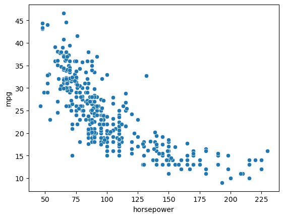
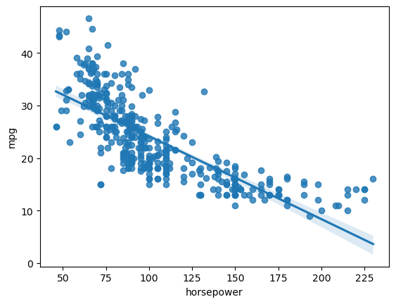
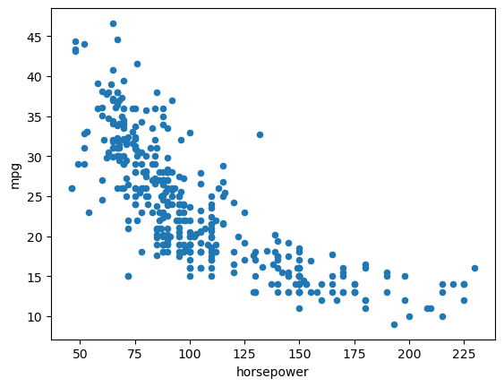
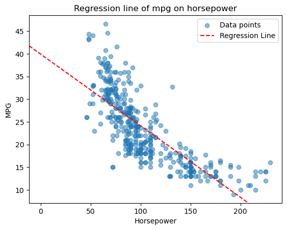
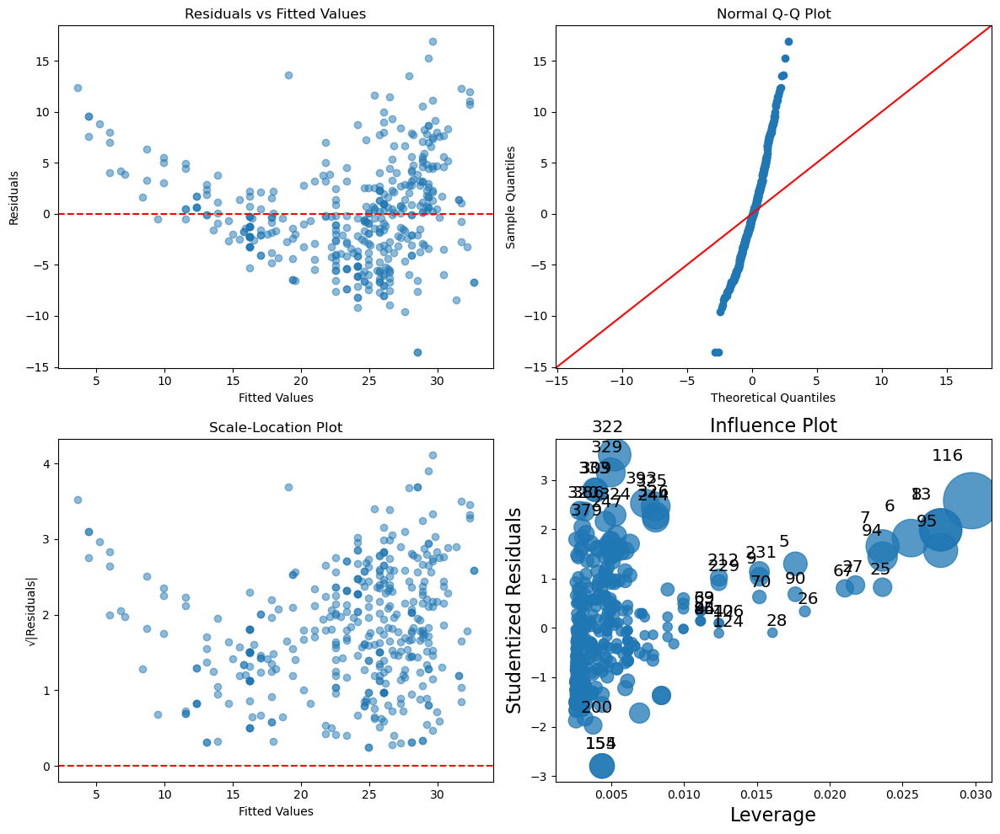
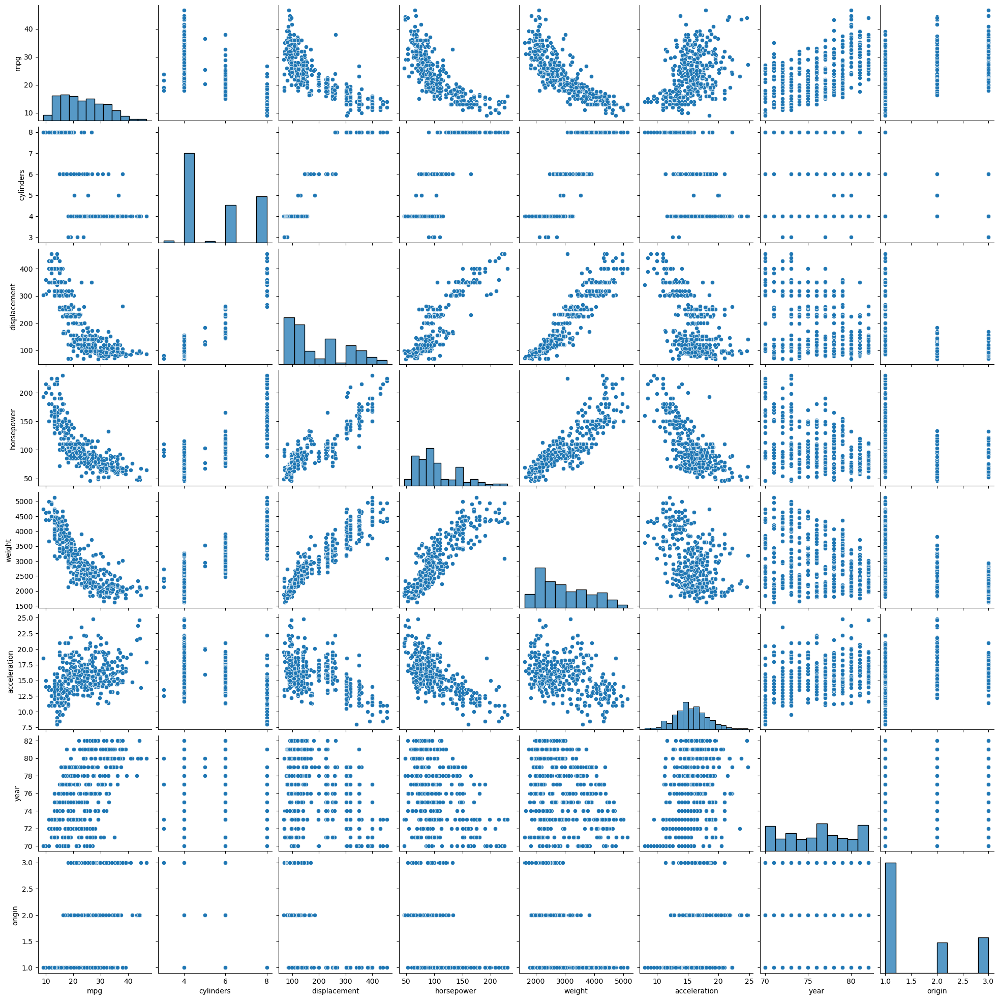
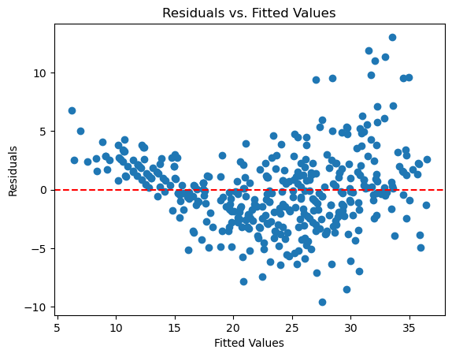
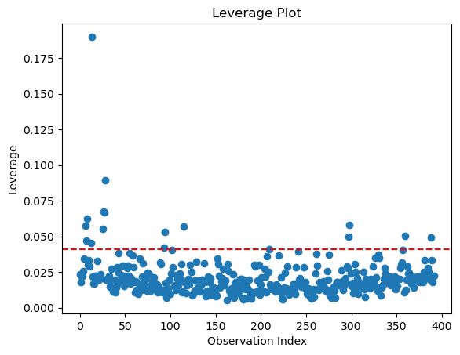

```python
!pip install pandas 
```

    Requirement already satisfied: pandas in /opt/anaconda3/lib/python3.12/site-packages (2.2.2)
    Requirement already satisfied: numpy>=1.26.0 in /opt/anaconda3/lib/python3.12/site-packages (from pandas) (1.26.4)
    Requirement already satisfied: python-dateutil>=2.8.2 in /opt/anaconda3/lib/python3.12/site-packages (from pandas) (2.9.0.post0)
    Requirement already satisfied: pytz>=2020.1 in /opt/anaconda3/lib/python3.12/site-packages (from pandas) (2024.1)
    Requirement already satisfied: tzdata>=2022.7 in /opt/anaconda3/lib/python3.12/site-packages (from pandas) (2023.3)
    Requirement already satisfied: six>=1.5 in /opt/anaconda3/lib/python3.12/site-packages (from python-dateutil>=2.8.2->pandas) (1.16.0)


```python
import numpy as np                  # Scientific Computing
import pandas as pd                 # Data Analysis
import matplotlib.pyplot as plt     # Plotting
import statsmodels.api as sm
import seaborn as sns  

```


```python
from statsmodels.stats.outliers_influence \
import variance_inflation_factor as VIF
from statsmodels.stats.anova import anova_lm
```


```python
df_Auto = pd.read_csv("/Users/bayowaonabajo/Downloads/Auto.csv")
```


```python
# drop missing values
df_Auto["horsepower"] = pd.to_numeric(df_Auto["horsepower"], errors="coerce")
df_Auto = df_Auto.dropna(subset=["horsepower"])
```


```python
df_Auto.head()
```


<div>
<style scoped>
    .dataframe tbody tr th:only-of-type {
        vertical-align: middle;
    }

    .dataframe tbody tr th {
        vertical-align: top;
    }

    .dataframe thead th {
        text-align: right;
    }
</style>
<table border="1" class="dataframe">
  <thead>
    <tr style="text-align: right;">
      <th></th>
      <th>mpg</th>
      <th>cylinders</th>
      <th>displacement</th>
      <th>horsepower</th>
      <th>weight</th>
      <th>acceleration</th>
      <th>year</th>
      <th>origin</th>
      <th>name</th>
    </tr>
  </thead>
  <tbody>
    <tr>
      <th>0</th>
      <td>18.0</td>
      <td>8</td>
      <td>307.0</td>
      <td>130.0</td>
      <td>3504</td>
      <td>12.0</td>
      <td>70</td>
      <td>1</td>
      <td>chevrolet chevelle malibu</td>
    </tr>
    <tr>
      <th>1</th>
      <td>15.0</td>
      <td>8</td>
      <td>350.0</td>
      <td>165.0</td>
      <td>3693</td>
      <td>11.5</td>
      <td>70</td>
      <td>1</td>
      <td>buick skylark 320</td>
    </tr>
    <tr>
      <th>2</th>
      <td>18.0</td>
      <td>8</td>
      <td>318.0</td>
      <td>150.0</td>
      <td>3436</td>
      <td>11.0</td>
      <td>70</td>
      <td>1</td>
      <td>plymouth satellite</td>
    </tr>
    <tr>
      <th>3</th>
      <td>16.0</td>
      <td>8</td>
      <td>304.0</td>
      <td>150.0</td>
      <td>3433</td>
      <td>12.0</td>
      <td>70</td>
      <td>1</td>
      <td>amc rebel sst</td>
    </tr>
    <tr>
      <th>4</th>
      <td>17.0</td>
      <td>8</td>
      <td>302.0</td>
      <td>140.0</td>
      <td>3449</td>
      <td>10.5</td>
      <td>70</td>
      <td>1</td>
      <td>ford torino</td>
    </tr>
  </tbody>
</table>
</div>


```python
df_Auto.isnull().sum()
```


    mpg             0
    cylinders       0
    displacement    0
    horsepower      0
    weight          0
    acceleration    0
    year            0
    origin          0
    name            0
    dtype: int64


```python

```


```python
#8a - c
X = pd.DataFrame({'intercept': np.ones(df_Auto.shape[0]),
'horsepower': df_Auto['horsepower']})
X[:4]
```


<div>
<style scoped>
    .dataframe tbody tr th:only-of-type {
        vertical-align: middle;
    }

    .dataframe tbody tr th {
        vertical-align: top;
    }

    .dataframe thead th {
        text-align: right;
    }
</style>
<table border="1" class="dataframe">
  <thead>
    <tr style="text-align: right;">
      <th></th>
      <th>intercept</th>
      <th>horsepower</th>
    </tr>
  </thead>
  <tbody>
    <tr>
      <th>0</th>
      <td>1.0</td>
      <td>130.0</td>
    </tr>
    <tr>
      <th>1</th>
      <td>1.0</td>
      <td>165.0</td>
    </tr>
    <tr>
      <th>2</th>
      <td>1.0</td>
      <td>150.0</td>
    </tr>
    <tr>
      <th>3</th>
      <td>1.0</td>
      <td>150.0</td>
    </tr>
  </tbody>
</table>
</div>


```python
sns.scatterplot(x='horsepower',y='mpg',data=df_Auto)

```


    <Axes: xlabel='horsepower', ylabel='mpg'>


    

    


```python
sns.regplot(x='horsepower',y='mpg',data=df_Auto)
```


    <Axes: xlabel='horsepower', ylabel='mpg'>


    

    


```python
y = df_Auto['mpg']
model = sm.OLS(y, X)
results = model.fit()
results.summary()
```


<table class="simpletable">
<caption>OLS Regression Results</caption>
<tr>
  <th>Dep. Variable:</th>           <td>mpg</td>       <th>  R-squared:         </th> <td>   0.606</td>
</tr>
<tr>
  <th>Model:</th>                   <td>OLS</td>       <th>  Adj. R-squared:    </th> <td>   0.605</td>
</tr>
<tr>
  <th>Method:</th>             <td>Least Squares</td>  <th>  F-statistic:       </th> <td>   599.7</td>
</tr>
<tr>
  <th>Date:</th>             <td>Sun, 23 Feb 2025</td> <th>  Prob (F-statistic):</th> <td>7.03e-81</td>
</tr>
<tr>
  <th>Time:</th>                 <td>14:49:13</td>     <th>  Log-Likelihood:    </th> <td> -1178.7</td>
</tr>
<tr>
  <th>No. Observations:</th>      <td>   392</td>      <th>  AIC:               </th> <td>   2361.</td>
</tr>
<tr>
  <th>Df Residuals:</th>          <td>   390</td>      <th>  BIC:               </th> <td>   2369.</td>
</tr>
<tr>
  <th>Df Model:</th>              <td>     1</td>      <th>                     </th>     <td> </td>   
</tr>
<tr>
  <th>Covariance Type:</th>      <td>nonrobust</td>    <th>                     </th>     <td> </td>   
</tr>
</table>
<table class="simpletable">
<tr>
       <td></td>         <th>coef</th>     <th>std err</th>      <th>t</th>      <th>P>|t|</th>  <th>[0.025</th>    <th>0.975]</th>  
</tr>
<tr>
  <th>intercept</th>  <td>   39.9359</td> <td>    0.717</td> <td>   55.660</td> <td> 0.000</td> <td>   38.525</td> <td>   41.347</td>
</tr>
<tr>
  <th>horsepower</th> <td>   -0.1578</td> <td>    0.006</td> <td>  -24.489</td> <td> 0.000</td> <td>   -0.171</td> <td>   -0.145</td>
</tr>
</table>
<table class="simpletable">
<tr>
  <th>Omnibus:</th>       <td>16.432</td> <th>  Durbin-Watson:     </th> <td>   0.920</td>
</tr>
<tr>
  <th>Prob(Omnibus):</th> <td> 0.000</td> <th>  Jarque-Bera (JB):  </th> <td>  17.305</td>
</tr>
<tr>
  <th>Skew:</th>          <td> 0.492</td> <th>  Prob(JB):          </th> <td>0.000175</td>
</tr>
<tr>
  <th>Kurtosis:</th>      <td> 3.299</td> <th>  Cond. No.          </th> <td>    322.</td>
</tr>
</table><br/><br/>Notes:<br/>[1] Standard Errors assume that the covariance matrix of the errors is correctly specified.


```python
results.params
```


    intercept     39.935861
    horsepower    -0.157845
    dtype: float64


```python

```


```python

# Define predictor and response
X = df_Auto["horsepower"]
y = df_Auto["mpg"]

# Add constant for the intercept
X = sm.add_constant(X)

# Fit the model
model = sm.OLS(y, X).fit()

# Print summary
print(model.summary())
```

                                OLS Regression Results                            
    ==============================================================================
    Dep. Variable:                    mpg   R-squared:                       0.606
    Model:                            OLS   Adj. R-squared:                  0.605
    Method:                 Least Squares   F-statistic:                     599.7
    Date:                Sun, 23 Feb 2025   Prob (F-statistic):           7.03e-81
    Time:                        14:49:14   Log-Likelihood:                -1178.7
    No. Observations:                 392   AIC:                             2361.
    Df Residuals:                     390   BIC:                             2369.
    Df Model:                           1                                         
    Covariance Type:            nonrobust                                         
    ==============================================================================
                     coef    std err          t      P>|t|      [0.025      0.975]
    ------------------------------------------------------------------------------
    const         39.9359      0.717     55.660      0.000      38.525      41.347
    horsepower    -0.1578      0.006    -24.489      0.000      -0.171      -0.145
    ==============================================================================
    Omnibus:                       16.432   Durbin-Watson:                   0.920
    Prob(Omnibus):                  0.000   Jarque-Bera (JB):               17.305
    Skew:                           0.492   Prob(JB):                     0.000175
    Kurtosis:                       3.299   Cond. No.                         322.
    ==============================================================================
    
    Notes:
    [1] Standard Errors assume that the covariance matrix of the errors is correctly specified.


R squared(0.606) means that 60.6 percent of the variance in mpg is explained by horsepower. This indicates a moderately strong relationship.
Adusted R-squared(0.605) is adjusted for the number of predictors, it is very close to R squared, meaning adding more variables would not significantly change the model.

Intercept (39.94): Means when horsepower is 0, the predicted mpg is 39.94.

Horsepower (-0.1578): For each additional unit of horsepower, the mpg decreases by 0.1578.Since this coefficient is negative, the relationship is inverse implying that higher horsepower leads to lower fuel efficiency.

P-values (< 0.05): Both coefficients are highly significant and is strong evidence that horsepower affects mpg.


```python
import numpy as np
import pandas as pd

# Create new observation with horsepower = 98, including intercept term
X_new = pd.DataFrame({"const": [1], "horsepower": [98]})

# Get predictions
prediction = model.get_prediction(X_new)

# Print confidence and prediction intervals
prediction.summary_frame(alpha=0.05)


```


<div>
<style scoped>
    .dataframe tbody tr th:only-of-type {
        vertical-align: middle;
    }

    .dataframe tbody tr th {
        vertical-align: top;
    }

    .dataframe thead th {
        text-align: right;
    }
</style>
<table border="1" class="dataframe">
  <thead>
    <tr style="text-align: right;">
      <th></th>
      <th>mean</th>
      <th>mean_se</th>
      <th>mean_ci_lower</th>
      <th>mean_ci_upper</th>
      <th>obs_ci_lower</th>
      <th>obs_ci_upper</th>
    </tr>
  </thead>
  <tbody>
    <tr>
      <th>0</th>
      <td>24.467077</td>
      <td>0.251262</td>
      <td>23.973079</td>
      <td>24.961075</td>
      <td>14.809396</td>
      <td>34.124758</td>
    </tr>
  </tbody>
</table>
</div>


Interpretation: 
A car with 98 horsepower is expected to have 24.47 mpg(mean) on average as Predicted mpg.

The mean mpg for cars with 98 horsepower is most likely between 23.97 and 24.96.

Predicted mpg for Horsepower = 98 at 95 % confidence(alpha - 0.05)

So, for a car with 98 horsepower, the predicted fuel efficiency is 24.47 mpg.


```python
def abline(ax, b, m):
    "Add a line with slope m and intercept b to ax"
    xlim = ax.get_xlim()
    ylim = [m * xlim[0] + b, m * xlim[1] + b]
    ax.plot(xlim, ylim)
```


```python
ax = df_Auto.plot.scatter('horsepower', 'mpg')
abline(ax,
results.params[0],
results.params[1],
'r--',
linewidth=3)
```

    /var/folders/z0/vng18cmj41x80kcsp_9tylwr0000gn/T/ipykernel_1564/991214615.py:3: FutureWarning: Series.__getitem__ treating keys as positions is deprecated. In a future version, integer keys will always be treated as labels (consistent with DataFrame behavior). To access a value by position, use `ser.iloc[pos]`
      results.params[0],
    /var/folders/z0/vng18cmj41x80kcsp_9tylwr0000gn/T/ipykernel_1564/991214615.py:4: FutureWarning: Series.__getitem__ treating keys as positions is deprecated. In a future version, integer keys will always be treated as labels (consistent with DataFrame behavior). To access a value by position, use `ser.iloc[pos]`
      results.params[1],


    ---------------------------------------------------------------------------

    TypeError                                 Traceback (most recent call last)

    Cell In[83], line 2
          1 ax = df_Auto.plot.scatter('horsepower', 'mpg')
    ----> 2 abline(ax,
          3 results.params[0],
          4 results.params[1],
          5 'r--',
          6 linewidth=3)


    TypeError: abline() got an unexpected keyword argument 'linewidth'


    

    


```python
import matplotlib.pyplot as plt

# scatter plot
fig, ax = plt.subplots()
ax.scatter(df_Auto["horsepower"], df_Auto["mpg"], alpha=0.5, label="Data points")

# regression line using ax.axline()
slope = model.params["horsepower"]
intercept = model.params["const"]
ax.axline((0, intercept), slope=slope, color='red', linestyle='--', label="Regression Line")

# Labels, title
ax.set_xlabel("Horsepower")
ax.set_ylabel("MPG")
ax.set_title("Regression line of mpg on horsepower")
ax.legend()
plt.show()

```


    

    


```python
import statsmodels.api as sm
import matplotlib.pyplot as plt
import numpy as np
import seaborn as sns

# Get residuals and fitted values
residuals = model.resid
fitted_values = model.fittedvalues

# Create figure
fig, axes = plt.subplots(2, 2, figsize=(12, 10))

## 1. Residuals vs Fitted Values Plot
axes[0, 0].scatter(fitted_values, residuals, alpha=0.5)
axes[0, 0].axhline(0, color='red', linestyle='--')
axes[0, 0].set_xlabel("Fitted Values")
axes[0, 0].set_ylabel("Residuals")
axes[0, 0].set_title("Residuals vs Fitted Values")

## 2. Normal Q-Q Plot
sm.qqplot(residuals, line='45', ax=axes[0, 1])
axes[0, 1].set_title("Normal Q-Q Plot")

## 3. Scale-Location Plot
axes[1, 0].scatter(fitted_values, np.sqrt(np.abs(residuals)), alpha=0.5)
axes[1, 0].axhline(0, color='red', linestyle='--')
axes[1, 0].set_xlabel("Fitted Values")
axes[1, 0].set_ylabel("√|Residuals|")
axes[1, 0].set_title("Scale-Location Plot")

## 4. Residuals vs Leverage Plot
sm.graphics.influence_plot(model, ax=axes[1, 1], criterion="cooks")

# Display plots
plt.tight_layout()
plt.show()

```


    

    


Residuals plot shows a pattern meaning the relationship between the predictor (horsepower) and response (mpg) may not be purely linear.
The Scale Location Plot suggests non constant variance of residuals,showing no homoscedasticity.
The Normal Q Q Plot shows deviations from normality, indicating that the residuals are not normally distributed.
The Influence Plot identifies potential outliers that may distort the regression results.


```python
df_Auto.head()
```


<div>
<style scoped>
    .dataframe tbody tr th:only-of-type {
        vertical-align: middle;
    }

    .dataframe tbody tr th {
        vertical-align: top;
    }

    .dataframe thead th {
        text-align: right;
    }
</style>
<table border="1" class="dataframe">
  <thead>
    <tr style="text-align: right;">
      <th></th>
      <th>mpg</th>
      <th>cylinders</th>
      <th>displacement</th>
      <th>horsepower</th>
      <th>weight</th>
      <th>acceleration</th>
      <th>year</th>
      <th>origin</th>
      <th>name</th>
    </tr>
  </thead>
  <tbody>
    <tr>
      <th>0</th>
      <td>18.0</td>
      <td>8</td>
      <td>307.0</td>
      <td>130.0</td>
      <td>3504</td>
      <td>12.0</td>
      <td>70</td>
      <td>1</td>
      <td>chevrolet chevelle malibu</td>
    </tr>
    <tr>
      <th>1</th>
      <td>15.0</td>
      <td>8</td>
      <td>350.0</td>
      <td>165.0</td>
      <td>3693</td>
      <td>11.5</td>
      <td>70</td>
      <td>1</td>
      <td>buick skylark 320</td>
    </tr>
    <tr>
      <th>2</th>
      <td>18.0</td>
      <td>8</td>
      <td>318.0</td>
      <td>150.0</td>
      <td>3436</td>
      <td>11.0</td>
      <td>70</td>
      <td>1</td>
      <td>plymouth satellite</td>
    </tr>
    <tr>
      <th>3</th>
      <td>16.0</td>
      <td>8</td>
      <td>304.0</td>
      <td>150.0</td>
      <td>3433</td>
      <td>12.0</td>
      <td>70</td>
      <td>1</td>
      <td>amc rebel sst</td>
    </tr>
    <tr>
      <th>4</th>
      <td>17.0</td>
      <td>8</td>
      <td>302.0</td>
      <td>140.0</td>
      <td>3449</td>
      <td>10.5</td>
      <td>70</td>
      <td>1</td>
      <td>ford torino</td>
    </tr>
  </tbody>
</table>
</div>


```python
df_Auto.isnull().sum()
```


    mpg             0
    cylinders       0
    displacement    0
    horsepower      0
    weight          0
    acceleration    0
    year            0
    origin          0
    name            0
    dtype: int64


```python
#9a - c
import seaborn as sns
import matplotlib.pyplot as plt

# Select numeric columns
numeric_cols = df_Auto.drop(columns=["name"])

# Create scatterplot matrix
sns.pairplot(numeric_cols)
plt.show()
```


    

    


```python
# correlation matrix for all numeric columns
correlation_matrix = df_Auto.corr(numeric_only=True)

# Display the correlation matrix
print(correlation_matrix)
```

                       mpg  cylinders  displacement  horsepower    weight  \
    mpg           1.000000  -0.777618     -0.805127   -0.778427 -0.832244   
    cylinders    -0.777618   1.000000      0.950823    0.842983  0.897527   
    displacement -0.805127   0.950823      1.000000    0.897257  0.932994   
    horsepower   -0.778427   0.842983      0.897257    1.000000  0.864538   
    weight       -0.832244   0.897527      0.932994    0.864538  1.000000   
    acceleration  0.423329  -0.504683     -0.543800   -0.689196 -0.416839   
    year          0.580541  -0.345647     -0.369855   -0.416361 -0.309120   
    origin        0.565209  -0.568932     -0.614535   -0.455171 -0.585005   
    
                  acceleration      year    origin  
    mpg               0.423329  0.580541  0.565209  
    cylinders        -0.504683 -0.345647 -0.568932  
    displacement     -0.543800 -0.369855 -0.614535  
    horsepower       -0.689196 -0.416361 -0.455171  
    weight           -0.416839 -0.309120 -0.585005  
    acceleration      1.000000  0.290316  0.212746  
    year              0.290316  1.000000  0.181528  
    origin            0.212746  0.181528  1.000000  


```python
#predictor variables 
X = numeric_cols.drop(columns=["mpg"])

# Add constant for the intercept
X = sm.add_constant(X)

# Define response variable
y = numeric_cols["mpg"]

# Fit the model
multi_model = sm.OLS(y, X).fit()

# Print summary
print(multi_model.summary())
```

                                OLS Regression Results                            
    ==============================================================================
    Dep. Variable:                    mpg   R-squared:                       0.821
    Model:                            OLS   Adj. R-squared:                  0.818
    Method:                 Least Squares   F-statistic:                     252.4
    Date:                Sun, 23 Feb 2025   Prob (F-statistic):          2.04e-139
    Time:                        14:49:21   Log-Likelihood:                -1023.5
    No. Observations:                 392   AIC:                             2063.
    Df Residuals:                     384   BIC:                             2095.
    Df Model:                           7                                         
    Covariance Type:            nonrobust                                         
    ================================================================================
                       coef    std err          t      P>|t|      [0.025      0.975]
    --------------------------------------------------------------------------------
    const          -17.2184      4.644     -3.707      0.000     -26.350      -8.087
    cylinders       -0.4934      0.323     -1.526      0.128      -1.129       0.142
    displacement     0.0199      0.008      2.647      0.008       0.005       0.035
    horsepower      -0.0170      0.014     -1.230      0.220      -0.044       0.010
    weight          -0.0065      0.001     -9.929      0.000      -0.008      -0.005
    acceleration     0.0806      0.099      0.815      0.415      -0.114       0.275
    year             0.7508      0.051     14.729      0.000       0.651       0.851
    origin           1.4261      0.278      5.127      0.000       0.879       1.973
    ==============================================================================
    Omnibus:                       31.906   Durbin-Watson:                   1.309
    Prob(Omnibus):                  0.000   Jarque-Bera (JB):               53.100
    Skew:                           0.529   Prob(JB):                     2.95e-12
    Kurtosis:                       4.460   Cond. No.                     8.59e+04
    ==============================================================================
    
    Notes:
    [1] Standard Errors assume that the covariance matrix of the errors is correctly specified.
    [2] The condition number is large, 8.59e+04. This might indicate that there are
    strong multicollinearity or other numerical problems.


```python
import pandas as pd
import statsmodels.api as sm
import statsmodels.formula.api as smf
from statsmodels.stats.anova import anova_lm


# Fit model using formula-based regression
multi_model = smf.ols('mpg ~ cylinders + displacement + horsepower + weight + acceleration + year + origin', data=df_Auto).fit()

# Perform ANOVA
anova_results = anova_lm(multi_model)
print(anova_results)

```

                     df        sum_sq       mean_sq            F         PR(>F)
    cylinders       1.0  14403.083079  14403.083079  1300.683788  2.319511e-125
    displacement    1.0   1073.344025   1073.344025    96.929329   1.530906e-20
    horsepower      1.0    403.408069    403.408069    36.430140   3.731128e-09
    weight          1.0    975.724953    975.724953    88.113748   5.544461e-19
    acceleration    1.0      0.966071      0.966071     0.087242   7.678728e-01
    year            1.0   2419.120249   2419.120249   218.460900   1.875281e-39
    origin          1.0    291.134494    291.134494    26.291171   4.665681e-07
    Residual      384.0   4252.212530     11.073470          NaN            NaN


```python
plt.scatter(multi_model.fittedvalues, multi_model.resid)
plt.axhline(y=0, color="red", linestyle="--")
plt.xlabel("Fitted Values")
plt.ylabel("Residuals")
plt.title("Residuals vs. Fitted Values")
plt.show()
```


    

    


```python
import numpy as np

influence = multi_model.get_influence()
leverage = influence.hat_matrix_diag
plt.scatter(range(len(leverage)), leverage)
plt.axhline(y=2*np.mean(leverage), color="red", linestyle="--")
plt.xlabel("Observation Index")
plt.ylabel("Leverage")
plt.title("Leverage Plot")
plt.show()
```


    

    


```python
X["horsepower_acceleration"] = X["horsepower"] * X["acceleration"]

# Fit model with interaction
interaction_model = sm.OLS(y, X).fit()

# Print 
print(interaction_model.summary())
```

                                OLS Regression Results                            
    ==============================================================================
    Dep. Variable:                    mpg   R-squared:                       0.841
    Model:                            OLS   Adj. R-squared:                  0.838
    Method:                 Least Squares   F-statistic:                     253.2
    Date:                Sun, 23 Feb 2025   Prob (F-statistic):          8.74e-148
    Time:                        14:50:23   Log-Likelihood:                -1000.8
    No. Observations:                 392   AIC:                             2020.
    Df Residuals:                     383   BIC:                             2055.
    Df Model:                           8                                         
    Covariance Type:            nonrobust                                         
    ===========================================================================================
                                  coef    std err          t      P>|t|      [0.025      0.975]
    -------------------------------------------------------------------------------------------
    const                     -32.4998      4.923     -6.601      0.000     -42.180     -22.820
    cylinders                   0.0835      0.317      0.263      0.792      -0.540       0.707
    displacement               -0.0076      0.008     -0.937      0.349      -0.024       0.008
    horsepower                  0.1272      0.025      5.140      0.000       0.079       0.176
    weight                     -0.0040      0.001     -5.552      0.000      -0.005      -0.003
    acceleration                0.9833      0.162      6.088      0.000       0.666       1.301
    year                        0.7559      0.048     15.690      0.000       0.661       0.851
    origin                      1.0357      0.269      3.851      0.000       0.507       1.565
    horsepower_acceleration    -0.0121      0.002     -6.851      0.000      -0.016      -0.009
    ==============================================================================
    Omnibus:                       21.612   Durbin-Watson:                   1.469
    Prob(Omnibus):                  0.000   Jarque-Bera (JB):               34.894
    Skew:                           0.382   Prob(JB):                     2.65e-08
    Kurtosis:                       4.246   Cond. No.                     1.08e+05
    ==============================================================================
    
    Notes:
    [1] Standard Errors assume that the covariance matrix of the errors is correctly specified.
    [2] The condition number is large, 1.08e+05. This might indicate that there are
    strong multicollinearity or other numerical problems.


```python
import numpy as np

# Log transformation
X["log_acceleration"] = np.log(X["acceleration"])
X["sqrt_horsepower"] = np.sqrt(X["horsepower"])
X["horsepower_squared"] = X["horsepower"] ** 2

# Fit model with transformations
transformed_model = sm.OLS(y, X).fit()

# Print summary
print(transformed_model.summary())
```

                                OLS Regression Results                            
    ==============================================================================
    Dep. Variable:                    mpg   R-squared:                       0.860
    Model:                            OLS   Adj. R-squared:                  0.856
    Method:                 Least Squares   F-statistic:                     212.9
    Date:                Sun, 23 Feb 2025   Prob (F-statistic):          6.33e-155
    Time:                        14:50:43   Log-Likelihood:                -975.28
    No. Observations:                 392   AIC:                             1975.
    Df Residuals:                     380   BIC:                             2022.
    Df Model:                          11                                         
    Covariance Type:            nonrobust                                         
    ===========================================================================================
                                  coef    std err          t      P>|t|      [0.025      0.975]
    -------------------------------------------------------------------------------------------
    const                      88.6949     34.155      2.597      0.010      21.538     155.852
    cylinders                  -0.0821      0.340     -0.241      0.810      -0.752       0.587
    displacement               -0.0055      0.008     -0.685      0.494      -0.021       0.010
    horsepower                  0.7263      0.337      2.152      0.032       0.063       1.390
    weight                     -0.0033      0.001     -4.671      0.000      -0.005      -0.002
    acceleration                0.4690      0.542      0.866      0.387      -0.596       1.534
    year                        0.7440      0.045     16.382      0.000       0.655       0.833
    origin                      0.9011      0.257      3.512      0.000       0.397       1.406
    horsepower_acceleration     0.0015      0.003      0.449      0.654      -0.005       0.008
    log_acceleration          -15.1479     11.938     -1.269      0.205     -38.621       8.325
    sqrt_horsepower           -14.9373      4.862     -3.072      0.002     -24.497      -5.377
    horsepower_squared         -0.0005      0.000     -1.005      0.316      -0.001       0.000
    ==============================================================================
    Omnibus:                       23.937   Durbin-Watson:                   1.631
    Prob(Omnibus):                  0.000   Jarque-Bera (JB):               45.717
    Skew:                           0.360   Prob(JB):                     1.18e-10
    Kurtosis:                       4.510   Cond. No.                     3.84e+06
    ==============================================================================
    
    Notes:
    [1] Standard Errors assume that the covariance matrix of the errors is correctly specified.
    [2] The condition number is large, 3.84e+06. This might indicate that there are
    strong multicollinearity or other numerical problems.


```python

```
