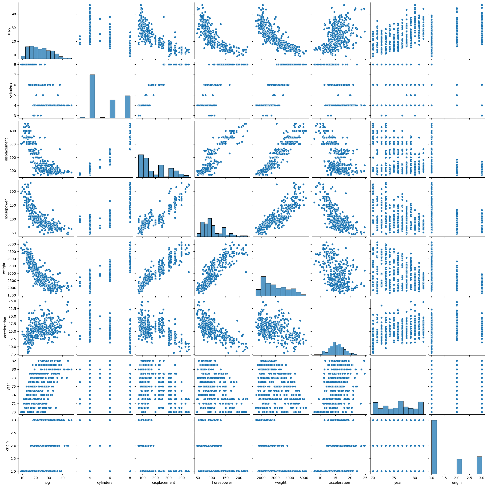
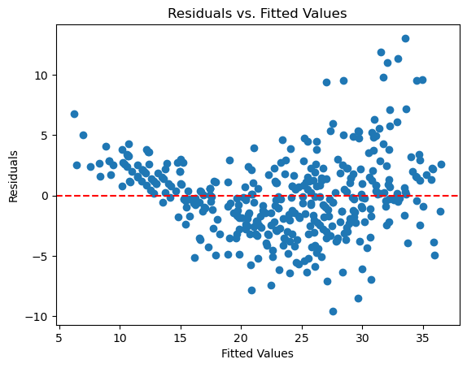
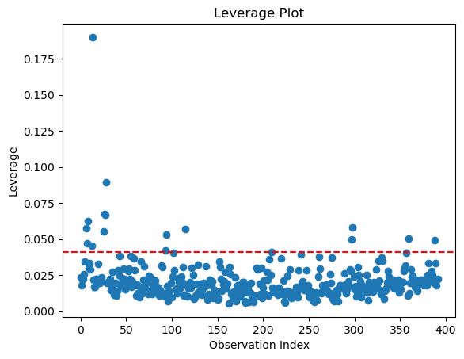

```python
import numpy as np                  # Scientific Computing
import pandas as pd                 # Data Analysis
import matplotlib.pyplot as plt     # Plotting
import statsmodels.api as sm
import seaborn as sns  

```


```python
df_Auto = pd.read_csv("/Users/bayowaonabajo/Downloads/Auto.csv")
```


```python
# drop missing values
df_Auto["horsepower"] = pd.to_numeric(df_Auto["horsepower"], errors="coerce")
df_Auto = df_Auto.dropna(subset=["horsepower"])
```


```python
df_Auto.head()
```


<div>
<style scoped>
    .dataframe tbody tr th:only-of-type {
        vertical-align: middle;
    }

    .dataframe tbody tr th {
        vertical-align: top;
    }

    .dataframe thead th {
        text-align: right;
    }
</style>
<table border="1" class="dataframe">
  <thead>
    <tr style="text-align: right;">
      <th></th>
      <th>mpg</th>
      <th>cylinders</th>
      <th>displacement</th>
      <th>horsepower</th>
      <th>weight</th>
      <th>acceleration</th>
      <th>year</th>
      <th>origin</th>
      <th>name</th>
    </tr>
  </thead>
  <tbody>
    <tr>
      <th>0</th>
      <td>18.0</td>
      <td>8</td>
      <td>307.0</td>
      <td>130.0</td>
      <td>3504</td>
      <td>12.0</td>
      <td>70</td>
      <td>1</td>
      <td>chevrolet chevelle malibu</td>
    </tr>
    <tr>
      <th>1</th>
      <td>15.0</td>
      <td>8</td>
      <td>350.0</td>
      <td>165.0</td>
      <td>3693</td>
      <td>11.5</td>
      <td>70</td>
      <td>1</td>
      <td>buick skylark 320</td>
    </tr>
    <tr>
      <th>2</th>
      <td>18.0</td>
      <td>8</td>
      <td>318.0</td>
      <td>150.0</td>
      <td>3436</td>
      <td>11.0</td>
      <td>70</td>
      <td>1</td>
      <td>plymouth satellite</td>
    </tr>
    <tr>
      <th>3</th>
      <td>16.0</td>
      <td>8</td>
      <td>304.0</td>
      <td>150.0</td>
      <td>3433</td>
      <td>12.0</td>
      <td>70</td>
      <td>1</td>
      <td>amc rebel sst</td>
    </tr>
    <tr>
      <th>4</th>
      <td>17.0</td>
      <td>8</td>
      <td>302.0</td>
      <td>140.0</td>
      <td>3449</td>
      <td>10.5</td>
      <td>70</td>
      <td>1</td>
      <td>ford torino</td>
    </tr>
  </tbody>
</table>
</div>


```python
df_Auto.isnull().sum()
```


    mpg             0
    cylinders       0
    displacement    0
    horsepower      0
    weight          0
    acceleration    0
    year            0
    origin          0
    name            0
    dtype: int64


```python
#9a - c
import seaborn as sns
import matplotlib.pyplot as plt

# Select numeric columns
numeric_cols = df_Auto.drop(columns=["name"])

# Create scatterplot matrix
sns.pairplot(numeric_cols)
plt.show()
```


    

    


```python
# correlation matrix for all numeric columns
correlation_matrix = df_Auto.corr(numeric_only=True)

# Display the correlation matrix
print(correlation_matrix)


```

                       mpg  cylinders  displacement  horsepower    weight  \
    mpg           1.000000  -0.777618     -0.805127   -0.778427 -0.832244   
    cylinders    -0.777618   1.000000      0.950823    0.842983  0.897527   
    displacement -0.805127   0.950823      1.000000    0.897257  0.932994   
    horsepower   -0.778427   0.842983      0.897257    1.000000  0.864538   
    weight       -0.832244   0.897527      0.932994    0.864538  1.000000   
    acceleration  0.423329  -0.504683     -0.543800   -0.689196 -0.416839   
    year          0.580541  -0.345647     -0.369855   -0.416361 -0.309120   
    origin        0.565209  -0.568932     -0.614535   -0.455171 -0.585005   
    
                  acceleration      year    origin  
    mpg               0.423329  0.580541  0.565209  
    cylinders        -0.504683 -0.345647 -0.568932  
    displacement     -0.543800 -0.369855 -0.614535  
    horsepower       -0.689196 -0.416361 -0.455171  
    weight           -0.416839 -0.309120 -0.585005  
    acceleration      1.000000  0.290316  0.212746  
    year              0.290316  1.000000  0.181528  
    origin            0.212746  0.181528  1.000000  


```python
#predictor variables 
X = numeric_cols.drop(columns=["mpg"])

# Add constant for the intercept
X = sm.add_constant(X)

# Define response variable
y = numeric_cols["mpg"]

# Fit the model
multi_model = sm.OLS(y, X).fit()

# Print summary
print(multi_model.summary())

```

                                OLS Regression Results                            
    ==============================================================================
    Dep. Variable:                    mpg   R-squared:                       0.821
    Model:                            OLS   Adj. R-squared:                  0.818
    Method:                 Least Squares   F-statistic:                     252.4
    Date:                Sun, 09 Feb 2025   Prob (F-statistic):          2.04e-139
    Time:                        20:10:46   Log-Likelihood:                -1023.5
    No. Observations:                 392   AIC:                             2063.
    Df Residuals:                     384   BIC:                             2095.
    Df Model:                           7                                         
    Covariance Type:            nonrobust                                         
    ================================================================================
                       coef    std err          t      P>|t|      [0.025      0.975]
    --------------------------------------------------------------------------------
    const          -17.2184      4.644     -3.707      0.000     -26.350      -8.087
    cylinders       -0.4934      0.323     -1.526      0.128      -1.129       0.142
    displacement     0.0199      0.008      2.647      0.008       0.005       0.035
    horsepower      -0.0170      0.014     -1.230      0.220      -0.044       0.010
    weight          -0.0065      0.001     -9.929      0.000      -0.008      -0.005
    acceleration     0.0806      0.099      0.815      0.415      -0.114       0.275
    year             0.7508      0.051     14.729      0.000       0.651       0.851
    origin           1.4261      0.278      5.127      0.000       0.879       1.973
    ==============================================================================
    Omnibus:                       31.906   Durbin-Watson:                   1.309
    Prob(Omnibus):                  0.000   Jarque-Bera (JB):               53.100
    Skew:                           0.529   Prob(JB):                     2.95e-12
    Kurtosis:                       4.460   Cond. No.                     8.59e+04
    ==============================================================================
    
    Notes:
    [1] Standard Errors assume that the covariance matrix of the errors is correctly specified.
    [2] The condition number is large, 8.59e+04. This might indicate that there are
    strong multicollinearity or other numerical problems.


```python
import pandas as pd
import statsmodels.api as sm
import statsmodels.formula.api as smf
from statsmodels.stats.anova import anova_lm


# Fit model using formula-based regression
multi_model = smf.ols('mpg ~ cylinders + displacement + horsepower + weight + acceleration + year + origin', data=df_Auto).fit()

# Perform ANOVA
anova_results = anova_lm(multi_model)
print(anova_results)

```

                     df        sum_sq       mean_sq            F         PR(>F)
    cylinders       1.0  14403.083079  14403.083079  1300.683788  2.319511e-125
    displacement    1.0   1073.344025   1073.344025    96.929329   1.530906e-20
    horsepower      1.0    403.408069    403.408069    36.430140   3.731128e-09
    weight          1.0    975.724953    975.724953    88.113748   5.544461e-19
    acceleration    1.0      0.966071      0.966071     0.087242   7.678728e-01
    year            1.0   2419.120249   2419.120249   218.460900   1.875281e-39
    origin          1.0    291.134494    291.134494    26.291171   4.665681e-07
    Residual      384.0   4252.212530     11.073470          NaN            NaN


There is significant relationship between predictors and mpg.

There is a strong relationship between the predictors and mpg.

The ANOVA table shows very small p-values for most predictors, which means they significantly contribute to explaining the variation in mpg.

The F-statistics for many variables are quite large (e.g., cylinders: 1300.68) confirming that these variables have a strong effect on mpg.

The acceleration has a high p-value (0.77), indicating it is not significantly related to mpg.

The statistically significant predictors are weight,displacement, year, origin, horsepower and cylinders 

The coefficient for year which is significant suggest that with each additional year, mpg increases by 0.75 on average and newer cars tend to be more fuel-efficient.


```python
plt.scatter(multi_model.fittedvalues, multi_model.resid)
plt.axhline(y=0, color="red", linestyle="--")
plt.xlabel("Fitted Values")
plt.ylabel("Residuals")
plt.title("Residuals vs. Fitted Values")
plt.show()
```


    

    


```python
import numpy as np

influence = multi_model.get_influence()
leverage = influence.hat_matrix_diag
plt.scatter(range(len(leverage)), leverage)
plt.axhline(y=2*np.mean(leverage), color="red", linestyle="--")
plt.xlabel("Observation Index")
plt.ylabel("Leverage")
plt.title("Leverage Plot")
plt.show()
```


    

    


There may be some outliers affecting this model and presence of heteroscedasticity suggests that a weighted regression model or transformation of the dependent variable could improve the fit.

The high-leverage points should be examined to see if they influence the regression results.


```python
X["horsepower_acceleration"] = X["horsepower"] * X["acceleration"]

# Fit model with interaction
interaction_model = sm.OLS(y, X).fit()

# Print 
print(interaction_model.summary())
```

                                OLS Regression Results                            
    ==============================================================================
    Dep. Variable:                    mpg   R-squared:                       0.841
    Model:                            OLS   Adj. R-squared:                  0.838
    Method:                 Least Squares   F-statistic:                     253.2
    Date:                Sun, 09 Feb 2025   Prob (F-statistic):          8.74e-148
    Time:                        20:15:02   Log-Likelihood:                -1000.8
    No. Observations:                 392   AIC:                             2020.
    Df Residuals:                     383   BIC:                             2055.
    Df Model:                           8                                         
    Covariance Type:            nonrobust                                         
    ===========================================================================================
                                  coef    std err          t      P>|t|      [0.025      0.975]
    -------------------------------------------------------------------------------------------
    const                     -32.4998      4.923     -6.601      0.000     -42.180     -22.820
    cylinders                   0.0835      0.317      0.263      0.792      -0.540       0.707
    displacement               -0.0076      0.008     -0.937      0.349      -0.024       0.008
    horsepower                  0.1272      0.025      5.140      0.000       0.079       0.176
    weight                     -0.0040      0.001     -5.552      0.000      -0.005      -0.003
    acceleration                0.9833      0.162      6.088      0.000       0.666       1.301
    year                        0.7559      0.048     15.690      0.000       0.661       0.851
    origin                      1.0357      0.269      3.851      0.000       0.507       1.565
    horsepower_acceleration    -0.0121      0.002     -6.851      0.000      -0.016      -0.009
    ==============================================================================
    Omnibus:                       21.612   Durbin-Watson:                   1.469
    Prob(Omnibus):                  0.000   Jarque-Bera (JB):               34.894
    Skew:                           0.382   Prob(JB):                     2.65e-08
    Kurtosis:                       4.246   Cond. No.                     1.08e+05
    ==============================================================================
    
    Notes:
    [1] Standard Errors assume that the covariance matrix of the errors is correctly specified.
    [2] The condition number is large, 1.08e+05. This might indicate that there are
    strong multicollinearity or other numerical problems.


The interaction between horsepower and acceleration appears to be statistically significant as the coefficient for horsepower_acceleration is -0.0121 and p-value is 0.000, which is well below the standard significance threshold of 0.05


```python
import numpy as np

# Log transformation
X["log_acceleration"] = np.log(X["acceleration"])
X["sqrt_horsepower"] = np.sqrt(X["horsepower"])
X["horsepower_squared"] = X["horsepower"] ** 2

# Fit model with transformations
transformed_model = sm.OLS(y, X).fit()

# Print summary
print(transformed_model.summary())
```

                                OLS Regression Results                            
    ==============================================================================
    Dep. Variable:                    mpg   R-squared:                       0.860
    Model:                            OLS   Adj. R-squared:                  0.856
    Method:                 Least Squares   F-statistic:                     212.9
    Date:                Sun, 09 Feb 2025   Prob (F-statistic):          6.33e-155
    Time:                        20:15:57   Log-Likelihood:                -975.28
    No. Observations:                 392   AIC:                             1975.
    Df Residuals:                     380   BIC:                             2022.
    Df Model:                          11                                         
    Covariance Type:            nonrobust                                         
    ===========================================================================================
                                  coef    std err          t      P>|t|      [0.025      0.975]
    -------------------------------------------------------------------------------------------
    const                      88.6949     34.155      2.597      0.010      21.538     155.852
    cylinders                  -0.0821      0.340     -0.241      0.810      -0.752       0.587
    displacement               -0.0055      0.008     -0.685      0.494      -0.021       0.010
    horsepower                  0.7263      0.337      2.152      0.032       0.063       1.390
    weight                     -0.0033      0.001     -4.671      0.000      -0.005      -0.002
    acceleration                0.4690      0.542      0.866      0.387      -0.596       1.534
    year                        0.7440      0.045     16.382      0.000       0.655       0.833
    origin                      0.9011      0.257      3.512      0.000       0.397       1.406
    horsepower_acceleration     0.0015      0.003      0.449      0.654      -0.005       0.008
    log_acceleration          -15.1479     11.938     -1.269      0.205     -38.621       8.325
    sqrt_horsepower           -14.9373      4.862     -3.072      0.002     -24.497      -5.377
    horsepower_squared         -0.0005      0.000     -1.005      0.316      -0.001       0.000
    ==============================================================================
    Omnibus:                       23.937   Durbin-Watson:                   1.631
    Prob(Omnibus):                  0.000   Jarque-Bera (JB):               45.717
    Skew:                           0.360   Prob(JB):                     1.18e-10
    Kurtosis:                       4.510   Cond. No.                     3.84e+06
    ==============================================================================
    
    Notes:
    [1] Standard Errors assume that the covariance matrix of the errors is correctly specified.
    [2] The condition number is large, 3.84e+06. This might indicate that there are
    strong multicollinearity or other numerical problems.


The R squared value increased from 0.841 in original model to 0.860, suggesting a better overall fit.

The log transformation of acceleration ( Coefficient = -15.1479, p-value = 0.205, Not significant)does not appear to have a meaningful impact on mpg.

Taking the square root of horsepower (Coefficient = -14.9373, p-value = 0.002, Significant)significantly affects mpg, suggesting a nonlinear relationship.

Squaring horsepower (Coefficient = -0.0005, p-value = 0.316 ,Not significant)did not improve the model.

Overall, transformations helped improve the model’s fit slightly.
