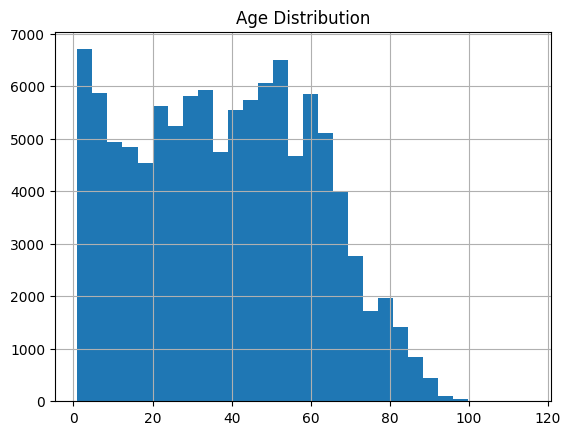
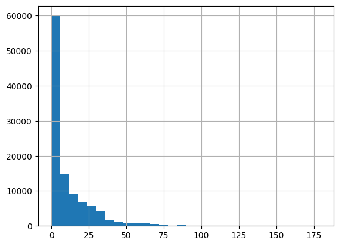
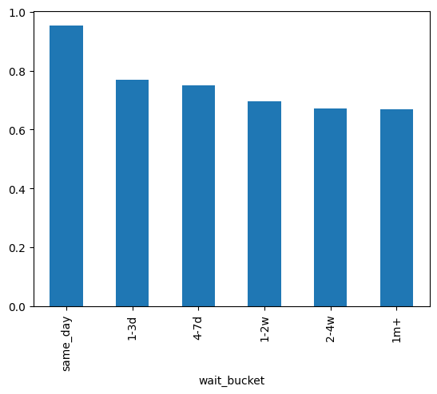
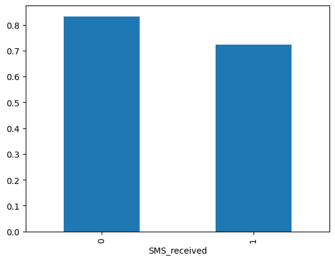
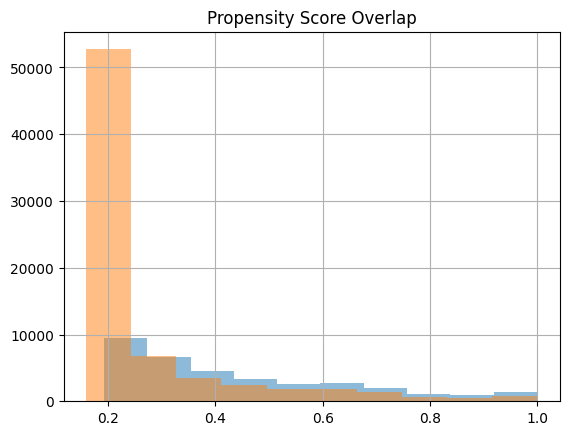

# Analysis of SMS Reminders on Patient No-Shows in Healthcare Appointments

## Overview
This project analyzes over 100,000 healthcare appointments to evaluate whether SMS reminders improve patient attendance. While initial results suggested SMS reminders were associated with lower attendance, further causal analysis revealed significant confounding due to non-random assignment and differences in patient wait times.

#### Dataset
Source: Healthcare appointment no-show dataset
Observations: 106,000
Key variables:
- Patient demographics
- Appointment scheduling time
- Wait time (Date.diff)
- SMS reminder indicator
- Attendance outcome (show)

#### Question
Do SMS reminders causally improve patient attendance at medical appointments, or are observed effects driven by confounding variables such as wait time?

#### Feature Engineering
- wait_days = AppointmentDay − ScheduledDay
- wait_bucket as categorical time intervals
- chronic_condition as hypertension OR diabetes
- risk_score (composite feature)


```python
import pandas as pd


df = pd.read_csv("/Users/bayowaonabajo/Downloads/healthcare_noshows_appt.csv")

#IDs to string
df['PatientId'] = df['PatientId'].astype(str)
df['AppointmentID'] = df['AppointmentID'].astype(str)

# dates conversion
df['ScheduledDay'] = pd.to_datetime(df['ScheduledDay'])
df['AppointmentDay'] = pd.to_datetime(df['AppointmentDay'])

#True/False to 1/0
bool_cols = ['Scholarship', 'Hipertension', 'Diabetes',
             'Alcoholism', 'Handcap', 'SMS_received', 'Showed_up']

for col in bool_cols:
    df[col] = df[col].map({'TRUE': 1, 'FALSE': 0})

# Rename target
df.rename(columns={'Showed_up': 'show'}, inplace=True)

df.head()
```


<div>
<style scoped>
    .dataframe tbody tr th:only-of-type {
        vertical-align: middle;
    }

    .dataframe tbody tr th {
        vertical-align: top;
    }

    .dataframe thead th {
        text-align: right;
    }
</style>
<table border="1" class="dataframe">
  <thead>
    <tr style="text-align: right;">
      <th></th>
      <th>PatientId</th>
      <th>AppointmentID</th>
      <th>Gender</th>
      <th>ScheduledDay</th>
      <th>AppointmentDay</th>
      <th>Age</th>
      <th>Neighbourhood</th>
      <th>Scholarship</th>
      <th>Hipertension</th>
      <th>Diabetes</th>
      <th>Alcoholism</th>
      <th>Handcap</th>
      <th>SMS_received</th>
      <th>show</th>
      <th>Date.diff</th>
    </tr>
  </thead>
  <tbody>
    <tr>
      <th>0</th>
      <td>29872499824296.0</td>
      <td>5642903</td>
      <td>F</td>
      <td>2016-04-29</td>
      <td>2016-04-29</td>
      <td>62</td>
      <td>JARDIM DA PENHA</td>
      <td>NaN</td>
      <td>NaN</td>
      <td>NaN</td>
      <td>NaN</td>
      <td>NaN</td>
      <td>NaN</td>
      <td>NaN</td>
      <td>0</td>
    </tr>
    <tr>
      <th>1</th>
      <td>558997776694438.0</td>
      <td>5642503</td>
      <td>M</td>
      <td>2016-04-29</td>
      <td>2016-04-29</td>
      <td>56</td>
      <td>JARDIM DA PENHA</td>
      <td>NaN</td>
      <td>NaN</td>
      <td>NaN</td>
      <td>NaN</td>
      <td>NaN</td>
      <td>NaN</td>
      <td>NaN</td>
      <td>0</td>
    </tr>
    <tr>
      <th>2</th>
      <td>4262962299951.0</td>
      <td>5642549</td>
      <td>F</td>
      <td>2016-04-29</td>
      <td>2016-04-29</td>
      <td>62</td>
      <td>MATA DA PRAIA</td>
      <td>NaN</td>
      <td>NaN</td>
      <td>NaN</td>
      <td>NaN</td>
      <td>NaN</td>
      <td>NaN</td>
      <td>NaN</td>
      <td>0</td>
    </tr>
    <tr>
      <th>3</th>
      <td>867951213174.0</td>
      <td>5642828</td>
      <td>F</td>
      <td>2016-04-29</td>
      <td>2016-04-29</td>
      <td>8</td>
      <td>PONTAL DE CAMBURI</td>
      <td>NaN</td>
      <td>NaN</td>
      <td>NaN</td>
      <td>NaN</td>
      <td>NaN</td>
      <td>NaN</td>
      <td>NaN</td>
      <td>0</td>
    </tr>
    <tr>
      <th>4</th>
      <td>8841186448183.0</td>
      <td>5642494</td>
      <td>F</td>
      <td>2016-04-29</td>
      <td>2016-04-29</td>
      <td>56</td>
      <td>JARDIM DA PENHA</td>
      <td>NaN</td>
      <td>NaN</td>
      <td>NaN</td>
      <td>NaN</td>
      <td>NaN</td>
      <td>NaN</td>
      <td>NaN</td>
      <td>0</td>
    </tr>
  </tbody>
</table>
</div>


```python
df = pd.read_csv("/Users/bayowaonabajo/Downloads/healthcare_noshows_appt.csv", dtype={'PatientId': str})


df['ScheduledDay'] = pd.to_datetime(df['ScheduledDay'])
df['AppointmentDay'] = pd.to_datetime(df['AppointmentDay'])

df.rename(columns={'Showed_up': 'show'}, inplace=True)

#fix boolean columns
bool_cols = ['Scholarship', 'Hipertension', 'Diabetes',
             'Alcoholism', 'Handcap', 'SMS_received', 'show']

for col in bool_cols:
    df[col] = df[col].astype(str).str.upper().map({'TRUE': 1, 'FALSE': 0})

df.head()
```


<div>
<style scoped>
    .dataframe tbody tr th:only-of-type {
        vertical-align: middle;
    }

    .dataframe tbody tr th {
        vertical-align: top;
    }

    .dataframe thead th {
        text-align: right;
    }
</style>
<table border="1" class="dataframe">
  <thead>
    <tr style="text-align: right;">
      <th></th>
      <th>PatientId</th>
      <th>AppointmentID</th>
      <th>Gender</th>
      <th>ScheduledDay</th>
      <th>AppointmentDay</th>
      <th>Age</th>
      <th>Neighbourhood</th>
      <th>Scholarship</th>
      <th>Hipertension</th>
      <th>Diabetes</th>
      <th>Alcoholism</th>
      <th>Handcap</th>
      <th>SMS_received</th>
      <th>show</th>
      <th>Date.diff</th>
    </tr>
  </thead>
  <tbody>
    <tr>
      <th>0</th>
      <td>29872499824296</td>
      <td>5642903</td>
      <td>F</td>
      <td>2016-04-29</td>
      <td>2016-04-29</td>
      <td>62</td>
      <td>JARDIM DA PENHA</td>
      <td>0</td>
      <td>1</td>
      <td>0</td>
      <td>0</td>
      <td>0</td>
      <td>0</td>
      <td>1</td>
      <td>0</td>
    </tr>
    <tr>
      <th>1</th>
      <td>558997776694438</td>
      <td>5642503</td>
      <td>M</td>
      <td>2016-04-29</td>
      <td>2016-04-29</td>
      <td>56</td>
      <td>JARDIM DA PENHA</td>
      <td>0</td>
      <td>0</td>
      <td>0</td>
      <td>0</td>
      <td>0</td>
      <td>0</td>
      <td>1</td>
      <td>0</td>
    </tr>
    <tr>
      <th>2</th>
      <td>4262962299951</td>
      <td>5642549</td>
      <td>F</td>
      <td>2016-04-29</td>
      <td>2016-04-29</td>
      <td>62</td>
      <td>MATA DA PRAIA</td>
      <td>0</td>
      <td>0</td>
      <td>0</td>
      <td>0</td>
      <td>0</td>
      <td>0</td>
      <td>1</td>
      <td>0</td>
    </tr>
    <tr>
      <th>3</th>
      <td>867951213174</td>
      <td>5642828</td>
      <td>F</td>
      <td>2016-04-29</td>
      <td>2016-04-29</td>
      <td>8</td>
      <td>PONTAL DE CAMBURI</td>
      <td>0</td>
      <td>0</td>
      <td>0</td>
      <td>0</td>
      <td>0</td>
      <td>0</td>
      <td>1</td>
      <td>0</td>
    </tr>
    <tr>
      <th>4</th>
      <td>8841186448183</td>
      <td>5642494</td>
      <td>F</td>
      <td>2016-04-29</td>
      <td>2016-04-29</td>
      <td>56</td>
      <td>JARDIM DA PENHA</td>
      <td>0</td>
      <td>1</td>
      <td>1</td>
      <td>0</td>
      <td>0</td>
      <td>0</td>
      <td>1</td>
      <td>0</td>
    </tr>
  </tbody>
</table>
</div>


#### Exploratory Data Analysis


```python
df.info()
df.describe()
df.isna().sum()
```

    <class 'pandas.core.frame.DataFrame'>
    RangeIndex: 106987 entries, 0 to 106986
    Data columns (total 15 columns):
     #   Column          Non-Null Count   Dtype         
    ---  ------          --------------   -----         
     0   PatientId       106987 non-null  object        
     1   AppointmentID   106987 non-null  int64         
     2   Gender          106987 non-null  object        
     3   ScheduledDay    106987 non-null  datetime64[ns]
     4   AppointmentDay  106987 non-null  datetime64[ns]
     5   Age             106987 non-null  int64         
     6   Neighbourhood   106987 non-null  object        
     7   Scholarship     106987 non-null  int64         
     8   Hipertension    106987 non-null  int64         
     9   Diabetes        106987 non-null  int64         
     10  Alcoholism      106987 non-null  int64         
     11  Handcap         106987 non-null  int64         
     12  SMS_received    106987 non-null  int64         
     13  show            106987 non-null  int64         
     14  Date.diff       106987 non-null  int64         
    dtypes: datetime64[ns](2), int64(10), object(3)
    memory usage: 12.2+ MB


    PatientId         0
    AppointmentID     0
    Gender            0
    ScheduledDay      0
    AppointmentDay    0
    Age               0
    Neighbourhood     0
    Scholarship       0
    Hipertension      0
    Diabetes          0
    Alcoholism        0
    Handcap           0
    SMS_received      0
    show              0
    Date.diff         0
    dtype: int64


```python
df['Age'].describe()
df[df['Age'] < 0]
```


<div>
<style scoped>
    .dataframe tbody tr th:only-of-type {
        vertical-align: middle;
    }

    .dataframe tbody tr th {
        vertical-align: top;
    }

    .dataframe thead th {
        text-align: right;
    }
</style>
<table border="1" class="dataframe">
  <thead>
    <tr style="text-align: right;">
      <th></th>
      <th>PatientId</th>
      <th>AppointmentID</th>
      <th>Gender</th>
      <th>ScheduledDay</th>
      <th>AppointmentDay</th>
      <th>Age</th>
      <th>Neighbourhood</th>
      <th>Scholarship</th>
      <th>Hipertension</th>
      <th>Diabetes</th>
      <th>Alcoholism</th>
      <th>Handcap</th>
      <th>SMS_received</th>
      <th>show</th>
      <th>Date.diff</th>
    </tr>
  </thead>
  <tbody>
  </tbody>
</table>
</div>


```python
import matplotlib.pyplot as plt

df['Age'].hist(bins=30)
plt.title("Age Distribution")
plt.show()
```


    

    


```python
df[df['Date.diff'] < 0]
```


<div>
<style scoped>
    .dataframe tbody tr th:only-of-type {
        vertical-align: middle;
    }

    .dataframe tbody tr th {
        vertical-align: top;
    }

    .dataframe thead th {
        text-align: right;
    }
</style>
<table border="1" class="dataframe">
  <thead>
    <tr style="text-align: right;">
      <th></th>
      <th>PatientId</th>
      <th>AppointmentID</th>
      <th>Gender</th>
      <th>ScheduledDay</th>
      <th>AppointmentDay</th>
      <th>Age</th>
      <th>Neighbourhood</th>
      <th>Scholarship</th>
      <th>Hipertension</th>
      <th>Diabetes</th>
      <th>Alcoholism</th>
      <th>Handcap</th>
      <th>SMS_received</th>
      <th>show</th>
      <th>Date.diff</th>
    </tr>
  </thead>
  <tbody>
    <tr>
      <th>26222</th>
      <td>7839272661752</td>
      <td>5679978</td>
      <td>M</td>
      <td>2016-05-10</td>
      <td>2016-05-09</td>
      <td>38</td>
      <td>RESISTÊNCIA</td>
      <td>0</td>
      <td>0</td>
      <td>0</td>
      <td>0</td>
      <td>1</td>
      <td>0</td>
      <td>0</td>
      <td>-1</td>
    </tr>
    <tr>
      <th>53324</th>
      <td>7896293967868</td>
      <td>5715660</td>
      <td>F</td>
      <td>2016-05-18</td>
      <td>2016-05-17</td>
      <td>19</td>
      <td>SANTO ANTÔNIO</td>
      <td>0</td>
      <td>0</td>
      <td>0</td>
      <td>0</td>
      <td>1</td>
      <td>0</td>
      <td>0</td>
      <td>-1</td>
    </tr>
    <tr>
      <th>62055</th>
      <td>24252258389979</td>
      <td>5664962</td>
      <td>F</td>
      <td>2016-05-05</td>
      <td>2016-05-04</td>
      <td>22</td>
      <td>CONSOLAÇÃO</td>
      <td>0</td>
      <td>0</td>
      <td>0</td>
      <td>0</td>
      <td>0</td>
      <td>0</td>
      <td>0</td>
      <td>-1</td>
    </tr>
    <tr>
      <th>69225</th>
      <td>998231581612122</td>
      <td>5686628</td>
      <td>F</td>
      <td>2016-05-11</td>
      <td>2016-05-05</td>
      <td>81</td>
      <td>SANTO ANTÔNIO</td>
      <td>0</td>
      <td>0</td>
      <td>0</td>
      <td>0</td>
      <td>0</td>
      <td>0</td>
      <td>0</td>
      <td>-6</td>
    </tr>
    <tr>
      <th>70039</th>
      <td>3787481966821</td>
      <td>5655637</td>
      <td>M</td>
      <td>2016-05-04</td>
      <td>2016-05-03</td>
      <td>7</td>
      <td>TABUAZEIRO</td>
      <td>0</td>
      <td>0</td>
      <td>0</td>
      <td>0</td>
      <td>0</td>
      <td>0</td>
      <td>0</td>
      <td>-1</td>
    </tr>
  </tbody>
</table>
</div>


```python
df = df[df['Date.diff'] >= 0]
```


```python
df['Date.diff'].describe()
```


    count    106982.000000
    mean         10.167290
    std          15.263631
    min           0.000000
    25%           0.000000
    50%           4.000000
    75%          14.000000
    max         179.000000
    Name: Date.diff, dtype: float64


- Most patients are seen within 2 weeks, but a subset experiences long delays.


```python
df['Date.diff'].hist(bins=30)
```


    <Axes: >


    

    


```python
df['wait_bucket'] = pd.cut(
    df['Date.diff'],
    bins=[-1,0,3,7,14,30,200],
    labels=['same_day','1-3d','4-7d','1-2w','2-4w','1m+']
)
```


```python
df.groupby('wait_bucket')['show'].mean()
```

    /var/folders/z0/vng18cmj41x80kcsp_9tylwr0000gn/T/ipykernel_36536/521420065.py:1: FutureWarning: The default of observed=False is deprecated and will be changed to True in a future version of pandas. Pass observed=False to retain current behavior or observed=True to adopt the future default and silence this warning.
      df.groupby('wait_bucket')['show'].mean()


    wait_bucket
    same_day    0.953141
    1-3d        0.770538
    4-7d        0.749110
    1-2w        0.694778
    2-4w        0.672560
    1m+         0.668367
    Name: show, dtype: float64


```python
df.groupby('wait_bucket')['show'].mean().plot(kind='bar')
```

    /var/folders/z0/vng18cmj41x80kcsp_9tylwr0000gn/T/ipykernel_36536/594084690.py:1: FutureWarning: The default of observed=False is deprecated and will be changed to True in a future version of pandas. Pass observed=False to retain current behavior or observed=True to adopt the future default and silence this warning.
      df.groupby('wait_bucket')['show'].mean().plot(kind='bar')


    <Axes: xlabel='wait_bucket'>


    

    


```python
df.groupby('Neighbourhood')['Date.diff'].mean().sort_values(ascending=False)
```


    Neighbourhood
    ILHAS OCEÂNICAS DE TRINDADE    29.000000
    SANTA CECÍLIA                  22.054176
    JARDIM CAMBURI                 18.687846
    FONTE GRANDE                   18.089955
    MARUÍPE                        16.514209
                                     ...    
    ESTRELINHA                      5.267790
    ILHA DAS CAIEIRAS               4.986275
    NOVA PALESTINA                  4.673032
    ILHA DO BOI                     4.142857
    PARQUE INDUSTRIAL               0.000000
    Name: Date.diff, Length: 81, dtype: float64


#### Do SMS reminders reduce patient no-shows?


```python
control = df[df['SMS_received'] == 0]
effect = df[df['SMS_received'] == 1]
```


```python
df.groupby('SMS_received')['show'].mean().plot(kind='bar')
```


    <Axes: xlabel='SMS_received'>


    

    


```python
control_rate = control['show'].mean()
effect_rate = effect['show'].mean()

print("Control (no SMS):", control_rate)
print("Effect (SMS):", effect_rate)
print("Difference:", effect_rate - control_rate)
```

    Control (no SMS): 0.832769313645593
    Effect (SMS): 0.7233482723724158
    Difference: -0.1094210412731772


Patients who received SMS reminders had 11 percentage point lower attendance rate.


```python
from statsmodels.stats.proportion import proportions_ztest

count = [effect['show'].sum(), control['show'].sum()]
nobs = [len(effect), len(control)]

stat, pval = proportions_ztest(count, nobs)

print("z-stat:", stat)
print("p-value:", pval)
```

    z-stat: -41.647456857760375
    p-value: 0.0


Highly statistically significant so SMS reminders are associated with lower attendance. 


```python
df.groupby('SMS_received')['Date.diff'].mean()
```


    SMS_received
    0     5.984695
    1    18.922741
    Name: Date.diff, dtype: float64


- Although the A/B comparison shows a statistically significant negative association between SMS reminders and attendance, further analysis reveals substantial confounding: patients receiving SMS reminders had significantly longer wait times, indicating non-random assignment. Ergo, the observed effect cannot be interpreted causally without controlling for baseline risk.


```python
df.groupby(['SMS_received', 'wait_bucket'])['show'].mean()
```

    /var/folders/z0/vng18cmj41x80kcsp_9tylwr0000gn/T/ipykernel_36536/2112750925.py:1: FutureWarning: The default of observed=False is deprecated and will be changed to True in a future version of pandas. Pass observed=False to retain current behavior or observed=True to adopt the future default and silence this warning.
      df.groupby(['SMS_received', 'wait_bucket'])['show'].mean()


    SMS_received  wait_bucket
    0             same_day       0.953141
                  1-3d           0.769563
                  4-7d           0.731330
                  1-2w           0.660985
                  2-4w           0.629743
                  1m+            0.624640
    1             same_day            NaN
                  1-3d           0.785311
                  4-7d           0.760393
                  1-2w           0.718572
                  2-4w           0.699980
                  1m+            0.695448
    Name: show, dtype: float64


- After controlling for wait times, SMS reminders show a modest positive association with attendance, but wait time is the dominant predictor of no-shows. The negative effect of SMS reminders is driven by confounding as after adjustment reminders show a modest positive effect.

### Propensity Score


```python
T = df['SMS_received']  
y = df['show']           
```


```python
df['wait_days'] = (df['AppointmentDay'] - df['ScheduledDay']).dt.days
```


```python
df['wait_days'].head()
df.columns
```


    Index(['PatientId', 'AppointmentID', 'Gender', 'ScheduledDay',
           'AppointmentDay', 'Age', 'Neighbourhood', 'Scholarship', 'Hipertension',
           'Diabetes', 'Alcoholism', 'Handcap', 'SMS_received', 'show',
           'Date.diff', 'wait_bucket', 'wait_days'],
          dtype='object')


```python
from sklearn.linear_model import LogisticRegression

df['Gender'] = df['Gender'].map({'M': 1, 'F': 0})
covariates = [
    'Age', 'Gender', 'wait_days',
    'Scholarship', 'Hipertension', 'Diabetes'
]

X = df[covariates]

ps_model = LogisticRegression(max_iter=1000)
ps_model.fit(X, T)

df['propensity_score'] = ps_model.predict_proba(X)[:,1]
```


```python
import matplotlib.pyplot as plt

df[df['SMS_received']==1]['propensity_score'].hist(alpha=0.5)
df[df['SMS_received']==0]['propensity_score'].hist(alpha=0.5)
plt.title("Propensity Score Overlap")
plt.show()
```


    

    


```python
df['weight'] = df.apply(
    lambda row: 1/row['propensity_score'] if row['SMS_received']==1
    else 1/(1-row['propensity_score']),
    axis=1
)
```


```python
treated = df[df['SMS_received']==1]
control = df[df['SMS_received']==0]

effect = (
    (treated['show'] * treated['weight']).sum() / treated['weight'].sum()
) - (
    (control['show'] * control['weight']).sum() / control['weight'].sum()
)

print("Causal Effect of SMS:", effect)
```

    Causal Effect of SMS: -0.004858212079935864


### Conclusion
After correcting for selection bias using propensity score weighting SMS reminders have essentially no meaningful causal effect on attendance.
